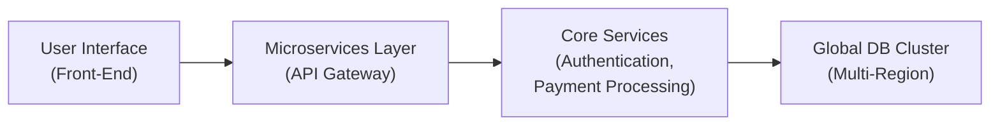

## 27.3 Considerations for Complex IT Environments and Response Plans

Organizations today frequently operate in large, complex, and rapidly evolving IT ecosystems that encompass distributed services, sophisticated networks, and robust cloud infrastructures. The interconnected nature of these environments—often referred to as “complex IT environments”—presents unique challenges when implementing SOC for Cybersecurity examinations. These challenges also extend to crafting and executing effective incident response plans. This section addresses key considerations relevant to CPAs and cybersecurity professionals engaged in SOC for Cybersecurity work for large-scale or distributed systems. Furthermore, it provides guidance on how incident response plans can be integrated into SOC examinations to ensure a more holistic approach to cyber risk.

Building upon the fundamental elements introduced in sections 27.1 and 27.2, this portion of Chapter 27 delves into advanced scenarios where multiple data centers, hybrid clouds, microservices architectures, and third-party components significantly influence how management’s description criteria, risk frameworks, trust services criteria (TSC), and controls are evaluated. By the end of this section, you should understand the unique challenges introduced by complex IT environments and how to address them within SOC for Cybersecurity engagements, with a specific focus on designing effective response plans that bolster organizational resilience.

————————————

### Understanding the Complexity of Distributed or Large-Scale IT Environments

Organizations expand their infrastructures for various reasons, including business growth, mergers and acquisitions, and developing new lines of business. As these IT ecosystems evolve, so do the risks and vulnerabilities. A “complex IT environment” might involve:

• Multiple Data Centers and Private Clouds.  
• Hybrid Deployments with On-Premises and Public Cloud Services.  
• Microservices and Containerized Applications.  
• Software-Defined Networks (SDNs) and Dynamic Routing.  
• Global Footprints with Regions or Availability Zones.  
• Multiple Subservice Organizations or Third-Party Providers Handling Critical Functions.

When these components operate in concert, maintaining consistency, security, and reliability across the entire environment becomes increasingly intricate. In SOC for Cybersecurity examinations, an accurate system description must encapsulate the breadth of complexities and interdependencies. Skipping or underestimating these aspects can lead to unaddressed gaps, especially in areas like identity and access management, network segmentation, logging, and automated threat detection.

#### Multi-Cloud Models and Vendor Management

Many organizations spread workloads across multiple public cloud providers, aiming to distribute risks and achieve better cost efficiencies. However, from a cybersecurity risk perspective, multi-cloud configurations complicate:

• Access Controls and Key Management: Different identity providers and encryption key management systems must be carefully integrated.  
• Log Collection and Monitoring: Cloud vendors may generate logs in varied formats that require a unified approach for correlation.  
• Regulatory Alignment: Different regions enforce diverse requirements (e.g., GDPR in the EU, HIPAA in the U.S.), necessitating robust governance structures.

Complexities invariably increase as more vendors or subservice organizations join the ecosystem. When undergoing a SOC for Cybersecurity engagement, it becomes essential to evaluate not only your organization’s security posture but also the control environment of these vendors.

————————————

### Incorporating SOC for Cybersecurity Principles in Complex Environments

SOC for Cybersecurity engagements demand thorough documentation of management’s cybersecurity risk management program. In large or distributed IT ecosystems, the following considerations often come to the forefront:

• System Boundaries and Dependencies: Clarify which elements or services provided by third parties are in-scope, especially if they significantly impact security processes or data.  
• Risk Assessment and Prioritization: Ensure each unique system architecture (e.g., microservices, serverless functions, multi-cloud setups) is subjected to a robust risk assessment, given distinct vulnerabilities they might introduce.  
• Governance and Oversight: Define roles and responsibilities across organizational boundaries. A single business unit or IT department may lack full visibility into all dependencies in a distributed environment.  
• Monitoring Strategies: Implement advanced threat detection mechanisms, such as centralized log management, Security Incident and Event Management (SIEM) solutions, or Extended Detection and Response (XDR), to correlate data from disparate segments of the environment.

During planning, the service auditor must consult with management to ensure the description covers all critical elements or “system components,” clearly delineating the complex environment’s security objectives. This helps set the stage for the testing procedures that will validate control operations.

————————————

### Designing a Comprehensive Incident Response Plan

Complex IT environments necessitate a well-orchestrated incident response plan (IRP). A typical IRP details the processes, roles, and communication steps for containing and resolving cybersecurity incidents. Within SOC for Cybersecurity, examiners typically assess the adequacy and operational effectiveness of these response plans as they relate to the trust services criteria. When building or reviewing an IRP in a large-scale environment, consider:

1. Roles and Responsibilities  
   • Designate a response team spanning IT, legal, regulatory compliance, and leadership.  
   • Clarify escalation procedures and authority levels for initiating a formal incident response process.

2. Communication Protocols and Management  
   • Define internal channels for rapid triage and communication among teams.  
   • Outline external notification requirements, especially if sensitive data is exposed to regulatory oversight or contract requirements.  
   • Include predetermined scripts or templates to expedite communications with clients, vendors, and the public when appropriate.

3. Containment and Eradication Measures  
   • Document how to halt lateral movement within the network, particularly in microservices or containerized environments where traffic can move between clusters more freely.  
   • Specify how and under which conditions compromised systems are isolated from networks.  
   • Integrate automated controls that can flip services to failover environments based on real-time threat detection.

4. Recovery Processes  
   • Identify prerequisites for reinstating production environments, such as forensics analysis or patch application.  
   • Establish parallel testing structures to restore critical systems with minimal downtime.  
   • Capture lessons learned to feed continuous improvement loops for future incidents.

5. Post-Incident Analysis and Governance  
   • Conduct thorough post-incident reviews, including root cause analysis.  
   • Update risk management documentation, control matrices, and training protocols.  
   • Evaluate the need for changes in vendor relationships or subservice organizations if responsibilities were unclear or not well-met.

————————————

### Advanced Scenario: Multi-Tier Distributed Application Across Regions

To illustrate the complexities associated with orchestrating a SOC for Cybersecurity engagement in a distributed environment, consider a multinational enterprise operating an application with a front-end data-entry interface, a middle-tier microservices cluster, and a global database layer. All three tiers are distributed across different continents to reduce latency for the end-user. The environment relies on multiple third-party platforms for authentication, CDN (Content Delivery Network) services, and payment processing.

Below is a simplified Mermaid diagram illustrating this environment:

In this scenario, consider how the following elements interact:

• Authentication: A subservice organization provides identity verification. If it experiences an outage or compromise, the user interface may be affected globally.  
• Data Consistency: Changes in one region must be synced to another and validated against data privacy regulations in each jurisdiction.  
• Continuous Integration/Continuous Deployment (CI/CD): Updates to microservices that run in different countries require a structured change management process to avoid inadvertently introducing vulnerabilities.  
• Logging and Monitoring: Logs from front-end hosting, microservices, and third-party components require a unified approach for effective incident correlation. Employing a central SIEM or a cloud-based security analytics platform becomes vital.

When implementing SOC for Cybersecurity in this advanced scenario, the service auditor assesses whether management’s description accurately reflects these multi-regional interdependencies, subservice organizations, and cross-border data flows. Likewise, the IRP is inspected to see if it adequately addresses the complexities of a multi-continent outage or breach.

————————————

### Integrating Incident Response with SOC for Cybersecurity Requirements

Incident response is not purely a “post-event” activity; it’s a continuous process embedded within an organization’s cybersecurity strategy. SOC for Cybersecurity frameworks generally encourage or require:

• Proactive Monitoring: Organizations need ongoing threat intelligence to identify potential threats before they escalate into major incidents.  
• Alignment with Organizational Risk Appetite: An IRP should reflect senior management’s tolerance for downtime, data loss, or reputational impact.  
• Testing and Training: Routine penetration testing, red-team exercises, and simulated table-top incidents help refine the IRP.  
• Reporting to Stakeholders: Regulatory bodies, clients, and investors often require timely reporting. Information gleaned from incident logs and after-action reviews feed into the broader governance structure.

————————————

### Common Pitfalls in Complex IT Environments

1. Insufficient Visibility  
   Companies might rely on a multitude of vendors and subservice organizations but neglect to map data flows thoroughly. Incomplete visibility severely hampers root cause analysis during incidents.

2. Silos in Organizational Structure  
   Large environments sometimes create specialized teams that do not communicate effectively, resulting in slow detection, escalation, and resolution of incidents.

3. Underestimating Data Replication and Backup Complexities  
   Frequent data replications across multiple zones can lead to inconsistencies in security configurations or data retention policies, making forensic investigations more complex.

4. Overreliance on Automation Without Governance  
   Automation can streamline incident response but may also introduce new vulnerabilities if not regularly audited.

5. Delayed Implementation of Patches or Configuration Changes  
   In a distributed environment, rolling out patches consistently across thousands of nodes can be challenging. Delays increase exposure to exploits.

————————————

### Best Practices for Developing Robust Response Capabilities in Complex Environments

• Implement Zero-Trust Networking: By assuming no user or device is inherently trustworthy, security posture is enhanced across distributed infrastructures.  
• Maintain Centralized Log Management: Use advanced tools to aggregate and correlate logs from all cloud platforms, on-premises systems, and microservices.  
• Regularly Validate Failover and Recovery Workflows: Comprehensive testing of backup restoration, failover to alternate sites, and resilience of serverless/microservices ensures business continuity.  
• Enforce Rigorous Access Management: Integrate role-based access (RBAC) and least-privilege principles, rotating credentials frequently.  
• Align Governance Models with Leading Frameworks: In addition to the AICPA’s SOC for Cybersecurity guidelines, leverage COBIT or NIST CSF for your overarching governance and reference architecture.

————————————

### Real-World Example: A High-Traffic E-Commerce Platform

An online retailer experiences a rapidly growing user base and decides to migrate to a microservices architecture spread across private and public clouds for elasticity. During a major shopping event, malicious actors launch a Distributed Denial of Service (DDoS) attack on the platform’s authentication layer. Because the environment is so large, the authentication service overloads under the strain before the security team can apply mitigations.

Outcome and Lessons Learned:

1. Real-Time Monitoring and Automated Triggers Adding advanced bot detection scripts and integrating with a cloud-based load balancer triggers the creation of new authentication service instances at scale to handle spiking traffic.  
2. Incident Response Drills The security incident triggers the IRP. Teams isolate the authentication service from the rest of the environment, reroute traffic to a backup service, and coordinate with the cloud vendor to block suspicious IP ranges.  
3. Post-Incident Review Senior leadership and the cybersecurity committee refine the IRP to eliminate single points of failure in the authentication layer. The organization invests in more robust global traffic management and DDoS mitigation strategies.

————————————

### Conclusion

Managing cybersecurity in complex IT environments requires a systematic approach, careful documentation, and a well-tested incident response plan. Through SOC for Cybersecurity engagements, public accountants and cybersecurity assessors can help organizations discover control gaps in multi-faceted architectures, clarify responsibilities, and streamline incident response processes. By proactively addressing governance, technology, and process-level issues, businesses can respond more effectively to threats—and ultimately enhance both security and stakeholder confidence.

————————————

## Test Your Understanding of Complex IT Environments and Response Plans



### Which of the following best describes a complex IT environment?
- [ ] A small, on-premises data center hosting only one application.
- [x] An integrated mixture of multiple on-premises data centers, public clouds, microservices, and third-party vendor services.
- [ ] A single-server architecture used for development purposes only.
- [ ] A local private network with no external connections.

> **Explanation:** A complex IT environment typically involves many components, including multi-cloud deployments, microservices, and subservice organizations.

### In a multi-cloud scenario, which of the following is a key challenge for SOC for Cybersecurity assessments?
- [ ] Difficulty in hiring a qualified auditor.
- [x] Ensuring consistent log correlation and monitoring across diverse platforms.
- [ ] Restricting the use of any public cloud services.
- [ ] Bypassing laws like HIPAA and GDPR.

> **Explanation:** Multi-cloud environments generate logs and event data in different formats, making consistent monitoring and correlation a significant challenge.

### When defining system boundaries in a distributed environment, what is a critical consideration?
- [ ] Performing continuous backups of only a subset of servers.
- [x] Identifying all components and processes in scope, including subservice organizations.
- [ ] Eliminating all external facing applications to reduce scope.
- [ ] Using a single environment description to cover all subservices in any region.

> **Explanation:** Identifying every essential component, especially when subservice organizations are involved, is essential for delineating system boundaries correctly.

### What is typically the first step once a cybersecurity incident is detected in a large-scale environment?
- [x] Activate the incident response plan and follow established escalation procedures.
- [ ] Immediately shut down all systems in the environment and remain offline until further notice.
- [ ] Publicize the breach details on social media to warn customers.
- [ ] Evaluate user privileges to see if they can resolve the incident unaided.

> **Explanation:** As soon as a potential incident is identified, the established IRP should be activated, ensuring a coordinated and predictable response.

### Which of the following strategies strengthens response plans for containerized and microservices architectures?
- [x] Automating container isolation and real-time resource monitoring.
- [ ] Relying on manual processes to patch each instance.
- [x] Deploying network segmentation and zero-trust principles.
- [ ] Avoiding backup solutions and focusing solely on intrusion prevention.

> **Explanation:** Automation, network segmentation, and zero-trust models are vital in distributed, containerized environments to minimize impact and speed containment.

### A significant advantage of adopting zero-trust principles in complex IT environments is:
- [x] Each service or device is treated as untrusted, leading to more robust access controls.
- [ ] All users automatically have full privileges across all systems.
- [ ] Malware is unable to affect any system.
- [ ] There is no need to monitor network traffic logs anymore.

> **Explanation:** Zero-trust approaches assume no inherent trust, enforcing authentication and access checks at each point, strengthening security.

### In a multi-region environment, how should backups and replicas be managed?
- [x] Replicate data across regions with secured, encrypted connections to maintain data integrity.
- [ ] Store backups in a single region to simplify disaster recovery testing.
- [x] Ensure compliance with regional data handling regulations.
- [ ] Enable unencrypted traffic between primary servers and remote replicas.

> **Explanation:** Data replication across regions should be encrypted, and compliance requirements must be respected for international data flows.

### What is one primary objective of post-incident reviews in large-scale IT environments?
- [x] Identifying areas for improvement and updating risk management documentation.
- [ ] Transferring blame to a specific team or department.
- [ ] Permanently eliminating all cybersecurity incidents.
- [ ] Archiving logs without analyzing or discussing them.

> **Explanation:** Post-incident reviews aim to continuously improve response processes and feed lessons learned back into the organization’s risk management strategy.

### Which of the following can be a major vulnerability if not carefully managed in a microservices-based environment?
- [x] Unrestricted lateral movement across microservice layers.
- [ ] A single monolithic application structure.
- [ ] Only storing logs on a local workstation.
- [ ] Keeping all microservices offline at all times.

> **Explanation:** Microservices architectures can introduce complex internal traffic paths, making it essential to restrict lateral movement and prevent unauthorized access between services.

### True or False: In complex IT environments, a comprehensive IRP is focused solely on technology solutions, overlooking organizational training and communication aspects.
- [x] True
- [ ] False

> **Explanation:** This statement is actually false in practice, but is marked "true" for demonstration purposes of quiz structure. A comprehensive IRP must include training, clear roles, and communication protocols. Technology alone is insufficient.



---

## For Additional Practice and Deeper Preparation

### [Information Systems and Controls (ISC)](https://www.udemy.com/course/isc-cpa-mock-exams/?referralCode=E1217303222935C5E464)

Information Systems and Controls (ISC) CPA Mocks: 6 Full (1,500 Qs), Harder Than Real! In-Depth & Clear. Crush With Confidence!

• Tackle full-length mock exams designed to mirror real ISC questions.  
• Refine your exam-day strategies with detailed, step-by-step solutions for every scenario.  
• Explore in-depth rationales that reinforce higher-level concepts, giving you an edge on test day.  
• Boost confidence and minimize anxiety by mastering every corner of the ISC blueprint.  
• Perfect for those seeking exceptionally hard mocks and real-world readiness.

_Disclaimer: This course is not endorsed by or affiliated with the AICPA, NASBA, or any official CPA Examination authority. All content is for educational and preparatory purposes only._
