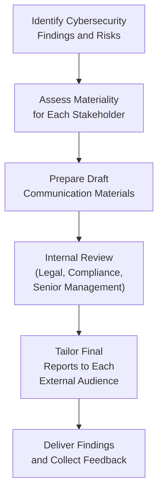

## 27.4 Communicating Cybersecurity Findings to External Stakeholders

Effective communication of cybersecurity findings to external stakeholders is pivotal for any organization implementing or undergoing a SOC for Cybersecurity examination. These findings must be delivered in a way that accurately portrays the organization’s cybersecurity risk posture without diluting or overstating critical information. From boards of directors to regulators and the wider public, each external audience has unique priorities and information requirements. A well-structured communication strategy can build trust, fulfill regulatory duties, and encourage informed decision-making.

In this section, we will explore the importance of effective communication, consider legal and ethical responsibilities, compare different channels of external reporting, and provide best practices and case studies to illustrate how to approach cybersecurity disclosures. This discussion will be particularly relevant to CPAs offering IT assurance and advisory services, aligning both with AICPA guidelines and broader industry standards such as COSO, COBIT, and NIST.

  
### The Importance of Communicating Cybersecurity Findings

Cybersecurity findings typically include vulnerability assessments, risk analyses, incident response metrics, policy compliance checks, control deficiencies, and overall maturity ratings. The results of a SOC for Cybersecurity engagement grant valuable insights into how well an organization protects its systems and data from cyber threats. Properly communicating these insights helps external stakeholders:

• Understand risk exposure: Stakeholders such as investors, regulators, and the public want assurance that the entity is aware of and actively managing cyber risks.  
• Make strategic decisions: Boards and senior management rely on robust, concise reporting to inform business strategies regarding resources allocated to cybersecurity.  
• Comply with legal and regulatory requirements: Organizations in regulated industries must maintain transparency on data protection, demonstrating continuous compliance with laws like GDPR, HIPAA, or government-specific mandates.  
• Build market confidence: Disclosing cybersecurity performance (including breaches and improvements) can foster public trust and demonstrate accountability.  
• Foster accountability and oversight: Clear disclosures allow regulatory bodies and oversight committees to evaluate the entity’s cybersecurity posture effectively.

  
### Stakeholder Considerations

Communicating cybersecurity findings goes far beyond a single report. Stakeholders differ in their technical knowledge, tolerance for risk detail, and desired frequency of communication. CPAs must tailor their language, scope, and presentation to ensure each group receives the appropriate level of information.

#### Boards of Directors and Audit Committees
• Typically less technical; require plain language.  
• Concerned with high-level risks and potential impact on strategic objectives, corporate governance, and reputation.  
• Expect compliance with laws and standards (e.g., Sarbanes-Oxley in the U.S.).  
• Desire actionable recommendations and progress updates to track improvement.

#### Regulators (e.g., SEC, State Agencies, Industry-Specific Bodies)
• Mandate specific disclosure formats, timetables, and thresholds for reporting significant cyber incidents.  
• May require immediate notifications of breaches based on severity.  
• Prioritize compliance over extended narrative.  
• Require consistent, truthfully represented data to confirm the organization’s internal controls meet regulatory standards.

#### Public Stakeholders
• Include customers, vendors, suppliers, investors, and media outlets.  
• Less tolerant of jargon; need a balance of transparency and brevity.  
• Highly concerned with privacy, identity protection, and personal data security concerns.  
• More likely to respond strongly to perceived corporate negligence, leading to brand image repercussions and potential financial losses.

  
### Legal and Ethical Responsibilities

When engaging in cybersecurity communications, CPAs must adhere to ethical guidelines and maintain independence for assurance services. This often implies a delicate approach:

• Confidentiality: While transparency is crucial, disclosing too many granular details about system configurations or security measures could unintentionally aid attackers.  
• Accuracy: Overstating or understating cybersecurity achievements or incidents can mislead stakeholders and breach professional codes of conduct.  
• Completeness: Omission of significant issues can raise legal complications.  
• Consistency: Sticking to recognized frameworks (e.g., AICPA SOC guidance, NIST CSF, COSO-based internal control frameworks) fosters comparability and reliability.

  
### Defining the Communication Approach

Crafting an effective cybersecurity communication approach involves several steps. The following Mermaid diagram provides a high-level overview of the methodology for preparing, reviewing, and delivering cybersecurity findings to external audiences:

  
#### Identify Cybersecurity Findings and Risks
Collect the relevant data from your risk assessments, SOC for Cybersecurity engagements, vulnerability scans, incidents, remediation status, and any other relevant security controls. 

#### Assess Materiality for Each Stakeholder
Determine which findings are likely to influence each stakeholder’s decisions. An internal materiality assessment helps the organization prioritize the most critical points to convey.

#### Prepare Draft Communication Materials
Organize the communication by stakeholder group, focusing on the appropriate level of technical detail and emphasizing potential impacts, remediations, and timelines.

#### Internal Review (Legal, Compliance, Senior Management)
Before public or regulatory dissemination, all disclosures undergo an internal review to validate accuracy, ensure legal compliance, and confirm alignment with broader organizational strategy. 

#### Tailor Final Reports to Each External Audience
Using the feedback from your internal review, finalize audience-specific disclosures that adhere to style, format, and content needs—always balancing transparency with security.

#### Deliver Findings and Collect Feedback
Issue communications formally (e.g., board presentations, regulatory submissions, or press releases). Encourage questions and clarifications from external stakeholders, maintaining open communication channels.

  
### Communicating with Boards of Directors

Reporting cybersecurity findings to boards of directors often takes the form of presentations, executive summaries, or regular dashboard reports. These communications emphasize strategic implications rather than technical specifics.

• Highlight operational, financial, reputational, and regulatory risks from cybersecurity gaps.  
• Provide concise metrics (e.g., critical vulnerabilities discovered, incident response times, patch management cycles).  
• Demonstrate a linkage between cybersecurity maturity and corporate growth or strategic initiatives.  
• Use consistent frameworks (like COSO or NIST CSF) to illustrate improvements or ongoing initiatives in the context of recognized industry standards.  
• Clearly articulate remediation strategies, budget implications, and timelines for implementing new controls.

A recommended approach when dealing with boards is to translate technical vulnerabilities into economic or strategic language. Instead of detailing software vulnerabilities, emphasize potential disruptions to core business outcomes and the costs of ignoring or deferring improvements.

  
### Communicating with Regulators

Regulators have exacting requirements for cybersecurity disclosures, often stipulating not only when but how organizations should communicate. For instance, some jurisdictions require immediate breach notifications if data belonging to citizens has been compromised. Others may demand periodic submissions demonstrating compliance with privacy and data protection laws.

When communicating with regulators:

• Adhere strictly to mandated formats and deadlines.  
• Provide factual summaries of incidents, root causes, remedial measures, and improvements.  
• Avoid over-generalizations; regulators expect precise references to controls, test results, and relevant frameworks.  
• Maintain a consistent narrative with previously submitted reports to uphold credibility.  
• Collaborate closely with legal counsel and compliance departments to meet statutory obligations without overexposure of security details.

Regulators often request subsequent follow-up or confirmation of remediation steps, so plan for ongoing discussions rather than a single point of contact.

  
### Communicating with the Public

Public-facing communications regarding cybersecurity findings are delicate. On the one hand, organizations aim to demonstrate transparency and accountability; on the other, they must avoid panic, reputational harm, or inadvertently sharing sensitive operational details that may further compromise security.

• Keep language accessible and free of technical jargon.  
• Express empathy and responsiveness in the event of data breaches or security incidents impacting consumers.  
• Provide practical advice if needed (e.g., steps customers can take to protect themselves).  
• Balance the need to maintain reputational trust with the legal obligation to disclose critical breaches.  
• Offer consistent, clear, and timely updates as the investigation evolves or after a breach is contained.

Case studies abound where well-intentioned but poorly executed disclosure caused greater reputational damage than the breach itself. By confirming facts prior to disclosure and anticipating common consumer questions, organizations can better manage public perception and demonstrate a commitment to safeguarding data.

  
### Level of Detail and Granularity

Deciding how much detail to share is a recurring challenge. Too little information can appear evasive or noncompliant; too much information may jeopardize ongoing investigations or invite opportunistic cyber threats. Generally, keep these factors in mind:

• **Risk of Exploitation:** If a vulnerability is yet to be patched, it should not be publicized in detail.  
• **Relevancy to Stakeholder Decisions:** Boards may need more detail than the public, who only require sufficient context to gauge potential harm.  
• **Public Sensitivity:** Certain personal data breach scenarios require immediate notification by law (e.g., GDPR sets strict timelines).  
• **Regulatory Timing:** Some regulatory bodies mandate confidentiality during ongoing investigations, deferring public announcements until after certain steps have been completed.

Striking the right balance is often aided by multiple layers of internal review—legal, compliance, and senior cybersecurity leadership. This approach helps ensure that each proposed disclosure is aligned with laws, frameworks, and ethical considerations.

  
### Handling Negative Findings or Breach Disclosures

Communicating adverse outcomes, like major control deficiencies or security breaches, can be one of the most challenging tasks for companies and their CPAs. Nonetheless, prompt and accurate disclosure is often a legal requirement and essential for maintaining trust.

1. **Acknowledge the Incident**  
   Provide a factual, objective overview of what happened, who is affected, and what data or systems were impacted.

2. **Explain the Response Effort**  
   Demonstrate accountability by outlining steps taken to mitigate damage, conduct root cause analysis, collaborate with law enforcement if necessary, and prevent future recurrence.

3. **Describe the Remediation Plan**  
   Summarize the actions in progress, timelines, resource allocations, and how you will monitor and measure the plan’s effectiveness.

4. **Offer Support**  
   If individuals are impacted (e.g., customers, employees), communicate remediation assistance (credit monitoring, identity theft protection, hotline support).

5. **Leverage Third-Party Assurance**  
   Refer to the organization’s SOC for Cybersecurity or other independent assessments that substantiate the findings or highlight the seriousness with which the organization approaches remediation.

  
### Challenges and Common Pitfalls

1. **Over-Disclosure**: Sharing unnecessary technical details or future security strategies can amplify risk.  
2. **Under-Disclosure**: Withholding critical information may expose the organization to liability, regulatory fines, or reputational fallout.  
3. **Inconsistent Messaging**: Discrepancies between internal reporting, regulator reporting, and public statements can undermine stakeholder confidence.  
4. **Lack of Coordination**: Failing to involve all relevant departments (IT, legal, compliance, PR, audit) can lead to conflicting or incomplete disclosures.  
5. **Untimely Reporting**: Delays in reporting incidents may be perceived as negligence or attempted cover-ups.

  
### Best Practices

• **Use a Multi-Layer Review Process**: Involve cybersecurity experts, legal counsel, compliance officers, and executive leadership in drafting disclosures.  
• **Link Findings to Industry-Recognized Frameworks**: Reference NIST, ISO 27001, ITIL, COBIT, or COSO to convey credibility and context.  
• **Align with Organizational Risk Appetite**: Tailor reporting to reflect whether the enterprise is conservative or aggressive relative to information-sharing initiatives.  
• **Adopt a “Need-to-Know” Approach**: Disclose enough for each external party to understand the situation, but avoid revealing sensitive details that heighten vulnerability.  
• **Leverage Outside Experts**: Engage cybersecurity consultants or specialized legal advisors for complex or large-scale incidents.  
• **Practice Crisis Simulations**: Use tabletop exercises to test how your organization would communicate externally in a hypothetical breach scenario. This prepares you to respond effectively under real pressure.

  
### Illustrative Case Study: Retail Data Breach

To see these principles in action, consider the hypothetical scenario of a large retail organization discovering a systems breach that potentially exposed customer credit card data. Below is how the organization might communicate with three external stakeholders:

• **Board of Directors** (Executive Session):  
  - High-level summary of the breach timeline and immediate business impact.  
  - Financial ramifications, including potential lawsuits or fines.  
  - Proposed investments in advanced threat detection and hardened network segmentation.

• **Regulators (State Attorney General, PCI Council)**:  
  - Detailed incident report with root cause analysis, timeline, and evidence that forensic log reviews were completed.  
  - Steps taken to ensure PCI DSS controls are patched, re-tested, and certified.  
  - Written remediation plan with milestone tracking and third-party validation results.

• **Public (Press Release and Customer Notification)**:  
  - Statement expressing regret for the incident and acknowledging potential inconvenience.  
  - Simplified explanation of what occurred and the immediate response.  
  - Instructions for customers on how to maintain vigilance against identity theft and how to sign up for free credit monitoring services.

The response in this hypothetical example integrates transparency, accountability, and compliance with relevant directives. Each stakeholder receives information tailored to their concerns and expertise.

  
### Conclusion

Communicating cybersecurity findings to external stakeholders is a delicate balance between transparency, compliance, and risk management. By delivering concise, audience-appropriate messages, organizations can maintain stakeholder trust, uphold legal obligations, and reinforce their commitment to safeguarding data and systems. SOC for Cybersecurity reports serve as a powerful baseline for these communications, ensuring an independent, standardized foundation for assessing and disclosing cybersecurity controls. Armed with the strategies and case examples laid out in this section, CPAs can guide organizations toward building robust, trustworthy, and adaptable communication practices that drive continuous improvement in cybersecurity governance.

  
## Test Your Knowledge: External Cybersecurity Communication Mastery



### Which stakeholder group typically requires cybersecurity information presented in a high-level, strategic format with minimal technical jargon?
- [ ] Regulators
- [x] Boards of directors
- [ ] External auditors
- [ ] Technology vendors

> **Explanation:** Boards of directors often need an executive-level summary of how cybersecurity issues impact strategic initiatives, governance, and corporate objectives. Detailed technical jargon is less effective for that audience.

### What is a key consideration when communicating cybersecurity findings publicly after a data breach?
- [ ] Emphasizing technical control details to showcase the depth of security controls
- [x] Balancing transparency with the need to protect sensitive information
- [ ] Delaying the disclosure to avoid potential damage to the company’s reputation
- [ ] Stating that an investigation is ongoing without providing timelines

> **Explanation:** While public disclosures should demonstrate accountability, releasing overly detailed technical information can inadvertently aid cybercriminals or cause undue alarm. The key is to balance transparency with confidentiality.

### What is the primary purpose of tailoring communication for different audiences?
- [x] To provide each audience with the appropriate level of detail and context
- [ ] To mislead potential threat actors
- [ ] To ensure each audience receives exactly the same information
- [ ] To minimize legal risk by withholding information

> **Explanation:** Different stakeholders have different priorities and levels of expertise. Tailoring communication ensures they receive the necessary insights without revealing unnecessary or overly complicated details.

### Which of the following is a major pitfall in cybersecurity reporting?
- [ ] Conducting multiple internal reviews
- [x] Providing contradictory statements to different stakeholders
- [ ] Following standardized frameworks like NIST or COBIT
- [ ] Classifying data based on sensitivity and audience

> **Explanation:** Inconsistencies across different disclosures or stakeholder groups can raise suspicion and erode trust. Alignment and consistency are critical.

### Which internal function should typically collaborate with cybersecurity teams when preparing external disclosures?
- [x] Legal counsel
- [ ] Only the IT department
- [x] Risk management
- [ ] Customer service

> **Explanation:** A multi-disciplinary approach is essential. In particular, legal counsel ensures disclosures meet regulatory requirements and avoid legal pitfalls. Risk management also provides insight into broader enterprise implications.

### What is a recommended approach if an organization discovers an unpatched vulnerability after a cybersecurity assessment?
- [x] Address the vulnerability promptly before publicly disclosing specific technical details
- [ ] Immediately publicize all information so others can learn from it
- [ ] Withhold details from regulators and only disclose them to the board
- [ ] Ignore the vulnerability if no exploit has been detected yet

> **Explanation:** Public disclosure of unpatched vulnerabilities can expose the organization to additional attacks. It is more prudent to fix the vulnerability before releasing specific technical details.

### Which of the following actions may undermine the credibility of cybersecurity disclosures?
- [x] Inconsistently reporting issues across different official documents
- [ ] Following established legal pathways and guidelines
- [x] Explaining major incidents in a non-technical summary
- [ ] Leveraging a SOC for Cybersecurity report for a standardized baseline

> **Explanation:** When organizations produce inconsistent data or contradictory statements, external parties may question the reliability of all disclosures.

### Why is it important to reference recognized frameworks (like NIST CSF or COSO) in communications with external stakeholders?
- [x] It provides credibility and a standardized context for evaluating controls
- [ ] It allows organizations to avoid explaining their own security controls
- [ ] It guarantees regulators will not require any additional reporting
- [ ] It ensures no additional cybersecurity training is needed for staff

> **Explanation:** Leveraging recognized frameworks shows that the organization aligns with widely accepted practices and offers stakeholders a consistent basis for comparing security controls.

### What is one advantage of using a formal internal review process before issuing external disclosures?
- [x] It helps catch inconsistencies and ensures legal and regulatory compliance
- [ ] It adds unnecessary delays to the process
- [ ] It automatically eliminates the need for public reporting
- [ ] It reduces the scope of cybersecurity controls to expedite sign-off

> **Explanation:** Internal reviews help validate accuracy, messaging, and compliance, thus minimizing the risk of inaccurate or incomplete disclosures.

### A scenario where an organization withholds critical cybersecurity breach information from regulators could lead to which outcome?
- [x] Significant legal consequences and fines
- [ ] Strengthened public trust in the organization
- [ ] Improved board engagement
- [ ] Enhanced reputation for proactive disclosure

> **Explanation:** Withholding key information from regulators can result in legal penalties, reputational damage, or fines if it violates mandatory reporting regulations.



---

## For Additional Practice and Deeper Preparation

### [Information Systems and Controls (ISC)](https://www.udemy.com/course/isc-cpa-mock-exams/?referralCode=E1217303222935C5E464)

**Information Systems and Controls (ISC) CPA Mocks:** 6 Full (1,500 Qs), Harder Than Real! In-Depth & Clear. Crush With Confidence!

- Tackle full-length mock exams designed to mirror real ISC questions.  
- Refine your exam-day strategies with detailed, step-by-step solutions for every scenario.  
- Explore in-depth rationales that reinforce higher-level concepts, giving you an edge on test day.  
- Boost confidence and minimize anxiety by mastering every corner of the ISC blueprint.  
- Perfect for those seeking exceptionally hard mocks and real-world readiness.  

_Disclaimer: This course is not endorsed by or affiliated with the AICPA, NASBA, or any official CPA Examination authority. All content is for educational and preparatory purposes only._
