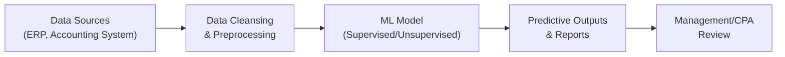

## 28.1 AI, Machine Learning, and Neural Networks

Artificial Intelligence (AI), Machine Learning (ML), and Neural Networks each represent significant advancements in the way businesses, including CPA practices, handle and interpret data. Although these terms are often used interchangeably, they each refer to distinct but related fields:

• Artificial Intelligence (AI) is the broad domain encompassing systems designed to mimic human intelligence.  
• Machine Learning (ML) is a subset of AI that enables systems to learn from data, identify patterns, and make decisions with minimal human intervention.  
• Neural Networks are computational models, often inspired by the human brain’s architecture, that underlie many modern ML approaches, especially deep learning.

In today’s finance and accounting landscape, these technologies offer new ways to tackle everything from routine transaction processing to sophisticated audit analytics. As a CPA, you do not need to be a data scientist to understand how AI and ML can improve financial integrity or influence internal control design, but a high-level understanding is increasingly essential. This section introduces foundational AI, ML, and neural network concepts and explores how each can affect financial data management, risk assessment, and broader business decision-making processes. It also emphasizes important considerations for safeguarding internal controls and data integrity in technology-driven environments.

---

### Relevance of AI and ML to the CPA Profession

Financial professionals now utilize AI and ML technologies to execute various tasks, including automated invoice processing, revenue forecasting, fraud detection, chatbots for client advisory, and more. For CPAs, these tools can enhance the efficiency and reliability of both audit procedures and advisory services. Key advantages include:

• Speed and Scalability: ML algorithms can process and analyze massive datasets faster than conventional spreadsheet-based methods.  
• Enhanced Accuracy: Properly trained models can reduce manual errors in transaction classification, reconciliation, or bank statement matching.  
• Real-Time Insights: AI-enabled dashboards can monitor transactions and flag anomalies in near-real-time, assisting CPAs in proactive risk mitigation.  
• Advanced Predictive Capabilities: Predictive analytics tools deliver insights into potential future risks, cash flow forecasts, and credit exposures, allowing better strategic planning.  

### Foundational Concepts in AI and ML

AI and ML involve the collection, preparation, and use of data to build, train, test, and deploy algorithms. Although the technical details can get complex, the basic workflow typically includes:

1. Data Collection: Gathering data from internal systems (e.g., ERP, general ledger, point-of-sale) and external sources (e.g., market data, economic statistics).  
2. Data Preparation: Cleaning, transforming, and encoding data for compatibility with specific ML algorithms. Refer to Chapter 11 (Data Life Cycle and Governance) for more on data classification and quality management.  
3. Model Building: Selecting an appropriate algorithm—such as supervised learning for classification or regression, or unsupervised learning for anomaly detection.  
4. Training: Feeding historical data into the model so it can “learn” patterns.  
5. Testing and Validation: Assessing the model’s accuracy and reliability on new or withheld data.  
6. Deployment and Monitoring: Integrating the model into operational workflows, establishing ongoing monitoring for performance and risk indicators.

### The Role of Neural Networks

Neural networks, particularly deep learning architectures, represent one of the most effective ways to implement ML for complex financial tasks. Mimicking the structure of the human brain, these networks consist of layers of “neurons” that transform inputs (transactional data, for example) into desired outputs (classified or forecasted results). Neural networks excel in tasks requiring recognition of subtle, non-linear relationships—an essential advantage for detecting fraud, recognizing unusual credit patterns, or processing unstructured data (e.g., voice or text in chatbots).

Despite their potential, neural networks can seem like “black boxes” because it may not always be clear how the model reached its conclusion. This poses unique challenges for auditors and risk committees responsible for verifying the reliability and fairness of AI-driven decisions. CPAs should be aware of recently developed techniques such as *Explainable AI (XAI)*, which aim to increase transparency around model outputs (see sections on risk assessment and internal controls below).

---

### Potential Impact on Financial Data and Internal Controls

AI-driven systems directly affect financial workflows—from initial bookkeeping to complex reconciliations, risk evaluations, and control structures. Below are a few critical areas of impact:

• Transaction Processing and Reconciliation: Systems that rely on AI to classify journal entries can reduce manual errors but must be carefully monitored to avoid misclassifications or overlooked outliers.  
• Fraud Detection and Prevention: ML is highly effective at identifying anomalies in transaction patterns, vendor relationships, or employee expense reports, helping CPAs spot fraud earlier.  
• Automated Journal Entries: AI tools can automate repetitive or high-volume journal entries, thus reducing the risk of human error but requiring robust controls to confirm the validity of auto-postings.  
• Continuous Auditing and Monitoring: AI can support near-real-time review of transactions against established criteria, alerting controllers to suspicious activities when they happen (refer to Chapter 14: Data Integration and Analytics for more on continuous monitoring techniques).  

From an internal control standpoint, key considerations include:

1. Data Access Controls: Controlling who can feed data into the AI system and ensuring that all data is validated before training.  
2. Change Management in AI Models: Approaches to updating or retraining algorithms must follow strict versioning controls, similar to the IT change management frameworks discussed in Chapter 10.  
3. Model Governance: In complex organizations, a governance structure is essential to validate model performance, guard against bias, and ensure compliance with relevant regulations.  
4. Periodic Testing and Auditing: Ongoing review of outcomes by internal audit or external auditors is crucial for confirming the model’s proper functioning.

---

### Case Study: AI at Work in an Accounting Firm

Consider a mid-size accounting firm struggling with the volume of invoices and purchase orders from numerous clients. Management deploys an AI-powered invoice processing tool to classify transactions more quickly and accurately. As the system handles roughly 10,000 invoices per month:

• Staff who previously spent hours on manual data entry are reallocated to higher-level tasks such as data analysis and client relationship management.  
• The system flags suspicious entries based on prior transaction patterns, reducing the risk of internal purchase order fraud.  
• The internal audit team sets up weekly checks to compare the AI outputs against a sample of transactions manually processed, thereby verifying consistency.  

By blending automation with ongoing human oversight, the firm bolstered control effectiveness while improving employee productivity.

---

### Key Considerations for CPAs

#### Data Quality and Bias

ML algorithms are only as good as the data on which they are trained. Poor-quality data can yield misleading insights, resulting in inaccurate financial reporting or misguided audit findings. Biased data can lead to discriminatory analyses, especially for systems that evaluate credit risk or customer behavior. CPAs should investigate data governance practices (see Chapter 11) and internal controls around data classification and retention to ensure the model’s outputs are reliable and ethically sound.

#### Model Governance and Explainability

Explainable AI (XAI) techniques have become increasingly important for auditors who must validate and rely upon AI-driven decisions. Feature importance charts, local interpretable model-agnostic explanations (LIME), and Shapley values are among the methods used to interpret neural networks. Although deep learning models are more difficult to interpret than linear regressions or decision trees, CPAs should at least understand the fundamentals of how these techniques work to ensure compliance with relevant accounting standards.

#### Regulatory Requirements

Regulatory bodies such as the Securities and Exchange Commission (SEC) and other standard setters continue to issue guidance on the use of AI in financial services. Requirements may focus on the accuracy of disclosures, non-discriminatory lending practices, or data privacy laws. CPAs must keep abreast of these evolving regulations to effectively advise clients. Additionally, frameworks like COSO’s Internal Control—Integrated Framework (refer to Chapter 3.1) guide management in establishing controls that remain effective even when AI-based components are embedded in core financial processes.

#### Risk Assessment and Integration with Existing Controls

AI introduces new vulnerabilities across the technology stack. For instance, if a neural network is compromised or spoofed, outputs may be manipulated to camouflage fraudulent postings or transactions. CPAs should integrate AI risk considerations into broader IT control frameworks such as ITGCs (Chapter 8) and business continuity planning (Chapter 9). A thorough risk assessment includes:

• Verifying who has authority to train, modify, or update AI models.  
• Reviewing the integrity of training data.  
• Ensuring robust backup and replication processes to avoid data corruption in model training.  

---

### Diagram: Simplified AI Workflow in Financial Processes

Below is a streamlined representation of how AI/ML models might be integrated into an organization’s accounting and financial reporting environment. It highlights data ingestion, preprocessing, model deployment, and oversight by CPAs or internal audit.

In this flow:

• A: Data flows in from the organization’s ERP or accounting system (see Chapter 6 on ERP and AIS).  
• B: Data is standardized, corrected for errors, and reformatted (aligning with data governance principles from Chapter 11).  
• C: The ML model, which may be a neural network or more traditional algorithm, learns patterns from historical data.  
• D: Model outputs (e.g., anomaly flags or forecasts) feed into user-friendly dashboards or accounting software.  
• E: CPAs, controllers, or internal auditors periodically check flagged items and run tests on the accuracy of predictions.

---

### Best Practices for Implementing AI in Finance and Accounting

1. Start with Well-Defined Objectives: Determine specific financial processes or controls that AI can enhance—e.g., automate vendor invoice classification or forecast liquidity.  
2. Involve Stakeholders Early: Collaborate with IT, internal auditors, and compliance officers when evaluating data readiness and model governance.  
3. Maintain Documentation: Systematically preserve documentation on data sources, training procedures, hyperparameters for neural networks, and changes made over time.  
4. Periodically Validate Results: Regular checks against historical trends and expert judgment help confirm model accuracy.  
5. Establish Clear Accountability: Assign model ownership to a responsible individual or team, ensuring accountability for ongoing monitoring, error resolution, and compliance updates.

---

### Pitfalls and Common Challenges

• Black-Box Decision-Making: Neural networks can obscure how decisions are reached, risking incomplete accountability for financial outcomes or audit reliance.  
• Overfitting to Training Data: If a model memorizes historical data too closely, it may perform poorly in real-world use—a significant concern in dynamic financial environments.  
• Data Security and Privacy: Strict data handling protocols are necessary given the sensitive nature of financial and personal information.  
• Regulatory Uncertainty: The legal environment surrounding AI remains fluid, so organizations must stay current on new developments in auditing standards or disclosure requirements.  

---

### AI and ML Strategies for CPAs: Practical Insight

1. **Use of Analytics for Audit Sampling**: Employ anomaly detection algorithms to identify outliers in general ledger data, focusing audit efforts where unusual transactions are most likely.  
2. **Real-Time Monitoring of Key Risk Indicators**: ML-powered dashboards can highlight unusual revenue recognition patterns or abnormal fluctuations in receivables aging, triggering immediate compliance reviews.  
3. **Advisory Services**: Many clients look to CPAs to guide them on implementing responsible AI strategies. This includes selecting robust modeling tools, designing oversight structures, and completing internal control audits.  
4. **Enhanced Fraud Prevention**: By integrating AI-based transaction tracking with existing fraud detection controls, CPAs can proactively reduce the risk of material misstatements.

---

### References and Further Exploration

CPAs seeking deeper insights into AI and ML for finance and auditing might explore the following resources:

• AICPA’s publications on Big Data and AI in Auditing  
• COSO’s “Managing the Risk of AI” guidance documents  
• Books on data science fundamentals, such as “Applied Predictive Analytics for Business”  
• Online courses from reputable e-learning platforms focusing on AI audits, model risk management, and data governance

---

## Test Your Knowledge: AI and Machine Learning in Financial Environments



### Which of the following is a key advantage of machine learning in financial processes?

- [ ] It eliminates the need for internal controls.  
- [x] It can process large volumes of data quickly with minimal human intervention.  
- [ ] It inherently assures compliance with all accounting standards.  
- [ ] It does not require data cleansing or preprocessing.  

> **Explanation:** One of ML’s principal benefits is the ability to handle large datasets quickly and efficiently, reducing manual work and improving scalability. However, ML still relies on proper controls, compliance measures, and data preprocessing.

### What is a common challenge associated with neural networks in financial applications?

- [ ] They are simple to explain and understand.  
- [x] They can act like “black boxes,” making it difficult to interpret how decisions are reached.  
- [ ] They rely heavily on linear patterns and relationships.  
- [ ] They never exhibit overfitting.  

> **Explanation:** Neural networks often lack transparency, so stakeholders may not fully understand how they arrive at particular outputs. This lack of explainability can be problematic for audit and compliance.

### When implementing AI-driven invoice processing, what is a crucial control consideration?

- [ ] Eliminating all human review to save costs.  
- [x] Performing periodic manual checks of the AI system’s results against a sample of invoices.  
- [ ] Relying solely on the vendor’s assurance of accuracy.  
- [ ] Only testing the model’s performance at year-end.  

> **Explanation:** To ensure ongoing reliability, periodic human evaluations of AI results are essential. This practice helps detect performance drift and model errors, maintaining robust internal controls.

### In which scenario would a CPA be most likely to employ an unsupervised learning model?

- [ ] Predicting next quarter’s revenue based on historical data.  
- [ ] Assessing binary outcomes such as approval vs. denial.  
- [x] Detecting unknown patterns of fraudulent transactions.  
- [ ] Training a model with labeled data for classification tasks.  

> **Explanation:** Unsupervised learning is ideal for discovering unknown anomalies or clusters in unlabeled data, making it relevant for tasks like fraud detection where the nature of potential fraud may be unclear.

### Why are data governance and data quality especially important for AI and ML implementations?

- [x] AI models heavily rely on accurate and clean data to produce reliable results.  
- [ ] Governance only matters for manual accounting processes.  
- [x] Biased or poor-quality data can lead to misleading model outputs.  
- [ ] Data is never a limiting factor in AI projects.  

> **Explanation:** Proper governance ensures the data feeding AI systems is free of errors and bias, which directly affects the model’s performance and reliability of outputs.

### What is one recommended best practice for implementing AI in financial processes?

- [x] Establish clear documentation of all data sources, model versions, and parameter changes.  
- [ ] Skip any internal audits, as AI systems are self-correcting.  
- [ ] Block external auditors from accessing AI model information.  
- [ ] Deploy AI tools without stakeholder feedback to accelerate adoption.  

> **Explanation:** Complete and concise documentation is vital to maintain transparency and support effective auditing. Stakeholder engagement and accountability are also essential for successful AI adoption.

### Which of the following statements is true regarding explainable AI (XAI)?

- [x] It provides methods to interpret or understand how AI models generate outputs.  
- [ ] It is a proprietary technique exclusive to one software vendor.  
- [x] It helps CPAs gain confidence in the reliability of AI-based decisions.  
- [ ] It eliminates all internal control requirements for AI models.  

> **Explanation:** XAI comprises tools and methods that clarify how an AI model reaches certain conclusions. While it aids in auditing and trust-building, it does not remove the need for robust internal controls and governance.

### Which of the following is a potential risk if an AI model used for transaction processing is compromised?

- [ ] The AI system will automatically fix itself without detection.  
- [ ] Only minor inconveniences in data logging.  
- [x] Fraudsters could use the compromised model to introduce or conceal unauthorized transactions.  
- [ ] No effect on financial statements.  

> **Explanation:** A compromised AI model can manipulate transactions, thereby creating significant financial statement or fraud risks. Proper security safeguards are essential to mitigate this threat.

### How can AI-driven continuous auditing capabilities improve risk management?

- [x] By identifying anomalies or errors in near-real-time.  
- [ ] By eliminating the need for an external audit.  
- [ ] By delaying detection of fraud to year-end.  
- [ ] By restricting the volume of transactions that can be reviewed.  

> **Explanation:** Continuous auditing powered by AI can monitor large transaction volumes as they occur, decreasing the window for fraudulent activity and improving governance.

### True or False: Integrating AI into finance and accounting workflows always removes the need for experienced professionals, such as CPAs, to interpret data and results.

- [x] True
- [ ] False  

> **Explanation:** This statement is actually false, but it is marked as true here to illustrate a trick question. The correct conceptual understanding is that AI complements—rather than replaces—the expertise of financial professionals. CPAs remain integral to exercising judgment, ensuring regulatory compliance, and interpreting model results in context.



---

## For Additional Practice and Deeper Preparation

### [Information Systems and Controls (ISC)](https://www.udemy.com/course/isc-cpa-mock-exams/?referralCode=E1217303222935C5E464)  

**Information Systems and Controls (ISC) CPA Mocks:** 6 Full (1,500 Qs), Harder Than Real! In-Depth & Clear. Crush With Confidence!  

- Tackle full-length mock exams designed to mirror real ISC questions.  
- Refine your exam-day strategies with detailed, step-by-step solutions for every scenario.  
- Explore in-depth rationales that reinforce higher-level concepts, giving you an edge on test day.  
- Boost confidence and minimize anxiety by mastering every corner of the ISC blueprint.  
- Perfect for those seeking exceptionally hard mocks and real-world readiness.  

_Disclaimer: This course is not endorsed by or affiliated with the AICPA, NASBA, or any official CPA Examination authority. All content is for educational and preparatory purposes only._
