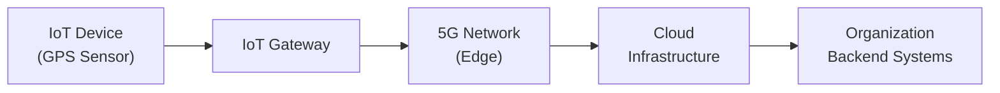

## 28.2 Internet of Things (IoT) and 5G Connectivity Risks

Organizations worldwide are adopting Internet of Things (IoT) devices at unprecedented rates, motivated by operational efficiency, cost reduction, and real-time data insights. In tandem, the rollout of 5G infrastructure has dramatically enhanced wireless network speeds, allowing these connected devices to exchange data faster and more reliably. While these technologies promise considerable benefits, they also carry substantial risks, especially for accountants, auditors, and other professionals overseeing control structures, data integrity, and organizational governance. This section explores how the proliferation of IoT devices expands the attack surface, highlights risks posed by 5G connectivity, and suggests security techniques to safeguard data and maintain compliance with relevant frameworks and regulations.

Introduction to IoT and 5G

The Internet of Things involves embedding sensors, actuators, and internet connectivity into everyday physical objects—from manufacturing equipment and healthcare devices to smart home appliances and city infrastructure. These devices generate vast amounts of data, driving more informed decision-making and automating repetitive tasks. With 5G technology, the speed and capacity of wireless networks have increased exponentially. This high-bandwidth, low-latency communication opens opportunities for real-time analytics, remote monitoring, and globally distributed operations. However, as the number of interconnected devices grows, so do the vulnerabilities that can threaten data confidentiality, integrity, and availability.

The Growing IoT Ecosystem

• Ubiquity of devices: IoT implementation extends from wearables and consumer gadgets to industrial machinery, autonomous vehicles, and smart city systems.  
• Data-driven decision-making: IoT sensors can capture real-time performance metrics and automatically feed analytics tools, enabling predictive maintenance and resource optimization.  
• Complex supply chains: Many IoT components are manufactured by third parties across different jurisdictions, complicating oversight of security features and software updates.  
• Cross-functional impact: IoT usage spans accounting information systems (see Chapter 6) to supply chain management, customer service, and beyond.

How IoT Expands the Attack Surface

IoT devices present a more extensive attack surface than traditional IT systems due to their distributed nature, frequent lack of robust security measures, and connectivity requirements. Each node—whether a temperature sensor in a warehouse or a smartwatch linked to corporate email—can serve as an entry point for malicious actors.

Attack-vector diversity  
Because IoT devices often run on specialized operating systems and firmware, they may not receive timely security patches or be monitored through the same intrusion detection solutions used for servers and endpoints. Consequently, hackers can exploit vulnerabilities in downloaded apps, embedded software, or insecure communication protocols.

Lateral movement risks  
Once a single IoT device is compromised, attackers often pivot to other systems within the organization that share the same network. Cybercriminals can escalate privileges to launch large-scale attacks, harvest sensitive transactional data, or disrupt mission-critical processes, potentially undermining financial reporting integrity.

Lack of standardization  
Industry standards for IoT security—such as guidelines for encryption, patching, or identity management—remain nascent and inconsistently adopted. This lack of uniformity elevates the risk that certain devices within a network will be overlooked, misconfigured, or remain unpatched.

Potential Impact on Financial and Operational Processes

From an accountant’s or auditor’s perspective, the infiltration of IoT devices can affect data reliability and internal controls (see Chapters 8 and 19). A compromised device could feed inaccurate sensor data into a company’s ERP (see Chapter 6), leading to erroneous financial records, miscalculations in inventory valuation, or even fraudulent transactions. Reputational damage can be severe if customers lose trust in an organization’s ability to safeguard private data or ensure consistent product quality.

5G Connectivity: Opportunities and Risks

5G networks provide several advantages over previous wireless standards, including higher throughput, advanced network slicing capabilities for diverse service needs, and ultra-low latency. These benefits substantially accelerate IoT innovations such as autonomous vehicles, telemedicine, and dynamic supply chains.

Yet these same attributes amplify security challenges:

• Rapid data transfer: High volumes of data can move so quickly that real-time monitoring and anomaly detection tools may lag in identifying malicious traffic.  
• Distributed edge computing: 5G enables data processing closer to endpoints, but this also implies multiple edge nodes that must be protected, each with unique configurations.  
• Network slicing: A single physical 5G network can be partitioned into multiple logical sub-networks (slices), each dedicated to a specific function. While beneficial, improper slice management or misconfigurations can expose slices to unauthorized access.

Illustrative Example: Supply Chain Of An Automotive Manufacturer

A large automotive manufacturer uses IoT sensors to monitor the temperature, humidity, and vibration of parts in transit. The sensors transmit real-time data via a 5G network to the manufacturer’s centralized analytics platform. If these devices are compromised, attackers could not only alter telemetry data—leading to inventory mismanagement and downtime—but also systematically infiltrate the manufacturer’s ERP system to manipulate costs, sabotage production, or steal proprietary designs.

Diagram: Typical IoT Connectivity Over 5G

The diagram above outlines a simplified data flow, where an IoT device transmits data through an IoT gateway, then across a 5G network. This data eventually lands in cloud infrastructure and connects back to enterprise systems such as an ERP or financial accounting platform. Each step in this chain demands corresponding security measures—both physical (device hardening) and logical (network segmentation, encryption).

Risk Assessment and Control Framework Alignment

Organizations should integrate IoT risk management into broader governance models, referencing frameworks such as COBIT 2019 (Chapter 3.3) and COSO ERM (Chapter 3.2). These frameworks emphasize a top-down risk assessment approach that addresses technology enablers, process governance, and business objectives.

Key risk areas  
• Data integrity: Sensor data can be compromised if cryptographic mechanisms or access controls are weak.  
• Availability: DDoS attacks against IoT devices or 5G networks can disrupt operations.  
• Privacy: Personally Identifiable Information (PII) from wearable devices or location trackers can be exposed if not properly encrypted (see Chapter 19).  
• Compliance: New and emerging regulations may impose specific standards for IoT device security, data retention, and cross-border data transfers.

Recommended Security Approaches

Defensive strategies for IoT and 5G networks must align with the broader cybersecurity posture described in Chapters 16–19. Specific recommendations include:

Network Segmentation  
Place IoT devices on isolated subnets or dedicated network slices. Implement firewalls and intrusion detection/prevention systems (see Chapter 17). Restrict lateral movement by controlling which systems can interact with IoT endpoints.

Zero-Trust Architecture  
As introduced in Chapter 16.2 and 16.4, zero trust means no user or device is automatically trusted. Continual re-authentication, monitoring, and context-aware access policies help ensure that even legitimate devices do not become backdoors into critical infrastructure.

Robust Device Authentication  
Use strong credentials, digital certificates, or other forms of authentication to ensure that only authorized devices connect to the network. Multi-factor authentication (MFA) or hardware-based device identity solutions further reduce the risk of device spoofing.

Secure Firmware and Patch Management  
Implement routine processes for firmware updates, leveraging secure channels. Sensors are often overlooked in patch cycles, but must be regularly updated to address vulnerabilities. When possible, configure automated alerts to flag outdated devices.

Encryption of Data in Transit and at Rest  
Employ end-to-end encryption for IoT data traveling through 5G networks, particularly if signals pass through public or untrusted segments. Data at rest—both on the device and in the cloud—should also be encrypted to mitigate unauthorized access (see Chapter 19).

Identity and Access Management (IAM)  
Adopt role-based or attribute-based access control. Ensure that the principle of least privilege is enforced, limiting who can query or modify IoT-generated data (see Chapter 18).

Continuous Monitoring and Logging  
Operationalize real-time analytics to detect anomalies in data streams—such as unexpected device behaviors or unknown IP addresses. Collect logs from IoT endpoints and 5G network segments, feeding them into centralized security information and event management (SIEM) solutions.

Practical Considerations

Financial professionals can quickly face difficulties if they do not fully grasp the technical intricacies of IoT devices, their firmware dependencies, and the operations environment they inhabit. A few practical tips include:

• Collaborative audits: Work with IT and engineering to fully understand the device lifecycle, from procurement to decommissioning.  
• Third-party oversight: Develop vendor management programs (see Chapter 7.5) to ensure that integrators and hardware manufacturers adhere to recognized security standards.  
• SOC reports: For large-scale IoT providers or 5G service providers, request SOC 2® or SOC for Cybersecurity reports (Chapters 22–27) to gain insights into their control environment.  
• Incident response readiness: Prepare an incident response playbook specific to IoT, factoring in the extended device footprint (see Chapter 20).  

Case Study: Smart HVAC System Breach

A multinational retailer installed a “smart” HVAC system in its warehouses for efficient temperature control and cost savings. Each HVAC unit gathered air quality and temperature data, then connected over a 5G network to an IoT management console. Attackers successfully exploited a vulnerability in the HVAC firmware, which allowed them to pivot into the retailer’s internal network. They harvested sensitive customer data and orchestrated a ransomware attack that froze the retailer’s logistics operations. The organization faced significant PR backlash, regulatory scrutiny, and financial losses from both ransom payments and operational downtime.

Key Takeaways from This Case

• Routine patching is a necessity, not a luxury, for every connected device.  
• Zero-trust policies that limit inter-segment access can minimize damages even when one device is compromised.  
• Incident response teams must account for embedded devices in crisis management.  

Looking Ahead

As IoT and 5G continue to evolve, so do associated risks. Entities that effectively harness these technologies in risk-conscious, well-managed ways stand to gain a competitive advantage while preserving stakeholder trust. Familiarity with relevant standards, continuous improvement in cybersecurity practices, and well-rounded collaboration between finance, operations, and IT functions are paramount.

References and Further Reading

• National Institute of Standards and Technology (NIST) IR 8259 Series: Foundational Cybersecurity Activities for IoT Device Manufacturers  
• Internet Engineering Task Force (IETF) RFC 8576: Internet of Things (IoT) Security: State of the Art and Challenges  
• “Security for 5G Mobile Wireless Networks” by Xiaofeng Chen et al. (ACM Surveys)  
• Chapters in this Guide: Chapter 16 (Foundations of Cybersecurity), Chapter 17 (Security Architecture and Network Management), Chapter 19 (Data Confidentiality and Privacy Controls)  

Use these references to deepen your technical understanding and gain practical insights into deployment, maintenance, and audit processes relating to IoT and 5G.

## Strengthen Your Skills: IoT and 5G Connectivity Security Quiz



### IoT devices expand the organizational attack surface primarily because:
- [x] They often lack robust, enterprise-grade security controls.  
- [ ] They actively repel most known attacks by default.  
- [ ] They do not require updates or patches after deployment.  
- [ ] They focus exclusively on encrypting data, making them self-secure.  

> **Explanation:** Many IoT endpoints have minimal built-in security, receive infrequent patches, and are widely distributed, all factors that can enlarge the potential attack surface.

### Which statement best describes a unique risk introduced by 5G connectivity in IoT environments?
- [ ] All data automatically becomes fully encrypted.  
- [x] Ultra-low latency can allow rapid, large-scale attacks to go undetected.  
- [ ] Network slicing ensures complete isolation from other traffic.  
- [ ] 5G automatically protects IoT devices from malware.  

> **Explanation:** While 5G provides greater bandwidth and lower latency, it can also facilitate extremely fast data movement—potentially outpacing classic monitoring and detection methods.

### A compromised IoT device could most directly impact which of the following financial processes?
- [ ] Seasonal marketing campaigns unrelated to finance.  
- [x] Inventory valuation and cost of goods sold calculations.  
- [ ] Daily weather reporting for the news.  
- [ ] Office layout planning.  

> **Explanation:** IoT sensors in warehouses or manufacturing lines can feed information directly into ERP or accounting systems. Tampering with such devices can skew inventory data and financial figures.

### What is a major hurdle in standardizing IoT security?
- [x] Inconsistent adherence to security guidelines among manufacturers.  
- [ ] Too many identical standards enforced globally.  
- [ ] A universal, mandatory IoT firmware is already enforced.  
- [ ] Lack of consumer interest in IoT devices.  

> **Explanation:** The IoT market is fragmented with diverse manufacturers, each implementing different security features. This inconsistency hinders a universal standard.

### Which approach is recommended to minimize lateral movement risks if one IoT device is compromised?
- [x] Segment IoT endpoints on dedicated networks or network slices.  
- [x] Adopt Zero-Trust principles across the environment.  
- [ ] Use a single, organization-wide shared credential for all IoT devices.  
- [ ] Avoid deploying patches and updates to maintain system stability.  

> **Explanation:** By isolating IoT devices, organizations reduce the blast radius of a breach. Combining segmentation with a Zero-Trust strategy further restricts movement even if an attacker compromises one endpoint.

### An essential process for maintaining IoT device security is:
- [x] Firmware patch management.  
- [ ] Exposing open ports for ease of debugging.  
- [ ] Using unencrypted connections for simplicity.  
- [ ] Storing device logs locally but never reviewing them.  

> **Explanation:** Proactive, consistent updates to close newly discovered security gaps is critical for all connected devices.

### How does role-based access control (RBAC) enhance security for IoT-generated data?
- [x] It assigns privileges based on user job functions or device categories.  
- [ ] It enables a single user account to manage all IoT assets.  
- [x] It enforces the principle of least privilege.  
- [ ] It automatically patches device firmware.  

> **Explanation:** RBAC limits privileged access to those who need it, thereby reducing the probability of unintended or unauthorized data manipulation.

### Why is continuous monitoring crucial in an IoT and 5G environment?
- [x] High-speed connectivity demands real-time anomaly detection.  
- [ ] Hackers prefer to attack only 4G systems.  
- [ ] IoT devices rarely transfer large amounts of data.  
- [ ] Logs are typically useless for forensics.  

> **Explanation:** Because 5G enables faster data movement, threats can escalate quickly. Continuous monitoring and centralized logging help organizations promptly identify suspicious events.

### Which strategy best addresses the diverse operating systems and hardware found in IoT environments?
- [x] Adopting an overarching security framework and consistent patch policies.  
- [ ] Installing the same OS on all IoT devices regardless of compatibility.  
- [ ] Outsourcing to an unknown third party without an SLA.  
- [ ] Utilizing only manual procedures to handle vulnerabilities.  

> **Explanation:** Employing framework-based policies and consistent patching ensures that organizational security remains unified, even when leveraging multiple device types and vendors.

### A Zero-Trust approach means:
- [x] Never automatically trusting any device or network node.  
- [ ] Allowing all devices to communicate freely once authenticated once.  
- [ ] Combining all devices into a single segment for administrative convenience.  
- [ ] Having minimal policies since trust is implicit.  

> **Explanation:** In Zero-Trust, every single request for access must be evaluated, verifying identity and context to prevent lateral attacks once inside the network.



## For Additional Practice and Deeper Preparation

### [Information Systems and Controls (ISC)](https://www.udemy.com/course/isc-cpa-mock-exams/?referralCode=E1217303222935C5E464)  

**Information Systems and Controls (ISC) CPA Mocks:** 6 Full (1,500 Qs), Harder Than Real! In-Depth & Clear. Crush With Confidence!

- Tackle full-length mock exams designed to mirror real ISC questions.  
- Refine your exam-day strategies with detailed, step-by-step solutions for every scenario.  
- Explore in-depth rationales that reinforce higher-level concepts, giving you an edge on test day.  
- Boost confidence and minimize anxiety by mastering every corner of the ISC blueprint.  
- Perfect for those seeking exceptionally hard mocks and real-world readiness.

_Disclaimer: This course is not endorsed by or affiliated with the AICPA, NASBA, or any official CPA Examination authority. All content is for educational and preparatory purposes only._
