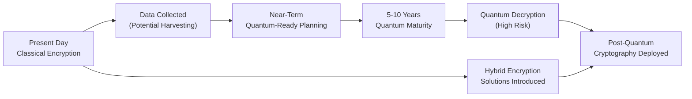

## 28.3 Quantum Computing: Security and Control Implications

Quantum computing is on the horizon as perhaps one of the most transformative technologies for information security and computational processes. Although large-scale, fault-tolerant quantum computers are not yet pervasive, the rapidly accelerating research and development initiatives worldwide signify that quantum computing will no longer remain a futuristic possibility. This section explores the fundamentals of quantum computing, highlights its potential to undermine current encryption systems, and provides recommendations on future-proofing organizational controls and governance to mitigate the associated threats.

Readers should maintain a clear connection to material covered in prior chapters—especially those discussing encryption and cybersecurity controls in Chapters 16, 17, and 19—to place quantum computing in the broader context of information security, enterprise governance, and compliance requirements.

--------------------------------------------------------------------------------

### Understanding Quantum Computing Foundations

Quantum computing uses the principles of quantum mechanics, such as superposition and entanglement, to process information in ways that classical computers cannot replicate. Traditional digital computers operate on bits—discrete 0s and 1s—while a quantum computer uses quantum bits (qubits), which can exist in a superposition state, effectively representing multiple states simultaneously. This exponential leap in parallel processing power gives quantum computing the potential to tackle certain computational problems far more rapidly than classical machines.

#### Classical Bits vs. Qubits

• Classical bits: Represent values of either 0 or 1 at any one time.  
• Qubits: Can represent 0, 1, or any quantum superposition of these states. When multiple qubits become entangled, they can jointly represent and process exponentially more combinations than classical bits.

#### Potential Applications

Quantum computing, while still in its developmental stages, promises a range of groundbreaking applications, including:  
• Optimization problems in logistics, finance, and healthcare.  
• Advanced modeling of molecules for pharmaceuticals and material science.  
• Enhanced artificial intelligence, especially in machine learning tasks.  
• Breaking—or significantly weakening—existing cryptographic algorithms.

--------------------------------------------------------------------------------

### The Quantum Threat to Cryptography

One of the most urgent implications of quantum computing is its capacity to break widely used encryption algorithms, particularly those relying on factorization or discrete logarithms (e.g., RSA, Diffie-Hellman, and elliptic-curve cryptography). As covered in Chapters 19 (Data Confidentiality and Privacy Controls) and 16 (Foundations of Cybersecurity), many financial organizations and government agencies rely heavily on these algorithms to secure data in transit and at rest. The main quantum-relevant algorithms to note are:

• Shor’s Algorithm: Capable of factoring large numbers efficiently, threatening RSA and other factorization-based systems.  
• Grover’s Algorithm: Speeds up brute-force attacks, weakening symmetric ciphers by effectively halving their key space.

#### Timelines and Forward-Looking Assessment

Estimates vary on when quantum computers capable of large-scale cryptanalysis will be operational. Some conservative projections forecast major breakthroughs within 10 to 15 years, while more optimistic views put that figure closer to 5 years. Regardless of the exact timing, “harvest now, decrypt later” tactics are emerging, where adversaries collect encrypted data today with the intention of decrypting it in the future once quantum computers become practical.

This future quantum threat highlights a pressing need for “quantum-safe” or “post-quantum cryptography” (PQC). The National Institute of Standards and Technology (NIST) is already in the process of standardizing new cryptographic algorithms resilient to quantum attacks, signifying a global shift in how we approach information security.

--------------------------------------------------------------------------------

### Quantum-Resistant and Post-Quantum Cryptography (PQC)

Post-quantum cryptography (PQC) refers to cryptographic algorithms that can withstand attacks from both classical and quantum computers. The objective is to deploy encryption schemes and digital signatures that remain secure even when large-scale quantum computers become available. The NIST PQC standardization process involves extensive testing, competition, and vetting of various candidate algorithms such as lattice-based, hash-based, code-based, and multivariate polynomial-based cryptography.

#### Transitioning to PQC

1. Evaluation of Algorithms: Organizations must explore algorithms and libraries that NIST (and relevant international bodies) are likely to approve for general use.  
2. Hybrid Approaches: In the interim, adopting “hybrid” solutions that combine classical protocols with quantum-resistant ones can offer added assurance.  
3. Testing and Integration: Post-quantum encryption schemes must be tested across networks, applications, and embedded systems to ensure adequate performance and interoperability.  
4. Governance and Policy Updates: Enterprises should create transition policies to guide a cost-effective, secure migration to post-quantum algorithms.

A carefully orchestrated, phased approach to cryptographic migration helps mitigate the potential disruptions to daily operations.

--------------------------------------------------------------------------------

### Impact on Organizational Controls and Security Policies

#### COSO and COBIT Alignment

Chapters 3 (Governance, Frameworks, and Regulatory Environment) and 8 (IT General Controls) outlined essential corporate frameworks such as COSO and COBIT for structure and compliance. As quantum computing evolves, organizations must incorporate quantum-specific risk considerations into these frameworks:

• COSO Internal Control—Integrated Framework: Expand the risk identification and assessment processes to include the potential for quantum-based threats.  
• COBIT: Integrate quantum resilience into governance objectives and enablers, addressing data protection, cryptographic management, and third-party risk management.

#### Risk Assessments

Executives and boards of directors should conduct specialized risk assessments to ascertain potential exposure to quantum threats. Five years may sound distant, but cryptographic transitions require significant time and resources, especially in highly regulated industries like banking, insurance, and healthcare. Risk assessment parameters to consider:

1. Data Sensitivity: Confidential financial data, personally identifiable information (PII), and intellectual property have higher risk exposure if intercepted now and decrypted later.  
2. Regulatory Requirements: Healthcare and financial firms bound by HIPAA or PCI DSS face heavier consequences and liabilities if encryption fails in the future.  
3. Vendor and Third-Party Risk: Vendors or outsourcing partners may store or handle sensitive data. If they are not preparing for PQC, organizational data remains at risk.

#### Policies and Procedures

Financial institutions, government agencies, and large multinational corporations must promptly update polices, procedures, and internal controls to reflect quantum-readiness. Examples include standard operating procedures (SOPs) for encryption key creation, secure key backup strategies, and new cryptographic key management solutions that incorporate quantum-resistant algorithms.

--------------------------------------------------------------------------------

### Quantum Cryptography: Beyond Breaking Encryption

While quantum computers threaten certain types of classical cryptography, they also offer new pathways to secure data. Quantum cryptography, most notably Quantum Key Distribution (QKD), leverages the laws of quantum physics to provide unwavering protection against eavesdropping. In QKD:

1. A sender transmits cryptographic keys encoded in qubits—photons in many cases—across a communication channel.  
2. Any unauthorized observation of these qubits permanently alters their state, thus exposing potential intrusion attempts.  
3. This mechanism ensures that legitimate parties can detect eavesdroppers, thereby guaranteeing the integrity and secrecy of cryptographic keys.

#### Quantum Key Distribution in Practice

Current solutions for QKD rely on specialized hardware and short-distance fiber or free-space optical links. For instance, financial institutions running high-security data centers or partner connections within limited geographic ranges have participated in pilot programs deploying QKD to ensure unbreachable key exchanges. Although QKD remains early in adoption and can be cost-prohibitive, its future potential to deploy at scale aligns with the long-term perspective of physically unbreakable key transfer.

--------------------------------------------------------------------------------

### Potential Ethical and Regulatory Implications

As quantum attacks become feasible, regulatory bodies will likely require revision of existing cybersecurity standards, especially around encryption and data management. In Chapter 19, discussions center on privacy laws such as HIPAA and GDPR. Data privacy and data longevity requirements in such regulations can be severely compromised if quantum computing can easily decrypt stored data in a few years. Noncompliance could lead to significant legal and financial consequences.

Moreover, quantum-safe methods themselves might require new disclosures for regulators. For example, organizations might need to demonstrate the quantum resilience of their systems in SOC 2® or SOC for Cybersecurity reporting (see Chapters 24 and 27). Auditors and assurance professionals will need to verify not just the presence of encryption but also its longevity against foreseeable attacks.

--------------------------------------------------------------------------------

### Practical Financial Examples and Case Studies

#### Case Study: Banking Encryption Overhaul

A global banking conglomerate with a 15-year data retention policy realized that sensitive client information is vulnerable if harvested by malicious actors today. The bank’s audit committee initiated a quantum threat assessment, revealing that major cryptographic algorithms in use—particularly RSA 2048-bit—could be inadequate within a decade. The board approved:

1. A phased rollout of hybrid cryptographic solutions, blending classical and quantum-safe algorithms.  
2. An extended timeline of five years to allow for vendor compliance, rigorous testing, and minimal disruption to financial applications.  
3. Employee training programs about new key management systems.

The bank’s timeline also aligned with guidelines from standards-setting bodies, easing the adoption of new encryption protocols in system audits and compliance checks.

#### Scenario: “Harvest Now, Decrypt Later” Attack

A stealth cybercriminal group intercepts corporate or government data and stores the raw, encrypted payload. Although the data is currently unreadable, quantum computers in the future may allow retroactive decryption. Financial statements, intellectual property, and personal health records could be compromised. The scenario underscores:

• The necessity for cryptographic agility.  
• Future-proof compliance strategies that preserve confidentiality through the entire data retention lifecycle.  

--------------------------------------------------------------------------------

### Common Pitfalls and Recommended Best Practices

#### Pitfalls

1. Complacency: Believing quantum threats remain decades away and delaying critical PQC migration steps.  
2. Fragmented Governance: Failing to incorporate quantum risks into the broader enterprise risk management or COBIT processes.  
3. Underestimating Complexity: Quantum-secure migrations are technically and operationally complex. Organizations that treat them as simple drop-in replacements for classical solutions may face critical performance or compatibility issues.

#### Best Practices

1. Roadmapping: Develop a strategic, multi-year road map to transition or adopt quantum-safe cryptography.  
2. Training and Awareness: Train key personnel, including auditors and InfoSec teams, to stay updated about quantum advancements and integration strategies.  
3. Early Testing and Pilots: Introduce pilot projects (e.g., smaller data sets or non-mission-critical systems) to test quantum-resistant algorithms with minimal operational risks.  
4. Collaboration: Engage in industry consortia or research partnerships to share knowledge on quantum developments and reduce costs.  
5. Independent Audits: Conduct specialized audits to evaluate the efficacy of new encryption systems and ensure compliance.

--------------------------------------------------------------------------------

### Visualization of the “Quantum Threat” Timeline

Below is a high-level Mermaid.js diagram depicting the progression from current-day challenges (collecting data) to the quantum threat readiness timeline:

Explanation:  
• In the present day, classical encryption protects data. Bad actors may still harvest data (B).  
• Organizations undertake quantum-resistant planning (C), as quantum computers reach maturity in the next 5–10 years (D).  
• Once powerful quantum decryption capabilities exist (E), non-migrated systems become vulnerable.  
• Post-quantum cryptography (F) and interim hybrid encryption (G) mitigate these risks.

--------------------------------------------------------------------------------

### Control Considerations and Action Steps for CPAs

As discussed throughout prior chapters (especially Chapter 4 on IT Audit and Assurance), CPAs and IT auditors play a critical role in verifying the adequacy of control environments. For quantum computing impacts, consider the following:

• Continuous Monitoring: Implement procedures that track cryptographic algorithms and key lengths across the enterprise.  
• Audit Focus on Migration Roadmap: Assess the organization’s quantum transition plans, ensuring adequate milestones, budget, and stakeholder involvement.  
• Regulatory Compliance: Evaluate whether the client or organization monitors emerging national/international regulations related to quantum readiness.  
• Integration with SOC Reports: For SOC 2® and SOC for Cybersecurity engagements, verify management’s description of the system addresses quantum-driven risks and planned mitigations.

--------------------------------------------------------------------------------

### Future Outlook and Conclusion

While quantum computing remains under active development, the rapid strides in qubit fidelity, the birth of quantum-as-a-service offerings from major cloud providers, and increased government funding have made quantum a pivotal consideration for long-term data security and enterprise resilience. CPAs, auditors, and advisory professionals must stay ahead of the quantum curve to ensure:

• Forward-looking security strategies.  
• Compliance with emerging regulations.  
• Ongoing alignment with frameworks such as COSO, ERM, and COBIT.  

A proactive stance on post-quantum cryptography and quantum governance will be essential for safeguarding sensitive financial information and maintaining stakeholder trust in a world of rapidly evolving threats.

--------------------------------------------------------------------------------

## Quiz: Quantum Computing and Security Essentials



### Which property of qubits allows quantum computers to evaluate vast computational states simultaneously?
- [ ] Classical bit representation
- [x] Quantum superposition
- [ ] Neuronal parallelism
- [ ] Combined circuit gating

> **Explanation:** Qubits leverage superposition to exist in multiple states at once, enabling exponential increases in computing capabilities compared to classical bits.

### Which type of cryptographic algorithms are most vulnerable to Shor’s Algorithm in a quantum environment?
- [ ] Symmetric algorithms 
- [ ] Hash-based algorithms
- [x] RSA and elliptic-curve algorithms
- [ ] One-time pad systems

> **Explanation:** Shor’s Algorithm dramatically reduces the time required to factor large numbers, undermining encryption schemes such as RSA and elliptic-curve cryptography that rely on the difficulty of factoring/discrete logarithms.

### What is the overarching goal of post-quantum cryptography (PQC)?
- [ ] Phasing out symmetric encryption entirely
- [x] Developing algorithms resistant to classical and quantum-based attacks
- [ ] Replacing hashing with indefinite one-time pads 
- [ ] Removing the need for cryptographic keys

> **Explanation:** PQC aims to prevent both classical and quantum computers from breaking encryption, ensuring security in a “post-quantum” world.

### What is a critical short-term practice organizations can adopt while NIST finalizes post-quantum standards?
- [x] Employ hybrid encryption solutions
- [ ] Eliminate the use of encryption temporarily
- [ ] Use proprietary algorithms with no peer review
- [ ] Rely solely on hardware-based encryption

> **Explanation:** Using interim hybrid approaches that combine classical and quantum-resistant algorithms can protect sensitive data while standards remain under development.

### Which statement best describes “harvest now, decrypt later”?
- [x] Malicious actors storing currently encrypted data, expecting future decryption
- [ ] Using quantum key distribution to protect secrets for indefinite periods
- [x] A prospective threat that data gathered now may later be decrypted with quantum tools
- [ ] Immediate decryption using classical hardware

> **Explanation:** “Harvest now, decrypt later” underscores the risk that adversaries will capture encrypted data today and wait until quantum computing resources are available to decrypt it.

### In a quantum-resistant roadmap, which is a key consideration for financial institutions with long data retention periods?
- [x] Ensuring cryptographic approaches remain safe for the entire lifecycle of stored data
- [ ] Waiting until quantum computers are fully mature to adjust encryption
- [ ] Reducing the strength of existing encryption to speed up system performance
- [ ] Treating quantum vulnerabilities as negligible

> **Explanation:** Sensitive financial data must remain confidential for years. Institutions should move toward algorithms forecasted to remain secure once large-scale quantum machines emerge.

### What is the main advantage of quantum key distribution (QKD)?
- [ ] Automating patch management processes
- [x] Detecting eavesdroppers by observing alterations in quantum states 
- [ ] Lowering the cost of encryption keys
- [ ] Eliminating the need for key exchanges

> **Explanation:** In QKD, an eavesdropper’s attempt to measure the key changes its quantum properties, alerting legitimate parties to potential interception attempts.

### Why should risk assessments consider subservice or third-party organizations in a quantum context?
- [x] Third parties also handle sensitive data that might be vulnerable if harvested now
- [ ] Third parties never store quantum-compatible data 
- [ ] Quantum computers only jeopardize data within firewalls
- [ ] Subservice organizations bear no responsibility for cryptography

> **Explanation:** Data security extends across service providers and partners. If a subservice organization is lax with encryption, the overall security posture is compromised.

### When performing IT audits for quantum readiness, which step should auditors include?
- [x] Assess whether migration to post-quantum algorithms has been planned and budgeted
- [ ] Recommend removing encryption to avoid complexity
- [ ] Require immediate discontinuation of all classical encryption
- [ ] Dismiss quantum readiness until large-scale quantum computers exist

> **Explanation:** Auditors must verify that management has planned well in advance for transitioning to PQC or hybrid encryption, including appropriate budgeting and timelines.

### Quantum cryptography solutions like QKD can detect any attempt at interception because measuring a qubit always alters its state.
- [x] True
- [ ] False

> **Explanation:** A fundamental principle of quantum mechanics is that measurement disturbs the quantum system, making covert eavesdropping detectable.



--------------------------------------------------------------------------------

## For Additional Practice and Deeper Preparation

### [Information Systems and Controls (ISC)](https://www.udemy.com/course/isc-cpa-mock-exams/?referralCode=E1217303222935C5E464) 

**Information Systems and Controls (ISC) CPA Mocks:** 6 Full (1,500 Qs), Harder Than Real! In-Depth & Clear. Crush With Confidence! 

- Tackle full-length mock exams designed to mirror real ISC questions.  
- Refine your exam-day strategies with detailed, step-by-step solutions for every scenario.  
- Explore in-depth rationales that reinforce higher-level concepts, giving you an edge on test day.  
- Boost confidence and minimize anxiety by mastering every corner of the ISC blueprint.  
- Perfect for those seeking exceptionally hard mocks and real-world readiness.  

_Disclaimer: This course is not endorsed by or affiliated with the AICPA, NASBA, or any official CPA Examination authority. All content is for educational and preparatory purposes only._
