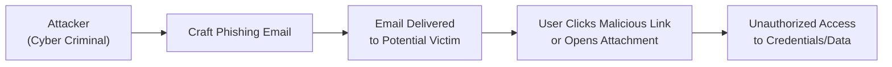
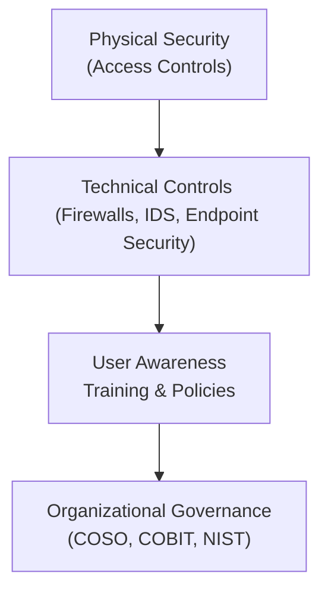

## 28.4 Social Engineering Threats and New Attack Vectors

Social engineering attacks continue to evolve as cunning adversaries leverage human vulnerabilities to gain unauthorized access to critical systems, confidential data, and financial records. With digital transformation accelerating across every industry, threat actors now combine traditional social engineering tactics with new technology-driven vectors—from AI-generated phishing campaigns to deepfake voice calls. For accounting professionals, especially CPAs, social engineering schemes present substantial financial and reputational risks. This section illuminates the nature of social engineering, highlights common attack modes such as phishing, vishing, and smishing, and offers strategies for cultivating robust user awareness training and other countermeasures essential to modern information security.

---

### Understanding Social Engineering

Social engineering broadly encompasses any malicious attempt to trick users into performing an action that compromises security. Unlike direct hacking of software vulnerabilities, social engineering typically targets the human factor by manipulating trust, authority, urgency, or curiosity. Cybercriminals exploit cognitive biases and social norms, sending plausible requests that appear to originate from legitimate sources, colleagues, or senior leadership.

From a CPA’s perspective, many social engineering attacks are designed to extract sensitive financial data, siphon money through fraudulent wire transfers, or gain long-term access to accounting and enterprise resource planning (ERP) systems. An organization with strong technical defenses may still be vulnerable if employees, vendors, or partners are insufficiently aware of social engineering tactics.

---

### Common Types of Social Engineering Threats

Below are some of the most frequently encountered social engineering attacks that target organizations of all sizes:

#### Phishing
Phishing refers to fraudulent emails that appear to come from legitimate entities (e.g., trusted companies, government agencies, or supervisors) with the intent to steal personal information, credentials, or financial data. Attackers carefully craft persuasive messages—sometimes replicating official logos and language—to convince recipients to click malicious links or open infected attachments.

• Example: A CPA receives an email from what appears to be a major bank requesting urgent confirmation of account details. In reality, the link directs to a counterfeit website that captures login credentials. Attackers can later use these credentials to access sensitive financial accounts or redirect client funds.

#### Vishing (Voice Phishing)
Vishing leverages phone calls or voice communications to trick individuals into sharing confidential information. Criminals often use spoofed caller IDs that display the name or number of a legitimate organization, such as a bank or government hotline.

• Example: A fraudster phones an accounts payable clerk, impersonating an internal IT support representative or a bank official. The caller claims an urgent situation requires verification of routing numbers or social security numbers. Under pressure, the clerk might disclose confidential data or grant remote system access.

#### Smishing (SMS Phishing)
Smishing relies on deceptive text messages to persuade recipients to tap a link or provide sensitive data. Modern smartphones can be exploited more easily than desktop computers if the user maintains minimal security protocols.

• Example: An accountant’s phone receives a text warning of “unusual banking activity.” The text includes a link to “secure the account,” which actually leads to a cloned bank login page. Submitting credentials on this fraudulent form places both personal and organizational information at risk.

#### Other Variants
• Tailgating (Piggybacking): Attackers follow an authorized user into a restricted area by capitalizing on courtesy or rushed environments.  
• Shoulder Surfing: When a malicious individual physically observes or records a user entering their PIN or password.  
• Social Media Manipulation: Fraudsters often pose as company executives or employees on social networks, building rapport with unsuspecting users before requesting sensitive information.  

---

### Anatomy of a Social Engineering Attack

Organizations often underestimate the sophistication of modern social engineering tactics. Attackers frequently perform weeks or months of reconnaissance—analyzing social media, corporate websites, and press releases—to craft credible pretexts. Detailed knowledge of an organization’s structure, leadership team, or recent events can amplify the success rate of a malicious campaign.

The flowchart below illustrates a simplified view of a phishing attack lifecycle:

1. Reconnaissance: Cybercriminals gather public information about users (e.g., corporate email addresses, job titles).  
2. Preparation & Tailoring: Attackers draft targeted emails or messages that appear authentic.  
3. Delivery & Exploitation: The fraudulent message reaches the victim’s inbox.  
4. Action on Objectives: The user unknowingly provides credentials or sensitive data, granting attackers a foothold.

---

### Financial Impact and Regulatory Concerns

Social engineering attacks that lead to unauthorized disclosure or misappropriation of sensitive financial data can trigger:

• Material financial statement inaccuracies.  
• Regulatory compliance breaches (e.g., SEC violations, or GDPR fines for European operations).  
• Legal liabilities from data protection laws (such as HIPAA in healthcare or state-specific privacy regulations).  
• Direct monetary losses through fraudulent wire transfers or sent checks.  

For CPAs, the potential for reputational damage is equally alarming. A single employee falling victim to a social engineering scheme can expose clients, business partners, and the firm to severe losses, undermining trust in the CPA’s professional competencies.

---

### Emerging Attack Vectors

While phishing, vishing, and smishing remain perennial threats, new social engineering methods are rapidly gaining traction:

• Deepfake Audio and Video: Attackers use advanced machine learning to synthesize executives’ voices or faces. They then instruct employees through manipulated phone calls or video chat to transfer funds or reveal confidential details.  
• AI-Driven Chatbots: Automated chatbots can convincingly simulate human interaction in real-time, tricking employees into divulging sensitive data or clicking harmful links.  
• Business Email Compromise (BEC): Criminals study organizational hierarchies to impersonate CFOs or CEOs, then request urgent wire transfers or changes in payment instructions.  
• Social Media Spear Phishing: Attackers pose as legitimate partners or recruits on LinkedIn to harvest details about projects, staff credentials, or privileged information.  

---

### Mitigating Social Engineering Threats

#### 1. Cultivating User Awareness
The most critical defense against social engineering remains comprehensive and continuous user training. Organizations should develop fraud-awareness programs that emphasize how to:

• Recognize phishing emails and fraudulent phone calls.  
• Validate unusual or urgent financial requests through an out-of-band verification (e.g., calling a known number).  
• Examine URLs, attachments, and sender details before clicking links or downloading files.  
• Understand the importance of following established policies and procedures, especially for wire transfers or data-sharing requests.  

Regular simulated phishing campaigns are also advisable. By sending fake phishing tests to employees, management can gauge the program’s effectiveness, identify high-risk users or departments, and reinforce the importance of skepticism.

#### 2. Multi-Factor Authentication (MFA)
Even if credentials are compromised, MFA adds a second layer of verification, making it substantially harder for attackers to gain access. For financial software, remote access to accounting systems, or cloud-based platforms, enforcing MFA is considered a best practice and aligns with widely adopted frameworks (e.g., COBIT 2019, NIST CSF).

#### 3. Strong Policies and Procedures
Clear policies for data handling, password management, and incident reporting are essential. For example, no staff member should rely solely on email to authorize significant financial transactions. A mandatory approval workflow that includes phone or in-person confirmation significantly reduces risk.

#### 4. Technology Controls
Deploy advanced email filtering solutions that scan attachments and links. Intrusion detection systems, internet content filters, and endpoint security solutions can further protect networks from malicious URLs or executables. Additionally, implementing robust logging and monitoring helps detect suspicious activities (e.g., an unrecognized device logging into an accounting ERP at unusual hours).

#### 5. Vendor and Third-Party Oversight
Fraudsters often compromise third-party vendors to pivot into targeted organizations. Therefore, CPAs should validate that vendors—particularly those who handle sensitive data—implement adequate security measures. Regular vendor assessments, combined with strong contractual clauses around safeguarding data, fortify the supply chain from social engineering vectors.

#### 6. Crisis Response Preparedness
Occasionally, even the most robust controls and training fail, and an organization may still face a successful social engineering attack. The speed and effectiveness of the response are critical. Management should have an incident response plan that includes clear guidance for containing the breach, notifying affected parties, and reporting to relevant authorities when required.

---

### Real-World Case Study: CEO Impersonation Email

Consider a mid-sized manufacturing company that outsources part of its finance function to a trusted CPA firm. One afternoon, an employee at the CPA firm received an alleged email from the client’s CFO requesting an urgent wire transfer to a new supplier account. The email had the CFO’s signature block and seemed to match the CFO’s writing style. However, an eagle-eyed employee spotted an inconsistency: the “reply-to” domain was slightly altered from the legitimate domain.  

• The employee phoned the CFO’s main office number to verify the request—an additional step that prevented a $75,000 fraudulent transfer.  
• Analysis revealed that attackers had scraped public information about the CFO’s travel schedule and sent the email while the CFO was on a business trip, reducing the likelihood of immediate face-to-face confirmation.  
• This successful detection reinforced the importance of robust training and an established verification procedure for exceptional or high-value transactions.

---

### Best Practices for CPA Firms and Professionals

• Integrate Social Engineering Awareness in Onboarding: Every new hire should receive formal training on identifying malicious emails, calls, or text messages.  
• Encourage a “Trust But Verify” Culture: Promote a climate where employees feel comfortable double-checking unusual requests, regardless of the apparent seniority of the sender.  
• Update Training Materials Regularly: As new attack techniques emerge (e.g., deepfake-based social engineering), organizations should refresh their training content.  
• Document and Track Security Metrics: Monitor phishing simulation click-through rates, security incidents, and user compliance to identify trends and improvement areas.  
• Remain Compliant with Regulatory Guidelines: For instance, the AICPA Statement on Standards for Attestation Engagements (SSAE) might influence how SOC reports incorporate social engineering awareness.  

---

### Diagram: Layered Approach to User Awareness

Below is a simplified representation of how user training and organizational policies intersect with other essential security layers:

1. Physical Security (e.g., secured doors, badges, surveillance cameras)  
2. Technical Controls (e.g., anti-malware, network segmentation)  
3. User Awareness Training/Policies (central to thwarting social engineering)  
4. Organizational Governance (overarching frameworks that guide strategy, risk management, compliance)

---

### References for Further Exploration

• NIST Special Publication 800-53: Security and Privacy Controls for IT Systems  
• SANS Institute Phishing and Social Engineering Toolkit  
• AICPA Cybersecurity Practice Aid  
• Additional chapters within this guide:  
  - Chapter 19: Data Confidentiality and Privacy Controls  
  - Chapter 20: Incident Response and Recovery  
  - Chapter 21: Testing Security, Confidentiality, and Privacy Controls  

By implementing a well-rounded strategy that combines user awareness, supportive policies, technological safeguards, and robust governance, organizations—alongside their CPA advisors—can more effectively mitigate the persistent and escalating dangers posed by social engineering.

---

## Test Your Knowledge: Social Engineering Threats and New Attack Vectors



### Social engineering primarily exploits what aspect of an organization?
- [x] Human behavior and trust
- [ ] Hardware vulnerabilities
- [ ] Network firewalls
- [ ] Physical building security

> **Explanation:** Social engineering takes advantage of human nature—relying on manipulation, trust, and cognitive biases—making users the weakest link in the security chain.

### Which of the following best describes phishing?
- [x] Fraudulent emails designed to trick users into revealing sensitive information
- [ ] Malicious software that encrypts files until a ransom is paid
- [ ] In-person attacks to steal devices from authorized users
- [ ] Physical locking mechanisms used to prevent unauthorized entry

> **Explanation:** Phishing is a type of online scam where attackers send deceptive emails that look official but are intended to harvest personal data or deploy malware.

### A caller impersonates an IT support specialist, asking for your password over the phone. What is this attack called?
- [x] Vishing
- [ ] Smishing
- [ ] Tailgating
- [ ] Phishing

> **Explanation:** Vishing (voice phishing) involves using phone calls to deceive individuals into revealing confidential information.

### Which of the following is an emerging social engineering threat that utilizes AI to mimic an executive’s voice?
- [x] Deepfake audio
- [ ] Shoulder surfing
- [ ] Packet sniffing
- [ ] Watering hole attack

> **Explanation:** Deepfake audio replicates an individual’s voice patterns using AI, potentially tricking employees into carrying out fraudulent instructions.

### In a text message claiming unusual bank activity with a suspicious link, what type of attack is taking place?
- [x] Smishing
- [ ] Pretexting
- [x] Phishing
- [ ] Watering hole attack

> **Explanation:** Text-based phishing is known as smishing; the scenario also falls under the broader phishing category because it aims to deceive users into disclosing sensitive information.

### Which of the following is a best practice to counter social engineering attacks?
- [x] Implement multi-factor authentication
- [ ] Disable data encryption
- [ ] Provide employees with public USB drives
- [ ] Reply directly to suspicious emails to verify authenticity

> **Explanation:** Multi-factor authentication adds a vital layer of security beyond just a password, greatly reducing the effectiveness of credential-stealing attacks.

### Which of these statements most accurately describes why user awareness training is crucial?
- [x] Even the best technical safeguards can fail if employees unwittingly share sensitive data
- [ ] Technical controls are unnecessary if users are trained
- [x] It completely eliminates the need for testing controls
- [ ] Training is optional as long as there are strict physical security measures

> **Explanation:** Although technical security measures are essential, user mistakes frequently undermine them. Well-executed training helps employees recognize and resist social engineering tactics.

### What kind of corporate culture typically helps reduce successful social engineering?
- [x] A “trust but verify” culture where employees double-check unusual requests
- [ ] A culture that strongly penalizes employees who report suspicious behavior
- [ ] A culture that requires employees to share passwords with supervisors
- [ ] A culture that discourages employees from escalating concerns

> **Explanation:** When employees are encouraged to ask questions and verify unexpected or unusual requests, they are far more likely to thwart social engineering attempts.

### Which of the following is NOT a recommended step for mitigating phishing attempts?
- [x] Responding to every suspicious email with sensitive data to “test” the sender
- [ ] Simulating phishing campaigns to gauge user awareness
- [ ] Training users to inspect sender addresses and URLs
- [ ] Enforcing policies for wire transfer verification

> **Explanation:** Responding to a suspicious email with confidential information only helps attackers. The other measures are sound best practices.

### Incident response planning is essential in social engineering scenarios because:
- [x] It ensures swift containment and reduces further damage
- [ ] It is required for all external audits but not internal use
- [ ] It helps attackers refine their techniques
- [ ] It replaces the need for any security controls

> **Explanation:** A well-documented incident response plan allows organizations to rapidly address breaches, reduce losses, and provide timely notification to affected stakeholders.



---

## For Additional Practice and Deeper Preparation

### [Information Systems and Controls (ISC)](https://www.udemy.com/course/isc-cpa-mock-exams/?referralCode=E1217303222935C5E464)

**Information Systems and Controls (ISC) CPA Mocks:** 6 Full (1,500 Qs), Harder Than Real! In-Depth & Clear. Crush With Confidence!

- Tackle full-length mock exams designed to mirror real ISC questions.  
- Refine your exam-day strategies with detailed, step-by-step solutions for every scenario.  
- Explore in-depth rationales that reinforce higher-level concepts, giving you an edge on test day.  
- Boost confidence and minimize anxiety by mastering every corner of the ISC blueprint.  
- Perfect for those seeking exceptionally hard mocks and real-world readiness.  

_Disclaimer: This course is not endorsed by or affiliated with the AICPA, NASBA, or any official CPA Examination authority. All content is for educational and preparatory purposes only._
