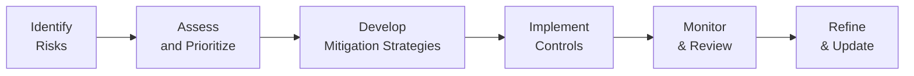

## 28.5 AI Governance and Risk Management

Artificial Intelligence (AI) has rapidly become a cornerstone of innovation in virtually every sector, including finance, accounting, healthcare, and transportation. As AI continues to evolve, governance structures and comprehensive risk management approaches are critical to ensuring responsible and ethical use. Accountants and financial professionals, in particular, are playing a growing role in overseeing, auditing, and advising on AI-related risks. This section discusses key themes in AI governance, including regulatory or ethical concerns, algorithmic biases, potential impacts to financial statements, and emerging frameworks that shape how AI systems are overseen.

With a solid understanding of AI’s principles and best practices, Certified Public Accountants (CPAs) can help organizations integrate effective controls into their AI-driven processes. They can also champion adherence to regulatory requirements, ethical guidelines, and risk management frameworks that protect users and stakeholders alike.

--------------------------------------------------------------------------------

## The Importance of AI Governance

AI governance is the collection of policies, processes, and guidelines that direct the design, development, deployment, and use of AI systems. As AI applications become more sophisticated, considerable challenges and risks arise:

• Unintended Consequences: AI algorithms may produce unexpected outcomes that could harm stakeholders (e.g., issuing unfair credit approvals or defaulting to discriminatory risk assessments).  
• Accountability Gaps: AI-driven decisions can blur lines of human oversight and responsibility.  
• Compliance Complexities: Legal and regulatory landscapes around AI are still evolving, creating uncertainties about roles and obligations among stakeholders.

By establishing robust AI governance structures and frameworks, organizations can mitigate risks associated with AI while enhancing trust and transparency.

--------------------------------------------------------------------------------

## Ethical and Regulatory Concerns

### Ethical Principles

Core ethical concerns underpin AI projects and solutions, notably:

• Respect for Human Autonomy: AI solutions should empower rather than displace human decision-making fully.  
• Fairness and Equality: Ensuring that AI systems do not perpetuate biases or discriminatory practices.  
• Transparency and Explainability: AI processes, assumptions, and data usage should be transparent to end users and auditors.  
• Trustworthiness: AI should perform reliably and consistently, especially in contexts with high stakes such as healthcare diagnoses, financial reporting, or national security.  
• Beneficence and Non-Maleficence: AI must aim to do good (beneficence) and avoid harming others (non-maleficence).

### Regulatory Trends and Frameworks

Regulatory oversight of AI varies worldwide and is evolving rapidly. A few notable initiatives include:

• European Union (EU) Artificial Intelligence Act: Proposes risk-based regulations, classifying AI systems into categories (e.g., unacceptable risk, high risk, limited risk), carrying specific compliance obligations.  
• U.S. Developments: Disparate laws at the state level are beginning to govern AI usage (e.g., Illinois Biometric Information Privacy Act). The White House Office of Science and Technology Policy (OSTP) has issued a blueprint for an AI Bill of Rights aiming to protect users from harmful AI outcomes.  
• OECD AI Principles: Provides globally recognized standards that focus on AI safety, transparency, and accountability.  
• AICPA Considerations: The AICPA has not yet established an exclusive standard for AI, but aspects of existing frameworks—such as SOC 2® for Security, Availability, Processing Integrity, Confidentiality, and Privacy—can be adapted for AI environments.

From a CPA’s perspective, the shifting legal landscape necessitates situational awareness of relevant regulations so professionals can appropriately advise clients and organizations on compliance measures.

--------------------------------------------------------------------------------

## Algorithmic Bias: Causes and Consequences

Algorithmic bias occurs when AI makes decisions that systematically disadvantage certain groups or demographics. Bias can originate from:

• Biased Training Data: Historical datasets may contain unrepresentative or discriminatory records, leading to skewed AI outcomes.  
• Homogenous Development Teams: If an AI development team or oversight committee lacks diversity, blind spots may perpetuate biases.  
• Model Complexity: Black-box models can mask underlying discriminatory patterns, making biases difficult to find or correct.

### Real-World Impacts of Algorithmic Bias

• Hiring and Recruitment: AI-based systems might inadvertently favor certain ethnic groups, genders, or educational backgrounds if trained on biased data.  
• Banking and Credit: Automated credit assessments and loan approvals that replicate historical discrimination, impacting interest rates or credit limits based on race or socioeconomic status.  
• Fraud Detection: Overly restrictive or lenient fraud detection may result in legitimate transaction denial for certain consumer segments.

Financial professionals can help identify and correct biases by implementing robust audit procedures, monitoring data representation, and ensuring transparency in model validation.

--------------------------------------------------------------------------------

## Emerging Frameworks for AI Oversight

### COBIT and NIST Modifications for AI

While COBIT 2019 and the NIST Cybersecurity Framework focus primarily on IT governance and cybersecurity, their flexible principles can be adapted to align AI oversight with overall organizational risk management. CPAs familiar with these frameworks can integrate specific AI risk considerations—like algorithm bias, data governance, and continuous model monitoring—into existing governance structures.

### AI-Specific Governing Bodies and Standards

• ISO/IEC Initiatives: Workgroups within the International Organization for Standardization (ISO) create guidelines for AI trustworthiness and risk management.  
• IEEE Ethics in AI Standards: The Institute of Electrical and Electronics Engineers (IEEE) fosters the “Ethically Aligned Design” framework, promoting transparency, accountability, and user well-being.

Most frameworks emphasize the entire AI lifecycle, from ideation and development to deployment, maintenance, and decommissioning. They also underscore the importance of stakeholder inclusion to ensure that AI solutions serve user needs responsibly and accountably.

--------------------------------------------------------------------------------

## Core Risk Management Considerations for AI

Given the complex nature of AI, risk management goes beyond traditional IT risk assessments. Below is a simplified conceptual diagram showing the essential steps in AI risk management:

1. Identify Risks: Organizations begin by enumerating AI-related risks, such as algorithmic bias, data breaches, or compliance with dynamic regulatory requirements.  
2. Assess and Prioritize: Each risk is analyzed for probability, impact, and detection difficulty, guiding focus and resource allocation.  
3. Develop Mitigation Strategies: Approaches to minimize or remediate AI risks (e.g., improved training data, robust monitoring, or policy changes).  
4. Implement Controls: Specific controls—like audit trails, user access controls, or model versioning—are put in place.  
5. Monitor and Review: Continuous monitoring of model performance to detect changes in system behavior or emerging threats.  
6. Refine and Update: AI risk management is iterative. As circumstances change (e.g., new regulations or new data sources), frameworks must be updated.

### Aligning with COSO’s ERM Framework

AI risk management systems can map seamlessly to the COSO ERM process:  
• Risk Governance and Culture  
• Risk, Strategy, and Objective-Setting  
• Risk in Execution  
• Risk Information, Communication, and Reporting  
• Monitoring Enterprise Risks  

Professionals in finance and accounting are uniquely positioned to align AI risk with strategic and financial objectives, bridging the gap between AI technical teams and executive decision-makers.

--------------------------------------------------------------------------------

## Practical Examples in Finance and Accounting

### Example 1: Credit Scoring

Credit scoring systems deploy machine learning models to evaluate loan applicants’ creditworthiness. Without strong governance, historical data with inherent biases could lead to discriminatory interest rates or rejections. A prudent approach involves:

• Reviewing historical data for representativeness.  
• Documenting variables used by AI models (e.g., credit history vs. zip code) and removing those that might be proxies for protected characteristics.  
• Implementing an oversight committee to address socio-economic biases that could impact fair lending practices.

### Example 2: Fraud Detection

AI-based anomaly detection can improve remediation strategies for unauthorized transactions. However, misclassification might compromise customers’ legitimate transactions or underestimate actual fraud. Risk management controls include:

• Periodic model tuning with updated data.  
• Setting thresholds for false positives and false negatives, with continuous monitoring to address drift.  
• Collaboration between data scientists, internal auditors, and compliance teams to ensure consistent and fair practices.

### Example 3: Automated Financial Reporting

Some firms experiment with AI to autogenerate financial disclosures or to gather and analyze large datasets swiftly. Errors in model logic, data mapping, or user input can cause inaccurate or incomplete statements, leading to compliance and reputational risks. Mitigations might involve:

• Establishing robust validation and approval workflows.  
• Conducting data integrity checks (referencing Chapter 12 on Database Structures) to detect anomalies in real time.  
• Ensuring relevant staff are trained on how to interpret AI-driven analytical outputs.

--------------------------------------------------------------------------------

## Implementing AI Governance: Key Steps

1. Strategy & Vision: Establish a clear mission statement for AI usage that aligns with the organization’s overall strategy.  
2. Policies & Procedures: Develop formal policies that outline AI ethics, data usage, and risk mitigation steps, ensuring alignment with chapters on IT governance (see Chapter 3 for COSO references).  
3. Training & Talent: Equip teams with knowledge of AI ethics, basic data science concepts, and relevant legal requirements.  
4. Controls & Reviews: Integrate frequent audits of AI processes, including validation of data sources and code reviews to mitigate the risk of algorithmic drift.  
5. Governance Board / Committee: Create a dedicated committee composed of data scientists, accountants, legal specialists, compliance officers, and other stakeholders.  
6. Monitoring & Reporting: Track the performance and fairness metrics of AI models, generating reports that executives and boards can interpret and act upon.

--------------------------------------------------------------------------------

## Common Pitfalls and Strategies to Overcome Them

• Inadequate Data Governance: Data quality is perhaps the single most critical factor affecting AI bias and reliability. Strategy: Establish consistent data governance policies (see Chapter 11: Data Life Cycle and Governance).  
• Lack of Transparency: Black-box models often lack interpretable outputs, undermining trust and regulatory compliance. Strategy: Employ interpretable frameworks (like LIME or SHAP in machine learning) and maintain robust documentation.  
• Over-Reliance on Vendors: Companies may adopt third-party AI solutions without adequate oversight. Strategy: Conduct thorough due diligence, focusing on vendor data policies, security measures, and any relevant SOC reports (refer to Part V: SOC Engagements).  
• Skewed Incentives and Lack of Accountability: AI projects sometimes are driven by speed-to-market. Strategy: Embed AI ethics and risk management from project inception, ensuring accountability is explicitly defined.  
• Insufficient Talent and Expertise: A scarcity of AI-literate CPAs and staff can hamper effective governance. Strategy: Invest in continuous training and cross-functional teams, bridging data science and finance.

--------------------------------------------------------------------------------

## Best Practices for CPA Involvement

1. Collaborative Audits: CPAs should partner with data science teams to integrate AI risk assessments into broader audits, using consistent metric definitions and data sets.  
2. Continuous Monitoring: Encourage real-time dashboards that track key performance and fairness indicators.  
3. Periodic Model Recalibration: Address model drift arising from market, customer behavior, or product changes.  
4. Ethical “Front-Loading”: Ensure design considerations for fairness and transparency occur at the beginning of AI development cycles.  
5. Stakeholder Engagement: Investigate potential AI outcomes with end-user feedback to reveal hidden risks or biases early.

--------------------------------------------------------------------------------

## Conclusion and Future Outlook

AI governance and risk management have quickly become pivotal for organizations seeking to harness the power of machine learning and related technologies. In a volatile compliance environment, the deeper CPAs and financial professionals embed themselves in AI oversight processes, the greater their influence on safeguarding integrity and trust. As emerging regulations and ethical guidelines unfold, the role of the CPA as a trusted advisor will continue to expand, bridging AI innovation with responsible governance practices.

Financial professionals should maintain ongoing dialogue with technologists, strengthen cross-functional collaboration, and refine risk management frameworks that incorporate agile, comprehensive AI oversight. These collaborative efforts ensure AI systems remain aligned with organizational values, regulatory requirements, and core ethical principles, ultimately serving the organization’s strategic goals and stakeholders’ best interests.

--------------------------------------------------------------------------------

## Master Your Knowledge of AI Governance and Risk Management



### Which of the following best describes the purpose of AI governance within an organization?
- [x] To create and enforce policies that guide the design, development, and use of AI responsibly.  
- [ ] To eliminate all risks associated with AI by removing human oversight.  
- [ ] To slow down AI projects so that manual processes remain dominant in the organization.  
- [ ] To standardize AI to a single vendor solution.  

> **Explanation:** AI governance focuses on directing and controlling AI’s design, development, and deployment in a responsible manner, aligning practices with ethical, legal, and strategic considerations.

### In the AI risk management process, which step typically involves analyzing the likelihood and potential impact of identified risks?
- [ ] Implement Controls  
- [x] Assess and Prioritize  
- [ ] Refine and Update  
- [ ] Monitor & Review  

> **Explanation:** After risks are identified, organizations must assess probability, potential impact, and detectability, then prioritize which risks to mitigate first.

### What is the primary driver behind algorithmic bias in AI systems?
- [x] Biased or unrepresentative training data  
- [ ] Too much oversight from independent committees  
- [ ] Excessive testing and validation of AI models  
- [ ] The use of open-source software libraries  

> **Explanation:** Bias frequently originates from training data that do not accurately represent the population or contain historical prejudices, causing skewed outcomes in AI predictions.

### Why is continuous monitoring critical for AI models used in fraud detection?
- [x] Models can drift over time, causing higher false positives or false negatives without ongoing recalibrations.  
- [ ] Monitoring makes AI algorithms disregard new data in favor of established patterns.  
- [ ] It guarantees AI models only use historical data and not real-time inputs.  
- [ ] It completely eliminates the need for manual fraud review.  

> **Explanation:** AI performance can degrade if underlying patterns in data shift. Continuous monitoring ensures the model remains accurate and reliable in changing conditions.

### What is the main purpose of implementing explainability tools like LIME or SHAP in AI systems?
- [x] To provide insights into how models arrive at specific predictions and enable transparency.  
- [ ] To reduce the computational complexity of models.  
- [x] To ensure non-technical stakeholders can interpret AI decisions.  
- [ ] To fully automate regulatory compliance without any human intervention.  

> **Explanation:** Techniques like LIME or SHAP help clarify AI model predictions, facilitating transparency and accountability. They also help non-technical reviewers understand AI outputs.

### Which best practice helps prevent vendor lock-in and ensures robust AI oversight?
- [x] Conducting periodic third-party vendor assessments and requiring disclosures regarding data policies.  
- [ ] Using only closed-source solutions from one vendor.  
- [ ] Outsourcing all AI-related processes with no internal review.  
- [ ] Prohibiting cloud-based AI solutions entirely.  

> **Explanation:** Due diligence on vendors and reviewing their data management and security controls helps organizations avoid reliance on a single provider and ensures compliance and alignment with best practices.

### In financial reporting, how can AI governance help?
- [x] By ensuring the accuracy and integrity of AI outputs that inform financial statements.  
- [ ] By replacing all audit procedures with automated approaches.  
- [x] By confirming that financial disclosures adhere to data privacy regulations.  
- [ ] By eliminating the need for internal controls over financial reporting.  

> **Explanation:** AI governance fosters accuracy, integrity, and compliance within processes that rely on AI, thus helping the organization maintain rigorous financial reporting and adhere to relevant control requirements.

### Which statement about emerging AI regulations is most accurate?
- [x] They are evolving rapidly, and organizations need to continually monitor regulatory changes relevant to their applications.  
- [ ] They are static and uniformly enforced in all jurisdictions worldwide.  
- [ ] They have universally replaced earlier IT control frameworks.  
- [ ] They only apply to organizations located in the European Union.  

> **Explanation:** AI-related regulations differ by region and are continuously evolving. Organizations face new guidelines and must remain informed and adaptable to comply fully.

### What is a primary reason for establishing a dedicated AI governance board or committee?
- [x] To ensure stakeholders from different disciplines (finance, legal, data science) collaborate in addressing AI risks and ethics.  
- [ ] To add bureaucratic hurdles so that AI projects are delayed or canceled.  
- [ ] To design algorithms in isolation from other organizational functions.  
- [ ] To delegate all AI programming to external consultants.  

> **Explanation:** A cross-functional AI committee brings diverse viewpoints and ensures that AI design, deployment, and oversight account for technical, financial, legal, and ethical considerations.

### True or False: A robust AI governance strategy completely eliminates AI-related risks.
- [x] True  
- [ ] False  

> **Explanation:** This statement is actually a trick question: No governance framework can entirely eliminate risks, but it can substantially reduce and manage them. Strong governance frameworks exist to proactively identify, mitigate, and monitor potential risks.



--------------------------------------------------------------------------------

## For Additional Practice and Deeper Preparation

### [Information Systems and Controls (ISC)](https://www.udemy.com/course/isc-cpa-mock-exams/?referralCode=E1217303222935C5E464)

**Information Systems and Controls (ISC) CPA Mocks:** 6 Full (1,500 Qs), Harder Than Real! In-Depth & Clear. Crush With Confidence!

- Tackle full-length mock exams designed to mirror real ISC questions.  
- Refine your exam-day strategies with detailed, step-by-step solutions for every scenario.  
- Explore in-depth rationales that reinforce higher-level concepts, giving you an edge on test day.  
- Boost confidence and minimize anxiety by mastering every corner of the ISC blueprint.  
- Perfect for those seeking exceptionally hard mocks and real-world readiness.  

_Disclaimer: This course is not endorsed by or affiliated with the AICPA, NASBA, or any official CPA Examination authority. All content is for educational and preparatory purposes only._
