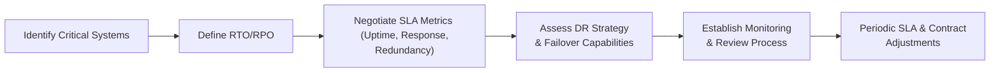

## 29.1 Cloud Contracting, SLAs, and Legal Obligations

Cloud computing offers enterprises unprecedented scalability, agility, and cost efficiencies. However, these benefits come with obligations and risks that must be carefully managed through robust contractual arrangements and well-defined Service Level Agreements (SLAs). This section explores the essential elements of cloud service contracts, explains typical provisions needed to protect both the client and the provider, and demonstrates how SLAs align with business continuity and disaster recovery requirements. Understanding these legal and operational dimensions is critical, not only for compliance and risk management but also for effective IT governance (see Chapter 3, Governance, Frameworks, and Regulatory Environment, for broader context).

Cloud contracting can encompass a wide variety of service models such as Infrastructure as a Service (IaaS), Platform as a Service (PaaS), and Software as a Service (SaaS). Regardless of the service category, the same guiding principles hold: clearly defining roles, responsibilities, performance metrics, legal obligations, and remedies is paramount to mitigating risk. This chapter breaks these concepts down into accessible components, offering practical examples to guide contract negotiations and SLA structuring.

--------------------------------------------------------------------------------
### Key Contract Clauses in Cloud Agreements

When entering into a cloud contract, both the customer (organization) and the cloud service provider (CSP) should pay close attention to several fundamental points. Clarity in these areas helps ensure that potential disputes are minimized, performance is aligned with organizational needs, and legal compliance obligations are met.

#### 1. Scope of Services and Performance Obligations

• Scope Definition: Contracts must outline what services will be provided and how they will be delivered. For instance, the agreement might state that the CSP will provide virtual CPUs, memory resources, and storage within specific parameters.  
• Key Performance Indicators (KPIs): Include performance metrics such as latency, throughput, or transaction volumes to monitor CSP performance. KPIs align closely with the SLAs described later in this section.  
• Deployment Model: Whether the organization is utilizing a public, private, or hybrid cloud environment should be specified. Certain clauses may differ depending on where infrastructure is hosted and who manages it.

#### 2. Data Ownership, Usage Rights, and Retention

• Data Ownership: Contracts should specify that data created, uploaded, or managed by the customer remains under the customer’s ownership. This helps avoid disputes over intellectual property (IP) rights and clarifies responsibilities for data backups and retrieval.  
• Data Usage Rights: The contract should clarify what the CSP can (and cannot) do with the customer’s data. It may be necessary to address analytics, data mining, or aggregated data usage by the CSP.  
• Retention and Destruction: Stipulate how long data is stored and what happens when the contract ends—particularly regarding data retrieval and secure data destruction (see Chapter 11, Data Life Cycle and Governance, for further details).

#### 3. Confidentiality and Security Obligations

• Confidentiality Clauses: Both parties often commit to maintaining all proprietary or sensitive data as confidential, with nondisclosure obligations continuing after the contract’s termination.  
• Security Standards: Align contractual requirements with frameworks such as NIST or ISO 27001. Many organizations may also require compliance with sector-specific standards like HIPAA (healthcare) or PCI DSS (payment card industry).  
• Breach Notification: Contracts should define the required notification timeline if a data or security breach occurs, reflecting broader regulatory obligations like GDPR’s 72-hour rule.

#### 4. Compliance with Laws and Regulations

• Regulatory Landscape: Obligations may vary significantly depending on the regions where data is processed or stored. For example, GDPR requires special protections for EU residents’ data, while U.S. data might be subject to HIPAA or state-level privacy regulations.  
• Audit Rights: Many customers insist on the right to audit the CSP, either directly or through a third party, to confirm compliance with applicable regulations. This demand often intersects with SOC reports (see Part V, System and Organization Controls (SOC) Engagements).

#### 5. Liability, Indemnification, and Limitation of Liability

• Limitations of Liability (LoL): Cloud service providers typically set caps on their liability, often linking maximum financial compensation to contract value. Striking a fair balance ensures neither side is exposed to unlimited risk.  
• Indemnification: Contracts often include provisions that the CSP will “defend, indemnify, and hold harmless” the customer against certain claims, such as third-party IP infringement or data breaches that result from CSP negligence.  
• Force Majeure: Clauses specifying events beyond human control (e.g., natural disasters, major cyberattacks) that might prevent either party from fulfilling obligations may be essential.

#### 6. Termination and Exit Strategy

• Terminating the Agreement: Include clearly defined reasons for termination (e.g., breach of contract, insolvency, failure to cure stated violations, or convenience).  
• Transition Assistance: Organizations should address how they will retrieve data from the cloud if the contract ends. Consider data migration support, transitional services, and the timeline for final data handover.  
• Early Termination Fees: Some providers impose penalties if a client cancels before the contract expiration. Customers must weigh these costs against potential business benefits of switching.

--------------------------------------------------------------------------------
### Introduction to Service Level Agreements (SLAs)

At the core of cloud contracts, SLAs set measurable performance targets and define how the CSP will address any failure to meet these targets. While the contract lays out the overarching legal framework, the SLA provides the operational blueprint and metrics. Hence, an SLA must closely align with the customer’s business continuity mandate, as addressed in Chapter 9 (System Availability and Business Continuity).

For example, an organization might require 99.9% uptime for critical business applications. If the cloud service fails to meet this threshold, the SLA will define remedial actions—such as crediting the customer’s account, providing extended support hours, or implementing backup resources at no cost.

Common SLA metrics include:

• Uptime and Availability: The percentage of time that the service is operational. Uptime can vary from 99.0% to 99.999% depending on the criticality of the application.  
• Response and Resolution Times: The time it takes for the CSP’s support team to respond and subsequently fix an issue.  
• Throughput and Latency: Measures of data transfer speed and network response times—crucial for performance-sensitive systems.  
• Support Scope and Escalation: Detailed protocols for how support tickets are escalated and resolved, often tiered based on severity.  
• Maintenance Windows: Specifying allowable downtimes for scheduled maintenance or upgrades to prevent unexpected interruptions.

--------------------------------------------------------------------------------
### Ensuring SLA Alignment with Business Continuity Needs

Business continuity is about maintaining key operations even in adverse circumstances such as system failures, natural disasters, or cyberattacks. Aligning SLAs with these resiliency goals is essential to minimize operational and financial risks. Below is a simple approach to ensure that your SLA is robust enough to support your continuity objectives.

**Step 1: Assess Criticality of Services**  
Begin by reviewing the organizational impact of each cloud-hosted system. Working with stakeholders from finance, accounting, operations, and IT, classify systems by their importance to core operations. For example, in an e-commerce environment, the front-end payment gateway is mission-critical, while an internal reporting tool might be less critical.

**Step 2: Determine Recovery Objectives**  
Identify Recovery Time Objectives (RTO) and Recovery Point Objectives (RPO) for cloud-based applications. These objectives, usually discussed in Chapter 9, define how quickly systems must be restored (RTO) and the maximum tolerable period for data loss (RPO).

**Step 3: Negotiate SLA Uptime and Recovery Requirements**  
Using RTO and RPO outcomes, draft or adjust SLA terms to require specific uptime commitments and guaranteed recovery steps in the event of downtime. This might include binding the CSP to provide immediate failover infrastructures or stand-by server capacity if the primary hosting environment goes offline.

**Step 4: Validate Backup and Redundancy Processes**  
Encourage testing of backup procedures and failover drills. If the SLA suggests the cloud provider maintains multiple data centers, confirm that actual replication and redundancy mechanisms meet the stated commitments.

**Step 5: Align with Disaster Recovery (DR) Strategy**  
In addition to the SLA, ensure that the cloud contract includes or references a detailed DR plan. This plan should outline responsibilities for both the customer and the CSP when an incident occurs, including how data is restored and how communication is handled.

**Step 6: Review Regularly**  
SLA performance must be evaluated at intervals (e.g., monthly, quarterly) against the established metrics. Continuous improvement is essential, especially in fast-evolving business environments or changing compliance requirements.

The following Mermaid diagram illustrates a sample workflow that shows how organizations can align SLA terms with broader business continuity planning:

--------------------------------------------------------------------------------
### Case Study: High-Volume E-Commerce Firm

Consider a high-volume e-commerce organization seeking to move its payment processing and inventory management to a SaaS platform:

1. The firm identified that peak transaction times (holidays, special sales events) warrant near 100% uptime. Hence, the contract demanded 99.99% SLA for these mission-critical functions.  
2. To protect their brand and financial operations, the organization negotiated immediate support escalation—resolving high-severity incidents within 15 minutes.  
3. They included a penalty clause for the CSP if monthly uptime dipped below 99.99%, leading to a partial service credit and the possibility of a contract review.  
4. Data residency clauses were critical for compliance with state-level privacy regulations. The CSP was prohibited from moving customer payment data outside the approved data centers.  
5. Disaster Recovery: The company mandated a fully tested failover environment that activates automatically in less than 10 minutes, ensuring continuity during an outage at the CSP’s primary data center.

This real-world illustration highlights how aligning SLA metrics directly to the company’s operational requirements mitigates downtime risk and fosters trust between the enterprise and its cloud provider.

--------------------------------------------------------------------------------
### Special Legal and Compliance Considerations

Cloud computing can involve hosting data across multiple jurisdictions, creating potential legal complexities. Below are some targeted considerations:

• Data Protection Laws: Adhering to privacy regulations such as GDPR, HIPAA, or other regional laws is paramount. The contract must clarify where data is stored and how it is transmitted.  
• Vendor Lock-in Risks: If the CSP leverages proprietary technologies that make data migration complex, discuss vendor lock-in during the contracting phases.  
• Subprocessor Disclosure: Many popular CSPs rely on subcontractors to operate specialized infrastructure. Ensure transparency regarding these relationships and impose equally rigorous security and privacy obligations on all subprocessors.  
• Country-Specific Laws: Some countries require data localization or established frameworks like the Cloud Computing Compliance Controls Catalog (C5) in Germany.

--------------------------------------------------------------------------------
### Practical Tips for CPA Professionals

• Conduct a Risk Assessment: As explained in Chapter 4 (Key Concepts of IT Audit and Assurance), consider the risk of data loss, service disruption, compliance failure, and reputational damage. Integrate these factors into your contract negotiations.  
• Align Contract Review with IT Governance: Tie contract provisions into the broader governance frameworks (e.g., COBIT, COSO). Ensure boards and executive committees are informed when critical cloud contracts renew.  
• Seek Legal Counsel: Specialized legal counsel and contract experts can clarify standard clauses, ensure compliance, and negotiate more favorable terms, particularly for large-scale engagements.  
• Document Everything: Keep detailed files of negotiations, finalized contracts, and subsequent amendments. Auditors or regulators may request these documents to verify compliance and proper risk management.  
• Regularly Update Policies: Internal procedures must evolve with new contractual obligations. For instance, if your CSP requires a 24/7 incident notification, ensure your internal incident response plan references that responsibility.

--------------------------------------------------------------------------------
### Sample Approach to Ensuring SLA Compliance with Business Continuity

1. Map Business Objectives to SLA Metrics: Translate customer success KPIs and compliance obligations into measurable SLA parameters (e.g., be sure that your financial system remains available during peak close processes).  
2. Conduct Periodic SLA Reviews: Schedule monthly or quarterly performance reviews using dashboards and logs. Ensure each SLA metric is adequately tracked and validated.  
3. Establish Penalties and Remedies: Multiple tiered remedies may be appropriate. Minor violations might only warrant additional reporting, while substantial misses could trigger financial penalties or even contract dissolution.  
4. Comprehensive Audit Trails: Maintain thorough records of outages, response times, and resolution steps. This evidence is vital not only for internal reviews but also for external audits (including SOC 1® or SOC 2®).  
5. Emergency Drills and Failover Testing: Treat the SLA as a living component of your disaster recovery plan. Run routine failover simulations in partnership with the CSP to verify that uptime and recovery promises are met under real-world conditions.

--------------------------------------------------------------------------------
### Conclusion

Negotiating the right contract and SLA with a cloud provider can be a decisive factor in ensuring that mission-critical business processes remain available, secure, and compliant. CPAs and IT professionals must work together to combine financial rigors, compliance requirements, and technology realities into a cohesive agreement. By proactively structuring robust contracts and well-defined SLAs, organizations can unlock the full potential of cloud computing while minimizing the associated risks and meeting legal obligations.

--------------------------------------------------------------------------------

## Quiz: Mastering Cloud Contracts, SLAs, and Legal Compliance



### Which of the following clauses typically clarifies ownership and usage rights over data stored in the cloud?  
- [ ] Limitation of liability clauses  
- [ ] Force majeure clauses  
- [x] Data ownership clauses  
- [ ] Termination clauses  

> **Explanation:** Data ownership clauses explicitly state that any data uploaded or created in the cloud remains the property of the client, ensuring that providers do not claim rights to the data.

### What is the main purpose of an SLA in a cloud service agreement?  
- [ ] To define indemnification limits  
- [ ] To dictate how each party can terminate the contract  
- [x] To establish measurable performance metrics and remedial actions  
- [ ] To outline the force majeure events  

> **Explanation:** An SLA (Service Level Agreement) provides specific performance metrics such as uptime or response times, along with remedies if those metrics are not met.

### When aligning SLAs with business continuity needs, which metric defines the maximum acceptable period of data loss?  
- [ ] Uptime percentage  
- [ ] Response Time Objective (RTO)  
- [x] Recovery Point Objective (RPO)  
- [ ] Availability Ranking  

> **Explanation:** RPO determines how far back in time your data can be restored, thus defining the maximum period of acceptable data loss before business operations are severely impacted.

### Why should a cloud contract address subprocessor disclosures?  
- [ ] To limit the provider's ability to create multiple production environments  
- [ ] To force the client to assume all compliance responsibilities  
- [x] To ensure transparency regarding subcontractors handling the data  
- [ ] To cancel the contract automatically in case of non-compliance  

> **Explanation:** Providers often rely on subcontractors (subprocessors), and disclosing these ensures the customer understands who else might access or handle their data, maintaining proper oversight for security and compliance.

### Which of the following helps customers verify a CSP’s security posture and regulatory compliance?  
- [x] The right to audit CSP operations  
- [ ] Force majeure clauses  
- [ ] Early termination fees  
- [ ] LoL (Limitation of Liability) clauses  

> **Explanation:** Audit rights let customers confirm whether the CSP meets specified security standards and compliance obligations via on-site checks or third-party audits.

### In SLA negotiations, which business outcome typically drives the highest uptime requirement?  
- [ ] Marketing content deliveries  
- [x] Mission-critical payment processing  
- [ ] Employee social forums  
- [ ] Low-impact shared file storage  

> **Explanation:** Payment processing is typically classified as a mission-critical function, requiring very high uptime (such as 99.99%) to avoid severe revenue and reputational damage.

### When discussing liability, why might customers seek an indemnification clause in the contract?  
- [x] To protect themselves from legal or financial losses due to the CSP’s negligence  
- [ ] To shift all data security responsibilities to the customer  
- [ ] To outline scheduled or unscheduled downtime procedures  
- [ ] To enforce mandatory arbitration  

> **Explanation:** Indemnification clauses ensure the CSP will defend, compensate, or hold the customer harmless if third-party claims or damages arise from CSP acts or omissions.

### What is the typical reason to include a termination clause within a cloud contract?  
- [ ] To discourage the provider from offering additional service tiers  
- [x] To outline specific conditions or breaches that allow either party to end the agreement  
- [ ] To provide unlimited liability to the customer  
- [ ] To restrict any form of data migration  

> **Explanation:** A termination clause specifies the conditions (breach, insolvency, convenience) under which either party may lawfully end the contract.

### Which of the following is a recommended approach to verify that SLA terms align with real-world recovery capabilities?  
- [ ] Rely on the CSP’s marketing materials  
- [ ] Read the provider’s annual report only  
- [x] Conduct regular failover testing and simulated disaster recovery drills  
- [ ] Request a force majeure event recap  

> **Explanation:** By actively testing failover capabilities and simulating disaster scenarios, organizations can confirm that the CSP delivers the promised uptime and recovery support under stress conditions.

### True or False: SLA penalties for downtime typically prioritize financial compensation to the customer over service restoration efforts.  
- [ ] True  
- [x] False  

> **Explanation:** While financial credits or compensations may be included, resolving the service outage and ensuring business continuity often takes priority in SLAs, as downtime can have immediate and significant negative impacts on operations.



--------------------------------------------------------------------------------

## For Additional Practice and Deeper Preparation

### [Information Systems and Controls (ISC)](https://www.udemy.com/course/isc-cpa-mock-exams/?referralCode=E1217303222935C5E464)  

**Information Systems and Controls (ISC) CPA Mocks:** 6 Full (1,500 Qs), Harder Than Real! In-Depth & Clear. Crush With Confidence!

- Tackle full-length mock exams designed to mirror real ISC questions.  
- Refine your exam-day strategies with detailed, step-by-step solutions for every scenario.  
- Explore in-depth rationales that reinforce higher-level concepts, giving you an edge on test day.  
- Boost confidence and minimize anxiety by mastering every corner of the ISC blueprint.  
- Perfect for those seeking exceptionally hard mocks and real-world readiness.  

_Disclaimer: This course is not endorsed by or affiliated with the AICPA, NASBA, or any official CPA Examination authority. All content is for educational and preparatory purposes only._
