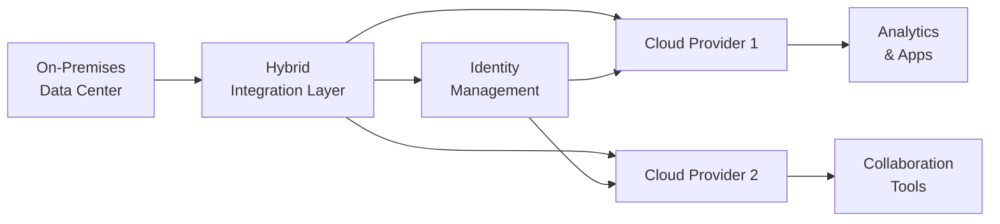

## 29.2 Multi‑Cloud and Hybrid Configurations: Risks and Controls

Organizations today have a wealth of choices when determining where to host their data, applications, and supporting infrastructure. The growing popularity of multi‑cloud and hybrid cloud solutions reflects the evolving needs of modern businesses: reducing vendor lock‑in while meeting specialized requirements for performance, compliance, and cost. However, operating across multiple cloud service providers (CSPs) or mixing on‑premises IT with cloud solutions also introduces new layers of complexity and risk. This section explores the strategic and operational considerations of multi‑cloud and hybrid environments, emphasizing their benefits, potential pitfalls, and recommended controls—especially around consistent identity management.

Organizations and practitioners can harness these insights to design effective cloud governance and controls that align with recognized frameworks and standards (e.g., COBIT, COSO, AICPA SOC engagements) while optimizing system performance, availability, and security.

-----------------------

### Key Concepts and Terminology

• Multi‑Cloud: Refers to the use of two or more CSPs (e.g., AWS, Microsoft Azure, GCP, or niche providers) for hosting various applications or components.  
• Hybrid Cloud: Involves a combination of a private or on‑premises environment (often referred to as a private cloud) with public cloud services, interconnected to allow data and application portability.  
• Vendor Lock‑In: The situation in which an organization becomes overly reliant on a single CSP or vendor, making migration or diversification time-consuming and expensive.  
• Identity and Access Management (IAM): A framework of tools and policies ensuring the right individuals access the right resources at the right times. Consistent IAM is crucial across different cloud providers or environments to maintain controls effectively.

-----------------------

### Strategic Rationale for Multi‑Cloud and Hybrid Approaches

#### Reducing Vendor Lock‑In

A primary motivation for multi‑cloud strategies is the desire to avoid overdependence on a single service provider. Vendor lock‑in can lead to higher costs, limited innovation, or challenges when negotiating contract renewals. By distributing critical workloads across multiple providers, businesses can negotiate more favorable terms, tailor each workload to the best‑fit provider’s strengths, and diversify risk. From an accounting perspective, risk diversification can help reduce the likelihood of disruptions impacting financial reporting and business continuity.

#### Leveraging Specialized Services

Different CSPs excel in specific services (e.g., machine learning, data analytics, or certain compliance certifications). Multi‑cloud architectures allow organizations to consume best‑in‑class services from each provider. For example, a retail company might run an ERP system on one provider that has robust enterprise resource planning integrations, while also utilizing advanced machine learning services on a second provider for fraud detection.

#### Regulatory Requirements and Data Governance

In heavily regulated industries (e.g., healthcare, financial services), data residency or privacy laws might mandate hosting certain data within specific geographic regions or with certified providers. Hybrid environments can allow regulated data to remain on‑premises (for tighter control) while other workloads move to a public cloud. This mix can satisfy both internal security policies and external regulatory obligations (see also Chapter 19: Data Confidentiality and Privacy Controls).

#### Cost and Performance Optimization

Workloads often have varying resource demands. Some might require low-latency computing, while others only need sporadic bursts of processing power. Spreading workloads across multiple providers can optimize performance and cost efficiency. However, from a financial audit perspective, tracking costs in multi‑cloud scenarios can be complex. In Chapters 6 and 14, we discuss how robust cost allocation, data analytics, and real-time monitoring tools help control runaway expenses.

-----------------------

### Risks and Challenges of Multi‑Cloud and Hybrid Environments

#### Increased Operational Complexity

When workloads reside on multiple platforms, teams must manage diverse technology stacks, control interfaces, and vendor‑specific services. This can drastically complicate infrastructure monitoring, patch management, and system integration. Chapter 10 (IT Change Management) reminds us that effective patch schedules and version control become more complicated in multi‑cloud setups, leading to greater opportunities for security oversights or misconfigurations.

From a financial statement audit perspective, an overly complex environment may obscure evidence of appropriate controls. It can be harder to demonstrate consistent application of internal controls (e.g., user access reviews, system logging) across different clouds unless carefully documented and automated.

#### Consistent Identity and Access Management (IAM)

Controlling user privileges and access across multiple platforms is crucial. Each CSP offers its own IAM console, tools, and best practices. Managing multiple accounts, roles, permission sets, and security keys for different providers can breed confusion and mistakes if not unified. For instance, the principle of least privilege could be undermined if user roles in one cloud are not aligned with their roles in another. Chapter 18 (Authentication and Access Management) underscores the need for centralized identity, multi‑factor authentication, and single sign‑on solutions to maintain consistency.

#### Data Gravity and Increased Network Complexity

Moving data between on‑premises systems and multiple clouds can introduce latency, increased bandwidth costs, and heightened complexity. Data gravity—where large datasets become difficult to move—can lead to fragmented data sets scattered across different environments. This complicates data analytics, compliance oversight, and backup strategies. When data is dispersed among multiple clouds, ensuring it remains protected (encryption, integrity checks, backups) requires thorough processes and regular validation to avoid disruption.

#### Vendor Management and SLA Complexities

Reliance on multiple CSPs necessitates parallel management of contract terms, service level agreements (SLAs), and performance commitments. Companies must ensure each CSP meets their responsibilities under any relevant auditing standards, such as a SOC 2® or SOC 1® report. If third-party or subservice providers are involved (see Chapter 7.5 Third-Party and Vendor Risk Management), the complexity grows further. Consolidating and reviewing these multiple agreements, ensuring alignment with internal policies, and avoiding conflicting contract clauses can becomes challenging.

#### Security Fragmentation and Attack Surface

Managing security in multi‑cloud and hybrid environments demands that organizations understand each provider’s security model, implement uniform controls, and maintain effective monitoring across diverse infrastructure. Transparent cross‑cloud logging and event orchestration are critical for timely incident detection and response (see Chapter 20: Incident Response and Recovery). Attack surfaces expand when multiple networks, endpoints, and access points exist, making security oversight more demanding.

-----------------------

### Essential Controls for Multi‑Cloud and Hybrid Success

#### Comprehensive Governance Framework

A governance framework aligned with recognized standards—such as COBIT 2019, COSO ERM, or ISO 27001—offers a structured approach to managing multi‑cloud environments. Effective governance encompasses:

• Clear accountability and roles for cloud assets and data.  
• Policies addressing identity management, incident response, and change control.  
• Standardized processes to evaluate new cloud providers or retire existing platforms.

Reference: Chapters 3 (Governance, Frameworks, and Regulatory Environment) and 8 (IT General Controls) describe how to map these frameworks to specific IT controls.

#### Centralized Identity and Access Management

Consistent identity management across clouds is imperative. A robust IAM strategy should feature:

• Single Sign-On (SSO): Simplifies user authentication and ensures uniform access controls.  
• Federated Identity: Links on‑premises directories (e.g., Active Directory) with CSP directories, allowing seamless role or group assignments.  
• Multi‑Factor Authentication (MFA): Reduces the likelihood of credential compromise, especially for privileged accounts.  
• Automated Provisioning and De‑Provisioning: Ensures timely updates to user accounts/roles and prevents orphan accounts.  

Example: An international manufacturing conglomerate with operations worldwide deployed a federated identity solution to unify access across AWS, Azure, and an on‑premises data center. Managers could quickly review who has appropriate rights in each environment, reducing the risk of unauthorized financial or ERP data access.

#### Unified Monitoring and Logging

Monitoring solutions that can integrate with multiple cloud platforms (including on‑premises systems) are essential. One strategy is to standardize on one or two logging platforms or security information and event management (SIEM) tools. This allows consistent log parsing, alert generation, and correlation. Chapter 21 (Testing Security, Confidentiality, and Privacy Controls) elaborates on how logs facilitate evidence gathering in both assurance and forensic investigations.

Example: A large eCommerce retailer uses a cloud‑agnostic SIEM to correlate events from AWS CloudTrail, Azure Monitor, and GCP Cloud Logging in near real-time. This integrated view helps identify suspicious activities—such as multiple failed login attempts across different clouds—enabling a proactive security stance.

#### Automated Configuration Management and Continuous Compliance

Manual processes are prone to error in large multi‑cloud and hybrid environments. Infrastructure as Code (IaC) tools (e.g., Terraform, Ansible, or Chef) standardize deployment templates, configuration parameters, and security baselines across providers. Automated scans can detect “drift” from desired configurations and alert administrators, reducing the risk of misconfiguration. Chapter 10 (IT Change Management) and Chapter 14 (Data Integration and Analytics) stress the importance of automation for consistency and real-time oversight.

#### Resilient Network Architecture

Data routing among multiple clouds, or between on‑premises and cloud, should follow resilient, fault-tolerant designs. Techniques include:

• Redundant network paths and use of multiple internet service providers (ISPs).  
• Encrypted tunnels (VPN or direct connect) to safeguard data in transit.  
• Well-configured load balancers to direct workloads efficiently and handle traffic spikes.  

A structured approach to network segmentation (see Chapter 17: Security Architecture and Network Management) also helps isolate critical environments and reduce the blast radius of a breach.

#### Standardized Disaster Recovery and Business Continuity

While multi‑cloud and hybrid approaches can offer higher availability, organizations must ensure consistent disaster recovery (DR) practices:

• Conduct business impact analyses (see Chapter 9: System Availability and Business Continuity) for each major workload, ensuring the right controls are in place.  
• Establish consistent recovery time objectives (RTOs) and recovery point objectives (RPOs) across CSPs.  
• Regularly test failover and backup restoration, even if each CSP provides guaranteed availability.  

Example: A financial services firm might employ real‑time replication of transaction data between on‑premises data centers and a secondary CSP for rapid failover. The firm’s RTO for critical transaction platforms is four hours, tested semi-annually to validate that cross‑cloud failover works as designed.

#### Cross‑Cloud Cost Management and Financial Controls

Controlling costs can become complicated when each CSP operates on different billing models and metrics (e.g., compute hours, storage tiers, data egress). Institutions should:

• Utilize automated cost‑reporting and budgeting tools from each provider.  
• Consolidate and reconcile cost data into a single platform for financial analysis.  
• Monitor spending thresholds and track unusual usage spikes to detect misconfigurations or security breaches.  

From a CPA’s perspective, these cost management processes help maintain accurate financial statements and reduce the risk of errors or misclassifications (see Chapter 6: Enterprise Resource Planning and AIS).

-----------------------

### Real-World Case Study

ABC Pharma, a midsize pharmaceutical company, sought to reduce regulatory and vendor lock‑in risks. They implemented a hybrid model, storing sensitive clinical trial data on‑premises while using Amazon Web Services for analytics and Microsoft Azure for collaboration.  

1. Data Governance and Compliance:  
   • On‑premises data centers met stringent FDA guidelines for drug trial confidentiality.  
   • De-identified copies of data were pushed to AWS for advanced analytics.  

2. Consistent Identity Management:  
   • Federated identity linked the corporate LDAP to both AWS IAM and Azure Active Directory.  
   • Single sign‑on gave researchers consistent access across platforms, mitigated by multi‑factor authentication.  

3. Network Security and Monitoring:  
   • Secure VPNs and dedicated connections bridged the corporate data center with each CSP.  
   • Logs were streamed into a centralized SIEM for anomaly detection.  

4. Auditing and Reporting:  
   • ABC Pharma commissioned SOC 2® reports covering both the on‑premises environment and controls over each CSP.  
   • The holistic governance alignment reduced operational friction and reassured regulators that sensitive trial data remained secure.  

-----------------------

### Visualizing Multi‑Cloud and Hybrid Configurations

Below is a Mermaid diagram illustrating a simplified multi‑cloud/hybrid architecture, highlighting core components such as the on‑premises data center, multiple CSPs, and a central identity management layer.

Explanation:

• On‑Premises Data Center (A): Hosts legacy systems and sensitive data, behind robust internal firewalls and controls.  
• Hybrid Integration Layer (B): Bridges connectivity, routing, and data exchange among on‑premises systems and public clouds.  
• Identity Management (C): Centralized IAM and SSO platform that handles authentication tokens, role assignments, and multi‑factor authentication.  
• Cloud Provider 1 (D) and Cloud Provider 2 (E): Separate environments, each with unique services and dashboards.  
• Analytics & Apps (F) and Collaboration Tools (G): Illustrate typical workloads within each provider, benefiting from specialized cloud features.

-----------------------

### Best Practices, Pitfalls, and Strategies

Best Practices  
• Develop a formalized cloud governance policy that includes multi‑cloud and hybrid provisions.  
• Invest in cloud‑agnostic monitoring, logging, and security tools, reducing complexity.  
• Implement thorough IAM standards that unify roles across providers (role-based access control).  
• Continuously update cloud skills within the IT and audit teams to ensure evolving threats, technologies, and controls are well understood.

Common Pitfalls  
• Underestimating network costs or latency issues when transferring large volumes of data between clouds.  
• Neglecting to regularly update or standardize security groups, resulting in inconsistent firewall rules.  
• Failing to unify identity directories, leading to siloed user directories and potential credential sprawl.  
• Letting “shadow IT” flourish in a multi‑cloud environment without the knowledge of the central IT or compliance teams.

Mitigation Strategies  
• Start small and scale: pilot projects with well-defined success metrics before expanding multi‑cloud usage.  
• Validate compliance requirements: involve legal and compliance teams early when adopting additional CSPs.  
• Use reference architectures: adopt proven design patterns from CSPs, frameworks like COBIT or NIST, and lessons learned from peers or professional societies.  
• Conduct periodic cross‑cloud security and compliance audits: ensure each environment meets baseline requirements.

-----------------------

### Practical Financial Examples and Considerations

• Cost Overruns: Company A runs data analytics workloads on two clouds. If the project leads to unexpected usage spikes on one provider, the monthly bill could triple. Without consolidated billing and appropriate controls, the CFO might be unaware until the invoice arrives—impacting financial results.  
• Data Transfer Fees: Transferring data from one cloud to another for analysis or backup can result in significant egress charges. Proper cost estimation and usage monitoring are crucial for cost containment.  
• Auditing and Asset Valuation: In multi‑cloud systems, intangible assets like software licenses, service subscriptions, or custom machine learning models can live in different environments. Auditors will want to understand the location, usage, and valuation of these assets for accurate reporting.

-----------------------

### Conclusion

Multi‑cloud and hybrid configurations deliver strategic flexibility and can mitigate the risk of vendor lock‑in. They enable organizations to pick the most suitable resources from different providers, potentially optimizing performance, compliance, and cost. However, their successful deployment requires disciplined governance and robust controls. By standardizing identity management, unifying monitoring and logging, automating configuration, and regularly auditing cross‑cloud environments, organizations can realize the advantages of multi‑cloud strategies while minimizing complexities.  

For CPAs and IT auditors, understanding these architectures is increasingly vital. As these environments proliferate, the profession must maintain a consistent approach to evaluating controls, detecting risk, and providing assurance. By incorporating detailed governance structures, consistent IAM, proactive monitoring, and continuous improvement practices, multi‑cloud and hybrid environments can become agile, secure, and sustainable platforms for modern digital enterprises.

-----------------------

## Test Your Knowledge: Multi-Cloud and Hybrid Cloud Risks and Controls



### Which of the following is a primary benefit of adopting a multi‑cloud strategy?
- [ ] Simplified identity and access management.
- [ ] Guaranteed uniform SLAs across all providers.
- [ ] Reduced requirement for specialized IT skills.
- [x] Lower risk of vendor lock‑in and greater flexibility.

> **Explanation:** One of the central goals of multi‑cloud is to mitigate vendor lock-in by distributing workloads across multiple providers, giving organizations flexibility to choose the best offerings and prevent overdependence on one vendor.

### Which factor complicates user account management when deploying a multi‑cloud environment?
- [ ] Consistent reliance on a single vendor.
- [x] Each cloud provider having distinct IAM tools and policies.
- [ ] Lack of regulatory concerns or compliance requirements.
- [ ] Standardization of security configurations.

> **Explanation:** Each cloud provider has its own IAM console and policy structure. Without a centralized approach, organizations risk inconsistent privilege management across different environments, increasing the likelihood of roles and permissions misalignment.

### What is a typical concern for disaster recovery in a multi‑cloud or hybrid setup?
- [ ] Reducing the utilization of multi‑factor authentication.
- [x] Ensuring consistent RTOs and RPOs across multiple providers.
- [ ] Discontinuing on‑premises environments altogether.
- [ ] Eliminating backups to reduce complexity.

> **Explanation:** Even though multi‑cloud can introduce higher resiliency, organizations must still define and test consistent disaster recovery objectives such as RTO and RPO across providers. Regular testing ensures seamless failover in real-world events.

### How can organizations address the challenge of conflicting SLAs from multiple cloud service providers?
- [ ] Require each provider to have identical terms regardless of services offered.
- [ ] Forego formal service level agreements to avoid confusion.
- [x] Maintain consolidated vendor management and track each provider's SLA commitments.
- [ ] Never run production workloads across more than one provider.

> **Explanation:** When multiple vendors with different SLAs are involved, organizations must have clear vendor management processes to track, enforce, and harmonize each provider’s commitments, ensuring that it aligns with internal performance needs.

### What is the main role of centralized identity management in a multi‑cloud environment?
- [ ] Enabling different password formats for each cloud application.
- [x] Ensuring uniform authentication and access controls across all deployed environments.
- [x] Facilitating single sign‑on for consistent user experience.
- [ ] Removing the need for on‑premises user directories entirely.

> **Explanation:** Centralizing IAM offers a unified method for controlling user access across multiple clouds, minimizing potential security gaps and streamlining identity provisioning and de‑provisioning.

### Which technology approach helps standardize configurations across different CSPs?
- [x] Infrastructure as Code (IaC) tools like Terraform or Ansible.
- [ ] Manual backups of each workload.
- [ ] Paper-based checklists for each environment.
- [ ] Custom scripts that vary for each provider.

> **Explanation:** IaC enables repeatable, automated configuration deployments and policy enforcement, helping maintain consistent security baselines and reduce manual errors.

### In a multi‑cloud architecture, what is the best way to achieve a unified view of logs from different providers?
- [x] Implement a cloud‑agnostic SIEM solution.
- [ ] Store logs only in the primary cloud environment.
- [x] Stream logs into one centralized repository for analysis.
- [ ] Manually download logs to spreadsheets.

> **Explanation:** SIEM tools support ingestion of logs and security events from multiple sources to provide a holistic view of the environment, facilitating detection of suspicious activity and streamlining audit processes.

### Which approach can best mitigate network complexity in a hybrid cloud environment?
- [x] Ensuring redundant network paths and multiple ISPs.
- [ ] Deploying a single firewall for all traffic.
- [ ] Avoiding encryption to simplify connectivity.
- [ ] Relying exclusively on non-critical workloads remaining on-premises.

> **Explanation:** Redundancy ensures a more resilient network. Properly designed connectivity (e.g., multiple ISPs, VPN encryption, load balancing) is essential to handle latency and maintain a secure data exchange.

### When addressing cost management in multi‑cloud setups, which method is most effective?
- [x] Use consolidated billing and automated alerts to monitor expenditures across all CSPs.
- [ ] Assume each provider charges the same rates for data egress.
- [ ] Monitor bills on a quarterly basis to detect spikes.
- [ ] Rely on each departmental budget without central oversight.

> **Explanation:** Companies need consolidated cost monitoring and near real-time alerts to track usage patterns, detect cost anomalies, and avoid unexpected financial surprises.

### True or False: Multi‑cloud environments add complexity but can simultaneously reduce the impact of a single provider outage.
- [x] True
- [ ] False

> **Explanation:** By distributing workloads among multiple providers, an organization’s critical services become less susceptible to a single provider’s downtime. However, complexity does increase and must be managed effectively.



-----------------------

## For Additional Practice and Deeper Preparation

### [Information Systems and Controls (ISC)](https://www.udemy.com/course/isc-cpa-mock-exams/?referralCode=E1217303222935C5E464)

**Information Systems and Controls (ISC) CPA Mocks:** 6 Full (1,500 Qs), Harder Than Real! In-Depth & Clear. Crush With Confidence!

- Tackle full-length mock exams designed to mirror real ISC questions.  
- Refine your exam-day strategies with detailed, step-by-step solutions for every scenario.  
- Explore in-depth rationales that reinforce higher-level concepts, giving you an edge on test day.  
- Boost confidence and minimize anxiety by mastering every corner of the ISC blueprint.  
- Perfect for those seeking exceptionally hard mocks and real-world readiness.

_Disclaimer: This course is not endorsed by or affiliated with the AICPA, NASBA, or any official CPA Examination authority. All content is for educational and preparatory purposes only._
