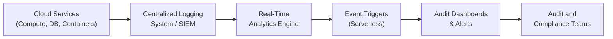

## 29.3 Continuous Auditing and Monitoring in the Cloud

Continuous auditing and monitoring in the cloud has emerged as a key approach for organizations seeking to maintain real-time insight into their systems, applications, and data. In contrast to traditional audit approaches that rely on periodic, retrospective checks, continuous auditing and monitoring leverages real-time or near-real-time data streams—such as system logs, container logs, event triggers, and activity dashboards—to enable faster detection of anomalies, stronger security, and improved compliance posture. For Certified Public Accountants (CPAs) in IT audits or advisory roles, mastery of cloud-based continuous auditing and monitoring frameworks is increasingly critical to delivering timely, value-added services.

This section provides a thorough exploration of how continuous auditing and monitoring works in modern cloud environments. We address the foundational concepts, key components, implementation best practices, related frameworks, and common pitfalls. Additionally, we include illustrative scenarios and case studies to demonstrate effective approaches for achieving near-real-time assurance in diverse financial and operational contexts. By the end, you will understand how to design, implement, and maintain continuous auditing and monitoring processes that align with evolving regulatory, operational, and stakeholder requirements.

  
### Understanding Continuous Auditing and Monitoring

In traditional settings, financial and operational controls are reviewed periodically—often quarterly or annually—to validate compliance with standards like COSO, COBIT, and other regulatory mandates. While these “snapshot” audits can be useful, they often fail to promptly identify and remediate issues due to the lag time between the occurrence of a control deficiency and its discovery. Continuous auditing and monitoring can bridge this gap, enabling real-time or near-real-time examination of systems and processes.

• Continuous Auditing: Typically involves the ongoing collection and analysis of data for audit-specific areas—such as transaction data, control exception reports, and system usage metrics—to highlight deviations from prescribed controls. Automating these processes through scripts or specialized software helps auditors rapidly identify anomalies without manually sifting through large datasets.

• Continuous Monitoring: Refers to the real-time oversight of systems and networks by the organization itself, often as part of operations or security functions. Monitoring solutions scan logs, audit trails, performance metrics, and other streams of data to identify issues such as suspicious account activity, resource misconfigurations, or abnormal transaction flows.

When properly integrated, continuous auditing and continuous monitoring create a synergy in which organizational controls remain continuously enforced, and the periodic audits that follow are augmented by reliable, up-to-date evidence of control operation. This reduces the scope of manual testing, strengthens the organization’s compliance posture, and accelerates the decision-making process for both operational leaders and external stakeholders (e.g., regulators, shareholders).

### Key Components of Continuous Auditing and Monitoring in the Cloud

Modern cloud environments—including public, private, and hybrid deployments—involve complex interactions among virtualized infrastructure, platform services, and application layers. To effectively launch and maintain continuous auditing and monitoring, CPAs and IT auditors must develop proficiency with the following core components:

• Logs and Audit Trails: This includes real-time logs from servers, containers, and microservices that reveal operational, security, and transactional events. In cloud systems, logs can be centralized by services such as AWS CloudWatch, Azure Monitor, and Google Cloud Logging. By configuring these services appropriately (e.g., log retention settings, security measures, or triggers), organizations can gather robust evidence that underpins continuous monitoring.

• Event Triggers: Many cloud providers offer event-driven architectures that can respond decisively to changes in system status. For instance, an event trigger can automatically launch a function or microservice when an anomaly—like elevated error rates or suspicious data access—is detected. This can facilitate near-immediate forensic analysis or remediation measures, generating real-time assurance.

• Container Logs and Orchestration Data: Organizations increasingly rely on container-based deployment models, using platforms like Docker or Kubernetes. Continuous auditing in these environments involves tapping into container logs at runtime, analyzing them for signs of misconfiguration or security vulnerabilities, and ensuring that container images used in production conform to baseline expectations and remain unaltered.

• Monitoring Dashboards and Analytics: Continuous monitoring involves front-end dashboards—often integrated into Security Information and Event Management (SIEM) or Security Orchestration, Automation, and Response (SOAR) tools—that aggregate alerts, metrics, and logs into a single source of truth. These dashboards help extract relevant insights for auditors, enabling quick decisions based on real-time, data-driven feedback.

• Automated Controls and Policies: Governance in the cloud is strengthened by Infrastructure as Code (IaC) templates, container security configurations, Identity and Access Management (IAM) policies, and other automated controls that enforce best practices. Continuous auditing inspects these automated measures to ensure compliance with frameworks like COBIT, COSO, or the AICPA Trust Services Criteria (particularly in SOC 2® or SOC for Cybersecurity engagements).

### Benefits of Continuous Auditing and Monitoring

• Enhanced Visibility: By pooling logs, metrics, and events from disparate cloud systems in real time, organizations gain a more holistic view of risk exposure. This visibility extends to transaction anomalies, user authentication, network traffic, and data flows critical to financial reporting.

• Quicker Response to Threats: Continuous monitoring can identify security breaches or system failures in near-real time, enabling the organization to investigate and remediate incidents before they escalate to more significant breaches or compliance violations.

• Improved Compliance Posture: Continuous capture of system and transaction data simplifies evidence collection for audits. Instead of scrambling to compile logs at the end of a reporting period, organizations maintain an ongoing repository of data that is always ready for inspection. This operational data forms a robust foundation for supporting the organization’s compliance with regulatory requirements.

• Resource Efficiency: Automated audits reduce the volume of manual testing. This allows auditors to focus on high-risk areas, judgmental testing, or strategic guidance rather than data collection and sample extraction. Over time, well-designed continuous auditing solutions lower overall auditing and compliance costs by reducing rework and employing proactive alerts.

• Real-Time Risk Management: In high-stakes environments—whether related to financial reporting or mission-critical business processes—management can detect, quantify, and manage emerging risks. Trend analyses and data analytics can uncover patterns early, preventing broader impacts on financial statements or organizational performance.

### Implementation Steps and Best Practices

Achieving continuous auditing and monitoring in the cloud is not a plug-and-play exercise; it demands coordination among business stakeholders, IT personnel, and audit teams. Below is an outline of recommended steps and best practices:

Define Objectives and Scope  
• Determine the primary assurance objectives: financial reporting accuracy, operational risk management, cybersecurity monitoring, etc.  
• Identify the scope of cloud services, including Infrastructure as a Service (IaaS), Platform as a Service (PaaS), and Software as a Service (SaaS). Consider referencing Chapter 5 on IT Infrastructure Fundamentals to align cloud components with your organization’s architecture.

Establish Roles and Responsibilities  
• Ensure clarity among the finance, audit, and IT teams.  
• Conduct training for staff on interpreting real-time alerts or logs.  
• Reference Chapter 2 for common IT roles and responsibilities in organizations.

Select Monitoring Tools and Services  
• Evaluate native monitoring services offered by your cloud provider or third-party SIEM/monitoring solutions (e.g., Splunk, Datadog, ELK Stack).  
• Align your tool selection with relevant frameworks, such as NIST SP 800-137 (Information Security Continuous Monitoring), COBIT, or the AICPA Trust Services Criteria.

Set Up Logging and Event Trigger Mechanisms  
• Determine which log sources are essential to collecting evidence for your objectives—application logs, container logs, security logs, database logs, network logs, etc.  
• Configure event triggers (e.g., AWS Lambda, Azure Functions, Google Cloud Functions) to respond automatically to anomalies, initiating triage or remediation steps.

Develop Analytics and Alert Thresholds  
• Employ analytics to detect normal vs. abnormal behavior patterns.  
• Calibrate your threshold levels for high-priority alerts. Set up robust escalation paths to ensure that critical alerts receive immediate attention.

Implement Continuous Control Monitoring (CCM)  
• Integrate real-time data analytics to validate that internal controls remain effective.  
• Use dashboards for management oversight, focusing on metrics like access attempt anomalies, system error rates, unexpected configuration changes, or transaction irregularities.

Manage Exceptions and Escalations  
• Design remediation workflows to handle incorrectly flagged events, user-access anomalies, or suspicious transactions.  
• Document root causes and improvements; store these findings for future reference.

Establish Ongoing Governance and Review  
• Periodically review and adjust your continuous auditing framework.  
• Regularly test your triggers and monitoring logic to maintain system reliability and accuracy.  
• Leverage guidelines in Chapter 3 (Governance, Frameworks, and Regulatory Environment) to ensure governance processes align with recognized standards.

By systematically adopting these steps and best practices, organizations can build a robust approach to continuous auditing and monitoring that integrates seamlessly with their existing risk management posture.

### Practical Financial Examples and Case Studies

• Real-Time Checking of Accounts Payable for Duplicate Payments  
In a large retail environment, the Accounts Payable (AP) system is deployed on a cloud-based ERP (refer to Chapter 6 on Enterprise Resource Planning and Accounting Information Systems). By using continuous monitoring scripts to flag potential duplicate invoices in near-real time, any suspicious transaction is immediately routed to an accounting supervisor for confirmation. This helps reduce financial leakage and detection risk while providing an automated audit trail.

• Immediate Response to Suspicious User Access  
A financial services firm uses containerized microservices for its web-based trading platform (running on Kubernetes). Logs captured from container orchestrators are continuously analyzed for anomalies in user access patterns—such as failed login attempts, abrupt spikes in request volume, or attempts to access restricted resources. Alerts are triggered via an event-driven function (e.g., Azure Function) that automatically places a temporary block on the user account until further validation. This scenario underscores how container logs and event triggers can play a key role in near-real-time assurance.

• Monitoring of Cloud Resource Configuration  
A multinational corporation operating under strict regulatory mandates (e.g., GDPR or PCI DSS) employs a continuous monitoring service that checks for correct configurations in each resource provisioned across AWS, Azure, and GCP. Whenever a security group or virtual machine port setting deviates from documented policy, the system immediately triggers an automatic rollback to the last known good configuration. This drastically diminishes the risk of inadvertent misconfigurations leading to sensitive data exposure.

### Visual Representation of Continuous Auditing Flow

Below is a simplified Mermaid diagram illustrating how logs and event triggers can facilitate continuous auditing and near-real-time assurance:

1. Cloud resources (servers, databases, containers) generate logs.  
2. A centralized logging system or SIEM collects these logs.  
3. A real-time analytics engine processes the logs for potential anomalies.  
4. Event triggers (e.g., serverless functions) respond to anomalies by alerting or remediating.  
5. Audit dashboards display relevant insights and alerts.  
6. Audit and compliance teams review findings, investigate exceptions, and document control effectiveness.

### Common Pitfalls and Challenges

Despite its many advantages, continuous auditing and monitoring is not without pitfalls:

• Overreliance on Automation: While automation streamlines data collection and analysis, human judgment is necessary to interpret nuanced findings. A well-balanced approach includes both automated and manual oversight.

• Alert Fatigue: Excessive or poorly calibrated alerts can overwhelm staff. Strategies like threshold tuning, intelligent filtering, and the introduction of “alert severity” levels help mitigate the risk of ignoring real anomalies.

• Integration Complexity: Organizations that adopt multi-cloud or hybrid cloud environments may struggle to integrate logging and monitoring tools across diverse platforms. This can force data silos or coverage gaps. Adequate planning and standardized data formats are crucial.

• Privacy and Compliance Risks: In heavily regulated environments (e.g., healthcare or financial services), capturing logs may inadvertently reveal sensitive information, requiring careful data governance and anonymization to remain compliant with regulations such as HIPAA or GDPR.

• Skilled Resource Shortage: Continuous monitoring tools require specialized knowledge for deployment, tuning, and interpretation. Without trained personnel, organizations are more prone to implementing suboptimal solutions that produce unreliable or unhelpful results.

### Strategies to Overcome Challenges

• Implement a Phased Rollout: Start by monitoring the most critical systems (e.g., those affecting financial reporting) and gradually expand to less critical systems. This prevents “scope creep” and ensures success in high-priority areas.

• Develop a Governance Framework: A formal governance structure helps maintain accountability. Use insights from Chapter 3 (Governance, Frameworks, and Regulatory Environment) to align continuous monitoring initiatives with strategic goals, risk appetite, and compliance mandates.

• Conduct Periodic Refinement: By analyzing incident trends and user feedback, teams can regularly refine thresholds for anomaly detection, thereby reducing false positives and streamlining triage processes.

• Adopt a Comprehensive Training Program: Ensure adequate training is provided to IT, finance, and audit professionals. Teams should grasp the basics of cloud computing, log analysis, event-trigger configuration, and the relevant frameworks (e.g., COBIT, COSO, AICPA Trust Services).

• Leverage Third-Party Expertise and Tools: When internal resources are insufficient, external advisors can help navigate complex tool integrations, design advanced analytics scripts, and introduce best practices from successful implementations.

### Future Outlook

As cybersecurity threats and regulatory demands continue to escalate, the reliance on continuous auditing and monitoring in the cloud is poised to grow. Emerging innovations like machine learning–driven anomaly detection, advanced container orchestration tools, and serverless computing will further transform the audit and compliance landscape. For CPAs who embrace these technologies, new opportunities will emerge to serve as strategic and trusted advisors, helping organizations optimize their cloud deployments while maintaining robust controls and data integrity.

### References and Further Exploration

• AICPA SOC 2® and SOC for Cybersecurity Guidance: Provides insights into continuous auditing controls related to security, availability, and processing integrity.  
• COSO Internal Control – Integrated Framework: Offers foundational elements for aligning real-time monitoring with overarching internal control objectives.  
• NIST SP 800-137, “Information Security Continuous Monitoring (ISCM) for Federal Information Systems and Organizations”: Offers a structured approach to continuous monitoring.  
• Major Cloud Providers’ Documentation (AWS, Azure, GCP): Each provider details best practices for setting up logs, event triggers, and real-time analytics within their platform.  

By staying informed, refining best practices, and leveraging cutting-edge tools for log management and analytics, CPAs and IT auditors can deliver the timely insight needed to uphold organizational resilience, protect customer data, and safeguard financial reporting reliability.  

## Test Your Knowledge on Continuous Cloud Auditing and Monitoring



### Which of the following statements best describes continuous auditing?

- [x] Ongoing, automated analysis of data to highlight deviations from control expectations.
- [ ] Annual testing of IT controls.
- [ ] A thorough manual approach to verifying monthly transaction logs.
- [ ] Ad hoc analysis that happens only after an incident.

> **Explanation:** Continuous auditing uses ongoing, automated data analysis to detect anomalies and deviations from controls in real or near-real time.

### What is the main advantage of configuring event triggers in a cloud environment?

- [x] They can automatically respond to anomalies or unusual activity for near-real-time action.
- [ ] They replace the need for a formal auditing process.
- [ ] They eliminate all manual interventions in system monitoring.
- [ ] They are only used for user access management.

> **Explanation:** Event triggers allow organizations to immediately respond to anomalies, invoking remediation scripts or lockdown procedures without waiting for manual input.

### Which of the following is a key action for reducing false positives in continuous monitoring?

- [x] Tuning alert thresholds based on historical data and periodic review.
- [ ] Generating more alerts for each log entry.
- [ ] Setting all alerts to the highest severity level by default.
- [ ] Disabling alert notifications to reduce personnel fatigue.

> **Explanation:** Adjusting alert thresholds based on user feedback and historical patterns reduces noisy or low-value alerts, improving overall detection accuracy.

### In a containerized environment, which log source is particularly critical for real-time monitoring?

- [x] Container logs (e.g., Docker, Kubernetes).
- [ ] Only logs from the hypervisor.
- [ ] Generic server logs without application context.
- [ ] Corporate email logs.

> **Explanation:** Container logs provide granular insights into runtime behavior, which is essential for detecting anomalies within containerized applications.

### Which best practice can help mitigate the risk of “alert fatigue” among monitoring staff?

- [x] Introducing alert severity levels and focusing on high-priority alerts first.
- [ ] Sending out an SMS every time an event occurs, regardless of severity.
- [x] Automating the remediation of low-severity alerts to reduce manual intervention.
- [ ] Ignoring certain segments of operational logs for efficiency.

> **Explanation:** By assigning severity levels and automating remedies for low-criticality alerts, staff can prioritize attention on more serious and time-sensitive alerts.

### Why is periodic refinement and tuning essential in continuous auditing?

- [x] It ensures monitoring thresholds and rules keep pace with changing operational and threat landscapes.
- [ ] It helps remove an auditor’s discretion in evaluating results.
- [ ] It eliminates the need to revisit historical data.
- [ ] It guarantees that all alerts produced are high severity.

> **Explanation:** Continuous auditing solutions require ongoing calibration to remain effective over time as systems evolve and new threats emerge.

### What is the most significant challenge in implementing continuous auditing in multi-cloud environments?

- [x] Managerial complexities and lack of standardization across different cloud platforms.
- [ ] Unified log collection in a single vendor environment.
- [x] All required logs are automatically correlated by default.
- [ ] Implementing an on-premise SIEM solution in a single private cloud.

> **Explanation:** Multi-cloud setups often lack uniform logging and resource configurations, increasing integration difficulties that must be managed through standardized approaches and tool interoperability.

### How can automated infrastructure code (IaC) templates improve continuous monitoring processes?

- [x] By ensuring cloud resources are consistently deployed according to standardized security and compliance baselines.
- [ ] By preventing all modifications to cloud resources.
- [ ] By only allowing periodic configuration changes during audits.
- [ ] By eliminating the need for scanning or logging.

> **Explanation:** IaC allows consistent provisioning and enforcement of controls, making it easier to detect/change deviations from approved configurations in near-real time.

### What is the primary benefit of real-time log aggregation into centralized dashboards?

- [x] Provides an aggregated view of system health, enabling instant detection of anomalies across diverse environments.
- [ ] Removes the need for system-level access controls.
- [ ] Guarantees no further manual review is needed.
- [ ] Restricts the ability of each department to control its own data.

> **Explanation:** Real-time dashboards provide a single pane of glass for monitoring multiple environments and identifying cross-system anomalies, improving response efficiency.

### Continuous auditing in the cloud reduces the likelihood of detecting issues only after they have impacted financial statements.

- [x] True
- [ ] False

> **Explanation:** Continuous auditing surfaces problems in real or near-real time, allowing them to be addressed and remedied promptly before they significantly affect financial reports.



## For Additional Practice and Deeper Preparation

### [Information Systems and Controls (ISC)](https://www.udemy.com/course/isc-cpa-mock-exams/?referralCode=E1217303222935C5E464)

**Information Systems and Controls (ISC) CPA Mocks:** 6 Full (1,500 Qs), Harder Than Real! In-Depth & Clear. Crush With Confidence!

- Tackle full-length mock exams designed to mirror real ISC questions.  
- Refine your exam-day strategies with detailed, step-by-step solutions for every scenario.  
- Explore in-depth rationales that reinforce higher-level concepts, giving you an edge on test day.  
- Boost confidence and minimize anxiety by mastering every corner of the ISC blueprint.  
- Perfect for those seeking exceptionally hard mocks and real-world readiness.  

_Disclaimer: This course is not endorsed by or affiliated with the AICPA, NASBA, or any official CPA Examination authority. All content is for educational and preparatory purposes only._
