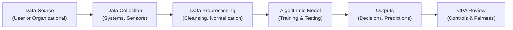

## 30.1 Ethical Data Usage, Algorithmic Bias, and Fairness

Ethical considerations around data usage continue to intensify as organizations increasingly rely on powerful analytics, Artificial Intelligence (AI), and Machine Learning (ML) to drive profit, efficiency, and strategic decision-making. While these technologies offer remarkable benefits, they also pose significant ethical challenges. From controversies over unauthorized collection and sharing of data to unintended discrimination embedded in AI systems, it is critical that corporate leaders, including Certified Public Accountants (CPAs), understand the key concepts of “ethical data usage,” “algorithmic bias,” and “fairness” to guide their organizations responsibly.

As financial professionals with a deep understanding of risk, controls, and compliance, CPAs are uniquely positioned to assist with ensuring that data-centric processes align with legal mandates and uphold public trust. This section explores controversies around data usage, examines sources and impacts of algorithmic bias, and highlights the CPA’s critical role in championing fairness, transparency, and accountability within today’s data-driven enterprises.

  
### The Importance of Ethical Data Usage

In a digital economy, data has become a currency of vast economic value. Real-time analytics, process automation, and advanced modeling rely on large volumes of data, often including sensitive or personal information. With this reliance come significant ethical responsibilities:

• Upholding Stakeholder Trust: Data breaches, negligent data handling, or misuse of personal information can erode public trust and harm an organization’s reputation.  
• Complying with Regulatory Requirements: Governments worldwide enact data protection laws such as the General Data Protection Regulation (GDPR) in the European Union, the California Consumer Privacy Act (CCPA), and other frameworks aimed at safeguarding citizens’ rights.  
• Balancing Innovation and Privacy: While rapid data-driven innovation fuels organizational success, it must be balanced against individuals’ rights to control and protect their data.  

Modern CPAs, intimately involved in both financial oversight and internal controls, can help ensure data usage adheres to legal, ethical, and organizational standards. Their skill in risk assessment and continuous monitoring of controls (see Chapter 4: Key Concepts of IT Audit and Assurance) is invaluable for instituting policies that align with ethical and regulatory benchmarks.

  
### Common Controversies in Data Usage

Organizations can become embroiled in controversies when ethical obligations around data usage are disregarded or overlooked. Notable controversies include:

• Unauthorized Data Harvesting: Tech giants and data brokers often face accusations of collecting user data without explicit consent. For example, social media scandals in which user data was sold or shared with third parties created public outcry and legal ramifications.  
• Invasive Surveillance: Employers increasingly monitor employees’ email, internet browsing, and even physical movement for productivity. If handled without transparency or explicit employee consent, this can lead to ethical and legal challenges.  
• Data Monetization: Many organizations view personal data as an asset to be monetized. Selling user data to third parties without clear authorization can spark lawsuits, regulatory fines, and reputational damage.  
• Inadequate Safeguards: In many data-driven systems, security vulnerabilities allow hackers to steal personally identifiable information (PII). Ransomware attacks, data leaks, and system intrusions not only harm organizations financially but also raise ethical questions regarding prevention adequacy.  

CPAs who engage in system audits and who collaborate closely with IT departments can help create robust data governance frameworks. Through cross-reference with Chapter 19: Data Confidentiality and Privacy Controls, auditors can assess whether data collection, retention, and sharing policies conform to relevant laws and best practices.

  
### Algorithmic Bias: Definitions and Real-World Impacts

Algorithmic bias is a discrepancy in the outputs of a computational model, system, or process that unfairly disadvantages specific groups (such as by race, gender, age, or other protected characteristics). Bias can arise for many reasons, including incomplete or non-representative data, flawed sampling methods, or unintentional assumptions hardcoded into model logic. Far from a purely technical issue, algorithmic bias has tangible societal and financial consequences, such as:

• Skewed Credit Decisions: Automated loan application scoring systems might disqualify certain communities for mortgages or lines of credit if historical data is biased.  
• Unfair Hiring Practices: AI-driven applicant tracking systems might filter out deserving candidates if the training data is biased toward certain demographics.  
• Biased Policing and Sentencing: Predictive policing tools have faced criticism for reinforcing racial or socioeconomic stereotypes. Biased data from historically over-policed neighborhoods can lead to a cycle of over-enforcement and further skew results.  
• Healthcare Disparities: AI-based healthcare diagnostics might misdiagnose or underdiagnose diseases in certain minority populations if training datasets underrepresent them.  

#### Types of Algorithmic Bias

• Sampling Bias: The data used to train the model does not accurately represent the target population.  
• Measurement Bias: Flaws in how attributes or outcomes are measured can produce inaccurate or skewed results.  
• Confirmation Bias: Developers or stakeholders design or interpret models in a way that reinforces pre-existing beliefs.  
• Exclusion Bias: Certain features or groups are systematically omitted from the dataset, producing results that ignore critical information.  

These biases often go unnoticed when organizations focus predominantly on model accuracy or cost savings rather than ethical and social outcomes. CPAs can serve as independent advisors or auditors, embedding critical review of algorithmic decisions within daily risk management routines.

  
### Fairness in Algorithmic Decision-Making

Fairness in algorithmic systems encompasses the principles and practices that aim to distribute risks, benefits, and performance equitably across all demographic or stakeholder groups. In the context of data analytics, fairness includes:

• Equal Opportunity: Similar individuals (regardless of group identity) should experience similar outcomes.  
• Disparate Impact Monitoring: Systems should be monitored for unintended discriminatory outcomes (even in the absence of explicit intent).  
• Transparency and Explainability: Users affected by automated decisions should understand how algorithms arrive at conclusions.  

#### Monitoring Fairness

Organizations should adopt fairness metrics suited to their context. Examples might include measuring the difference in false positive and false negative rates across protected classes or analyzing how often algorithmic decisions align with human-evaluated “ground truths.” By referencing Chapter 14: Data Integration and Analytics, CPAs can understand how data from multiple sources merges in an advanced analytics environment and how to detect potential discrepancies.  

#### Regulatory Frameworks Related to Fairness

• Equal Credit Opportunity Act (ECOA) in financial services within the U.S.  
• Title VII of the Civil Rights Act and anti-discrimination legislation in employment decisions  
• GDPR “Human-in-the-loop” requirements for automated decisions within the E.U.  

  
### Role of CPAs in Ensuring Fairness and Transparency

Because CPAs already manage high-stakes responsibilities involving internal controls, financial reporting, and regulatory compliance, they are strategically positioned to incorporate checks and balances for algorithmic fairness. Key contributions include:

• Oversight of Internal Controls: CPAs can extend control frameworks overlaying financial data to include data used by AI algorithms. This ensures that data lineage and transformations are well-documented, as discussed in Chapter 8: IT General Controls (ITGC) – Standard Domains.  
• Risk Assessments and Auditing: CPAs skilled in risk analysis can evaluate whether algorithmic outputs might threaten compliance with anti-discrimination or fairness statutes.  
• Policy Formulation and Monitoring: CPAs can advocate for organizational policies that promote transparent data usage, well-documented governance processes, and thorough fairness reviews for AI-based decisions.  
• Collaboration with Data Scientists: By collaborating with data analytics teams, CPAs can help set objective thresholds and interpret data in ways that reduce bias. For instance, by ensuring data from multiple demographic segments is accurately represented.  
• Stakeholder Communication: CPAs often report findings to Boards of Directors and audit committees. Their voice can elevate fairness and transparency as core organizational values, prompting stronger accountability measures.  

  
### Practical Steps and Best Practices

Though many organizations struggle to address algorithmic bias, the following steps can guide CPAs, controllers, and finance leaders toward more equitable, transparent data usage:

**Clarify Data Usage Policies**  
Craft policies that clearly delineate what data is collected, how it is stored, and who has access. Outline consent requirements for personal data usage and incorporate the principle of least privilege, as explained in Chapter 18: Authentication and Access Management.

**Conduct Bias Audits**  
Just as organizations undergo financial statement audits, they can undergo “bias audits” of algorithms. These audits can involve statistical checks for disparate outcomes across demographic groups, including analyses of how missing data might skew results.  

**Institutionalize Privacy and Ethics Committees**  
Similar to compliance-focused committees, organizations can form a Data Ethics Committee that includes CPAs, legal counsel, IT specialists, and operational managers. This fosters a holistic perspective on data usage that merges financial, ethical, and regulatory considerations.

**Use Data Governance Frameworks**  
Adopt established frameworks such as COBIT 2019 (see Chapter 3: Governance, Frameworks, and Regulatory Environment) to formalize governance structures around data use. Define accountability, identify process owners, and embed ethics reviews into existing IT governance routines.

**Promote Data Diversity**  
To reduce the risk of model bias, encourage the use of varied data sources. Actively search for demographic gaps, and enrich datasets, if ethically permissible, to ensure representativeness. For instance, a credit-scoring model might need to incorporate more varied data from different socioeconomic groups to avoid inadvertently amplifying biases.

**Leverage Explainable AI (XAI) Tools**  
Explainable AI aims to make “black box” algorithms more transparent by clarifying the decision-making logic or highlighting critical variables. CPAs can work with technology experts to analyze these explanation outputs and confirm that decisions align with ethical and legal standards.

**Review Vendor and Third-Party Models**  
If relying on outside vendors for critical analytics, ensure that data usage agreements and vendor contracts specify acceptable data handling procedures and require fairness checks. Chapter 7.5: Third-Party and Vendor Risk Management offers deeper insight into managing external relationships.

  
### Case Studies: Ethical Data Usage and Algorithmic Bias

Below are two illustrative scenarios highlighting the pitfalls and solutions relevant to CPAs:

**Case Study 1: Loan Approval System with Hidden Bias**  
A regional bank adopts a machine learning model to automate loan approval. Six months post-deployment, the bank notices a measurable reduction in approval rates for certain minority applicants. After investigating, they discover that historical data used to train the model underrepresented minority borrowers who had been denied credit in past generations. In this scenario, CPAs collaborated with data scientists to review the biases embedded in the historical dataset, rebalanced the data, and implemented fairness metrics. The bank also updated their governance policies, added an annual bias audit, and improved transparency with applicants through system-driven user explanations.

**Case Study 2: Retail Analytics and Invasive Marketing**  
A large retail chain tracks customers’ in-store movements via Wi-Fi signals and cross-references with personal profiles from loyalty programs. This approach triggers allegations of invasive surveillance when local media reveals how the store triangulates personal addresses and purchase histories to send targeted advertisements, including discounts on items that some customers deem overly personal. In response, CPAs among the executive leadership develop new data governance policies, ensure the retail chain updates its privacy statements, and incorporate stronger access controls to limit the scope of personally identifiable information. Public trust recovers once the store proves its compliance and clarifies to shoppers how and why data is used.

  
### Diagram: A High-Level View of the Algorithmic Lifecycle

Below is a simple flowchart depicting how data travels through an algorithmic lifecycle, highlighting potential points of CPA review and ethical oversight.

• Data Source (A): Original data from users, customers, or internal systems.  
• Data Collection (B): Automated or manual ingestion processes.  
• Data Preprocessing (C): Cleaning and normalizing data for modeling.  
• Algorithmic Model (D): AI or statistical techniques.  
• Outputs (E): Model predictions or decisions.  
• CPA Review (F): Auditing, bias detection, and recommendation of corrective actions.

  
### Challenges, Pitfalls, and Solutions for CPAs

• **Pitfall: Lack of Technical Knowledge**  
  – **Solution:** CPAs can engage in continuous learning on machine learning and data analytics fundamentals or collaborate with data scientists who can clarify the complexities.  

• **Pitfall: Underestimating Data Privacy**  
  – **Solution:** CPAs must stay updated on data privacy regulations (e.g., GDPR, HIPAA, CCPA) and ensure that compliance is integrated into risk assessments and audits.  

• **Pitfall: Insufficient Documentation**  
  – **Solution:** Mandate clear documentation of data lineage, model versions, assumptions, and control activities through well-structured IT policies (see Chapter 34.1: Sample IT Policies and Procedures).  

• **Pitfall: Neglecting Human Oversight**  
  – **Solution:** Set up checks and balances, such as a human-in-the-loop mechanism, to override or scrutinize model results that significantly impact stakeholders’ well-being or rights.  

  
### Looking Ahead

As data becomes central to nearly every aspect of business, CPAs’ ethical stewardship will be pivotal in advancing responsible analytics. By coupling technical knowledge with a commitment to fair and transparent practices, CPAs can act as trusted guardians of ethical data usage. Emerging technologies—like AI-driven risk analytics, blockchain-based identity verification, and real-time anomaly detection—will require further vigilance, ensuring that innovative solutions adhere to moral and legal standards.

  
### References and Further Reading

• Barocas, S., Hardt, M., & Narayanan, A. (2019). Fairness in Machine Learning.  
• AICPA (2022). Guide to Data Analytics and Ethics in Auditing.  
• European Commission. Guidelines on Automated Decision-Making Under GDPR.  
• U.S. Department of Justice. Guidance for Evaluating Corporate Compliance Programs (Data Sections).  

  
## Assess Your Understanding of Ethical Data Usage, Bias, and Fairness



### Which of the following is an example of ethical data usage best practice?

- [x] Ensuring individuals are informed about how their data is collected and used.
- [ ] Storing data indefinitely to enable future analytics needs.
- [ ] Promoting minimal transparency to avoid overwhelming end-users.
- [ ] Offering data opt-outs only for paying customers.

> **Explanation:** Ethical data usage typically includes informed consent, giving individuals clear information about how their data will be used and the ability to opt out.

### What is a primary cause of algorithmic bias?

- [x] Incomplete or non-representative training data.
- [x] Hidden assumptions coded into the algorithm.
- [ ] Highly diverse data representing multiple demographics.
- [ ] Algorithms designed to measure fairness metrics.

> **Explanation:** Algorithmic bias often arises when data fails to represent all population segments or when implicit human assumptions introduce certain biases.

### Which key characteristic(s) help define fairness in algorithmic decision-making?

- [x] Equal opportunity for individuals with similar qualifications.
- [x] Transparency and explainability of how results are derived.
- [ ] Unrestricted use of personal data in a model.
- [ ] Elimination of all automated renewals of personal data.

> **Explanation:** Fairness usually includes ensuring equal opportunity and transparency. Data usage must also be balanced against privacy rights.

### How can CPAs help mitigate algorithmic bias in an organization?

- [x] By including fairness metrics in internal audits and risk assessments.
- [ ] By automatically rejecting all AI and ML models to avoid risk.
- [ ] By removing any limitations on data gathering and analysis.
- [ ] By ignoring widely accepted data governance frameworks.

> **Explanation:** CPAs can integrate fairness reviews into audit and risk processes, ensuring that data governance adheres to regulations and ethics principles.

### Which of the following best describes a bias audit?

- [x] A systematic review of algorithmic outputs for potential discrimination.
- [ ] An informal assessment of user opinions about data usage.
- [x] Statistical checks to measure disparate outcomes across demographics.
- [ ] A review limited to compliance with finance and tax regulations only.

> **Explanation:** A bias audit uses statistical techniques and other analytical processes to detect patterns of discrimination in algorithmic decisions.

### In the context of data governance, why is the principle of least privilege helpful?

- [x] It limits data access to only those who truly need it.
- [ ] It promotes free data sharing throughout the organization.
- [ ] It eliminates the need for data privacy regulations.
- [ ] It ensures all employees have equal data access at all times.

> **Explanation:** The principle of least privilege restricts access to data, reducing the likelihood of misuse or accidental exposure.

### Which regulatory frameworks highlight principles relevant to algorithmic fairness?

- [x] GDPR.
- [ ] Only frameworks focused on financial statements.
- [x] Equal Credit Opportunity Act (ECOA).
- [ ] PCI DSS in all situations.

> **Explanation:** GDPR covers automated decision-making and data protection, while ECOA mandates equitable treatment in credit decisions. PCI DSS is primarily focused on payment card security, though it can intersect with broader compliance in specific domains.

### What is a common pitfall when implementing AI-driven recruitment tools?

- [x] Training the model on historical data that reflects past biases.
- [ ] Maintaining comprehensive documentation of the model’s logic.
- [ ] Employing a variety of demographic datasets.
- [ ] Routinely performing fairness checks and outcome analyses.

> **Explanation:** Many organizations inadvertently create biased models by training them on historical data that may reflect past discriminatory practices.

### Which approach can help ensure explainability in AI models?

- [x] Using interpretable modeling techniques or post-hoc explanation methods.
- [ ] Relying exclusively on black-box models without user intervention.
- [ ] Eliminating performance metrics from consideration.
- [ ] Restricting data to a single demographic only.

> **Explanation:** Explainable AI (XAI) methods attempt to clarify how inputs influence outputs, thus enhancing transparency and fairness.

### T or F: Eliminating all use of personal data is the only way to ensure fairness.

- [x] True
- [ ] False

> **Explanation:** This statement is not truly correct. While it might eliminate some biases by removing personal data, it may also hamper insights necessary for detecting discrimination and providing equitable outcomes. Stripping all personal data is rarely practical or useful; the key is employing governance strategies that enforce fairness and minimize discriminatory risk.



---

## For Additional Practice and Deeper Preparation

### [Information Systems and Controls (ISC)](https://www.udemy.com/course/isc-cpa-mock-exams/?referralCode=E1217303222935C5E464)

**Information Systems and Controls (ISC) CPA Mocks:** 6 Full (1,500 Qs), Harder Than Real! In-Depth & Clear. Crush With Confidence!

- Tackle full-length mock exams designed to mirror real ISC questions.  
- Refine your exam-day strategies with detailed, step-by-step solutions for every scenario.  
- Explore in-depth rationales that reinforce higher-level concepts, giving you an edge on test day.  
- Boost confidence and minimize anxiety by mastering every corner of the ISC blueprint.  
- Perfect for those seeking exceptionally hard mocks and real-world readiness.  

_Disclaimer: This course is not endorsed by or affiliated with the AICPA, NASBA, or any official CPA Examination authority. All content is for educational and preparatory purposes only._
