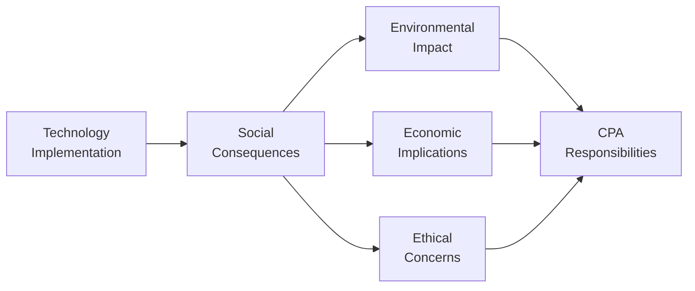

## 30.2 Social Impact of Technology and CPA Responsibilities

Technology has transformed the way individuals, organizations, and entire industries interact, collaborate, and innovate. Yet with each advance comes a distinct set of social implications, which may include environmental footprints, effects on community well-being, and the expansion or contraction of economic opportunities. CPAs, given their organizational insight and professional expertise, can serve as pivotal advisors on corporate strategies relating to the social impact of technology. By examining the broader societal and environmental consequences of technological adoption, CPAs can help align corporate objectives with ethical and responsible practices.

In this section, we will discuss how CPA professionals can navigate the social impact of technology, explore best practices to ensure equitable and sustainable outcomes, and highlight real-world scenarios where CPAs provide indispensable guidance. We will also address important issues such as environmental footprints, the digital divide, and stakeholder engagement.

## Understanding the Social Impact of Technology

Technology is one of the most powerful forces shaping society. While innovations ranging from artificial intelligence to mobile apps and cloud computing can yield productivity and convenience improvements, they can also produce unintended consequences. These consequences influence different aspects of society, including:

• Environmental impact (e.g., high energy consumption in data centers).  
• Widening or bridging the digital divide (e.g., unequal access to broadband).  
• Workforce disruption (e.g., displacement of workers due to automation).  
• Community engagement and dependency (e.g., reliance on social networks).  

Below is a Mermaid diagram illustrating the multifaceted impacts of technology:

In a well-run environment, technology supports positive societal change by improving access, creating jobs, and solving real-world problems. Conversely, poorly planned or unregulated technology may exacerbate inequality, harm the environment, or neglect communities. CPAs need to be aware of such impacts to provide balanced, transparent, and responsible counsel.

### The Digital Divide

The “digital divide” describes gaps in technology access across different demographics, geographic regions, and socioeconomic statuses. These inequities manifest in:
• Limited broadband or cellular coverage in rural regions.  
• Over-dependence on older technologies in low-income or underserved populations.  
• Insufficient skills or resources to adopt emerging technologies in certain communities.  

CPAs can help organizations develop strategic plans that allow for broader community outreach, ensuring that technology is deployed responsibly. For instance, a multinational accounting firm may collaborate with NGOs, government agencies, and corporate clients to fund training programs or infrastructure projects in disadvantaged areas. By providing oversight in budgeting, risk assessment, and performance measurement, CPAs can significantly contribute to bridging the digital divide.

### Environmental Footprint

The increase in computing power and data analytics has elevated energy consumption for data centers, device manufacturing, and network infrastructure. Digital technologies can carry significant environmental footprints, from carbon emissions in power generation to precious metal extraction for device production. In addition, intangible aspects like e-waste and disposal of outdated devices add another layer of complexity.

Technology-driven environmental concerns have a direct financial dimension. Carbon taxes, penalties, or reputational damage can diminish an organization’s bottom line. CPA involvement in sustainable technology planning helps organizations quantify these costs and integrate them into cost-benefit analyses. A few examples include:
• Advising on carbon emission offsets related to server infrastructure.  
• Evaluating green technology investments (e.g., solar panels for powering data centers).  
• Measuring the impact of e-waste recycling initiatives.  

In many cases, these considerations align with Environmental, Social, and Governance (ESG) commitments, which are increasingly becoming mainstream elements in financial and operational reporting.  

### Ethical and Community Engagement

Technology can either foster or fragment communities. Social media, digital payment systems, and remote collaboration tools have redefined how we interact. However, ethical complexities arise where data privacy, psychological well-being, and platform dependence are concerned. These ethical concerns—and the community engagement required to address them—must be integrated within enterprise risk assessments.  

Illustrating the notion of ethical decision-making with technology adoption, the following table provides examples of where ethical dilemmas might intersect with CPA responsibilities:

| Ethical Issue               | Technology Context       | CPA Role                                        |
|----------------------------|--------------------------|-------------------------------------------------|
| Data Privacy               | Cloud-based ERP Systems  | Verify compliance with privacy regulations      |
| Algorithmic Bias           | Machine Learning Models  | Assess fairness in financial forecasting models |
| Social Media Dependencies  | Corporate Brand & Comms  | Evaluate reputational risks                     |
| Resource Allocation        | Infrastructure Spending  | Align investments with stakeholder interests    |

By incorporating social considerations into strategic financial analysis, CPAs can help organizational leaders foresee reputational and operational risks, encouraging technology usage that benefits both customers and broader communities.

## The CPA’s Responsibilities and Roles

Although CPAs have traditionally focused on financial reporting and assurance, modern business realities demand broader expertise. The social effects of technology adoption are no longer tangential concerns; they are integral to risk management, long-term growth, and stakeholder relations. Below are some key areas where CPAs can significantly contribute:

### 1. Risk Assessment and Mitigation

Understanding the social and environmental footprints of technology consumption helps CPAs build more comprehensive risk registers. A thorough review includes:
• Identifying any environmental liabilities tied to technology investments.  
• Evaluating reputational risks from unethical data usage.  
• Ensuring technology vendor compliance with corporate social responsibility (CSR) standards.  

### 2. Policy Development and Governance

Effective corporate governance includes establishing policies around responsible technology adoption. CPAs are regularly involved in shaping or reviewing these policies:  
• Creating internal controls to ensure compliance with relevant regulations (e.g., environmental laws, emerging digital policies).  
• Checking alignment with frameworks like COSO ERM or COBIT (as introduced in Chapters 3 and relevant IT governance sections).  
• Advising senior management on capital allocation strategies that balance profitability and social obligations.  

### 3. ESG and CSR Reporting

Integration of environmental, social, and governance metrics into mainstream reporting is on the rise. By leveraging their understanding of financial and operational processes, CPAs can:  
• Guide the design of ESG metrics related to technology usage (e.g., greenhouse gas emissions, data privacy incidents).  
• Strengthen CSR and sustainability reports with robust controls and assurance processes.  
• Provide independent assessment or assurance on sustainability data, upholding transparency and trustworthiness.  

### 4. Stakeholder Engagement

Engaging with stakeholders who are directly impacted by technology choices—employees, local communities, non-governmental organizations, and more—can yield insights into social risks and opportunities. CPAs can help coordinate these efforts by:  
• Designing stakeholder surveys and focus groups that track perceptions of technology initiatives.  
• Helping management produce data-driven reports that evaluate social outcomes of technology-related investments over time.  

## Practical Examples and Real-World Scenarios

Below are noteworthy scenarios that highlight the CPA’s role in balancing technological benefits with social responsibilities:

• Renewable Data Centers: A global e-commerce platform invests in solar-powered data centers to reduce its carbon footprint. The CPA identifies tax incentives based on clean energy usage, ensuring that the project’s financial planning aligns with the company’s broader sustainability goals.  

• Digital Equity Fund: A mid-sized tech startup allocates a portion of its annual budget to promote digital literacy in underserved communities. The CPA structures this investment, develops performance measures, and reports the results to stakeholders through ESG disclosures.  

• Blockchain for Traceability: A retailer implements blockchain to track ethical sourcing of raw materials. CPAs evaluate whether the change genuinely supports fair labor practices and enforce needed controls to maintain data accuracy, all while validating the financial outlay.  

• Automated Warehouses: An international logistics firm deploys robotics to enhance operational efficiency. The CPA leads a cost-benefit analysis that explores the societal implications—like workforce displacement—and proposes upskilling and reskilling programs to mitigate negative effects.  

## Best Practices and Key Considerations

To ensure optimal social impact, CPAs may consider:

• Proactive Collaboration: Engage with cross-functional teams and external experts (e.g., environmental engineers, data privacy lawyers, or civil society groups).  
• Holistic Cost-Benefit Analysis: Evaluate both tangible and intangible benefits and risks (e.g., brand reputation, employee morale, resource consumption).  
• Continuous Monitoring: Use dynamic dashboards, data analytics, and Key Performance Indicators (KPIs) to track social metrics over time.  
• Policy Refresh Cycles: Revisit technology and CSR policies frequently to adapt to evolving technological and regulatory landscapes.  

## Common Pitfalls

• Underestimating Reputational Risk: Failing to account for widespread public opinion or activism regarding technology misuse can erode brand value and financial standing.  
• Overlooking Long-Term Costs: Ignoring eventual social or environmental liabilities may lead to stakeholder backlash and large unplanned expenses.  
• Insufficient Stakeholder Input: Lack of meaningful engagement with community members and NGOs can result in initiatives that miss the mark or incite controversy.  

## Diagram: Integrating Social Impact Into Strategic Planning

The following diagram illustrates how integrating social impact analysis within strategic planning can strengthen an organization’s governance and long-term viability:

1. Corporate Strategy & Vision: Articulate overarching goals and purpose.  
2. Technology Adoption: Evaluate new tech initiatives for alignment with strategic goals.  
3. Social Impact Assessment: Examine community, environmental, and workforce implications.  
4. CPA Review and Recommendations: Provide financial, risk, and ethical analyses.  
5. Governance and ESG Goals: Formalize initiatives and policies under recognized frameworks.  
6. Long-Term Sustainability: Foster resilient growth and maintain stakeholder trust.  

## Conclusion

As technology reshapes entire industries, its social impact must remain a priority not only for IT leaders but also for CPAs charged with governance, assurance, and strategic advisory. By diligently evaluating how technology decisions affect communities, addressing environmental footprints, and bridging digital divides, CPAs help organizations achieve growth while safeguarding social welfare. Ultimately, CPAs play a crucial role in embedding ethical, transparent, and sustainable practices into the core of technological innovation.

In line with the rest of the CPA, AICPA® Uniform Examination Blueprints, today’s CPAs must go beyond traditional accounting to encompass a broad vision of how financial decisions intersect with social responsibility. From providing strategic guidance on sustainable data centers to orchestrating comprehensive digital equity projects, CPAs are indispensable in ensuring that organizations meet their societal obligations. By employing risk-based thinking and robust governance frameworks, CPAs can uphold the highest level of integrity while steering their organizations toward socially responsible and profitable futures.

## Knowledge Check: Social Impact of Technology and CPA Responsibilities Quiz



### When discussing the social impact of technology, which of the following areas is often overlooked but has significant long-term financial implications?
- [ ] Talent acquisition
- [x] Environmental footprint
- [ ] Marketing campaigns
- [ ] Executive remuneration

> **Explanation:** The environmental footprint is frequently overlooked in early-stage planning but can lead to substantial financial and reputational impacts if not properly managed.

### Which term best describes the gap in access to digital tools and high-speed internet among different socioeconomic groups?
- [ ] Technological bias
- [x] The digital divide
- [ ] Technology mania
- [ ] Data fragmentation

> **Explanation:** The digital divide refers to the gap in access to digital resources, creating societal inequities that CPAs can help address through equitable budgeting and policy recommendations.

### How can CPAs assist organizations in bridging the digital divide?
- [ ] By promoting social media marketing campaigns
- [ ] By creating proprietary software for exclusive clientele
- [x] By guiding strategic investments and ensuring transparent budgeting for community outreach
- [ ] By discouraging emerging technologies to limit societal disruption

> **Explanation:** CPAs can serve as financial architects of community-focused initiatives, ensuring that technology investments and outreach programs are both purposeful and transparent.

### What is a key reason that CPAs should consider the social aspect of technology in risk assessments?
- [x] Neglecting societal impact can lead to reputational and financial losses
- [ ] It is optional and has no legal repercussions
- [ ] It is only relevant in start-up environments
- [ ] Social factors will not affect long-term valuations

> **Explanation:** Failing to account for how technology affects society can result in reputational damage and potential financial fallout.

### Which of the following is an example of responsible technology governance?
- [x] Integrating sustainability measures into data center investments
- [ ] Focusing solely on ROI metrics for short-term gains
- [x] Conducting regular privacy audits to protect user data
- [ ] Restricting stakeholder input to minimize project delays

> **Explanation:** Responsible governance embraces sustainability measures, privacy auditing, and stakeholder engagement. Merely maximizing ROI or limiting stakeholder input can lead to disregarding social/climate concerns.

### Why should CPAs be involved in evaluating the environmental costs of large technology projects?
- [x] Environmental factors can carry financial liabilities and reputational risks
- [ ] Ethical considerations always overshadow financial data
- [ ] Regulators always waive environmental penalties for financial professionals
- [ ] It ensures that competitors cannot replicate the strategy

> **Explanation:** Environmental impacts can incur substantial costs, from fines and carbon taxes to damaged reputations. CPAs track these externalities and assist in transparent reporting.

### What is the best way for CPAs to encourage stakeholder engagement regarding new technology implementations?
- [x] Organizing surveys and focus groups to gather broad-based feedback
- [ ] Restricting discussions to executive leadership only
- [x] Including stakeholder opinions in both pre- and post-implementation reviews
- [ ] Bypassing external parties to preserve confidentiality

> **Explanation:** Effective stakeholder engagement encompasses broad-based feedback and iterative reviews. CPAs can facilitate data-driven analysis of stakeholder perspectives.

### Which of the following frameworks might CPAs reference to align social impact considerations with broader risk management strategies?
- [x] COSO ERM
- [ ] FIFO
- [ ] Weighted Average Cost of Capital (WACC)
- [ ] LIFO

> **Explanation:** COSO ERM is widely used by CPAs to embed risk assessment and governance practices, including social and environmental considerations, into broader governance models.

### How can CPAs integrate social impact metrics into financial analyses?
- [x] By using recognized ESG or CSR frameworks and defining relevant KPIs
- [ ] By eliminating any qualitative metrics from reporting
- [ ] By focusing solely on dividends and earnings per share ratios
- [ ] By grouping social impact data under miscellaneous expenses

> **Explanation:** CPAs should adopt widely recognized frameworks to identify and clarify social impact metrics, ensuring consistent and meaningful reporting.

### A CPA observes that a company’s new AI-based hiring system may inadvertently filter out certain demographic groups. This is an example of:
- [x] True
- [ ] False

> **Explanation:** Algorithmic bias in technology solutions can create ethical and compliance issues. CPAs can raise awareness and suggest corrective measures while assessing potential impacts on both community and workforce.



## For Additional Practice and Deeper Preparation

### [Information Systems and Controls (ISC)](https://www.udemy.com/course/isc-cpa-mock-exams/?referralCode=E1217303222935C5E464)

Information Systems and Controls (ISC) CPA Mocks: 6 Full (1,500 Qs), Harder Than Real! In-Depth & Clear. Crush With Confidence!

• Tackle full-length mock exams designed to mirror real ISC questions.  
• Refine your exam-day strategies with detailed, step-by-step solutions for every scenario.  
• Explore in-depth rationales that reinforce higher-level concepts, giving you an edge on test day.  
• Boost confidence and minimize anxiety by mastering every corner of the ISC blueprint.  
• Perfect for those seeking exceptionally hard mocks and real-world readiness.  

_Disclaimer: This course is not endorsed by or affiliated with the AICPA, NASBA, or any official CPA Examination authority. All content is for educational and preparatory purposes only._
