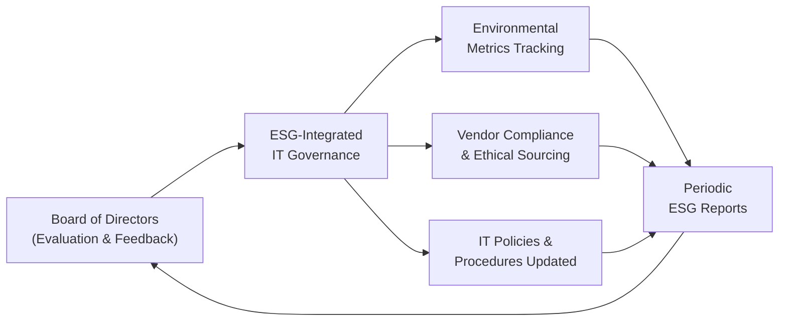

## 30.3 Integration of ESG Factors into IT Governance

Information Technology (IT) systems are no longer viewed solely as organizational support tools. They are now critical enablers of sustainability, social equity, and ethical corporate governance. By incorporating Environmental, Social, and Governance (ESG) considerations into IT governance frameworks, organizations can reduce risks, create long-term value, and maintain stakeholder trust. This section provides practical guidance, illustrative examples, and key performance indicator (KPI) frameworks to facilitate the integration of ESG strategies within IT governance structures.

Effective ESG integration in IT governance requires alignment with broader organizational values and objectives as well as compliance with relevant regulatory mandates. For CPAs and IT auditors, understanding how ESG metrics shape technology decisions is vital when designing, implementing, and reporting on controls. This chapter examines the evolving standards around ESG, discusses typical technology-related ESG metrics, and offers insights into reporting and assurance.

  
Building on the concepts in Chapter 3 (Governance, Frameworks, and Regulatory Environment) and Chapter 8 (IT General Controls), this chapter highlights how ESG factors can be folded into existing internal control and governance frameworks such as COSO, COBIT, and other widely recognized approaches.

  
SUSTAINABLE IT: A RISING BOARD AGENDA  
------------------------------------

Corporate boards and executive management increasingly view technology through a sustainability lens. Data centers, hardware sourcing, energy consumption, and software development lifecycles all have ESG implications. In many organizations, sustainability officers, chief information officers (CIOs), and internal audit leads collaborate to ensure technology decisions align with:

• Environmental objectives: Minimizing carbon footprint, reducing electronic waste, and optimizing usage of green and renewable energy.  
• Social ideals: Promoting diversity, ensuring human rights compliance in supply chains, and safeguarding data privacy.  
• Governance standards: Transparency, accountability, and ethical conduct in all facets of IT systems oversight.

  
In turn, these objectives give rise to formal controls, policies, and operational procedures within the IT governance structure. Failure to adapt can result in reputational harm, legal liabilities, or customer dissatisfaction.

  
KEY ESG METRICS IN A TECHNOLOGY CONTEXT  
---------------------------------------

ESG metrics relevant to IT governance can vary based on organizational goals, industry regulations, and stakeholder demands. Below are some common metrics across the environmental, social, and governance dimensions:

• Environmental (E):  
  – GHG Emissions from Data Centers: Measurement of Scope 2 (and, increasingly, Scope 3) emissions from data center operations, including the energy mix used (renewable vs. non-renewable sources).  
  – E-Waste Management: Tracking responsible disposal or recycling of obsolete hardware, ensuring minimal landfill impact.  
  – Energy Efficiency: Monitoring Power Usage Effectiveness (PUE) in data centers or offices.  

• Social (S):  
  – Data Privacy and Security: Monitoring cybersecurity incidents, breach reports, and user notifications.  
  – Diversity, Equity, and Inclusion (DEI) in IT Teams: Measuring gender balance, minority representation, and fairness in hiring or promotions.  
  – Supply Chain Ethics: Ensuring technology components are not sourced from regions with forced labor practices or questionable labor standards.  

• Governance (G):  
  – Board Oversight of IT Risks: Frequency and depth of board discussions on cybersecurity, privacy, and ESG-related technology matters.  
  – Transparency in Reporting: Existence of formal reporting channels (e.g., annual ESG reports, integrated reports) that disclose IT governance-related ESG metrics.  
  – Policy Adherence: Internal compliance rates with corporate policies related to data protection, ethical AI, or open-source usage.  

These metrics drive accountability and form the basis of reporting to stakeholders. They also provide a roadmap for continuous improvement in technology environments.

  
ALIGNING ESG WITH IT GOVERNANCE FRAMEWORKS  
------------------------------------------

ESG integration often begins by aligning with recognized governing frameworks, many of which are already introduced in earlier chapters of this guide:

• COSO Internal Control – Integrated Framework: Offers guidance for building robust internal control systems that can incorporate ESG controls, including performance tracking, risk assessment, and reporting.  
• COBIT 2019: Defines governance objectives that can be expanded to address ESG focus areas. Aligning COBIT control processes with environmental, social, and governance goals helps ensure broader stakeholder needs are met.  
• ISO/IEC Standards: Certain ISO standards, such as ISO 14001 for environmental management or ISO/IEC 27001 for information security management, can be adapted to include sustainability and social considerations.

  
By bridging these frameworks with an ESG perspective, organizations can embed sustainability, ethics, and social responsibility into the core processes of technology management.

  
PRACTICAL STEPS TO IMPLEMENT ESG-ENABLED IT GOVERNANCE  
------------------------------------------------------

While each organization’s journey to ESG integration is unique, the following steps are common building blocks:

1. Establish a Dedicated Cross-Functional ESG Working Group  
   Assemble a committee that brings together IT, finance, operations, risk management, and sustainability leaders. This body ensures technology decisions are aligned with overall ESG goals.

2. Define Clear ESG Objectives and Metrics  
   Work with senior management to identify ESG objectives that are both material and measurable. For instance, a goal might be to reduce total data center emissions by 25% over three years, or to achieve zero e-waste to landfill within five years.

3. Integrate ESG Criteria into Vendor Selection  
   Encourage procurement policies that prioritize environmentally friendly or ethically mindful suppliers. Evaluate suppliers’ adherence to recognized frameworks such as the UN Global Compact or local human rights regulations.

4. Update IT Governance Charters and Policies  
   Incorporate ESG language and expectations into key documents like IT governance charters, data security policies, vendor management protocols, and risk management guidelines.

5. Implement Continuous Monitoring and Reporting  
   Develop real-time monitoring capabilities, especially for environmental metrics such as energy usage, water consumption, or carbon emissions. Regularly communicate progress to internal stakeholders, boards, and external reporting bodies.

6. Conduct Periodic Assurance and Audits  
   Utilize IT audits not only to assess data integrity and system reliability but also to evaluate environmental footprints and social impacts. External assurance (e.g., voluntary ESG assurance engagements) can lend credibility.

  
ILLUSTRATIVE ESG–IT GOVERNANCE FRAMEWORK DIAGRAM  
------------------------------------------------

Below is a simple Mermaid.js diagram illustrating how ESG goals coexist within the IT governance framework, ensuring that metrics, stakeholder interests, and reporting requirements remain in harmony:

Explanation:  
• The board of directors articulates the overarching ESG vision.  
• The ESG–integrated IT governance framework adapts relevant policies and procedures, ensuring alignment with ESG objectives.  
• Vendor compliance, environmental metrics tracking, and continuous reporting feed into a feedback loop that helps the board evaluate performance and refine strategies.

  
KPI REPORTING AND FRAMEWORKS  
-----------------------------

When it comes to disclosing ESG performance, organizations often rely on recognized reporting initiatives. These can guide both data collection and external communication:

• Global Reporting Initiative (GRI): GRI Standards include topics such as emissions, waste, water consumption, and labor practices. For the IT function, GRI can be customized to include data center impacts, electronic waste, and digital inclusion.  
• Sustainability Accounting Standards Board (SASB): SASB standards cater to quantitative and qualitative metrics relevant to technology and communications sectors, including data privacy indicators, cybersecurity preparedness, and inclusion metrics.  
• Task Force on Climate-Related Financial Disclosures (TCFD): Although primarily illustrating climate impacts, TCFD’s recommended disclosures increasingly include considerations for IT resilience and data center energy efficiency.  
• IFRS Sustainability Disclosure Standards (IFRS S1 and IFRS S2): Global efforts to unify sustainability reporting under IFRS standards will likely shape the next generation of ESG metrics, including technology governance components.

CPAs and IT auditors can add tangible value by designing robust systems for capturing the necessary data, testing its completeness and accuracy, and reporting these metrics transparently. Proper alignment with one or more recognized frameworks can significantly enhance an organization’s credibility and stakeholder confidence.

  
CASE STUDY EXAMPLE  
------------------

A multinational financial services firm aims to reduce its carbon emissions by 30% over five years. Since the majority of the firm’s emissions come from large-scale data centers, the CFO (also responsible for ESG oversight) collaborates with the CIO to migrate some workloads to a more energy-efficient cloud provider. The internal audit department, assisted by an external IT audit specialist, evaluates power consumption metrics before and after the migration. They confirm the following results:

1. A 10% immediate reduction in power usage from server consolidation in the first year.  
2. Improved e-waste management, as the firm retired and recycled older server equipment in line with environmental regulations.  
3. Enhanced data integrity controls in the new cloud environment, mitigating risk of data loss and bolstering social and governance compliance.  

The resulting ESG disclosures in the annual sustainability report highlight the firm’s progress toward its five-year emission target. Independent assurance received from an external auditor further solidifies the reliability of the reported data.

  
BEST PRACTICES AND COMMON PITFALLS  
----------------------------------

• Best Practices:  
  – Integrate ESG in All Levels of Decision-Making: From daily IT operations to strategic board decisions.  
  – Incorporate Future-Focused Metrics: Include predictive analytics that anticipate longer-term ESG challenges.  
  – Embrace Transparency: Publicly communicating successes, challenges, and shortfalls fosters credibility.

• Common Pitfalls:  
  – Overlooking Supplier Risks: Failing to conduct adequate due diligence on third-party vendors can open social or environmental vulnerabilities.  
  – Insufficient Stakeholder Engagement: Underestimating the interests and demands of investors, customers, or regulators can lead to reputational harm.  
  – Lack of Standardized Data Collection: Fragmented systems make it difficult to track and report ESG metrics accurately.

  
STRATEGIES FOR CONTINUOUS IMPROVEMENT  
-------------------------------------

1. Leverage Technology Tools: Implement integrated ESG data management platforms that automate data collection from embedded sensors, operational systems, and third-party APIs.  
2. Develop Internal Capacity: Train IT staff on the relevance of ESG metrics and how to incorporate those metrics into everyday operations.  
3. Validate with Third-Party Benchmarks: Compare your KPI performance with industry standards or competitor disclosures.  
4. Use Data Visualizations to Engage Stakeholders: Create intuitive dashboards to make ESG metrics more comprehensible and actionable for senior management and board members.  
5. Iterate Based on Feedback: Encourage a culture of continuous improvement by incorporating feedback loops from audits, stakeholder reviews, and regulatory bodies.

  
LOOKING AHEAD  
-------------

As digital transformation accelerates, ESG considerations will continue to expand beyond simple energy consumption metrics. Emerging fields like artificial intelligence (AI) ethics, quantum computing security, and broader data privacy concerns will become new frontiers for ESG-minded organizations. Chapter 28 (Emerging Technologies and Disruptive Innovations) further explores these advancements and how they intersect with sustainability and responsible governance.

When integrated thoughtfully, ESG factors do more than satisfy compliance checklists—they shape resilient, forward-thinking IT governance that not only safeguards value but also fosters a positive environmental and social impact. CPAs and IT auditors stand at the nexus of this transformation, ensuring that organizational controls are designed and operated with the future top of mind.

  
## ESG and IT Governance Knowledge Check

Below is a quick reference for additional resources and reading:

• Global Reporting Initiative (GRI): https://www.globalreporting.org  
• Sustainability Accounting Standards Board (SASB): https://www.sasb.org  
• International Sustainability Standards Board (ISSB) – IFRS S1 & S2: https://www.ifrs.org/groups/international-sustainability-standards-board/  
• ISACA White Papers on “Sustainability in IT Governance”: https://www.isaca.org/resources/white-papers/

These references offer deeper insights into ESG standards and best practices that can be integrated into IT governance structures.

  
## Test Your Knowledge: ESG Integration in IT Governance



### Which environmental factor is most commonly measured in IT governance for ESG reporting?  
- [ ] The organization's brand visibility across digital channels  
- [ ] The total volume of outgoing email traffic  
- [x] Greenhouse gas (GHG) emissions from data center operations  
- [ ] Employee turnover in the IT department  

> **Explanation:** GHG emissions associated with data center operations are a primary environmental focus area for IT governance in ESG reporting. Organizations typically measure and disclose these emissions to meet sustainability goals.

### What is a key benefit of aligning ESG metrics with recognized frameworks like GRI or SASB?  
- [x] Enhanced credibility and comparability of reported data  
- [ ] Reduced need for internal audits or external assurance  
- [ ] Complete elimination of technology-related risks  
- [ ] Guaranteed exemption from data privacy regulations  

> **Explanation:** By aligning ESG metrics with frameworks like GRI or SASB, organizations can report sustainability data in a manner that’s both credible and comparable across sectors, which is critical for stakeholders evaluating performance.

### Which of the following is an example of a social metric in technology contexts for ESG integration?  
- [x] Monitoring data privacy and rates of cybersecurity incidents  
- [ ] Tracking the speed of network bandwidth in offices  
- [ ] Measuring the frequency of system outages  
- [ ] Evaluating the cost of new IT infrastructure  

> **Explanation:** Social metrics focus on impacts on people and society. Data privacy breaches and cybersecurity incidents fall under this category and are vital for ESG reporting.

### When evaluating vendor compliance in ESG-enabled IT governance, which approach is considered best practice?  
- [x] Conducting thorough due diligence and ensuring alignment with relevant human rights and environmental standards  
- [ ] Accepting vendor certifications without further verification  
- [ ] Focusing exclusively on financial instruments and ROI  
- [ ] Prioritizing cost-savings over environmental or social concerns  

> **Explanation:** Thorough due diligence on vendors is essential to verify they meet environmental and social standards, protecting the organization from reputation damage and compliance issues.

### Which of the following tactics can help organizations continuously improve their ESG metrics in IT governance?  
- [x] Training IT professionals on sustainability and responsible data management  
- [ ] Hiding performance metrics from the board of directors  
- [x] Leveraging data visualizations for better decision-making  
- [ ] Deferring ESG initiatives to the next fiscal year  

> **Explanation:** Ongoing training ensures the IT workforce understands the importance of ESG, while data visualizations enable clear, actionable insights for strategic decisions. Both contribute to continuous improvement.

### Which principle from COSO’s Integrated Framework can be directly applied to integrating ESG in IT governance?  
- [x] Risk Assessment for identifying ESG-related technology risks  
- [ ] Lack of relevant objectives  
- [ ] Complete elimination of internal controls  
- [ ] IT governance irrelevance to ESG  

> **Explanation:** COSO’s focus on risk assessment enables organizations to identify potential ESG impacts and incorporate them into the existing control environment, ensuring thorough coverage of ESG issues.

### What is one typical pitfall when implementing ESG-focused IT governance?  
- [x] Failure to engage with stakeholders, leading to misaligned ESG goals  
- [ ] Overreporting metrics and focusing too strongly on e-waste  
- [x] Spending too much time on board-level oversight  
- [ ] Understating hardware disposal practices entirely  

> **Explanation:** A common pitfall is insufficient stakeholder engagement, which can prevent an organization from developing and executing ESG goals that align with investor, customer, and societal expectations.

### Which ESG dimension includes the principle of ethical AI use and inclusive system development?  
- [x] Social (S)  
- [ ] Environmental (E)  
- [ ] Regulatory (R)  
- [ ] Executive (E)  

> **Explanation:** Ethical AI design and system development relate to the social dimension of ESG, focusing on fairness, transparency, and inclusivity.

### Which reporting framework specifically recommends disclosures related to climate-related risks and opportunities?  
- [x] Task Force on Climate-Related Financial Disclosures (TCFD)  
- [ ] Sarbanes-Oxley Act (SOX)  
- [ ] COBIT 2019  
- [ ] HIPAA  

> **Explanation:** TCFD focuses on how organizations manage, mitigate, and disclose climate-related financial risks and opportunities. While SOX, COBIT, and HIPAA have specific frameworks and regulations, they do not center on climate-related disclosures.

### The primary purpose of integrating ESG considerations into IT governance is to:  
- [x] Ensure responsible technology operations that align with long-term stakeholder interests  
- [ ] Achieve immediate cost reductions with minimal reporting  
- [ ] Avoid all forms of mandatory regulatory compliance  
- [ ] Eliminate the need for any third-party oversight or audits  

> **Explanation:** ESG considerations guide IT operations to be environmentally sustainable, socially responsible, and ethically governed, thus preserving long-term value for both the organization and stakeholders.



## For Additional Practice and Deeper Preparation

### [Information Systems and Controls (ISC)](https://www.udemy.com/course/isc-cpa-mock-exams/?referralCode=E1217303222935C5E464)

Information Systems and Controls (ISC) CPA Mocks: 6 Full (1,500 Qs), Harder Than Real! In-Depth & Clear. Crush With Confidence!

• Tackle full-length mock exams designed to mirror real ISC questions.  
• Refine your exam-day strategies with detailed, step-by-step solutions for every scenario.  
• Explore in-depth rationales that reinforce higher-level concepts, giving you an edge on test day.  
• Boost confidence and minimize anxiety by mastering every corner of the ISC blueprint.  
• Perfect for those seeking exceptionally hard mocks and real-world readiness.  

_Disclaimer: This course is not endorsed by or affiliated with the AICPA, NASBA, or any official CPA Examination authority. All content is for educational and preparatory purposes only._
