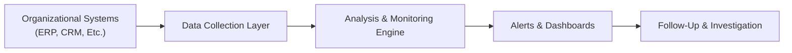

## 31.1 Continuous Assurance, Real‑Time Data, and Blockchain‑Enabled Solutions

The auditing landscape is rapidly changing, driven by advancements in software, cloud infrastructures, data analytics, and emerging technologies such as blockchain. Continuous assurance and real-time data have moved from conceptual buzzwords to tangible, strategic initiatives embraced by organizations seeking deeper insights, faster issue identification, and more robust internal controls. In parallel, blockchain technology has the potential to revolutionize how transactions are recorded, verified, and audited. This section explores the fundamental concepts behind continuous assurance, the significance of real-time data streams, and how blockchain can transform operational and financial audits alike.

Continuous assurance allows auditors to shift from periodic evaluations toward ongoing monitoring and proactive identification of anomalies. Meanwhile, real-time data streams enable organizations to respond to risks as they emerge, rather than after the fact. By leveraging blockchain’s decentralized and immutable ledger, companies and auditors can reinforce trust in data integrity while streamlining operational processes.

This topic is especially relevant in today’s digital environment, where organizations increasingly run critical processes on cloud platforms and integrate with third-party services (see Chapter 29: In-Depth Cloud Computing Governance and Chapter 7: Business Processes in Information Systems for foundational insights). Together, these approaches hold the promise of enhanced transparency, efficiency, and reliability in financial and operational transactions.

---

### The Evolution of Continuous Assurance

Continuous assurance refers to an auditing methodology and control mechanism in which automated tools and processes are employed to collect and analyze data on an ongoing basis. Instead of depending solely on monthly, quarterly, or annual snapshots, auditors can gain near real-time visibility into transactions, processes, and control environments. While the concept has existed in academia and consulting thought leadership for years, it has become increasingly practical thanks to modern data analytics platforms, robust APIs, and sophisticated workflows integrated into enterprise systems.

Key drivers behind continuous assurance include:

• The increased volume and velocity of business transactions in global markets.  
• The growing complexity of regulatory requirements (e.g., anti-money laundering or transaction-level compliance).  
• Stakeholder demand for more timely and transparent reporting.  
• Advancements in cloud-based services, automation tools, and artificial intelligence.  

Continuous assurance also draws upon prior achievements in IT General Controls (ITGC) frameworks (see Chapter 8: IT General Controls – Standard Domains), combining them with robust data monitoring to ensure a proactive stance on fraud detection, compliance, and system integrity.

#### Benefits of Continuous Assurance

• Early Risk Detection: Continuous tracking of transaction data helps audit teams identify anomalies and red flags before they escalate or remain undiscovered until the next traditional audit cycle.  
• Reduced Audit Fatigue: Automated tests reduce the manual burden on auditors, freeing them to focus on higher-level risk assessments and judgment-based activities.  
• Enhanced Confidence in Controls: By continuously verifying critical controls, organizations can demonstrate to stakeholders—regulators, clients, and investors—the reliability of their processes.  
• Real-Time Feedback Loops: Continuous assurance enables near instant performance metrics, from sales pipeline analysis to supply chain optimization.  

#### Challenges to Implementation

• Data Overload: Continuous monitoring can create large data sets, which require robust data governance, efficient data storage, and advanced analytics.  
• Integration Complexities: Linking multiple systems and data sources can involve substantial technical complexity and require cross-departmental coordination.  
• Skills Gap: Continuous assurance requires multidisciplinary teams that combine accounting expertise with data science, IT, and process improvement capabilities.  
• Change Management: Shifting from periodic to continuous methods often requires redefining roles, responsibilities, and the broader organizational culture surrounding audits and risk management.  

---

### The Significance of Real-Time Data

Real-time data refers to information that becomes available for analysis and decision-making as soon as it reaches the system. For instance, point-of-sale transactions, sensor data from IoT devices, and online banking transactions can all be streamed in real-time, updating relevant dashboards, risk models, and control checks almost instantaneously.

In a continuous assurance environment, real-time data capabilities enable organizations to:

• Compare transactions against established criteria or baselines the moment they occur.  
• Trigger automated alerts and notifications whenever out-of-pattern behavior is detected.  
• Update internal management reports and external disclosures quickly, improving transparency and facilitating dynamic resource allocation.  

Real-time data supports compliance obligations—such as AML (Anti-Money Laundering) reviews or monitoring volatility in currency exchange transactions—by reducing the latency between data generation and detection of regulatory breaches. This aligns well with advanced analytics and machine-learning methods (see Chapter 14: Data Integration and Analytics) by providing continuous training data sets that keep predictive models current.

#### Example: Automated Accounts Payable Monitoring

Consider an organization with a large, international supply chain. Payments to suppliers flow through an enterprise resource planning (ERP) system (refer to Chapter 6: Enterprise Resource Planning (ERP) and Accounting Information Systems). By establishing real-time payment monitoring:

1. The ERP transmits each approved invoice to an analytics engine.  
2. The analytics engine checks for anomalies—for example, comparing the invoice total to typical payment ranges or verifying the vendor’s bank information matches known data.  
3. Any flagged anomaly is escalated immediately to the internal audit team or the accounts payable department for further investigation.  

This real-time detection can effectively prevent duplicate payments, vendor fraud, or erroneous transactions that would otherwise be discovered only during periodic audits.

---

### Core Components and Architecture of Continuous Assurance

To effectively implement continuous assurance, organizations often rely on an integrated architecture of tools and processes. Below is a simplified flowchart illustrating how data, processes, and alerts might interact.

• [A]: Organizational Systems. Data is generated from enterprise systems such as ERP, CRM, or HRM (Human Resource Management).  
• [B]: Data Collection Layer. An automated environment collects transactional data, possibly using APIs, event queues, or messaging protocols like Kafka.  
• [C]: Analysis & Monitoring Engine. Automated scripts, rules-based analysis, and even machine-learning models interpret data, comparing it with control thresholds and risk tolerances.  
• [D]: Alerts & Dashboards. Any deviations or anomalies trigger alerts, which are displayed in real-time dashboards or notifications to authorized personnel.  
• [E]: Follow-Up & Investigation. Relevant teams analyze the flagged anomalies, investigate root causes, and document their findings, potentially revising analytics rules or processes as needed.

---

### Blockchain as a Catalyst for Transformative Audits

Blockchain—often referred to as distributed ledger technology—offers a shared, tamper-evident record of transactions. From a CPA and IT audit perspective, the immutability, transparency, and decentralization of blockchain can significantly enhance trust and reduce operational inefficiencies. Key attributes of blockchain that benefit audits include:

• Immutability: Once a transaction is added to a blockchain, it cannot be amended or deleted. This feature aligns with standard audit trails, reducing the risk of data manipulation.  
• Distributed Consensus: Multiple nodes maintain the ledger, reinforcing the integrity of recorded transactions and mitigating reliance on a single point of failure.  
• Real-Time Verification: Transactions can be validated and made visible to authorized participants as they occur, enhancing the timeliness of assurance.  
• Smart Contracts: Autonomous programs deployed on blockchain networks that execute transactions based on predefined conditions. This feature can automate internal controls, compliance checks, and payment triggers, subject to appropriate design and oversight.  

Despite its transformative potential, blockchain should be viewed not as a cure-all but as an advanced tool in the auditor’s toolkit. The technology introduces new complexities, such as key management, regulatory acceptance, and the need to design fail-safes when integrating with traditional databases (see Chapter 6.4: Blockchain Integration and Considerations for Financial Reporting for background on standard considerations).

#### Case Study: Inventory Tracking on a Blockchain Network

A large manufacturer uses IoT sensors to monitor perishable goods. Each sensor reading (e.g., temperature, humidity) feeds into a permissioned blockchain network shared by the manufacturer, its logistics partners, and retail distributors:

• The blockchain records each shipment’s progress in real time, logging sensor data as transactions that become part of the immutable chain.  
• Smart contracts automatically alert relevant parties if specific thresholds (e.g., temperature > 5°C) are breached, triggering insurance coverage, claims notifications, or real-time reevaluation of shipping routes.  
• Auditors can validate how goods have been handled throughout the supply chain and assess whether internal controls—such as transaction approval or safe handling procedures—were consistently followed.  

In this scenario, blockchain permits a deeper, more continuous view of the entire supply chain, providing near-instant insights into potential spoilage risks and earlier detection of fraudulent activity or noncompliance.

---

### Integrating Continuous Assurance and Blockchain

When combined, continuous assurance measures and blockchain technology can result in powerful synergy:

• **Enhanced Data Integrity**: By deriving transaction data directly from a blockchain, the possibility of manipulation is further minimized, and continuous assurance processes can hone in on verifying the economic substance rather than the existence or completeness of transactions.  
• **Automated Control Enforcement**: Smart contracts make certain control criteria self-executing. For instance, a contract might enforce segregation-of-duties rules at the code level, ensuring that no single party can approve a transfer without a secondary authorization.  
• **Real-Time Stakeholder Visibility**: By extending permissioned access to relevant stakeholders (e.g., external auditors or supply chain partners), real-time data monitoring occurs across the entire ecosystem rather than within a single organization.  

#### Practical Example: Continuous Audit in a Blockchain-Powered Payment System

1. Transaction Initiation: A cross-border payment is initiated in a blockchain-based platform rather than a traditional bank wire system.  
2. Validation & Consensus: The ledger nodes validate the payer’s balance and the payment’s legitimacy according to the network’s consensus protocol.  
3. Real-Time Logging & Alerts: The continuous assurance engine receives an event notification immediately following the consensus confirmation.  
4. Automated Rule Checks: The engine evaluates currency conversion rates, the payee’s details, and any flagged compliance concerns (e.g., sanction lists).  
5. Final Recording: If all checks pass, the transaction is permanently posted to the blockchain ledger. Audit dashboards and real-time monitoring tools can display a verified, immutable record of the payment.  

This process assures timely, unalterable data for audit, drastically decreasing the lag between transaction completion and validation.

---

### Designing Effective Continuous Assurance Programs

Designing a continuous assurance program that integrates real-time data and blockchain solutions requires deliberate planning and consistent stakeholder engagement.

• **Assess Organizational Readiness**: Gauge the maturity of the existing audit culture. Does the organization support automated checks, advanced analytics, and agile transformation in finance and accounting?  
• **Select Pilot Areas**: Instead of implementing continuous assurance across the entire operation at once, identify high-risk or high-volume processes (e.g., revenue cycle, procurement) that can yield quick wins and tangible value.  
• **Leverage IT General Controls**: Build upon strong IT controls (see Chapter 8), ensuring consistent data security, access management, and change management protocols.  
• **Governance Model**: Put in place robust governance to oversee continuous assurance processes, define roles and responsibilities, handle exceptions, and revise rules as necessary.  
• **Scalability and Interoperability**: Ensure the chosen architecture can handle transaction peaks and can integrate with new data sources (including potential blockchain networks).  

---

### Overcoming Common Pitfalls

1. **Over-Reliance on Technology**: While continuous assurance automates many tasks, it still requires professional judgment and domain expertise from auditors and management.  
2. **Data Quality Issues**: Automated systems are only as accurate as the data they process. Invest in data cleansing, standardization, and well-defined data governance processes (see Chapter 11: Data Life Cycle and Governance).  
3. **Insufficient Training**: Auditors must understand not just the controls, but also the technology behind continuous monitoring and blockchain systems to interpret outputs effectively.  
4. **Implementation Costs**: Real-time systems and specialized blockchain solutions can be costly. A robust ROI analysis and a phased rollout may be needed to generate organizational buy-in.  
5. **Regulatory Acceptance**: Certain regulators or industries may be conservative about new technologies or data processes. Work closely with legal and compliance teams to ensure alignment.

---

### Real-World Example: Continuous Assurance in an E-Commerce Company

An e-commerce retailer processes thousands of daily transactions across multiple platforms—web, mobile apps, and third-party marketplaces. Management embraced continuous assurance to enhance fraud detection and reduce chargebacks.

• **Data Streaming**: Transaction data streams in real-time to an analytics platform equipped with machine-learning models.  
• **Instant Alerts**: Suspicious patterns are identified within seconds (e.g., sudden spikes in high-value purchases from a single IP address), and alerts are routed to the internal audit or fraud team.  
• **Blockchain Pilot**: For high-value items and cross-border shipments, the company logs shipping milestones on a permissioned blockchain. Auditors can track merchandise from order placement through final delivery, verifying that the chain of custody remains intact.  
• **Outcome**: The continuous assurance program reduces fraudulent orders by 20% in its first quarter, while the blockchain pilot demonstrates significant improvement in cross-border shipment traceability, cutting time spent reconciling shipments by over 50%.

---

### Heightened Focus on Operational Audits

Continuous assurance and blockchain solutions are not limited to financial statement elements. They can also transform operational audits—ranging from supply chain management to manufacturing processes. By providing transparent, immutable, and real-time data, these technologies allow CPAs to look beyond traditional bookkeeping and financial transactions.

Examples include:

• **Warehouse Performance**: Sensors and blockchain logs track inventory movements, employee activity, order fulfillment speed, and temperature control.  
• **Service-Level Agreements (SLAs)**: Automated alerts trigger when vendors deviate from agreed-upon performance metrics (e.g., response time, shipping accuracy), ensuring accountability and quick resolution.  
• **Environmental, Social, and Governance (ESG)**: Real-time data streams record greenhouse gas emissions or resource usage, enabling more accurate and frequent ESG reporting (refer to Chapter 30: Data Ethics, Corporate Social Responsibility, and ESG Considerations for deeper discussion).  

---

### Building an Agile Control Environment

Agile methodologies, popular in software development, can also apply to continuous assurance. Agile auditing advocates smaller, more frequent iterations of audit activities, incorporating feedback loops for constant improvement. Combining agile thinking with real-time data analysis and blockchain-based records can yield a dynamic control environment that evolves with new risks and markets.

Key aspects of an agile approach to continuous assurance:

• **Frequent Feedback Cycles**: Establish daily or weekly sprints to update monitoring rules, incorporate new data fields, or address recently discovered risks.  
• **Cross-Functional Collaboration**: Engage finance, IT, data analytics, and compliance as cohesive squads to break down silos and quickly address anomalies.  
• **Scalable Automation**: Use DevOps principles (see Chapter 10: IT Change Management) to push configuration changes, update analytics models, and manage system patches in near real-time.  

---

### Conclusion and Forward View

Continuous assurance, empowered by real-time data streams and blockchain innovations, represents the future frontier of IT audit and advisory. As data volumes expand and organizations seek more transparent, efficient, and foolproof operational processes, CPAs can leverage these methodologies to deliver deeper value. From continuous fraud detection to automating trust via smart contracts, the possibilities are vast.

To succeed, auditors need to adopt a multifaceted approach—investing in the right technology stack, ensuring robust governance, and continually developing new skill sets. By embracing these evolutions, CPAs position themselves not just as consumers of financial data but as trusted advisors in crafting improved risk management, control, and business strategies.

---

## Test Your Mastery of Continuous Assurance and Blockchain



### Continuous assurance focuses on:
- [x] Ongoing, automated controls monitoring for near real-time risk detection
- [ ] Replacing auditors entirely with AI-driven systems
- [ ] Limiting audits to an annual basis
- [ ] Eliminating human judgment from all audit procedures

> **Explanation:** Continuous assurance uses technology to continuously monitor transactions and controls, complementing but not replacing traditional auditing tasks or human judgment.

### Which of the following best describes real-time data in an assurance context?
- [x] Data that is collected, processed, and analyzed immediately as transactions occur
- [ ] Data taken from year-end accounting records only
- [ ] Data that is updated once every quarter
- [ ] Data with intentional delays for regulatory compliance

> **Explanation:** Real-time data is processed instantly, providing immediate insights into transactional activity and potential risks.

### A primary benefit of integrating blockchain into the audit process is:
- [x] Immutability and decentralized verification of transactions
- [ ] Reduced exposure to all cyber threats
- [ ] Automating all financial reports without review
- [ ] Replacing the need for robust IT general controls

> **Explanation:** Blockchain’s immutable ledger and decentralized consensus improve data integrity, though it is not a panacea for every type of cyber threat and still requires strong IT general controls.

### In a continuous assurance framework, alerts are typically generated when:
- [x] A transaction or event deviates from established thresholds or patterns
- [ ] An auditor completes their annual audit procedures
- [ ] Stakeholders decide it’s time for a manual spot check
- [ ] The CFO manually runs a monthly internal report

> **Explanation:** Continuous assurance automates the detection of anomalies and unusual transactions, triggering alerts whenever data breaches predefined rules.

### Which component of the continuous assurance architecture typically applies machine-learning models and rule-based analytics?
- [x] Analysis & Monitoring Engine
- [ ] Data Collection Layer
- [ ] Alerts & Dashboards
- [ ] Organizational Systems

> **Explanation:** The Analysis & Monitoring Engine is responsible for interpreting the data, applying algorithms, and identifying anomalies before posting them to alerts or dashboards.

### What is a recommended approach when first introducing continuous assurance to an organization?
- [x] Implement a pilot project in a high-risk or high-volume area
- [ ] Immediately deploy it organization-wide without planning
- [ ] Focus predominantly on manual intervention
- [ ] Avoid integrating with any existing systems

> **Explanation:** Starting with a high-risk or high-volume area that can provide clear returns and actionable insights is an effective entry point for a pilot program.

### Smart contracts on a blockchain can:
- [x] Automate specific control checks and approvals based on predefined rules
- [ ] Override existing regulatory requirements
- [x] Execute transactions when agreed-upon conditions are met
- [ ] Allow for unlimited changes to past transactions

> **Explanation:** Smart contracts are self-executing pieces of code on the blockchain that may enforce controls (e.g., segregation of duties) and automatically trigger transactions. They do not override regulatory requirements or allow tampering with past transactions.

### Which of these is a common pitfall in implementing both continuous assurance and blockchain solutions?
- [x] Over-reliance on technology without proper human oversight
- [ ] Excess staffing of auditors and IT specialists
- [ ] Perfect data quality from day one
- [ ] Guaranteed regulatory acceptance in all jurisdictions

> **Explanation:** While technology can automate numerous tasks, human expertise and oversight are still needed to interpret data, manage exceptions, and validate processes.

### A realistic benefit from blockchain implementation in supply chain audits is:
- [x] Improved transparency in tracking goods and verifying custody
- [ ] Complete elimination of shipping and handling costs
- [ ] Inability to track compliance with temperature-controlled requirements
- [ ] Reduced need for tracking goods in transit

> **Explanation:** Blockchain can provide a secure, transparent record of shipment history and conditions, enabling deeper and continuous oversight.

### True or False: Continuous assurance must always rely solely on blockchain to function effectively.
- [x] True
- [ ] False

> **Explanation:** This is actually a trick question. The correct statement is False. Continuous assurance can function without blockchain. Blockchain is one of several technologies that can enhance continuous assurance, but not a mandatory requirement.



---

## For Additional Practice and Deeper Preparation

### [Information Systems and Controls (ISC)](https://www.udemy.com/course/isc-cpa-mock-exams/?referralCode=E1217303222935C5E464)  

**Information Systems and Controls (ISC) CPA Mocks:** 6 Full (1,500 Qs), Harder Than Real! In-Depth & Clear. Crush With Confidence!

- Tackle full-length mock exams designed to mirror real ISC questions.  
- Refine your exam-day strategies with detailed, step-by-step solutions for every scenario.  
- Explore in-depth rationales that reinforce higher-level concepts, giving you an edge on test day.  
- Boost confidence and minimize anxiety by mastering every corner of the ISC blueprint.  
- Perfect for those seeking exceptionally hard mocks and real-world readiness.

_Disclaimer: This course is not endorsed by or affiliated with the AICPA, NASBA, or any official CPA Examination authority. All content is for educational and preparatory purposes only._
