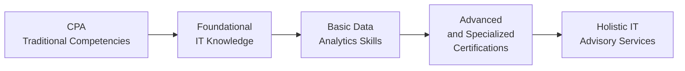

## 31.2 New Skill Sets for CPAs in Technology and Data Analytics

As the accounting profession becomes increasingly reliant on sophisticated digital tools, data platforms, and automated processes, CPAs must develop new capabilities to keep pace with evolving market needs. A modern CPA’s toolkit extends beyond traditional financial analysis, tax strategy, and auditing competencies. Indeed, to remain highly competitive and relevant in the market, CPAs who augment their expertise with technology and data-analytics skills open the door to a broader range of advisory services and career opportunities.

This section explores the core technology and data-analytics competencies essential for CPAs in the 21st century. We examine recommended certifications, specialized training, programming skills, data visualization capabilities, and recommended platforms and skill-building approaches. You will find references to relevant chapters in this guide—especially Chapter 14: Data Integration and Analytics, Chapter 28: Emerging Technologies and Disruptive Innovations, and Chapter 12: Database Structures and Administration—to help you weave these competencies into your broader understanding of Information Systems and Controls (ISC).

  
### The Expanding Role of Tech-Savvy CPAs

Traditionally, CPAs have been the stewards of financial integrity and compliance. With rapid developments in business intelligence (BI), automation, artificial intelligence (AI), and real-time data processing, CPAs now find themselves in a central role evaluating large data sets, building predictive models for client financials, and designing robust internal controls for sophisticated IT environments.

Tech-savvy CPAs can deliver value by:
• Assessing IT control adequacy during audits, especially regarding privacy and cybersecurity.  
• Implementing advanced data-analytics solutions to detect anomalies in transaction cycles, identify fraud, and generate real-time reports.  
• Advising on analytics strategies that align business goals with emerging AI and machine-learning techniques.  
• Supporting data-driven decision-making, using tools such as dashboards and performance metrics.  

As a result, the value proposition of CPAs increasingly extends into advisory roles that combine an understanding of financial data with the power of modern analytics platforms.  

  
### Key Competencies in Data Analytics

1. Data Literacy and Statistical Foundations  
   CPAs who can interpret and manipulate data sets confidently are at a distinct advantage. Basic data literacy includes (a) understanding data types (structured vs. unstructured), (b) the fundamentals of descriptive and inferential statistics, (c) how sampling methods can affect audit outcomes, and (d) how data modeling underpins financial forecasts.

2. Data-Wrangling Techniques  
   In many organizations, data is scattered across various sources (e.g., mainframe legacy systems, cloud environments, and third-party APIs). The ability to extract, transform, and load (ETL) data efficiently is critical—see Chapter 13 on Data Warehousing and Big Data Environments for detailed insights. CPAs should be familiar with popular ETL tools and be able to validate data quality and integrity.

3. Visualization and Reporting  
   Whether using Excel add-ins, Power BI, Tableau, Qlik, or other business-intelligence platforms, CPAs with advanced visualization skills can quickly transform raw data into dashboards and actionable insights. Visualization skills bridge the gap between technical systems data and strategic leadership decisions.

4. Predictive Analytics and Basic Data Science  
   Growing numbers of audit and advisory firms leverage statistical models, machine learning, and AI to anticipate client business fluctuations, detect high-risk transactions, and pinpoint operational inefficiencies. CPAs who grasp machine-learning concepts and can collaborate with data scientists provide deeper insights into financial forecasts and risk modeling.

5. Continuous Auditing and Monitoring  
   Real-time data flows facilitate continuous auditing approaches where exceptions and anomalies are flagged as they occur. This ability requires an understanding of advanced automation techniques and how to configure monitoring systems to track relevant KPIs on an ongoing basis.

  
### Programming and Scripting for CPAs

Although CPAs are not generally required to be software engineers, familiarity with select programming languages can powerfully enhance the audit, analysis, and advisory work they do:

• Python: A top choice for data analytics and scripting. With libraries like pandas, NumPy, and matplotlib, Python is used for data cleaning, transformation, and predictive modeling.  
• R: Another statistical programming language widely used in academic and industry analytics settings, especially for building and testing statistical models.  
• SQL (Structured Query Language): Crucial for working with relational databases. Mastering SQL triggers, joins, and stored procedures helps CPAs query massive financial data sets efficiently.  
• VBA (Visual Basic for Applications): Although older, VBA can still be relevant in automating tasks in the Microsoft Office ecosystem for quick validations and macros that expedite repetitive tasks.  
• Data Pipeline Tools: Tools like AWS Glue, Azure Data Factory, or open-source solutions like Apache Airflow can automate data-wrangling operations and integrate seamlessly with analytics dashboards.  

Even a moderate level of proficiency in these areas can help CPAs validate complex data-analytics processes, communicate requirements to IT teams, and engage in more efficient design of financial and operational reporting systems.

  
### Recommended Certifications and Specialized Training

In addition to the foundational CPA credential, the following certifications and training programs can deepen a CPA’s technology- and analytics-related expertise:

• Certified Information Technology Professional (CITP): Offered by the AICPA, CITP focuses on information management, systems controls, and technology assurance, blending IT knowledge with standard CPA competencies.  
• Certified Information Systems Auditor (CISA): Managed by ISACA, CISA is recognized globally. It focuses on systems auditing, governance, and security principles—ideal for CPAs with an interest in IT risk and controls.  
• Certified Data Management Professional (CDMP): Validates expertise in data governance, architecture, and quality management. Useful for CPAs who want to ensure high data integrity in large-scale analytics projects.  
• Certified Analytics Professional (CAP): Endorsed by INFORMS, this certification verifies proficiency in the end-to-end analytics process, from business problem framing to data modeling and deployment.  
• Advanced Excel and Power BI: Microsoft offers specialized roles and certifications, such as “Microsoft Certified: Power BI Data Analyst Associate,” which teaches individuals to create data models, visuals, and reports.  

Many online platforms (e.g., Coursera, edX, LinkedIn Learning, and specialized vendors) also offer certifications in data analytics, AI, and programming fundamentals. Targeted short courses can be very effective for busy CPAs looking to expand their repertoire in manageable increments.

  
### Charting the Path to Tech and Analytics Mastery

Below is a simple Mermaid diagram illustrating how CPAs can progressively build their technology and data-analytics skills:

• CPA Traditional Competencies: The base skill set includes financial accounting, auditing, tax, and regulatory compliance.  
• Foundational IT Knowledge: Understanding key IT concepts such as hardware, software, and networks (refer to Part II and Part V of this guide).  
• Basic Data Analytics Skills: Proficiency in data manipulation and visualization using widely recognized tools.  
• Advanced and Specialized Certifications: Targeted learning (e.g., CITP, CISA, CAP) to gain in-depth knowledge of data science, IT audit, and risk management.  
• Holistic IT Advisory Services: Fully integrate technology, data analytics, and cybersecurity solutions into client engagements.

  
### Integrating AI and Machine Learning into Audit Strategies

Many firms are actively implementing AI-driven solutions. These solutions can automate certain tasks previously performed manually, such as:

• Predictive anomaly detection: Identifying unusual journal entries by learning patterns from historical data, reducing the risk of fraud or material misstatement.  
• Contract review: Using natural-language processing (NLP) to locate key clauses, terms, and potential compliance risks in large sets of documents.  
• Risk scoring and continuous auditing: Scoring each transaction in real-time using machine-learning models that incorporate both financial and operational data.  

CPAs who can interpret these models and provide assurance on their design and operation will be in increasingly high demand. Refer to Chapter 28 (Emerging Technologies and Disruptive Innovations) for a broader view of AI’s role across organizations.

  
### Case Study: Implementing a Data Analytics Strategy in a Mid-Sized Organization

Consider a mid-sized manufacturing company with a manual, spreadsheet-based financial reporting process. Recent difficulties in reconciling data from ERP systems, plus unusual shipping-cost anomalies, led management to conclude that a more data-driven approach was necessary.

1. Assessment Phase  
   A CPA-led team first assessed the existing IT infrastructure. They worked closely with the IT department to understand data flow in the ERP system (see Chapter 6: ERP and Accounting Information Systems). They identified data silos in purchasing, sales, and shipping areas.

2. Tool Selection and Pilot  
   The team proposed introducing a data-analytics tool (Power BI) that could interface directly with the ERP’s database. They also trained staff on basic data-cleaning principles. Using an automated data pipeline, the team successfully pulled daily updates to generate near real-time dashboards.

3. Advanced Modeling  
   With a stable data pipeline in place, the team introduced predictive elements: a regression-based model that highlighted anomalies in shipping costs. By comparing historical shipping costs against current-day metrics, suspicious spikes or dips were flagged for immediate investigation.

4. Governance and Controls  
   The CPA-led group worked to align the newly created analytics process with the organization’s controls environment (Chapters 7 and 8). They established protocols to ensure data integrity, including role-based user access (see Chapter 18 on authentication and access management) and routine system checks. The manufacturing company reduced its quarterly financial-close process by 30% and gained the ability to detect cost anomalies faster.

The result was a transformation in how management and the finance department engaged with organizational data. By combining advanced analytics tools, rigorous data governance, and audit-centric controls, the company’s leadership had more timely insights that benefited both financial and operational decision-making.

  
### Common Pitfalls in Building Technology and Data-Analytics Skills

• Underestimating the Learning Curve: Tools like Python and R can appear straightforward initially, but building robust models that deliver meaningful insights requires structured repetition and deeper statistical knowledge.  
• Inadequate Data Governance: Without policies and procedures ensuring data quality, analytics outputs suffer from inaccuracies, skewed conclusions, or compliance issues (see Chapter 11 on Data Governance).  
• Over-Reliance on Tools: Tools enable efficiency, but CPAs must still apply professional skepticism, interpret results critically, and ensure alignment with financial reporting objectives.  
• Security Oversights: As data volume grows, so do cybersecurity risks. CPAs must be vigilant in correlating analytics efforts with control frameworks like COSO and COBIT (Chapters 3 and 8) and ensuring compliance with privacy regulations.  
• Resistance to Change: Cultural barriers within an organization might hinder the adoption of new technologies. CPAs can mitigate resistance by demonstrating small, achievable wins and highlighting tangible ROI.

  
### Best Practices for CPAs Embarking on Tech and Analytics Journeys

• Start with a Target Area: Experiment with analytics in one high-impact functional domain—such as accounts payable, inventory controls, or revenue recognition—to showcase tangible benefits with minimal risk.  
• Adopt a Continuous Learning Mindset: The field evolves rapidly. Allocate time for self-study, attend webinars, explore case studies, and stay updated on industry developments.  
• Emphasize Data Storytelling: Insights are most valuable when stakeholders understand them. Develop narratives around data that map to the organization’s goals, weaving together visuals, analysis, and clear recommendations.  
• Collaborate with Cross-Functional Teams: Partnering with IT, data scientists, and project managers enriches your understanding of broader system complexities and fosters innovation.  
• Leverage Mentorship or Coaching: Seek guidance from professionals already fluent in analytics tools or programming. Mentored learning can accelerate your progress and provide real-world tips not always covered in textbooks.

  
### A Brief Note on Weighted Averages in Data Analytics

In many analytical contexts—like cost allocations, performance dashboards, or even scoring models—weighted averages are a crucial calculation. A simple KaTeX representation of how a weighted average might be expressed is:


\text{Weighted Average} = \sum_{i=1}^{n} \left( w_i \times x_i \right)


Where \\(w_i\\) represents the weighting factor for each data point \\(x_i\\). CPAs using analytics platforms should be comfortable constructing such formulas to combine multiple metrics according to the firm’s priorities or established cost-allocation guidelines.

  
### Conclusions and Next Steps

Technology and data analytics reshape traditional accounting and assurance work in ways that promise heightened efficiency, deeper insights, and expanded CPA career opportunities. By focusing on fundamental data literacy, learning at least one programming or scripting language, and pursuing relevant IT and analytics certifications, CPAs can thrive in a world that increasingly values digital fluency.

Whether you choose to specialize in advanced AI-driven audit techniques or become an expert in data governance, the future of the CPA profession offers endless possibilities for those prepared to seize them. Embrace continuous learning and apply your newfound competencies to real-world projects, ensuring you stay ahead of the curve.

  
## Evaluate Your Knowledge: Technology and Data Analytics for CPAs



### What is a principal advantage of CPAs learning basic programming skills (e.g., Python, R)?
- [ ] They can fully replace software engineers in large-scale projects.  
- [ ] They can avoid data-related security issues more effectively than IT personnel.  
- [x] They can automate repetitive tasks and perform in-depth analysis on large data sets.  
- [ ] They eliminate the need for standard IT controls and frameworks in audits.  

> **Explanation:** Even rudimentary knowledge of programming equips CPAs with the ability to automate basic processes, query large amounts of data, and streamline analyses—greatly enhancing audit and advisory efficiency.

### Which of the following certifications is specifically aligned with the AICPA for technology-focused CPAs?
- [ ] CISA  
- [ ] CAP  
- [x] CITP  
- [ ] PMP  

> **Explanation:** The Certified Information Technology Professional (CITP) credential is offered by the AICPA and centers on integrating technology knowledge with core CPA skills.

### According to the case study provided, what was one outcome of implementing near real-time dashboards in the mid-sized manufacturing company?
- [x] Reduction of the quarterly financial-close process by 30%  
- [ ] Elimination of the need for role-based access controls  
- [ ] Full replacement of all manual processes with AI  
- [ ] Significant underutilization of auditing staff due to automation  

> **Explanation:** By automating data extraction and enabling near real-time insights, the company streamlined its processes and reduced the time needed for financial close.

### In data analytics, which concept best describes the process of consolidating and transforming data from various sources before loading it into a target system?
- [ ] Database normalization  
- [ ] Data virtualization  
- [x] ETL (Extract, Transform, Load)  
- [ ] Materialized views  

> **Explanation:** ETL stands for Extract, Transform, Load—a foundational process used to prepare and integrate data from multiple sources into a unified repository or data warehouse.

### Which of the following is a common pitfall for CPAs developing advanced data-analytics skills?
- [x] Underestimating the learning curve for more complex analytics tools  
- [ ] Overproduction of intangible data dashboards  
- [x] Inadequate data governance and security considerations  
- [ ] Exclusive reliance on manual spreadsheets for daily reporting  

> **Explanation:** CPAs may fail to recognize how intensive certain tools or statistical methods can be. In addition, data governance must be a core part of the analytics strategy to avoid issues with data integrity and privacy.

### Why is the principle of “professional skepticism” still vital even when advanced analytics tools are used in audits?
- [x] Analytical outputs may be prone to errors, biases, or misuse if accepted without question.  
- [ ] It ensures CPAs only rely on manual processes.  
- [ ] It eliminates the need for internal controls.  
- [ ] It undermines the credibility of critical AI findings.  

> **Explanation:** CPAs must interpret and challenge analytics results to ensure outputs are accurate, relevant, and fairly stated. Tools can augment, but never replace, professional judgment.

### Which of the following skills or certifications is especially relevant for CPAs aiming to validate the design and operation of machine-learning models?
- [x] Familiarity with data science or machine learning tools  
- [ ] Exclusive focus on classical auditing standards  
- [x] Collaboration with specialized IT and data science teams  
- [ ] Official training in forensic photography  

> **Explanation:** CPAs must at least understand the fundamentals of machine-learning workflows and collaborate with data science experts. This mix of knowledge and teamwork underpins robust audit approaches for ML-driven systems.

### What is one of the key benefits of data visualization for decision-makers?
- [x] Enables rapid interpretation of data through easy-to-understand graphs and dashboards  
- [ ] Eliminates the need for underlying data quality checks  
- [ ] Ensures guaranteed compliance with all regulatory frameworks  
- [ ] Reduces operational costs through complete elimination of data duplication  

> **Explanation:** Data visualization accelerates and enriches the decision-making process by presenting complex data in user-friendly formats (e.g., dashboards, charts, or heatmaps).

### Which advanced certification focuses on the end-to-end analytics process and is endorsed by INFORMS?
- [ ] CITP  
- [ ] CDMP  
- [ ] CISA  
- [x] CAP  

> **Explanation:** The Certified Analytics Professional (CAP) acknowledges comprehensive analytics knowledge, from problem framing to model deployment.

### True or False: CPAs with strong data-analytics skills no longer need auditing fundamentals because technology handles all risk assessments.
- [x] True  
- [ ] False  

> **Explanation:** This is intentionally misleading; the correct answer is False. CPAs still need a robust understanding of auditing fundamentals. Technology and data analytics augment, rather than replace, traditional accounting and auditing principles.



## For Additional Practice and Deeper Preparation

### [Information Systems and Controls (ISC)](https://www.udemy.com/course/isc-cpa-mock-exams/?referralCode=E1217303222935C5E464)  

**Information Systems and Controls (ISC) CPA Mocks:** 6 Full (1,500 Qs), Harder Than Real! In-Depth & Clear. Crush With Confidence!

- Tackle full-length mock exams designed to mirror real ISC questions.  
- Refine your exam-day strategies with detailed, step-by-step solutions for every scenario.  
- Explore in-depth rationales that reinforce higher-level concepts, giving you an edge on test day.  
- Boost confidence and minimize anxiety by mastering every corner of the ISC blueprint.  
- Perfect for those seeking exceptionally hard mocks and real-world readiness.  

_Disclaimer: This course is not endorsed by or affiliated with the AICPA, NASBA, or any official CPA Examination authority. All content is for educational and preparatory purposes only._
