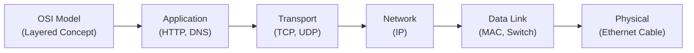

## 32.1 IT and Security Acronyms

Acronyms are the building blocks of everyday language in IT and security discussions. Understanding these abbreviations is crucial for any CPA or IT professional engaging in system audits, cybersecurity assessments, or organizational control evaluations. This section provides an alphabetical list of key acronyms, along with definitions and real-world examples where possible. While not exhaustive, these acronyms represent many of the foundational terms you will encounter throughout the field of Information Systems and Controls (ISC).

Below each acronym, you will find:  
• A concise definition.  
• Common uses in information systems and security contexts.  
• Occasional references to relevant chapters in this guide for further learning.  

Use this section as a quick reference or a deeper study tool to solidify your command of IT and security terminology.

---

### A

• ACID (Atomicity, Consistency, Isolation, Durability)  
  Definition: A set of properties ensuring reliable transaction processing within database systems.  
  Use Case: ACID properties guarantee that each transaction in an accounting information system is either fully completed or rolled back.

• ACL (Access Control List)  
  Definition: A list of permissions specifying which users or system processes can access an object, as well as the operations allowed.  
  Use Case: ACL configurations are critical in controlling who can view or edit financial data stored in enterprise applications.  
  Related Chapters: See Chapter 18 (Authentication and Access Management).

• AES (Advanced Encryption Standard)  
  Definition: A symmetric-key encryption standard used for securing sensitive data.  
  Use Case: AES is commonly used to protect financial transactions and confidential communications.

• AI (Artificial Intelligence)  
  Definition: The simulation of human intelligence by machines, especially computer systems.  
  Use Case: AI-driven analytics in audits to detect anomalies or fraudulent patterns faster.  
  Related Chapters: Refer to Chapter 28 (Emerging Technologies and Disruptive Innovations).

• AICPA (American Institute of Certified Public Accountants)  
  Definition: The national professional organization of Certified Public Accountants in the United States.  
  Use Case: AICPA issues frameworks, standards, and guidance on SOC (System and Organization Controls) examinations.  
  Related Chapters: See Part V (System and Organization Controls (SOC) Engagements).

• AML (Anti-Money Laundering)  
  Definition: Measures, laws, and regulations designed to stop the practice of generating income through illegal activities.  
  Use Case: Many IT controls focus on verifying transaction authenticity, supporting AML efforts in financial institutions.

• API (Application Programming Interface)  
  Definition: Set of definitions and protocols for building and integrating application software.  
  Use Case: Publicly shared APIs may require security tokens and role-based authentication to ensure secure access to data.  

---

### B

• BIA (Business Impact Analysis)  
  Definition: A process that identifies critical systems and quantifies the impact of their disruption.  
  Use Case: BIA is central to business continuity planning and helps define Recovery Time Objectives (RTO).  
  Related Chapters: Refer to Chapter 9 (System Availability and Business Continuity).

• BI (Business Intelligence)  
  Definition: The strategies and technologies used by enterprises for data analysis and business information.  
  Use Case: CPAs use BI dashboards to visualize financial indicators and spot cost-saving opportunities.

• BYOD (Bring Your Own Device)  
  Definition: A policy allowing employees to use personal devices for organizational tasks.  
  Use Case: BYOD policies introduce new security risks, requiring mobile device management and network segmentation.

---

### C

• CAAT (Computer-Assisted Audit Techniques)  
  Definition: Tools and techniques (e.g., specialized software) used by auditors to evaluate large volumes of data.  
  Use Case: CAAT tools facilitate more efficient fraud detection and sampling, especially during SOC engagements.

• CAB (Change Advisory Board)  
  Definition: A group of stakeholders that review proposed changes to systems and infrastructure.  
  Use Case: The CAB ensures changes align with policy, minimizing risk of disruptions in critical systems.  
  Related Chapters: See Chapter 10 (IT Change Management).

• CIA (Confidentiality, Integrity, Availability)  
  Definition: The foundational triad of information security.  
  Use Case: Effective IT systems must protect data confidentiality, maintain data integrity, and ensure availability to authorized users.  
  Related Chapters: See Chapter 16 (Foundations of Cybersecurity).

• CIO (Chief Information Officer)  
  Definition: The executive responsible for overseeing information technology strategy and alignment with business goals.  
  Use Case: Collaborates with CFO and CEO to ensure IT initiatives support financial and overall organizational strategy.

• CISO (Chief Information Security Officer)  
  Definition: The executive charged with implementing and maintaining the enterprise vision and strategy for information security.  
  Use Case: Develops cybersecurity policies, leads incident response, and reports on key risk indicators to board members.  
  Related Chapters: See Chapter 16 (Foundations of Cybersecurity).

• CLI (Command Line Interface)  
  Definition: A text-based interface used to operate software and operating systems by typing commands.  
  Use Case: System administrators often use CLI tools for quick troubleshooting and script automation.

• COBIT (Control Objectives for Information and Related Technologies)  
  Definition: An IT governance framework that offers best practices for ensuring IT aligns with business goals.  
  Use Case: COBIT principles guide auditors in evaluating the effectiveness of IT controls.  
  Related Chapters: Chapter 3.3 (COBIT 2019 Overview).

• COSO (Committee of Sponsoring Organizations of the Treadway Commission)  
  Definition: A joint initiative that provides thought leadership and frameworks on internal control (IC) and enterprise risk management (ERM).  
  Use Case: COSO’s IC framework is frequently used to shape IT audit methodologies in integrated audits.  
  Related Chapters: Chapter 3 (Governance, Frameworks, and Regulatory Environment).

• CRM (Customer Relationship Management)  
  Definition: A system or strategy focused on managing interactions with current and potential customers.  
  Use Case: CRM platforms store client financial data, requiring privacy and access controls.

• CSF (Cybersecurity Framework)  
  Definition: A framework developed by NIST to guide organizations in managing and mitigating cybersecurity risk.  
  Use Case: Auditors use the CSF as a reference point to evaluate the maturity of an organization’s security posture.  

• CSV (Comma Separated Values)  
  Definition: A file format where columns of data are separated by commas.  
  Use Case: Often used for data export and import from various financial systems and accounting tools.

• CVSS (Common Vulnerability Scoring System)  
  Definition: An industry standard for assessing the severity of software vulnerabilities.  
  Use Case: Helps IT security teams prioritize patch management based on vulnerability scores.

---

### D

• DDoS (Distributed Denial of Service)  
  Definition: An attack that overwhelms a target system or network by flooding it with traffic from multiple sources.  
  Use Case: Auditors assess whether organizations have DDoS mitigation strategies, especially for e-commerce and financial portals.  
  Related Chapters: See Chapter 16 (Foundations of Cybersecurity) for threat actor profiles.

• DevOps (Development and Operations)  
  Definition: A set of practices that combine software development and IT operations, aiming to shorten development cycles and increase reliability.  
  Use Case: DevOps teams use continuous integration and continuous deployment pipelines to streamline system changes.  
  Related Chapters: Chapter 10.4 (Continuous Integration and Continuous Deployment in Modern DevOps).

• DMZ (Demilitarized Zone)  
  Definition: A perimeter network segment that separates an internal local area network (LAN) from external networks.  
  Use Case: Hosting public-facing services (e.g., web servers) in a DMZ isolates them from internal databases, reducing intrusion risk.

• DNS (Domain Name System)  
  Definition: The naming system used to translate human-readable domain names into IP addresses.  
  Use Case: Ensures that end users can access websites and applications by name instead of numeric IP addresses.

• DLP (Data Loss Prevention)  
  Definition: A set of tools and processes used to detect and prevent data breaches by monitoring, detecting, and blocking unauthorized data transmissions.  
  Use Case: DLP solutions protect confidential financial statements and customer PII from leaving corporate networks.  
  Related Chapters: Chapter 19.3 (Data Loss Prevention Tools and Strategies).

• DRP (Disaster Recovery Plan)  
  Definition: A formal document outlining steps to be taken before, during, and after a disaster to maintain operations.  
  Use Case: A DRP ensures prompt recovery of accounting systems after catastrophic events.  
  Related Chapters: Chapter 9 (System Availability and Business Continuity).

---

### E

• E2EE (End-to-End Encryption)  
  Definition: An encryption method ensuring data is encrypted at the source and decrypted only at the intended destination.  
  Use Case: E2EE is common in messaging apps and secure email services where financial data may be shared.

• EDR (Endpoint Detection and Response)  
  Definition: Security solutions that monitor endpoints (e.g., laptops, servers) for suspicious activity and respond to threats.  
  Use Case: EDR tools detect anomalies on workstations used by finance staff and help contain breaches quickly.

• ERP (Enterprise Resource Planning)  
  Definition: Integrated software platforms that manage core business processes such as finance, HR, procurement, and more.  
  Use Case: A significant portion of IT audits revolves around ERP financial modules and data integrity.  
  Related Chapters: Chapter 6 (Enterprise Resource Planning and Accounting Information Systems).

---

### F

• FIPS (Federal Information Processing Standards)  
  Definition: Standards for information processing issued by the U.S. government.  
  Use Case: FIPS compliance ensures cryptographic tools used by CPAs meet rigorous federal requirements.

• FTP (File Transfer Protocol)  
  Definition: A network protocol used for transferring files between computers over a TCP/IP-based network.  
  Use Case: FTP may be used for moving financial data exports, though often replaced by more secure protocols like SFTP.

---

### G

• GRC (Governance, Risk, and Compliance)  
  Definition: A strategy for managing an organization’s overall governance, enterprise risk management, and compliance with regulations.  
  Use Case: CPAs handle GRC assessments to ensure alignment with corporate policies and legal mandates.

• GUI (Graphical User Interface)  
  Definition: A type of user interface that allows users to interact with electronic devices through graphical icons.  
  Use Case: Most end-user applications for financial data input feature a GUI to facilitate ease of use.

---

### H

• HIPAA (Health Insurance Portability and Accountability Act)  
  Definition: U.S. legislation providing data privacy and security provisions for safeguarding medical information.  
  Use Case: Relevant to CPAs handling healthcare clients where personal health information intersects with financial data.

• HTML (HyperText Markup Language)  
  Definition: Standard markup language for documents designed to be displayed in a web browser.  
  Use Case: Basic structure for web-based financial applications or dashboards.

• HTTP (Hypertext Transfer Protocol) / HTTPS (HTTP Secure)  
  Definition: Protocols for transferring hypertext requests and information on the internet. HTTPS adds encryption (TLS or SSL).  
  Use Case: Required for secure online banking, filing taxes, or remote auditing portals.

---

### I

• IaaS (Infrastructure as a Service)  
  Definition: A cloud computing model providing virtualized computing resources over the internet.  
  Use Case: Organizations host servers and storage in the cloud to scale quickly and reduce on-premises costs.  
  Related Chapters: See Chapter 5 (IT Infrastructure Fundamentals) and Chapter 29 (In-Depth Cloud Computing Governance).

• IAM (Identity and Access Management)  
  Definition: A framework of policies and technologies ensuring that the right individuals gain the appropriate access to technology resources.  
  Use Case: IAM solutions validate users’ privileges to access financial data within ERP systems.

• IDS/IPS (Intrusion Detection System / Intrusion Prevention System)  
  Definition: Security tools designed to detect (IDS) and/or block (IPS) malicious activities on a network.  
  Use Case: Protects financial databases from attackers scanning for vulnerabilities.

• IoT (Internet of Things)  
  Definition: The interconnectivity of everyday devices embedded with sensors and software.  
  Use Case: Smart devices used in business or at home bring new security challenges for corporate networks.  
  Related Chapters: Chapter 28.2 (Internet of Things (IoT) and 5G Connectivity Risks).

• IP (Internet Protocol)  
  Definition: The principal communications protocol in the Internet protocol suite for relaying datagrams across network boundaries.  
  Use Case: Every device on a network needs an IP address for data routing.

• IPSec (IP Security)  
  Definition: A suite of protocols for securing internet protocol communications by authenticating and encrypting each IP packet.  
  Use Case: Protects VPN tunnels for remote access to financial systems.

• ISO (International Organization for Standardization)  
  Definition: An international standard-setting body that develops and publishes a wide range of proprietary, industrial, and commercial standards.  
  Use Case: ISO 27001 is a leading standard for information security management systems.

---

### K

• KPI (Key Performance Indicator)  
  Definition: A measurable value that demonstrates how effectively a company is achieving key business objectives.  
  Use Case: Finance professionals track KPIs (like AR turnover, net profit margin) on BI dashboards.

---

### L

• LAN (Local Area Network)  
  Definition: A network that connects computers within a limited area such as a residence, school, or office building.  
  Use Case: In offices, LANs link multiple workstations accessing a shared accounting database.

• LDAP (Lightweight Directory Access Protocol)  
  Definition: A protocol for accessing and maintaining distributed directory information services over an IP network.  
  Use Case: Often used to authenticate users to corporate networks and applications with a centralized directory service (e.g., Active Directory).

---

### M

• MFA (Multi-Factor Authentication)  
  Definition: An authentication method requiring two or more verification factors (knowledge, possession, or inherence).  
  Use Case: MFA helps prevent unauthorized logins into financial systems when password compromise occurs.  
  Related Chapters: Chapter 18.2 (Password Policies, Multi-Factor Authentication, Single Sign-On).

• MDM (Mobile Device Management)  
  Definition: Software and processes for securing and managing mobile devices used within an organization.  
  Use Case: Ensures finance staff’s phones with email access remain compliant with corporate security policies.  

• MIS (Management Information Systems)  
  Definition: Systems providing information needed to manage organizations effectively.  
  Use Case: MIS typically integrates data from various sources to aid decision-making in finance, marketing, etc.

• MITM (Man-in-the-Middle)  
  Definition: An attack where a malicious actor intercepts and possibly alters communications between two parties without their knowledge.  
  Use Case: MITM can target financial transactions if encryption or secure channels are not enforced.

---

### N

• NAC (Network Access Control)  
  Definition: Provides the ability to define and enforce security policies for endpoints attempting to access a network.  
  Use Case: NAC solutions ensure only compliant devices can access secure finance servers.

• NAS (Network Attached Storage)  
  Definition: A file-level data storage server connected to a computer network.  
  Use Case: Used for storing shared documents such as invoices, audit evidence, and large financial data files.

• NIST (National Institute of Standards and Technology)  
  Definition: A U.S. federal agency that develops technology, metrics, and standards to promote innovation.  
  Use Case: NIST also publishes comprehensive frameworks and guidelines for cybersecurity.

---

### O

• OS (Operating System)  
  Definition: The system software that manages computer hardware, software resources, and provides services for computer programs.  
  Use Case: Windows, macOS, and Linux are examples of OSes that run office and ERP applications.  
  Related Chapters: Chapter 5.2 (Operating Systems and Virtualization Concepts).

• OWASP (Open Web Application Security Project)  
  Definition: A nonprofit foundation that works to improve the security of software through community-led open-source software projects.  
  Use Case: The OWASP Top 10 is a standard document highlighting common web application security risks.

---

### P

• PaaS (Platform as a Service)  
  Definition: A category of cloud computing that provides a platform allowing customers to develop, run, and manage applications without the complexity of building infrastructure.  
  Use Case: Enables finance teams to deploy custom analytic tools quickly while outsourcing infrastructure management.

• PCI DSS (Payment Card Industry Data Security Standard)  
  Definition: A set of security standards for organizations that handle branded credit cards from major card schemes.  
  Use Case: CPAs working with retail or e-commerce clients must ensure compliance with PCI DSS.  
  Related Chapters: Chapter 3.4 (Other Influential Standards and Regulations).

• PII (Personally Identifiable Information)  
  Definition: Information that can be used to distinguish or trace an individual's identity.  
  Use Case: Accounts receivable records with customer names and Social Security numbers are considered PII.

• PKI (Public Key Infrastructure)  
  Definition: A framework for managing public-key encryption, enabling secure data transmission over networks.  
  Use Case: PKI underpins digital signatures used in e-invoicing and secure email communications.

• PT (Penetration Testing)  
  Definition: A security exercise where a cyber-security expert attempts to find and exploit vulnerabilities in a computer system.  
  Use Case: Pen testing reveals weaknesses that could compromise financial transaction integrity.  
  Related Chapters: Chapter 21 (Testing Security, Confidentiality, and Privacy Controls).

---

### R

• RPO (Recovery Point Objective)  
  Definition: The maximum targeted period in which data might be lost from an IT service due to a major incident.  
  Use Case: The RPO dictates backup frequency for critical financial systems.  
  Related Chapters: Chapter 9 (Business Impact Analysis and Recovery Strategies).

• RTO (Recovery Time Objective)  
  Definition: The maximum acceptable length of time that a computer, system, network, or application can be down after a failure.  
  Use Case: The RTO defines how quickly critical financial processes must be restored post-disaster.

• RPA (Robotic Process Automation)  
  Definition: Use of software bots to automate repetitive tasks in business processes.  
  Use Case: RPA can handle data entry from paper invoices to an ERP system.  
  Related Chapters: Chapter 6.3 (Robotic Process Automation).

• RSA (Rivest–Shamir–Adleman)  
  Definition: A public-key cryptosystem widely used for secure data transmission and digital signatures.  
  Use Case: Protects sensitive data in transit for financial networks and e-commerce platforms.

---

### S

• SaaS (Software as a Service)  
  Definition: A cloud computing model in which users access software over the internet on a subscription basis.  
  Use Case: SaaS-based accounting platforms allow CPAs to manage finance from anywhere without on-premises servers.  
  Related Chapters: Chapter 5.3 (Cloud Computing Models).

• SAML (Security Assertion Markup Language)  
  Definition: An open standard for exchanging authentication and authorization data between parties, particularly between an identity provider and a service provider.  
  Use Case: Enables single sign-on (SSO) capabilities across multiple enterprise applications.

• SCM (Software Configuration Management or Supply Chain Management)  
  Definition: For software, SCM tracks and controls changes in the software. In business, Supply Chain Management oversees procurement through product delivery.  
  Use Case: CPAs auditing manufacturing companies may review SCM controls for compliance and inventory accuracy.

• SDK (Software Development Kit)  
  Definition: A collection of software development tools in one installable package.  
  Use Case: Organizations may use SDKs to build custom integrations to connect finance systems.

• SHA (Secure Hash Algorithm)  
  Definition: A family of cryptographic hash functions designed by the NSA.  
  Use Case: Used for data integrity checks, ensuring that original content has not been tampered with.

• SIEM (Security Information and Event Management)  
  Definition: Aggregates and analyzes security events in real time, providing a unified view of security for an organization.  
  Use Case: SIEM solutions highlight anomalies that may indicate fraud or unauthorized access to financial data.

• SLA (Service-Level Agreement)  
  Definition: A contract between a service provider and a customer defining the level of service expected.  
  Use Case: Ensures third-party cloud providers deliver agreed uptime for critical financial systems.

• SMB (Server Message Block)  
  Definition: A network file sharing protocol for providing shared access to files, printers, and serial ports.  
  Use Case: Finance departments in Windows environments typically share spreadsheets over an SMB-based file server.

• SME (Subject Matter Expert)  
  Definition: An individual with deep expertise in a particular field or technology.  
  Use Case: Auditors rely on SMEs for insights on complex IT security solutions or regulatory interpretations.

• SNMP (Simple Network Management Protocol)  
  Definition: An internet standard protocol for collecting and organizing information about managed devices on IP networks.  
  Use Case: Used by system administrators to monitor the health of finance servers and network devices.

• SOC (System and Organization Controls)  
  Definition: A suite of service offerings CPAs may provide in attestation engagements to evaluate service organizations’ controls.  
  Use Case: SOC 1 engagements address controls relevant to financial statements, while SOC 2 engagements focus on security, availability, processing integrity, confidentiality, and privacy.  
  Related Chapters: Part V (System and Organization Controls Engagements).

• SOAP (Simple Object Access Protocol)  
  Definition: A messaging protocol that allows programs running on disparate operating systems to communicate using HTTP and XML.  
  Use Case: Though older than REST, still used for certain enterprise integrations.

• SOAR (Security Orchestration, Automation, and Response)  
  Definition: Technology enabling organizations to collect data about threats from multiple sources and respond automatically to low-level events.  
  Use Case: SOAR platforms unify alert triage, incident response, and threat intelligence feed analysis.

• SQL (Structured Query Language)  
  Definition: A standardized programming language used to manage relational databases and perform various operations on the data.  
  Use Case: CPAs or auditors with SQL knowledge can query ERP databases to spot data inconsistencies.  
  Related Chapters: Chapter 12.2 (SQL Queries).

• SSH (Secure Shell)  
  Definition: A cryptographic network protocol for operating network services securely over an unsecured network.  
  Use Case: SSH is a secure alternative to Telnet for server administration.

• SSL/TLS (Secure Sockets Layer / Transport Layer Security)  
  Definition: Cryptographic protocols designed to provide communications security over a computer network.  
  Use Case: Critical for encrypting data in transit during e-commerce transactions or online banking.

---

### T

• TCO (Total Cost of Ownership)  
  Definition: A financial estimate intended to help buyers and owners determine the direct and indirect costs of a product or system.  
  Use Case: Often used in budgeting and cost-benefit analysis for new IT infrastructure or software implementations.

• TCP/IP (Transmission Control Protocol / Internet Protocol)  
  Definition: The fundamental communication protocol suite for the Internet, dictating how data is transmitted.  
  Use Case: Virtually all networked financial applications rely on TCP/IP stacks to function.

• TFA (Two-Factor Authentication)  
  Definition: A subset of MFA requiring exactly two forms of identification.  
  Use Case: A minimal best practice for online banking or remote access to accounting systems.

---

### U

• UDP (User Datagram Protocol)  
  Definition: A communications protocol that primarily sends data without session handshake.  
  Use Case: Faster but less reliable than TCP; commonly used for streaming, VoIP, or real-time gaming.

• UEBA (User and Entity Behavior Analytics)  
  Definition: Security analytics technology that detects insider threats, targeted attacks, and financial data exfiltration by analyzing user behavior anomalies.  
  Use Case: Companies rely on UEBA for early detection of unusual logins or excessive database queries.

• UI (User Interface)  
  Definition: The point of human-computer interaction.  
  Use Case: Quality UI design streamlines financial data entry and reduces user errors.

• URL (Uniform Resource Locator)  
  Definition: A reference to a web resource specifying its location on a computer network and a mechanism for retrieving it.  
  Use Case: Individuals input URLs to access online ledger or tax filing portals.

• USB (Universal Serial Bus)  
  Definition: An industry standard establishing protocols for cables, connectors, and communication.  
  Use Case: Auditors often advise restricting USB ports or encrypting removable drives to prevent data leakage.

• UTM (Unified Threat Management)  
  Definition: A single security appliance or console providing multiple security features, such as firewall, antivirus, content filtering, and intrusion detection/prevention.  
  Use Case: Ideal for small to medium-sized businesses needing consolidated security for finance networks.

---

### V

• VPN (Virtual Private Network)  
  Definition: Encryption-based tunneling technology allowing secure remote access to a network.  
  Use Case: CPAs and auditors use VPNs to securely connect to client systems from offsite locations.

---

### W

• WAN (Wide Area Network)  
  Definition: A telecommunications network extending over a large geographic area.  
  Use Case: Global corporations connect multiple branches over a WAN to share real-time financial data.

• WAF (Web Application Firewall)  
  Definition: A firewall specifically designed to protect web applications by filtering incoming HTTP traffic.  
  Use Case: Shields ERP web portals or e-banking websites from common exploits like SQL injection and XSS.

• WLAN (Wireless Local Area Network)  
  Definition: A LAN that uses high-frequency radio waves rather than cables for connecting devices.  
  Use Case: Office employees may access the corporate accounting system via secured WLAN.

• WPA (Wi-Fi Protected Access)  
  Definition: A security protocol designed to create secure wireless (Wi-Fi) networks.  
  Use Case: Minimizes the risk of wireless eavesdropping on financial data traffic.

---

### X

• XSRF / CSRF (Cross-Site Request Forgery)  
  Definition: An attack causing end users to execute unwanted actions on a web application in which they’re currently authenticated.  
  Use Case: A potential risk in financial web portals where malicious links can authorize unintended transactions.

• XSS (Cross-Site Scripting)  
  Definition: A type of code injection where malicious scripts are injected into benign or trusted websites.  
  Use Case: Auditors flag weak input validation logic that makes financial reporting apps vulnerable to XSS.

• XML (eXtensible Markup Language)  
  Definition: A markup language that defines a set of rules for encoding documents in a format that is both human-readable and machine-readable.  
  Use Case: Applications often transfer structured financial data using XML messages via APIs or service buses.

---

Below is a simplified diagram illustrating how some of these networking-related acronyms map to the traditional OSI model. Although the OSI model is seven layers, the figure focuses on layers typically referenced in everyday discussions of TCP/IP-based networks.

This diagram provides a visual snapshot of where some of the acronyms presented—like TCP, UDP, IP, HTTP, and DNS—fit into the broader structure of network communications.

---

## Practical Considerations

• Security Audits: During an IT audit (see Chapter 4), knowledge of acronyms like ACL, IDS/IPS, DLP, or SIEM hastens the process of identifying relevant controls.  
• Data Privacy and Governance: Acronyms like HIPAA, GDPR, or PCI DSS often come up in compliance-driven engagements.  
• Emerging Technologies: As AI, IoT, and quantum computing (see Chapter 28) continue to evolve, new acronyms will appear or existing ones will take on added dimensions.

Real-World Example:  
Imagine a mid-sized financial firm storing client records in a cloud environment (IaaS). They deploy a SIEM solution to monitor logs for unauthorized access attempts (CIA triad). The environment uses a VPN with MFA for secure remote access by employees. In a routine SOC 2® engagement, CPAs require quick references to these acronyms—knowing them streamlines the conversation and ensures alignment with best practices in risk management and compliance.

---

## Quiz: Test Your IT and Security Acronym Mastery



### Which core security principle is represented by “A” in the CIA triad?
- [ ] Authentication
- [ ] Authorization
- [ ] Accountability
- [x] Availability

> **Explanation:** The CIA triad stands for Confidentiality, Integrity, and Availability—essential pillars of information security.

### Which acronym refers to a system designed to detect and/or prevent malicious activities on a network?
- [ ] DLP
- [ ] MFA
- [x] IDS/IPS
- [ ] ERP

> **Explanation:** IDS (Intrusion Detection System) and IPS (Intrusion Prevention System) both monitor network traffic for suspicious activity. IPS can also block or reject such traffic.

### What does ACL stand for in the context of IT security?
- [x] Access Control List
- [ ] Application Control Layer
- [ ] Authorized Code Logic
- [ ] Advanced Control Lockdown

> **Explanation:** An Access Control List (ACL) is a table that tells a computer operating system which access rights each user has to a particular system object.

### Which acronym describes a strategic framework used by CPAs to evaluate control objectives and IT governance?
- [ ] CRM
- [x] COBIT
- [ ] COSO
- [ ] CSV

> **Explanation:** COBIT (Control Objectives for Information and Related Technologies) is an IT governance framework widely referenced in audits.

### Which protocol is used to securely log in to a remote server and manage it via command line?
- [ ] FTP
- [ ] HTTP
- [x] SSH
- [ ] SSL

> **Explanation:** SSH (Secure Shell) provides a secure channel over an unsecured network, replacing older, insecure protocols like Telnet.

### PCI DSS applies specifically to organizations handling:
- [x] Payment card data
- [ ] Government agency data
- [ ] Healthcare data
- [ ] Mortgage applications only

> **Explanation:** The Payment Card Industry Data Security Standard (PCI DSS) sets requirements for entities involved in processing card payments.

### Which acronym denotes a strategy to automate repetitive tasks and workflows?
- [ ] SIEM
- [ ] SLA
- [x] RPA
- [ ] DNS

> **Explanation:** Robotic Process Automation (RPA) leverages software bots to automate manual, repetitive work.

### Which of the following is primarily concerned with stopping data exfiltration or leakage?
- [x] DLP
- [ ] SIEM
- [ ] PKI
- [ ] BIOS

> **Explanation:** Data Loss Prevention (DLP) solutions monitor and ensure that sensitive data is not leaving the network without authorization.

### Which cloud service model provides on-demand virtualized hardware resources?
- [x] IaaS
- [ ] PaaS
- [ ] SaaS
- [ ] SGX

> **Explanation:** Infrastructure as a Service (IaaS) offers virtual machines, storage, and networks that businesses can configure as they see fit.

### ACL stands for “Access Control List.” True or False?
- [x] True
- [ ] False

> **Explanation:** ACL is indeed an Access Control List, which dictates who or what can access a resource and the privileges granted.



---

## For Additional Practice and Deeper Preparation

### [Information Systems and Controls (ISC)](https://www.udemy.com/course/isc-cpa-mock-exams/?referralCode=E1217303222935C5E464)

Information Systems and Controls (ISC) CPA Mocks: 6 Full (1,500 Qs), Harder Than Real! In-Depth & Clear. Crush With Confidence!

• Tackle full-length mock exams designed to mirror real ISC questions.  
• Refine your exam-day strategies with detailed, step-by-step solutions for every scenario.  
• Explore in-depth rationales that reinforce higher-level concepts, giving you an edge on test day.  
• Boost confidence and minimize anxiety by mastering every corner of the ISC blueprint.  
• Perfect for those seeking exceptionally hard mocks and real-world readiness.  

_Disclaimer: This course is not endorsed by or affiliated with the AICPA, NASBA, or any official CPA Examination authority. All content is for educational and preparatory purposes only._

---

By mastering these acronyms, you are better equipped to navigate the complexities of IT and cybersecurity, facilitate more accurate audits, and improve stakeholder communication. Each acronym serves as a pathway to deeper understanding, providing the necessary lexicon for interacting with technology professionals, presenting audit findings, and designing robust internal controls. Translate these acronyms from theoretical terms into practical insights that bolster your role as a trusted business advisor.
