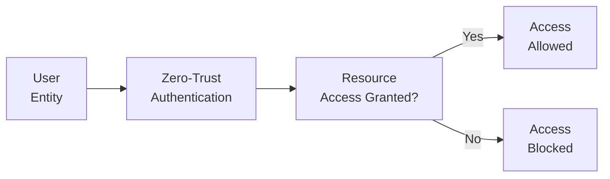

## 32.2 Expanded Definitions and Technical Jargon

This section provides a concise glossary of crucial Information Systems and Controls (ISC) terms. Each entry is paired with a practical, plain-English definition, along with cross-references to relevant chapters throughout this guide. While these definitions aim to be succinct, readers seeking more thorough discussions are encouraged to follow the chapter references provided.

### Access Control
Access control refers to processes and technologies used to regulate who or what can view or use resources in an information system. Controls include user ID/password mechanisms, biometric scans, and role-based access (e.g., limiting sensitive data to authorized personnel).  
• Cross-reference: See Chapter 18 (Authentication and Access Management) for deeper insights.

### Access Reviews
Access reviews involve periodic assessments of user accounts and their associated permissions. By reviewing who has access—and whether that access is still needed—organizations minimize the risk of unauthorized data exposure.  
• Cross-reference: Chapter 18 (Authentication and Access Management).

### Accounting Information System (AIS)
An AIS is a specialized system that collects, stores, processes, and reports financial data for decision-making. It supports transactions such as payroll, accounts receivable/payable, and general ledger activities within an organization.  
• Cross-reference: Chapter 6 (Enterprise Resource Planning (ERP) and Accounting Information Systems).

### Agile Development
Agile development is a flexible, iterative approach to software creation. It breaks projects into small increments known as sprints, enabling rapid feedback and adaptation to changing business needs.  
• Cross-reference: Chapter 10 (IT Change Management) and Chapter 10.5 (Systems Development Life Cycle).

### Analytics
Analytics is the use of data, statistical models, and computational techniques to glean insights and inform decision-making. It can involve descriptive, diagnostic, predictive, or prescriptive methods.  
• Cross-reference: Chapter 14 (Data Integration and Analytics).

### Application Controls
Application controls are specific to individual software applications, helping ensure data integrity, completeness, authorization, and accuracy. They can include input validation and automated balancing checks.  
• Cross-reference: Chapter 7 (Business Processes in Information Systems) and Chapter 8 (ITGC).

### Backup and Recovery
Backup and recovery processes involve creating and maintaining duplicates of critical data and systems to facilitate restoration if primary data is lost, corrupted, or otherwise rendered inaccessible.  
• Cross-reference: Chapter 9 (System Availability and Business Continuity).

### Big Data
Big Data typically refers to large volumes of data, often from varied sources, that require advanced storage and processing techniques to derive meaningful insights.  
• Cross-reference: Chapter 13 (Data Warehousing and Big Data Environments).

### Blockchain
Blockchain is a distributed digital ledger technology that records transactions in a peer-to-peer network. Each new record is encrypted and linked in a chain, making tampering nearly impossible under normal circumstances.  
• Cross-reference: Chapter 6.4 (Blockchain Integration and Considerations for Financial Reporting).

### Business Continuity Planning (BCP)
BCP entails creating strategies and frameworks to ensure critical business operations continue during and after a disruption (e.g., natural disasters).  
• Cross-reference: Chapter 9.1 (Disaster Recovery Planning and Business Resiliency).

### Business Impact Analysis (BIA)
A BIA identifies crucial business functions and quantitatively/qualitatively evaluates the effects of interruptions, helping prioritize recovery efforts.  
• Cross-reference: Chapter 9.3 (BIA: Identifying Critical Functions).

### Business Process Modeling (BPM)
BPM depicts end-to-end processes within an organization. Diagrams can clarify interactions and data flows, helping identify inefficiencies and control gaps.  
• Cross-reference: Chapter 15 (Business Process Modeling and Improvement).

### Cloud Computing
Cloud computing involves delivering IT services over the internet, from data storage and software platforms to full-scale virtual infrastructure. Common models include IaaS, PaaS, and SaaS.  
• Cross-reference: Chapter 5.3 (Cloud Computing Models and Deployment Architectures) and Chapter 29 (In-Depth Cloud Computing Governance).

### COBIT (Control Objectives for Information and Related Technologies)
COBIT is a widely recognized framework for IT governance and management. It provides best practices for aligning IT goals with organizational objectives.  
• Cross-reference: Chapter 3.3 (COBIT 2019 Overview) and Chapter 8.5 (Aligning ITGCs with COSO and COBIT).

### Continuous Integration/Continuous Deployment (CI/CD)
CI/CD is a DevOps practice where code changes are integrated and deployed automatically, using frequent builds and tests to streamline software releases.  
• Cross-reference: Chapter 10.4 (Continuous Integration and Continuous Deployment in Modern DevOps).

### Cyber Insurance
Cyber insurance offers financial protection against cyber risks, covering costs related to data breaches, ransomware, and business interruption.  
• Cross-reference: Chapter 20.4 (Cyber Insurance as a Risk Mitigation Strategy).

### Cybersecurity
Cybersecurity involves methods, technologies, and procedures aimed at protecting information systems from unauthorized access, harm, or misuse.  
• Cross-reference: Chapter 16 (Foundations of Cybersecurity).

### Data Classification
Data classification is the process of labeling information based on its sensitivity, legal requirements, or strategic value. Examples include “public,” “confidential,” or “restricted.”  
• Cross-reference: Chapter 11.2 (Data Classification Levels and Metadata Management).

### Data Dictionary
A data dictionary catalogs detailed information about data elements, including names, meanings, formats, and relationships, ensuring consistent use of data across systems.  
• Cross-reference: Chapter 12.3 (Data Dictionary and Data Integrity Controls).

### Data Governance
Data governance establishes policies, standards, and accountability for managing enterprise data, ensuring its integrity, security, and overall quality.  
• Cross-reference: Chapter 11 (Data Life Cycle and Governance).

### Data Integrity
Data integrity ensures the accuracy, completeness, and reliability of data throughout its entire life cycle, from input to storage to processing and output.  
• Cross-reference: Chapter 7.3 (Evaluating Processing Integrity Controls in Major Cycles).

### Data Lake
A data lake is a storage repository designed to hold raw, unstructured, and semi-structured data from multiple sources until it is needed for analytics.  
• Cross-reference: Chapter 13.1 (Data Warehouses, Data Lakes, and Data Marts).

### Data Loss Prevention (DLP)
DLP tools and techniques prevent unauthorized data exfiltration or inadvertent exposure, often by monitoring and controlling data in motion, use, or rest.  
• Cross-reference: Chapter 19.3 (Data Loss Prevention (DLP) Tools and Strategies).

### Data Mart
A data mart is a subset of a data warehouse, designed for a specific business function (e.g., marketing or finance). It simplifies access to relevant data for targeted analysis.  
• Cross-reference: Chapter 13.1 (Data Warehouses, Data Lakes, and Data Marts).

### Data Mining
Data mining uses statistical algorithms, machine learning, and artificial intelligence to identify patterns or anomalies in multidimensional datasets, helping inform strategic decisions.  
• Cross-reference: Chapter 14 (Data Integration and Analytics).

### Data Retention
Data retention dictates how long data is kept and under what conditions. Regulatory, legal, and operational requirements often shape retention policies.  
• Cross-reference: Chapter 11.3 (Policies for Data Retention and Destruction).

### Data Warehouse
A data warehouse is a centralized repository designed to store historical data from multiple, often disparate, sources in a structured manner optimized for reporting and analysis.  
• Cross-reference: Chapter 13.1 (Data Warehouses, Data Lakes, and Data Marts).

### DevOps
DevOps is a collaborative approach merging software development (Dev) and IT operations (Ops) teams, facilitating faster releases and more stable environments.  
• Cross-reference: Chapter 10.4 (CI/CD in Modern DevOps).

### Disaster Recovery (DR)
DR involves restoring systems and data after disasters (hardware failures, cyberattacks, natural catastrophes). DR is typically part of a broader Business Continuity strategy.  
• Cross-reference: Chapter 9.1 (Disaster Recovery Planning and Business Resiliency).

### Encryption
Encryption transforms data into a coded form to prevent unauthorized disclosure. Only holders of the correct decryption key can revert the data to its readable format.  
• Cross-reference: Chapter 19.2 (Encryption Techniques and Key Management).

### Enterprise Resource Planning (ERP)
An ERP system integrates core business processes—like finance, HR, procurement—into a unified platform, streamlining data flow and decision-making.  
• Cross-reference: Chapter 6 (Enterprise Resource Planning (ERP) and Accounting Information Systems).

### Firewall
A firewall filters incoming and outgoing network traffic based on preconfigured security rules, acting as a barrier between trusted internal networks and untrusted external networks.  
• Cross-reference: Chapter 17.2 (Firewalls, Intrusion Detection and Prevention Systems).

### Forensic Investigation
In IT, forensic investigation refers to the methodical analysis of systems, logs, and digital artifacts to identify evidence related to security incidents or legal matters.  
• Cross-reference: Chapter 20.3 (Forensic Investigations and Chain of Custody).

### General Ledger (GL)
The GL is the central repository for an organization’s financial transactions, summarizing accounts like assets, liabilities, equity, revenues, and expenses.  
• Cross-reference: Chapter 6.2 (Accounting Information Systems within ERPs).

### Governance, Risk, and Compliance (GRC)
GRC represents frameworks and processes that ensure an organization meets its strategic objectives, manages risks appropriately, and complies with laws/regulations.  
• Cross-reference: Chapter 3 (Governance, Frameworks, and Regulatory Environment).

### Hardware
Hardware refers to the physical components of a computer system—servers, end-user devices, network wiring—that host and run software and data.  
• Cross-reference: Chapter 5 (IT Infrastructure Fundamentals).

### HIPAA (Health Insurance Portability and Accountability Act)
HIPAA is a U.S. federal law that sets national standards for protecting sensitive patient health information (PHI). It mandates administrative, physical, and technical safeguards.  
• Cross-reference: Chapter 3.4 (Other Influential Standards and Regulations).

### Identity and Access Management (IAM)
IAM solutions manage user identities and roles, enforcing the principle of least privilege to reduce unauthorized data exposure risks.  
• Cross-reference: Chapter 18 (Authentication and Access Management).

### Incident Response
Incident response is the structured approach to handle security breaches or disruptions. It includes detection, containment, eradication, recovery, and post-incident learning.  
• Cross-reference: Chapter 20 (Incident Response and Recovery).

### Information Technology General Controls (ITGC)
ITGC are foundational controls that support the secure and reliable operation of IT systems, typically covering areas such as access, program changes, program development, and operations.  
• Cross-reference: Chapter 8 (IT General Controls (ITGC) – Standard Domains).

### Infrastructure as a Service (IaaS)
IaaS is a cloud computing model where providers offer virtualized computing resources (e.g., servers, storage) over the internet, allowing organizations to manage operating systems and applications.  
• Cross-reference: Chapter 5.3 (Cloud Computing Models and Deployment Architectures).

### Intrusion Detection/Prevention System (IDPS)
An IDPS monitors network or system activities to detect malicious activity or security policy violations, sometimes taking automated action to block or isolate threats.  
• Cross-reference: Chapter 17.2 (Firewalls, Intrusion Detection and Prevention Systems).

### Least Privilege
Least privilege is a security principle that grants users only the permissions and resources necessary for their legitimate work, thus limiting exposure if an account is compromised.  
• Cross-reference: Chapter 18.3 (Role-Based Access and the Principle of Least Privilege).

### Machine Learning (ML)
ML is a subset of AI where systems learn patterns from data without explicit programming, enabling predictive analytics and automated decision-making.  
• Cross-reference: Chapter 14.3 (Predictive Analytics, Machine Learning, and AI Fundamentals).

### Materiality
In auditing, materiality is the threshold at which misstatements or omissions impact users’ decisions based on financial statements or reports.  
• Cross-reference: Chapter 4.3 (Risk Assessment and Materiality in IT-Related Engagements).

### Multi-Factor Authentication (MFA)
MFA adds an extra layer of security by requiring users to present at least two forms of verification (e.g., password plus mobile token).  
• Cross-reference: Chapter 18.2 (Password Policies, Multi-Factor Authentication, Single Sign-On).

### Network Segmentation
Network segmentation partitions a computer network into sub-networks to isolate threats and improve security control.  
• Cross-reference: Chapter 17.1 (Network Segmentation and Isolation).

### Operating System (OS)
The OS is the fundamental software that manages computer hardware, software resources, and provides services for programs and users (e.g., Windows, Linux).  
• Cross-reference: Chapter 5.2 (Operating Systems and Virtualization Concepts).

### Patch Management
Patch management ensures timely updates of software or firmware to fix security vulnerabilities, add features, or improve performance.  
• Cross-reference: Chapter 10.3 (Patch Management: Risks and Controls).

### Penetration Testing (Pen Test)
A pen test involves simulating real-world attacks to find vulnerabilities in an organization’s systems and networks before malicious actors do.  
• Cross-reference: Chapter 21.1 (Types of Security Assessments).

### Predictive Analytics
Predictive analytics uses data, algorithms, and machine learning to project future outcomes or behaviors, helping organizations anticipate and respond to trends.  
• Cross-reference: Chapter 14.3 (Predictive Analytics, Machine Learning, and AI Fundamentals).

### Privacy
Privacy concerns the rights and obligations of individuals and organizations regarding the collection, use, retention, and disclosure of personal data.  
• Cross-reference: Chapter 19 (Data Confidentiality and Privacy Controls).

### Processing Integrity
Processing integrity ensures that data is processed accurately, completely, and timely throughout each transaction or system interaction.  
• Cross-reference: Chapter 7.3 (Evaluating Processing Integrity Controls in Major Cycles) and Chapter 24.1 (Trust Services Criteria for SOC 2®).

### Public Key Infrastructure (PKI)
PKI is a system of technologies, policies, and procedures used to create, manage, distribute, and revoke digital certificates, enabling secure data exchange.  
• Cross-reference: Chapter 19.2 (Encryption Techniques and Key Management).

### Robotic Process Automation (RPA)
RPA configures software “robots” to emulate human actions within digital systems, automating repetitive tasks (e.g., invoice processing).  
• Cross-reference: Chapter 6.3 (Robotic Process Automation and Emerging Technologies).

### Role-Based Access Control (RBAC)
RBAC assigns system or resource access according to job roles within an organization, simplifying the management of user privileges.  
• Cross-reference: Chapter 18.3 (Role-Based Access and Principle of Least Privilege).

### SaaS (Software as a Service)
SaaS allows users to access software hosted by third-party providers via the internet. The provider manages infrastructure, updates, and security, while the user focuses on data and usage.  
• Cross-reference: Chapter 5.3 (Cloud Computing Models and Deployment Architectures).

### Service Level Agreement (SLA)
An SLA is a contract that defines the scope and quality of a service (e.g., uptime, support response time), setting expectations between a provider and a client.  
• Cross-reference: Chapter 9.4 (Metrics and Agreements).

### Single Sign-On (SSO)
With SSO, employees log in once to gain access to multiple systems. It centralizes authentication and can reduce password fatigue.  
• Cross-reference: Chapter 18.2 (Password Policies, Multi-Factor Authentication, Single Sign-On).

### SOC (System and Organization Controls) Reports
SOC reports provide assurance about a service organization’s controls relevant to financial reporting or security, availability, processing integrity, confidentiality, or privacy.  
• Cross-reference: Part V (System and Organization Controls (SOC) Engagements).

### SQL (Structured Query Language)
SQL is a standardized language for managing and querying relational databases. Common commands include SELECT, INSERT, UPDATE, and DELETE.  
• Cross-reference: Chapter 12.2 (SQL Queries: Common Commands, Clauses, Operators).

### Subservice Organization
A subservice organization is a third party used by a main service organization to perform some activities that may be relevant to user entities’ internal control over financial reporting.  
• Cross-reference: Chapter 23.5 (Inclusive vs. Carve-Out Method) and Chapter 25.3 (Identifying Complementary User Entity Controls).

### System Availability
System availability is the extent to which a system is operational, accessible, and able to deliver services when needed.  
• Cross-reference: Chapter 9 (System Availability and Business Continuity).

### Testing Environments (Dev, QA, Prod)
Organizations commonly maintain multiple environments for software development (Dev), quality assurance (QA), and production (Prod) to reduce risk and improve quality control.  
• Cross-reference: Chapter 10.2 (Environments and Testing).

### Third-Party Risk Management
This process involves assessing and monitoring potential risks introduced by vendors, partners, and suppliers who have access to an organization’s systems or data.  
• Cross-reference: Chapter 7.5 (Third-Party and Vendor Risk Management).

### Threat Actor
A threat actor is any individual or entity that poses a risk to an organization’s IT systems through malicious activities like hacking, phishing, or malware deployment.  
• Cross-reference: Chapter 16.1 (Threat Actors, Attack Vectors, and Evolving Landscapes).

### Tokenization
Tokenization replaces sensitive data with a non-sensitive equivalent (token), reducing the risk of data exposure if breached.  
• Cross-reference: Chapter 19 (Data Confidentiality and Privacy Controls).

### Transaction Processing System (TPS)
A TPS handles the collection, modification, and retrieval of transaction-oriented data, ensuring speed, reliability, and consistency.  
• Cross-reference: Chapter 7.1 (Core Transaction Cycles and Supporting Modules).

### User Entity Controls
User entity controls refer to complementary controls that client organizations must implement when utilizing a service organization’s system to ensure proper internal control.  
• Cross-reference: Chapter 22.3 (Comparing User Entity Controls and Subservice Organization Controls).

### Virtualization
Virtualization is the creation of simulated computing resources, such as virtual machines, networks, or storage, allowing more efficient utilization of physical hardware.  
• Cross-reference: Chapter 5.2 (Operating Systems and Virtualization Concepts).

### Vulnerability Scan
A vulnerability scan automates the process of identifying known security weaknesses in systems, networks, or applications.  
• Cross-reference: Chapter 21.1 (Types of Security Assessments).

### Zero-Trust
Zero-trust is a security model that requires strict identity verification for every user or device attempting to access resources, regardless of network location.  
• Cross-reference: Chapter 16.4 (Zero-Trust Approach to Security).

Below is a visual overview of a simple access request flow in a zero-trust network, using Mermaid.js diagramming.

In this diagram, all entities accessing resources must pass through robust identity verification steps. The outcome of verification directly determines whether the resource is accessible, embodying the zero-trust mindset.

By understanding these foundational terms, CPAs and IT professionals can better communicate, evaluate, and implement effective controls that safeguard financial data, uphold compliance, and drive organizational success.

--------------------------------------------------------------------------------

## Master Key IT Terminology with This Quiz



### Which term refers to a flexible, iterative approach to software development that breaks projects into sprints?  
- [ ] Waterfall method  
- [x] Agile development  
- [ ] Patch management  
- [ ] DevOps  

> **Explanation:** Agile development uses iterative sprints and continuous feedback to address changing requirements, contrasting with the more linear Waterfall approach.

### Which security principle grants users the minimum level of access necessary for their job functions?  
- [ ] Single sign-on  
- [ ] Two-factor authentication  
- [x] Principle of least privilege  
- [ ] Data mining  

> **Explanation:** The principle of least privilege ensures users only have the permissions needed to perform approved job tasks, limiting potential damage from compromised credentials.

### What is the main benefit of using a data lake?  
- [x] Storing raw, unstructured data until needed for analysis  
- [ ] Enforcing strict data structures  
- [ ] Automatically ensuring data integrity  
- [ ] Speeding up software patches  

> **Explanation:** Data lakes allow for flexible storage of large raw datasets from multiple sources; the data can then be structured at the time of analysis.

### Which of the following best describes COBIT?  
- [ ] An infrastructure for distributing cryptographic keys  
- [ ] A programming language  
- [x] An IT governance and management framework for aligning IT with organizational goals  
- [ ] A global privacy law  

> **Explanation:** COBIT (Control Objectives for Information and Related Technologies) is a widely recognized framework for IT governance and management, guiding best practices.

### Which concept ensures a system can continue essential operations during and after a disrupting event?  
- [x] Business continuity planning (BCP)  
- [ ] Patch management  
- [ ] AI governance  
- [x] Disaster recovery  

> **Explanation:** BCP refers to strategic plans for operational continuity, while disaster recovery focuses more specifically on restoring IT systems and data post-incident.

### Within the SOC framework, “subservice organizations” refer to:  
- [x] Third parties relied upon by the primary service organization  
- [ ] Internal auditors within the service organization  
- [ ] Clients who purchase the SOC reports  
- [ ] Personal devices used to access enterprise systems  

> **Explanation:** Subservice organizations are essential third parties integral to the parent organization’s processes, potentially affecting internal control.

### Which activity involves simulating an attack on an organization’s network to identify vulnerabilities?  
- [x] Penetration testing  
- [ ] Vulnerability scanning only  
- [x] Both penetration testing and vulnerability scanning  
- [ ] Business impact analysis  

> **Explanation:** Penetration testing uses techniques real attackers might use, whereas vulnerability scanning (often a preliminary step) relies on automated checks to find known weaknesses.

### In the cloud computing model known as SaaS, who is primarily responsible for maintaining the underlying infrastructure?  
- [x] The third-party provider  
- [ ] The end-user  
- [ ] The organization’s IT department  
- [ ] A separate hardware vendor  

> **Explanation:** SaaS providers handle infrastructure, application updates, and security so end-users can focus on data and usage.

### What is the primary purpose of a vulnerability scan?  
- [x] Automating the detection of known security weaknesses  
- [ ] Performing a real-world hack simulation  
- [ ] Creating encryption keys  
- [ ] Enforcing GDPR policies  

> **Explanation:** Vulnerability scans generally rely on signature databases to detect known risks, whereas penetration testing more closely mimics real attackers.

### True or False: Zero-trust assumes that once a user has accessed the internal network, they are trusted entirely.  
- [x] False  
- [ ] True  

> **Explanation:** Zero-trust insists on re-authentication and verification of every user or device accessing resources, regardless of “inside” or “outside” network location status.



--------------------------------------------------------------------------------

## For Additional Practice and Deeper Preparation

### [Information Systems and Controls (ISC)](https://www.udemy.com/course/isc-cpa-mock-exams/?referralCode=E1217303222935C5E464)

**Information Systems and Controls (ISC) CPA Mocks:** 6 Full (1,500 Qs), Harder Than Real! In-Depth & Clear. Crush With Confidence!

• Tackle full-length mock exams designed to mirror real ISC questions.  
• Refine your exam-day strategies with detailed, step-by-step solutions for every scenario.  
• Explore in-depth rationales that reinforce higher-level concepts, giving you an edge on test day.  
• Boost confidence and minimize anxiety by mastering every corner of the ISC blueprint.  
• Perfect for those seeking exceptionally hard mocks and real-world readiness.

_Disclaimer: This course is not endorsed by or affiliated with the AICPA, NASBA, or any official CPA Examination authority. All content is for educational and preparatory purposes only._
