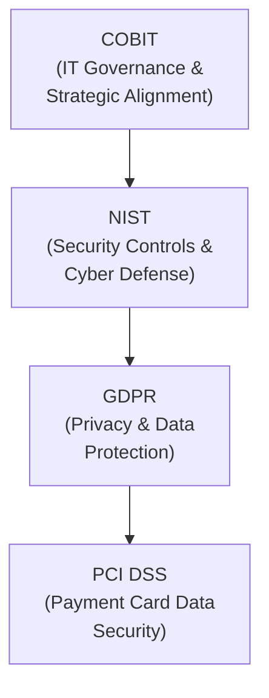
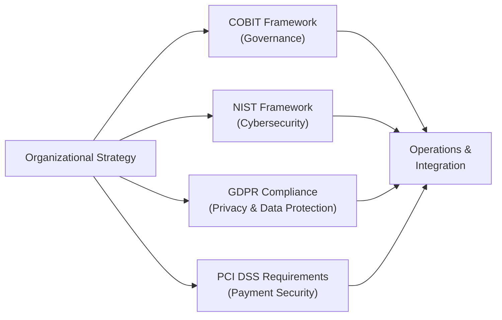

## 33.1 COBIT, NIST, GDPR, PCI DSS Key Takeaways

In a rapidly evolving digital environment, organizations need clear and structured approaches to managing risk, aligning IT operations with strategic goals, and ensuring compliance with regulatory requirements. Four of the most widely recognized frameworks and regulations are:

• COBIT – Primarily focused on governance of enterprise IT and bridging corporate objectives with IT goals.  
• NIST – A set of security guidelines and control families, promoting robust cybersecurity postures in both the public and private sectors.  
• GDPR – A European Union regulation on data privacy and protection, with global impact due to its extraterritorial reach.  
• PCI DSS – A standard designed to secure payment card transactions and protect cardholder data.

When CPAs assume advisory or assurance responsibilities, they often must evaluate an enterprise’s alignment with these frameworks and regulations. This section provides an overview of each, along with discussion of high-level goals, practical compliance pointers, and potential pitfalls.

---

### Relevance to Prior Chapters

In previous chapters—such as Chapter 3: Governance, Frameworks, and Regulatory Environment, Chapter 4: Key Concepts of IT Audit and Assurance, and Chapter 16: Foundations of Cybersecurity—we touched on why these frameworks and regulations matter. The following material builds on those discussions, providing expanded insights that CPAs can leverage in IT audits, SOC engagements, or advisory roles.

Below is an illustration of how COBIT, NIST, GDPR, and PCI DSS might interrelate in a multi-framework environment:

This diagram illustrates the sequential interplay among various goals. While each serves distinct purposes, they integrate in a well-rounded compliance and governance strategy.

---

### COBIT (Focus on IT Governance)

COBIT (Control Objectives for Information and Related Technology), developed by ISACA, provides a comprehensive framework that aligns IT processes and controls with enterprise objectives. COBIT helps organizations ensure and demonstrate that IT is effectively serving the broader mission.

High-Level Goals  
• Align IT strategy with business objectives.  
• Establish robust risk management and internal control architectures under a governance lens.  
• Promote accountability and clear ownership of processes, policies, and control environments.  
• Provide global standards and guidelines for measuring IT performance and capability maturity.

Key Components of COBIT  
• Governance Principles: Setting the tone from the top, clarifying stakeholder needs, and embedding strategic guidelines.  
• Governance and Management Objectives: Divided into domains such as Evaluate, Direct and Monitor (EDM) for governance, and Align, Plan, and Organize (APO); Build, Acquire, and Implement (BAI); Deliver, Service, and Support (DSS); and Monitor, Evaluate, and Assess (MEA) for management.  
• Process, Capability, and Maturity Models: Offering a structured approach to assess the current maturity of IT processes, define target levels, and plan for improvements.

Practical Compliance Pointers  
• Conduct Regular Maturity Assessments: Evaluate the maturity of IT processes (e.g., BAI06—Manage Changes) and establish improvement roadmaps.  
• Define Key Performance Metrics: Identify KPIs (Key Performance Indicators) and KRIs (Key Risk Indicators) tied to strategic goals.  
• Document Roles and Responsibilities: Ensure roles are clearly delineated in RACI charts or equivalent, supporting accountability.  
• Leverage COBIT in External Reporting: For instance, use elements of COBIT to strengthen the description criteria in SOC 1® or SOC 2® engagements.

Potential Pitfalls  
• Overlooking Stakeholder Engagement: Failing to align IT investments with business needs can lead to missed opportunities or cost overruns.  
• Excessive Bureaucracy: COBIT is broad; customizing it to organizational context is crucial to avoid unnecessary complexity.  
• Inconsistent Maturity Measures: Without standardized metrics, it can be challenging to benchmark improvements in IT processes.

Practical Example  
Consider a multinational manufacturing enterprise with diverse IT systems. Using COBIT’s APO framework, the organization might define specific objectives for resource optimization (APO04) and quality assurance (APO11). By applying consistent maturity assessments, the company identifies repeated change management problems and addresses the root causes via improved training, standardized approvals, and better documentation practices.

---

### NIST (Focus on Security and Controls)

The National Institute of Standards and Technology (NIST) publishes widely referenced guidance and standards, such as the NIST Cybersecurity Framework (CSF) and Special Publication 800-53 for security and privacy controls. These guidelines help organizations build methodical approaches to risk assessment, threat mitigation, and continuous monitoring.

High-Level Goals  
• Provide a common taxonomy and organized approach to identify, protect, detect, respond, and recover from cybersecurity threats.  
• Facilitate the implementation of robust controls across diverse industries, ensuring that key security objectives—confidentiality, integrity, and availability—are consistently maintained.  
• Promote collaboration between government, private entities, and international bodies through standardized methodologies and best practices.

Core Components of the NIST Cybersecurity Framework  
• Framework Core: Functions (Identify, Protect, Detect, Respond, Recover), Categories (e.g., Asset Management, Data Security), and Subcategories (detailed outcomes).  
• Implementation Tiers: Ranging from Partial (Tier 1) to Adaptive (Tier 4), reflecting organizational risk management practices.  
• Profiles: Customized alignments between the Framework Core and unique organizational risks and requirements.

Practical Compliance Pointers  
• Align Controls with Business Context: Map each NIST security control to business processes, ensuring alignment with strategic and operational goals.  
• Maintain Detailed Inventories: Identify hardware and software assets (Chapter 5: IT Infrastructure Fundamentals). This ties closely to the Identify function.  
• Integrate Continuous Monitoring: Use automated tools and real-time dashboards to detect anomalies, as recommended by the Detect and Respond functions.  
• Conduct Regular Risk Assessments: Evaluate threats against documented vulnerabilities to prioritize control implementations.

Potential Pitfalls  
• Failure to Account for Organizational Complexity: NIST guidelines can be comprehensive. Smaller organizations must adapt them proportionally.  
• Overemphasis on Technology Alone: NIST success also depends on governance, employee awareness, and robust policies, not just sophisticated software.  
• Inconsistent Documentation: Adequate evidence-gathering is essential for subsequent audits or investigations.

Real-World Example  
A state agency handling sensitive personal information deploys NIST SP 800-53 controls to secure their systems. The Protect function includes robust access management protocols (e.g., mandatory MFA), while the Detect function features advanced intrusion detection systems integrated into a SIEM (Security Information and Event Management) platform. This configuration allows near-real-time monitoring of network traffic for anomalies.

---

### GDPR (Focus on Data Protection and Privacy)

The General Data Protection Regulation (GDPR) has drastically reshaped global data privacy standards. Applicable to all organizations handling EU residents’ personal data, GDPR enforces principles of transparency, accountability, and data minimization, among others. Non-compliance can result in substantial financial penalties.

High-Level Goals  
• Enforce better protection of personal data and ensure individuals’ rights (e.g., right to be forgotten, right to data portability).  
• Require organizations to incorporate “privacy by design and by default” into core data processing activities.  
• Encourage transparency and accountability by mandating robust internal governance, including Data Protection Officers (DPOs) for certain organizations.

Key Provisions  
• Lawful Basis for Processing: Must have explicit consent, contractual necessity, legal obligation, vital interest, public interest, or legitimate interests.  
• Data Subject Rights: Access, rectification, erasure, restriction of processing, data portability, objection to processing.  
• Data Breach Notification: 72-hour window to notify supervisory authorities following a breach of personal data.  
• Fines and Sanctions: Up to 4% of annual global turnover or €20 million, whichever is higher, for severe infractions.

Practical Compliance Pointers  
• Conduct Data Protection Impact Assessments (DPIAs): Evaluate risk to data subjects and plan mitigating controls (Chapter 19: Data Confidentiality and Privacy Controls).  
• Maintain a Register of Processing Activities (RoPA): Properly document the categories of personal data processed, the purpose of processing, and retention periods.  
• Implement Access and Retention Policies: Enforce the principle of least privilege and clarify corporate data disposal procedures.  
• Designate or Consult a Data Protection Officer (DPO): If required by GDPR or best practice, empower the DPO to monitor ongoing compliance.  
• Ensure Vendor Contractual Clarity: Include GDPR-compliant data processing addenda for any third-party service providers (subprocessors).

Potential Pitfalls  
• Complacency about Non-EU Entities: GDPR also applies to organizations offering goods or services to EU residents, regardless of their geographic location.  
• Poor Data Inventory: It is difficult to protect data if you do not know what you have.  
• Lack of Incident Response Planning: GDPR’s 72-hour breach notification is stringent; unsatisfactory or delayed reporting can attract penalties.

Practical Implementation Example  
A U.S.-based e-commerce retailer sells products to customers in Germany and France. The retailer implements robust cookie consent mechanisms, ensures express consent for marketing communications, and logs all data processing operations. A DPO role is established to oversee vendor agreements, incorporating standard contractual clauses for data transfers outside the EU. In the event of a breach, the retailer has a clearly defined incident response team ready to notify relevant EU authorities within the required timeframe.

---

### PCI DSS (Focus on Payment Card Data Security)

The Payment Card Industry Data Security Standard (PCI DSS) sets technical and operational requirements to protect cardholder data. Managed by the PCI Security Standards Council, it applies to all entities involved in payment card processing, including merchants, processors, acquirers, issuers, and service providers.

High-Level Goals  
• Securely handle payment cards to reduce the risk of fraud and data breaches.  
• Standardize controls to protect cardholder data across the payment industry.  
• Enforce consistent policies for network and data security, vulnerability management, and restricted access to sensitive authentication data.

Core PCI DSS Requirements  
• Build and Maintain a Secure Network: Use firewalls and secure configurations.  
• Protect Cardholder Data: Implement strong encryption, masking, or tokenization where feasible.  
• Maintain a Vulnerability Management Program: Regular patching, antivirus updates, and penetration testing.  
• Implement Strong Access Controls: Unique IDs for each user, MFA, and strict role-based permissions.  
• Monitor and Test Networks Regularly: System audits, log reviews, and intrusion detection.  
• Maintain an Information Security Policy: Include acceptable use, data retention, vendor management, and security awareness.

Practical Compliance Pointers  
• Enforce Network Segmentation: Isolate cardholder data environments (CDE) from broader corporate networks.  
• Conduct Quarterly Scanning: Engage Approved Scanning Vendors (ASVs) to meet external scanning requirements.  
• Implement Logging and Monitoring: Centralize logs and track all interactions with cardholder data.  
• Define Retention Policies: Only store cardholder data as long as absolutely necessary.  
• Utilize Self-Assessment Questionnaires (SAQs): Appropriate for smaller merchants with lower transaction volumes.

Potential Pitfalls  
• Underestimating Scope: Entities often fail to segment payment systems properly, leading to a broader compliance scope.  
• Reliance on Outdated Encryption Methods: PCI DSS compliance changes frequently, so old encryption protocols may be noncompliant.  
• Inadequate Staff Training: Human errors, phishing, or social engineering can quickly compromise card data, even if technological controls are solid.

Real-World Example  
A mid-sized retail chain processes thousands of credit card transactions every day. To comply with PCI DSS, they isolate all point-of-sale (POS) devices in a separate VLAN, regularly update anti-virus software on their POS terminals, apply strict role-based credentials for store managers and payment system integrators, and partner with an ASV for quarterly external vulnerability scans.

---

### Bringing It All Together

COBIT, NIST, GDPR, and PCI DSS each present unique perspectives for maintaining organizational compliance, managing technical controls, and safeguarding valuable data. In practice, organizations often combine multiple frameworks to meet their comprehensive governance needs, reduce repetition in audits, and demonstrate robust accountability to stakeholders.

In many cases, CPAs charged with an IT assurance or advisory engagement can leverage alignment with these frameworks to:

• Evaluate the strength of IT governance structures (COBIT).  
• Assess cybersecurity readiness (NIST).  
• Verify data privacy obligations (GDPR).  
• Confirm payment card compliance for retailers or service providers (PCI DSS).  

Integrated compliance not only streamlines processes but also assures regulators, clients, and shareholders that an organization takes its responsibilities seriously.

Below is a simplified illustration of how an organization's compliance strategy, underpinned by these four major frameworks, might look in practice:

This diagram shows that all frameworks and regulations feed into operational integration, which, in turn, aims to meet overarching business strategies.

---

### References for Further Exploration

• ISACA: Official COBIT resources and implementation guides → https://www.isaca.org/resources/cobit  
• NIST: Cybersecurity Framework, SP 800-53 → https://www.nist.gov/cyberframework  
• European Commission: GDPR official text → https://ec.europa.eu/info/law/law-topic/data-protection_en  
• PCI Security Standards Council: Guidance and Self-Assessment Questionnaires → https://www.pcisecuritystandards.org  

These resources provide detailed, authoritative information and best practices to help your organization enhance governance, security, and compliance domestically and internationally.

---

## Test Your Knowledge: COBIT, NIST, GDPR, and PCI DSS



### Which of the following is a primary high-level goal of COBIT?
- [x] Aligning IT strategy with overall business objectives
- [ ] Leveraging only industry-specific governance approaches
- [ ] Keeping cybersecurity measures entirely separate from financial controls
- [ ] Focusing solely on data privacy in the European Union

> **Explanation:** COBIT emphasizes aligning IT strategy with broader corporate goals, ensuring that technology supports strategic objectives.

### Which section of GDPR describes the “lawful basis” for data processing?
- [x] Articles 6 and 9
- [ ] Articles 20 and 27
- [ ] Recitals 85 and 132
- [ ] None of the above

> **Explanation:** Articles 6 and 9 detail valid reasons (e.g., consent, contracts) under which personal data can be processed.

### In the NIST Cybersecurity Framework, which function focuses on real-time monitoring of threats and anomalies?
- [x] Detect
- [ ] Respond
- [ ] Protect
- [ ] Identify

> **Explanation:** NIST’s Detect function aims to identify cybersecurity events and anomalies swiftly, allowing for timely response measures.

### For PCI DSS, which of the following is an essential control for reducing scope and risk?
- [x] Network segmentation of the cardholder data environment
- [ ] Deploying only client-side encryption
- [ ] Using the same credentials for administrative and user accounts
- [ ] Maintaining no logs of transactions

> **Explanation:** Network segmentation helps isolate payment systems from broader corporate environments, reducing attack surfaces and compliance scope.

### Under GDPR, the 72-hour breach notification requirement primarily applies to:
- [x] Reporting certain types of personal data breaches to the relevant supervisory authority
- [ ] Notifying all affected customers in writing for any security event
- [x] Reporting certain incidents to the local health department
- [ ] Publicly disclosing any attempted phishing events

> **Explanation:** GDPR mandates notification to the supervisory authority within 72 hours when a data breach potentially affects individuals’ personal data.

### Which primary focus is shared by both PCI DSS and GDPR?
- [x] Safeguarding sensitive information from unauthorized disclosure
- [ ] Mandating the same encryption algorithm for stored data
- [ ] Issuing universal compliance certificates for all regulated entities
- [ ] Centering on intangible assets and intellectual property only

> **Explanation:** Both frameworks aim to protect critical data, though they target different categories of data (payment card vs. personal data).

### What is a recommended approach for implementing NIST’s guidance in a small company?
- [x] Adapting the framework proportionally while maintaining key security principles
- [ ] Dismissing NIST because it is only for large corporations
- [x] Ignoring governance and focusing only on software solutions
- [ ] Outsourcing all IT operations without controls

> **Explanation:** NIST is scalable. Smaller organizations should tailor its controls to match their risk profiles and resource capacities.

### Which statement best describes a typical pitfall when adopting COBIT?
- [x] Using COBIT “as-is” without customizing it to organizational needs
- [ ] Failing to incorporate a waterfall methodology in software development
- [ ] Integrating only the NIST CSF controls
- [ ] Creating an EDI data transmission system

> **Explanation:** COBIT’s detailed guidelines must be adapted; blindly applying it can create unnecessary overhead and confusion.

### Which of the following help(s) maintain continuous compliance in PCI DSS contexts?
- [x] Quarterly scanning by an Approved Scanning Vendor (ASV)
- [ ] Moving all processing to foreign jurisdictions
- [ ] Permitting shared logins among employees
- [ ] Eliminating all encryption to streamline processes

> **Explanation:** Quarterly external vulnerability scans by an ASV is a key requirement for ongoing PCI DSS compliance.

### When comparing these frameworks, true or false: “COBIT focuses on overall governance, while NIST, GDPR, and PCI DSS center on specialized areas of security, privacy, or payment data.”
- [x] True
- [ ] False

> **Explanation:** COBIT aims at enterprise-wide governance. NIST centers on security controls, GDPR on privacy, and PCI DSS on payment data security.



---

## For Additional Practice and Deeper Preparation

### [Information Systems and Controls (ISC)](https://www.udemy.com/course/isc-cpa-mock-exams/?referralCode=E1217303222935C5E464)

**Information Systems and Controls (ISC) CPA Mocks:** 6 Full (1,500 Qs), Harder Than Real! In-Depth & Clear. Crush With Confidence!

- Tackle full-length mock exams designed to mirror real ISC questions.  
- Refine your exam-day strategies with detailed, step-by-step solutions for every scenario.  
- Explore in-depth rationales that reinforce higher-level concepts, giving you an edge on test day.  
- Boost confidence and minimize anxiety by mastering every corner of the ISC blueprint.  
- Perfect for those seeking exceptionally hard mocks and real-world readiness.  

_Disclaimer: This course is not endorsed by or affiliated with the AICPA, NASBA, or any official CPA Examination authority. All content is for educational and preparatory purposes only._
