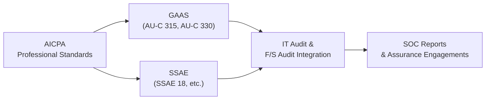

## 33.2 AICPA Professional Standards Related to IT Audits

The rapid acceleration of technology in today’s business landscape has profoundly influenced how Certified Public Accountants (CPAs) approach audits, particularly those involving complex IT environments. As CPAs assume greater responsibilities for evaluating organizations’ information systems and controls, adherence to AICPA professional standards becomes crucial for ensuring high-quality, consistent, and reliable IT audit services. This section offers a comprehensive examination of the relevant AICPA standards that guide CPAs in planning, conducting, and reporting on technology-focused audits and attestation engagements.

This chapter builds on concepts discussed throughout the book—particularly from Part V: System and Organization Controls (SOC) Engagements—by focusing on the AICPA standards most pertinent to IT auditing. You will gain insights into how these standards shape CPA responsibilities, influence engagement scope, and promote consistency in evaluating controls.

Foundational Context of AICPA Standards

AICPA standards exist to heighten the quality, accuracy, and consistency of both attestation engagements and assurance services performed by CPAs. In the context of IT audits, these standards aim to help practitioners:

• Navigate the interplay between information systems and financial reporting.  
• Assess organizational risks arising from IT infrastructure, cybersecurity threats, and process automation.  
• Develop robust testing procedures for areas such as data integrity, system access, change management, and disaster recovery.  
• Evaluate control designs and operating effectiveness to ensure compliance with both internal and external requirements.  

Below, we explore the core sets of AICPA Professional Standards relevant to IT audits, discuss how they shape audit engagements, and illustrate potential scenarios that bring these standards to life.

AICPA Code of Professional Conduct and Independence

At the heart of any CPA engagement—whether focused on financial statements or IT systems—stands the AICPA Code of Professional Conduct. This foundational set of ethical rules provides guiding principles for integrity, objectivity, and professional skepticism.

• Independence Requirements: When conducting IT-related attestation services (e.g., SOC 1®, SOC 2®, or SOC for Cybersecurity), auditors must remain independent in both fact and appearance. This includes avoiding conflicts of interest and inappropriate consulting relationships with the client’s IT personnel that may threaten objectivity.  

• Confidentiality of Sensitive IT Data: CPAs often access privileged information—application design documentation, system architecture, encryption keys, and beyond. They must rigorously adhere to confidential client information standards to protect data integrity and comply with privacy laws.  

• Professional Skepticism: Evaluating complex IT environments, CPAs must maintain a questioning mindset and refrain from any assumption that management’s representations are free from potential oversight or error.  

Example in Practice: Suppose a CPA firm is engaged to conduct a SOC 2® examination on a cloud-hosting provider. During fieldwork, the auditors obtain details about the client’s custom firewall settings and critical security policies. The Code of Professional Conduct dictates that auditors protect this client data, using it only for professional purposes central to the engagement. Additionally, the CPA must remain independent, even if the firm has provided peripheral IT advisory services in the past.

Generally Accepted Auditing Standards (GAAS) for IT-Focused Audits

While GAAS has traditionally centered on financial statement audits, many of its principles remain directly relevant to IT audits. The Clarified Statements on Auditing Standards (SAS), codified under AU-C sections, highlight requirements in areas such as:

• AU-C 315 – Understanding the Entity and Its Environment and Assessing the Risks of Material Misstatement: CPAs must consider the design and implementation of computerized controls, IT infrastructure, and automated transaction flows. Through walkthroughs, system flowcharts, and control testing, auditors identify risks that could lead to material misstatements.  

• AU-C 330 – Performing Audit Procedures in Response to Assessed Risks and Evaluating the Audit Evidence Obtained: This section guides the auditor on selecting and executing appropriate tests of controls (including IT controls) to gather sufficient and appropriate evidence. In IT-heavy engagements, professionals may use data analytics tools, interface testing, and specialized software to verify the accuracy and completeness of electronic transactions.  

• AU-C 500 Series – Audit Evidence: In an IT environment, evidence often includes log data, system configurations, user access management, and application control outputs. GAAS instructs CPAs on the reliability and sufficiency of such digital evidence, urging them to evaluate whether evidence from systems is trustworthy and effectively controlled.  

Practical Illustration: During an integrated financial statement audit, the auditor might realize that a large volume of sales transactions is processed via an automated interface between an e-commerce platform and the general ledger. Under AU-C 315, the CPA maps out the sales process to identify how the system captures, authorizes, and records revenue. Under AU-C 330, the auditor then performs tests of the application control that matches online orders to customer shipping confirmations. These steps uphold GAAS by delivering adequate assurance that sales figures are accurate and complete.

Statements on Standards for Attestation Engagements (SSAE)

Attestation engagements play a prime role in evaluating and reporting on controls at a service organization or on a subject matter other than historical financial statements. SSAE standards provide the framework for these engagements, and several of them are vital in shaping IT attestation services:

• SSAE No. 18: Introduced a conceptual framework for attestation engagements, building on prior standards (SSAE No. 16, which replaced SAS 70). This standard reorganized and clarified requirements for performing examinations, reviews, and agreed-upon procedures. Service Organization Controls (SOC) engagements, such as SOC 1® and SOC 2®, fall under the umbrella of SSAE 18.  

• Newer SSAE Updates: The AICPA periodically issues new SSAE versions (e.g., SSAE No. 19, 21, and beyond) to address emerging risks, such as cybersecurity, third-party vendor management, and the use of automation. These updates can introduce or refine requirements for the description of controls, management assertions, or the scope of testing.  

• Application to SOC Engagements: Notably, the SOC 2® framework tailors the controls to one or more Trust Services Criteria (Security, Availability, Processing Integrity, Confidentiality, and Privacy), central to which is SSAE 18 guidance for verifying that controls are fairly described, suitably designed, and operating effectively.  

Case Scenario: A growing SaaS enterprise that processes sensitive user data requests a SOC 2® Type 2 report. In performing the examination, the CPA must follow SSAE 18 guidelines, ensuring they have robust documentation of management’s description of the system and verifying that the stated cybersecurity, availability, and confidentiality controls have indeed been operating effectively throughout the specified review period. The attestation procedures performed stem directly from the SSAE framework’s requirements on evidence gathering, independence, and reporting.

Key AICPA Audit and Attestation Pronouncements That Affect IT Audits

The table below provides an overview of several AICPA-pronounced standards that significantly influence how CPAs handle IT-related audits, reviews, or examinations:

| Standard/Pronouncement    | Core Focus                                    | Relevance to IT Audits                                                                |
|---------------------------|-----------------------------------------------|----------------------------------------------------------------------------------------|
| AU-C 315                  | Understanding Entity & Risks                 | Identification of IT-based risks to financial reporting; system mapping & walkthroughs |
| AU-C 330                  | Responding to Risks & Gathering Evidence     | Tailored tests of IT general and application controls, data validation                 |
| AU-C 500 Series           | Audit Evidence                               | Reliability, timeliness, and quality of electronic audit evidence                      |
| SSAE 18 (SOC Engagements) | Examination, Review, AUP for Subject Matter  | Framework for SOC 1®, SOC 2®, SOC 3®, and specialized cybersecurity engagements         |
| AICPA Code of Conduct     | Ethics & Independence                         | Requirements for professional integrity, objectivity, confidentiality                  |

Relationship Between GAAS, SSAE, and the IT Audit Process

By combining GAAS’s emphasis on understanding risks and obtaining sufficient evidence with SSAE’s structured approach to attestation, CPAs have an overarching guide to performing thorough IT audits or IT-based attestations. The synergy ensures that:

• Engagement scoping recognizes IT controls critical to financial reporting and overall organizational objectives.  
• Testing procedures align with recognized professional methods, including control walkthroughs, sampling, data analytics, and inquiry with key IT personnel.  
• Reporting communicates results clearly, referencing the appropriate standard under which the engagement was carried out and clarifying the scope and limitations.  

Below is a visual representation of how these standards overlap in a typical IT audit or attestation engagement:

In most scenarios, the CPA’s focus ranges from the widely accepted approach of GAAS in a financial statement audit to the more narrowly focused but critical steps of SSAE-based SOC examinations. Regardless of the engagement type, the AICPA Code of Professional Conduct remains a constant foundation for ethics and independence.

Common Pitfalls When Applying AICPA Standards in IT Audits

Despite the clear guidance offered by AICPA standards, IT audits can still present challenges. Below are a few common pitfalls and associated strategies to mitigate them:

• Overlooking Independence in Consulting Arrangements: If the same CPA firm designs or significantly implements an organization’s IT controls, it can compromise independence during an attestation. To mitigate this risk, ensure robust engagement acceptance protocols and separate consulting vs. attestation practices.  

• Insufficient Understanding of Complex IT Environments: Rapidly evolving technologies (cloud, IoT, blockchain) require specialized knowledge. CPAs should build or consult with a multidisciplinary team, including certified IT professionals, cybersecurity experts, and data analysts.  

• Underestimating the Importance of IT General Controls (ITGCs): Weak or unstable ITGCs (e.g., flawed change management or inadequate access controls) can compromise application-level configurations and data flows. Auditors should systematically test ITGCs before delving into application controls.  

• Improper Documentation: Both GAAS and SSAE standards emphasize the need to capture detailed working papers. Poor or incomplete documentation can lead to audit deficiencies, rework, and potential legal exposure.  

• Failure to Track Subservice Organizations: In SOC engagements, subservice organizations can significantly influence the overall control environment. CPAs must carefully delineate inclusive vs. carve-out methods to accurately represent how responsibilities and controls are allocated.

Best Practices for Navigating AICPA Standards in IT Audits

Below are several best practices aligned with the AICPA’s guidance:

• Invest in Ongoing Education: Regularly update competencies with the latest AICPA pronouncements, newly issued SSAEs, and emerging technologies that impact controls (robotic process automation, artificial intelligence, etc.).  

• Leverage Specialized Tools: Use audit software that can automate evidence collection, conduct advanced analytics, or verify user rights in complex IT environments.  

• Align ITGC Testing with COSO and COBIT Principles: As covered in Chapter 8 (IT General Controls) and Chapter 3 (Governance, Frameworks, and Regulatory Environment), bridging AICPA standards with industry frameworks enhances the consistency and depth of auditing procedures.  

• Integrate Risk Awareness into Every Phase: From planning to final reporting, keep IT-specific threats (e.g., ransomware, insider threats, zero-trust architecture) top of mind, and factor these into materiality assessments, sampling approaches, and conclusion formation.  

• Communicate with Stakeholders Early: In engagements like SOC 2® or integrated audits, stakeholder expectations regarding scope, timing, or the nature of testing can be intense. Early clarity aligns the IT audit process with organizational priorities, fostering smooth fieldwork and timely reporting.

Real-World Example of Integrating AICPA Standards

Imagine an international manufacturing company reliant on a fully automated supply chain management (SCM) system that integrates inventory metrics, purchase orders, and vendor payments. A CPA firm is engaged to conduct an annual IT review as part of the financial statement audit. Here’s how AICPA standards shape the engagement:

• The CPA references the AICPA Code of Professional Conduct for guidance on independence, ensuring no prior advisory conflicts exist.  
• Under GAAS (AU-C 315), auditors document business process flows that revolve around the SCM application, identifying potential points of IT failure where misstatements might surface.  
• The team designs and executes tests (AU-C 330) of the system’s automated reordering controls, verifying that reorder thresholds and vendor selections remain accurate and authorized.  
• If the company’s management requests additional assurance on controls over processing integrity for external stakeholders, the CPA might adopt the SSAE 18-compliant SOC 2® approach, focusing on the relevant Trust Services Criteria.  

This integrated approach ensures that IT control evaluations satisfy the demands of both the financial statement audit and potential attestation engagements, reinforcing stakeholder confidence in the automated supply chain’s reliability and overall financial reporting process.

Further Reading and References

• AICPA Code of Professional Conduct: https://www.aicpa.org/interestareas/professionalethics  
• AU-C Sections (Clarified SAS): https://www.aicpa.org/research/standards/auditattest/clarifiedsas.html  
• SSAE 18: Attestation Standards – https://www.aicpa.org/interestareas/frc/attestation.html  
• Part V: System and Organization Controls (SOC) Engagements in this book, Chapters 22–27  

By thoroughly understanding and consistently applying the applicable AICPA professional standards, CPAs can deliver high-quality IT audit and assurance services that address complex systems and emerging technologies. References to the AICPA Code of Professional Conduct, GAAS, and SSAE pronouncements not only preserve stakeholder trust but also ensure that auditors maintain ethical and technical excellence when assessing today’s elaborate digital infrastructure.

## Master AICPA Standards for IT Audits: A 10-Question Challenge



### In which of the following areas does the AICPA Code of Professional Conduct provide essential guidance for IT audits?

- [ ] Controls over online transaction processing
- [x] Independence, confidentiality, and professional skepticism
- [ ] Specific testing procedures for IT hardware
- [ ] The quantity of IT evidence required for each engagement

> **Explanation:** The AICPA Code of Professional Conduct mandates that CPAs maintain independence and confidentiality, and exercise professional skepticism. It does not prescribe control types or specific testing methods.

### Which statement best describes the relationship between GAAS (Generally Accepted Auditing Standards) and IT auditing?

- [ ] GAAS never applies to IT audits
- [x] GAAS principles guide overall audit quality and extend to IT audit considerations
- [ ] GAAS is only relevant to cybersecurity audits
- [ ] GAAS requires separate reporting for IT controls

> **Explanation:** GAAS outlines the broad principles that govern all audits performed by CPAs, including audits with a strong IT component. The standards are not limited to cybersecurity or financial statement audits alone.

### Under SSAE 18, which type of engagement typically focuses on evaluating the effectiveness of security, availability, and confidentiality controls?

- [ ] SOC 1® Type 2 engagement
- [x] SOC 2® examination
- [ ] GAAS-based financial statement audit
- [ ] AU-C 330 engagement

> **Explanation:** SOC 2® reports concentrate on Trust Services Criteria (Security, Availability, Processing Integrity, Confidentiality, and Privacy). They are performed under SSAE 18’s attestation standards.

### What is the primary focus of AU-C 315 (Understanding the Entity and Its Environment and Assessing the Risks of Material Misstatement)?

- [ ] Deployment of new IT infrastructure
- [x] Identifying and assessing risks in an entity’s control environment, including IT controls
- [ ] Contractual obligations under a cloud service provider
- [ ] Determining sample sizes for physical inventory counts

> **Explanation:** AU-C 315 requires auditors to understand the entity and its environment, including IT controls, to assess the risk of material misstatement.  

### Why is tracking subservice organizations critical in SOC engagements?

- [x] Subservice organizations can significantly affect the main organization’s control environment
- [ ] Subservice organizations always fail PCI DSS requirements
- [x] Carve-out or inclusive reporting methods must be clearly addressed in SOC reports
- [ ] Subservice organizations never handle critical data

> **Explanation:** Subservice organizations (e.g., hosting, payroll, or customer support providers) may hold significant responsibilities for control execution. The SOC report must describe how the main service organization accounts for these controls.

### AU-C 330 guides CPAs in addressing which aspect of IT audits?

- [x] Designing tests of controls in response to assessed IT-related risks
- [ ] Establishing independence
- [ ] Setting the auditing fee structure
- [ ] Compliance with GDPR data requirements

> **Explanation:** AU-C 330 instructs auditors on how to respond to the assessed risks of material misstatement, including strategically testing IT controls.

### Which of the following is a best practice to mitigate the risk of insufficient IT knowledge when conducting complex engagements?

- [x] Involving a multidisciplinary team, including cybersecurity experts
- [ ] Using only manual testing techniques
- [x] Conducting thorough staff training on emerging technologies
- [ ] Outsourcing the entire engagement to the client’s internal IT department

> **Explanation:** Complex engagements often involve specialized systems or emerging technologies. Having an experienced team and investing in training are critical best practices.

### What is the key difference between AU-C 315 and SSAE 18 in the context of IT audits?

- [x] AU-C 315 applies primarily to financial statement audits, while SSAE 18 governs attestation engagements like SOC reports
- [ ] AU-C 315 deals with cybersecurity, while SSAE 18 does not address security at all
- [ ] There is no difference; both apply exclusively to SOC 3® engagements
- [ ] SSAE 18 only applies to private companies, whereas AU-C 315 applies to public companies

> **Explanation:** AU-C 315 focuses on understanding risks in financial statement audits. SSAE 18 deals with attestation engagements, including SOC reports assessing technology and operational controls.

### Which AICPA standard specifically emphasizes both examination procedures and the presentation of management's description of the system?

- [ ] AU-C 315
- [ ] AU-C 705
- [ ] Code of Professional Conduct
- [x] SSAE 18

> **Explanation:** SSAE 18 requires a comprehensive description of the system, the criteria used, and management assertions, in addition to establishing the framework for performing the attestation examination.

### True or False: Under the AICPA Code of Professional Conduct, a CPA can maintain independence even if they assist in designing the client’s key IT controls they will later audit.

- [x] True
- [ ] False

> **Explanation:** While it is theoretically possible to maintain independence in certain limited advisory roles, CPAs must follow strict guidelines to avoid crossing the lines that threaten independence. Generally, designing key controls that will later be audited is strongly discouraged and requires close adherence to the Code of Professional Conduct to ensure independence is not impaired.



## For Additional Practice and Deeper Preparation

### [Information Systems and Controls (ISC)](https://www.udemy.com/course/isc-cpa-mock-exams/?referralCode=E1217303222935C5E464)

Information Systems and Controls (ISC) CPA Mocks: 6 Full (1,500 Qs), Harder Than Real! In-Depth & Clear. Crush With Confidence!

• Tackle full-length mock exams designed to mirror real ISC questions.  
• Refine your exam-day strategies with detailed, step-by-step solutions for every scenario.  
• Explore in-depth rationales that reinforce higher-level concepts, giving you an edge on test day.  
• Boost confidence and minimize anxiety by mastering every corner of the ISC blueprint.  
• Perfect for those seeking exceptionally hard mocks and real-world readiness.

_Disclaimer: This course is not endorsed by or affiliated with the AICPA, NASBA, or any official CPA Examination authority. All content is for educational and preparatory purposes only._
