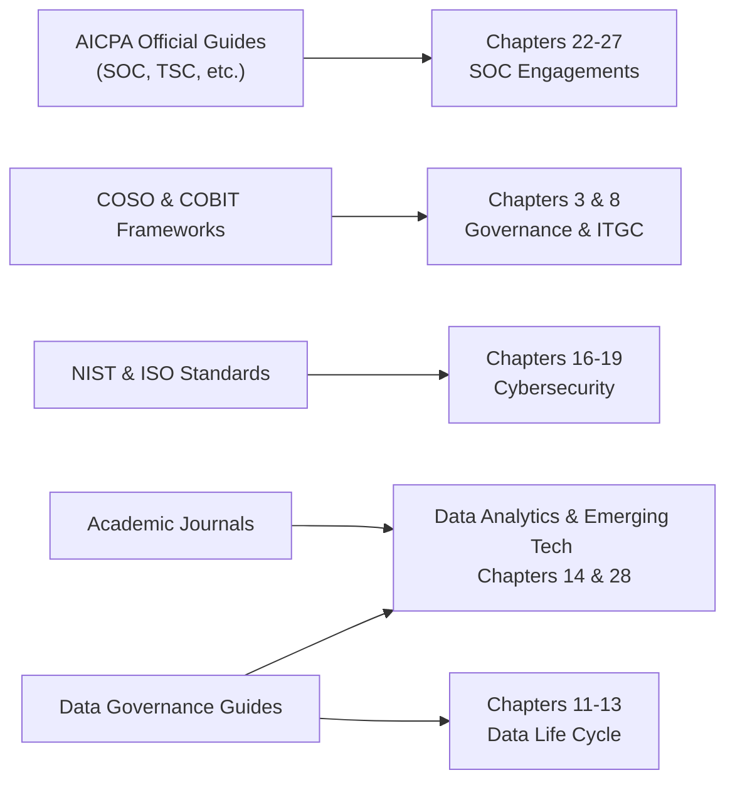

## 33.3 Additional Reading and Reference Resources

A solid understanding of Information Systems and Controls (ISC) requires familiarity with a range of authoritative references, from official standards to academic journals. These resources offer in-depth insight into specific subject areas—facilitating continual learning far beyond the foundational material presented in this guide. Whether you are a CPA candidate preparing for the Uniform CPA Examination or a seasoned practitioner seeking to expand your knowledge of new frameworks, this section provides a curated list of resources for further exploration.

Use the following references alongside the chapters in this guide to augment your grasp of critical concepts, frameworks, regulations, and best practices. Each category highlights notable publications, guides, and online materials that deepen your understanding of ISC. Be sure to consult the relevant chapters in Parts I through VI of this book for contextual discussions and foundational knowledge before diving into these materials.

  
### Authoritative Frameworks and Regulatory Guidance

• COSO (Committee of Sponsoring Organizations of the Treadway Commission)  
  – Internal Control – Integrated Framework (2013)  
  – Enterprise Risk Management (ERM) Framework: Integrating with Strategy and Performance (Updated 2017)  
  These serve as foundational resources in Chapters 3 and 16 of this guide. They cover internal control and risk management principles that underpin modern IT governance.

• COBIT 2019 Framework by ISACA  
  COBIT 2019 is extensively discussed in Chapter 3, but additional official ISACA publications provide deeper insights into governance, management objectives, and implementation case studies. Visit ISACA’s documentation library for add-on guides addressing specific domains like DevOps, cloud security, and emerging technologies.

• NIST Special Publications (SP) Series  
  The National Institute of Standards and Technology (NIST) issues a series of Special Publications (e.g., 800-53, 800-37, 800-171) detailing security controls, risk management frameworks, and data protection guidelines. These are pivotal in Chapters 16 through 19 for cybersecurity, data confidentiality, and privacy measures.

• ISO/IEC 27000 Series  
  For deeper insights into information security management systems (ISMS), the ISO/IEC 27000 family covers various aspects of IT security. Chapter 17 references important guidelines for secure network management, while Chapter 19 references data confidentiality initiatives.

• HIPAA, GDPR, PCI DSS, and Other Regulatory Texts  
  – HIPAA: Health Insurance Portability and Accountability Act  
  – GDPR: General Data Protection Regulation  
  – PCI DSS: Payment Card Industry Data Security Standard  
  These regulations are examined in Chapter 3 (Overview of Other Influential Standards) and Chapter 19 (Privacy Laws and Rules). Official websites (e.g., https://gdpr.eu/ and https://www.hhs.gov/hipaa/index.html) offer the complete text and regular updates.

  
### AICPA Resources

• AICPA Professional Standards  
  The main repository of attestation and auditing standards is essential for clarifying requirements in IT audits, SOC examinations, and other attestation engagements. Chapter 4 on IT Audit Assurance and Chapters 22 through 27 on SOC engagements benefit significantly from direct reference to these standards.

• AICPA Trust Services Criteria (TSC)  
  These are crucial for SOC 2® and SOC for Cybersecurity engagements (discussed extensively in Chapters 24 and 27). The AICPA provides explanatory materials and illustrative examples that delve deeper into implementation guidelines.

• AICPA Audit & Accounting Guidelines  
  A range of guidelines center on emerging issues at the intersection of IT, audit, and assurance (e.g., blockchain, data analytics). Checking the AICPA store or library can reveal the most recent releases addressing technology innovations relevant to CPAs.

• AICPA’s IT Audit School and CPE Courses  
  For those needing a structured learning format, official CPE training materials and webinars from the AICPA can be pivotal in supplementing the theoretical knowledge gained from this guide with real-world scenarios and case studies.

  
### ISACA Publications and Certifications

• ISACA Journal  
  Each issue offers articles on governance, risk management, cybersecurity, IT audit, and innovation. Refer to the editorial archives for advanced discussions on topics such as DevOps, cloud governance, and zero-trust implementations (cross-reference with Chapter 16 and 29).

• Certification Manuals (CISA, CRISC, CISM)  
  For those pursuing additional credentials in IT auditing and risk management, the official study guides for Certified Information Systems Auditor (CISA), Certified in Risk and Information Systems Control (CRISC), and Certified Information Security Manager (CISM) expand on the subjects introduced in Chapters 4, 8, and 16–21.

  
### Academic Journals and Industry Publications

• The Journal of Information Systems (JIS), published by the American Accounting Association (AAA)  
  JIS frequently includes studies focusing on the intersection of accounting, auditing, and information systems—reinforcing many concepts from Chapters 4 (IT Audit Methodologies) and 14 (Data Integration and Analytics).

• MIS Quarterly, IEEE Security & Privacy, and ACM Computing Surveys  
  These well-respected publications feature peer-reviewed papers on information systems management, cybersecurity threats, network architecture, and technology trends. Consider searching for specific articles that tie to topics from Part IV (Security, Confidentiality, and Privacy) and Part V (SOC Engagements).

• Gartner and Forrester Research Reports  
  While not strictly academic, these industry analyses offer strategic perspectives, market trends, and best practices for technology adoption, risk management, and cloud computing—complementing Chapters 5 (IT Infrastructure) and 29 (Cloud Computing Governance).

  
### Data Management, Analytics, and Emerging Technologies

• Data Management Association (DAMA) Body of Knowledge (DMBOK)  
  The DMBOK provides a framework for data governance, quality, architecture, and more—resources linked to concepts from Chapters 11–15 on data life cycle and analytics.

• The Cloud Security Alliance (CSA)  
  CSA publishes extensive guidance on cloud governance, such as the Cloud Controls Matrix (CCM) and other best practices. These support Chapter 29’s exploration of multi-cloud and hybrid environments, as well as continuous auditing in cloud contexts.

• AI and Machine Learning  
  – Gartner’s "Artificial Intelligence and Machine Learning Development Strategies"  
  – McKinsey’s "AI in Finance" white papers  
  – Various academic works referencing advanced ML algorithms  
  These publications provide a deep dive into the evolving role of AI, covered in Chapter 14 (Predictive Analytics and Machine Learning) and Chapter 28 (AI Governance).

• IoT and 5G Security  
  – GSMA "IoT Security Guidelines"  
  – ENISA (European Union Agency for Cybersecurity) "IoT Threat Landscape"  
  These address risks and controls for Internet of Things deployments, supporting Chapter 28’s coverage of IoT and 5G technologies.

  
### SOC Engagements and Assurance Services

• SOC 1®, SOC 2®, SOC 3®, and SOC for Cybersecurity Guides  
  The AICPA publishes detailed examination guides for planning, performing, and reporting on SOC 1®, SOC 2®, and SOC for Cybersecurity engagements (detailed in Chapters 22–27). Download these from the AICPA website for official criteria, illustrative examples, and sample opinions.

• "Guide: Reporting on an Entity’s Cybersecurity Risk Management Program and Controls"  
  This guide aligns with Chapter 27, which focuses on cybersecurity reporting. It contains in-depth methodology and sample narratives that help shape external communications about cybersecurity posture.

• Journal of Accountancy Articles on SOC Examinations  
  Articles highlighting challenges, best practices, and real-world lessons gleaned from practitioners can deepen your practical comprehension of SOC engagements.

  
### Governance, Risk, and Compliance (GRC) Tools and Platforms

• ISACA GRC Conferences and Workshops  
  Conferences and workshops are invaluable for connecting theoretical knowledge from COBIT or COSO frameworks with practical GRC implementations. They often showcase vendor offerings for risk assessment, compliance tracking, and real-time monitoring (tied to Chapters 3, 7, and 25).

• Open Web Application Security Project (OWASP)  
  Although more technical, OWASP materials (e.g., the OWASP Top 10) are an important reference for evaluating web application risks, synergy with Chapter 17 (Network Management) and 21 (Testing Security Controls).

• NIST Cybersecurity Framework Implementation Tiers  
  While the main content is in NIST SP 800 series, specialized guidelines on improving critical infrastructure cybersecurity can guide GRC strategies for both public and private sectors.

  
### Books, Case Studies, and White Papers

• "IT Auditing and Application Controls for Small and Mid-Sized Enterprises" by Jason Wood and William Brown  
  Offers practice-based examples that correlate with Chapters 4, 7, and 8 regarding IT general controls and audit methodologies.

• "Executive’s Guide to IT Governance" by Robert R. Moeller  
  Delves deeper into structuring IT governance programs, complementing the high-level coverage of governance principles in Part I (Foundational Concepts and Professional Context) and Part II (IS Architecture and Processes).

• "Cyber Risk Survival Guide" by Dominic MacDonald  
  Features real-world case studies on data breaches and resilience strategies. The book parallels the content in Chapters 16, 20, and 29, focusing on practical steps for managing cybersecurity incidents.

• Vendor White Papers  
  Look for reputable companies (i.e., Big Four firms, major software organizations) that publish white papers on niche IT audit topics, such as continuous monitoring, advanced analytics, or blockchain audits. These add unique perspectives to the foundational knowledge covered in Chapters 6, 14, and 28.

  
### Integrating References: Conceptual Overview

Below is a short Mermaid diagram illustrating how these references connect with major parts of the ISC framework:

• AICPA Official Guides (SOC, TSC, etc.) connect to SOC engagement chapters.  
• COSO & COBIT frameworks provide governance and control foundations.  
• NIST & ISO cybersecurity guidelines align with the security, confidentiality, and privacy sections.  
• Academic journals and data governance guides aid deeper understanding of data analytics, big data, and emerging tech.  

By leveraging these external resources, your learning extends well beyond the pages of this book, ensuring you remain current with rapidly changing regulations, technology innovations, and industry best practices.

  
## Quiz on Additional Reading and Reference Resources



### Which of the following resources is considered a primary reference for SOC 2® engagements?

- [ ] COBIT 2019 by ISACA
- [x] AICPA Trust Services Criteria (TSC)
- [ ] NIST SP 800-171
- [ ] GDPR official text

> **Explanation:** The AICPA’s Trust Services Criteria are core to SOC 2® engagements, defining relevant security, availability, processing integrity, confidentiality, and privacy criteria.

### Which publication would be most useful in understanding the implementation of enterprise-wide risk management in digital environments?

- [ ] ISO/IEC 27000 White Papers
- [x] COSO Enterprise Risk Management (ERM) Framework
- [ ] HIPAA Security Rule
- [ ] OWASP Top 10

> **Explanation:** The COSO ERM Framework provides an overarching methodology for managing risk at an enterprise level, encompassing both financial and IT aspects.

### For in-depth guidance on creating a robust information security management system (ISMS), which ISO series is most pertinent?

- [ ] ISO/IEC 22301
- [x] ISO/IEC 27000 series
- [ ] ISO/IEC 31000
- [ ] ISO/IEC 9001

> **Explanation:** The ISO/IEC 27000 series is dedicated specifically to information security management systems, offering guidelines for implementing, maintaining, and continually improving ISMS.

### What type of research material might you find in MIS Quarterly that can deepen your scholarly knowledge of information systems?

- [ ] Simplified regulatory checklists
- [x] Peer-reviewed academic studies on IT systems management
- [ ] Informal Q&A forums
- [ ] Marketing brochures

> **Explanation:** MIS Quarterly is an academic, peer-reviewed journal focusing on research findings, theories, and significant studies in the field of management information systems.

### Which resource is designed specifically for risk management in cloud environments?

- [x] Cloud Security Alliance (CSA) Publications
- [ ] COSO Internal Control – Integrated Framework
- [ ] PCAOB Audit Standards
- [ ] HIPAA Privacy Rule

> **Explanation:** The Cloud Security Alliance (CSA) provides frameworks and controls specific to cloud computing, including the Cloud Controls Matrix (CCM) and best practices for public, private, and hybrid clouds.

### Where would you look to find official, authoritative guidance on auditing standards for IT-related attestation engagements?

- [ ] Gartner Reports
- [ ] OWASP Guidelines
- [x] AICPA Professional Standards
- [ ] ISO/IEC 9001

> **Explanation:** AICPA Professional Standards include all official auditing and attestation standards used by practitioners, including guidance for IT-related engagements and SOC examinations.

### NIST Special Publication 800-53 specifically addresses:

- [x] Security and privacy controls for federal information systems
- [ ] Requirements for HIPAA compliance
- [ ] General data protection for consumers
- [ ] EU cross-border data transfer guidelines

> **Explanation:** NIST SP 800-53 catalogues security and privacy controls for federal information systems and organizations but is also widely used by private and non-government sectors as a benchmark.

### Which publication series is best known for zero-trust, defense-in-depth, and advanced cybersecurity approaches?

- [ ] COBIT 2019
- [ ] PCAOB Staff Audit Practice Alerts
- [x] NIST Special Publications (SP) on Cybersecurity
- [ ] IFRS Foundation Guides

> **Explanation:** NIST Special Publications, such as SP 800-207, provide pivotal guidance on zero-trust architectures and advanced approaches to cybersecurity.

### If you want to learn more about practical IT governance implementation beyond the theoretical frameworks, you should read:

- [ ] Official IFRS Summaries
- [ ] OWASP Top 10
- [x] Robert R. Moeller’s “Executive’s Guide to IT Governance”
- [ ] AICPA Code of Professional Conduct

> **Explanation:** Moeller’s "Executive’s Guide to IT Governance" offers real-world leadership insights and applications that go beyond an exclusively theoretical approach.

### A reason to explore journal articles in the ISACA Journal includes:

- [x] In-depth case studies and analyses relating to practical IT auditing challenges
- [ ] Summaries of IFRS compliance
- [ ] Strictly academic statistical analyses with no real-world application
- [ ] Legal precedents for consumer privacy lawsuits

> **Explanation:** The ISACA Journal contains practitioner-focused articles, case studies, and best practices on IT governance, auditing, risk management, and security.



## For Additional Practice and Deeper Preparation

### [Information Systems and Controls (ISC)](https://www.udemy.com/course/isc-cpa-mock-exams/?referralCode=E1217303222935C5E464)

Information Systems and Controls (ISC) CPA Mocks: 6 Full (1,500 Qs), Harder Than Real! In-Depth & Clear. Crush With Confidence!

• Tackle full-length mock exams designed to mirror real ISC questions.  
• Refine your exam-day strategies with detailed, step-by-step solutions for every scenario.  
• Explore in-depth rationales that reinforce higher-level concepts, giving you an edge on test day.  
• Boost confidence and minimize anxiety by mastering every corner of the ISC blueprint.  
• Perfect for those seeking exceptionally hard mocks and real-world readiness.

_Disclaimer: This course is not endorsed by or affiliated with the AICPA, NASBA, or any official CPA Examination authority. All content is for educational and preparatory purposes only._
