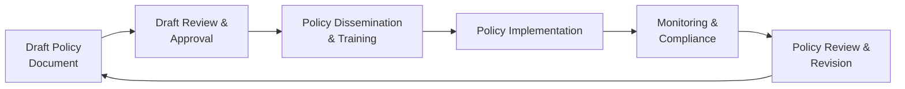

## 34.1 Sample IT Policies and Procedures

Information technology (IT) policies and procedures form the backbone of an organization’s internal controls environment. Well-structured and clearly documented guidelines not only demonstrate compliance with relevant standards (e.g., AICPA professional standards, COSO Internal Control – Integrated Framework, COBIT 2019) but also help align day-to-day technology operations with overarching strategic objectives. This section presents generic policy templates suitable for various information systems and controls domains commonly referenced throughout this Guide (see Chapters 8, 16, and 19 for deeper theoretical context). Each sample policy includes placeholders, enabling you to customize it to your particular organizational setting, industry certification requirements, and regulatory environment.

Organizations often develop additional supporting procedures to operationalize each policy. It is recommended to review and adapt the sample documents in collaboration with key stakeholders, such as IT leadership, the information security team, compliance officers, legal counsel, and auditors. Aligning policy content with your entity’s existing governance structure and risk appetite ensures that the resulting documents are truly “fit for purpose,” delivering value and promoting consistent behavior across the enterprise.

Below, you will find:

• An overview of critical considerations for developing IT policies.  
• A sample lifecycle diagram illustrating policy creation, approval, dissemination, and revision.  
• Example templates focusing on areas such as Acceptable Use, Change Management, and Data Protection.  
• Practical case studies and best practices.  
• A quiz to test your understanding of policy components and implementation strategies.

Use these resources as a foundation for building or enhancing your IT control environment.  

## Key Considerations for Developing IT Policies

Clear, concise, and comprehensive IT policies minimize ambiguity and encourage consistent application. When drafting new policies or revisiting existing ones, consider the following elements:

• Purpose and Scope: Define the overarching goal of the policy (e.g., protecting data confidentiality) and indicate whom it applies to, such as employees, contractors, or external vendors.  
• Alignment with Governance Frameworks: Reference frameworks such as COSO (see Chapter 3.1) or COBIT 2019 (Chapter 3.3) to ensure your policies address relevant control categories, risk domains, and industry best practices.  
• Compliance Requirements: Identify applicable laws, regulations, and standards (e.g., PCI DSS, HIPAA, GDPR, SOC 2® Trust Services Criteria) so that the policy meets these obligations.  
• Roles and Responsibilities: Clarify who owns, enforces, and periodically reviews the policy. Include details on training requirements for employees.  
• Reporting and Escalation: Specify the process for reporting policy violations, along with an escalation matrix for critical incidents.  
• Monitoring and Review Cycle: Indicate how often the policy will be reviewed and updated, and by which committees or stakeholders.

## Typical Policy Lifecycle

The following diagram illustrates a generic lifecycle for establishing, maintaining, and revising IT policies. Adjust steps as needed to reflect your organization’s governance process, maturity, and resource availability.

• Draft Policy Document: The policy owner (e.g., IT manager, CISO, compliance lead) compiles a new or revised policy draft.  
• Draft Review & Approval: Stakeholders provide feedback, ensuring alignment with risk appetite and compliance requirements.  
• Policy Dissemination & Training: The approved policy is communicated to all impacted individuals, supported by relevant training sessions.  
• Policy Implementation: IT and business teams operationalize the policy through well-defined processes and procedures.  
• Monitoring & Compliance: Audits and routine checks verify consistent adherence to policy mandates.  
• Policy Review & Revision: Based on feedback, lessons learned, and regulatory changes, revise the policy to maintain effectiveness.

## Policy Template Elements

Although each organization will customize language and structure, many policies share common sections and attributes. The table below summarizes typical headings and their purpose.

| Section                 | Description                                                                                                                       |
|-------------------------|-----------------------------------------------------------------------------------------------------------------------------------|
| Policy Title            | Clearly indicates the subject (e.g., “Data Protection Policy,” “Acceptable Use Policy”).                                          |
| Version and Approval    | Tracks revision history, approval date, and signatories (e.g., CIO, CFO, board members).                                         |
| Purpose and Scope       | Explains the rationale behind the policy and the business areas or functions it covers.                                          |
| Roles and Responsibilities | Defines who is responsible for implementing, monitoring, and periodically reviewing the policy.                                |
| Policy Statements       | Provides the core directives and rules persons must abide by, including references to relevant standards or regulations.         |
| Procedures             | Describes steps to implement policy requirements.                                                                                 |
| Monitoring and Continuous Improvement | Outlines how compliance will be assessed and what triggers a policy update.                                       |
| Exceptions and Violations  | Clarifies the process for requesting exceptions and the consequences for non-compliance.                                      |
| References             | Lists frameworks, regulations, or internal documents that support or influence the policy.                                        |
| Contact Information     | Names a point of contact for questions or clarifications related to the policy.                                                 |

## Sample Generic Policy Template

Below is a comprehensive sample template. For brevity, many sections are labeled with placeholders (e.g., <ORGANIZATION NAME>, <POLICY OWNER>) so you may adapt to your specific context.

---

POLICY: <POLICY TITLE>  
VERSION: <VERSION NUMBER>  

APPROVED BY: <NAME & TITLE>  
EFFECTIVE DATE: <EFFECTIVE DATE>  
NEXT REVIEW DATE: <REVIEW DATE>  

Purpose and Scope:  
• This policy aims to <DESCRIBE POLICY PURPOSE>.  
• It applies to <IN-SCOPE DEPARTMENTS/PERSONNEL/SYSTEMS>.  

Roles and Responsibilities:  
• <POLICY OWNER>: Oversees policy creation, distribution, and periodic review.  
• <DEPARTMENTS/INDIVIDUALS>: Implements requirements outlined in the policy, monitors compliance, and addresses violations.  

Policy Statements:  
1. <INCLUDE CORE REQUIREMENTS>  
2. <INCLUDE ADDITIONAL REQUIREMENTS>  
3. <INCLUDE ANY RELEVANT STANDARDS/REGULATIONS>  

Procedures:  
• <DETAIL OPERATIONAL STEPS TO ACHIEVE COMPLIANCE WITH POLICY STATEMENTS>  
• <MIGHT INCLUDE FLOWCHARTS OR RACI MATRIX TO EXPLAIN WORKFLOWS>  

Monitoring and Continuous Improvement:  
• <STATE HOW THE ORGANIZATION WILL AUDIT, MONITOR, OR ASSESS POLICY COMPLIANCE>  
• <OUTLINE FREQUENCY OF FORMAL REVIEWS>  

Exceptions and Violations:  
• Exceptions to any part of this policy must be requested in writing and approved by <DESIGNATED AUTHORITY>.  
• Violations of this policy may result in <SPECIFY CONSEQUENCES/ESCALATION>, up to and including termination.  

References:  
• <LIST RELATED DOCUMENTS, FRAMEWORKS, OR GUIDANCE>  

Contact Information:  
• Any questions regarding this policy should be directed to <NAME/EMAIL/TEAM>.  

---

## Sample Policies and Procedures

Below are example policies and procedures, each aligned to common IT governance areas. Adapt these as needed for your organization’s particular needs.

### Acceptable Use Policy

Purpose and Scope  
• Clearly defines what constitutes acceptable use of organization-owned devices, networks, and data.  
• Applies to all employees, contractors, and third-party vendors who access <ORGANIZATION NAME> systems.

Policy Statements  
• Organization assets are to be used primarily for business-related tasks. Occasional personal use is permissible if it does not interfere with business operations or violate any law/regulation.  
• Explicitly prohibited behaviors include using corporate email to harass others, downloading illegal software, or posting confidential information on social media.  
• Internet browsing is monitored for security risks, policy violations, and bandwidth usage.  

Procedures  
• Stakeholders must complete Acceptable Use Training before being granted user credentials (see Chapter 18 on Authentication and Access Management).  
• If employees suspect a violation, they must report it to the IT Helpdesk or Security Officer within <TIMEFRAME>.  

Monitoring  
• Automated logs are generated for internet and email usage. Specific anomaly detection tools may run daily.  
• The Security Operations Center (SOC) creates quarterly use reports for the IT Steering Committee.  

### Data Protection Policy

Purpose and Scope  
• Ensures the confidentiality, integrity, and availability of data, whether at rest or in transit, aligning with frameworks in Chapter 19 (Data Confidentiality and Privacy Controls).  
• Covers all sensitive data stored, processed, or transmitted within <ORGANIZATION NAME> environments.

Policy Statements  
• All data must be classified in accordance with organizational standards (public, internal use, confidential, restricted).  
• Data encryption is mandatory when transmitting restricted information externally.  
• Access to data is granted on a least-privilege basis, consistent with user roles.  

Procedures  
• Periodically review data classification (see Chapter 11: Data Life Cycle and Governance).  
• Maintain and review encryption keys following <KEY MANAGEMENT STANDARD>.  
• Archive records and dispose of them securely at the end of their retention period.  

Monitoring  
• Internal auditors validate compliance during quarterly walkthroughs.  
• The data governance committee reviews classification levels annually.

### Patch Management Policy

Purpose and Scope  
• Sets guidelines for identifying, testing, and deploying patches or updates to IT systems to maintain security and reliability (see Chapter 10.3).  
• Applies to all servers, workstations, network devices, and software used within <ORGANIZATION NAME>.

Policy Statements  
• Critical patches must be deployed within <TIMEFRAME> of release, based on risk severity.  
• A documented fallback or rollback plan must exist for patches that introduce service instability.  

Procedures  
• IT Operations staff check vendor bulletins weekly and maintain a patch log.  
• Use designated test environments to validate patches before rollout to production.  
• Deploy validated patches according to the release schedule agreed upon by the Change Advisory Board (CAB) (see Chapter 10 on IT Change Management).  

Monitoring  
• The patch management dashboard captures patch levels across all systems, generating weekly compliance reports.  
• Any out-of-compliance systems with critical vulnerabilities are escalated to senior management promptly.

### Disaster Recovery (DR) Policy

Purpose and Scope  
• Outlines the approach for preparing, responding to, and recovering from major disruptions, referencing Chapter 9 (System Availability and Business Continuity).  
• Includes all business-critical applications, infrastructure, and data centers under <ORGANIZATION NAME>’s control.

Policy Statements  
• A Business Impact Analysis (BIA) must be conducted annually to identify recovery priorities and define Recovery Time Objectives (RTOs) and Recovery Point Objectives (RPOs).  
• Offsite backups or replicated environments must be regularly tested to confirm restore capabilities.  

Procedures  
• The DR coordinator oversees the schedule for DR testing and documentation updates.  
• Detailed DR playbooks are to be maintained for each critical service, including contact lists, checklists, and escalation protocols.  

Monitoring  
• Each DR test is evaluated for success criteria. Findings are captured in a post-mortem report and used to refine the DR plan.  
• The board or executive committee reviews readiness multiple times per year.

### Change Management Policy

Purpose and Scope  
• Establishes a standardized methodology for requesting, evaluating, and implementing changes to IT systems, referencing Chapter 10 (IT Change Management).  
• Governs changes in production environments, test environments, or network configurations.

Policy Statements  
• All proposed changes require a formal Request for Change (RFC), specifying the reason for change, potential risk, and back-out plan.  
• The Change Advisory Board (CAB) reviews high-risk or major changes; routine changes proceed via an expedited process if risk is minimal.  

Procedures  
• Submit an RFC in the centralized change management system at least <X DAYS> before the planned deployment date.  
• The assigned change manager coordinates testing in the QA environment.  
• Post-implementation reviews occur for major changes, verifying they meet intended objectives without causing unintended disruptions.

Monitoring  
• CAB meeting minutes capture approvals, rejections, or deferrals.  
• Internal audit performs periodic sampling of changes to confirm alignment with risk policies.

### IT Security/Access Management Policy

Purpose and Scope  
• Guides the creation, maintenance, and revocation of access rights for systems and data, referencing Chapter 18 (Authentication and Access Management).  
• Applies to all user accounts, privileged and regular, and all environments where <ORGANIZATION NAME> data resides.

Policy Statements  
• Privileged accounts (e.g., administrators) must be periodically reviewed and monitored with heightened security measures.  
• Passwords and other authentication factors must comply with the complexity and rotation guidelines.  
• Terminated or transferred employees have access removed or updated within <X HOURS> of the change in employment status.  

Procedures  
• Access requests must be approved by the authorized manager or system owner.  
• Retain logs of access provisioning actions in a centralized Identity and Access Management (IAM) tool.  

Monitoring  
• Audits of user access controls are conducted semi-annually to verify least-privilege compliance and timely account revocations.  
• Automated tools generate alerts for anomalous login attempts.

## Case Study: Mid-Sized Financial Institution

A mid-sized financial institution introduced an updated Acceptable Use Policy to address a rising number of cybersecurity incidents related to unauthorized software downloads. The policy mandated that employees only install software from an approved list in the corporate IT repository. To ensure compliance, the IT department used an automated endpoint management system that quarantined or removed unauthorized installations. Monitoring logs revealed a 70% decrease in malware incidents within six months, demonstrating the policy’s effectiveness and reinforcing the need for continuous education and reminders about policy expectations.

## Best Practices and Pitfalls

• Best Practices:  
  – Keep policies concise and user-friendly. Employees are more likely to comply with readable, accessible documents.  
  – Regularly train staff and update relevant policies in response to new threats or technologies.  
  – Align policy language with broader strategic objectives and risk appetite.  

• Pitfalls:  
  – Overly complex policies can lead to confusion or non-compliance.  
  – Failure to secure executive-level sponsorship results in insufficient enforcement.  
  – Infrequent policy reviews create gaps, leaving the organization vulnerable to emerging risks.  

## Practical Tips for Implementation

• Engage Stakeholders Early: Solicit input from those affected by the policy to enhance buy-in and reduce resistance.  
• Use Realistic Timelines: Outline feasible target dates for policy rollout and any accompanying training.  
• Leverage Existing Frameworks: Reference COBIT 2019, COSO, or relevant ISO standards to align language and controls.  
• Document Exception Processes: It is inevitable that certain business needs will require deviations. Ensure the path to obtain and track exceptions is formally defined.  
• Automate Where Possible: Use centralized systems for access management, patching, and monitoring to reduce manual complexity.  
• Encourage Reporting: Develop a positive culture around self-reporting mistakes or near-misses, so the organization can proactively address weaknesses.

## References and Further Reading

• ISACA (2019). COBIT 2019 Framework: Governance and Management Objectives.  
• Committee of Sponsoring Organizations of the Treadway Commission (COSO). Internal Control – Integrated Framework.  
• AICPA. SOC 2® Trust Services Criteria.  
• National Institute of Standards and Technology (NIST). Special Publications on Information Security.  
• International Organization for Standardization (ISO). ISO/IEC 27001 on Information Security Management.  

These references offer guidance on how to implement and continuously improve your IT policies and procedures at scale.

## Test Your Knowledge of Sample IT Policies and Procedures



### Which of the following elements should be included in an IT policy template for clarity?

- [ ] Employee satisfaction rating
- [x] Purpose and scope
- [ ] Analytics on social media use
- [ ] Historical system uptime statistics

> **Explanation:** An effective IT policy template usually emphasizes purpose and scope, roles and responsibilities, policy statements, procedures, and references or related documents.

### What is the primary reason for requiring a formal Request for Change (RFC) in a Change Management Policy?

- [x] It ensures that all relevant risks, benefits, and back-out plans are documented before the change.
- [ ] It allows staff to make changes faster without approvals.
- [ ] It replaces the need for testing in a QA environment.
- [ ] It automatically grants emergency privileges to all employees.

> **Explanation:** An RFC documents the planned change, potential impacts, and fallback approaches. This process ensures that each change is properly assessed and managed, reducing the likelihood of adverse effects and downtime.

### Which area does an Acceptable Use Policy typically cover?

- [x] Guidelines for how employees can use corporate networks and devices
- [ ] Strategies for user-interface design
- [ ] Corporate tax handling procedures
- [ ] Facility expansion plans

> **Explanation:** An Acceptable Use Policy focuses on setting boundaries regarding how employees and other authorized users can utilize organizational IT resources to protect the organization and maintain productivity.

### How often should a Disaster Recovery Policy recommend testing backup restoration?

- [x] It depends on business criticality, but ideally at least annually or semi-annually for critical data.
- [ ] Every five years
- [ ] Only upon undergoing a full system upgrade
- [ ] Backup restoration should never be tested; it disrupts systems

> **Explanation:** Disaster Recovery testing is fundamental and must be performed at regular intervals, most commonly at least once a year, to validate preparedness and identify areas for improvement.

### Which one is a best practice when implementing new IT policies?

- [x] Involving employees and key stakeholders early in the drafting process
- [ ] Restricting feedback to executive leadership only
- [x] Aligning the policy with recognized frameworks or standards
- [ ] Making the policy as long as possible for completeness

> **Explanation:** Gathering insights from impacted teams and using authoritative references ensures policies are relevant, realistic, and aligned with established best practices.

### What is the recommended approach for exception management in an IT policy?

- [x] Define a clear process for requesting and approving policy exceptions
- [ ] Automatically terminate employees who request exceptions
- [ ] Include no exceptions, as policies must be universal
- [ ] Charge employees for any breach regardless of reason

> **Explanation:** Policies should define a formal process whereby exceptions can be requested and approved under specific conditions, ensuring proper governance and accountability.

### Which of the following tasks is typically part of the Monitoring phase in the Policy Lifecycle?

- [x] Conducting internal audits and compliance checks
- [ ] Drafting an initial version of the policy
- [x] Reviewing incident logs to detect violations
- [ ] Creating the policy scope statement

> **Explanation:** Monitoring includes ongoing compliance checks, audits, and incident log reviews to confirm that the policy operates effectively in practice. Drafting scope statements and finalizing language occur earlier in the lifecycle.

### In a Patch Management Policy, what is the recommended approach for deploying patches with high-risk severity?

- [x] Test the patches in a controlled environment before production deployment
- [ ] Deploy them directly in production to minimize delays
- [ ] Seek board approval for every low-risk patch
- [ ] Wait for confirmation from all employees before applying the patch

> **Explanation:** Testing high-risk or critical patches in a QA or staging environment helps identify potential conflicts or issues before rolling them out to production systems.

### A designated Change Advisory Board (CAB) is most relevant to which type of policy?

- [x] Change Management Policy
- [ ] Acceptable Use Policy
- [ ] Data Classification Policy
- [ ] Time-Off Policy

> **Explanation:** A CAB is a structured group that reviews and approves changes under an established Change Management Policy. Their role ensures that changes align with business objectives and risk tolerance.

### A correct statement regarding IT policy best practices is:

- [x] True
- [ ] False

> **Explanation:** IT policy best practices include periodic reviews, stakeholder engagement, alignment with frameworks, and clarity in roles and responsibilities. Maintaining effective documentation of training, approvals, and performance tracking is vital.



## For Additional Practice and Deeper Preparation

### [Information Systems and Controls (ISC)](https://www.udemy.com/course/isc-cpa-mock-exams/?referralCode=E1217303222935C5E464)

Information Systems and Controls (ISC) CPA Mocks: 6 Full (1,500 Qs), Harder Than Real! In-Depth & Clear. Crush With Confidence!

• Tackle full-length mock exams designed to mirror real ISC questions.  
• Refine your exam-day strategies with detailed, step-by-step solutions for every scenario.  
• Explore in-depth rationales that reinforce higher-level concepts, giving you an edge on test day.  
• Boost confidence and minimize anxiety by mastering every corner of the ISC blueprint.  
• Perfect for those seeking exceptionally hard mocks and real-world readiness.

_Disclaimer: This course is not endorsed by or affiliated with the AICPA, NASBA, or any official CPA Examination authority. All content is for educational and preparatory purposes only._
