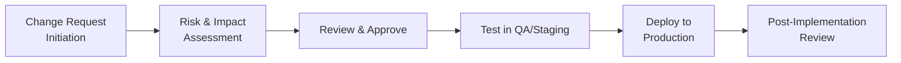
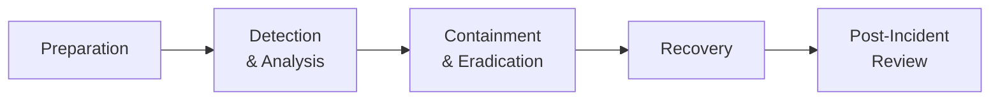

## 34.2 Generic Change Management and Incident Response Templates

A seamless approach to change management and incident response is the backbone of any robust IT environment, especially in accounting and finance contexts where data integrity and availability are paramount. This section provides generic, yet versatile, templates for creating or refining both change management and incident response procedures. We discuss key components, provide sample outlines, and illustrate how these templates promote better governance, alignment with industry frameworks (e.g., COSO, COBIT), and stronger internal controls.

In earlier chapters of this guide (e.g., Chapter 10: IT Change Management and Chapter 20: Incident Response and Recovery), we have covered conceptual and regulatory aspects that underscore the importance of systematic processes for handling organizational changes and IT incidents. Here, we focus on offering concrete documentation frameworks and outlines that practitioners can adapt to their specific financial or operational environments.

--------------------------------------------------------------------------------

### Why Formal Templates Matter

• Clarity and Consistency: Standardized change management and incident response documents reduce ambiguity, ensuring that all involved departments—accounting, IT, compliance—work from the same reference point.  
• Better Risk Management: Step-by-step outlines help teams properly assess potential risks, control potential vulnerabilities, and avoid common pitfalls.  
• Audit Readiness: CPA professionals rely heavily on documentation to support audit findings and compliance reviews. Standard procedures make it simpler to verify whether controls have been appropriately applied.  
• Cross-Team Collaboration: By having a unified template, communication gaps among IT staff, finance departments, executives, and auditors can be minimized, sparing costly mistakes and confusion.

--------------------------------------------------------------------------------

### Components of an Effective Change Management Process

Change management can involve software deployments, hardware upgrades, regulatory updates in accounting systems, and more. A well-structured process typically includes:

• Initiation & Justification: Identify the reason for the change, define its scope, and articulate the anticipated business value.  
• Risk Assessment: Determine the change’s potential impact on operations. This step also covers compliance, legal, security, and financial implications.  
• Approvals & Authorizations: Engage decision-makers (e.g., CFO, IT Governance Committee) to formally sign off on proposed modifications.  
• Testing & Validation: Execute controlled testing procedures in a development or quality assurance environment to validate workflows and ensure data integrity.  
• Implementation: Deploy the change in the production environment following approved procedures and timing.  
• Post-Implementation Review (PIR): Assess the change outcome, measure potential deviations, and document lessons learned for continual improvement.

Below is a sample flowchart illustrating a simplified change management workflow. This flow also demonstrates points where internal controls and audit trails should be embedded.

Each node in this flowchart represents a key step in the change management life cycle. The handoffs between steps (e.g., from testing to production) should be accompanied by relevant documentation, approvals, and audit trails.

--------------------------------------------------------------------------------

### Generic Change Management Template

Below is a high-level outline of a Change Management Template. Organizations can adapt and enhance it based on specific requirements, including regulatory factors like Sarbanes-Oxley (SOX), client-specific policies, or audit-related constraints.

1. Purpose and Scope  
   • Clearly define the objective of the policy (e.g., to ensure all system changes are authorized and properly planned).  
   • Identify the systems, departments, and processes in scope (e.g., ERP modules, accounting systems).

2. Roles and Responsibilities  
   • Document each role involved (Change Owner, Reviewer, Approver, IT Auditor).  
   • Outline each role’s specific tasks: submission of change requests, risk evaluation, final authorization.

3. Change Request Procedures  
   • Request Submission Form: Provide a standard form that includes fields such as:  
     – Requestor Name  
     – Date of Request  
     – Description of Change  
     – Business Justification  
     – Priority (High, Medium, Low)  
   • Example:

     Request Summary:  
     • Requestor: [Name, Department]  
     • Date: [MM/DD/YYYY]  
     • Description: [Details of required change, e.g., software patch, new reporting module]  
     • Business Reason: [Why the change is needed, impact on efficiency or compliance]  
     • Priority Level: [High/Medium/Low]  

4. Impact and Risk Assessment  
   • Template questions:  
     – Does the change affect financial data or reporting outcomes?  
     – Are there any dependencies on third-party applications (e.g., payroll or banking interfaces)?  
     – Could the change expose sensitive data or violate privacy regulations?  
   • Document potential mitigation strategies (backup plans, staging environment tests, encryption use).

5. Approvals and Authorizations  
   • Include signatures or electronic approvals from relevant stakeholders:  
     – Department Head (e.g., CFO)  
     – IT Security Officer for any security-related changes  
     – Internal Audit or Compliance Manager if required

6. Testing and Validation  
   • Outline test objectives, expected results, and acceptance criteria.  
   • Record test results, date, anomalies found, and remediation steps taken.

7. Implementation Schedule  
   • Identify the deployment window (e.g., after business hours to avoid disruptions).  
   • Assign a project manager or designated lead responsible for coordinating tasks, verifying system readiness, and capturing process logs.

8. Documentation and Communication  
   • Provide timely status updates to relevant teams.  
   • Keep records of test documents, approval emails, and other supportive data for audit trails.

9. Post-Implementation Review (PIR)  
   • Evaluate whether the change met its intended objectives.  
   • Document any lessons learned for future improvements.

10. Version Control and Archiving  
   • Finalize the date of closure for the change request and store it in a centralized repository.  
   • Keep all versions of the request form, risk assessment, test logs, and approvals in an audit-accessible format.

--------------------------------------------------------------------------------

### Example: Change Request for a New Financial Reporting Module

Below is a cohesive scenario illustrating how this template could be applied in a real-world accounting context:

1. Purpose: Implement a new reporting module in the organization’s ERP to comply with upcoming revenue recognition standards (ASC 606).  
2. Roles and Responsibilities:  
   • Requestor: Finance Manager, who identified the reporting requirement.  
   • IT Project Lead: Responsible for evaluating stability.  
   • Internal Auditor: Checks for regulatory alignment.  
3. Change Request Form Submission:  
   • Requestor: Jane Doe, Finance Dept.  
   • Date: 06/15/20XX  
   • Change Description: Adding a new module to capture contract-level revenue distribution.  
   • Business Reason: Ensure compliance with ASC 606, produce financial statements with the correct revenue allocations.  
   • Priority: High, with a compliance-driven timeline.  
4. Impact and Risk Assessment:  
   • Potential impact on current revenue recognition modules and third-party billing system.  
   • Additional memory/CPU resource usage forecast.  
   • Mitigation: Thorough testing in staging, plus updated user training guides.  
5. Approvals & Authorizations:  
   • Finance Director, CFO, and IT Security Officer sign off.  
6. Testing and Validation:  
   • Conducted in a cloned environment, verified new module data flows to the general ledger (GL) accurately.  
   • Testing passed on 07/01/20XX with minimal performance overhead.  
7. Implementation Schedule:  
   • Deployment planned for 07/15/20XX after 8 PM local time to minimize user interruptions.  
8. Documentation & Communication:  
   • IT Project Lead emails the CFO, summarizing test results and readiness.  
9. Post-Implementation Review:  
   • Conducted on 07/20/20XX, module functioned as expected, no significant issues reported.  
10. Version Control & Archiving:  
   • Change request closed on 07/20/20XX, stored in the central repository for future reference and audits.

--------------------------------------------------------------------------------

### Incident Response Essentials

Incident response (IR) focuses on managing emerging threats or disruptions in a structured, systematic way. A robust IR plan ensures:

• Rapid Containment: Minimizing damage by quickly isolating affected systems.  
• Evidence Preservation: Maintaining chain of custody for potential forensic investigations.  
• Root Cause Analysis: Identifying underlying vulnerabilities, ensuring they are rectified.  
• Communication: Quickly engaging relevant stakeholders (IT, finance, legal, compliance, and external authorities if required).  
• Recovery: Restoring normal operations swiftly while ensuring no malicious remnants remain.

--------------------------------------------------------------------------------

### Incident Response Lifecycle Diagram

Below is a simplified flowchart of an incident response lifecycle. Each stage emphasizes critical steps—record keeping, stakeholder involvement, and alignment with overarching risk management frameworks.

1. Preparation: Develop policies, training, and tools.  
2. Detection & Analysis: Identify incidents and evaluate severity.  
3. Containment & Eradication: Isolate systems to reduce impact; remove malicious elements.  
4. Recovery: Restore services, confirm integrity of data.  
5. Post-Incident Review: Document lessons, refine IR strategy.

--------------------------------------------------------------------------------

### Generic Incident Response Plan Template

Below is a recommended structure for an Incident Response Plan that integrates best practices from multiple frameworks, including NIST, COBIT, and COSO.

1. Purpose and Scope  
   • Specify the primary objective of the IR plan: preserving the confidentiality, integrity, and availability of corporate data.  
   • Delineate sections of the business (e.g., accounting systems, leadership communications) that the plan covers.

2. Incident Classification  
   • Crisp definitions of potential incidents: data breach, malware, system outage, unauthorized access attempts, suspicious transactions.  
   • Classification levels (Low, Moderate, High, Critical) with relevant examples (e.g., Low = single user locked out; Critical = large-scale data exfiltration).

3. Roles and Responsibilities  
   • Incident Coordinator: Manages the IR team, tasks, and overall communication.  
   • Forensic Specialist: Collects and preserves digital evidence.  
   • Legal/Compliance Officer: Manages regulatory disclosures.  
   • IT Security Team: Implements technical analysis and containment measures.  
   • Finance/Accounting Representatives: Evaluate financial impact and confirm the integrity of financial data or transactions.

4. Detection and Alert Mechanisms  
   • Early Warning Systems: Automated intrusion detection, accounting anomaly detection, and performance monitoring.  
   • Reporting Channels: A 24/7 hotline or dedicated email address (e.g., infosec@company.com).  
   • Triage Processes: Triage newly reported incidents to confirm legitimacy and define severity.

5. Containment Measures  
   • Removal of impacted systems from production networks.  
   • Temporary suspension of suspicious user accounts.  
   • Activation of backup systems to sustain critical operations (e.g., payroll).  
   • Communication plan for relevant stakeholders.

6. Investigation and Eradication  
   • Conduct forensic imaging and memory dumps if needed.  
   • Evaluate potential system vulnerabilities exploited (e.g., unpatched software).  
   • Remove malware, close unauthorized network entry points, reset credentials.

7. Recovery Steps  
   • Validate the integrity of backup data before restoration.  
   • Restore normal operations in a phased approach, prioritizing critical financial or inventory transactions.  
   • Confirm no malicious processes remain active.  
   • Coordinate retesting to confirm security posture.

8. Communication and Escalation Plan  
   • Templates for internal announcements and external notifications (e.g., regulatory agencies, business partners).  
   • Identify the chain of command for crisis communication, from IR team leads up to the Board of Directors.

9. Post-Incident Review (PIR)  
   • Conduct “lessons learned” meetings, including the IR team, finance, and executive sponsors.  
   • Determine if changes to security controls or policies are needed.  
   • Update the IR plan and training materials.

10. Documentation and Incident Closure  
   • Record detailed timelines, actions, and outcomes.  
   • Tag incident with a unique tracking number for reference in audits.  
   • Document final resolution, file the incident in a central repository.

--------------------------------------------------------------------------------

### Example: Handling a Malware Attack in an Accounting System

Consider a mid-size manufacturing company that detects unusual activity in its financial reporting application. Here’s how the generic IR plan might unfold:

1. Classification: Data breach or malware infiltration suspected. Labeled High priority.  
2. Roles and Responsibilities:  
   • Incident Coordinator: Oversees triage, instructs staff on immediate next steps.  
   • IT Security: Collects preliminary logs, identifies suspicious processes.  
   • Finance Manager: Checks for anomalies in invoice data.  
3. Detection: Automated endpoint protection alerts a suspicious executable.  
4. Containment:  
   • System is immediately taken offline.  
   • Suspicious processes are quarantined.  
   • Affected user accounts are disabled for investigation.  
5. Investigation & Eradication:  
   • Tools used: Anti-malware suite, external forensics consultant.  
   • Confirmed an unpatched reporting plugin was exploited.  
   • Malicious code removed, plugin updated.  
6. Recovery:  
   • Validate backups to ensure data from the last 24 hours can be restored.  
   • System brought online once scanning confirms environment is clean.  
7. Post-Incident Review:  
   • CFO and IT leads determine a formal patch management policy was lacking.  
   • Additional staff training mandated.  
   • Documentation updated to prevent future infeasible downtime scenarios.  
8. Closure:  
   • IR summary documented.  
   • Final artifacts (logs, timetables, root cause analysis) archived.

--------------------------------------------------------------------------------

### Best Practices and Common Pitfalls

• Align With Frameworks: Whether adopting COBIT 2019 or COSO standards, ensure your change management and incident response templates reflect core principles like segregation of duties, monitoring, and continuous improvement.  
• Frequent Updates: IT landscapes and threats evolve quickly. Regularly review your templates for relevance and compliance with changing regulations (e.g., HIPAA, GDPR).  
• Testing and Simulation: Conduct tabletop exercises or live drills to build familiarity and reduce confusion when real incidents occur.  
• Oversight and Governance: Engage senior leadership to champion the importance of well-managed changes and quick, effective incident response.  
• Documentation Gaps: A common pitfall is incomplete documentation. Thoroughly logging each step is crucial for audits, as well as for reinforcing accountability and lessons learned.

--------------------------------------------------------------------------------

### References for Further Study

• National Institute of Standards and Technology (NIST) Special Publications, particularly SP 800-61 on Computer Security Incident Handling.  
• ISACA’s COBIT 2019 publications on governance and management objectives.  
• AICPA Information Systems and Controls (ISC) Guidelines for clarity on auditor responsibilities.  
• Books and Articles:  
  – “IT Auditing and Application Controls for Small and Mid-Sized Enterprises” by Jason Wood  
  – “Audit and Control of Information Systems” by Mary M. Tan  
• Online Courses:  
  – Incident Response and Handling from SANS Institute.  
  – AICPA webcasts on data security and IT governance.

--------------------------------------------------------------------------------

## Check Your Knowledge: Change Management and Incident Response



### Which step of the change management process typically involves verifying that the change achieved its intended objectives and documenting lessons learned?

- [ ] Impact Assessment
- [ ] Risk Analysis
- [ ] Implementation
- [x] Post-Implementation Review

> **Explanation:** The Post-Implementation Review (PIR) is performed after the change is deployed, ensuring it worked as intended and capturing any insights to refine future processes.

### Which element of an Incident Response (IR) plan focuses on preserving digital evidence for potential criminal or legal proceedings?

- [ ] Containment
- [x] Forensic Investigation
- [ ] Restoration
- [ ] Triage

> **Explanation:** Collecting and preserving evidence, often managed by a forensic specialist, is critical for legal and regulatory compliance if the incident is severe.

### In a typical change management workflow, which environment is used to validate that a change functions correctly before deploying to production?

- [ ] Production
- [x] Quality Assurance (QA) or Staging
- [ ] Sandbox exclusively used by external auditors
- [ ] End-user workstations

> **Explanation:** A QA or staging environment is used to test changes in an isolated setting. This step minimizes risks of introducing disruptions or vulnerabilities into production.

### Which of the following represents a critical goal of the “Containment” phase in an incident response context?

- [x] Isolate affected systems to prevent further damage
- [ ] Implement software upgrades across all servers
- [ ] Document payroll and inventory changes
- [ ] Perform year-end financial analysis

> **Explanation:** Containment focuses on halting the spread or impact of an ongoing incident. This may involve disconnecting infected devices or disabling user accounts.

### In preparing a Change Request, which piece of information is typically considered mandatory for risk assessment?

- [x] Business justification for the change
- [ ] Vendor’s stock ticker symbol
- [x] Potential impact on financial statements
- [ ] Number of employees on staff

> **Explanation:** A proper change request includes the rationale (business justification) and evaluates how the change might affect compliance or financial outcomes.

### What is the primary disadvantage if the Post-Implementation Review (PIR) is skipped in a major change project?

- [x] Loss of insights for continuous improvement
- [ ] No immediate effect on the user interface
- [ ] Reduced developer job satisfaction
- [ ] An inability to patch any software modules

> **Explanation:** The PIR helps capture lessons learned, evaluate what went well, and determine areas for improvement. Without it, the organization misses a valuable learning opportunity.

### During an incident investigation, who is generally responsible for ensuring that all digital evidence meets legal admissibility requirements?

- [x] Forensic Specialist
- [ ] CFO
- [x] Legal/Compliance Officer
- [ ] ERP Administrator

> **Explanation:** Both the Forensic Specialist and the Legal/Compliance Officer often share responsibility, ensuring the chain of custody is documented and evidence is collected correctly.

### Which of the following best describes a key milestone in the “Recovery” phase of the Incident Response cycle?

- [x] Restoration of impacted systems from clean backups
- [ ] Tracking sub-service organizations
- [ ] Decommissioning the entire architecture
- [ ] Documenting all test scripts in a QA environment

> **Explanation:** Recovery aims to return systems to normal operation. Restoring from verified clean backups is critical to ensure a safe recovery environment.

### In a well-governed organization, which function or department often provides final sign-off to complete large-scale changes in financial systems?

- [x] Senior Management or an Executive Committee
- [ ] Junior Developers
- [ ] External Data Processors
- [ ] End-users in the Marketing Department

> **Explanation:** Major financial system changes typically require approval from senior or executive leadership, ensuring alignment with organizational strategy and risk tolerance.

### A Post-Incident Review (PIR) aims to:

- [x] Examine root causes, gather lessons learned, and improve future incident handling
- [ ] Increase the length of patch management cycles
- [ ] Eliminate the need for user acceptance testing
- [ ] Terminate user accounts flagged for suspicious activity

> **Explanation:** After an incident is resolved, a PIR probes what triggered it, how response measures performed, and what adjustments are necessary for future resilience.



--------------------------------------------------------------------------------

## For Additional Practice and Deeper Preparation

### [Information Systems and Controls (ISC)](https://www.udemy.com/course/isc-cpa-mock-exams/?referralCode=E1217303222935C5E464)

**Information Systems and Controls (ISC) CPA Mocks:** 6 Full (1,500 Qs), Harder Than Real! In-Depth & Clear. Crush With Confidence!

- Tackle full-length mock exams designed to mirror real ISC questions.  
- Refine your exam-day strategies with detailed, step-by-step solutions for every scenario.  
- Explore in-depth rationales that reinforce higher-level concepts, giving you an edge on test day.  
- Boost confidence and minimize anxiety by mastering every corner of the ISC blueprint.  
- Perfect for those seeking exceptionally hard mocks and real-world readiness.  

_Disclaimer: This course is not endorsed by or affiliated with the AICPA, NASBA, or any official CPA Examination authority. All content is for educational and preparatory purposes only._
