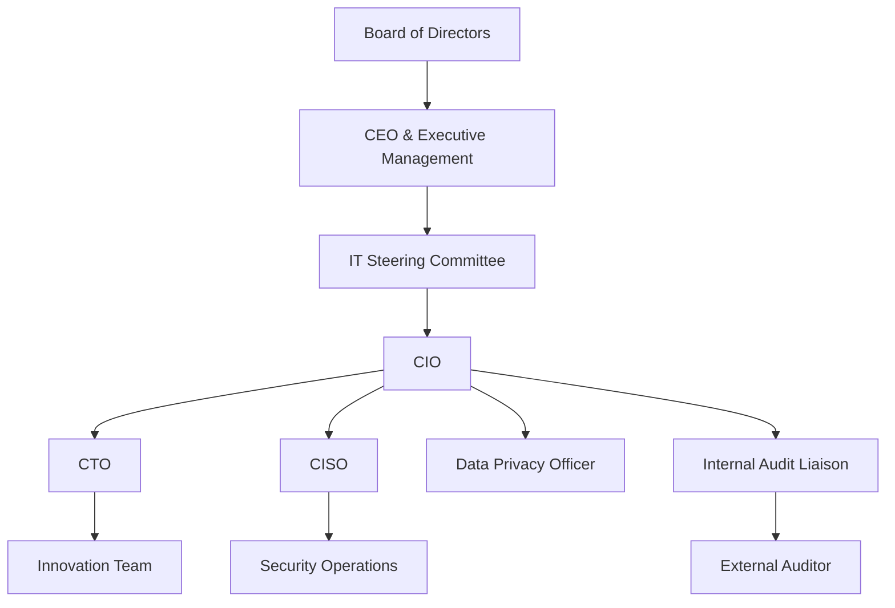

## 34.3 Outline of Roles and Responsibilities for IT Governance

Effective IT governance is integral to an organization’s overall success, ensuring that technology investments and processes are aligned with corporate strategy, risk tolerances, and compliance requirements. Drawing on insights and frameworks explored throughout this guide—particularly COSO, COBIT, and other standards—this section details the primary roles and responsibilities in a robust IT governance structure. While each organization may have unique titles and hierarchies, the principles and objectives behind these roles often remain consistent.

Good IT governance promotes accountability, transparency, and the responsible allocation of resources, so that mission-critical IT initiatives yield measurable benefits. By clearly defining responsibilities, organizations bolster their capacity to manage risks and opportunities in an ever-evolving technological landscape. This portion of Chapter 34 offers an outline of the standard roles commonly found in IT governance, along with brief examples and best practices to guide implementation.

### Importance of Defining Roles and Responsibilities
Before diving into specific roles, it is vital to understand why clearly defining roles and responsibilities for IT governance is critical:
• Minimizes overlap and confusion: Staff members know who makes decisions, who executes policies, and who holds ultimate accountability.  
• Aligns IT strategy with business goals: Proper governance ensures alignment between enterprise objectives and technological capabilities.  
• Helps identify and manage IT risks: Clear ownership of risk assessments, control initiatives, and remediation plans leads to more resilient and proactive risk management.  
• Facilitates continuous improvement: Defined responsibilities encourage consistent monitoring, feedback loops, and process enhancements.  

### Key IT Governance Roles

#### Board of Directors
Although many boards have varied committees and sub-committees, the overarching responsibility of the Board of Directors is to ensure strategic direction, alignment, and oversight. In terms of IT governance:  
• Sets the strategic direction for IT investments in line with corporate objectives.  
• Approves high-level budgets and major projects involving technology.  
• Oversees risk management at the highest level, including cybersecurity and regulatory compliance.  
• Champions a culture of accountability and transparency across the organization’s technology initiatives.  

#### Executive Management (CEO, CFO, COO)
Executive management ensures that IT strategy is integrated into broader organizational goals. Key responsibilities for this group include:  
• Articulating how IT supports business strategy and communicating expectations to senior leadership.  
• Reviewing budgets, risk assessments, and policy decisions to confirm that technology spending aligns with business needs.  
• Overseeing and supporting cross-functional coordination, particularly where technology intersects finance, operations, and strategic planning.  
• Setting the tone at the top for ethical and secure technology usage.

#### Chief Information Officer (CIO)
The CIO is critical in bridging executive leadership and technical teams. Typically, the CIO:  
• Develops and communicates the IT vision aligned with corporate strategy.  
• Oversees the day-to-day operations and long-term planning of IT services, resources, and architecture.  
• Manages IT budgets, resource allocation, and project prioritization.  
• Ensures compliance with relevant regulatory requirements and internal control frameworks.  
• Collaborates closely with the Steering Committee, aligning technology roadmaps with business objectives.

#### Chief Technology Officer (CTO)
While some organizations merge the CIO and CTO roles, others maintain separate positions. The CTO generally focuses on:  
• Technical innovation and digital transformation.  
• Evaluating emerging technologies, research, and development for competitive advantage.  
• Setting technical standards and architectural frameworks for IT systems.  
• Collaborating with the CIO to integrate specialized solutions into the broader IT environment.  

#### The Steering Committee
Often called an IT Steering Committee or Technology Steering Committee, this group includes relevant stakeholders from different business units. The Steering Committee:  
• Prioritizes and reviews major IT projects and ensures they align with strategic objectives.  
• Balances resource allocation across various projects to optimize organizational benefits.  
• Sets formal procedures for project management, approval, and reporting.  
• Continually evaluates the ROI of IT initiatives and monitors alignment with performance benchmarks.  

#### Chief Information Security Officer (CISO)
In larger or more risk-focused organizations, the CISO (or an equivalent security officer) leads cybersecurity efforts. Responsibilities include:  
• Establishing the cybersecurity strategy, encompassing prevention, detection, and response.  
• Overseeing the implementation of technical and administrative security controls.  
• Developing policies for data protection, incident response, and ongoing compliance with standards like HIPAA, GDPR, or PCI DSS.  
• Educating the workforce on security awareness and conducting drills to enhance organizational resilience.  

#### Data Privacy Officer
With the proliferation of privacy regulations such as the European General Data Protection Regulation (GDPR) and various U.S. state laws, many organizations appoint a Data Privacy Officer or Specialist. Their role:  
• Advises on compliance requirements and best practices related to data privacy.  
• Oversees data classification, encryption, retention, and destruction policies.  
• Coordinates with legal counsel to handle data subject access requests and maintain compliance with relevant privacy regulations.  
• Monitors internal processes to ensure that collection, storage, and usage of personal data adhere to organizational and legal standards.

#### Risk Management Officer (or Chief Risk Officer)
Some organizations have a dedicated CRO who addresses both operational and IT-related risks. In IT governance, the Risk Management Officer:  
• Collaborates with IT leadership to maintain an enterprise-wide risk register with technology components.  
• Prioritizes IT risk management activities aligned with COSO ERM frameworks, ensuring that risk appetite thresholds guide day-to-day operations.  
• Chairs or contributes to risk committees that address significant IT vulnerabilities, controls, or compliance matters.  
• Develops and monitors key risk indicators (KRIs) that alert leadership to emerging issues or control deficiencies.

#### Internal Audit
Internal auditors collaborate with IT to review controls, identify deficiencies, and recommend process improvements (see also Chapter 4: Key Concepts of IT Audit and Assurance). Within IT governance, Internal Audit:  
• Checks the design and operating effectiveness of controls, including IT General Controls (see Chapter 8).  
• Conducts risk assessments to identify areas requiring in-depth reviews or controls testing.  
• Assesses the adequacy of policies, procedures, and compliance measures related to IT.  
• Communicates findings to the Audit Committee and senior management, ensuring that remediation efforts are prioritized.

#### External Audit / Independent Auditor
While not internal to the organization, external auditors or independent auditors play a critical governance oversight function. These auditors:  
• Perform financial statement audits, addressing IT controls that have material impact on the financial reporting process.  
• Examine compliance with standards for SOC engagements (e.g., SOC 1®, SOC 2®).  
• Report findings and recommend improvements to enhance control reliability.  
• Provide assurance to shareholders and external stakeholders on the integrity of IT/financial systems.

#### Department Managers and Operational Teams
Department heads and operational teams interface closely with IT processes daily. They:  
• Provide input on user requirements, ensuring technology systems support functional objectives.  
• Act as first-line defenders, reporting anomalies and participating in security, business continuity, and governance training.  
• Collaborate in cross-functional committees to inform IT policies and direction.  

### Establishing a Clear Reporting Structure

Various frameworks—such as COBIT and COSO—emphasize clarity in reporting lines to ensure accountability and responsibility at every governance layer. Below is a sample Mermaid diagram illustrating a high-level IT governance structure with interconnected roles.

In this example:
• The Board of Directors provides oversight, while the CEO & Executive Management execute strategic plans.  
• The IT Steering Committee ensures that IT initiatives harmonize with corporate objectives.  
• The CIO orchestrates broader technology efforts and coordinates with specialized roles such as the CTO, CISO, and Data Privacy Officer.  

### Responsibilities Matrix (Illustrative Example)

Below is a simplified table mapping some high-level responsibilities:

| Responsibility                             | Board   | CEO     | CIO     | Steering Comm. | CTO     | CISO    | Data Privacy Officer | Internal Audit  |
|-------------------------------------------|---------|---------|---------|----------------|---------|---------|----------------------|-----------------|
| Approve IT Budget                         | A (R)   | C (A)   | I       | R (I)          | C (I)   | C (I)   | C (I)               | C (I)           |
| Define IT Strategy/Policy                 | A (R)   | R (A)   | R (C)   | R (I)          | I (C)   | I (C)   | I (C)               | C (I)           |
| Security/Privacy Oversight                | A       | R (C)   | R       | I             | C       | R (A)   | R (A)               | C (I)           |
| Risk Assessment (IT Operations)           | A       | R       | R (A)   | I             | C       | R       | C                   | A (R)           |
| Major IT Project Approval                 | A       | C (A)   | R (C)   | R             | I (C)   | I (C)   | I (C)               | C (I)           |

Legend:  
• R: Responsible for execution,  
• A: Accountable for the final decision,  
• C: Consulted,  
• I: Informed of changes/decisions.  

This matrix is an illustration, and actual responsibilities will differ based on organizational structure and industry requirements.  

### Real-World Scenario: Financial Services Firm
Consider a mid-sized financial services firm implementing a new core banking platform. The Steering Committee, comprising the CFO, a representative from the risk management office, and the CIO, meets monthly to evaluate the rollout. The CIO oversees coordination among external vendors, internal IT teams, and operational departments, while the CFO remains informed on budget consumption and project milestones. Meanwhile, the CISO evaluates the platform’s security architecture, ensuring customer data encryption and regulatory compliance are maintained.

### Best Practices
• Documentation and Clarity: Roles, responsibilities, and the scope of authority should be formally defined in charters or policies.  
• Regular Training: Continual staff development ensures each stakeholder understands emerging trends, threats, and policy changes.  
• Balanced Representation: Steering committees that include a range of perspectives (finance, operations, legal, HR, etc.) benefit from wider input.  
• KPIs and Metrics: Define performance indicators (e.g., budget variances, project deliverables, security incidents) that are tracked over time.  
• Periodic Review: Annual or semi-annual reviews of governance roles help keep structure up to date with organizational changes.  

### Common Pitfalls and Solutions
• Role Overload: Overlapping mandates can transform governance from an enabler into a bottleneck. Streamline decision-making with a RACI chart.  
• Underrepresentation: Excluding critical stakeholders, such as data privacy or legal counsel, leads to compliance gaps. Ensure cross-functional representation.  
• Lack of Board Engagement: Without active board sponsorship, IT is relegated to a support function and may not receive adequate investment. Encourage regular board updates and robust reporting.  
• Siloed Communication: Departments or managers operating in isolation create fragmentation. Use periodic steering committee sessions and cross-functional teams to foster transparency.  

### References for Further Exploration
• ISACA’s COBIT 2019: Outlines governance and management objectives for enterprise IT.  
• COSO Internal Control – Integrated Framework: Fundamental guidance on the five components of internal control.  
• ISO/IEC 27001: Offers a systematic approach for managing sensitive information.  
• AICPA SOC Publications: Guidance on SOC 1®, SOC 2®, and SOC for Cybersecurity engagements.  

Using these frameworks and insights, an organization can streamline its IT governance, ensuring that technology investments, security, and compliance initiatives remain in lockstep with strategic aims.

## Check Your Knowledge: IT Governance Roles and Responsibilities



### Which role is ultimately accountable for establishing the overall strategic direction of IT?
- [ ] Chief Information Officer (CIO)
- [ ] IT Steering Committee
- [x] Board of Directors
- [ ] Chief Technology Officer (CTO)

> **Explanation:** The Board of Directors holds ultimate accountability for guiding the organization's strategy, including oversight of major IT objectives and priorities.

### Which statement best describes the primary focus of the CIO?
- [ ] Overseeing technical innovation and system design
- [x] Aligning IT operations with the organization’s strategic goals
- [ ] Implementing the organization’s marketing campaigns
- [ ] Acting as external auditor for IT processes

> **Explanation:** The CIO usually provides strategic leadership in planning and managing information technology to align with broader organizational objectives.

### What is one major responsibility of the IT Steering Committee?
- [x] Reviewing and prioritizing significant IT projects
- [ ] Creating security policies and procedures for mobile devices
- [ ] Approving external audit findings
- [ ] Directly coding and implementing system upgrades

> **Explanation:** The Steering Committee sets priorities for major IT initiatives, ensures resource allocation aligns with strategy, and approves projects that impact the organization’s objectives.

### Why is it beneficial to include representatives from different business units on the IT Steering Committee?
- [x] To ensure technology decisions are more aligned with overall business needs
- [ ] To fill a regulatory requirement for committee size
- [ ] To reduce the risk of insider threats
- [ ] To eliminate the role of the CIO

> **Explanation:** Cross-functional input ensures that technology decisions serve the entire organization, aligning IT initiatives with multiple stakeholder perspectives.

### Which responsibility is generally held by the CISO?
- [x] Leading the cybersecurity strategy, encompassing prevention, detection, and response
- [ ] Approving all hardware purchases
- [x] Creating security policies and incident response guidelines
- [ ] Developing the organization's marketing strategy

> **Explanation:** The CISO is tasked with maintaining the security posture, setting security policies, and ensuring proactive threat management.

### Which governance role is typically responsible for reviewing the design and operating effectiveness of IT controls?
- [x] Internal Audit
- [ ] Steering Committee
- [ ] Chief Information Officer (CIO)
- [ ] Chief Executive Officer (CEO)

> **Explanation:** Internal Audit performs independent assessments of internal controls, including IT controls, to ensure they operate effectively and meet defined objectives.

### Why is clarifying roles and responsibilities critical in IT governance?
- [x] It minimizes confusion, prevents decision redundancy, and ensures accountability
- [ ] It allows all employees to participate in technology planning
- [x] It ensures alignment of corporate, regulatory, and technological goals
- [ ] It entirely removes the need for executive oversight

> **Explanation:** Defined roles reduce the risk of duplication, confusion, and misalignment. A structured governance model fosters accountability and trustworthy oversight.

### What is a key benefit of having a formal RACI (Responsible, Accountable, Consulted, Informed) matrix?
- [x] It assigns clear ownership and accountability for each task
- [ ] It replaces the need for a Steering Committee
- [ ] It automatically guarantees regulatory compliance
- [ ] It eliminates all cybersecurity risks

> **Explanation:** A RACI matrix illustrates precisely who is responsible, who must be consulted, and who should be informed, clarifying lines of responsibility and accountability.

### Which role typically focuses on research, development, and technical innovation to deliver competitive advantage?
- [x] CTO
- [ ] CFO
- [ ] CISO
- [ ] Risk Management Officer

> **Explanation:** The CTO generally leads innovation, exploring and implementing cutting-edge technologies to keep the organization competitive.

### True or False: A Data Privacy Officer is solely responsible for budget allocations across all IT projects.
- [x] True
- [ ] False

> **Explanation:** This is a trick question—commonly, the Data Privacy Officer does not manage overall budget allocations. Instead, the Data Privacy Officer focuses on compliance with privacy regulations and data governance. If a Data Privacy Officer, in a unique organizational structure, manages budgets, it would be unusual and not the standard practice.



## For Additional Practice and Deeper Preparation

### [Information Systems and Controls (ISC)](https://www.udemy.com/course/isc-cpa-mock-exams/?referralCode=E1217303222935C5E464)  

**Information Systems and Controls (ISC) CPA Mocks:** 6 Full (1,500 Qs), Harder Than Real! In-Depth & Clear. Crush With Confidence!

- Tackle full-length mock exams designed to mirror real ISC questions.  
- Refine your exam-day strategies with detailed, step-by-step solutions for every scenario.  
- Explore in-depth rationales that reinforce higher-level concepts, giving you an edge on test day.  
- Boost confidence and minimize anxiety by mastering every corner of the ISC blueprint.  
- Perfect for those seeking exceptionally hard mocks and real-world readiness.

_Disclaimer: This course is not endorsed by or affiliated with the AICPA, NASBA, or any official CPA Examination authority. All content is for educational and preparatory purposes only._
