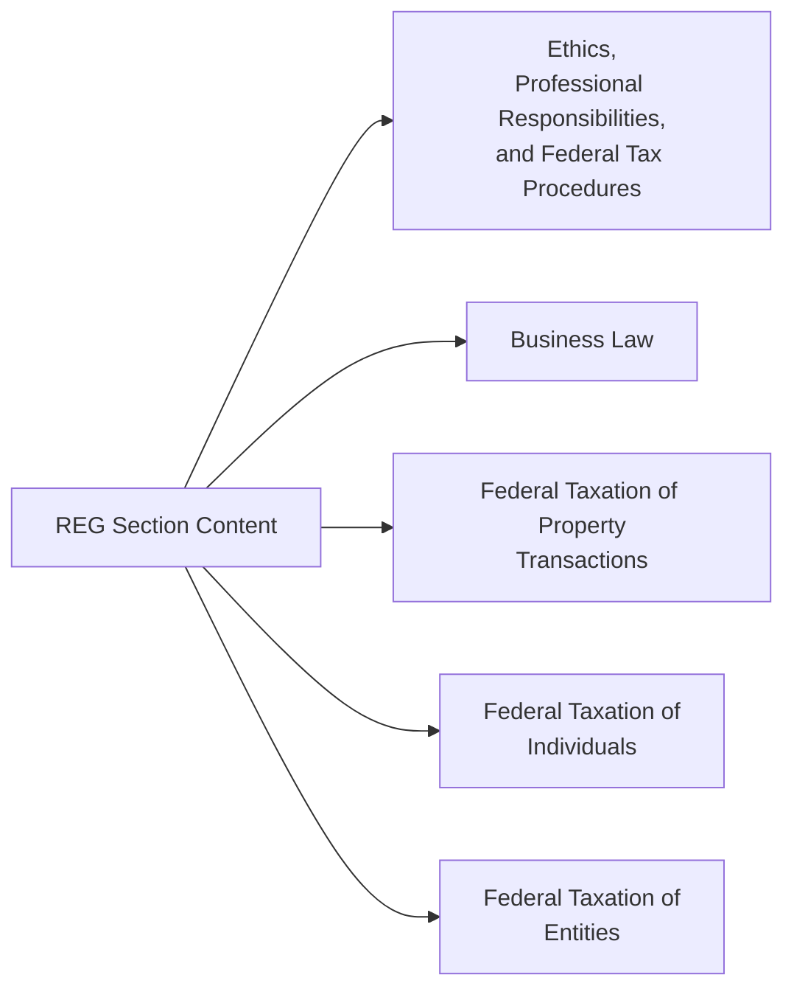
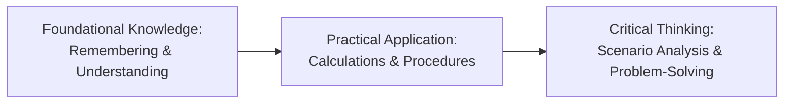

## 1.1 Purpose and Scope of the REG Section

The Regulation (REG) Section of the Uniform CPA Examination evaluates a candidate’s understanding of federal taxation, business law, and professional responsibilities. It challenges aspiring CPAs to demonstrate not only technical mastery of intricate laws and regulations but also the ethical and professional judgment required of a licensed accountant. As part of the CPA licensure process, REG is foundational in assessing whether a candidate is well-prepared to guide clients, employers, and other stakeholders through the complexities of tax planning, legal compliance, and the broader financial decision-making landscape.

This section explains how the REG portion fits into the broader CPA Exam structure, details the major content areas emphasized within the exam, and outlines the real-world tasks that newly licensed CPAs (nlCPAs) must be equipped to perform. In alignment with the AICPA Blueprint (effective date: January 2025), the REG Section ensures that candidates possess both the technical knowledge and the practical application skills necessary to maintain public trust and uphold the highest professional standards.

### Exam Relevance and Holistic Integration

The CPA Exam comprises four sections: 
• Audit and Attestation (AUD)  
• Business Environment and Concepts (BEC)  
• Financial Accounting and Reporting (FAR)  
• Regulation (REG)

Among these four, REG occupies a unique position because it requires candidates to think critically about how laws and regulations influence an entity’s financial health, ethical standing, and long-term strategic decisions. Since taxation and legal frameworks permeate every facet of business operations, the knowledge tested in REG has direct real-world implications.

Whereas FAR focuses on financial statements and reporting standards, and AUD examines auditing practices and ethics, REG channels its spotlight on tax law, business law, and federal procedures. In practice, professionals frequently blend insights from all four sections. For instance, the verification of tax positions (linking back to AUD) or the interpretation of new pronouncements that affect income recognition and deductions (linking back to FAR) cannot be done in isolation from the legal and ethical context established in REG.

### Core Content Areas

According to the Table of Contents for this Supplemental Guide, REG topics are primarily divided into five large “Areas” that encompass the knowledge and skills newly licensed CPAs must demonstrate:

1. Ethics, Professional Responsibilities, and Federal Tax Procedures (Area I)  
2. Business Law (Area II)  
3. Federal Taxation of Property Transactions (Area III)  
4. Federal Taxation of Individuals (Area IV)  
5. Federal Taxation of Entities (Area V)

The advantages of grouping content in these Areas are twofold: to clarify the scope of testing and to acknowledge the multifaceted nature of real-world tax and business practice. Within each Area, the intricacies of law, compliance mandates, and professional judgment intertwine to form a robust knowledge base. Below is a simplified diagram illustrating how these Areas fit within the broader REG scope:

As shown, these Areas serve as the main pillars of the REG Section, encompassing not only the theoretical underpinnings of taxation and law but also the practical responsibilities that CPAs will manage throughout their careers.

### Broad Skill Categories

The AICPA Blueprints for the CPA Exam emphasize varying skill levels to ensure that candidates can progress from understanding basic principles to analyzing complex scenarios. These categories include:

• Remembering & Understanding – Recalling and comprehending key concepts, definitions, and rules.  
• Application – Applying knowledge to real or hypothetical scenarios, such as computing tax liabilities using correct regulations.  
• Analysis – Examining facts, data, and potentially conflicting evidence to determine the appropriate course of action or conclusion.

REG leans heavily on the higher-level skills of Application and Analysis, with a foundational base of Remembering & Understanding. The exam tests whether candidates can read and interpret statutes correctly, apply these statutes to practical accounting and tax situations, and execute relevant procedures in an ethical manner. Evaluative judgment, while less explicitly tested than in the AUD section, is implicitly intertwined throughout REG because ethical considerations often require balancing competing legal and financial interests.

### Detailed Scope of Knowledge

1. Ethics, Professional Responsibilities, and Federal Tax Procedures (Area I)  
   This major content area is addressed in Chapters 3 to 6 of the Table of Contents. It includes topics such as Treasury Department Circular 230, IRS audit and appeals processes, statutory deadlines, and both civil and criminal penalties. Candidates must be aware of the disciplinary standards from State Boards of Accountancy, the principles of professional conduct, and the ramifications of failing to meet those responsibilities.

2. Business Law (Area II)  
   Covered in Chapters 7 to 11, Business Law examines agency, contracts, debtor-creditor relationships, federal regulations, and business structures. CPAs often need to interpret and apply legal frameworks when advising on contract formation, recognizing liability, and facilitating business entity choices or reorganization.

3. Federal Taxation of Property Transactions (Area III)  
   In Chapters 12 and 13, you delve into how property is classified, depreciated, or otherwise recovered under the tax code. This includes determining initial basis, adjustments to basis, depreciation recapture, and special rules for dispositions. A thorough understanding of these rules allows you to evaluate the tax implications of asset acquisition, usage, and eventual disposition.

4. Federal Taxation of Individuals (Area IV)  
   Spanning Chapters 14 to 17, this area covers the fundamentals of individual taxation, from calculating gross income to applying deductions, credits, and limitations. The chapters address filing statuses, capital gains and losses, limitations for passive or at-risk activities, and taxation of pass-through income from partnerships and S corporations. Emerging CPAs must be able to file accurate individual returns while advising on opportunities for tax minimization.

5. Federal Taxation of Entities (Area V)  
   The comprehensive study of C corporations, S corporations, partnerships, trusts, and tax-exempt organizations is laid out in Chapters 18 to 22. This realm includes entity selection, basis calculations, corporate distributions, built-in gains, unrelated business income, and international tax considerations. For newly licensed CPAs, mastery in entity taxation facilitates adept advising for both small businesses and large multinational entities.

Beyond the five core areas, the REG Section also touches on strategic tax planning techniques, advanced transactions, property exchanges, involuntary conversions, and specialized topics such as estate and gift taxation (Chapters 23 to 30). While some of these advanced subjects appear more frequently in certain professional practices than in others, all are fair game on the exam. The objective is to ensure that CPAs can holistically evaluate complex scenarios with multiple tax and legal dimensions.

### Real-World Impact and Practical Examples

REG is crucial for professionals working in both public accounting and industry. Whether you are preparing personal returns or overseeing a corporation’s federal compliance, you will continually draw on principles taught in this section. Below are a few illustrative examples:

• A CPA advising a small business on incorporation must weigh the tax implications of a sole proprietorship, LLC, or S corporation structure. This requires knowledge from Chapters 11 and 20 or 21 (Business Structures and S Corporations or Partnerships) about liability, formation requirements, and taxation rules.

• When analyzing a client’s real estate investments, a CPA must consider whether a property sale triggers ordinary or capital gains treatment (Chapter 29: Characterization of Gains and Losses), whether a Section 1031 like-kind exchange (Chapter 28) is applicable, and how the depreciation recapture rules (Section 1245 and 1250) might come into play.

• If an IRS notice arrives questioning certain deductions or eligibility for certain credits, a CPA must be versed in Area I concepts from Chapter 5 (Federal Tax Procedures) and Chapter 3 (Ethics) to navigate the audit process ethically while advocating for the client.

• Certain industries, such as multinational technology firms, demand specialized international tax knowledge, including Subpart F, GILTI, and FDII rules (Chapter 19). Being prepared for these scenarios may help CPAs recognize strategies to minimize legal tax burdens and to maintain compliance with foreign jurisdictions.

### Tying It All Together: CPA Tasks and Responsibilities

REG demands a high level of technical competence because CPAs who pass are expected to advise clients and organizations immediately upon receiving their license. The tasks newly licensed CPAs are likely to perform include:

• Preparing and reviewing tax returns for individuals, corporations, and pass-through entities.  
• Evaluating tax positions and ensuring compliance with federal and state regulations.  
• Identifying and explaining the impact of changes in tax law on financial statements and tax returns.  
• Advising clients on correct accounting treatment for complex transactions, including bankruptcies, reorganizations, and mergers.  
• Defending tax positions during audits or disputes with tax authorities while upholding ethical guidelines and professional standards.

### Potential Challenges and Common Pitfalls

Despite the robust knowledge base REG demands, candidates and practitioners often encounter recurring challenges:

• Complexity of tax code changes. Even the most experienced professionals must stay alert to new legislation and pertinent Treasury regulations.  
• Overlooking small details. Tax law is riddled with thresholds, phase-outs, and exceptions that taxpayers or their preparers might easily miss.  
• Ethical dilemmas. Practitioners sometimes face pressure to structure transactions or interpret rules aggressively. Understanding the guidance of AICPA Statements on Standards for Tax Services (SSTS) and Circular 230 is crucial to navigating these gray areas without compromising professional integrity.  
• Time Management. On the exam, carefully allocating time to each question or case ensures thorough evaluations of scenarios without overlooking subtle details.  
• Reliance on memorization alone. While remembering code sections is helpful, the real test is whether you can apply foundational principles to unfamiliar scenarios.

### Strategies to Approach REG Successfully

• Plan studies by content area. Chapter references in the Table of Contents serve as a roadmap. Systematically move from foundational material—like legal structures and basic taxation principles—to more intricate transactions and advanced tax planning.  
• Engage in active problem-solving. Seek out practical exercises or real-world tax forms to practice the computational and interpretive tasks that appear on the exam.  
• Embrace conceptual understanding. Knowing the “why” behind a tax rule or legal principle often clarifies how to apply it effectively in nuanced circumstances.  
• Use flowcharts or diagrams. Visual aids, like the mermaid diagram above, can delineate how multiple areas of regulation intersect.  
• Practice ethical reasoning. Walk through case studies about conflicts of interest, confidentiality, or potential malpractice to sharpen your professional judgment.

### Example Case Study

Imagine a mid-sized manufacturing company, ABC Tools, seeking advice on restructuring to access new markets and improve its tax efficiency. ABC Tools wonders if converting from a C corporation to an S corporation could yield immediate benefits. The primary factors a CPA must consider include:

• Comparing corporate-level vs. pass-through taxation across multiple jurisdictions.  
• Analyzing built-in gains tax for appreciated assets if the entity’s intangible property or real estate has significantly appreciated.  
• Reviewing the company’s existing ownership structure to confirm eligibility for S corporation status.  
• Considering future financing needs, as S corporations face restrictions on the number and type of shareholders.  
• Evaluating the company’s potential for growth or liquidity events that might influence its choice of entity.

Drawing upon the knowledge from Chapters 19 (C Corporations), 20 (S Corporations), and 23-25 (Entity Formation, Liquidation, and Estate/Gift Tax Planning), the CPA can guide ABC Tools through cost-benefit analyses, time the conversion properly to minimize tax ramifications, and counsel on any continuing compliance requirements. This integrated scenario underscores how deeply the topics in REG interlink to reflect real practice.

### Visualizing Skill Progression

The interplay of multiple skill levels (remembering, understanding, applying, and analyzing) can be visualized through another simple mermaid diagram:

In the REG Section, success hinges on progressing through these levels seamlessly. First, you master definitions and rules (A), next you compute and file accurately (B), and finally you analyze more complex issues such as entity choice, multi-state allocations, or like-kind exchanges (C).

### Forward-Looking Considerations

As legislative changes, emerging technologies, and global dynamics prompt transformations in the accounting profession, the REG Section evolves accordingly. Keeping up to date with the latest legislative drafts, final regulations, and IRS notices ensures that new CPAs are always prepared for the shifting landscape of tax law. Moreover, as e-filing and data analytics grow more sophisticated, CPAs must integrate these tools into their practice to remain trustworthy advisors.

### References for Further Exploration

• Internal Revenue Code (Title 26 of the U.S. Code)  
• Treasury Department Circular 230  
• AICPA Statements on Standards for Tax Services (SSTS)  
• State Boards of Accountancy Ethics Codes and Disciplinary Procedures  
• The Uniform Commercial Code (UCC)  
• Court Cases and IRS Revenue Rulings relevant to tax controversies  

Many of these references are readily accessible through professional membership databases, government websites, and proprietary tax research platforms. Integrating regular reading of authoritative guidance into your study and professional routine aids in reinforcing your understanding of the underlying principles driving every regulation.

### Conclusion

The Purpose and Scope of the REG Section extend far beyond rote memorization of tax tables or legal definitions. At its core, REG prepares candidates to uphold high ethical standards, guide stakeholders through today’s complex regulatory terrain, and defend the integrity of financial reporting and tax compliance. Whether tasks involve analyzing a corporate restructuring, lodging a defense against IRS penalties, or ensuring that a nonprofit maintains its tax-exempt status, newly licensed CPAs must exhibit the thoroughness, clarity, and professional ethics demanded by REG.

By diligently studying each chapter and connecting discrete legal or tax rules to broader strategic goals, you will develop the competencies necessary to excel not only on the exam but also in your day-to-day professional life. As you progress through the chapters in this supplemental guide—from foundational insights in Chapter 2 to advanced strategic considerations in Chapters 23 through 27—remember that the practical value of REG content derives from understanding how all these elements interact. That synergy empowers you to make informed decisions that protect clients, enhance organizational success, and fortify the public trust in the CPA designation.

---

## Test Your Knowledge: Essential Insights for the REG CPA Exam



### In the CPA Exam framework, which areas does REG specifically emphasize?

- [x] Federal taxation, professional responsibilities, and business law
- [ ] Financial statements and auditing procedures
- [ ] Corporate mergers and managerial accounting
- [ ] Information technology and data management

> **Explanation:** REG focuses on taxation (individuals, entities, property transactions), ethics, and legal concepts (including business structures and transactions).  

### Under the AICPA’s skill level classifications, which category involves interpreting facts and data to arrive at a conclusion?

- [ ] Remembering & Understanding
- [ ] Application
- [x] Analysis
- [ ] Evaluation

> **Explanation:** “Analysis” refers to using critical thinking skills to interpret and dissect facts, evaluate evidence, and form a conclusion.  

### In preparing for the REG Section, which approach is most likely to yield success?

- [x] Combining conceptual understanding with practical problem-solving
- [ ] Memorizing the entirety of the Internal Revenue Code
- [ ] Reading only ethics guidelines without doing any numerical exercises
- [ ] Studying only the taxation of individuals and ignoring business transactions

> **Explanation:** A balanced approach that includes understanding underlying concepts, practicing calculations, and regularly applying rules to scenarios is key to exam success.  

### Which of the following best describes a CPA’s responsibility when faced with a potential conflict of interest in tax practice?

- [ ] Proceed with the transaction to maximize client revenues
- [x] Follow professional standards such as the AICPA SSTS and Circular 230
- [ ] Dismiss the conflict as immaterial
- [ ] Resort to personal judgment based on financial gain

> **Explanation:** Professional standards (Circular 230, SSTS) require CPAs to uphold ethics and integrity, fully disclosing conflicts and avoiding any breach of client trust or regulatory expectations.  

### A newly licensed CPA might need to advise a client about whether to form an S corporation. Which chapters in this guide would be most helpful?

- [x] Chapters 11, 20, and 24
- [ ] Chapters 8 and 9 only
- [x] Chapters 19, 20, and 25
- [ ] Chapters 2, 6, and 30

> **Explanation:** Understanding business structures (Chapter 11), S corporations (Chapter 20), and strategic planning (Chapter 24) will guide the CPA in analyzing entity conversion and related tax implications. Chapter 19 on C corporations and Chapter 25 on advanced planning can also be relevant in some aspects.  

### Which of the following represents the greatest ongoing challenge for CPAs working with tax and federal regulations?

- [x] Keeping up with frequent legislative and regulatory changes
- [ ] Working with a single tax rate for every client
- [ ] Handling routine interest income calculations
- [ ] Calculating a client’s net payroll

> **Explanation:** Tax legislation and regulations change with regularity. Staying updated is one of the biggest hurdles for tax practitioners.  

### Why is the concept of basis critical in the taxation of both individuals and entities?

- [x] It determines the gain or loss recognized upon disposition of assets
- [ ] It only applies to individual taxpayers in certain states
- [x] It has no effect on deductions
- [ ] It is optional to track for intangible assets

> **Explanation:** Basis calculation is pivotal because it establishes the starting point for recognizing gains or losses on capital transactions and determines depreciation, amortization, and certain deductions.  

### Which of the following would most likely be tested in both the “Federal Taxation of Individuals” and “Federal Taxation of Entities” content areas?

- [x] Calculation of depreciation recapture
- [ ] Restrictive covenants in employment contracts
- [ ] Qualified Opinion provisions under GAAS
- [ ] Continuous auditing technology

> **Explanation:** Depreciation and its recapture rules can affect both individuals (e.g., sole proprietors or landlords) and entity tax returns.  

### What primary skill do candidates exhibit when they evaluate the appropriateness of a specific tax treatment under shifting regulatory guidance?

- [x] Analytical reasoning  
- [ ] Basic recall  
- [ ] Evaluation of marketing strategies  
- [ ] Memorization of standardized forms  

> **Explanation:** Evaluating the appropriateness of a tax treatment requires analytical reasoning to interpret current regulations, consider temporary and permanent differences, and reconcile guidance changes.  

### The REG Section’s coverage often emphasizes ethical dimensions. Which of the following statements is correct regarding ethics?

- [x] Ethical conduct underpins public trust and anchors professional responsibilities.
- [ ] Ethics violations typically have no real consequences for CPAs.
- [ ] Circular 230 is a reference to state-level legal codes unrelated to tax practice.
- [ ] Ethics do not impact a CPA who only prepares quarterly estimates.

> **Explanation:** Ethical conduct is key to maintaining public confidence in CPAs, enforced under resources like Circular 230, AICPA SSTS, and state boards’ regulations.  



---

## For Additional Practice and Deeper Preparation

### [Taxation & Regulation (REG) CPA Mock Exams](https://www.udemy.com/course/reg-cpa-mock-exams/?referralCode=55419EBD198F61530B12)

Taxation & Regulation (REG) CPA Mocks: 6 Full (1,500 Qs), Harder Than Real! In-Depth & Clear. Crush With Confidence!

- Tackle full-length mock exams designed to mirror real REG questions.  
- Refine your exam-day strategies with detailed, step-by-step solutions for every scenario.  
- Explore in-depth rationales that reinforce higher-level concepts, giving you an edge on test day.  
- Boost confidence and minimize anxiety by mastering every corner of the REG blueprint.  
- Perfect for those seeking exceptionally hard mocks and real-world readiness.

_Disclaimer: This course is not endorsed by or affiliated with the AICPA, NASBA, or any official CPA Examination authority. All content is for educational and preparatory purposes only._
