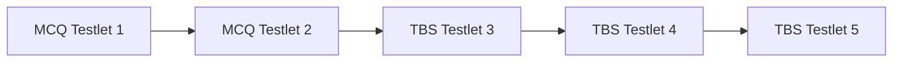

## 1.2 Exam Structure, Format, and Scoring

The Regulation (REG) section of the CPA Exam presents a unique combination of federal taxation and business law topics. As outlined in the Uniform CPA Examination Blueprints (Effective date: January 2025), the exam’s structure, format, and scoring methodology fundamentally shape how candidates prepare and how they manage exam-day performance. This chapter explores the types of questions you will encounter, time allocations, the composition of testlets, and the scoring breakdown that guides the awarding of your final grade. By the end of this discussion, you will have a well-rounded understanding of the REG exam’s design, enabling you to approach both your studies and test day with confidence.

### Exam Overview

The REG section is typically a four-hour computerized exam. Candidates moving through this section should anticipate a balance of multiple-choice questions (MCQs) and task-based simulations (TBS). Each of these question types is designed to evaluate not only recall and comprehension of fundamental concepts (such as basic legal principles and tax rules) but also higher-level skills encompassing analysis, application, and sometimes synthesis. 

The 2025 version of the REG exam retains the overall structure of multiple testlets, which are essentially groups or segments of questions served to the candidate in a set sequence. Each testlet must be completed before you proceed to the next. In addition, the AICPA uses adaptive testing for the multiple-choice portions in some parts of the Uniform CPA Examination, meaning your performance on earlier MCQ testlets can influence the difficulty level of subsequent testlets. 

### Number of Testlets and Time Allocation

While the specific distribution and volume of questions can fluctuate over exam cycles, the REG section commonly consists of five total testlets:

• Two testlets of MCQs  
• Three testlets of TBS

The five testlets are delivered in chronological order. Once you exit a testlet, you cannot return to it. Below is a simplified illustration of how these testlets typically appear on your exam interface:

```

```

The total available exam time is four hours (240 minutes). This time includes any breaks you take, although there is usually one standardized break offered after the second testlet that does not count toward your exam clock. You must manage your time carefully across each testlet so that you do not run out of time for the more complex TBSs. Effective time allocation often looks like this:

• 30–45 minutes per MCQ testlet  
• 1.5–2 hours for all three TBS testlets combined  

Time management strategies vary among candidates. Some individuals feel more comfortable allocating a bit more time to multiple-choice questions, while others anticipate needing additional minutes for the problem-solving aspects of task-based simulations. Nonetheless, a careful plan is essential to avoid the common pitfall of running short on time for the final TBS testlet.

### Types of Questions

#### Multiple-Choice Questions (MCQs)

MCQs in the REG section primarily evaluate knowledge and comprehension across key tax and regulatory topics, including individual tax, entity tax, ethics and professional responsibilities, and various business law areas. Each MCQ contains four potential answers, with only one correct answer.

1. Factual and Recall: Tests basic definitions, code sections, and rules (e.g., standard deduction amounts, filing requirements).  
2. Analytical: Requires you to evaluate short fact patterns or identify the correct tax treatment of specific transactions.  
3. Applied Scenarios: Could involve short computations, such as determining the tax-deductible amount of certain business expenses.

MCQs are weighted in the final score (in combination with TBSs, explained below). The AICPA uses adaptive testing for these MCQ testlets in other parts of the CPA Exam. Although the precise weighting might shift over exam versions, the overarching approach remains consistent: stronger performance on MCQ testlets may result in subsequent MCQ testlets that are more challenging, whereas weaker performance can yield relatively easier questions.

#### Task-Based Simulations (TBS)

Task-Based Simulations test not only your understanding of the content but also your ability to apply it to moderately complex and sometimes real-world scenarios. Whereas MCQs tend to be narrower in scope, TBSs often require several steps of analysis and application:

• Research Questions: You may be asked to find a specific Internal Revenue Code (IRC) section or U.S. Treasury Regulation.  
• Fill-in-the-Blank Tables or Forms: You might complete partial pieces of a tax form or ledger, computing the correct amounts of income, deductions, or credits.  
• Document Review Simulations (DRS): Provide one or multiple documents that may contain errors or irrelevant information. Candidates must parse the data and modify or confirm the correct figures.  
• Journal Entries or Summaries: For certain business law or tax accounting questions, you might be required to craft or correct financial entries.

Because TBSs demand deeper engagement with the concepts, they are a key measure of higher-order skills (application, analysis, and, in some cases, evaluation). For instance, you may need to consolidate financial data spanning multiple taxes (federal income, payroll, excise) to identify compliance breaches or errors.

### Scoring Methodology

#### Weighted Scoring

The REG section typically allocates 50% of the overall score to MCQ performance and 50% to TBS performance. This allocation may vary slightly depending on ongoing AICPA regulations, but historically, each half has been of comparable importance.

From a strategic perspective, you should approach each type of question with an understanding that TBSs often require more time per question but carry half of your total exam weight. Given this balanced weighting, neglecting either MCQs or TBSs can significantly harm your score. Successful candidates usually excel by diversifying study efforts:  
• Memorizing and comprehensively understanding frequently tested rules for MCQs.  
• Practicing more elaborate, scenario-based tax and legal issues for TBS readiness.

#### Scaled Scores and Passing Threshold

The AICPA uses a scaled scoring mechanism for the Uniform CPA Examination. A raw score is initially calculated based on the correctness of responses, then converted to the familiar CPA score scale from 0 to 99. The passing threshold is 75, which does not necessarily translate to 75% correct. Rather, 75 is a passing index on the scaled scoring system.

Key points about scoring:  
• Some test items may be pretest (unscored) questions. They are not disclosed to the candidate and do not affect final scoring.  
• TBS partial credit may be gained if you correctly complete certain parts of a multi-phase problem.  
• The AICPA carefully calibrates exam difficulty so candidates with a consistent performance level will achieve similar scaled scores, regardless of slight variations in question difficulty.

### The Role of Pretest Items

Pretest items are included in both MCQs and TBSs to refine future exam iterations. The REG exam typically contains a small number of undisclosed pretest questions, which the AICPA uses to evaluate question reliability and difficulty before these items become scored in subsequent exam versions. You will not know which questions are pretest vs. scored. For that reason, approach every question seriously:

• Always assume each question matters.  
• Manage your time uniformly across all items.  
• Avoid skipping or “rushing through” questions that seem unusual, as they may be scored.

### Practical Example: Time Management for TBS

Suppose you are nearing the final hour of your exam and still have all three TBS testlets remaining. Each TBS testlet may contain multiple tasks within it. Whether it is a research question, filling out relevant lines on a tax form, or evaluating a court case scenario related to a partnership dispute, the complexity can vary significantly.

• If you have an hour left for three TBS testlets, you might budget approximately 18–20 minutes per TBS.  
• Use the opening moments of each TBS to quickly gauge its complexity—some TBS tasks might be more straightforward, granting extra time you can roll over to the next tasks.  
• Resist the temptation to spend too much time on a single question. If you are stuck, document your best attempt and move on.

### Adaptive Testing Nuances

Although widely discussed for other CPA Exam sections (especially AUD, FAR, and BEC prior to the 2025 changes), adaptive testing in REG focuses primarily on the multiple-choice questions. After your first set of MCQs, the difficulty of the second set could be “medium” or “difficult,” depending on your performance. However, keep these tips in mind:

• Focus on accuracy rather than worry about question difficulty. Whether you get easier or harder MCQs ultimately doesn’t matter as much as answering each question correctly.  
• Do not attempt to guess your performance level mid-exam. This can be a distraction and may lead to second-guessing.  
• Even if questions seem overly challenging or easy, remain consistent with your methodology: read the details, analyze carefully, and avoid common errors.

### Tools and Resources During the Exam

While navigating the testlets, you will have access to on-screen tools:

• Calculator: A basic on-screen calculator is provided for MCQs and TBSs.  
• Authoritative Literature: Usually available for research-based TBSs, allowing you to search relevant Internal Revenue Code sections, treasury regulations, and other official materials.  
• Excel-like Spreadsheet: On simulation testlets, you have a spreadsheet tool to organize computations.  
• Highlighting and Note-Taking: Part of the test interface, enabling you to mark up questions and keep track of key details.

Familiarize yourself with these tools in advance. Many CPA review courses offer simulated exam environments to help you practice. Comfort with the software and interface can save valuable time, especially during TBSs, and reduce exam-day stress.

### Common Pitfalls and Best Practices

• Failing to budget time appropriately: Many test-takers are surprised by how quickly the clock runs down. Practice timed exams to develop a steady pace.  
• Overreliance on memorization: While memorizing thresholds, phase-outs, and legal definitions is essential, be prepared to apply these concepts in real-world scenarios—particularly crucial for TBS success.  
• Ignoring TBS practice: Some candidates focus too heavily on MCQs, underestimating how TBS performance can determine pass or fail in a close-scoring scenario.  
• Not reading carefully: Both MCQs and TBSs often include extraneous data. Always identify the precise question requirement before solving the problem.  
• Neglecting breaks: A short, structured break can restore focus. Over-tiredness can lead to an accumulation of small mistakes that hurt your final score.

### Mentally Preparing for the Exam Day

The mind frame you bring into the exam can significantly influence your ability to handle pressure and complexity. A few tips:

• Arrive early: Give yourself time to check in, get mentally prepared, and avoid last-minute rushing.  
• Use your break strategically: If it falls between testlets, take a moment to breathe, refocus, and recharge.  
• Control test anxiety: Practice relaxation techniques such as calm breathing or focusing on a simple object or positive thought before hitting “Start” on each testlet.  
• Stay flexible: If you have extra time left after finishing a testlet, use it to review flagged questions. But proceed confidently if you have thoroughly evaluated a question and want to move forward.

### References for Further Study and Practice

• AICPA Uniform CPA Examination Blueprints: Offers the official distribution of content areas and skill levels tested.  
• Becker CPA Review, Gleim CPA, and Wiley CPAexcel: Popular review courses that simulate the exam environment, provide question banks, and adapt to your performance levels.  
• Chapters 14 to 17 in this guide: In-depth coverage of Individual Taxation.  
• Chapters 18 to 22: Focused on the Federal Taxation of Entities.  
• Chapters 28 to 30: Key content on Nontaxable Exchanges, Involuntary Conversions, and Other Special Transactions that appear in TBS frequently.

If you have a strong study plan aligned with the official Blueprints and integrate consistent practice of both MCQs and TBSs, you will be well-positioned to manage the demands of the REG exam. Understanding how your performance translates to a final scaled score—and prioritizing both the multiple-choice and simulation aspects equally—fosters the well-rounded exam strategy that tends to deliver passing results.

---

## Test Your Knowledge: Mastering 2025 REG Exam Structure



### Which of the following best describes the time allocation strategy for the REG section?
- [ ] Spend the majority of your time on MCQs and leave the remainder for TBSs.  
- [ ] Guess quickly on TBSs to conserve time for MCQs.  
- [x] Budget appropriately between MCQs and TBSs, keeping in mind TBSs often need more time for complex analysis.  
- [ ] Spend equal time on each question without considering complexity.  

> **Explanation:** While MCQs are crucial, TBSs can be more involved and require detailed computations or research. Allocating enough time to both is key to a balanced approach.

### How is the score determined in the REG section of the CPA Exam?
- [ ] By counting how many questions you got right out of the total number of questions.  
- [x] By weighting MCQs and TBSs equally, then applying a scaled scoring system to arrive at a score from 0-99.  
- [ ] By only considering how you performed on TBSs.  
- [ ] By assigning a percentage score based on your total correct answers multiplied by 100.  

> **Explanation:** The CPA Exam assigns equal weight (historically 50% each) to MCQs and TBSs, converts raw performance to a scaled score, and sets 75 as the passing threshold.

### Which of the following best characterizes the adaptive nature of REG multiple-choice testlets?
- [ ] All testlets are identical regardless of the candidate’s performance.  
- [x] The difficulty level of the second MCQ testlet may increase or decrease based on the candidate’s performance on the first MCQ testlet.  
- [ ] The TBS testlets also adapt in difficulty based on candidate performance.  
- [ ] Successfully completing a TBS lowers the difficulty of subsequent TBSs.  

> **Explanation:** Only MCQs in the CPA Exam are adaptive. Your first MCQ testlet is typically medium difficulty; the second may be more challenging if you perform strongly on the first.

### In a Task-Based Simulation, partial credit:
- [ ] Is never awarded; you must get the entire TBS correct to earn points.  
- [ ] Is based only on selecting correct tax forms.  
- [ ] Does not apply if scheduling a break in the middle of TBS tasks.  
- [x] Can be given for correctly answering portions of the multi-part simulation.  

> **Explanation:** The AICPA’s scoring model allows for partial credit on TBS tasks, reflecting the reality that many TBSs involve multiple steps and computations.

### Which of these statements is true regarding pretest questions on the REG exam?
- [ ] Candidates are informed whenever they see a pretest question.  
- [x] Pretest questions are included without notice, and responses to them do not affect your final score.  
- [ ] Pretest items appear only in TBS format.  
- [x] Pretest items are always more difficult than scored questions.  

> **Explanation:** Pretest items are undisclosed questions used by the AICPA to gather performance data. They do not count toward your final score.

### What is the typical duration for taking the REG exam?
- [x] Four hours.  
- [ ] Two hours.  
- [ ] Six hours.  
- [ ] Three hours.  

> **Explanation:** The REG section typically provides four hours in total, including an optional standardized break after the second testlet.

### Why is it important to read each MCQ and TBS prompt carefully?
- [ ] All exam questions are trick questions.  
- [x] Exam items may include irrelevant or extraneous data, and identifying the real question requirement helps avoid errors.  
- [ ] Reading carefully only matters on TBS.  
- [ ] Reading carefully is not important if you know the content by memory.  

> **Explanation:** Both MCQs and TBSs can include distractors. Careful reading ensures you pinpoint the exact requirement and avoid concluding prematurely.

### Which of the following best describes the 50/50 weighting in the REG exam’s scoring system?
- [ ] 50% of each TBS is graded, and 50% is thrown out.  
- [x] MCQs count for 50% of the overall score, and TBSs count for the remaining 50%.  
- [ ] 50% of MCQs apply to the final score, while the rest are for research.  
- [ ] The first half of the exam is unscored, and the second half is fully scored.  

> **Explanation:** In the REG exam, MCQs collectively are worth half your total points, and TBSs make up the other half, reinforcing the need to perform well in both areas.

### How can candidates optimize the standardized break that usually appears after the second testlet?
- [x] Use the break to refocus, mentally reset, and plan time for remaining testlets.  
- [ ] Avoid breaks to maximize total test time.  
- [ ] Skip the break if you are behind schedule.  
- [ ] Spend more time on social media to relax.  

> **Explanation:** A short break can reduce test fatigue and clear your mind, which often improves focus for the remainder of the exam. Avoid time-wasting activities that distract you from regaining your composure.

### True or False: If your second MCQ testlet in REG is more difficult, you are guaranteed a higher overall score if you finish it.
- [x] True  
- [ ] False  

> **Explanation:** Generally, receiving a more difficult second testlet indicates you did well on the first. Correctly answering more difficult questions can yield a favorable scaled score outcome because the exam rewards correct responses to higher-difficulty items.  



---

## For Additional Practice and Deeper Preparation

### [Taxation & Regulation (REG) CPA Mock Exams](https://www.udemy.com/course/reg-cpa-mock-exams/?referralCode=55419EBD198F61530B12)  

**Taxation & Regulation (REG) CPA Mocks:** 6 Full (1,500 Qs), Harder Than Real! In-Depth & Clear. Crush With Confidence!

• Tackle full-length mock exams designed to mirror real REG questions.  
• Refine your exam-day strategies with detailed, step-by-step solutions for every scenario.  
• Explore in-depth rationales that reinforce higher-level concepts, giving you an edge on test day.  
• Boost confidence and minimize anxiety by mastering every corner of the REG blueprint.  
• Perfect for those seeking exceptionally hard mocks and real-world readiness.

_Disclaimer: This course is not endorsed by or affiliated with the AICPA, NASBA, or any official CPA Examination authority. All content is for educational and preparatory purposes only._
