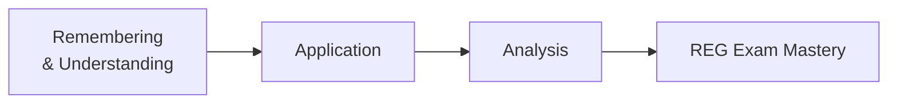

## 1.3 Skills and Content Allocation (Remembering, Understanding, Application, Analysis)

In the REG section of the Uniform CPA Examination, candidates are evaluated based on a range of cognitive skills that align with the American Institute of Certified Public Accountants (AICPA) blueprint. These cognitive skills are grouped into four essential levels: (1) Remembering, (2) Understanding, (3) Application, and (4) Analysis. Each level builds on the one before it, allowing examiners to assess not just a candidate’s ability to recall tax and legal rules but also to apply, interpret, and analyze those rules within various contexts. This section provides in-depth insights into how each skill level is tested, offers illustrative examples of question types, and suggests strategies for effective exam preparation.

Below, you will find a structured discussion of these skills, along with practical examples, relevant case studies, diagrams, and references to other parts of this guide that expand upon these areas. By understanding precisely what these cognitive skills entail, you will be able to tailor your study plan and become more confident in tackling all aspects of the REG exam.

---

### Overview of the Four Cognitive Skills

The AICPA breaks down CPA Exam tasks into four broad skill categories:

• Remembering & Understanding  
• Application  
• Analysis  
• (Some CPA sections also include Evaluation, but the emphasis for REG is primarily up to Analysis.)

In the REG exam, each tested topic is allocated a certain distribution across these levels, ensuring that questions measure not only factual knowledge (e.g., definitions, rules) but also problem-solving and critical reasoning (e.g., analyzing an S Corporation’s shareholder distributions, identifying potential ethical violations under Circular 230).

Below is an illustrative (not official) allocation of these skill levels in the REG exam. Please note these percentages can vary over time as the AICPA modifies exam blueprints:

| Skill Level                 | Approx. Percentage of REG Questions |
|----------------------------|--------------------------------------|
| Remembering & Understanding| 25% – 35%                            |
| Application                | 40% – 50%                            |
| Analysis                   | 20% – 30%                            |

These ranges reflect the emphasis on both direct recall and deeper engagement with complex tax and regulatory concepts.

---

### Remembering & Understanding

Remembering & Understanding (sometimes combined in official blueprints) focuses on factual recall and the comprehension of fundamental concepts. Under this level, you are expected to be able to:

• Recall definitions, rules, formulas, and guidelines (e.g., recalling the statute of limitations on tax returns).  
• Recognize and interpret standard procedures, steps, or instructions (e.g., identifying proper forms for specific tax filings).  
• Comprehend the broader theoretical underpinnings of tax and business law (e.g., knowing why certain deductions exist or how a regulation is structured).

In the REG context, typical questions at this level might include:

– Listing permissible items that qualify for the Section 179 expense deduction.  
– Identifying the difference between actual vs. apparent authority in an agency relationship.  
– Recognizing which U.S. tax court has jurisdiction over a particular tax case.  
– Defining basic legal terms, such as “consideration” in a contract or “recourse vs. nonrecourse debt” in a partnership.

Remembering & Understanding questions often appear as straightforward multiple-choice items where a single piece of knowledge is tested. For instance, a question might ask: “Which of the following statements about charitable contribution deductions is true?” Each option targets a distinct rule, requiring direct recall of the guidelines one studied.

#### Example: Factual Recall

If a question reads:
• “Which one of the following is a duty of an agent toward the principal?”  
You must recall the enumerated duties of the agent, such as loyalty, obedience, notification, accounting, and care. This question does not require complex calculations; it only tests your knowledge of these duty types.

---

### Application

At the Application level, candidates move beyond recalling a single fact. Instead, they must apply their understanding of rules, definitions, or processes to a given scenario. This may involve:

• Using known formulas or rules in a computation (e.g., calculating self-employment taxes).  
• Determining the proper tax treatment of a described event (e.g., whether a certain transaction qualifies as a nontaxable like-kind exchange).  
• Selecting and applying the correct standard from multiple possible theories or legal principles (e.g., deciding whether a contract is voidable based on duress or fraud).

In these tasks, the exam typically provides more context, such as a taxpayer’s situation, an entity’s financial data, or a business’s organizational structure. You must work step-by-step to verify which rules are relevant, identify the appropriate solution method, and then apply it.

#### Example: Applying Tax Concepts

Consider a question about an individual taxpayer who sold stock at a gain, received a W-2 wage, and had dividend income. You might be asked to compute the total gross income to be reported on Form 1040. You’d need to:

1. Recall the definitions of capital gains, wage income, and dividend income.  
2. Recognize whether each income type is taxable under current rules (Remembering & Understanding).  
3. Properly combine them and confirm the correct lines on the tax form (Application).

By bridging knowledge with a real tax scenario, Application-level questions ensure you can navigate typical tasks a CPA might face in practice.

---

### Analysis

Analysis represents a more advanced level of cognitive engagement, requiring the evaluation of multiple data points, reconciling conflicting information, or distinguishing between similar regulations that apply differently based on context. Analysis-level tasks in REG often include:

• Evaluating multiple-choice questions with subtle distinctions in tax treatment (e.g., identifying the most appropriate filing status and relevant tax implications when the taxpayer’s marital situation is complicated).  
• Explaining the consequences of interrelated transactions in a consolidated corporate return.  
• Identifying potential compliance issues, such as a conflict of interest or a violation of AICPA’s Statements on Standards for Tax Services (SSTS), based on a nuanced fact pattern.  
• Recommending a course of action that follows from multiple preceding steps (e.g., analyzing a corporate liquidation scenario and detailing the shareholder’s realized gain or loss).

You may face task-based simulations (TBS) at the Analysis level that integrate data from various exhibits—like a partnership agreement, an IRS notice, or a partial tax return—and require you to trace the correct logic, fill out forms, or choose from multiple possible conclusions.

#### Example: Analyzing a Complex Partnership Scenario

Suppose you receive a scenario describing a partnership with three partners, each with different recourse and nonrecourse liabilities. One partner contributes property with a built-in gain, while another partner contributes services. The question might ask you to:

1. Determine how partnership liabilities are allocated to each partner’s basis.  
2. Calculate each partner’s initial outside basis and subsequent adjustments.  
3. Identify the character of income or deduction items (ordinary vs. separately stated).  
4. Conclude which partner has at-risk limitations or passive activity considerations.

This multi-step approach tests not only your memory of basis rules (Remembering & Understanding) but also your ability to apply them (Application) and finally to piece everything together in a single consistent answer (Analysis).

---

### Putting It All Together: A Visual Overview

Below is a Mermaid diagram illustrating how these cognitive skills build upon one another in the context of REG exam tasks:

• Node A focuses on grasping the fundamental concepts and definitions.  
• Node B involves using those concepts in real-world scenarios.  
• Node C requires synthesizing multiple elements, evaluating complexities, and making judgments.  
• Node D represents the overarching mastery of skills needed to succeed in the REG exam.

As you progress through your study plan and practice multiple-question sets, you will notice how these skill levels intertwine. A single task-based simulation might contain questions that touch on each of these levels in sequence.

---

### Mapping Skills to the REG Blueprint Topics

You will find, throughout this guide, references to various tax and legal topics—everything from individual gross income (Chapter 14) to advanced entity-level considerations (Chapters 19–21). Each of these chapters relates to different routines and complexities tested in the exam. Below is a quick mapping of how each skill level typically intersects with certain topic areas:

• Remembering & Understanding:  
  – Federal Tax Procedures (Chapter 5) focusing on audit triggers and penalties.  
  – Basic Business Law Concepts such as contract formation or agency duties (Chapters 7–8).  
  – Ethics and Professional Responsibilities references to Circular 230 (Chapter 3).  

• Application:  
  – Applying depreciation methods (Chapter 13) to assets with different recovery periods.  
  – Calculating the Qualified Business Income Deduction (Chapter 15) based on a given set of data.  
  – Determining the appropriate filing status and standard vs. itemized deductions for an individual (Chapters 14–15).  

• Analysis:  
  – Deciding how to allocate partnership basis in complex capital structures (Chapter 21).  
  – Evaluating family-limited partnership strategies or advanced estate planning scenarios (Chapters 25–26).  
  – Determining whether an S corporation is at risk of losing its status due to excessive passive income (Chapter 20).  

It is crucial to note that many topics—from the simplest individual tax forms to an entity’s reorganization mechanics—can be tested at various skill levels depending on how the question is posed.

---

### Exam Preparation Strategies

Bridging the gap between these cognitive levels requires more than memorizing facts. Here are some targeted strategies:

• For Remembering & Understanding:  
  – Use flashcards or spaced-repetition software to recall definitions and rules.  
  – Summarize the key points of each chapter in a concise, organized manner.  
  – Practice short quizzes to confirm your grasp of terminology and fundamental rules.

• For Application:  
  – Work through practice problems that involve basic calculations or scenario-based tasks.  
  – Use a step-by-step approach to carefully apply each concept.  
  – Focus on bridging your knowledge to real-world examples or past experiences.  
  – Attempt easier task-based simulations that require multiple steps but not deep analysis.

• For Analysis:  
  – Dive into comprehensive simulations that challenge you to interpret multiple data points.  
  – Compare and contrast similar concepts, such as different entity formations or different tax treatments for the same transaction.  
  – Study complex case scenarios that require you to identify key facts, eliminate irrelevant data, and arrive at a reasoned conclusion.  
  – Engage in study groups where you debate or discuss the best approach to an intricate question.

By applying these strategies systematically, you embed the foundational knowledge deeply and learn to extend it into more advanced reasoning—an indispensable skill for exam success and future professional practice.

---

### Practical Examples and Case Studies

One of the best ways to prepare is to step through realistic vignettes that mimic what you will see in the actual exam. Consider these short case examples:

• Ethics and Circular 230 Implementation (Chapters 3–6):  
  – Scenario: A tax preparer faces potential conflicts of interest when representing a married couple going through divorce.  
  – Skill Requirements:  
    (1) Remembering & Understanding – Identify rules in Circular 230 regarding conflicts.  
    (2) Application – Evaluate whether the facts create an impermissible conflict under these rules.  
    (3) Analysis – Propose a plan of action consistent with ethical guidelines and best practices.

• Corporate Distributions and E&P (Chapter 19):  
  – Scenario: A C corporation with accumulated Earnings & Profits (E&P) issues a property distribution to shareholders.  
  – Skill Requirements:  
    (1) Remembering & Understanding – Recognize definitions of Current vs. Accumulated E&P.  
    (2) Application – Calculate the taxable portion of a distribution to the shareholder, taking into account E&P.  
    (3) Analysis – Evaluate the effect of the distribution on the corporation’s future E&P, and interpret potential repercussions for future distributions.

• Entity Choice for a Start-Up (Chapters 11, 20–24):  
  – Scenario: An entrepreneur needs to decide whether to set up a partnership, an S corporation, or a single-member LLC.  
  – Skill Requirements:  
    (1) Remembering & Understanding – Know the key legal structures and tax rules.  
    (2) Application – Incorporate the entrepreneur’s financial data into the appropriate forms or hypothetical calculations of tax liability.  
    (3) Analysis – Weigh the pros, cons, and long-term strategic implications (e.g., possibility of an IPO, exit strategies, or pass-through benefits).

Working through these scenarios in a structured way reveals how the exam might combine or layer the skill levels to test a deeper understanding of material.

---

### Common Pitfalls

1. Rote Memorization Without Context  
   – Many candidates focus too heavily on reviewing lists of rules. While memorization is necessary, failing to practice applying or analyzing data can lead to difficulty on the exam’s more complex questions.

2. Skipping Over Foundational Topics  
   – Overconfidence in basic areas, such as definitions or broad rules, can be detrimental. Even “easy” recall questions can become stumbling blocks if not properly reviewed.

3. Insufficient Practice of Task-Based Simulations (TBS)  
   – Simulations often demand a blend of choosing the correct rule, applying it numerically, and interpreting results. Simply doing multiple-choice questions is not enough to build the analytical muscle required.

4. Misreading Complex Scenarios  
   – Analysis-level questions hinge on precise reading comprehension. Missing a detail like “the distribution was partially nonliquidating” can change the entire treatment.

5. Over- or Under-Allocating Study Time to One Cognitive Skill  
   – Balancing your time according to the relative weight of skill levels on the exam ensures you are prepared for each type of question you might encounter.

---

### Conclusion

Under the CPA Exam blueprint, the REG section requires a broad array of cognitive abilities, from fundamental recall to nuanced analysis. Understanding how each of these levels manifests in exam questions allows you to shape your study strategy effectively. By consistently cycling through each phase—Remembering & Understanding, Application, and Analysis—you will build a rock-solid skill set that is critical not just for passing the exam but also for excelling in professional practice.

Remember, the objective is not only to pass an exam but to acquire the essential blend of knowledge and judgment that defines a competent CPA. Approach each topic with curiosity, delve into practice scenarios, refine your analytical processes, and cultivate a strategic mindset. This broader perspective will pay dividends in your career, equipping you to handle myriad tax, legal, and regulatory challenges effectively.

---

## Mastering CPA Exam Skills: Comprehensive Skill Levels Quiz



### Which of the following best describes the Remembering & Understanding skill level on the REG exam?

- [x] The ability to recall and grasp fundamental tax and legal concepts.  
- [ ] The ability to compute complex tax liability from multifaceted transactions.  
- [ ] The ability to synthesize financial data from multiple sources and propose an optimal solution.  
- [ ] The ability to critique legislative history and propose new regulations.  

> **Explanation:** Remembering & Understanding focuses on the foundational knowledge of rules, definitions, and concepts. This skill level requires candidates to demonstrate comprehension without necessarily applying or analyzing scenarios in depth.

### A question that asks a candidate to identify which of the following items is tax-exempt under the Internal Revenue Code primarily tests which cognitive skill?

- [x] Remembering & Understanding  
- [ ] Application  
- [ ] Analysis  
- [ ] Evaluation  

> **Explanation:** Recognizing a list of items and identifying the tax-exempt one aligns closely with the Remembering & Understanding level, as it involves direct recall of law and definitions.

### In which of the following scenarios would Application-level skills be most evident?

- [x] Calculating the appropriate deduction for a casualty loss based on specific data.  
- [ ] Listing the primary duties of a principal in an agency relationship.  
- [ ] Interpreting a multi-step partnership liquidation that involves built-in gains.  
- [ ] Explaining how a new piece of legislation might affect global taxation policy.  

> **Explanation:** Application requires candidates to apply known rules and formulas to a specific fact pattern. Calculating a casualty loss deduction from provided data is a classic example of applying tax laws to a particular scenario.

### Which skill level involves comparing multiple legal theories and deciding which rule or regulation applies best in a given fact pattern?

- [ ] Remembering & Understanding  
- [ ] Application  
- [x] Analysis  
- [ ] Summarization  

> **Explanation:** When you must reconcile competing rules or delve into nuanced fact patterns to arrive at a single outcome, you demonstrate Analysis. This step requires you to interpret, reason, and resolve complexities.

### A multi-part task-based simulation that presents a taxpayer’s investment portfolio, rental property transactions, and a partial Form 1065 is testing which skills?

- [ ] Only Remembering & Understanding  
- [x] Application and Analysis  
- [ ] Evaluation alone  
- [ ] Memorization of all U.S. tax forms  

> **Explanation:** The TBS requires the candidate to apply knowledge to multiple distinct contexts (Application) and then integrate the results to address a more complex scenario (Analysis).

### What is a common pitfall when preparing for the Analysis portion of the REG exam?

- [x] Focusing exclusively on memorization and ignoring multi-step problem-solving.  
- [ ] Excessive practice of only complex TBS questions.  
- [ ] Spending too much time on discussing ethics.  
- [ ] Overusing advanced calculators.  

> **Explanation:** Analysis-level questions demand integration and interpretation across multiple data points. Rote memorization alone does not suffice if you cannot synthesize information from a complex scenario.

### Which of the following best illustrates a scenario that tests both Application and Analysis?

- [x] A question requiring computation of partnership liabilities for each partner and a subsequent deep review of at-risk limitations.  
- [ ] Matching the name of an IRS form with its function.  
- [x] Calculating the QBI deduction and discussing strategic implications for future tax years.  
- [ ] Describing the steps in forming a corporation, with no context.  

> **Explanation:** These tasks involve performing concrete calculations (Application) and then interpreting or projecting broader consequences (Analysis).

### Why is it critical not to skip over foundational definitions in the REG blueprint?

- [x] Because many Application and Analysis questions still rely on fundamental rules and definitions.  
- [ ] Because the exam never tests advanced concepts.  
- [ ] Because definitions are the only content tested in the exam.  
- [ ] Because only simple recall items appear on simulations.  

> **Explanation:** Even advanced tasks build upon an understanding of basic concepts. Skipping foundational definitions can cause you to struggle with higher-level tasks that incorporate those fundamentals.

### Which of the following best describes how Remembering, Understanding, Application, and Analysis interact in a typical REG simulation?

- [x] A single scenario often requires multiple skill levels, from recalling definitions to calculating figures and finally interpreting the results.  
- [ ] Each simulation tests only one skill level.  
- [ ] The skills are tested in a fixed sequence without overlap.  
- [ ] The skills have no connection and are tested independently.  

> **Explanation:** The REG exam frequently weaves multiple cognitive skill levels into a single problem. You might begin by recalling definitions, apply them in a calculation, and conclude by analyzing an outcome.

### Using a step-by-step approach to solve a TBS is recommended because:

- [x] It ensures that you address each required cognitive skill thoroughly and systematically.  
- [ ] It makes the question more difficult by breaking it down into smaller steps.  
- [ ] The AICPA mandates a fixed process for solutions.  
- [ ] It lowers your chances of passing the exam.  

> **Explanation:** Breaking down complex simulations into sequential steps helps you systematically use and demonstrate Remembering & Understanding, Application, and Analysis, reducing mistakes and confusion.



---

## For Additional Practice and Deeper Preparation

### [Taxation & Regulation (REG) CPA Mock Exams](https://www.udemy.com/course/reg-cpa-mock-exams/?referralCode=55419EBD198F61530B12)

**Taxation & Regulation (REG) CPA Mocks:** 6 Full (1,500 Qs), Harder Than Real! In-Depth & Clear. Crush With Confidence!

- Tackle full-length mock exams designed to mirror real REG questions.  
- Refine your exam-day strategies with detailed, step-by-step solutions for every scenario.  
- Explore in-depth rationales that reinforce higher-level concepts, giving you an edge on test day.  
- Boost confidence and minimize anxiety by mastering every corner of the REG blueprint.  
- Perfect for those seeking exceptionally hard mocks and real-world readiness.

_Disclaimer: This course is not endorsed by or affiliated with the AICPA, NASBA, or any official CPA Examination authority. All content is for educational and preparatory purposes only._
