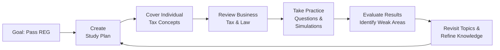
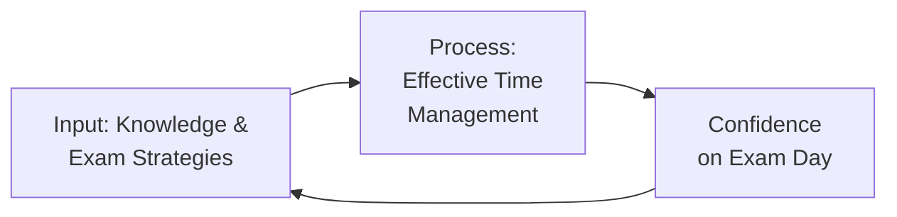

## 1.5 Study Strategies and Exam-Taking Techniques

Preparing for the Regulation (REG) section of the Uniform CPA Examination requires a combination of memorization, critical analysis, and real-world application. You will navigate complex tax rules, regulatory standards, and business law concepts, all within a limited time frame. The methods you choose to learn and apply this information are crucial to your success. This section discusses pacing, strategic guessing, effective use of research tools, and the best ways to harness your knowledge of tax and business law for a game-changing advantage on exam day.

---

### Cultivating a Professional Mindset

A strong performance starts with controlling the mental game. Stepping into an intense exam environment can be overwhelming, especially given the breadth of concepts tested in REG. Maintain a mindset of clarity and determination:

• Embrace the challenge. Mastering complex regulations builds confidence not only for the exam but also for your career in accounting.  
• Adopt a problem-solver attitude. REG is as much about applying analytical thinking as it is about memorizing content. Focus on how to leverage your knowledge to solve real-world tax and legal issues.  
• Take regular breaks when studying. Effective study requires balance. A clear mind is more open to retaining new information.

---

### Building a Knowledge Foundation

Before addressing pacing and guessing tactics, ensure you have a solid foundation in both tax and business law fundamentals.

• Tax Fundamentals: Familiarize yourself with how the Internal Revenue Code is organized, the primary differences between individual and business taxation, the function of regulations, and foundational principles like determining gross income, allowable deductions, and credits.  
• Legal Background: Entities, contracts, and agency relationships are central to the REG exam. Develop a conceptual understanding of how these legal frameworks fit into a business context.  

Remember that each of these topics interlocks. In a single scenario, you might apply partnership taxation principles alongside contract law in deciding the deductibility of certain expenses or the enforceability of specific agreements.

---

### Crafting an Effective Study Routine

A well-structured plan keeps you from scrambling at the last minute. Treat your CPA exam preparation like a project:

• Set weekly goals. Stay realistic while ensuring consistent progress.  
• Tier your topics. Start with your weaker areas, then move to your strengths to solidify and refine your overall comprehension.  
• Actively review. Use short quiz sessions to recall information. Putting yourself “on the spot” during study ensures you can recall under exam pressure later.  

Below is a Mermaid flowchart illustrating a cyclic approach to studying:

In this sequence, you build momentum by moving through the interconnected content, testing yourself frequently, and revisiting the areas that need more attention.

---

### Time Management and Pacing

REG demands disciplined pacing—once the clock starts, it never pauses:

• Segment your time. The REG exam has multiple testlets—some with multiple-choice questions (MCQs) and some with task-based simulations (TBSs). Generally, allow a bit more time for TBSs, as they are often more complex.  
• Tackle the easier MCQs first. If you find yourself unsure about a question, mark it for review and move on. Returning once you have answered other questions often triggers recall from related queries.  
• Watch the clock. A common pitfall is spending too much time on certain TBSs. Practice with timed simulations to feel comfortable balancing detail and speed.

Consider an approximate guideline of 1.25 minutes per MCQ and 15–25 minutes per TBS. Adjust these guidelines to your strengths and weaknesses; with experience, you will find your ideal pace.

---

### Strategic Guessing Techniques

Guessing might sound suboptimal, but it’s a necessary tactic in standardized tests when a question remains elusive:

• Quickly rule out implausible choices. Even a partial understanding can help eliminate incorrect responses.  
• Look for keywords. Terms such as “always,” “never,” “only,” or “must” may indicate an answer that is too absolute to be correct.  
• Rely on logic and prior knowledge. In many instances, the question will revolve around typical practices in taxation or standard legal precedents—if you can reason through it, you can often arrive at the best guess.  

The REG exam does not penalize you for guessing; unanswered questions receive zero points toward your total. Always mark an answer rather than leaving it blank.

---

### Leveraging Research Tools

During task-based simulations, you often have access to authoritative literature and IRS code references. Practice using these research tools efficiently:

• Familiarize yourself with the layout of the Internal Revenue Code and Treasury Regulations. Quick navigation can save precious minutes.  
• Note the difference between searching for broad guidance (like overall depreciation rules) versus specialized corners of the tax law. Some TBS questions ask for a specific Code section or regulation.  
• Practice targeted searches. Instead of reading entire volumes, zero in on specific sections once you identify a question’s domain—such as capital gains, passive activity losses, or specific partner basis rules.

Proficiency in research tools can turn a seemingly impossible TBS into a more manageable, direct lookup task. However, do not rely entirely on the research tab—understanding the material still underpins success.

---

### Harnessing Prior Knowledge of Tax and Business Law

Experience is a powerful study ally. Even if you have never worked in a public accounting firm or a tax preparation service, everyday exposure to income tax forms, real estate transactions, or small-business finances can be harnessed:

• Personal Tax Returns: Think about how your own income, deductions, or credits have been calculated. That real-life connection often cements abstract concepts.  
• Business Exposure: If you have dealt with entity formation or contract law for a family business or in a previous job, apply that experience to exam scenarios.  
• Research Observations: Maybe you have helped someone file a tax return or seen how a lawyer interprets contract clauses. Map these experiences to the exam’s business law modules.  

---

### Practice with Question Banks, Simulations, and Mock Exams

No amount of reading alone can fully prepare you for the real test environment. Integrate practice tests and simulations into your strategies:

• Full-Length Exams: Simulate the actual experience. Familiarize yourself with the software interface, question structure, and the countdown timer.  
• Targeted Focus: Tackle question banks specifically on high-weight areas—like individual tax, corporate tax, and business law.  
• Seek Variety: Expose yourself to multiple question types. Some question banks are easier than the actual exam; others are more difficult, pushing you to new limits.

Tracking your performance can reveal patterns—topics you repeatedly struggle with or question styles that trip you up. A consistent pattern of errors in a particular domain is a bright red flag; allocate extra revision there.

---

### Memory Retention Methods

REG covers a massive collection of rules, numbers, and statutes. Effective recall techniques can help:

• Mnemonics: Develop acronyms for core rules—for example, to remember the tests for material participation in passive activity rules.  
• Mind Maps: Link different subtopics in a visual structure. For instance, visualize how partnership and S corporation taxes both flow through to individual returns.  
• Teach Someone Else: Explaining a principle to a peer or study buddy is an excellent way to reinforce your own understanding.

Ultimately, short review periods repeated over time are more powerful than marathon cram sessions. Space out your sessions to let concepts sink into long-term memory.

---

### Navigating Unpredictable Scenarios

Even well-prepared candidates encounter curveball questions. Handle uncertainty by combining your logical reasoning, partial knowledge, and test-taking strategies:

• Reassess the question’s main point. On a second reading, you might notice details you missed.  
• Check for “Red Herrings.” The exam might include extra, nonessential details to test your ability to isolate relevant facts from distractions.  
• Make a reasoned guess and move on. If the question continues to stump you, save that time for other parts of the exam. You can return closer to the end if time remains.

---

### Common Pitfalls and How to Avoid Them

• Neglecting Timed Practice: Focusing solely on content without factoring in pacing could lead to a mid-exam time crunch.  
• Overreliance on Flashcards: While flashcards are useful for key terms and rules, do not forget the bigger picture—apply the concepts in scenarios.  
• Failing to Use Authoritative Literature: If the TBS format allows it, verifying your approach by searching in the authoritative literature can be the difference between partial and full credit.  
• Skipping Legal Concepts: Some test-takers focus heavily on the tax portion and neglect business law, leading to easy missed points.  

---

### Practical Illustration: A Hypothetical Scenario

Imagine you’re answering a TBS regarding the formation of a partnership. The simulation provides specific details on contributed cash, property, potential partnership liabilities, and a draft partnership agreement. You also see references to possible IRC Section 721 nonrecognition rules. How to approach it?

• Isolate Key Tax Elements: Identify who contributed which assets and how liabilities are allocated among partners.  
• Apply Section 721: Remember that contributions of property in exchange for a partnership interest are generally nontaxable.  
• Reference the TBS Documents: If any internal documents provide guidance, cross-check them with authoritative literature.  
• Confirm Step-by-Step in the Research Tab: If necessary, open the IRC references to section 721 to ensure you’re applying the rules correctly.  

By systematically breaking down the scenario, you’re combining your technical knowledge, time management, and research skills—exactly what the REG exam requires.

---

### Additional Tools and References

• AICPA Released Questions: The best benchmark to gauge the complexity of REG testlets.  
• The Internal Revenue Code & Treasury Regulations: Familiarize yourself with the layout and common sections.  
• Becker, Gleim, and Wiley CPA Prep: Each offers robust practice banks and full-length simulations.  
• IRS Publications (e.g., Publication 17): Helpful for cross-verifying basic concepts, though typically more summarized than the IRC.  

---

The above diagram underscores the cycle of building knowledge, applying strategic frameworks, and reinforcing your confidence as you revisit the material.

---

## Maximize Your CPA REG Exam Success: 10-Question Quiz



### To effectively manage time during REG, what is the best initial approach with MCQs?

- [x] Quickly solve easier questions and mark difficult ones for later.
- [ ] Start with the most difficult questions to get them out of the way.
- [ ] Spend at least three minutes on every question to ensure thoroughness.
- [ ] Review each question at least twice before moving on.

> **Explanation:** Addressing simpler questions first prevents time waste early, leaving more time later for complex questions. Marking difficult ones allows you to revisit them with a fresher mindset.

### Which statement best describes a key benefit of mastering the research feature in task-based simulations (TBS)?

- [ ] It guarantees a perfect score on the simulation sections.
- [x] It helps you verify and refine your approach using authoritative literature.
- [ ] It replaces the need to study technical content thoroughly.
- [ ] It is useful only for questions on personal income tax.

> **Explanation:** The research feature allows direct reference to the Internal Revenue Code and other authoritative documents, increasing accuracy on TBS questions. This feature complements study, not replaces it.

### Which strategy is most effective when you know only partial information for an MCQ?

- [x] Use elimination to rule out obviously incorrect answers.
- [ ] Skip the question if you don't know the full solution.
- [ ] Randomly guess any option quickly to save time.
- [ ] Check the TBS portion of the exam for clues.

> **Explanation:** Even partial information can guide you to eliminate improbable answers, significantly increasing the odds of choosing the correct one.

### Which of the following can improve recall for exam content over the long term?

- [x] Short, repetitive review sessions spaced out over time.
- [ ] A single 12-hour cram session the day before the exam.
- [ ] Memorizing formulas without attempting practice questions.
- [ ] Limiting studies to only one specialized CPA review course.

> **Explanation:** Spaced repetition strengthens memory retention, and pairing it with active problem-solving is more powerful than marathon study sessions or rote memorization alone.

### When you encounter a simulation that references IRC Section 721 rules but leaves out key details, what is your best immediate step?

- [x] Pinpoint relevant facts given in the simulation and confirm them through research.
- [ ] Assume general partnership tax rules apply equally to all property contributions.
- [x] Mark the question for review and skip it entirely on the initial pass.
- [ ] Rely on your gut feeling for how typical partnership formations are taxed.

> **Explanation:** Gathering the correct facts and cross-checking them via the research tab or your own knowledge is better than guesswork, ensuring a structured approach to TBS problems. (Note that marking for review could also be prudent if time is an issue.)

### A powerful benefit of integrating personal experiences into REG exam prep is:

- [x] Real-life tax and legal examples reinforce theoretical constructs.
- [ ] Guaranteed elimination of the need for thorough study.
- [ ] It replaces the built-in authoritative literature in TBS.
- [ ] It only applies to law segments of the exam, not taxation.

> **Explanation:** Tying personal experiences (e.g., filing tax returns or starting a business) back to concepts studied offers concrete mental anchors, making retention easier.

### Which is NOT a recommended method to manage unexpected or unfamiliar exam questions?

- [x] Spending as long as necessary on a single question to ensure accuracy.
- [ ] Making an educated guess when the correct answer isn't clear.
- [x] Using the research tab for TBS if relevant.
- [ ] Revisiting difficult questions later if time remains.

> **Explanation:** Lingering indefinitely on one question drains time you could use for other items. The best approach is to make a reasoned guess, mark it for review, and return if time allows.

### What is the primary downside of ignoring business law concepts and focusing solely on taxation during REG prep?

- [x] You miss out on a sizable portion of potential exam points.
- [ ] It allows you to become very strong at one area and offset law questions.
- [ ] Little risk, since business law concepts rarely appear.
- [ ] The time saved studying law can be reinvested in complicated tax rules.

> **Explanation:** Business law topics carry substantial weight, and missing them could be detrimental to your overall REG score. A balanced approach is crucial.

### Which of the following best describes a red herring on the exam?

- [x] Information that does not affect the correct solution but exists to distract you.
- [ ] A short reference list you can use to find answers quickly.
- [ ] A correct choice hidden among plausible distractors.
- [ ] Any time you see multiple numbers presented in a scenario.

> **Explanation:** A red herring is extra or irrelevant data included to mislead or distract you from the central issue. Identifying it helps you focus on key details.

### True or False: The REG exam penalizes students for making an incorrect guess.

- [x] True
- [ ] False

> **Explanation:** Many standardized exams do not penalize for incorrect guesses, but you do lose the potential point you could have earned had you answered correctly. The penalty lies in missing out, so never leave a question blank.



---

## For Additional Practice and Deeper Preparation

### [Taxation & Regulation (REG) CPA Mock Exams](https://www.udemy.com/course/reg-cpa-mock-exams/?referralCode=55419EBD198F61530B12)

Taxation & Regulation (REG) CPA Mocks: 6 Full (1,500 Qs), Harder Than Real! In-Depth & Clear. Crush With Confidence!

- Tackle full-length mock exams designed to mirror real REG questions.  
- Refine your exam-day strategies with detailed, step-by-step solutions for every scenario.  
- Explore in-depth rationales that reinforce higher-level concepts, giving you an edge on test day.  
- Boost confidence and minimize anxiety by mastering every corner of the REG blueprint.  
- Perfect for those seeking exceptionally hard mocks and real-world readiness.

_Disclaimer: This course is not endorsed by or affiliated with the AICPA, NASBA, or any official CPA Examination authority. All content is for educational and preparatory purposes only._
