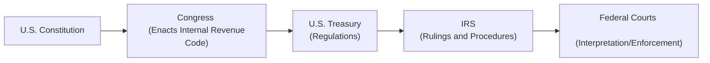

## 2.1 Overview of the U.S. Tax System and Authorities

The U.S. tax system rests on a rich tapestry of legal foundations, including Constitutional authority, statutory provisions, administrative rulings, and an extensive body of case law. Understanding this structure is critical for any aspiring Certified Public Accountant (CPA); it forms the backbone of both tax compliance and tax planning. This section provides an in-depth exploration of the core pillars underpinning federal taxation in the United States, including key legislation such as the Internal Revenue Code (IRC), Treasury Regulations, various types of administrative guidance, and the judiciary’s role in interpreting and applying tax law. 

These concepts are reinforced throughout your exam studies, and a firm grasp of them will greatly enhance your competency in areas ranging from individual taxation to sophisticated entity-level transactions. For further details on how these sources interact in practice, you will find more targeted discussions in later chapters, notably Chapter 5 (see Section 5.5, “Authoritative Hierarchy: Code, Regulations, Rulings”).

  
### Key Constitutional Foundations

The legal basis for the federal income tax is rooted in the U.S. Constitution. While the members of the original Constitutional Convention debated whether the federal government should have the power to levy direct taxes, the modern income tax as we know it was formally authorized by the 16th Amendment in 1913. This amendment not only granted Congress the power to impose taxes on individuals’ income without apportionment among the states, but it also set the stage for the development of the federal tax system.

Prior to the 16th Amendment, taxes were usually derived from customs duties, excise taxes, and occasional direct taxes that required proportional collection across state populations. The 16th Amendment provided Congress significantly more flexibility in raising revenue, leading to the expansive tax framework we see today.

  
### The Internal Revenue Code (IRC)

The Internal Revenue Code (IRC) is the primary statutory authority governing federal taxes. Enacted by Congress, the IRC is codified in Title 26 of the United States Code (U.S.C.) and lays out the rules for what income is subject to tax, allowable deductions, tax credits, penalties, and procedures, among many other provisions.

Because Congress frequently amends the IRC—especially during major overhauls such as the Tax Reform Act of 1986 or the Tax Cuts and Jobs Act of 2017—tax professionals must stay up to date on new legislation. Although large-scale tax reforms receive the most attention, smaller, more incremental changes also appear regularly in annual budget acts or specialized bills addressing certain industries and taxpayer categories.

  
### Treasury Regulations

Once Congress enacts statutory provisions, the U.S. Treasury Department has primary responsibility for interpreting and administering them. To do so, the Treasury, through the Internal Revenue Service (IRS), issues Treasury Regulations:

• Final Regulations: These represent the Treasury’s official interpretation of the IRC provisions. They generally have the full force of law and carry significant authority in tax controversies.  
• Temporary Regulations: Temporary guidance that carries the same binding effect as final regulations for a specific period, often used when urgent or time-sensitive directions are needed. Temporary regulations will eventually expire, be withdrawn, or be re-issued as proposed or final.  
• Proposed Regulations: Issued to elicit public comments and feedback before becoming finalized. Although not as authoritative as final regulations, proposed regulations can provide insight into the Treasury’s intent and future direction for interpreting the IRC.  

In addition to standard rulemaking procedures, the Treasury may amend or revise its Regulations as new facts, cases, or legislative changes arise. Tax advisors routinely consult Treasury Regulations to clarify ambiguous or broad-reaching statutory language.

  
### Administrative Guidance: Rulings and Procedures

The IRS, an agency within the Treasury Department, is responsible for administering and enforcing federal tax law. To facilitate taxpayer compliance and streamline enforcement, the IRS issues a variety of administrative pronouncements:

• Revenue Rulings: Official statements that apply the law to a specific fact pattern, clarifying the IRS’s interpretation and how it would rule in similar situations.Though not as binding as regulations, revenue rulings provide persuasive guidance and can serve as precedents for taxpayers.  
• Revenue Procedures: Statements of internal IRS practices and procedures that typically articulate how taxpayers should comply with particular requirements—such as how to request a private letter ruling or how to file certain forms and elections.  
• Notices and Announcements: More informal, timely releases generally used to provide immediate notifications or clarify emerging issues, often in response to newly enacted legislation or significant changes in precedent.  
• Private Letter Rulings (PLRs): Requested by specific taxpayers to receive guidance tailored to their unique circumstances. While a PLR is binding on the IRS only with respect to the requesting taxpayer, it can offer insight into the IRS’s analytical framework for new or unresolved issues.

Many of these documents can be accessed via the IRS website and are published in the Internal Revenue Bulletin (IRB). When preparing returns and researching critical or nuanced tax questions, referencing these administrative materials is often a crucial step to ensure compliance and to develop a solid tax position.

  
### Judicial Decisions

Even with clear statutes, regulations, and administrative guidance, disputes inevitably arise. When a taxpayer and the IRS disagree, several judicial forums are available to interpret and enforce the tax laws. These courts serve a fundamental role: to review IRS interpretations, examine statutory and regulatory language, and deliver binding rulings.

• U.S. Tax Court: A prepayment forum where taxpayers can challenge IRS determinations without paying the disputed tax. Judges in the Tax Court specialize in federal tax matters, making this forum particularly influential in shaping tax jurisprudence.  
• U.S. District Courts: District courts have jurisdiction over various civil and criminal matters, including tax disputes, but taxpayers typically must pay the tax owed first and then sue for a refund. These courts utilize juries if requested, which can introduce unique litigation strategies.  
• U.S. Court of Federal Claims: This court hears monetary claims against the U.S. Government, including tax refund suits. Like district courts, taxpayers generally must first pay the disputed tax and then pursue a refund.  
• Circuit Courts of Appeals: Parties who lose at trial can appeal to their respective regional circuit court. Circuit courts often resolve conflicting interpretations of tax law among lower courts, shaping broader national tax policy.  
• U.S. Supreme Court: The highest court in the land, whose decisions serve as final authority on federal law, including tax controversies. The Supreme Court generally chooses to hear only a small fraction of tax cases, typically those with wide-reaching implications or inter-circuit conflicts.

Judicial decisions can serve as important precedents, but their scope and binding nature can vary depending on the level of the court and the location of the taxpayer. Professionals must pay close attention to controlling authority, especially if they practice in a specific jurisdiction where local appellate decisions may differ from those in another region.

  
### Hierarchy of Tax Authorities

Because of the multiple levels and types of guidance, a hierarchy of tax authorities has emerged, determining which sources are most binding in the event of conflicting interpretations. Below is a simplified illustration of how these authorities relate to one another:

• The Constitution: The supreme law; all federal tax legislation must be consistent with the Constitution and its amendments, particularly the 16th Amendment.  
• Internal Revenue Code: The principal body of statutory tax law enacted by Congress.  
• Treasury Regulations: The Treasury’s official interpretation of the IRC, carrying considerable legal weight.  
• IRS Guidance (Revenue Rulings, Revenue Procedures, Notices, etc.): Offers insight into how the IRS intends to enforce and administer the law.  
• Judicial Decisions: Resolve conflicts and provide ultimate interpretation of statutory, regulatory, and constitutional arguments within the judicial hierarchy.  

In practice, the highest authority in a tax controversy is the Code as interpreted—when questions arise—by the judiciary. Regulations that conflict with the Code or the Constitution may be invalidated or revised. Lower-level guidance, such as IRS Notices, ensures consistent administrative practice but does not override the clear language of either the Code or the Regulations.

  
### Practical Example: Depreciation Deduction

Imagine a mid-sized manufacturing company that purchases new machinery worth $500,000. The Internal Revenue Code (IRC) includes provisions on how such capital assets must be depreciated over a specific recovery period (e.g., seven years). However, the Code’s language can be broad, prompting the Treasury to issue regulations specifying the applicable depreciation conventions. Further clarifications might appear in an IRS Revenue Procedure describing annual safe harbor methods or thresholds.

• The manufacturing firm checks the IRC for the statutory authority to depreciate business property.  
• Next, it consults the Treasury Regulations to determine the correct depreciation system (e.g., MACRS), the asset class life, and the applicable conventions (half-year, mid-quarter, etc.).  
• Lastly, if it suspects special rules or safe harbors apply (e.g., Section 179 expensing, bonus depreciation), it may look up relevant IRS revenue procedures or notices for guidance. If the rules remain ambiguous or the company’s situation is highly specialized, it can request a Private Letter Ruling for further clarity on how the IRS would apply the law to its specific facts.

  
### Real-World Scenario: Conflicting Interpretations

Suppose an innovative technology start-up claims a particular research and development (R&D) tax credit under the IRC. The IRS reviews the start-up’s claim and disputes the qualification of certain expenses. The taxpayer references a Revenue Ruling that appears to support its position. However, the IRS contends that the controlling regulation on R&D expenditures excludes the type of work the start-up is doing.

In response, the taxpayer cites a more recent Tax Court case that seems to confirm its broader interpretation of “qualified research expenses.” In such a dispute, determining the correct outcome involves evaluating:

• Existing statutory language in the IRC.  
• Any final Treasury Regulations that exist regarding R&D tax credits.  
• IRS administrative guidance, such as the relevant Revenue Ruling.  
• Pertinent court decisions—especially if there is a Tax Court ruling specifically addressing analogous facts.  

If the parties cannot resolve their disagreement administratively, the matter could escalate to trial in a prepayment forum, like the U.S. Tax Court, or via refund litigation after paying the disputed amount in a U.S. District Court or the Court of Federal Claims.

  
### Common Pitfalls and Challenges

• Overlooking New Legislation: Given that the IRC is frequently updated, failing to consider recent tax acts or “extender” bills is a common error.  
• Misconstruing Treasury Regulations: Regulations can be highly detailed and technical; interpreting them inaccurately can lead to under- or over-reporting of tax liability.  
• Confusing Binding vs. Persuasive Authority: A taxpayer might incorrectly rely on a Private Letter Ruling, which is binding only for the requesting taxpayer, or on a Revenue Ruling that has been superseded by updated guidance or case law.  
• Ignoring Jurisdictional Nuances: Court decisions are binding within their jurisdiction; a ruling from one circuit may only be persuasive in another, unless the Supreme Court or the IRC clarifies the matter universally.  
• Failing to Seek Timely Professional Advice: Complex transactions often require specialized analysis. Deferring professional input can exacerbate compliance issues.  

  
### Best Practices

• Monitor Legislative Changes: Stay informed through channels like the Congressional website (congress.gov), major tax periodicals, and the IRS newsroom.  
• Cross-Check Multiple Authorities: Always read statutory language in tandem with relevant Treasury Regulations and updated IRS guidance.  
• Document Research Thoroughly: Whether you’re preparing a return or advising a client, maintain records of the authority you relied upon, especially if your position is potentially controversial.  
• Seek Specialized Counsel for Unique Situations: Complex transactions, like mergers, cross-border operations, or novel business models, often warrant expert opinions or private letter rulings.  
• Understand Your Judicial Options: When facing an audit or controversy, be aware of your options for appealing or litigating in the chosen forum.  

  
### Additional Resources for Deeper Exploration

• Internal Revenue Code (Title 26, U.S.C.): The definitive statutory foundation.  
• U.S. Treasury Regulations (Title 26, Code of Federal Regulations): Official interpretations of the IRC.  
• IRS Website (irs.gov): Provides access to Revenue Rulings, Revenue Procedures, Notices, and other guidance.  
• Internal Revenue Bulletin (IRB): Weekly publication of the IRS containing newly issued rulings, procedures, notices, and other announcements.  
• Court Cases and Commentary: Tax Court opinions, District Court rulings, and Circuit Court decisions can often be found in public court databases or summarized by tax research services like Thomson Reuters Checkpoint, CCH IntelliConnect, or Bloomberg Tax.

  
### Conclusion

The U.S. tax system is founded upon a hierarchy of authority that includes the Constitution, the Internal Revenue Code, Treasury Regulations, administrative rulings, and judicial decisions. Navigating this system effectively requires both a conceptual understanding—of how these sources interact—and practical skills in researching, interpreting, and applying the law. By mastering the high-level structure introduced here, you will be well-positioned to address more specialized or complex tax matters in both your CPA exam preparation and your professional practice.

Remember that success in tax hinges on staying informed and agile in response to evolving legislative and administrative changes. Develop a strong research methodology, consult multiple sources, and remain vigilant for potential conflicts among different authorities. Above all, strive for consistent accuracy to uphold the public trust inherent in the accounting profession.

  
## Quiz: U.S. Tax System and Authorities



### Which constitutional amendment granted Congress the power to impose an income tax without apportionment among the states?

- [ ] The Fifth Amendment
- [ ] The First Amendment
- [x] The Sixteenth Amendment
- [ ] The Tenth Amendment

> **Explanation:** The 16th Amendment, ratified in 1913, gave Congress the authority to impose federal income taxes without dividing them proportionally among the states.

### Which statutory source is considered the primary body of federal tax law in the United States?

- [ ] Treasury Regulations
- [x] The Internal Revenue Code (Title 26 of the U.S.C.)
- [ ] Revenue Rulings
- [ ] Tax Court cases

> **Explanation:** The Internal Revenue Code (IRC) is the principal statutory authority for federal taxation and is codified in Title 26 of the U.S. Code.

### How are Treasury Regulations typically regarded in comparison to the Internal Revenue Code?

- [x] Regulations must conform to the Code but carry significant authority when interpreting the Code.
- [ ] Regulations are always more authoritative than the Code.
- [ ] Regulations are optional guidelines with no legal standing.
- [ ] Regulations overrule final judicial decisions if issued in final form.

> **Explanation:** Treasury Regulations must follow and cannot contradict the IRC. They have substantial legal weight but cannot override the IRC itself or judicial rulings.

### Which statement best describes the nature of Revenue Rulings?

- [ ] They are binding only on the taxpayer who requests them.
- [ ] They are unbinding statements of IRS opinion.
- [x] They are official IRS positions applying tax law to a specific set of facts, offering persuasive authority for other taxpayers in similar situations.
- [ ] They automatically become part of the IRC upon issuance.

> **Explanation:** Revenue Rulings interpret the tax law as applied to particular fact patterns. While they carry weight and guide similar cases, they are not legally equivalent to statutes or final regulations.

### If a taxpayer seeks a customized IRS ruling specific to their unusual fact pattern, which type of guidance should they request?

- [ ] Proposed Regulations
- [x] Private Letter Ruling (PLR)
- [ ] Revenue Ruling
- [ ] Revenue Procedure

> **Explanation:** Private Letter Rulings are issued by the IRS in response to a taxpayer’s unique factual situation, offering direct insight into how the IRS will interpret and apply the rules.  

### Which court typically allows a taxpayer to dispute a tax deficiency before paying the disputed amount?

- [x] U.S. Tax Court
- [ ] U.S. Court of Federal Claims
- [ ] Federal Circuit Court of Appeals
- [ ] U.S. District Court

> **Explanation:** The U.S. Tax Court lets taxpayers challenge the IRS’s determinations without paying the tax upfront, in contrast to most other courts.

### How do you classify the hierarchy of authority in a tax dispute, starting from the highest?

- [x] Constitution → Internal Revenue Code → Treasury Regulations → IRS Guidance → Judicial Decisions
- [ ] Internal Revenue Code → Constitution → Treasury Regulations → Judicial Decisions → IRS Guidance
- [ ] Judicial Decisions → Internal Revenue Code → Constitution → IRS Guidance → Treasury Regulations
- [ ] IRS Guidance → Treasury Regulations → Internal Revenue Code → Constitution → Judicial Decisions

> **Explanation:** The Constitution is the supreme law, followed by the IRC. Treasury Regulations interpret the IRC, while IRS guidance interprets and administers these statutes and regulations. Judicial decisions ultimately resolve disputes based on constitutionality and statutory interpretation.

### Which of the following is TRUE about the binding effects of a Private Letter Ruling (PLR)?

- [x] It is binding only on the IRS and the taxpayer who requested it.
- [ ] It is binding on all taxpayers who meet similar facts.
- [ ] It supersedes the Internal Revenue Code if issued by the Commissioner.
- [ ] It has no binding authority and is merely an opinion.

> **Explanation:** PLRs offer binding guidance only for the particular taxpayer who requested the ruling for a specific factual situation, although they can provide insight into the IRS’s thinking on an issue.

### Which source has primary authority in interpreting ambiguous statutory language from the Internal Revenue Code?

- [ ] Revenue Procedures
- [x] Treasury Regulations
- [ ] Proposed Legislation
- [ ] Private Letter Rulings

> **Explanation:** Treasury Regulations are promulgated by the Treasury Department to clarify statutory language in the IRC, and they carry substantial legal weight unless successfully challenged in court.

### The Supreme Court is best described as:

- [x] True
- [ ] False

> **Explanation:** The Supreme Court of the United States is indeed the nation’s highest judicial authority. It exerts final say on interpreting constitutional and federal issues, including tax controversies.



## For Additional Practice and Deeper Preparation

### [Taxation & Regulation (REG) CPA Mock Exams](https://www.udemy.com/course/reg-cpa-mock-exams/?referralCode=55419EBD198F61530B12)

Taxation & Regulation (REG) CPA Mocks: 6 Full (1,500 Qs), Harder Than Real! In-Depth & Clear. Crush With Confidence!

- Tackle full-length mock exams designed to mirror real REG questions.  
- Refine your exam-day strategies with detailed, step-by-step solutions for every scenario.  
- Explore in-depth rationales that reinforce higher-level concepts, giving you an edge on test day.  
- Boost confidence and minimize anxiety by mastering every corner of the REG blueprint.  
- Perfect for those seeking exceptionally hard mocks and real-world readiness.  

_Disclaimer: This course is not endorsed by or affiliated with the AICPA, NASBA, or any official CPA Examination authority. All content is for educational and preparatory purposes only._
