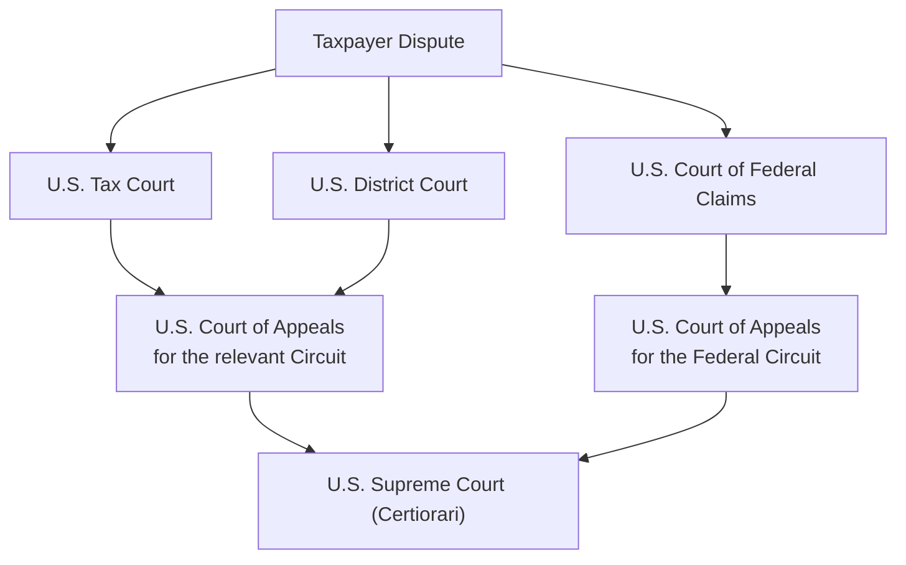

## 2.2 Structure of the U.S. Court System for Tax Litigation

The U.S. court system for federal tax disputes can appear complex to those unfamiliar with its hierarchy and distinct procedural rules. Depending on the nature of the dispute, taxpayers have different court venues available, each with its own advantages, disadvantages, and appeals processes. This section focuses on the principal federal courts where taxpayers might find themselves litigating a tax issue: the U.S. Tax Court, U.S. District Courts, the U.S. Court of Federal Claims, and the U.S. Courts of Appeals. Ultimately, the Supreme Court, under limited circumstances, can review appeals arising from these courts. Understanding these courts’ unique attributes is crucial both for exam success and for sound tax practice.

--------------------------------------------------------------------------------
### Overview of Federal Tax Litigation Path

Before exploring each specific court, it’s helpful to see the basic steps of a tax controversy. Typically, a dispute arises when the Internal Revenue Service (IRS) adjusts or disallows certain items on a taxpayer’s return. The taxpayer can either:
• Pay the assessed tax, file a claim for refund, and if the refund is denied, initiate litigation in either a U.S. District Court or the U.S. Court of Federal Claims.  
• Elect not to pay the disputed tax upfront and instead petition the U.S. Tax Court to resolve the deficiency.

From these trial-level courts, appeals can be taken to the appropriate Circuit Court of Appeals, and in rare cases, to the U.S. Supreme Court.

--------------------------------------------------------------------------------
### U.S. Tax Court

One of the most commonly utilized forums for tax litigation is the U.S. Tax Court. Established by Congress, the U.S. Tax Court specializes in resolving disputes over federal income, estate, and gift taxes before the taxpayer pays the contested amount.

#### Background and Jurisdiction
• The Tax Court originated as the Board of Tax Appeals in 1924 and was later reconstituted as the U.S. Tax Court in 1969.  
• The Tax Court’s jurisdiction includes hearing issues involving income tax, estate tax, gift tax, and certain excise taxes.  
• Typically, taxpayers may file a petition with the Tax Court after receiving a notice of deficiency from the IRS (the “90-day letter”).  

#### Advantages of the Tax Court
• Taxpayers do not have to pay the disputed amount before trial.  
• All 19 judges specialize in tax law, ensuring that the bench has considerable expertise.  
• Special trial sessions called “S-Case” or “Small Tax Case” procedures are available for disputes typically involving $50,000 or less for any given tax year, offering a more informal and streamlined process.

#### Procedure and Document Filings
• The taxpayer commences the action by filing a petition.  
• The IRS then submits an “answer” disputing or admitting the allegations in the petition.  
• The burden of proof generally rests on the taxpayer, although in certain circumstances—such as issues of factual correctness where the taxpayer has complied with certain record-keeping requirements—the burden may shift to the IRS.

#### Appeal Process from the Tax Court
Decisions of the U.S. Tax Court can be appealed to the U.S. Court of Appeals for the circuit in which the taxpayer is located. If the case was tried as a “small tax case,” the decision is final and not appealable. 

--------------------------------------------------------------------------------
### U.S. District Courts

U.S. District Courts are the general trial courts of the federal judicial system. Each state (and some territories) has at least one District Court. For tax cases, taxpayers typically must pay the assessed tax in full and then file a claim for refund with the IRS before initiating their case in District Court.

#### Primary Characteristics
• Broad Jurisdiction: While District Courts handle civil and criminal cases of all kinds, they also offer a venue for refund suits after the taxpayer has fully paid the disputed tax.  
• Right to a Jury Trial: Unlike in the U.S. Tax Court, plaintiffs can request a jury trial in District Court. This can sometimes be strategically advantageous if the taxpayer believes a jury might be more sympathetic to their arguments.  
• Precedent: District Courts follow their respective Circuit Court of Appeals. The decision from a District Court has persuasive authority only within that district unless affirmed by the corresponding Circuit Court.

#### Steps to Litigate a Refund Case in District Court
1. Full Payment: The taxpayer pays the entire tax liability and related penalties.  
2. Refund Claim: The taxpayer files a claim for a refund with the IRS.  
3. Denial or No Response: If the IRS denies the claim (or fails to respond within six months), the taxpayer may file suit in the appropriate U.S. District Court.  

#### Appeals
A District Court decision can be appealed to the U.S. Court of Appeals for the circuit in which that District Court is located. Appeals are based on the trial record, and no new evidence is typically introduced at the appellate stage.

--------------------------------------------------------------------------------
### U.S. Court of Federal Claims

Another venue for “refund suits” is the U.S. Court of Federal Claims (formerly known as the U.S. Claims Court). This court is located in Washington, D.C., and has nationwide jurisdiction over monetary claims against the federal government, including tax refund claims.

#### Key Features
• Payment Requirement: Similar to a District Court refund suit, taxpayers must pay the tax liability first and then file a claim for a refund.  
• Judges: The Court of Federal Claims’ judges focus on a variety of monetary disputes against the United States, not exclusively on tax matters. However, they are experienced in complex federal claims.  
• No Jury Trials: Trials here are bench trials, not jury trials.

#### Appeals
Decisions from the U.S. Court of Federal Claims are appealed to the U.S. Court of Appeals for the Federal Circuit. This specialized appellate court handles legal issues such as patents, international trade, and federal claims, including tax. From there, taxpayers can seek review by the U.S. Supreme Court through a petition for a writ of certiorari.

--------------------------------------------------------------------------------
### U.S. Courts of Appeals (Circuit Courts)

Depending on the trial venue, appeals from the U.S. Tax Court and District Courts go to one of the 12 regional Circuit Courts of Appeals. Because the U.S. Court of Federal Claims is covered by the U.S. Court of Appeals for the Federal Circuit, that specialized court hears its appeals. Each Court of Appeals sets binding precedent for the federal courts within its territory.

#### Role of the Circuit Courts
• Appellate Review: They examine the trial record to identify any errors in the court’s application of law or, in some instances, errors in fact-finding. They do not typically hear new evidence.  
• Different Circuits, Different Precedents: Because different circuits might rule differently on the same legal question, forum selection can play a significant role in the ultimate outcome of a case.  
• Establishing Precedent: If circuits align in their findings, that can create a uniform approach, but if circuits split, the disagreement can set the stage for possible U.S. Supreme Court review.

--------------------------------------------------------------------------------
### U.S. Supreme Court

As the highest court in the United States, the Supreme Court has the discretion to decide which cases to hear, typically by granting writs of certiorari. It will only take a small fraction of the tax cases petitioned for review, usually when there is a compelling legal question or a “circuit split” demanding nationwide uniformity. Once the Supreme Court rules on an issue, that ruling is binding on all lower courts.

--------------------------------------------------------------------------------
### Diagram: Federal Tax Litigation Hierarchy

Below is a simplified overview of how a tax litigation matter may proceed through the court system. Depending on the court of original jurisdiction, the path of appeal may differ.

--------------------------------------------------------------------------------
### Choosing the Right Forum

Taxpayers often face a strategic choice when deciding where to litigate their dispute. Some key considerations include:

• Payment vs. Non-Payment: The U.S. Tax Court is generally the only option for disputing a liability before paying. District Courts and the Court of Federal Claims require upfront payment.  
• Jury Trial: Only District Courts permit jury trials. Tax Court and the Court of Federal Claims do not.  
• Location and Convenience: District Courts exist across the country, but proceedings before the U.S. Tax Court also can be held in various locations. The Court of Federal Claims sits in Washington, D.C. but may travel to hear cases.  
• Precedent: Circuit-level precedent can differ from one region to another, leading to potential “forum shopping” depending on favorable or unfavorable case law.

--------------------------------------------------------------------------------
### Real-World Example

Imagine a taxpayer, Barbara, who receives a Notice of Deficiency asserting that she owes an additional $50,000 in income tax due to disputed business expense deductions. Barbara has two main options:

1. **File a Petition in the U.S. Tax Court**  
   • She will not have to pay the $50,000 upfront.  
   • She will face a tax law specialist judge who will decide her case.  
   • She can still appeal an adverse decision to the Court of Appeals for her circuit.

2. **Pay the $50,000 First and Sue for a Refund**  
   • She can choose to file a refund suit in her local District Court, which offers the possibility of a jury trial, or in the U.S. Court of Federal Claims, which has no jury but specialized expertise in monetary claims.  
   • If unsuccessful, she can appeal to either the Court of Appeals for her circuit (District Court route) or the Federal Circuit (Court of Federal Claims route).  

Barbara’s choice may hinge on her desire for a jury trial, any particular law that might be more favorable in her circuit, and the need to preserve cash flow rather than paying the contested amount upfront.

--------------------------------------------------------------------------------
### Common Pitfalls and Best Practices

• **Failing to Understand Prepayment Requirements:** Choosing a court without realizing the requirement to pay or not pay the assessed liability can lead to major financial and procedural complications.  
• **Neglecting to File Refund Claims Properly:** Taxpayers sometimes skip or mishandle the administrative claim process. An improperly filed claim can result in the court lacking jurisdiction.  
• **Deadlines and Statutes of Limitation:** Missing the 90-day window to file a petition with the Tax Court can force a taxpayer into paying the tax first and seeking a refund—a totally different procedural path.  
• **Burden of Proof:** Generally, the burden remains on the taxpayer, although certain exceptions (e.g., for specific factual issues under Section 7491 of the Internal Revenue Code) shift the burden to the IRS.  
• **Forum Shopping Risks:** While searching for favorable precedent can be an advantage, it must align with personal jurisdiction considerations and strategic objectives. Courts also disfavor transparent “abuse” of forum selection.  

--------------------------------------------------------------------------------
### References and Further Exploration

• IRS Publication 556: Examination of Returns, Appeal Rights, and Claims for Refund.  
• “Civil Tax Procedure” by Camilla E. Watson and Brock J. Collins for deeper insight into tax litigation strategies.  
• Internal Revenue Code (IRC), especially sections dealing with deficiency procedures (IRC §6212-§6214).  
• The Judiciary and Judicial Procedure sections of the United States Code, Title 28.  

By understanding the interplay between these forums and the intricate appellate paths, CPAs can help clients or employers navigate tax disputes more strategically. The U.S. court system for tax litigation—while nuanced—follows logical procedures allowing taxpayers multiple avenues for resolving controversies.

--------------------------------------------------------------------------------

## Master Your Knowledge of Tax Court Structure: 10-Question Quiz



### Which court allows a taxpayer to dispute a tax deficiency without paying the assessed amount first?

- [x] U.S. Tax Court
- [ ] U.S. District Court
- [ ] U.S. Court of Federal Claims
- [ ] U.S. Supreme Court

> **Explanation:** The U.S. Tax Court is unique because it allows taxpayers to challenge a deficiency without paying the disputed tax first.

### Which of the following statements is TRUE regarding U.S. District Courts?

- [ ] They only hear tax cases.
- [x] Taxpayers must pay the disputed amount before suing for a refund in District Court.
- [ ] Judge decisions in District Courts are binding nationwide.
- [ ] District Court judges are tax specialists.

> **Explanation:** For tax refund cases in a U.S. District Court, the taxpayer must fully pay the assessment first and file a claim for a refund.

### When appealing a decision from the U.S. Court of Federal Claims, to which court does the appeal go first?

- [ ] U.S. Supreme Court
- [ ] U.S. Court of Appeals for the taxpayer’s local circuit
- [x] U.S. Court of Appeals for the Federal Circuit
- [ ] U.S. Court of Tax Appeals

> **Explanation:** The Court of Federal Claims is within the appellate jurisdiction of the U.S. Court of Appeals for the Federal Circuit.

### What is the primary function of the U.S. Courts of Appeals?

- [x] Reviewing lower court decisions for errors of law
- [ ] Conducting jury trials for higher stakes tax disputes
- [ ] Establishing nation-wide uniform commercial codes
- [ ] Overseeing criminal cases only

> **Explanation:** The Courts of Appeals review the record from trial courts (or administrative agencies) and determine if any legal errors occurred, often focusing on whether the lower court correctly applied the law.

### Which of the following best describes the “S” case procedure in Tax Court?

- [x] A simpler, informal procedure for smaller disputes (under $50,000)
- [ ] A specialized procedure for only corporate tax cases
- [x] A procedure that limits appeal rights after the Tax Court decision
- [ ] A mandatory procedure for any dispute above $100,000

> **Explanation:** The “S” case or small tax case procedure applies to relatively modest deficiencies. While it simplifies proceedings, decisions are usually not appealable.

### Which court requires an administrative claim for refund before filing suit?

- [x] U.S. District Court
- [x] U.S. Court of Federal Claims
- [ ] U.S. Supreme Court
- [ ] U.S. Tax Court

> **Explanation:** Both U.S. District Courts and the U.S. Court of Federal Claims require taxpayers to file a formal refund claim (and typically pay the disputed amount) before pursuing litigation.

### Which of the following is a key advantage of litigating in a U.S. District Court?

- [x] Availability of a jury trial
- [ ] No prepayment of taxes required
- [x] Ability to choose any district in any state for strategic reasons
- [ ] Binding precedent over all other federal courts

> **Explanation:** U.S. District Courts are the only federal courts in tax litigation that offer the possibility of a jury trial, which can be an advantage if the taxpayer prefers a jury of peers.

### A notice of deficiency is typically associated with which court?

- [x] U.S. Tax Court
- [ ] U.S. Court of Federal Claims
- [ ] U.S. District Court
- [ ] Federal Circuit Court

> **Explanation:** A notice of deficiency (90-day letter) is the key to petitioning the U.S. Tax Court without having to pay the disputed amount first.

### Which statement about the U.S. Supreme Court in tax cases is correct?

- [x] It hears relatively few tax cases, often limited to national importance or circuit splits.
- [ ] It automatically reviews all Tax Court decisions over $1 million.
- [ ] It functions as the court of first impression for large tax controversies.
- [ ] It must hear at least 50 tax cases per term.

> **Explanation:** The Supreme Court only accepts a small fraction of the tax petitions via a writ of certiorari, typically focusing on cases that raise substantial legal questions or resolve conflicting precedents among circuits.

### The U.S. Tax Court was originally known as:

- [x] The Board of Tax Appeals
- [ ] The Court of Public Appeals
- [ ] The Internal Revenue Board
- [ ] The Federal Tax Commission

> **Explanation:** The U.S. Tax Court originated as the Board of Tax Appeals prior to its reestablishment and renaming.



--------------------------------------------------------------------------------

## For Additional Practice and Deeper Preparation

### [Taxation & Regulation (REG) CPA Mock Exams](https://www.udemy.com/course/reg-cpa-mock-exams/?referralCode=55419EBD198F61530B12)

Taxation & Regulation (REG) CPA Mocks: 6 Full (1,500 Qs), Harder Than Real! In-Depth & Clear. Crush With Confidence!

- Tackle full-length mock exams designed to mirror real REG questions.  
- Refine your exam-day strategies with detailed, step-by-step solutions for every scenario.  
- Explore in-depth rationales that reinforce higher-level concepts, giving you an edge on test day.  
- Boost confidence and minimize anxiety by mastering every corner of the REG blueprint.  
- Perfect for those seeking exceptionally hard mocks and real-world readiness.

_Disclaimer: This course is not endorsed by or affiliated with the AICPA, NASBA, or any official CPA Examination authority. All content is for educational and preparatory purposes only._
