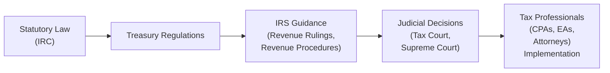

## 2.3 Sources of Law in Business and Tax (Statute, Regulation, Case Law)

Legal and tax professionals—particularly Certified Public Accountant (CPA) candidates—must thoroughly understand the hierarchy and interplay among the various sources of business and tax law. In the United States, the regulatory framework comprises multiple layers, including federal statutes enacted by Congress, regulations issued by administrative agencies, and case law established through judicial decisions. A solid comprehension of these sources is essential not only to pass the REG section of the Uniform CPA Examination but also to ensure adherence to best practices in business and tax matters. 

This section explores and illustrates the main conduits of authority—statutory law, administrative regulations, and judicial precedents—shedding light on their interaction, hierarchy, and practical significance for day-to-day compliance and strategic tax planning.

### Importance of Understanding Different Sources of Law

Professionals involved in tax and business advisory are regularly called upon to integrate rules from several levels of authority. Effective decision-making, compliance, and representation of clients hinge on the correct application of these rules. For example, a statutory provision from the Internal Revenue Code (IRC) may provide a broad directive, which is later refined by Treasury regulations that further clarify specific aspects. If ambiguity remains, judicial interpretations can offer additional perspective, creating binding precedents for subsequent cases. Mastering these layers promotes accuracy, reduces risk, and supports professional integrity.

### Statutory Law: The Foundation of Business and Tax

Statutory law is composed of acts passed by legislative bodies—principally, the United States Congress at the federal level. These acts lay the groundwork for legal and tax obligations.

#### Internal Revenue Code (IRC)

Central to U.S. tax law is the Internal Revenue Code (IRC), codified in Title 26 of the United States Code. The IRC is the primary reference for understanding the computation, payment, and enforcement of federal taxes. It addresses a wide range of topics:

• Income Tax (Individuals, Corporations, Estates, Trusts)  
• Employment Taxation  
• Excise Taxes  
• Special Provisions for Retirement Accounts (IRAs, 401(k) Plans)  
• International Tax Considerations (Subpart F, GILTI, FDII)

For instance, IRC Section 61 defines gross income broadly, stating that “gross income means all income from whatever source derived.” This broad statutory definition is subsequently interpreted and narrowed by regulations and various court decisions to clarify items that are taxable or excluded from taxable income.

#### Other Statutory Authorities in Business Law

Beyond the IRC, several federal statutes and state-level statutes govern business formations, transactions, and responsibilities, including:

• Securities Laws (e.g., Securities Act of 1933, Securities Exchange Act of 1934)  
• Uniform Commercial Code (UCC), as adopted by state legislatures  
• Employment and Labor Laws (Fair Labor Standards Act, state wage & hour laws)  
• Bankruptcy Code (Title 11 of the United States Code)

Each area influences tax obligations (for instance, how securities transactions are taxed) and shapes the broader legal environment in which businesses operate.

### Administrative Regulations

While statutes are the law as written by Congress, administrative regulations articulate more precise operational rules and guidelines necessary for implementation. Regulations carry the force of law within the scope delegated by the statute.

#### Treasury Regulations

If the IRC creates the foundation, Treasury regulations offer the structural framework. Issued by the U.S. Department of the Treasury and the Internal Revenue Service (IRS), these regulations take several forms:

• Final Regulations: These hold the highest regulatory authority and are integrated into the Code of Federal Regulations (CFR) after extensive drafting, public commentary, and review processes.  
• Temporary Regulations: These are published as Treasury Decisions (T.D.) to provide immediate guidance. Usually effective upon issuance but with a limited duration (commonly three years).  
• Proposed Regulations: Issued to invite public input before final versions are enacted. Proposed regulations do not have the full force of law but indicate the IRS’s current position or thinking on a matter.

For example, IRC Section 179 allows businesses to expense certain property rather than capitalize and depreciate it. Treasury regulations for Section 179 interpret qualifying assets, outline limits, define scope of “placed in service,” and confirm recordkeeping requirements.

#### Other Forms of IRS Guidance

In addition to regulations, the IRS releases various types of guidance to help taxpayers and practitioners interpret statutory provisions:

• Revenue Rulings: Official interpretations by the IRS on how the law applies to specific factual situations. They can be cited as precedent for similar circumstances.  
• Revenue Procedures: Provide instructions for compliance with specific procedural or administrative matters.  
• Private Letter Rulings (PLRs): Issued in response to individual taxpayer requests for clarification on contemplated transactions. PLRs apply only to the taxpayer requesting the ruling and carry no precedential weight for others.  
• Technical Advice Memoranda (TAMs) and Field Service Advice (FSA): Used internally for complex audit or litigation assistance. These are insight into the IRS’s stance but are not binding on other taxpayers.

### Judicial Authority (Case Law)

Cases are decided in courts when disputes arise over the interpretation of statutes or regulations. Judicial decisions create precedents that guide practitioners and taxpayers on how to apply or interpret the law. The U.S. court system has multiple levels relevant to tax controversies and business disputes.

#### Hierarchy of Courts and Precedential Weight

• U.S. Tax Court: Specializes in federal tax disputes. Taxpayers can file a case in Tax Court without paying the disputed tax first, making it a popular venue. Decisions may be regular or memorandum. Regular decisions address novel points of law, while memorandum decisions apply existing law to fact patterns.  
• U.S. District Courts: Hear both civil and criminal cases at the federal level. Tax cases can be brought after the taxpayer pays the disputed tax and requests a refund.  
• U.S. Court of Federal Claims: Another venue where taxpayers can bring refund suits, often focusing on large or complex tax disputes.  
• U.S. Circuit Courts of Appeals: Appeals from the Tax Court, District Courts, or Court of Federal Claims are heard here. A Circuit Court’s decision binds courts within that circuit.  
• U.S. Supreme Court: The highest judicial authority. Its decisions bind all lower courts on federal law issues.

When a Tax Court decision conflicts with a District Court decision, or when circuit splits occur, the Supreme Court may eventually resolve the discrepancy. If the Supreme Court denies certiorari, the underlying circuit decision remains controlling only in that circuit.

#### Influential Case Examples

• Commissioner v. Glenshaw Glass Co. (1955): Clarified that “gross income” includes undeniable accessions to wealth, clearly realized, over which the taxpayer has complete dominion.  
• Gregory v. Helvering (1935): Established substance-over-form principles, enabling the IRS and courts to look beyond the legal form of transactions to their underlying substance.  
• Welch v. Helvering (1933): Set foundational guidelines on the deductibility of ordinary and necessary business expenses.  
• Lucas v. Earl (1930): Spousal income assignment was not permitted to avoid taxation under the “assignment-of-income” doctrine.

### Interaction and Hierarchy Among Sources

Understanding the relative weight of each source is crucial. Although the IRC sits atop the tax hierarchy, there are nuances to how each authority is applied:

Statutory law (the IRC) provides the broad mandates. Treasury regulations expand upon those mandates when Congress delegates regulatory authority to the Secretary of the Treasury. Other administrative pronouncements, such as Revenue Rulings and IRS Notices, interpret specific questions within the scope of regulations. Case law clarifies ambiguities, resolves disputes, and may invalidate or uphold regulations. Practitioners must be mindful of how to cite each authority and the weight that each command in controversies.

### Case Study: Depreciation Deductions

Consider a taxpayer who purchases machinery for a manufacturing business. The applicable authorities might include:

• IRC Sections 167, 168 (statutory provisions for depreciation).  
• Treasury Regulations under Section 168 prescribing class lives, conventions (half-year, mid-quarter), and bonus depreciation eligibility.  
• Revenue Rulings clarifying how specific items (e.g., specialized manufacturing machinery) are classified and how to depreciate them.  
• Judicial rulings that interpret whether certain property meets the definition of “qualified property.”

If any confusion arises—e.g., whether the machinery is personal property eligible for five-year depreciation or structural property under 39-year rules—the taxpayer or CPA might check relevant regulations and rulings. If the dispute still cannot be resolved, the parties might litigate in Tax Court or District Court, where prior judicial decisions could be pivotal.

### Case Study: Corporate Distributions and Dividends

When corporate shareholders receive distributions, determining whether those distributions constitute dividends, returns of capital, or capital gains hinges on multiple referenced authorities:

• IRC Sections 301–317 define corporate distributions and dividends.  
• Treasury Regulations illustrate allocation among earnings and profits, basis recovery, and capital gain.  
• Case law, including rulings on disguised sales of stock, constructive dividends, and recharacterizations, can shape the outcome.  
• IRS guidance in the form of Revenue Rulings or Private Letter Rulings might discuss specific structures, especially for previously unaddressed or emerging scenarios.

Through consistent referencing across these sources, a CPA accurately identifies the tax treatment of distributions and avoids compliance pitfalls.

### Best Practices and Common Pitfalls

Best Practices  
• Start with the statute. Always read the IRC provision that applies to a given transaction or issue. This clarifies the underlying legislative intent.  
• Consult final regulations and rulings. These typically provide detailed guidelines, safe harbors, and examples that reduce guesswork.  
• Recognize regional differences in case law. A decision by the Fifth Circuit Court of Appeals does not automatically control in the Ninth Circuit, unless the Supreme Court has considered the same issue.  
• Document your sources. In the event of an audit, referencing authoritative primary sources (IRC, Treasury regulations, and controlling case law) is critical to defending positions.

Common Pitfalls  
• Over-reliance on non-authoritative guidance. Blog posts, practitioner guides, or informal IRS statements (like IRS FAQs) lack the force of law and can be incomplete or outdated.  
• Ignoring differences in effective dates. Proposed or temporary regulations may have varying effective dates. Final regulations sometimes differ significantly from earlier proposals.  
• Misapplication of case law that isn’t controlling in your jurisdiction. Thorough research is essential to confirm if a ruling applies where your client resides or conducts business.  
• Failing to note legislative amendments. Congress periodically modifies the IRC (for instance, the Tax Cuts and Jobs Act of 2017 introduced sweeping changes), rendering older regulations partially or wholly obsolete.

### Strategies for Navigating Ambiguities

Tax law frequently involves gray areas where legislative text is sparse, regulations are outdated, or courts haven’t provided definitive guidance. Strategies include:

• Reviewing Proposed or Temporary Regulations for the IRS’s current stance.  
• Examining analogous Revenue Rulings or TAMs.  
• Seeking a Private Letter Ruling if a transaction is high-stakes or novel, recognizing it only applies to the taxpayer who requests it.  
• Staying updated on legislative changes and new case decisions, especially if representing clients in specialized industries (e.g., cryptocurrency taxation, emerging technologies in health care).

### Practical Tips for CPA Candidates

• During your exam preparation, remember that substantial authority depends on citations to the IRC, Treasury regulations, official IRS guidance, and controlling case law.  
• Practice reading actual statutes and regulations instead of summaries alone. Familiarity with primary sources builds critical exam-day confidence.  
• Use fact patterns to systematically apply the correct source. Identify the relevant IRC section, check final regulations, see if any relevant case or revenue ruling modifies interpretation, and conclude.  
• Keep track of the effective dates. Answering exam questions accurately often requires discerning which version of the law or regulation applies to a given scenario.

### Conclusion

A robust grasp of the different sources of law governing business and tax is crucial for effective advice, accurate compliance, and strong exam performance. Statutory authority, Treasury regulations, and judicial precedents form an interlocking framework in which CPAs must operate skillfully. By cultivating a methodical approach—starting with the Internal Revenue Code, progressing through administrative regulations, and checking case law for interpretive guidance—CPA candidates and practitioners can ensure they remain aligned with both the letter and spirit of the law. Research proficiency and awareness of authoritative hierarchy will prove invaluable, whether preparing for the REG exam or navigating complex real-world transactions.

## Test Your Knowledge: Comprehensive Sources of Law for Tax & Business Quiz



### Under which title of the United States Code is the Internal Revenue Code codified?

- [ ] Title 11
- [ ] Title 18
- [x] Title 26
- [ ] Title 50

> **Explanation:** The Internal Revenue Code (IRC) is organized in Title 26 of the United States Code, which covers all federal tax statutes.

### Which authority primarily interprets the Internal Revenue Code through detailed rules and examples?

- [ ] The U.S. Supreme Court
- [x] Treasury Regulations
- [ ] District Courts
- [ ] Private Letter Rulings

> **Explanation:** Treasury Regulations are issued by the Treasury Department/IRS to provide detailed guidance on how to implement and interpret statutes passed by Congress.

### A “Temporary Regulation” issued by the IRS:

- [ ] Has no force of law
- [x] Has immediate effect, often lasting for a limited time
- [ ] Is invalid until confirmed by the Supreme Court
- [ ] Is a mere advisory notice to CPAs

> **Explanation:** Temporary Regulations generally carry the same binding authority as final regulations but only for a specified limited period (often three years) and may be subject to change.

### Which of the following constitutes substantial authority when defending a tax position?

- [ ] An article in a business magazine
- [x] A U.S. Tax Court regular decision that directly addresses the taxpayer’s situation
- [ ] Opinions of non-legal experts on social media
- [ ] A tax software help file

> **Explanation:** A U.S. Tax Court regular decision is considered a primary authority, carrying precedential value for tax positions.

### Revenue Rulings:

- [x] Interpret how the law applies to a given set of facts
- [ ] Are strictly hypothetical without any binding power
- [x] May be cited as precedent for substantially similar fact patterns
- [ ] Carry no more authority than general website FAQs

> **Explanation:** Revenue Rulings are official IRS interpretations and can be relied upon for authority if the taxpayer’s facts and circumstances align closely with those addressed in the ruling.

### Which court typically hears federal tax disputes without requiring the taxpayer to pay the disputed tax first?

- [ ] U.S. District Court
- [ ] U.S. Court of Federal Claims
- [x] U.S. Tax Court
- [ ] U.S. Supreme Court

> **Explanation:** The U.S. Tax Court allows taxpayers to contest deficiencies before paying, making it a frequent forum for resolving tax controversies.

### In the judicial hierarchy, a Circuit Court of Appeals decision:

- [x] Is binding on District Courts and Tax Courts within its jurisdiction
- [ ] Is binding throughout all federal courts
- [x] Can create a “circuit split” leading the Supreme Court to step in
- [ ] Automatically overturns any conflicting Treasury Regulations

> **Explanation:** Circuit rulings bind lower courts within that circuit, and differing decisions among circuits can prompt Supreme Court review.

### A Private Letter Ruling (PLR) is:

- [ ] Binding on all taxpayers in similar circumstances
- [ ] One of the highest forms of authority in tax law
- [x] Applicable only to the taxpayer who requests it
- [ ] An invalid source of information

> **Explanation:** Though issued by the IRS, a PLR binds only the requesting taxpayer; it’s non-precedential for others.

### Which statement about statutory law versus Treasury regulations is most accurate?

- [x] Statutory provisions in the IRC take precedence over regulations if there is a direct conflict
- [ ] Regulations always supersede the IRC
- [ ] Statutory law and regulations are interchangeable in the eyes of the court
- [ ] Statutory law is advisory while regulations are mandatory

> **Explanation:** The Internal Revenue Code, enacted by Congress, is the primary source. Regulations cannot contradict the statute’s clear language.

### A significant reason to keep track of legislative amendments is to:

- [x] Avoid relying on obsolete regulations when laws change
- [ ] Ensure compliance only with older versions of the IRC
- [ ] Reduce the administrative burden on the IRS
- [ ] Exempt certain taxpayers from legal obligations

> **Explanation:** Congress often revises the IRC. Staying current prevents practitioners from relying on outdated or superseded guidance.



## For Additional Practice and Deeper Preparation

### [Taxation & Regulation (REG) CPA Mock Exams](https://www.udemy.com/course/reg-cpa-mock-exams/?referralCode=55419EBD198F61530B12)

Taxation & Regulation (REG) CPA Mocks: 6 Full (1,500 Qs), Harder Than Real! In-Depth & Clear. Crush With Confidence!

- Tackle full-length mock exams designed to mirror real REG questions.  
- Refine your exam-day strategies with detailed, step-by-step solutions for every scenario.  
- Explore in-depth rationales that reinforce higher-level concepts, giving you an edge on test day.  
- Boost confidence and minimize anxiety by mastering every corner of the REG blueprint.  
- Perfect for those seeking exceptionally hard mocks and real-world readiness.  

_Disclaimer: This course is not endorsed by or affiliated with the AICPA, NASBA, or any official CPA Examination authority. All content is for educational and preparatory purposes only._
