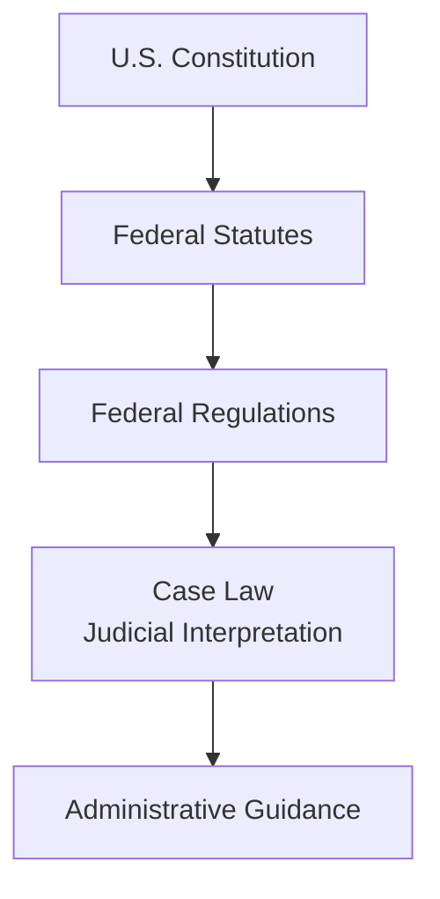
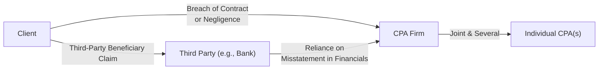

## 2.4 Essential Legal Terminology and Concepts

Legal concepts form the backbone of the Regulation (REG) section of the CPA Exam. Whether you are guiding clients through a contractual dispute, addressing agency relationships, or interpreting statutes and regulations, understanding key legal terms ensures precise communication and effective decision-making. The following material defines fundamental vocabulary and principles used throughout the REG section, ensuring clarity and context for CPA candidates seeking a broader, more cohesive grasp of legal obligations and frameworks.

This chapter is designed for those who may not have extensive legal backgrounds but need to navigate a wide range of topics, including agency relationships, contract formation, liability considerations, and the sources of legal authority. Our goal is to build a solid foundational understanding that you can apply to more advanced REG concepts—particularly in the areas of business law, ethics, professional responsibilities, and federal tax procedures.

---

### Importance of Clarity in Legal Terminology

Legal concepts can become muddled due to dense language, multiple interpretations, and situational nuances. Incorrectly interpreting terms such as “at-will employment,” “tort,” or “fiduciary duty” can lead to legal missteps and costly financial consequences. CPA candidates and practitioners, therefore, need to be aware of:
• How each term is defined.  
• Contexts in which the term is used.  
• Legal consequences or implications of each term.

Developing fluency in legal terminology helps CPAs do the following:  
• Communicate accurately with legal counsel and clients.  
• Protect themselves and their firms by following correct procedures.  
• Avoid common pitfalls like misclassification of relationships or breach of fiduciary duty.  

---

### Foundations of Law: Sources and Hierarchies

Before diving into specific terms, it helps to understand the basic “hierarchy of law” and where legal authority originates. The framework below illustrates how laws, regulations, and judicial decisions interrelate:

1. U.S. Constitution: The supreme law of the land. Any law that conflicts with the Constitution is invalid.  
2. Federal Statutes: Created by Congress and signed into law by the President (e.g., the Internal Revenue Code).  
3. Federal Regulations: Issued by administrative agencies (e.g., Treasury Regulations). They interpret and implement statutes.  
4. Case Law/Judicial Interpretation: Court decisions that interpret statutes, regulations, or prior case law. Courts rely on the doctrine of “stare decisis,” which means following precedent to ensure consistency.  
5. Administrative Guidance: Includes revenue rulings, revenue procedures, and other agency-related interpretations that provide clarity on regulatory applications.  

Understanding how laws are structured and organized helps CPAs conduct better research, interpret arguments more effectively, and provide well-reasoned advice.

---

### Key Legal Terminology

Below is a comprehensive list of fundamental legal concepts frequently encountered in the REG section, along with practical examples and explanations of why each concept matters.

#### Civil vs. Criminal Law

• Civil Law: Pertains to disputes between private parties (individuals or organizations) where typically monetary damages or specific performance are sought. For example, a breach of contract claim involves civil law remedies (e.g., compensatory damages).  
• Criminal Law: Involves offenses against society at large (e.g., fraud, embezzlement). Criminal charges can lead to fines, incarceration, or both. CPAs must recognize when actions potentially cross into criminal territory (e.g., tax evasion).  

---

#### Parties to a Lawsuit

• Plaintiff: The party who initiates the lawsuit.  
• Defendant: The party against whom the lawsuit is brought.  
• Third-Party Defendant: A party brought into a lawsuit by the defendant, sometimes to share or shift liability.  

When a CPA firm is sued for malpractice, the firm would likely appear as a defendant. Understanding these roles is crucial for legal procedure and insurance purposes.

---

#### Burden of Proof

• Preponderance of Evidence: Used in most civil trials; the plaintiff must show it is “more likely than not” that the defendant is liable.  
• Beyond a Reasonable Doubt: Used in criminal cases, requiring a much higher standard to convict the defendant.  

For CPA liability (commonly civil in nature), the standard usually revolves around negligence or breach of duty proven by a preponderance of evidence.

---

#### Common Law vs. Statutory Law

• Common Law: Law developed by judges through court decisions, guided by precedent (case law).  
• Statutory Law: Written laws passed by legislative bodies (e.g., Congress, state legislatures).  

For instance, many contract principles (e.g., the requirement of consideration) stem from common law, while tax laws (e.g., the Internal Revenue Code) are statutory.  

---

#### Contracts

A contract is a legally enforceable agreement. Basic contract elements include:
• Offer: A proposal made by one party, demonstrating willingness to enter into a contract.  
• Acceptance: The agreement by the other party to the terms of the offer.  
• Consideration: The exchange of something of legal value (e.g., money, services, forbearance).  

Highlighting example: If a CPA and a client draft an engagement letter (offer and acceptance) where the client pays a fee for tax preparation services (consideration), that engagement letter is considered a contract. Breach of contract arises if either party fails to uphold their obligations.

---

#### Agency

Agency is a relationship in which one party (the agent) acts on behalf of another (the principal). Key concepts include:
• Authority: The agent’s power to act on behalf of the principal.  
• Fiduciary Duty: A legal duty of the agent to act in the best interest of the principal.  
• Scope of Employment: Determines whether the principal is vicariously liable for the agent’s actions.  

Consider a scenario where a CPA is an “agent” hired (by the principal) to negotiate a contract with the IRS or to speak on the client’s behalf during an audit. The CPA must ensure loyalty, confidentiality, and compliance with the authorized scope.

---

#### Fiduciary Duty

Fiduciary duty is an obligation to act with the highest standard of care for another’s benefit. It includes:
• Duty of Loyalty: Avoiding conflicts of interest or self-dealing.  
• Duty of Care: Acting with a reasonable level of skill and diligence.  

When CPAs manage financial matters or give tax advice, they may fall under fiduciary obligations if placed in a trustee or similar role (e.g., a managing partner in a partnership).  

---

#### Torts

A tort is a civil wrong that causes harm or loss, leading to legal liability. Categories include:
• Negligence: Failing to exercise a reasonable standard of care.  
• Intentional Torts: Harmful acts done intentionally (e.g., fraud, defamation).  
• Strict Liability: Liability without regard to fault (common in ultra-hazardous activities).  

Negligence is particularly important to CPAs who must maintain a reasonable standard of care. If they fail to detect fraud due to sloppy audit procedures, they could face claims of negligence from the client or third parties.

---

#### Negligence and Professional Malpractice

In a CPA context, negligence can be analyzed through four elements:
1. Duty of Care: CPAs owe a duty of competence and professionalism.  
2. Breach of Duty: Falling below professional standards (e.g., failing to follow GAAS).  
3. Causation: Linking the breach directly to the harm caused.  
4. Damages: Demonstrating financial or other measurable harm.  

Professional malpractice cases revolve around the assertion that the CPA’s actions deviated from the standard of care recognized by the profession, resulting in client losses.

---

#### Liability Concepts

• Joint and Several Liability: Multiple parties can be held liable together (joint) or individually (severally) for the full amount of the damages. This is important if multiple partners in a CPA firm are named in a lawsuit.  
• Vicarious Liability: Employers or principals may be liable for the negligence or misconduct of their employees or agents, if the actions occurred within the scope of employment or agency.  

For instance, in a partnership, one negligent partner’s actions could result in the firm being liable under joint and several liability.

---

#### Damages

Damages refer to monetary compensation awarded to a prevailing party. Common categories:
• Compensatory Damages: To compensate for actual losses (e.g., lost profits, restitution of fees).  
• Punitive Damages: To punish egregious conduct; rare in contract or malpractice but can appear in fraud.  
• Nominal Damages: Symbolic awards given when liability is found but no substantial harm is proven.  

Understanding the type and measure of damages is crucial in estimating liability exposure.

---

#### Statute of Limitations

The statute of limitations is the time limit in which a legal claim must be filed. For instance:
• Many breach of contract claims have a statute of limitations between three to six years.  
• Certain malpractice claims might have a shorter or longer period depending on state laws.  

CPA candidates should note that timely filing of tax returns also relates to specific statutes of limitations for IRS audits and collections (e.g., generally three years from the filing date for audits, though extensions exist).

---

#### Legal Entities and Their Characteristics

CPAs must have a firm grasp of the various legal structures, including:
• Sole Proprietorship: A single-owner business with unlimited personal liability.  
• General Partnership: Two or more co-owners share profits, management, and liability.  
• Limited Partnership (LP) or Limited Liability Partnership (LLP): Provides limited liability to some partners.  
• Limited Liability Company (LLC): Owners (members) have limited liability; can be taxed as partnerships or corporations.  
• Corporations (C Corp, S Corp): Separate legal entity; liability limited to corporate assets.  

Understanding entity formation, operation, and dissolution is critical when providing advice on tax implications, especially if you reference how distributions or losses flow through to individuals (S corporations and partnerships) compared to a C corporation.

---

#### Legal Doctrines in Business and Tax

• Stare Decisis: Courts should follow precedent to maintain consistency in the law.  
• Res Judicata: A matter already judged by a competent court cannot be pursued further by the same parties.  
• Substance Over Form: Tax principle in which the economic reality (substance) prevails over the outward form of a transaction.  
• Business Purpose Doctrine: Requires a legitimate business purpose for certain tax treatments, preventing transactions solely designed for tax avoidance.

These doctrines frequently arise in disputes over complicated or structured transactions, where the IRS or a court may recharacterize the deal based on actual substance.

---

### Practical Examples and Case Studies

Putting legal concepts into real-world contexts is essential for deep learning. Below are illustrative scenarios.

**Contract Dispute**  
A mid-sized manufacturing firm hires your CPA practice to perform an audit. An engagement letter was signed (contract). Midway through, the client refuses to cooperate or provide essential documentation. If the CPA firm withdraws, the client may claim breach. However, the CPA’s defense could hinge on the client’s failure to fulfill contractual obligations. This scenario underscores the need to understand “mutual performance” in contracts.

**Negligence in Tax Preparation**  
Imagine a CPA who forgets to file the client’s extension for a complex corporate return, causing the client to incur penalties. The client sues for negligence, asserting that the CPA owed a duty to handle returns correctly, breached that duty, and caused measurable financial harm—thus demanding compensatory damages.

**Agency in Practice**  
A senior CPA at your firm is granted “power of attorney” to represent a client in an IRS audit. The CPA is now the agent; the client is the principal. The CPA must remain within the authorized scope (e.g., negotiating with the IRS on behalf of the taxpayer) and maintain fiduciary duties like confidentiality and loyalty.

---

### Visual Overview: Common Civil Liability Claims Against CPAs

Below is a conceptual overview of how liability claims might flow from a client to a CPA, highlighting potential third-party involvement.

- A client could sue the CPA firm for breach of contract or negligence.  
- A third party (e.g., a creditor or investor) who relied on misstated financial statements might also pursue claims.  
- Individual CPAs (partners in a firm) could face personal liability under certain circumstances.  

Such flowcharts help conceptualize who sues whom and based on what legal grounds.

---

### Best Practices and Common Pitfalls

• Best Practices:  
  - Always document client engagements with clear contracts or engagement letters.  
  - Maintain detailed, accurate records of all transactions and communications.  
  - Understand and uphold your fiduciary duties.  
  - Observe confidentiality under both professional standards and statutory laws.  

• Common Pitfalls:  
  - Failing to understand the difference between “ethical obligations” and “legal obligations.”  
  - Overstepping boundaries in agency relationships, risking unauthorized representation or breach of fiduciary duty.  
  - Missing deadlines or failing to track statutes of limitations.  
  - Underestimating liability exposure, especially where third parties may have relied on a CPA’s work product.  

---

### Strategies to Overcome Legal Challenges

1. Continual Education: Stay current with evolving legal precedents and statutory updates.  
2. Thorough Documentation: Maintain well-documented client files, including any disclaimers, instructions, or third-party communications.  
3. Clear Communication: When uncertainties arise, consult with legal counsel or specialists; never guess on complex or borderline legal matters.  
4. Engagement Letters: Precisely define the scope of services, fees, responsibilities of each party, and any limitation of liability clauses permissible by law.  

By employing these strategies, you protect your firm and clients alike, reducing the likelihood and severity of legal disputes.

---

### Additional References and Next Steps

• American Institute of Certified Public Accountants (AICPA) – Professional Standards and Ethics.  
• State Bar Association – Business law primers and resources.  
• Internal Revenue Code (IRC) – Statutory rules for tax matters.  
• State-Specific Statutes – Varying statutes of limitations and liability considerations.  

Building foundational knowledge of legal terminology, as set out in this section, is a key stepping stone to success in the Regulation (REG) portion of the CPA Exam. From here, you can branch out into deeper legal domains such as contract law (Chapter 8), debtor-creditor relationships (Chapter 9), and federal tax procedures (Chapter 5), applying these newly acquired concepts in context.

---

## Mastering Essential Legal Terms for the CPA REG Exam: Interactive Quiz



### Under what standard of proof are most civil liability cases, including professional malpractice suits against CPAs, typically decided?

- [ ] Beyond a reasonable doubt
- [ ] Clear and convincing evidence
- [x] Preponderance of the evidence
- [ ] No negligence standard is needed for malpractice suits

> **Explanation:** Civil liability (including claims against CPAs) is generally determined by the preponderance of the evidence standard, meaning liability is shown as “more likely than not.”

### Which of the following best describes fiduciary duty?

- [x] An obligation to act in the best interest of another, with loyalty and care
- [ ] An obligation to mitigate public risk from business operations
- [ ] The requirement to comply with generally accepted accounting principles (GAAP)
- [ ] A duty to pay back debts before dissolution

> **Explanation:** Fiduciary duty is the highest standard of care owed to a principal or beneficiary, encompassing loyalty, good faith, and honesty in all dealings.

### In a valid contract, what element requires each party to exchange something of legal value?

- [ ] Acceptance
- [ ] Capacity
- [ ] Legality
- [x] Consideration

> **Explanation:** Consideration is the bargained-for exchange of value essential for contract formation. This can include money, services, or forbearance of a legal right.

### A client sues a CPA firm alleging the CPA’s error caused financial harm. Which of the following is typically the final step in proving negligence?

- [ ] Establish duty
- [ ] Establish breach of duty
- [ ] Prove causation
- [x] Establish damages

> **Explanation:** In a negligence claim, plaintiffs must prove (1) duty, (2) breach, (3) causation, and (4) damages. Without damages, there is no claim.

### A CPA prepares a corporate tax return and inadvertently fails to include necessary schedules. As a result, the client incurs IRS penalties. Which of the following statements is TRUE regarding liability?

- [x] The CPA may be liable for negligence if all elements (duty, breach, causation, and damages) are satisfied.
- [ ] The CPA cannot be liable because the IRS imposes penalties only on taxpayers, not tax preparers.
- [x] The CPA may also face disciplinary actions under Circular 230.
- [ ] The CPA must be found guilty of embezzlement to be held liable.

> **Explanation:** A CPA is obligated to exercise due care in preparing returns. If a breach of care causes penalties to the client, the CPA may be held liable. Furthermore, Circular 230 provides standards of practice that could trigger disciplinary measures.

### Which legal doctrine encourages courts to follow established precedent in deciding current cases?

- [ ] Res judicata
- [x] Stare decisis
- [ ] Substantive due process
- [ ] Statute of frauds

> **Explanation:** Stare decisis means “to stand by things decided.” It promotes consistency and predictability in the legal system by relying on precedent.

### Which of the following forms of business organization generally exposes all owners to unlimited personal liability for the entity’s legal obligations?

- [ ] Corporation
- [ ] Limited Liability Company
- [ ] Limited Partnership
- [x] General Partnership

> **Explanation:** In a general partnership, each partner has unlimited personal liability for partnership debts and obligations, unlike corporations, LLCs, or limited partnerships.

### The “duty of loyalty” within a fiduciary relationship specifically prohibits which of the following?

- [x] Self-dealing that puts the fiduciary’s interests above those of the principal
- [ ] Delegating tasks to qualified colleagues
- [ ] Acting within the agreed-upon scope of authority
- [ ] Charging fair-market value for services performed

> **Explanation:** The duty of loyalty requires that the fiduciary avoid any transactions or actions where personal interests conflict with those of the principal.

### In the context of a legal dispute, what is the primary function of compensatory damages?

- [x] To make the injured party whole by covering actual losses
- [ ] To punish the defendant for wrongful behavior
- [ ] To provide nominal recognition of wrongdoing
- [ ] To reward the plaintiff for moral damages only

> **Explanation:** Compensatory damages are intended to reimburse the injured party for measurable, actual losses incurred due to the defendant’s conduct.

### The doctrine of “res judicata” states that once a court has ruled on a matter:

- [x] The same parties cannot relitigate the same issues.
- [ ] A new lawsuit can be filed in a different jurisdiction for a second evaluation.
- [ ] The losing party automatically pays punitive damages.
- [ ] Immediate appeal is granted to all parties as a matter of right.

> **Explanation:** Res judicata means “a matter judged.” Once decided, the same parties cannot pursue the same cause of action again in another court.



---

## For Additional Practice and Deeper Preparation

### [Taxation & Regulation (REG) CPA Mock Exams](https://www.udemy.com/course/reg-cpa-mock-exams/?referralCode=55419EBD198F61530B12)

**Taxation & Regulation (REG) CPA Mocks:** 6 Full (1,500 Qs), Harder Than Real! In-Depth & Clear. Crush With Confidence!

- Tackle full-length mock exams designed to mirror real REG questions.  
- Refine your exam-day strategies with detailed, step-by-step solutions for every scenario.  
- Explore in-depth rationales that reinforce higher-level concepts, giving you an edge on test day.  
- Boost confidence and minimize anxiety by mastering every corner of the REG blueprint.  
- Perfect for those seeking exceptionally hard mocks and real-world readiness.  

_Disclaimer: This course is not endorsed by or affiliated with the AICPA, NASBA, or any official CPA Examination authority. All content is for educational and preparatory purposes only._
