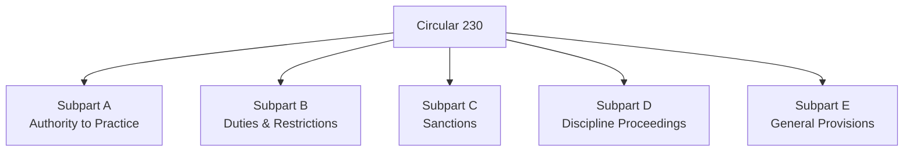

## 3.1 Treasury Department Circular 230

Treasury Department Circular 230 (often referred to simply as Circular 230) outlines the ethical and practice standards that govern tax professionals who “practice before the Internal Revenue Service (IRS).” These rules ensure that tax practitioners uphold stringent standards of integrity, competence, and fairness when representing clients, ensuring public trust in the U.S. tax system. Circular 230 is issued under the authority given to the Department of the Treasury by 31 U.S.C. § 330. Its enforcement is primarily handled by the IRS Office of Professional Responsibility (OPR).

Within the context of CPA exam preparation covered in Chapter 3: Ethics and Responsibilities in Tax Practice, mastery of Circular 230 is critical. Beyond simply memorizing provisions, CPA candidates are expected to understand how these rules integrate with AICPA’s Statements on Standards for Tax Services (SSTS), state board regulations, and other ethical mandates that govern professional conduct. This section focuses on the critical provisions concerning ethical conduct, due diligence, fees, and sanctions for violation under Circular 230.

-----------------------------

### Overview and Importance of Circular 230

Circular 230 ensures that individuals who prepare tax returns or provide tax advice fulfill duties of professionalism, ethics, and competence. Compliance with Circular 230 protects both taxpayers and the integrity of the tax system. Its boundaries extend to attorneys, CPAs, enrolled agents, enrolled actuaries, and a range of other tax professionals “practicing before the IRS.” Practice before the IRS includes preparing documents, filing returns, and corresponding or negotiating with the IRS on behalf of taxpayers.

Many of the provisions in Circular 230 revolve around safeguarding client interests while protecting the IRS and broader public from unscrupulous or incompetent practitioners. Key areas of concern include:

• Ethical conduct requirements.  
• Due diligence and accuracy standards in preparing and filing returns.  
• Conflict-of-interest standards.  
• Restrictions on fees (including contingency fees).  
• Obligations around record retention, notifications, and disclaimers.  
• Consequences and sanctions for failure to comply.  

The overarching principle is that authorized practitioners—also referred to as “tax preparers” or “practitioners”—must conduct themselves in a manner that reflects the seriousness of their responsibilities. From a CPA exam perspective, you will be expected to identify scenarios where violations can lead to censure, suspension, or disbarment.

-----------------------------

### Structure and Key Components of Circular 230

Circular 230 consists of multiple subparts:

• Subpart A: Rules Governing Authority to Practice  
• Subpart B: Duties and Restrictions Relating to Practice Before the IRS  
• Subpart C: Sanctions for Violation of the Regulations  
• Subpart D: Rules Applicable to Disciplinary Proceedings  
• Subpart E: General Provisions  

The most frequently tested and discussed provisions for CPA candidates often reside in Subpart B (Duties and Restrictions) and Subpart C (Sanctions). However, it is important to understand at least a broad overview of the entire document.

Below is a simplified Mermaid diagram illustrating the general structure of Circular 230:

-----------------------------

### Subpart A: Authority to Practice Before the IRS

Subpart A of Circular 230 clarifies who may practice before the IRS—namely, attorneys, CPAs, enrolled agents, enrolled actuaries, and certain others who meet specific requirements (e.g., enrolled retirement plan agents). This section also details the application and licensing requirements for those seeking to practice before the IRS.

Circular 230 emphasizes that individuals practicing before the IRS must meet competency and ethical standards. Hence, the IRS reserves the right, through the OPR, to deny or restrict practice privileges if the individual violates these standards.

-----------------------------

### Subpart B: Duties and Restrictions on Practice

Subpart B is the core section that outlines the day-to-day ethical requirements for practitioners and the restrictions placed upon them. Several key duties and restrictions are featured here:

#### 1. Furnishing Information and Assistance to the IRS

Practitioners must promptly submit records or provide information requested by the IRS unless the practitioner believes, in good faith, that they are privileged or otherwise exempt from disclosure. Noncompliance or unreasonably delaying a request can be interpreted as a violation.

#### 2. Due Diligence and Accuracy Standards

Due diligence is central to ethical conduct under Circular 230. Practitioners must:

• Exercise reasonable care when giving written or oral advice.  
• Ensure that any positions taken on a tax return have a reasonable basis, are not frivolous, and comply with the tax code and regulations.  
• Properly address all relevant facts and the applicable law in tax advice or tax return positions.

Notably, a practitioner must not willfully or recklessly sign a return or advise a client to take a position on a return that lacks sound legal or factual grounding.

Example “Due Diligence” Scenario:  
A CPA working with a client who owns a small business must exercise due diligence by examining relevant invoices, receipts, employee logs, and other documentation. If the CPA notices discrepancies or incomplete information, they are required to investigate further (within reasonable limits) rather than simply relying on the client’s word.

#### 3. Contingent Fees

Circular 230 significantly restricts when and how practitioners may charge contingent fees. Generally, contingent fees are disallowed for original tax returns or refund claims because they may encourage aggressive or unsupportable return positions. Exceptions exist for:

• Representing a client in connection with an IRS examination, challenge, or judicial proceeding.  
• Preparing or filing an amended tax return or claim for refund related to an examination.  

#### 4. Conflicts of Interest

Circular 230 requires practitioners to avoid conflicts of interest. A conflict arises when:

• The representation of one client is directly adverse to another.  
• There is a significant risk that the representation of one or more clients will be materially limited by the practitioner’s responsibilities to another client, a former client, or the practitioner’s own personal interest.

If a conflict arises, the practitioner must obtain written, informed consent from each affected client, and they must reasonably believe they can provide competent and diligent representation to all.

Example “Conflict of Interest” Scenario:  
A CPA prepares tax returns for two business partners. If these partners decide to dissolve their business amid a dispute, representing both parties in certain negotiations or audits may create a conflict of interest. The CPA must consider whether continued representation of both is feasible and ethical.

#### 5. Solicitation, Advertising, and Written Tax Advice

Practitioners must not use false, fraudulent, or coercive statements in advertising their services. Any fee information must be accurate and comprehensive. For written tax advice (including emails, memos, letters, or other forms of guidance), practitioners must apply due diligence in the analysis, ensure that it is not based on unreasonable factual or legal assumptions, and consider all relevant facts.

#### 6. Return of Client Records

Practitioners must, upon the request of a client, promptly return any records necessary for that client to comply with tax obligations. Even if a fee dispute exists, the practitioner’s retention of these records cannot unreasonably impede the client’s compliance with federal tax filing obligations.

#### 7. Best Practices

Although not explicitly enumerated in older versions of Circular 230, best practices guidance within the publication encourages practitioners to:

• Communicate clearly with clients, establishing the facts and legal significance.  
• Advise clients of the importance of accurately and honestly reporting income, deductions, and credits.  
• Act fairly and with integrity in all dealings with the IRS and clients.  
• Regularly update knowledge and skills by engaging in continuing professional education.  

-----------------------------

### Subpart C: Sanctions for Violation of Circular 230

Subpart C sets forth the potential sanctions the IRS can impose. These sanctions may be applied if a practitioner fails to comply with Subpart B or demonstrates disreputable conduct. Sanctions range in severity:

1. Censure: A public reprimand that warns the practitioner.  
2. Suspension: A temporary bar from practicing before the IRS.  
3. Disbarment: An indefinite, potentially permanent bar from practicing before the IRS.  
4. Monetary Penalties: Fines imposed on the practitioner or employer if the practitioner’s employer or firm knew or should have known of the violation.

“Disreputable conduct” can include criminal convictions, misappropriation of funds, failing to file personal or client tax returns, knowingly giving false statements to the Treasury, or forging or altering documents. 

Real-World Enforcement Example:  
A CPA who repeatedly files frivolous returns on behalf of clients, or who knowingly claims phony deductions, may face disciplinary action ranging from suspension to permanent disbarment. Additionally, if they have engaged in unethical practices such as misrepresentation of credentials or acceptance of illegal contingent fees, the IRS OPR may impose fines and other penalties.

-----------------------------

### Subpart D: Disciplinary Proceedings

Circular 230 dedicates Subpart D to the procedures of disciplining a practitioner who has allegedly violated any of its provisions. This subpart discusses:

• How complaints are filed and investigated.  
• The role of the Administrative Law Judge (ALJ).  
• The nature of hearings and discovery, rules of evidence, and burden of proof.  
• The issuance of decisions and orders.  

From a CPA exam standpoint, detailed procedural rules under Subpart D are less commonly tested. However, it is important to recognize that an accused practitioner is entitled to a hearing adjudicated by an impartial judge and has the right to be represented. The IRS must demonstrate that a violation has occurred to warrant sanctions.

-----------------------------

### Subpart E: General Provisions

Subpart E includes definitions, effective dates, references, and other clarifications. Students preparing for the CPA exam seldom need to memorize these technical elements in detail. However, understanding definitions early in the document—such as who qualifies as a “practitioner” and “recognized representative”—is critical to interpreting the rest of the requirements.

-----------------------------

### Practical Examples and Case Studies

It can be helpful to explore realistic scenarios to see how Circular 230’s provisions apply in practice:

1. Inaccurate Tax Return Advice  
   • Scenario: A CPA fails to verify or critically analyze a multitier real estate partnership’s reported rental expenses, leading to a major understatement of income.  
   • Analysis: The CPA may be found to have violated Circular 230 due diligence requirements, particularly if no corresponding justification or evidence for the expenses was requested or reviewed.

2. Unreasonable Fee Structure  
   • Scenario: An enrolled agent charges a 30% contingency fee for preparing an original tax return, promising the client to “only pay if you get a hefty refund.”  
   • Analysis: Circular 230 generally disallows contingent fees for original returns. This arrangement could constitute a violation of Subpart B’s fee restrictions.

3. Conflict of Interest with Multiple S Corporations  
   • Scenario: A tax practitioner provides annual S corporation compliance work for two partial owners. When the owners become engaged in a dispute over a buy-out, the same practitioner is asked to represent each shareholder in negotiations and potential litigation with the IRS regarding alleged underreporting of income for prior years.  
   • Analysis: Without obtaining informed written consent from each client, and confirming the ability to provide competent representation, this scenario would present a prohibited conflict of interest under Circular 230.

4. Sanctions and Disbarment  
   • Scenario: A CPA is convicted of intentionally misappropriating a client’s tax payments.  
   • Analysis: This likely represents disreputable conduct under Subpart C. The IRS OPR would initiate proceedings to disbar the individual from practicing before the IRS due to breach of trust and ethical responsibilities.

-----------------------------

### Strategic Considerations for Tax Practitioners

Tax professionals should proactively maintain compliance with Circular 230 by implementing best practices in their daily work:

• Establish robust internal controls: Document due diligence steps for each return prepared or each piece of written advice given, including the factual and legal basis.  
• Keep up-to-date: Engage in continuing education programs that address changes in tax law, IRS guidance, and relevant court decisions.  
• Implement conflict-of-interest checks: Use an intake or client screening procedure to identify potential conflicts of interest among clients or prospective clients.  
• Maintain clear communication: Use engagement letters or retainer agreements that describe the scope of the engagement, including fees charged.  
• Retain records properly: Keep organized documentation to support all positions taken on behalf of a client.  

Adopting such protocols not only safeguards practitioners from Circular 230 sanctions but also builds trust and credibility with clients and the broader public.

-----------------------------

### Relationship Between Circular 230 and Other Ethical Standards

Although Circular 230 is the primary federal-level regulation for tax practitioners, professionals are typically subject to multiple layers of regulation:

1. AICPA Statements on Standards for Tax Services (SSTS)  
   The AICPA SSTS addresses client confidentiality, tax return positions, errors in prior returns, and other ethical obligations. While SSTS focuses on CPAs specifically, both SSTS and Circular 230 share common objectives—accurate return filing, integrity with clients, and cooperation with taxing authorities.

2. State Boards of Accountancy  
   CPAs must also comply with their respective state boards’ codes of conduct. Violations of Circular 230 may trigger state-level disciplinary measures, which could include suspension or revocation of a CPA license in that jurisdiction.

3. General Business and Contract Law  
   Ethical principles in general business law, including contract and agency law (see Chapter 7: Agency and Chapter 8: Contracts), may intersect with these ethical requirements. For instance, failing to correctly handle client funds could also be a breach of contract and fiduciary duty under state law.

-----------------------------

### Common Pitfalls and Potential Challenges

1. Overreliance on Client Representations  
   If a tax practitioner overly relies on a client’s statements without verifying supporting documents (particularly for high-risk areas such as charitable contributions or business deductions), they can inadvertently violate the due diligence standard.

2. Neglecting to Obtain Written Consents for Potential Conflicts  
   Practitioners commonly disregard conflict-of-interest protocols, mistakenly believing that long-standing client relationships exempt them from formal documentation. Circular 230 requires explicit, informed, and written consents.

3. Misinterpretation of “Reasonable Basis”  
   A frequent area of concern is incorrectly determining the “reasonable basis” or “substantial authority” for a tax position. CPAs must stay abreast of case law, IRS rulings, and Treasury Regulations relevant to client issues to avoid Circular 230 violations.

4. Ignoring Advertising Restrictions  
   Using unsubstantiated language like “guaranteed IRS acceptance” or “audit-proof returns” in promotional materials can result in OPR scrutiny. Circular 230 prohibits false or misleading advertising.

-----------------------------

### Tips for Successful Exam Preparation

• Start with the major themes: Focus first on Subpart B’s duties and restrictions, then move to Subpart C to understand sanctions.  
• Review real-life disciplinary cases: This can help you remember the standards’ practical applications.  
• Compare to AICPA SSTS: Understand how the SSTS parallels or supplements Circular 230.  
• Use mnemonics: For example, “FACC” (Fees, Advertising, Conflict, Conduct) can help you recall major areas of compliance.  

-----------------------------

### References and Suggested Reading

• IRS Office of Professional Responsibility: Official Publications on Circular 230  
• Treasury Department Circular No. 230: https://www.irs.gov/tax-professionals/circular-230  
• AICPA Statements on Standards for Tax Services (SSTS)  
• State Boards of Accountancy Codes of Conduct  
• Relevant Court Decisions in Tax Ethics Cases  

-----------------------------

## SEO-Optimized Quiz on Treasury Department Circular 230



### Which of the following is a core purpose of Treasury Department Circular 230?

- [ ] To establish tax filing deadlines.  
- [x] To set ethical and practice standards for professionals who represent taxpayers before the IRS.  
- [ ] To enumerate federal criminal penalties for tax evasion.  
- [ ] To provide guidance on preparing financial statements.  

> **Explanation:** Circular 230 provides rules governing the practice of tax professionals before the IRS, meaning it addresses ethical and professional responsibilities rather than deadlines or criminal statutes.

### What is a key element of due diligence required under Circular 230?

- [ ] Guaranteeing refunds to all clients.  
- [ ] Keeping client fee agreements confidential.  
- [x] Ensuring accuracy of representations made to the IRS.  
- [ ] Offering automatic waivers for conflicts of interest.  

> **Explanation:** Practitioners must exercise due diligence, meaning they must verify client information and ensure accurate representations to the IRS. Circular 230 makes this a key imperative for tax professionals.

### Under which circumstance are contingent fees generally allowed under Circular 230?

- [ ] For preparing an original tax return.  
- [x] For representing a client during an IRS examination of a filed return.  
- [ ] For drafting an engagement letter.  
- [ ] For providing an initial consultation.  

> **Explanation:** Contingent fees are generally disallowed for original returns but may be permissible in certain circumstances like IRS examinations or judicial proceedings.  

### Which of the following scenarios would likely trigger a conflict of interest under Circular 230?

- [x] Representing two partners who are disputing each other’s tax obligations in the same matter.  
- [ ] Preparing unrelated tax returns for a married couple.  
- [ ] Discussing potential tax savings with two unrelated clients at the same time.  
- [ ] Offering a group seminar on tax law changes.  

> **Explanation:** Circular 230 requires practitioners to avoid serving clients whose interests are directly adverse in the same tax matter or where the representation of one may be materially limited by the practitioner’s duty to another.

### What is the main function of the IRS Office of Professional Responsibility (OPR)?

- [ ] Auditing corporate tax returns over $10 million in sales.  
- [ ] Collecting estimated tax payments from individuals.  
- [ ] Publishing annual tax tables.  
- [x] Investigating and enforcing sanctions against practitioners who violate Circular 230.  

> **Explanation:** The OPR is authorized to investigate alleged violations, hold disciplinary proceedings, and impose sanctions such as censure, suspension, or disbarment.

### A CPA’s use of false or deceptive statements in advertisements violates which provision of Circular 230?

- [x] Restrictions on solicitation and advertising practices.  
- [ ] Return of client records.  
- [ ] Requirements for continuing education.  
- [ ] Due diligence in tax return preparation.  

> **Explanation:** Circular 230 has explicit rules prohibiting false, fraudulent, or misleading statements in advertising or client solicitation.

### What is the usual penalty for a serious violation of Circular 230, such as misappropriating client funds?

- [ ] A warning letter from the AICPA.  
- [ ] Completion of a continuing education course.  
- [x] Potential suspension or disbarment from practice before the IRS.  
- [ ] Fines paid directly to the client.  

> **Explanation:** Misappropriation of client funds is “disreputable conduct” under Circular 230, which can lead to severe sanctions like suspension or disbarment.

### Which of the following best describes a practitioner’s responsibility in retaining client records?

- [ ] Records must only be kept if the fee has been fully paid.  
- [ ] Records may be destroyed immediately after filing.  
- [x] Practitioners must promptly return necessary records for tax compliance upon request.  
- [ ] Practitioners have no obligation to provide client records to the IRS.  

> **Explanation:** Even if a dispute over fees exists, Circular 230 obligates a practitioner to return any records crucial for the client’s tax compliance needs.

### When may a practitioner rely on client-provided information without verification under Circular 230?

- [x] When the information appears reasonable, and there is no evidence suggesting it is incomplete or incorrect.  
- [ ] When the practitioner wants to expedite the tax filing process.  
- [ ] Under no circumstances.  
- [ ] Only if the client’s adjusted gross income exceeds a threshold amount.  

> **Explanation:** Practitioners may generally rely on client facts in good faith unless those facts appear to be incorrect, incomplete, or inconsistent, requiring further inquiry.

### Does a public reprimand for violating Circular 230 equate to a permanent ban from practice?

- [x] True  
- [ ] False  

> **Explanation:** A public reprimand, known as censure, is not permanent disbarment. Practitioners may continue to practice, but they carry an official record of censure.



-----------------------------

## For Additional Practice and Deeper Preparation

### [Taxation & Regulation (REG) CPA Mock Exams](https://www.udemy.com/course/reg-cpa-mock-exams/?referralCode=55419EBD198F61530B12)

**Taxation & Regulation (REG) CPA Mocks:** 6 Full (1,500 Qs), Harder Than Real! In-Depth & Clear. Crush With Confidence!

- Tackle full-length mock exams designed to mirror real REG questions.  
- Refine your exam-day strategies with detailed, step-by-step solutions for every scenario.  
- Explore in-depth rationales that reinforce higher-level concepts, giving you an edge on test day.  
- Boost confidence and minimize anxiety by mastering every corner of the REG blueprint.  
- Perfect for those seeking exceptionally hard mocks and real-world readiness.

_Disclaimer: This course is not endorsed by or affiliated with the AICPA, NASBA, or any official CPA Examination authority. All content is for educational and preparatory purposes only._
