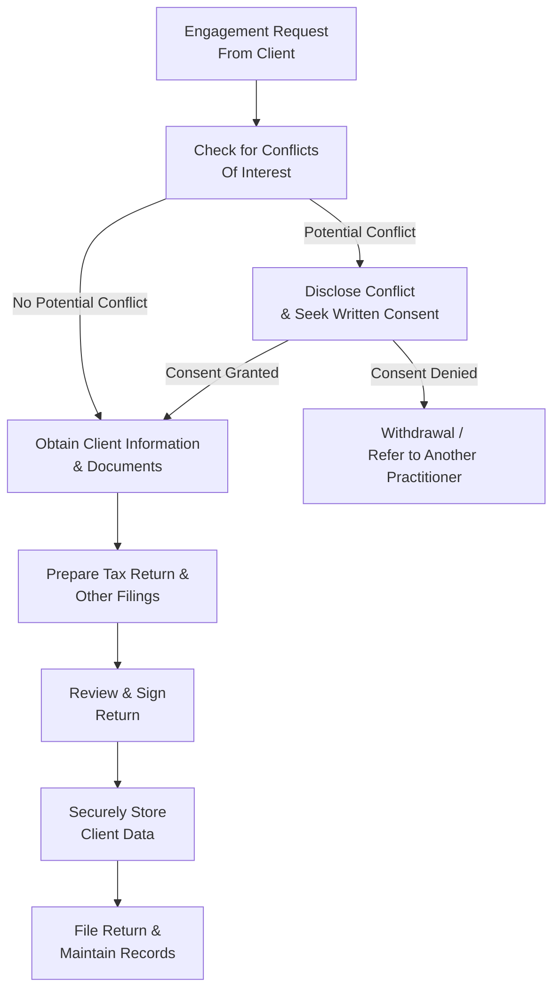

## 3.2 Duties and Restrictions for Tax Practitioners

In the realm of taxation and regulation, tax practitioners hold positions of trust and responsibility. Clients expect them to navigate laws, regulations, and ethical guidelines to prepare and file accurate returns while safeguarding confidential information. Understanding the duties and restrictions outlined in federal regulations and professional standards not only ensures compliance but also fosters client confidence and personal accountability. This section delves into these key areas, focusing on signing returns, maintaining client confidentiality, and avoiding conflicts of interest.

Tax professionals—encompassing CPAs, Enrolled Agents (EAs), attorneys, and unlicensed preparers—must abide by an array of governing rules, chief among them Treasury Department Circular 230 (see also Chapter 3.1, “Treasury Department Circular 230”), state boards of accountancy regulations, and the AICPA Code of Professional Conduct. In this chapter, we examine essential duties, present relevant examples, discuss best practices, and highlight potential pitfalls with real-world scenarios.

---

### Overview of Core Duties and Restrictions

Tax practitioners are entrusted with a wide range of responsibilities. While regulations and guidelines vary based on practitioner type and jurisdiction, certain universal themes emerge:

• Diligence in return preparation and submission.  
• Proper signing of returns and claim forms.  
• Adherence to confidentiality and privacy requirements.  
• Disclosure when conflicts of interest arise.  
• Ongoing compliance with ethical guidelines under Circular 230 and state laws.  

Let us break down these critical points in greater detail.

---

### Signing Returns and Related Filing Requirements

One of the fundamental duties of tax practitioners is the proper signing of returns. Failure to comply can subject the practitioner to monetary and disciplinary sanctions. According to the IRS, any individual who prepares or substantially assists in preparing a tax return for compensation must sign the return as the paid preparer. Practitioners also need to include the Preparer Tax Identification Number (PTIN).

#### Legal Foundation
• Internal Revenue Code (IRC) §6695 imposes penalties for failing to sign.  
• Treasury Department Circular 230, Subpart B, outlines a practitioner’s duties to provide accurate information and sign returns where applicable.

#### Practical Example
Imagine a small CPA firm where multiple staff accountants assist in preparing a complex business return. The staff accountant who has the primary responsibility for the return must sign it as the preparer and include their PTIN. If this staff accountant neglects to sign the return or fails to include the PTIN, the firm could face monetary penalties, and the accountant might be subject to further disciplinary action from the IRS.

#### Best Practices
• Always confirm that the person principally responsible for preparing the return signs and includes their PTIN.  
• Maintain a system of quality control and internal review to prevent missing signatures or PTIN omissions.  
• Document all client interactions, ensuring clarity regarding who is responsible for finalizing the return.  

---

### Maintaining Client Confidentiality and Privacy

Safeguarding client information is paramount for tax practitioners. This obligation arises from multiple sources: federal statutes (e.g., IRC §7216 on tax return preparer confidentiality), state accountancy boards, and professional bodies such as the AICPA.

#### Key Aspects of Confidentiality
1. Prohibition on Unauthorized Disclosure: Practitioners may not share tax return information with unauthorized parties unless explicitly permitted by law or unless the client provides written consent.  
2. Secure Storage of Records: Practitioners must store documents, both physical and electronic, in secure facilities or platforms to prevent data breaches and unauthorized access.  
3. Limited Use of Client Information: Use of client data for marketing products or services without permission can violate IRC §7216, triggering significant penalties.  

#### Real-World Scenario
A CPA, hired to prepare an individual’s personal tax return, discovers the taxpayer owns various foreign investments requiring specialized forms (e.g., Form 8938 for Foreign Financial Assets). The CPA must handle these disclosures with the highest level of confidentiality, carefully ensuring no sensitive data is disclosed outside the course of compliance or to third parties without explicit client authorization. If the CPA used the client’s personal data to pitch unrelated financial products, this would violate confidentiality regulations and risk substantial penalties.

#### Practical Safeguards
• Encrypt client data and store it on secure servers or locked files accessible only to authorized personnel.  
• Obtain client consent in writing before sharing any tax information with third-party advisors (e.g., investment managers, lawyers).  
• Implement comprehensive staff training on data privacy laws, focusing on best practices for communications (e.g., email encryption).  

---

### Avoiding Conflicts of Interest

A conflict of interest arises when a tax practitioner’s loyalties become divided, potentially influencing their ability to represent a client fairly and objectively. The most common conflicts occur when a practitioner represents multiple parties with diverging interests or has a personal (financial or non-financial) interest that could impair independence.

#### Circular 230 on Conflicts of Interest
Under Circular 230, practitioners must either refrain from representation or disclose the conflict to the affected clients, obtaining informed consent in writing. The practitioner should also evaluate whether they can competently and diligently represent all impacted clients. If not, withdrawal from the engagement may be necessary.

#### Illustrative Example
• Practitioner representing a partnership and, simultaneously, one of the partners personally. A dispute arises over allocation of partnership profits. If the practitioner continues to represent both entities, they risk appearing biased and could inadvertently breach duties of confidentiality.  
• CPA working as both corporate accountant and personal financial planner for the CEO. Tax-saving strategies for the CEO might conflict with the corporation’s best interest and could cast doubt on the CPA's independence.

#### Best Practices in Conflict Management
• Screen clients carefully during intake and maintain rigorous documentation regarding potential overlapping interests.  
• Obtain detailed conflict waivers and ensure that each client fully understands the implications of joint representation.  
• If conflict escalates, consider referring one or all parties to another qualified practitioner to preserve integrity and objectivity.  

---

### Diagram: Ethical Duties Workflow

Below is a simple Mermaid diagram illustrating the flow of ethical decision-making when considering the duties and restrictions of a tax practitioner. The diagram highlights the interconnected facets that must be addressed before engaging or continuing an engagement.

1. A client approaches the practitioner with an engagement request.  
2. The practitioner checks for any conflicts of interest.  
3. If a conflict is found, the practitioner discloses it and seeks written consent or withdraws if consent is not provided.  
4. The practitioner, once satisfied that conflicts have been managed, obtains client documents and prepares returns.  
5. The practitioner securely stores all data throughout the process and ensures the return is signed and filed appropriately.

---

### Potential Penalties and Disciplinary Actions

Various regulations stipulate penalties and disciplinary measures for not adhering to required duties:

• Civil Penalties under IRC §6695 (Failure to sign returns or include PTIN, failure to furnish copy of return to taxpayer, etc.).  
• Criminal Penalties under IRC §7206 or §7216 if confidentiality or privacy laws are intentionally violated.  
• Suspension or disbarment from practice before the IRS under Circular 230 provisions.  
• State Board of Accountancy Actions (e.g., license suspension, revocation) for violating state regulations.  

---

### Common Pitfalls and How to Avoid Them

• Missed Deadlines and Failure to Sign: One of the most obvious—but surprisingly frequent—oversight is failing to sign the return or missing critical deadlines for client filings.  
• Misunderstanding the Scope of Confidentiality: Using client data for marketing or disclosing it to family members, even innocently, can result in a breach.  
• Overextension of Services: Attempting to represent multiple parties with conflicting interests without obtaining written consent or adequately analyzing the conflict.  

#### Strategies to Overcome Pitfalls
• Implement a tracking calendar or online practice management system that provides alerts for signing returns and filing due dates.  
• Regularly review privacy policies with staff and update staff training modules on data security.  
• Draft detailed engagement letters and conflict-of-interest documents, requiring signatures from all parties.  

---

### Case Study: Joint Representation Conflict

Consider a CPA firm that prepares tax returns for a married couple. Halfway through the year, the couple decides to divorce. Since the CPA firm has previously managed the couple’s joint interests, the separation raises immediate conflict-of-interest issues. The CPA must evaluate whether continuing to represent both parties is feasible without jeopardizing confidentiality or objectivity. If continuing representation of both is unrealistic, the CPA might need to either obtain conflict waivers (if both parties consent and the representation remains feasible) or withdraw from representing one or both parties entirely.

Key takeaways:
• Timely identification of a conflict is essential.  
• Full disclosure to both parties ensures transparency.  
• Written consent is required if representation continues.  
• If representation cannot remain fully objective, disengagement is the safest route.

---

### Additional Recommendations for Compliance

1. Develop a Comprehensive Procedures Manual.  
   - Include checklists for client intake processes, conflict checks, return preparation procedures, and final sign-offs.  
2. Maintain Rigorous Quality Control.  
   - Use review systems and peer checks to verify that staff consistently apply signing, confidentiality, and conflict-of-interest protocols.  
3. Stay Updated with Regulations.  
   - Monitor changes to Circular 230, IRS notices, and state accountancy rules. Conduct regular continuing professional education (CPE) sessions to ensure that you and your staff remain current.  
4. Invest in Secure Technology.  
   - Adopt secure portals for client file transfers, encrypt communications, and regularly back up client data.  

---

### References for Further Exploration

• Treasury Department Circular 230, available at:  
  https://www.irs.gov/tax-professionals/circular-230-tax-professionals  
• AICPA Code of Professional Conduct:  
  https://www.aicpa.org/content/dam/aicpa/interestareas/professionalethics/resources/tools/downloadabledocuments/2014december15codeofconduct.pdf  
• IRC §6695, 7206, and 7216 for specific penalties and criminal sanctions.  
• Journal of Accountancy, “Client Confidentiality and Data Protection Guidelines,” accessible online for best practices in data security.  
• State Board of Accountancy Rules for each jurisdiction.  

---

## Essential Duties and Restrictions for Tax Practitioners Quiz: Mastering Confidentiality and Conflict Avoidance



### Under Circular 230, what must a tax practitioner do if they discover a conflict of interest with a current client?

- [ ] Immediately terminate the client relationship.  
- [x] Provide full disclosure of the conflict and obtain written consent from all affected clients.  
- [ ] Proceed with the engagement without any disclosure if they can remain objective.  
- [ ] File a private letter ruling with the IRS.  

> **Explanation:** When a conflict of interest arises, Circular 230 requires the practitioner to disclose it fully and obtain written consent from all clients involved if they elect to continue representation.  

### Which of the following is true regarding a practitioner’s duty to maintain client confidentiality?

- [ ] Practitioners may share client tax data with third parties as long as there is a verbal consent from the client.  
- [x] Practitioners must obtain explicit written consent before sharing confidential information with third parties.  
- [ ] Practitioners can freely use client information for marketing.  
- [ ] Practitioners are prohibited from obtaining consent in any form.  

> **Explanation:** IRC §7216 and other laws require explicit written consent for sharing confidential tax data. Verbal consent alone is insufficient.  

### If a CPA fails to sign a client’s tax return, what potential consequence could they face under IRC §6695?

- [ ] A written warning from the IRS, but no financial penalty.  
- [ ] Suspension from all practice before the IRS for life.  
- [x] Imposition of monetary penalties for failing to sign.  
- [ ] Invalidation of the client’s tax return.  

> **Explanation:** IRC §6695 specifically provides for monetary penalties if a preparer fails to sign the tax return.  

### What is a recommended step to effectively manage conflicts of interest?

- [ ] Serve both parties without disclosure, provided the practitioner can remain neutral.  
- [x] Use an engagement letter detailing the nature of the conflict and secure written waivers from the clients.  
- [ ] Avoid representing any clients with potential or perceived conflicts.  
- [ ] Keep the conflict confidential to protect client privilege.  

> **Explanation:** Managing conflicts typically entails disclosing the conflict and obtaining informed written consent or waivers.  

### Which of the following best describes the duty of confidentiality for tax practitioners?

- [x] Practitioners must protect all taxpayer information obtained during the course of representation.  
- [ ] It applies only to information regarding income tax returns.  
- [x] It extends beyond filing season to any time the practitioner holds the data.  
- [ ] It ends once the return has been filed.  

> **Explanation:** Client confidentiality is an ongoing obligation that extends to all tax-related information, at all times.  

### In which case might a practitioner be required to withdraw from an engagement due to a conflict of interest?

- [x] When the practitioner cannot obtain written consent from all parties involved.  
- [ ] If the tax return is too complex to manage.  
- [ ] When the client’s net worth is below a certain threshold.  
- [ ] If the client belongs to the same professional association as the practitioner.  

> **Explanation:** Circular 230 generally requires a practitioner to withdraw from the engagement when a conflict of interest can’t be resolved through disclosure and written consents.  

### What is generally the first step when a new client requests tax services?

- [x] Check for conflicts of interest.  
- [ ] Request the client’s driver’s license and non-disclosure agreement.  
- [x] Prepare and file immediately without review.  
- [ ] Send an invoice to the client for the entire tax year’s services.  

> **Explanation:** Consulting conflict-of-interest checklists before proceeding helps prevent potential ethical oversights and ensures compliance with Circular 230.  

### Under IRC §7216, what is prohibited?

- [ ] Using electronic signature software for filing returns.  
- [ ] Charging the client for administrative tasks.  
- [ ] Allowing an intern to view anonymized data.  
- [x] Using or disclosing client tax information for purposes other than tax preparation without specific client consent.  

> **Explanation:** IRC §7216 restricts the use or disclosure of tax return information for non-tax purposes unless express, written client consent is obtained.  

### Which scenario best illustrates proper handling of a conflict of interest?

- [ ] A CPA continues to represent a divorcing couple without informing either spouse.  
- [x] A CPA represents two corporate partners after obtaining detailed written waivers of conflict from both.  
- [ ] A CPA verbally tells clients about a conflict and proceeds without written documentation.  
- [ ] A CPA ends the engagement for both clients immediately.  

> **Explanation:** The CPA can represent both parties only after fully disclosing the conflict and obtaining informed written consent.  

### A practitioner who intentionally discloses a client’s tax return information without authorization is likely in violation of:

- [x] IRC §7216  
- [ ] IRC §179  
- [ ] Circular 230, Section 10.2  
- [ ] The Securities Exchange Act of 1934  

> **Explanation:** IRC §7216 governs tax return preparer confidentiality. Deliberate unauthorized disclosure can result in criminal penalties.  



## For Additional Practice and Deeper Preparation

### [Taxation & Regulation (REG) CPA Mock Exams](https://www.udemy.com/course/reg-cpa-mock-exams/?referralCode=55419EBD198F61530B12)

Taxation & Regulation (REG) CPA Mocks: 6 Full (1,500 Qs), Harder Than Real! In-Depth & Clear. Crush With Confidence!

- Tackle full-length mock exams designed to mirror real REG questions.  
- Refine your exam-day strategies with detailed, step-by-step solutions for every scenario.  
- Explore in-depth rationales that reinforce higher-level concepts, giving you an edge on test day.  
- Boost confidence and minimize anxiety by mastering every corner of the REG blueprint.  
- Perfect for those seeking exceptionally hard mocks and real-world readiness.

_Disclaimer: This course is not endorsed by or affiliated with the AICPA, NASBA, or any official CPA Examination authority. All content is for educational and preparatory purposes only._
