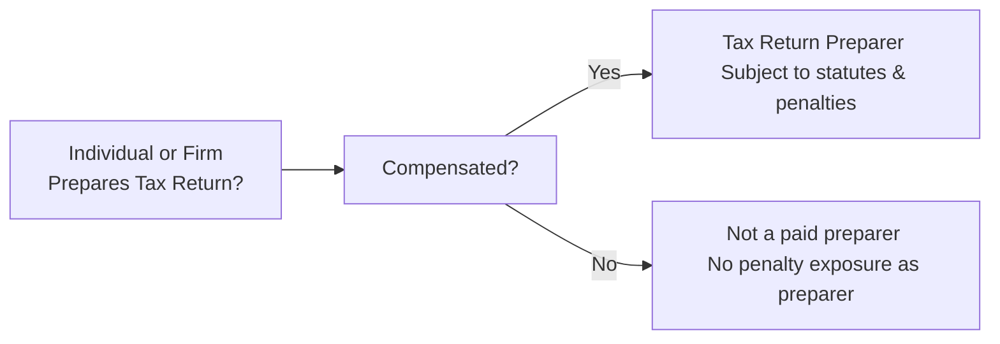
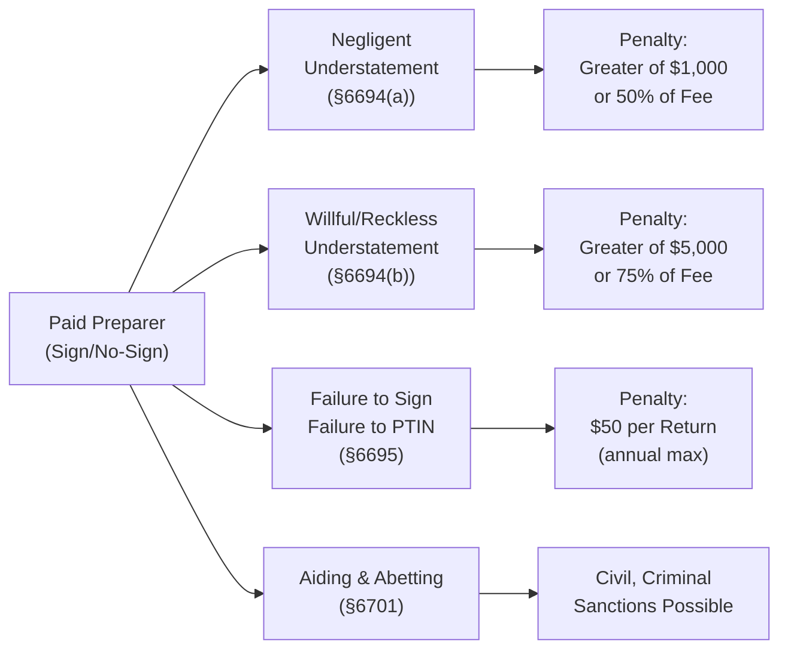

## 3.3 Identification of a “Tax Return Preparer” and Related Penalties

In the realm of federal taxation, understanding who qualifies as a “tax return preparer” is vital for anyone who provides—or seeks—professional assistance in preparing tax returns. Whether practiced by CPAs, enrolled agents, attorneys, or uncredentialed individuals, tax return preparation carries significant obligations under the Internal Revenue Code (IRC) and accompanying regulations. This section addresses the statutory definition of a “tax return preparer,” explores contexts that qualify (and do not qualify) a person for legal responsibility, and delves into the associated penalty framework.

This topic aligns closely with concepts discussed in Chapter 3: Ethics and Responsibilities in Tax Practice (particularly Sections 3.1–3.2), as it underscores the practical and ethical standards required for professionals (and others) who prepare returns for compensation.

--------------------------------------------------------------------------------
### Foundational Overview

A “tax return preparer” is determined primarily by whether an individual (or entity) is paid to prepare, or assist in preparing, tax returns. The classification encompasses more than just CPAs or Enrolled Agents—it can include attorneys, commercial return preparers, and even unlicensed individuals who receive compensation for advice or preparation of certain sections of the return.

#### Statutory Authority
• IRC §7701(a)(36) provides the core definition of a tax return preparer.  
• Treasury Regulation §301.7701-15 offers interpretive guidance, clarifying who is considered a preparer (signing or nonsigning) and who is specifically excluded.  

To place this in perspective:

- A signing preparer generally has the primary responsibility for the substantive correctness of the return.  
- A nonsigning preparer provides substantial input or advice, but is not the individual who ultimately signs the return.

--------------------------------------------------------------------------------
### Legal Definition of a “Tax Return Preparer”

Under IRC §7701(a)(36), a “tax return preparer” is any person who, for compensation, prepares all or a substantial portion of a tax return or claim for refund. The nature of the relationship—whether employee, contractor, or volunteer—matters significantly in determining liability.

1. Compensation Requirement:  
   - To be classified as a return preparer, a person must be paid (monetarily or otherwise) to prepare the return.  
   - Volunteers at nonprofit organizations or unpaid family members helping with a return typically do not meet this standard.

2. Substantial Portion:  
   - The person must prepare (or assist in preparing) a **substantial portion** of the return. This is a facts-and-circumstances test.  
   - For instance, providing specialized analysis or calculations that significantly affect the tax liability is generally considered a “substantial portion.”

3. Signing vs. Nonsigning:  
   - Signing Preparers: These individuals sign the return and assume primary responsibility for its accuracy.  
   - Nonsigning Preparers: They do not sign the return but offer advice or conduct calculations influencing the return.

#### Exceptions and Exclusions
Not every individual who touches a tax return is a “tax return preparer.” The following categories are typically excluded from the legal definition:

- Clerical or Mechanical Assistants: People who merely type tax data into a software platform or perform other minor tasks without exercising professional judgment are not generally return preparers.  
- Employees Preparing Returns for Their Employer: If an employee is preparing or filing an employer’s corporate tax return, the employee is not considered a third-party paid preparer for that specific return.  
- Individuals Providing Incidental Advice: Certain professionals (e.g., an attorney who provides a brief consultation on a narrow issue) may be excluded if their contribution does not rise to the level of a “substantial portion” of the return.  

--------------------------------------------------------------------------------
### Visual Overview of the Definition

Below is a simple Mermaid.js flowchart that captures the high-level process of determining whether an individual is considered a “tax return preparer” under IRC §7701(a)(36).

In practice, if someone is performing more than minor clerical work and is paid, they are likely subject to the tax return preparer rules.

--------------------------------------------------------------------------------
### Typical Types of Paid Preparers

1. CPA/EA/Attorney Preparers:
   - Typically credentialed under specific professional bodies.  
   - Bound by additional ethical and professional standards (e.g., Circular 230, state licensing boards, AICPA’s professional codes).

2. Commercial Preparers:
   - Includes large chain tax preparation firms and smaller independent operations.  
   - Often subject to the same rules yet can vary significantly in their level of training and regulatory oversight.

3. “Ghost Preparers”:
   - Individuals who prepare returns for compensation but fail to sign them.  
   - This practice is illegal, and such individuals are susceptible to failure-to-sign penalties and potentially more severe sanctions.

4. Nonsigning Preparers with Substantial Input:
   - May include specialized tax consultants, foreign tax professionals, or employees in large accounting firms who do not sign returns but significantly influence the final tax position.

--------------------------------------------------------------------------------
### Penalty Structures

Being a tax return preparer carries the possibility of various penalties, most commonly under §§6694, 6695, 6700, 6701, and related code sections. The primary goal of these penalties is to ensure accurate, ethical tax return practices and to deter preparers from presenting skewed or fraudulent information to the IRS.

#### 1. IRC §6694 Penalties for Understatement of Taxpayer’s Liability

- §6694(a): Applies to preparers who understate a tax liability due to negligence or disregard of rules and regulations.  
  - **Negligence** generally refers to a failure to make a reasonable attempt to comply with the tax code.  
  - **Disregard** means ignoring published guidance, including regulations and IRS rulings.  
  - **Penalty**: The greater of (a) $1,000 or (b) 50% of the income derived by the preparer from the preparation of that return.

- §6694(b): Applies if the preparer intentionally understates the tax liability or engages in willful or reckless conduct.  
  - **Willful or Reckless Conduct** generally refers to fraudulent acts or conscious disregard for IRS rules.  
  - **Penalty**: The greater of (a) $5,000 or (b) 75% of the income derived by the preparer from the preparation of that return.

#### 2. IRC §6695 Penalties for Return Preparers

These penalties apply to specific obligations that a preparer must fulfill, such as:

1. Failure to Furnish Copy to Taxpayer:  
   - Preparers must provide a copy of the completed return or refund claim to the taxpayer.  
   - **Penalty**: $50 per return, up to an annual maximum.

2. Failure to Sign the Return:
   - A signing preparer must sign the original return.  
   - **Penalty**: $50 per failure, up to an annual maximum.

3. Failure to Include Preparer Tax Identification Number (PTIN):
   - Federal law requires paid preparers to include a valid PTIN on each return.  
   - **Penalty**: $50 per return, up to an annual maximum.

4. Failure to Retain Copy or List of Returns Prepared:
   - Preparers must retain either a copy of each return or a list of prepared returns for the required period.  
   - **Penalty**: $50 per return, up to an annual maximum.

5. Failure to Exercise Due Diligence for the Earned Income Tax Credit, Child Tax Credit, American Opportunity Credit, or Head of Household Filing Status:
   - Preparers must follow specific due diligence requirements (Form 8867) whenever these credits or statuses are claimed.  
   - **Penalty**: $560 (indexed for inflation) per return as of recent adjustments.

#### 3. IRC §6700 and §6701 Penalties
- **IRC §6700** targets promoters of abusive tax shelters.  
- **IRC §6701** punishes those who aid and abet the understatement of tax.  
- These penalties can be significant and may include both civil and criminal sanctions, putting a preparer’s license or practice at serious risk.

#### 4. Criminal Penalties
In extreme circumstances—particularly with willful fraud—criminal penalties (including fines and imprisonment) may apply under various sections of Title 26 (IRC) and Title 18 (criminal code). Examples include fraudulent refund claims and providing fraudulent documents in the course of representing a taxpayer.

--------------------------------------------------------------------------------
### Diagram: Overview of Key Preparers’ Penalties

Below is a Mermaid.js diagram summarizing how different forms of preparer misconduct link to various penalties. Note that the diagram is not exhaustive but offers a conceptual map.

--------------------------------------------------------------------------------
### Best Practices and Compliance Strategies

1. **Document Everything:**  
   - Maintain meticulous records of advice given, communications, and working papers.  
   - Proper documentation helps demonstrate reasonable cause and good faith in the event of an audit or penalty assessment.

2. **Stay Current on Regulations:**  
   - Tax laws evolve rapidly. Seasoned preparers rely on continuous professional education (CPE) and official updates from the IRS.  
   - Engage with professional associations (AICPA, NATP, NAEA) to receive regular technical updates.

3. **Use Engagement Letters and Disclosures:**  
   - Engagement letters clarify the scope of services and responsibilities.  
   - Disclosures can outline uncertain tax positions or disclaimers about the extent of the preparer’s role or reliance on client-provided data.

4. **Apply Appropriate Ethical Standards:**  
   - Rules under Treasury Circular 230 (for CPAs, EAs, and attorneys) govern diligence, competence, and conflicts of interest.  
   - For CPAs, the AICPA’s Statements on Standards for Tax Services (SSTS) also define required professional conduct.

5. **Obtain a Valid Preparer’s Tax Identification Number (PTIN):**  
   - It is mandatory for all paid preparers to have a current PTIN.  
   - Renew PTIN annually through the IRS to avoid administrative penalties.

--------------------------------------------------------------------------------
### Common Pitfalls

- **Failing to Sign**: New preparers sometimes overlook the requirement to sign each return, exposing them to multiple $50 penalties.  
- **Negligent Omissions**: Not verifying client-reported income (e.g., missing a Form 1099) can trigger negligence penalties.  
- **Due Diligence Missteps**: Failing to complete the Form 8867 or gather proper documentation for Earned Income Tax Credit or other credits.  
- **Ghost Preparers**: Preparers who try to evade liability by not signing returns can face escalated civil and criminal sanctions.  
- **Complacency with Evolving Regulations**: Particularly for specialized areas (like cryptocurrency gains, foreign holdings, or state-sourced income), a lack of knowledge can lead to errors flagged by the IRS.

--------------------------------------------------------------------------------
### Potential Challenges and Strategies for Resolution

1. **Varying Client Data Quality:**  
   - **Challenge**: Clients may omit key information (e.g., foreign assets, side businesses, or cryptocurrency transactions).  
   - **Strategy**: Conduct thorough interviews, use standardized client questionnaires, and cross-verify data.

2. **Determining a Substantial Portion**:  
   - **Challenge**: For large corporations with multiple advisors, deciding who is the “substantial portion” preparer can be complex.  
   - **Strategy**: Track all contributions, maintain records of each professional’s role, and clarify responsibilities in engagement letters.

3. **Navigating Ethical Gray Areas**:  
   - **Challenge**: A client may want to take an aggressive tax position unsupported by law.  
   - **Strategy**: Rely on reliable precedent, maintain open communication, and if necessary, advise the client on potential risks or disengage to avoid unethical conduct.

4. **Maintaining Competence in Specialized Areas**:  
   - **Challenge**: Specialized industries (e.g., oil and gas, real estate partnerships) can present unique complexities for both individuals and business returns.  
   - **Strategy**: Seek continuing education, consult with colleagues familiar with niche tax areas, and consider disclaiming or referring out if beyond existing expertise.

--------------------------------------------------------------------------------
### Case Study: When Good Faith Is Not Enough

• **Scenario**: A newly licensed CPA prepares a small business return. The client incorrectly reports all vendor payments as deductible despite a portion being capital expenditures. The CPA, overwhelmed, fails to investigate further and simply puts the expenses on Schedule C.  
• **Outcome**: An IRS audit uncovers a significant understatement of tax. The CPA was negligent (and lacked documentation or steps verifying the expenses). The CPA faces a §6694(a) preparer penalty for understatement due to negligence, in addition to possible state disciplinary actions.  

**Key Lesson**: Even well-intentioned mistakes can invite the risk of penalties if the preparer does not take reasonable care to verify questionable items or unusual client claims.

--------------------------------------------------------------------------------
### References and Further Exploration

• **IRS Publication 947**: “Practice Before the IRS and Power of Attorney” – Clarifies the roles and responsibilities of those who practice before the IRS, including certain preparer responsibilities and powers of attorney.  
• **Treasury Circular 230**: Governs the practice of CPAs, EAs, attorneys, and certain appraisers before the IRS.  
• **IRC Sections 6694, 6695, 6700, 6701**: Statutory sources for most preparer-related penalties.  
• **AICPA Statements on Standards for Tax Services (SSTS)**: Professional guidelines covering ethics, due diligence, and reporting standards for CPAs.  

For more advanced reading, consider exploring state-specific regulations and court cases that provide additional context on how tribunals interpret preparer responsibilities.

--------------------------------------------------------------------------------
### Conclusion

Identifying a “tax return preparer” involves understanding the compensation element, the degree of substantive preparation, and the potential for liability under federal law. The tax code’s robust penalty structure signals Congress’s emphasis on accurate, conscientious return preparation. As the scope of what can constitute “preparation” keeps evolving—especially in a digital age with e-filing and outsourced tax services—it is incumbent on both new and experienced tax professionals to stay informed, ethically grounded, and vigilant.

By adhering to the basic principles of due diligence, comprehensive documentation, and regular updates on tax laws and ethics requirements, preparers can keep client interests at heart while safeguarding themselves from liability risks.

--------------------------------------------------------------------------------

## Quiz on Tax Return Preparer Definitions and Penalties



### What is a key factor in determining if someone is considered a “tax return preparer” under IRC §7701(a)(36)?

- [ ] They prepare returns only for family members.
- [x] They prepare a tax return or substantial portion thereof for compensation.
- [ ] They have a CPA license in good standing.
- [ ] They communicate directly with the IRS.

> **Explanation:** IRC §7701(a)(36) primarily defines a "tax return preparer" as anyone who prepares all or a substantial portion of a return for compensation. Licensure or representation before the IRS is not the defining characteristic.

### Which of the following statements is correct regarding “signing” and “nonsigning” preparers?

- [x] A nonsigning preparer provides substantial input or advice but does not sign the return.
- [ ] A nonsigning preparer is only someone who files a return without disclosing their PTIN.
- [x] A signing preparer assumes primary responsibility for the overall accuracy of the return.
- [ ] A signing preparer cannot be penalized for negligence under §6694.

> **Explanation:** Signing preparers sign the return and are responsible for its correctness, while nonsigning preparers offer significant input but do not sign. Both can be penalized for noncompliance, including negligence.

### Which penalty applies when a tax return preparer is negligent or shows disregard for IRS rules and regulations but without willful or reckless conduct?

- [ ] IRC §6695 penalty for failing to provide a taxpayer copy.
- [ ] IRC §6700 penalty for abusive tax shelter promotion.
- [x] IRC §6694(a) penalty for understatement of liability due to negligence.
- [ ] IRC §6694(b) penalty for willful or reckless conduct.

> **Explanation:** IRC §6694(a) penalizes preparers who cause an understatement of tax due to negligent or careless actions, or disregard IRS rules, without willful intent.

### Under IRC §6695, which of these is a common reason a preparer might face a $50 penalty?

- [x] Failing to include their PTIN on the tax return.
- [ ] Failing to include an obscure footnote on the client’s expense statement.
- [ ] Asking the taxpayer for a retainer check.
- [ ] Providing the client a written engagement letter.

> **Explanation:** Under §6695, preparers must include their Preparer Tax Identification Number on each return they prepare. Failing to do so can trigger a $50 penalty for each omission.

### Which scenario likely qualifies an individual as a “ghost preparer”?

- [x] The individual prepares the return for a fee but does not sign it.
- [ ] A volunteer official at a local nonprofit who helps neighbors file returns for free.
- [x] A paid preparer who never includes a valid PTIN on the return.
- [ ] A preparer who provides incidental clerical support but exercises no judgment.

> **Explanation:** “Ghost preparers” are paid to prepare returns but intentionally fail to sign or provide valid identifying information. Both failing to sign and omitting a PTIN can be considered ghost preparation practices.

### When does the heightened penalty under IRC §6694(b) apply?

- [ ] When the preparer unknowingly overlooks minor client mistakes.
- [x] When the preparer willfully or recklessly understates a taxpayer's liability.
- [ ] When a third-party assistant typed an incorrect entry.
- [ ] When the preparer includes a footnote referencing a tax code section.

> **Explanation:** The §6694(b) penalty applies to willful or reckless conduct, typically connected to fraud or conscious disregard of tax rules.

### Upholding due diligence for the Earned Income Tax Credit (EITC) often involves:

- [x] Completing and submitting Form 8867 to substantiate EITC claims.
- [ ] Ensuring the return is filed by April 1.
- [x] Verifying that the client’s supporting documents accurately reflect eligibility.
- [ ] Disclosing all prior clients’ names to the IRS.

> **Explanation:** Preparers must complete Form 8867 for returns claiming the EITC (as well as certain other credits and statuses) and maintain adequate documentation to show they met due diligence requirements.

### Which action can help a preparer demonstrate reasonable cause and avoid certain penalties?

- [x] Retaining strong documentation of client data and professional tax research.
- [ ] Filing late returns under all circumstances, citing client responsibility.
- [ ] Delegating tasks to inexperienced staff without supervision.
- [ ] Charging a higher fee to appear more professional.

> **Explanation:** Thorough documentation and consistent professional diligence offer a defense against many preparer penalties, as they can demonstrate an effort to comply with the tax code in good faith.

### Which of the following best describes a nonsigning preparer’s liability?

- [x] They can be penalized if they contributed substantially to the understatement of tax.
- [ ] They are never subject to penalties since they do not sign returns.
- [ ] They only face penalties if they also contact the IRS under a power of attorney.
- [ ] They are exempt from due diligence requirements on refundable credits.

> **Explanation:** Nonsigning preparers who provide substantial input or advice that results in an understated tax liability may be subject to penalties, even though they do not physically sign the return.

### True or False: A preparer who prepares only an employer’s internal corporate return (without additional compensation) is considered a “tax return preparer” for that return.

- [x] True
- [ ] False

> **Explanation:** In most cases, employees assisting with their employer’s return without separate compensation are not treated as third-party paid preparers for that return. However, complexities can arise if the employee receives separate compensation for the service beyond their standard duties, or if they act as an external consultant. Always review the facts and circumstances.



--------------------------------------------------------------------------------

## For Additional Practice and Deeper Preparation

### [Taxation & Regulation (REG) CPA Mock Exams](https://www.udemy.com/course/reg-cpa-mock-exams/?referralCode=55419EBD198F61530B12)

Taxation & Regulation (REG) CPA Mocks: 6 Full (1,500 Qs), Harder Than Real! In-Depth & Clear. Crush With Confidence!

• Tackle full-length mock exams designed to mirror real REG questions.  
• Refine your exam-day strategies with detailed, step-by-step solutions for every scenario.  
• Explore in-depth rationales that reinforce higher-level concepts, giving you an edge on test day.  
• Boost confidence and minimize anxiety by mastering every corner of the REG blueprint.  
• Perfect for those seeking exceptionally hard mocks and real-world readiness.

_Disclaimer: This course is not endorsed by or affiliated with the AICPA, NASBA, or any official CPA Examination authority. All content is for educational and preparatory purposes only._
