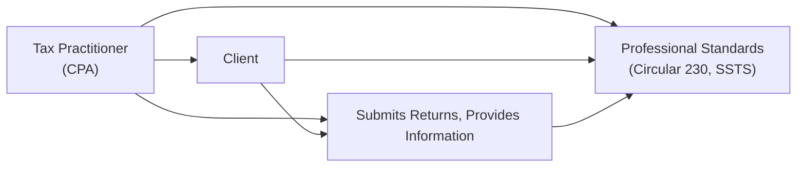

## 3.5 Maintaining Integrity, Objectivity, and Independence

Maintaining integrity, objectivity, and independence is foundational for every Certified Public Accountant (CPA) and other tax professionals operating under the American Institute of Certified Public Accountants’ (AICPA) ethical standards. This principle extends beyond the confidentiality and privacy of client data—it serves as the bedrock of the professional’s entire practice, ensuring public trust in the financial system. In this section, we will discuss professional conduct in preparing returns and communicating with taxing authorities, emphasizing the criticality of consistent ethical awareness and application throughout the tax engagement process.

While this section directly connects to the themes outlined in Chapter 3 on Ethics and Responsibilities in Tax Practice (see 3.1 – 3.4), it also underscores the broader scope of legal duties found in Chapter 6, particularly when dealing with privileged communications and malpractice concerns. As you study, remember the overarching mission of the CPA profession: to serve the public interest by offering high-quality, objective, and accurate financial information.

--------------------------------------------------------------------------------

### Importance of Ethical Conduct in Tax Practice

Ethics in tax practice is not only a legal or regulatory requirement—it's a moral imperative aimed at preserving clients’ trust, safeguarding the credibility of financial markets, and maintaining your professional reputation. Ethical behavior orbits around three core concepts:

• Integrity: Acting honestly and adhering to strong moral and professional convictions.  
• Objectivity: Ensuring advice and actions are free from bias or conflicts of interest.  
• Independence: Maintaining professional distance and freedom from undue influence.

Upholding these three pillars shapes the manner in which you prepare returns, advise clients, and correspond with the Internal Revenue Service (IRS) and other taxing authorities.

--------------------------------------------------------------------------------

### Pillars of Ethical Conduct: Integrity, Objectivity, and Independence

#### Integrity

Integrity involves honesty in one’s professional and personal dealings. For CPAs, integrity operates as the foundation supporting compliance with tax law, court decisions, and administrative rulings. Practitioners must ensure:

• Earnings, deductions, and credits are reported accurately and fairly, with no attempt to conceal or misrepresent facts.  
• Positions taken on tax returns are based on either authoritative statutes or solid good-faith interpretations of the law.  
• Aggressive or abusive tax positions, frivolous claims, or fraudulent activities are rejected.  

Failure to uphold integrity can result in harsh penalties, reputational damage, and potential disciplinary actions under Treasury Department Circular 230 and other professional guidelines (see Chapter 3.1 and 3.3).

#### Objectivity

Objectivity means remaining unbiased. CPAs and tax professionals must:

• Exercise sound professional judgment free from favoritism or external pressure.  
• Ensure any financial or personal interest does not hamper the professional’s ability to render unbiased advice.  
• Document factual evidence and articulate conclusions based on the true economic relationships, even when the best interests of your client are at stake.

Objectivity fosters credibility with all parties involved: from clients and taxpayers to government agencies that rely on the veracity of returns.

#### Independence

Independence refers to freedom from real or perceived conflicts of interest that might impair the professional’s judgement. Although independence is often discussed primarily in the context of audits and attest services (see references to state boards of accountancy in Chapter 4), independence also matters in the tax arena. For instance:

• A tax professional must not hold a financial or personal interest in a client’s outcome that compromises the objectivity of the tax return.  
• Close personal relationships, reciprocal business arrangements, or contingent fee agreements can compromise or be perceived to compromise independence in tax engagements.  

In Part VII (Advanced Topics in Tax Planning and Strategy), we examine more complex scenarios where independence is critical—especially in entity formation, liquidation planning, and restructuring transactions that can involve multiple stakeholders.

--------------------------------------------------------------------------------

### Integrity in Preparing Tax Returns

Maintaining integrity while preparing returns means driving complete, accurate, and lawful compliance. Duties and restrictions for tax practitioners outlined in Circular 230 prohibit preparers from:

• Willfully understating tax liability.  
• Failing to exercise due diligence in determining correctness of return positions.  
• Ignoring or dismissing relevant facts, evidence, or changes in client circumstance.

Following AICPA Statements on Standards for Tax Services (SSTS) (see Chapter 3.4) sets a strong foundation for ethical return preparation, as these standards guide practitioners on how to structure positions, document uncertainties, and maintain diligence throughout the engagement.

#### Example: Handling Gray Areas

A small business client might want to classify certain costs as fully deductible business expenses when the situation is ambiguous. Under the principle of integrity:

• The practitioner can request supporting documentation, evaluate relevant tax code sections, and research precedents.  
• If the position is “more likely than not” to be sustained on the merits—a threshold often used for certain tax positions—advising the client to take the deduction can be appropriate.  
• Clear disclosure is crucial if the position falls into an ambiguous category requiring specific forms, elections, or statements on the tax return.

--------------------------------------------------------------------------------

### Objectivity in Communicating with Clients and Taxing Authorities

Maintaining objectivity means staying impartial when conveying information to clients and responding to inquiries from the IRS or state taxing bodies. This duty includes:

• Disclosing facts without distortion: You should openly communicate relevant information to all authorized parties in a factual and balanced manner.  
• Ensuring no undue influence is exerted by the client or external parties to manipulate or omit material information.

When receiving an IRS notice or responding to a request for information, an objective approach involves replying in a factual manner that does not intentionally conceal or misrepresent the underlying transaction. While it is your duty to advocate for your client within the permissible boundaries of professional guidance, the principle of objectivity ensures that your advocacy does not cross into misrepresentation.

--------------------------------------------------------------------------------

### Independence: Avoiding Conflicts of Interest

Conflicts of interest may arise when a tax professional’s personal or financial interests clash with client interests or create partiality. Both Circular 230 and state-level CPA governing statutes strictly forbid professionals from undertaking any engagements that could compromise—whether in fact or appearance—independence in action or perception.

• A conflict can manifest if a CPA invests in a client’s business being evaluated for tax deductions.  
• If you must represent different clients with conflicting tax positions or claims, you may be required to discontinue the engagement or disclose the conflict and seek a waiver if permissible.  

Striving for transparency, disclaiming conflicts, and seeking written acknowledgments can help mitigate risk. However, the best course of action may often be to avoid engagements altogether where independence may be compromised.

--------------------------------------------------------------------------------

### Communicating with Taxing Authorities

One of the crucial areas where CPAs must demonstrate integrity, objectivity, and independence is in interaction with agencies such as the IRS or state revenue departments. These communications range from routine compliance inquiries to complex audits and appeals.

1. Be Truthful and Factual  
   Always present facts accurately. Refrain from omitting material facts that could mislead tax authorities.

2. Timely and Cooperative Responses  
   Prompt communication is essential. Delays or evasiveness often raise suspicion and can deteriorate the professional relationship with regulators.

3. Clearly Disclose Client Positions  
   Inform the IRS or relevant authority about the basis of a tax position. If the position is subject to a higher standard of disclosure (e.g., for uncertain or controversial positions), ensure the necessary forms, schedules, or attachments are filed.

4. Observe Privileged Communications  
   Consult legal counsel and reference Chapter 6 for guidance on privilege and confidentiality. There are limits to attorney-client privilege in a tax setting, and CPAs need to navigate these carefully.

--------------------------------------------------------------------------------

### Real-World Case Illustrations

Below are two fictionalized realities that closely mirror common ethical dilemmas:

1. Conflict of Interest in Representation  
   • A CPA is representing two business partners in a partnership audit. The partners disagree on how to split certain partnership deductions. If the dispute intensifies, the CPA could be forced into a position where representing both parties fairly is impossible. The CPA’s independence and objectivity could be questioned. Ethical standards might require the CPA to withdraw from one or both engagements.

2. Pressure to Misstate Income  
   • A client demands a higher deduction for charitable contributions than is documented by receipts. The CPA, confident the receipts are incomplete, requests additional support. The client continues to pressure the CPA to include the undocumented amount. Upholding integrity dictates either refusing to sign the return or adjusting the return to the supported amount only, despite client resistance.

--------------------------------------------------------------------------------

### Best Practices for Ethical Tax Practice

• Develop Standardized Protocols: Create checklists for verifying documentation, referencing relevant Internal Revenue Code (IRC) sections, and conducting research on less common tax issues.  
• Document Each Step: Maintain thorough records of communications, decisions, and calculations. This is vital not only for the client’s file but also to demonstrate diligence in case of an audit or investigation.  
• Continuous Training: Keep up with changes in tax law and professional standards through continuing professional education (CPE).  
• Seek Second Opinions: When uncertain, or when objectivity may be compromised, consult with a peer review committee or external professional to preserve confidence in your determination.  
• Communicate Boundaries: Establish engagement letters clarifying scope of work, fees, and responsibilities. Make it explicit that you will not compromise professional ethics or push a position lacking substantial authority.

--------------------------------------------------------------------------------

### Common Pitfalls and How to Overcome Them

• Failing to Spot Conflicts of Interest: Avoid sharing confidential client data across clients or engaging in reciprocal business transactions that could raise independence concerns.  
• Underestimating the Importance of Disclosure: When in doubt, disclose positions in the return or in attached statements. Transparency often alleviates the risk of penalties.  
• Delegating Without Supervision: While delegation is inevitable in a busy firm, remain informed and maintain oversight to ensure standards are met, especially on ethically gray issues.  
• Becoming Overly Client-Focused at the Expense of Objectivity: It can be tempting to please clients by overly aggressive tax positions. Upholding objectivity helps avoid legal and reputational consequences.

--------------------------------------------------------------------------------

### Potential Challenges and Recommended Strategies

| Challenge                                             | Strategy                                                        |
|-------------------------------------------------------|-----------------------------------------------------------------|
| Client Pressures for Aggressive Tax Positions         | Reference SSTS guidelines, thoroughly explain risk of penalties, and disclose the correct stance. |
| Contractual Conflicts or Contingent Fee Arrangements  | Disclose potential conflicts and consider alternative fee structures that preserve independence.  |
| Rapid Changes in Tax Regulations or Case Law          | Pursue consistent CPE, join professional associations, and access up-to-date research tools.      |
| Communication Gaps During Audits                      | Maintain open lines of communication, respond promptly, and summarize details in writing to document compliance. |
| Self-Review Threat When Providing Multiple Services   | Separate duties among different staff or teams, and thoroughly review each other’s work for bias. |

--------------------------------------------------------------------------------

### Visualizing Key Relationships: Ethical Mandates & Stakeholders

Below is a Mermaid diagram summarizing the relationships among the CPA/tax practitioner, client, and taxing authorities, illustrating how maintaining integrity, objectivity, and independence weaves through every interaction:

Explanation:  
• The Tax Practitioner (A) maintains direct relationships with both the Client (B) and the Taxing Authority (C).  
• The Practitioner, Client, and Authority must adhere to Professional Standards (D).  
• This structure exemplifies the multi-directional flow of communication and ethical obligations across all parties.

--------------------------------------------------------------------------------

### References and Further Reading

• Treasury Department Circular No. 230: Regulations Governing Practice before the Internal Revenue Service.  
• AICPA Code of Professional Conduct: Specifically the ET sections on Integrity and Objectivity.  
• AICPA Statements on Standards for Tax Services (SSTS): Authoritative guidance on best practices in tax engagements.  
• IRC Section 6662: Imposition of Accuracy-Related Penalties on Underpayments.  
• Chapter 6 of this Guide: More on Legal Duties, Privileged Communications, and potential malpractice issues.

For those seeking additional depth, consider resources such as:  
• IRS Publication 947: Practice Before the IRS and Power of Attorney.  
• State Board of Accountancy Licensing Regulations: Each state board may have enhanced or supplementary ethical guidelines.  
• Online courses on professional ethics provided by the AICPA or state CPA societies.

--------------------------------------------------------------------------------

## Test Your Ethical Knowledge in Tax Practice



### Which of the following best describes the principle of integrity in tax practice?

- [x] Acting honestly and adhering to moral and professional principles regardless of pressure.  
- [ ] Advocating for a client’s tax goals above all else.  
- [ ] Ensuring minimal disclosure to the IRS to protect client interests.  
- [ ] Designing complex strategies solely to minimize tax liability.  

> **Explanation:** Integrity involves consistently applying high ethical and moral standards. It is not about concealing facts but rather reporting fully and honestly.

### Which action can potentially compromise a tax practitioner’s independence?

- [x] Having a substantial financial interest in the client’s operations.  
- [ ] Ensuring all supporting documentation is accurate.  
- [ ] Researching applicable tax statutes.  
- [ ] Advising clients to keep contemporaneous records of business transactions.  

> **Explanation:** A significant financial interest in the client poses a conflict, undermining independence.  

### How does objectivity benefit communication with tax authorities?

- [x] It ensures that information provided is unbiased, factual, and free from distortion.  
- [ ] It allows for better negotiation tactics to secure maximum savings for the client.  
- [ ] It helps hide complexities within tax positions.  
- [ ] It ensures faster regulatory approvals.  

> **Explanation:** Objectivity requires presenting accurate and balanced information, which supports trust and transparency with taxing authorities.

### Conflicts of interest in tax engagements typically arise when:

- [x] A practitioner’s personal interests or relationships interfere with impartial judgment.  
- [ ] The tax code is too complex.  
- [ ] Clients want to file an extension on their returns.  
- [ ] The practitioner has a high volume of clientele.  

> **Explanation:** If a practitioner’s interests are at odds with the client’s (or multiple clients’), independence and objectivity can be jeopardized.

### In responding to an IRS audit request, a CPA should:

- [x] Provide factual, prompt, and thorough information.  
- [ ] Delay as long as possible while minimizing disclosures.  
- [x] Act within professional ethical guidelines.  
- [ ] Make strategic omissions to reduce liabilities.  

> **Explanation:** CPAs must communicate truthfully and adequately, observing professional standards and addressing all relevant queries.

### Why is documentation critical when preparing a client’s tax return?

- [x] It substantiates the tax return’s accuracy and protects against penalties.  
- [ ] It eliminates the possibility of an IRS audit.  
- [ ] It ensures the client’s maximum refund.  
- [ ] It is only necessary when claiming large deductions.  

> **Explanation:** Proper documentation is essential to demonstrate due diligence and support the legitimacy of each tax position.

### Which scenario most likely violates the principle of integrity?

- [x] Intentionally misclassifying personal expenses as business deductions.  
- [ ] Reviewing a client’s receipts and invoices.  
- [x] Providing supporting citations for a debatable tax position.  
- [ ] Disclosing all relevant facts to the taxing authority in a timely manner.  

> **Explanation:** Misclassifying personal expenses to reduce taxable income constitutes intentional misrepresentation, violating integrity.

### Objectivity can be undermined by:

- [x] Excessive client pressure to overstate deductions.  
- [ ] Providing disclaimers on uncertain tax positions.  
- [ ] Consulting with a peer for a second opinion.  
- [ ] Referencing IRS guidance.  

> **Explanation:** Undue influence or pressure from external sources can tilt judgment, resulting in biased decisions or noncompliant practices.

### Which of the following measures helps preserve independence?

- [x] Conducting thorough conflict checks before accepting a new client.  
- [ ] Entering into contingent fee arrangements tied to the size of the tax refund.  
- [ ] Accepting payment in company stock without any fair value assessment.  
- [ ] Auditing and preparing the same company’s financial statements and tax returns without additional safeguards.  

> **Explanation:** Conflict checks identify possible threats to independence before an engagement begins.  

### An example of maintaining integrity is:

- [x] True
- [ ] False

> **Explanation:** Giving clients an honest assessment of their tax positions supported by evidence, even if they insist on a more aggressive approach, demonstrates a commitment to integrity.



--------------------------------------------------------------------------------

## For Additional Practice and Deeper Preparation

### [Taxation & Regulation (REG) CPA Mock Exams](https://www.udemy.com/course/reg-cpa-mock-exams/?referralCode=55419EBD198F61530B12)

Taxation & Regulation (REG) CPA Mocks: 6 Full (1,500 Qs), Harder Than Real! In-Depth & Clear. Crush With Confidence!

- Tackle full-length mock exams designed to mirror real REG questions.  
- Refine your exam-day strategies with detailed, step-by-step solutions for every scenario.  
- Explore in-depth rationales that reinforce higher-level concepts, giving you an edge on test day.  
- Boost confidence and minimize anxiety by mastering every corner of the REG blueprint.  
- Perfect for those seeking exceptionally hard mocks and real-world readiness.

_Disclaimer: This course is not endorsed by or affiliated with the AICPA, NASBA, or any official CPA Examination authority. All content is for educational and preparatory purposes only._
