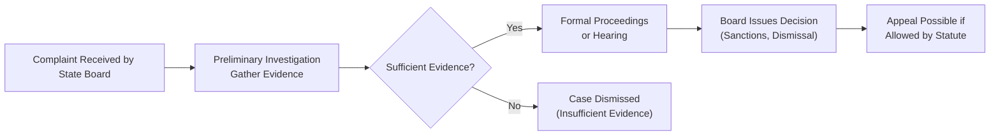

## 4.1 State Boards of Accountancy: Authority and Responsibilities

State Boards of Accountancy hold a unique position within the U.S. regulatory framework. While they operate under the umbrella of state governmental authority, their core mandate transcends simple administrative functions; they shoulder the responsibility of protecting the public interest by overseeing the licensing, regulation, and discipline of Certified Public Accountants (CPAs). This oversight ensures that CPAs are competent, ethical, and aligned with ever-evolving standards for professional practice. The content below explores the core powers of State Boards of Accountancy, their disciplinary structures, and the practical implications for both practicing and aspiring CPAs.

  
Background and Public Protection Mandate  
---------------------------------------
Every state in the U.S. has a designated State Board of Accountancy (or an equivalent regulatory authority) responsible for establishing the rules and regulations governing CPAs. These boards generally derive their authority from state statutes, such as public accountancy acts, which empower them to:

• Assess candidates’ eligibility for CPA licensure.  
• Issue and renew CPA licenses.  
• Set and enforce professional conduct standards.  
• Investigate complaints and impose disciplinary actions when misconduct occurs.  

Although the specific laws and regulations vary from one jurisdiction to another, each state board’s central aim is uniform: protecting the public from unqualified or unethical accounting practitioners. By requiring CPAs to adhere to uniform rigorous standards of education, examination, and experience, the boards help maintain a trusted profession.

  
Core Licensing Functions  
------------------------
Licensing is one of the most critical responsibilities assigned to state boards. Through a combination of academic requirements, uniform examinations, and practical work experience, boards ensure that only qualified candidates earn the right to call themselves CPAs. While each state board may have unique specifications—such as variations in total semester hour requirements or experience verifications—all share certain core objectives:

• Education Requirements: Most boards require 150 semester hours of college education with a focus on accounting, auditing, taxation, and business law.  
• Uniform CPA Examination: Boards rely on the Uniform CPA Examination, developed jointly by the American Institute of Certified Public Accountants (AICPA) and the National Association of State Boards of Accountancy (NASBA). Passing all sections of the CPA exam demonstrates competency across a standardized body of knowledge.  
• Experience Requirements: Practical experience in a public accounting firm or a relevant industry position is often mandatory, ensuring licensees have real-world exposure.  
• Ethics Exam: Many jurisdictions also mandate passing an ethics examination, which might be administered by the board itself or by a professional association.  

  
Enforcement Role: Investigations and Discipline  
-----------------------------------------------
While issuing licenses is a forward-facing responsibility, enforcing accountancy statutes through investigations and disciplinary proceedings is equally pivotal. State boards serve both as investigator and adjudicator, tackling alleged violations of:

• Professional Conduct: Violations of professional standards, including the AICPA Code of Professional Conduct (as adopted or modified by the board).  
• Licensing Offenses: Practicing without a license, failure to renew a license, or misusing the CPA credential.  
• Fraud and Criminal Misconduct: Engaging in fraudulent reporting, embezzlement, or other criminal financial activities.  

When complaints are lodged (often by clients or other professionals), the board may start a formal investigation. Depending on the outcome, an oversight committee within the board might refer the case to an administrative hearing. These hearings function similarly to legal proceedings, with witnesses, evidence submission, and the possibility of appeals.  

  
Types of Disciplinary Measures  
------------------------------
State boards have at their disposal a wide range of disciplinary measures. The specific sanction depends on the severity of the offense, the professional’s prior disciplinary history, and the degree of harm caused to the public. Common disciplinary measures include:

• Reprimand or Censure: A formal admonishment that becomes part of the CPA’s record.  
• Fines and Penalties: Monetary fines imposed as a punitive measure or to reimburse investigation costs.  
• Probation: A conditional period in which the CPA must meet specific requirements—such as additional training or supervised practice—to maintain licensure.  
• License Suspension: Temporary removal of the privilege to practice as a CPA.  
• License Revocation: Permanent or extended removal of the CPA license, reserved for serious breaches.  
• Continuing Education Requirements: Mandated courses to remedy knowledge or ethics deficits.  
• Public Disclosure: Publication of the disciplinary action on the board’s website or in official bulletins.  

Notably, disciplinary actions can have cascading consequences, such as loss of membership in professional associations (e.g., the AICPA) or negative impacts on insurance rates. Disciplinary records also remain publicly accessible, potentially harming a practitioner’s reputation.

  
Collaboration With Other Regulatory Bodies  
------------------------------------------
State boards frequently coordinate with external organizations to enhance enforcement efficiency and maintain consistent standards across jurisdictions:

• NASBA Collaboration: Boards often rely on NASBA for uniform coordination of exam administration, licensure portability initiatives, and best practice sharing across state lines.  
• Coordination With the AICPA: The AICPA provides key standards, resources, and guidance that many state boards adopt or reference, including the AICPA Code of Professional Conduct.  
• Inter-Agency Partnerships: In cases involving criminal or fraudulent activities, boards partner with the state attorney general’s office or local law enforcement agencies. This collaboration ensures thorough accountability for those who violate public trust.  
• Reciprocity Agreements: Some boards have mutual recognition or reciprocity agreements with boards in other states to ease license transition for CPAs wishing to practice interstate.

  
Practical Implications for CPAs and Employers  
---------------------------------------------
Understanding board authority and responsibilities is crucial for both current licensees and applicants:

• Compliance Culture: Firms benefit from cultivating a strong internal compliance culture. Requiring timely CPE (continuing professional education), internal ethics training, and effective quality control procedures can reduce disciplinary risks.  
• License Portability: CPAs who wish to practice in multiple states must familiarize themselves with differing educational, experiential, and continuing education requirements.  
• Proactive Communication: When personal or professional issues arise—such as a change in contact information, involvement in litigation, or potential violation matters—prompt notification to the board can help mitigate penalties.  
• Ethical Decision-Making: A solid understanding of board-enforced ethical obligations helps CPAs avoid violations, protect clients, and maintain the profession’s reputation.

  
Case Example: Investigative Process in Action  
---------------------------------------------
A typical scenario might involve a CPA’s client submitting a complaint that the CPA misappropriated client funds. In such a case:

• The board receives the complaint and assigns an investigator to gather facts, interview witnesses, and review pertinent financial documentation.  
• If sufficient evidence exists to suggest a violation, the board issues a formal complaint or statement of charges.  
• The CPA is typically entitled to a hearing, where both sides present evidence and arguments.  
• The board deliberates and imposes any disciplinary sanctions warranted by statute and board regulations.  
• The CPA may appeal the decision within a specified time window if permitted by state law.

This example highlights the due process structure that ensures fairness while preserving public protection as a paramount goal.

  
Visualizing the Disciplinary Process  
------------------------------------
Below is a Mermaid diagram summarizing a high-level view of the State Board of Accountancy’s disciplinary process. From complaint intake to final resolution, each stage emphasizes thorough investigation and due process:

Explanatory notes:  
• Complaints can come from clients, other CPAs, or public sources.  
• If insufficient evidence is found, the case terminates.  
• If the board decides on sanctions, the respondent may appeal.  

  
Ongoing Functions and Industry Evolution  
---------------------------------------
State boards continually adapt to emerging concerns such as new technologies, cybersecurity risks, and rapidly evolving financial instruments. By updating their regulations, these boards ensure CPAs remain proficient in contemporary standards. Some areas of recent focus include:

• Cryptocurrency and Blockchain Accounting: As digital assets proliferate, boards evaluate whether additional guidance or specialized rules are needed for CPAs.  
• Data Analytics in Auditing: Boards explore how advances in data analytics affect CPA competencies and potential ethical implications.  
• Remote Work and Telepractice: With more professionals offering services online, boards assess how to maintain robust consumer protections when CPAs are physically located in different states or countries.  

Such initiatives underscore the boards’ forward-thinking responsibilities in a dynamic global business environment.

  
Best Practices and Prevention of Violations  
-------------------------------------------
Avoiding disciplinary action starts with robust compliance and a clear understanding of legal responsibilities:

• Maintain Up-to-Date Licensing: Always renew on time and fulfill continuing education requirements.  
• Implement Strong Internal Controls: Accounting firms should have structured oversight to detect and address ethical or procedural deviances early.  
• Document Professional Judgments: Whether auditing, tax advising, or performing consulting services, routine documentation of judgments can defend against legal or ethical disputes.  
• Seek Guidance When in Doubt: Use resources such as state board help lines, professional associations, and peer-review programs to clarify uncertainties promptly.  

  
Further Study and References  
----------------------------
• National Association of State Boards of Accountancy (NASBA): http://www.nasba.org  
• Uniform Accountancy Act (UAA)  
• Relevant State Statutes and Regulations  
• AICPA Code of Professional Conduct  

These resources offer deeper insight into licensure standards, guidelines, disciplinary procedures, and continuing professional education requirements.

  
## State Boards of Accountancy: Authority & Responsibilities Knowledge Check



### Which entity typically grants the legal authority that empowers State Boards of Accountancy?  
- [ ] The Securities and Exchange Commission (SEC)  
- [x] State statutes or public accountancy acts  
- [ ] The Uniform Accountancy Act (UAA) alone  
- [ ] The Internal Revenue Service (IRS)  

> **Explanation:** State statutes or public accountancy acts establish and empower State Boards of Accountancy at the jurisdiction level; federal agencies do not typically grant this power.  

### What is the primary purpose behind requiring a strict set of educational, examination, and experience prerequisites for CPA candidates?  
- [x] To protect the public from unqualified accounting practitioners  
- [ ] To generate revenue for state boards  
- [ ] To ensure mutual recognition with foreign accountancy bodies  
- [ ] To align CPAs with international compliance standards  

> **Explanation:** The main reason for rigorous requirements is safeguarding the public interest by ensuring CPAs possess sufficient competence and ethical acumen.  

### Which of the following is a common disciplinary sanction imposed by State Boards of Accountancy?  
- [x] License suspension  
- [ ] Stock market deregistration  
- [ ] Federal prison sentence  
- [ ] Revocation of a company’s tax-exempt status  

> **Explanation:** State boards may suspend a license as a punitive or corrective measure. Federal imprisonment and changes to tax-exempt status fall outside the boards’ direct authority.  

### In a typical disciplinary proceeding, which of the following actions might occur if the investigative phase determines insufficient evidence of misconduct?  
- [ ] Summary revocation of the CPA’s license  
- [ ] Imposition of fines and censure  
- [ ] Mandatory ethics courses for the CPA  
- [x] Dismissal of the case for lack of proof  

> **Explanation:** Without ample evidence, the board will usually dismiss the case rather than move forward with sanctions.  

### Which body frequently collaborates with State Boards of Accountancy to coordinate and oversee the administration of the Uniform CPA Examination?  
- [x] NASBA (National Association of State Boards of Accountancy)  
- [ ] The U.S. Department of the Treasury  
- [x] The AICPA (American Institute of Certified Public Accountants)  
- [ ] The Public Company Accounting Oversight Board (PCAOB)  

> **Explanation:** NASBA works alongside the AICPA and state boards to manage logistics of the exam, ensuring consistency and cooperation at all levels.  

### Which of the following is a primary motivation for publishing a record of disciplinary actions taken against CPAs?  
- [x] Ensuring transparency and public awareness  
- [ ] Generating community support for the CPA  
- [ ] Promoting the CPA firm’s marketing campaigns  
- [ ] Meeting federal antitrust requirements  

> **Explanation:** Publishing such records helps maintain accountability, fosters public trust, and deters others from potential misconduct.  

### How may a CPA reduce the risk of inadvertent violations leading to board investigation?  
- [x] Maintain robust documentation of professional judgments  
- [ ] Offer lower fees than the competition  
- [x] Stay current on board regulations and CPE requirements  
- [ ] Avoid obtaining professional liability insurance  

> **Explanation:** Proper documentation and ongoing compliance with regulations and continuing education requirements significantly mitigate risk.  

### When a complaint is filed against a CPA, which of the following is typically the first major step in the process?  
- [x] Preliminary investigation or fact-finding  
- [ ] Immediate license revocation  
- [ ] Setting a trial date in civil court  
- [ ] Negotiating a public reprimand  

> **Explanation:** After a complaint is received, the board usually initiates an investigation to determine whether there is sufficient evidence to warrant further proceedings.  

### Which of the following is often a shared area of interest for state boards in emerging fields such as cryptocurrency or blockchain accounting?  
- [x] Determining additional standards or guidance for CPAs  
- [ ] Establishing new criminal statutes  
- [ ] Overseeing the issuance of digital currencies  
- [ ] Eliminating the Uniform CPA Examination  

> **Explanation:** Boards may adapt regulations and guidance to address how CPAs deal with novel technologies or asset classes, but they do not engage in managing currency or discontinuing the exam.  

### True or False: A State Board of Accountancy has complete control over the federal convictions and sentencing of a CPA who commits fraud.  
- [x] True  
- [ ] False  

> **Explanation:** This statement is false. While boards oversee professional licensing and can discipline CPAs, criminal convictions and sentencing at the federal level are beyond the board’s direct jurisdiction.  



  
## For Additional Practice and Deeper Preparation

### [Taxation & Regulation (REG) CPA Mock Exams](https://www.udemy.com/course/reg-cpa-mock-exams/?referralCode=55419EBD198F61530B12)

Taxation & Regulation (REG) CPA Mocks: 6 Full (1,500 Qs), Harder Than Real! In-Depth & Clear. Crush With Confidence!

- Tackle full-length mock exams designed to mirror real REG questions.  
- Refine your exam-day strategies with detailed, step-by-step solutions for every scenario.  
- Explore in-depth rationales that reinforce higher-level concepts, giving you an edge on test day.  
- Boost confidence and minimize anxiety by mastering every corner of the REG blueprint.  
- Perfect for those seeking exceptionally hard mocks and real-world readiness.

_Disclaimer: This course is not endorsed by or affiliated with the AICPA, NASBA, or any official CPA Examination authority. All content is for educational and preparatory purposes only._
