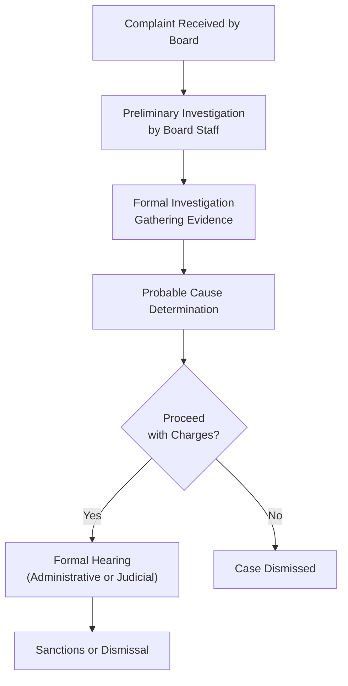

## 4.2 Investigations, Sanctions, and Grounds for Disciplinary Action

State Boards of Accountancy across the United States have authority not just to license Certified Public Accountants (CPAs), but also to investigate allegations of wrongdoing and—where misconduct is proven—administer sanctions to uphold professional standards and protect the public. This section discusses the investigative process, highlights the range of sanctions a CPA may face, and explores the grounds for disciplinary action. Students of the REG (Taxation and Regulation) section of the CPA Examination should have a clear framework for understanding how the authority to discipline works, how investigations proceed, and how CPAs can mitigate the risks of disciplinary issues.

In conjunction with [4.1 State Boards of Accountancy: Authority and Responsibilities](#) and [3.1 Treasury Department Circular 230](#), this section forms a cohesive overview of how licensing, responsibilities, and legal authority intersect to regulate and enforce professional conduct among CPAs.  

---

### Overview of the Investigative Authority

The authority to investigate CPAs for alleged misconduct stems from state statutes (often based on the Uniform Accountancy Act) outlining rules that govern professional practice. Each State Board of Accountancy typically has broad powers to:

• Receive complaints about CPA conduct.  
• Conduct investigative processes, including document review and witness interviews.  
• Collaborate with law enforcement agencies or the Internal Revenue Service (IRS) when allegations involve tax fraud or similar criminal activities.  
• Hold administrative hearings or refer matters to administrative law judges (ALJs).  
• Impose disciplinary measures when warranted.  

Although the process can vary among states, there is substantial common ground in these procedures. By standardizing investigative steps and ensuring due process, boards strive to protect the integrity of the profession.

---

### Key Steps in the Investigative Process

An investigation commonly follows a series of structured steps. Depending on the severity of the allegations or the availability of evidence, the duration and depth of each step may vary. However, the following framework captures the typical progression of an investigation:

1. **Filing or Receipt of Complaint**  
   • A complaint may come from a client, employer, another CPA, or a member of the general public.  
   • Some boards also monitor news media, court filings, or other public records to identify possible misconduct.  

2. **Preliminary Inquiry**  
   • Upon receiving the complaint, the State Board of Accountancy typically reviews its basic facts.  
   • The board may conduct an initial inquiry to confirm the CPA’s identity, verify licensure status, and ascertain if the allegation falls within the board’s jurisdiction.  

3. **Investigation and Gathering of Evidence**  
   • If the complaint appears valid, the board initiates a more formal investigation, compiling evidence such as emails, financial statements, tax returns, audit files, or client testimonials.  
   • Investigators may interview key stakeholders—clients, coworkers, or other CPAs engaged in the matter.  

4. **Determination of Probable Cause**  
   • The investigative committee evaluates whether enough evidence exists to pursue formal charges.  
   • If evidence is lacking, the board may dismiss the case. If probable cause is found, formal charges (or a notice) are issued to the CPA, defining the specific nature of the alleged professional misconduct.  

5. **Formal Hearing and Adjudication**  
   • Once charges are issued, boards generally offer the CPA an opportunity for a hearing.  
   • Hearings can be administrative or judicial in nature, allowing the CPA to respond, present evidence, call witnesses, or negotiate a settlement.  
   • An administrative law judge or the board itself may preside over these proceedings, ensuring fairness and compliance with procedural rules.  

6. **Decision and Imposition of Sanctions**  
   • After reviewing arguments and evidence from both sides, the board or ALJ makes a decision.  
   • If misconduct is proven, the board typically assigns disciplinary measures. Alternatively, the board may dismiss the charges if the CPA is found not at fault.  

7. **Appeals and Judicial Review**  
   • In many jurisdictions, CPAs have the right to appeal an adverse ruling to a higher administrative body or state court, seeking a review of procedural or substantive legal issues.  

Below is a flowchart demonstrating a high-level overview of the investigative process:

The objective of this process is to ensure the CPA’s right to due process while protecting the public from unethical or illegal practices.

---

### Grounds for Disciplinary Action

Several categories of misconduct can trigger an investigation. While each state’s specific grounds vary, some of the most common include:

• **Fraud, Dishonesty, or Deception**: CPAs are expected to maintain unwavering integrity. False reporting, misrepresentations of financial data, or tampering with client documentation can all lead to serious allegations.  
• **Violation of Professional Standards**: This encompasses breaches of Generally Accepted Accounting Principles (GAAP), Generally Accepted Auditing Standards (GAAS), or the AICPA Code of Professional Conduct.  
• **Negligence or Gross Negligence**: Failing to exercise due care or willfully disregarding recognized accounting, tax, or auditing guidelines may constitute grounds for discipline.  
• **Criminal Activities**: Conviction of specific criminal offenses (e.g., felonies involving moral turpitude, tax evasion) can automatically trigger board action.  
• **Personal Misconduct Affecting Professional Standing**: Certain state boards see personal misbehavior—such as substance abuse or fraudulent personal tax filings—as impairing a CPA’s ability to serve the public.  
• **Circular 230 Infractions**: When CPAs practice before the IRS, they must also adhere to [Treasury Department Circular 230](#). Violations like willfully understating a tax liability, promoting abusive tax shelters, or failing to file personal tax returns can result in parallel actions by both the IRS and the state board.

---

### Potential Sanctions

Sanctions align with the gravity and frequency of the misconduct. A minor recordkeeping lapse that demonstrates poor judgment but no malicious intent will normally result in more lenient sanctions than large-scale fraud. Common sanctions include:

1. **Reprimand or Censure**  
   • More formal than an advisory letter but less severe than license suspension.  
   • Often accompanies a mandate for continuing professional education (CPE).  

2. **License Suspension**  
   • The CPA’s license is suspended for a set period, during which practice is prohibited.  
   • May require completion of remedial courses before eligibility for reinstatement.  

3. **Probation**  
   • The CPA retains a restricted license contingent on meeting certain conditions, such as additional supervision, practice reviews, counseling, or random peer reviews.  
   • May require submission of quarterly reports to the board detailing compliance.  

4. **Monetary Fines**  
   • Fines vary by jurisdiction and severity of the offense.  
   • Commonly issued for infractions that have not compromised the overall integrity of a practice but warrant punitive or corrective action.  

5. **Revocation or Surrender of License**  
   • Among the most severe of penalties.  
   • CPAs lose the right to practice in that jurisdiction altogether. Sometimes, future reapplication is possible, but this often involves a multiyear waiting period and demonstration of rehabilitation.  

6. **Other Specific Conditions**  
   • Boards may demand restitution to aggrieved clients, mandatory ethics training, or even supervised practice.  
   • In rare cases of repeated or egregious misconduct, boards can permanently bar individuals from ever reapplying.  

The following table illustrates possible sanctions and their relative severity:

| Sanction Type          | Severity Level | Practice Restriction |
|------------------------|----------------|-----------------------|
| Advisory Letter        | Low            | None                 |
| Reprimand or Censure   | Moderate       | Potentially None      |
| Fine/Mandatory CPE     | Moderate       | None                 |
| Probation              | Moderate-High  | Restricted           |
| License Suspension     | High           | Prohibited           |
| License Revocation     | Very High      | Prohibited           |

---

### Example: A CPA Facing State Board Action

A recent scenario in State X highlights the importance of diligent adherence to professional guidelines. A senior CPA prepared financial statements for a client who owned multiple small businesses. During the audit, the CPA failed to properly segregate duties within the client’s accounting department and did not document suspicious transactions thoroughly. Multiple red flags of potential fraud went unaddressed.

• **Complaint Filed**: A subsequent external audit by another CPA firm discovered large discrepancies, prompting the client’s investor to file a complaint with the State Board against the original CPA.  
• **Investigation**: During the investigation, board examiners discovered the CPA had consistently overlooked standard audit procedures (at times not even obtaining essential confirmations).  
• **Hearing**: The board drafted formal charges, including failure to comply with GAAS and gross negligence in financial statement preparation. In the hearing, the CPA attempted to argue the tight reporting deadline and poor client cooperation as mitigating factors.  
• **Sanction**: The Board found the CPA’s defenses insufficient. The ultimate sanction included a three-month suspension of the CPA’s license, a monetary penalty, and a requirement for 24 hours of additional CPE in audit methodology.  

This real-world example demonstrates how deficient audit oversight, even absent fraudulent intent, can result in significant professional consequences.

---

### Common Pitfalls and Best Practices

CPAs should remain proactive and vigilant in complying with ethical mandates. Below are several recommendations to avoid disciplinary actions:

**Pitfalls to Avoid**  
• **Overlooking Ethical Red Flags**: Dismissing suspicious patterns in client records or ignoring potential conflicts of interest can lead to allegations of negligence.  
• **Insufficient Documentation**: Failing to document engagement work is among the most frequently cited issues in board disciplinary proceedings.  
• **Unfamiliarity with Renewal and Continuing Education Requirements**: CPAs who neglect to renew their licenses or miss state-specific CPE requirements risk disciplinary actions.  
• **Weak Internal Controls**: Even small firms should implement robust controls to prevent data breaches or unauthorized changes to financial statements.  

**Recommended Best Practices**  
• **Maintain Updated Knowledge**: Consistently update your knowledge of GAAP, GAAS, Circular 230, and state board rules.  
• **Implement Engagement Letters**: Clearly outline scope of services, fees, and client responsibilities. Written agreements can mitigate misunderstandings or disputes down the road.  
• **Peer Review and Mentoring**: Regular engagements with experienced peers help identify errors, improve processes, and reinforce accountability.  
• **Use of Technology Tools**: Leverage secure cloud-based solutions or advanced accounting software with built-in version controls and security measures to reduce errors.  
• **Regular CPE**: Instead of viewing CPE as a formality, regard it as an ongoing opportunity to sharpen technical and ethical competence.

---

### Coordination with Other Authorities

While State Boards of Accountancy handle the licensure aspect, CPAs can simultaneously face:

• **AICPA or State CPA Society Sanctions**: Membership suspension or expulsion if found in violation of the AICPA Code of Professional Conduct.  
• **IRS Office of Professional Responsibility (OPR)**: CPAs practicing before the IRS are subject to [Circular 230](#) rules. OPR has the power to censure, suspend, or disbar practitioners from representing taxpayers before the IRS.  
• **Civil and Criminal Courts**: Particularly when allegations involve fraud, embezzlement, or other criminal acts. See [Chapter 5: Federal Tax Procedures](#) for an in-depth overview of civil and criminal penalties in tax contexts.

---

### Strategic Advice for CPAs Under Investigation

Facing an investigation can be daunting. CPAs should consider the following steps early in the process:

1. **Seek Legal Counsel**  
   Retaining an attorney experienced in administrative law or white-collar defense can significantly improve the practitioner’s understanding of the process and possible defenses.

2. **Document Everything**  
   Compile relevant communications, client agreements, working papers, and internal review notes. Thorough documentation can serve as compelling evidence of proper conduct.

3. **Cooperate with Investigators**  
   While a CPA retains the right to remain silent in a criminal context, full cooperation in a state board inquiry (unless advised otherwise by counsel) can demonstrate good faith.

4. **Engage in Remedial Measures**  
   Even if wrongdoing is alleged, adopting remedial procedures—for instance, seeking additional staff training or switching to better internal controls—can show accountability and lessen the severity of potential sanctions.

5. **Participate Actively in the Hearing**  
   Prepare statements, provide character references, and present evidence to demonstrate your competence, integrity, and willingness to align with professional standards.

---

### Conclusion

The disciplinary process is designed to protect both the public and the dignity of the profession. For CPAs, understanding how investigations proceed, the reasons they may be initiated, and the range of possible sanctions is vital. By recognizing common pitfalls and following best practices, professionals can safeguard their reputation and the efficacy of their work.

Whether you are studying for the CPA Exam or currently practicing, remaining mindful of potential exposures is essential. Be diligent in your documentation, maintain the highest levels of professional ethics, and, if an allegation surfaces, seek timely legal and professional guidance.

---

## Investigations, Sanctions, and Grounds for Disciplinary Action: Your Comprehensive Quiz



### A CPA is most likely to face sanctions from a State Board of Accountancy if:
- [x] They intentionally misstate financial statements to benefit a client.
- [ ] They choose to work only with corporate tax clients.
- [ ] Their revenue drops during an economic recession.
- [ ] They report personal charitable contributions on someone else’s return.

> **Explanation:** Intentionally misstating financial statements is a clear violation of professional ethics and can lead to disciplinary action.

### In a typical investigatory process, which step occurs first?
- [x] A complaint or allegation is received by the state board.
- [ ] A formal hearing is held immediately.
- [x] Evidence is collected and witnesses are interviewed.
- [ ] A disbarment from practice is issued.

> **Explanation:** Investigations ordinarily commence once a complaint is filed, but quickly move into a fact-gathering phase, which includes interviewing witnesses.

### Which of the following is generally not a ground for disciplinary action against a CPA?
- [x] Declining to take on new clients due to a heavy workload.
- [ ] Violations of professional standards.
- [ ] Gross negligence in auditing services.
- [ ] Committing fraud or deceptive practices.

> **Explanation:** Simply declining to accept new clients is a business decision and not an ethical or professional breach.

### What is one of the potential outcomes if a board finds insufficient evidence during the investigation?
- [x] The complaint could be dismissed.
- [ ] Deportation proceedings may begin.
- [ ] The CPA must automatically pay a fine.
- [ ] The CPA’s license is immediately revoked.

> **Explanation:** If the board lacks sufficient evidence, the complaint is dismissed and no disciplinary actions are imposed.

### Which sanction is considered among the most severe that a State Board can impose?
- [x] License revocation
- [ ] Monetary fine
- [x] Mandatory CPE
- [ ] Probation

> **Explanation:** License revocation is one of the harshest sanctions, effectively barring the CPA from practicing in that jurisdiction.

### If a CPA is found guilty of a felony involving moral turpitude, the State Board of Accountancy is most likely to:
- [x] Initiate disciplinary proceedings.
- [ ] Automatically grant the CPA a waiver.
- [ ] Issue a mild advisory letter and close the case.
- [ ] Require the CPA to take an ethics exam with no further actions.

> **Explanation:** Felonies involving moral turpitude usually trigger board inquiries or direct sanctions because they compromise the CPA’s ability to uphold ethical standards.

### During an investigation, CPAs should:
- [x] Cooperate fully, unless counseled otherwise by their attorney.
- [ ] Conceal all documents until a subpoena arrives.
- [x] Fabricate alternate copies of records to confuse investigators.
- [ ] Never consult legal counsel.

> **Explanation:** Cooperating with an investigation, as well as seeking appropriate legal advice, is typically in the CPA’s best interest.

### Which of the following is most consistent with a moderate-level sanction?
- [x] Reprimand or censure
- [ ] License revocation
- [ ] No action is taken
- [ ] Court-ordered imprisonment

> **Explanation:** A reprimand or censure is more serious than an advisory letter but less severe than suspension or revocation.

### What is the key function of a formal hearing in the disciplinary process?
- [x] Provide an opportunity for the accused CPA to present their defense.
- [ ] Automatically disqualify the CPA’s license to practice.
- [ ] Conceal the evidence from external parties.
- [ ] Serve as a confidential counseling session only.

> **Explanation:** The formal hearing is where the CPA can confront evidence and argue their case in a structured legal setting.

### Under what circumstances may a CPA face sanctions from both the State Board and the IRS Office of Professional Responsibility?
- [x] The CPA violated Circular 230 while also failing to adhere to state accountancy statutes.
- [ ] The CPA missed a state board meeting where new CPE rules were discussed.
- [ ] The CPA decided to move to another state and canceled their license.
- [ ] The CPA agreed to serve as an expert witness without board permission.

> **Explanation:** Practitioners who violate Circular 230 and state regulations could be penalized by both the State Board of Accountancy and the IRS Office of Professional Responsibility.



---

## For Additional Practice and Deeper Preparation

### [Taxation & Regulation (REG) CPA Mock Exams](https://www.udemy.com/course/reg-cpa-mock-exams/?referralCode=55419EBD198F61530B12)

**Taxation & Regulation (REG) CPA Mocks:** 6 Full (1,500 Qs), Harder Than Real! In-Depth & Clear. Crush With Confidence!

- Tackle full-length mock exams designed to mirror real REG questions.  
- Refine your exam-day strategies with detailed, step-by-step solutions for every scenario.  
- Explore in-depth rationales that reinforce higher-level concepts, giving you an edge on test day.  
- Boost confidence and minimize anxiety by mastering every corner of the REG blueprint.  
- Perfect for those seeking exceptionally hard mocks and real-world readiness.  

_Disclaimer: This course is not endorsed by or affiliated with the AICPA, NASBA, or any official CPA Examination authority. All content is for educational and preparatory purposes only._
