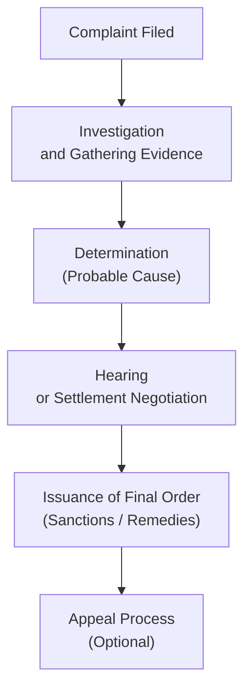
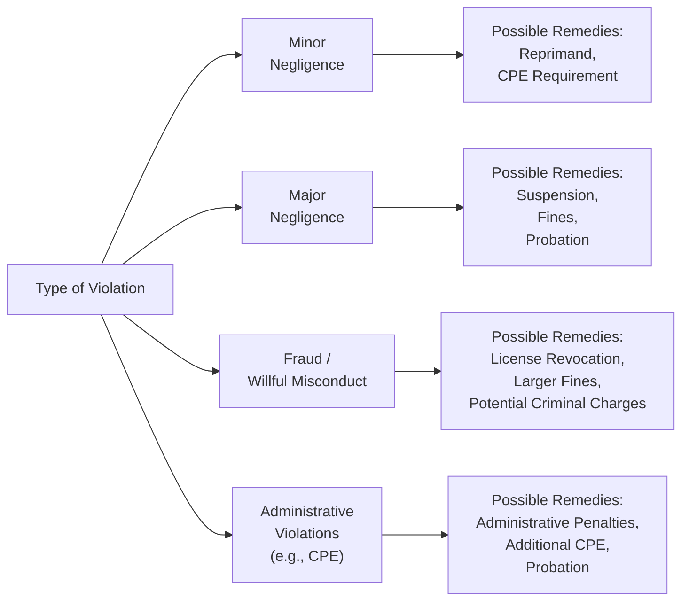

## 4.3 Common Violations and Typical Remedies

Maintaining high ethical and professional standards is central to the accounting profession. However, in certain situations, whether through negligence, lack of awareness, or deliberate misconduct, Certified Public Accountants (CPAs) and other tax professionals may engage in actions that violate applicable laws, regulations, or professional codes of conduct. This section provides an in-depth look at the most common violations encountered in practice, as well as the disciplinary processes and corrective remedies that frequently accompany such breaches. By examining real-world examples and hypothetical scenarios, readers will gain a clearer understanding of how to uphold professional and ethical guidelines while navigating complex financial and regulatory environments.

Below, you will find an overview of:
• Typical categories of violations, such as negligence, misrepresentation, and fraud.  
• Illustrative examples and factual scenarios.  
• Enforcement and disciplinary processes undertaken by State Boards of Accountancy and other regulators.  
• Typical remedial measures or sanctions imposed.  
• Best practices to prevent and address these infractions before they escalate.

---

### Common Categories of Violations
Violations for which CPAs and tax practitioners may face disciplinary action commonly revolve around the following broad categories:

• Negligence or Gross Negligence  
• Fraud or Intentional Misrepresentation  
• Violations of Circular 230 and Other Tax Regulations  
• Failure to Comply with Professional Standards  
• Breach of Confidentiality and Privileged Communications  
• Personal Misconduct or Criminal Behavior  
• Noncompliance With Licensing Requirements or Continuing Education

Each of these categories can carry its own set of penalties, up to and including revocation of a CPA license. The severity of the sanction depends on factors such as the harm caused to clients, the level of intent involved, and any previous history of violations.

---

### Illustrative Examples of Violations 

#### Negligence in Audit or Tax Engagements  
Negligence occurs when a practitioner fails to exercise reasonable care in performing professional duties. For instance, suppose a CPA issues an unqualified audit opinion without conducting the required audit procedures, overlooking material misstatements in the client’s financial statements. This oversight can be grounds for disciplinary action if it is determined that the CPA’s work did not meet relevant auditing standards or that they failed to adhere to Generally Accepted Auditing Standards (GAAS).

Another example might involve a tax preparer who fails to verify the legitimacy of deductions claimed by a client. If discovered by the Internal Revenue Service (IRS) during an audit, both the client and the preparer could be subject to penalties. The failure to maintain proper client documentation and exercise due diligence is often categorized as negligence.

#### Fraud or Intentional Misstatements  
Fraud is a serious charge, typically involving the intentional misrepresentation of financial results. An example might involve a CPA knowingly falsifying records to help a client evade taxes. Another scenario is deliberately inflating assets or understating liabilities in financial statements to secure bank loans or attract investors. Because fraud is an intentional act, sanctions are often more severe than those for negligence. 

#### Violations of Circular 230 and Tax Regulations  
As explored in Chapter 3 (Ethics and Responsibilities in Tax Practice), Circular 230 outlines the rules and regulations governing practice before the IRS. Common Circular 230 violations include:  
• Preparing returns that lack substantial authority for claimed positions.  
• Failing to advise a client if the client’s error on a previously filed tax return remains uncorrected.  
• Failing to sign a tax return as the preparer or not furnishing the preparer’s Tax Identification Number (PTIN).  

Violations of Circular 230 can lead to loss of the right to practice before the IRS, monetary penalties, or other disciplinary measures.

#### Failure to Adhere to Professional Standards (AICPA, State Boards)  
A CPA license not only grants the privilege to practice but also imposes continuing requirements, such as abiding by the AICPA Code of Professional Conduct, which mandates integrity, objectivity, and due care in engagements. Examples of violations in this category include:  
• Conflict of interest situations where the CPA fails to disclose a personal interest.  
• Refusal to cooperate with a peer review or professional inspection.  
• Intentional distortion of a client’s financial records to conceal personal misconduct or wrongdoing.

#### Breach of Confidentiality  
Protecting client information is a key obligation for accountants. A breach might involve sharing sensitive client data with a third party without consent. In the era of digital data, breaches may arise from improper data handling or cybersecurity practices. Breaches of confidentiality not only open practitioners to disciplinary sanction but also potentially to civil lawsuits and reputational harm.

#### Personal Misconduct  
Fraud, embezzlement, or other criminal convictions not directly related to professional engagement can still lead to disciplinary action by a State Board of Accountancy. Additionally, violations such as non-payment of child support or defaulting on certain obligations can sometimes prompt board inquiries if they reflect on the practitioner’s fitness to hold a CPA license.

#### Licensing and Continuing Education Violations  
Maintaining active licensure typically requires compliance with renewal procedures and continuing professional education (CPE) obligations. Common violations include:  
• Failing to satisfy CPE requirements within prescribed deadlines.  
• Falsifying documentation of completed CPE.  
• Practicing while a license is lapsed or voluntarily surrendered.  

State Boards regard these offenses seriously because they impact the practitioner’s ability to demonstrate continued competency.

---

### The Disciplinary Process: From Investigation to Resolution

When a potential violation is reported or discovered, State Boards of Accountancy (or other regulatory bodies) usually follow a structured process to resolve the matter. Although the details may vary by jurisdiction, the general steps often include:

1. **Complaint Filed**: A complaint may originate from a client, an employer, a colleague, or even the IRS.  
2. **Investigation and Gathering Evidence**: The board reviews supporting documentation, interviews witnesses, and, if necessary, subpoenas records.  
3. **Determination (Probable Cause)**: The board decides whether sufficient evidence exists to proceed with formal charges.  
4. **Hearing or Settlement Negotiation**: If probable cause is found, a hearing may be scheduled. Alternatively, settlement negotiations can take place to resolve the matter more quickly.  
5. **Issuance of Final Order (Sanctions/Remedies)**: If the CPA is found in violation, the board will issue a final order, imposing the disciplinary measures.  
6. **Appeal Process**: Depending on the jurisdiction, the licensee may pursue an appeal if they believe due process was not followed or if new evidence emerges.

This process ensures fairness and transparency, allowing practitioners the opportunity to defend themselves while also safeguarding the interests of the public.

---

### Typical Remedies and Disciplinary Actions

Depending on the gravity and nature of the violation, a State Board of Accountancy may impose one or more of the following remedies or disciplinary actions:

#### 1. Continuing Professional Education (CPE) Requirements
Practitioners may be ordered to complete additional CPE courses in areas related to the violation. For example, a CPA found negligent in tax engagements might be required to attend courses in advanced tax law or ethics.

#### 2. Fines and Monetary Penalties
Where serious misconduct or repeated violations occur, fines may be imposed to emphasize the importance of compliance. Fines could range from a few hundred dollars to substantial sums, depending on severity.

#### 3. Censure or Reprimand
The CPA may receive a formal written reprimand and have the disciplinary action recorded in their public records. This lesser sanction serves as a warning, sending a clear message that future violations may lead to more severe penalties.

#### 4. Suspension or Probation
For more serious or repeated offenses, boards may suspend a CPA’s license for a set duration. During suspension, the CPA is not allowed to practice public accounting. A probationary period may also be imposed with monitoring requirements, such as supervision under another CPA or periodic compliance reviews.

#### 5. License Revocation
Revocation is the most severe penalty, effectively barring the individual from practicing as a CPA. While some jurisdictions allow for reinstatement after a specified period, revocation can be permanent in extreme cases involving fraud or repeated intentional violations.

#### 6. Restrictions on Practice
Practitioners may be restricted from handling specific types of engagements. For instance, a CPA may be barred from providing audit services or signing tax returns for a set period. This partial limitation allows CPAs to continue other aspects of practice while preventing future violations in high-risk areas.

#### 7. Monitored or Supervised Practice
In certain cases, boards may decide a CPA can continue to practice only under supervision. Supervisory agreements often require regular reviews of the CPA’s work by a designated practitioner, ensuring that best practices and professional standards are followed meticulously.

#### 8. Restitution to Clients
If a violation resulted in financial harm to clients, the CPA might be required to refund fees or pay restitution. This measure aims to protect consumers and restore their trust in professional services.

---

### Real-World Scenario: Negligence in Tax Return Preparation

Consider this hypothetical situation:

A CPA named Emily consistently misses crucial deadlines for her clients’ tax filings, causing them to incur penalties and interest. When pressed for documentation, Emily fails to substantiate the tax positions taken. Complaints from multiple clients lead the State Board of Accountancy to launch an investigation.

• **Investigation Findings**: The board discovers that Emily had been overextending her schedule and hiring unqualified assistants without proper supervision. Several returns were incomplete and lacked essential supporting paperwork.  
• **Outcome**: The board finds Emily negligent in her practice.  
• **Sanctions Imposed**: Emily’s license is suspended for six months, and she is required to complete additional CPE hours in tax regulations, ethics, and practice management. She must also refund certain client fees and is placed on probation for two years.

In this scenario, Emily’s lack of oversight and organizational controls not only resulted in client harm but also a serious breach of professional duties.

---

### Practical Insights: Tips to Avoid Violations

Preventing ethical and professional pitfalls requires a proactive approach. Below are best practices to help CPAs and aspiring professionals maintain compliance and integrity:

• **Maintain Adequate Documentation**: Retain clear, organized records of each engagement, including checklists for due diligence.  
• **Keep Current on Professional Standards**: Engage in regular continuing education and stay updated on changes in tax law, auditing rules, and professional guidelines.  
• **Implement Quality Control Measures**: Adopt peer review programs or external evaluations to ensure compliance with GAAP, GAAS, and tax rules.  
• **Establish Ethical Firewalls**: Identify and address potential conflicts of interest early. If you find yourself in a dual role that compromises independence, consult guidance from the AICPA Code of Professional Conduct or relevant state regulations.  
• **Use Engagement Letters Wisely**: Clearly state the scope of services, responsibilities, fees, and confidentiality obligations in writing.  
• **Review Changes in the Law**: Pay special attention to new legislation, such as changes in the Internal Revenue Code or updates to Circular 230 provisions.  
• **Consult with Senior Practitioners or Legal Counsel**: If you face ethical dilemmas, seek advice from experienced colleagues or legal professionals. Early consultation can often prevent small issues from escalating into major violations.

---

### How CPAs Can Respond to Complaints or Allegations

No professional wants to face a complaint; however, allegations can sometimes arise even when a practitioner believes they have met their obligations. Response strategies include:

• **Stay Calm and Composed**: Emotional responses can aggravate the situation. Keep a clear record of communications and documents that support your position.  
• **Cooperate with Investigators**: Being transparent and willing to provide requested information demonstrates good faith. Objections should be raised with valid legal or procedural grounds.  
• **Seek Assistance**: If the complaint is complex, consider professional representation. An attorney or an experienced CPA can guide you through investigating and preparing a response.  
• **Address Weaknesses**: If internal controls or processes contributed to the complaint, rectify these issues immediately to avoid recurring infractions.

---

### Case Studies in Remediation

#### Scenario 1: Imposed Peer Review
A small CPA firm was found to have multiple audit deficiencies. Rather than revoking the licenses of the firm’s partners, the board imposed a peer review requirement, which mandated employing an independent, board-approved CPA to supervise the firm’s next audit engagements. Over 12 months, the peer reviewer provided feedback, and the firm eventually corrected systemic shortcomings that led to previous violations.

#### Scenario 2: CPE Falsification
A practitioner falsely claimed the completion of required CPE hours in taxation. Following a complaint, the board investigated and discovered discrepancies. Instead of revoking the license immediately, the board imposed a fine and mandated completing double the usual CPE requirement in relevant topics. Additionally, the CPA had to submit verifiable completion certificates from recognized providers.

These case studies illustrate the spectrum of penalties that boards can employ, from mild corrective measures to severe sanctions, ensuring that disciplinary action corresponds proportionately to the gravity of the offense and the circumstances under which it occurred.

---

### Diagrams for Quick Review

Below is a simple conceptual chart illustrating how different types of violations align with specific remedies or disciplinary measures. It is by no means exhaustive, but it helps visualize the relationships across violations and potential outcomes.

The severity of the violation drives the nature and extent of the remedy. In most instances, more serious violations—particularly those that involve intentional misconduct—face more severe sanctions.

---

### References and Further Exploration

• AICPA Code of Professional Conduct (Available at www.aicpa.org)  
• Treasury Department Circular 230 (Details in Chapter 3)  
• State Board of Accountancy Websites — Each state outlines its disciplinary proceedings.  
• Professional Liability Insurance Carriers — Often publish white papers on best practices to prevent negligence.  
• Chapter 6: Legal Duties and Responsibilities — Explores malpractice and additional legal ramifications.

---

## Test Your Knowledge: Common CPA Violations & Remedies



### Which of the following is often considered a minor disciplinary measure for CPAs found in violation of professional standards?

- [ ] License revocation
- [x] Written reprimand or censure
- [ ] Multiple-year suspension
- [ ] No further action

> **Explanation:** A written reprimand or censure is commonly imposed for less severe infringements, serving as a warning and a matter of public record.

### Which step usually follows the determination of probable cause in a state board’s disciplinary process?

- [ ] Filing a second complaint
- [x] A hearing or settlement negotiation
- [ ] Immediate license revocation
- [ ] Issuance of an arrest warrant

> **Explanation:** Once probable cause is established, the board will either set a hearing or work with the practitioner on a settlement agreement.

### What is a common remedy when the violation involves lack of updated knowledge or skills in a specific technical area?

- [x] Requiring additional CPE courses
- [ ] Immediate license revocation
- [ ] Referral to criminal court
- [ ] Publication of the CPA’s name in the local news

> **Explanation:** State Boards of Accountancy frequently mandate that a CPA undertake additional CPE hours to address deficiencies in a particular domain.

### Why might a CPA’s license be suspended rather than immediately revoked?

- [ ] Boards prefer not to punish CPAs
- [x] The misconduct, while serious, may be correctable, warranting a temporary removal from practice
- [ ] Suspension and revocation are effectively the same
- [ ] Suspension is less expensive for the board to administer

> **Explanation:** Suspension is often seen as corrective rather than purely punitive, giving CPAs the chance to rectify issues and continue practicing once the suspension ends.

### Which of the following scenarios most commonly leads to a finding of fraud rather than negligence?

- [ ] A CPA forgot to file a client’s extension
- [x] A CPA intentionally altered client records to hide income from the IRS
- [ ] A CPA miscalculated depreciation incorrectly
- [ ] A CPA failed to attend a mandatory CPE course

> **Explanation:** Fraud is predicated on intentional misrepresentations. Altering client records to hide income from the IRS is done deliberately, which indicates fraud.

### If a CPA persists in not completing the required CPE credits, which of the following outcomes is most likely?

- [ ] Monetary incentive from the board
- [ ] Immediate felony charges
- [x] Disciplinary measures from the State Board, potentially including license suspension
- [ ] No repercussions unless the CPA reports a different violation

> **Explanation:** Noncompliance with CPE obligations can lead to disciplinary actions, including suspension or even revocation for repeated violations.

### In the disciplinary process, which entity typically initiates or submits the complaint?

- [x] A client, colleague, government agency, or even the board itself
- [ ] Only the IRS
- [x] Only peers in the accounting profession
- [ ] Media outlets

> **Explanation:** Complaints may come from multiple sources, including clients, the IRS, colleagues, or others who become aware of potential misconduct.

### What is the primary purpose of restitution in disciplinary actions?

- [x] To compensate clients for financial harm caused by the CPA’s misconduct
- [ ] To reward the CPA for cooperation
- [ ] To prevent the CPA from testifying in future legal matters
- [ ] To reduce the cost of the investigation for the board

> **Explanation:** Restitution focuses on addressing the financial loss suffered by the client and restoring trust in the professional services provided.

### Which of the following best describes a monitored or supervised practice arrangement?

- [ ] The CPA’s license is immediately revoked, and they cannot practice
- [x] The CPA remains in practice but must operate under the oversight of a designated professional
- [ ] The CPA only performs volunteer work
- [ ] The CPA is restricted to preparing tax returns for close relatives

> **Explanation:** Under supervised practice, a CPA continues to provide services, but a board-approved supervisor reviews their work to ensure compliance with standards.

### The board’s final order in a disciplinary case can typically be appealed if:

- [x] The CPA believes due process wasn’t followed or new evidence comes to light
- [ ] The CPA simply wants a second chance
- [ ] The CPA chooses to assert innocence immediately
- [ ] There was a minor typographical error in the documents

> **Explanation:** Appeals are typically permitted when procedural errors are alleged or new evidence emerges. Just seeking a “second chance” without grounds generally does not suffice for an appeal.



---

## For Additional Practice and Deeper Preparation

### [Taxation & Regulation (REG) CPA Mock Exams](https://www.udemy.com/course/reg-cpa-mock-exams/?referralCode=55419EBD198F61530B12)

Taxation & Regulation (REG) CPA Mocks: 6 Full (1,500 Qs), Harder Than Real! In-Depth & Clear. Crush With Confidence!  
• Tackle full-length mock exams designed to mirror real REG questions.  
• Refine your exam-day strategies with detailed, step-by-step solutions for every scenario.  
• Explore in-depth rationales that reinforce higher-level concepts, giving you an edge on test day.  
• Boost confidence and minimize anxiety by mastering every corner of the REG blueprint.  
• Perfect for those seeking exceptionally hard mocks and real-world readiness.  

_Disclaimer: This course is not endorsed by or affiliated with the AICPA, NASBA, or any official CPA Examination authority. All content is for educational and preparatory purposes only._
