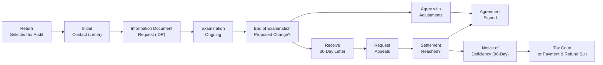

## 5.1 IRS Audit and Appeals Process

The Internal Revenue Service (IRS) Audit and Appeals Process is a cornerstone of U.S. tax administration. When a tax return is “flagged” or selected for further examination, taxpayers must comply with regulations, handle documentation requests, and—if necessary—seek resolution through the administrative appeals process. Although the idea of an IRS audit can be intimidating, understanding how audits are initiated, what they entail, and available avenues of dispute resolution will help taxpayers and practitioners navigate the process confidently and effectively. This section provides a thorough overview of how audits begin, the IRS’s various examination methods, how to respond to documentation requests, and how to resolve disputes through the IRS Appeals Office.

By the end of this chapter, you should be able to:
• Understand the different ways in which the IRS initiates audits  
• Grasp how to handle information and document requests  
• Appreciate the significance of the Appeals Office and how it can help in resolving disputes  

This knowledge will assist CPA candidates in takings steps to help their clients or employers during an IRS audit and beyond.

## Introduction to IRS Audits

IRS audits serve multiple purposes: they promote voluntary compliance, deter tax evasion, and rectify erroneous filings. Taxpayers, including individuals, corporations, and pass-through entities, may be subjected to an audit. With the vast volume of returns filed each year, the IRS systematically uses selection criteria and sophisticated statistical tools to identify those returns that are more likely to require adjustments.

An audit can result in several outcomes:
• No change: No additional tax, interest, or penalty.  
• Agreed changes: Taxpayer concurs with the IRS findings and pays additional amounts due.  
• Disagreed changes: If the taxpayer disagrees, they can pursue further administrative or judicial remedies.  

Understanding why a return might be chosen for audit and how the process unfolds helps taxpayers and practitioners remain prepared for every stage.

## How IRS Audits Are Initiated

While the IRS does not publicly disclose all factors used in audit selection, common triggers and processes for initiating audits include:

• Discriminant Function System (DIF): This is a secret scoring system assigning numeric values to tax returns based on the likelihood of underreported income. A higher DIF score often leads to closer scrutiny.

• Document Matching Programs: The IRS cross-references returns against Forms W-2, 1099, K-1, and other information returns. Discrepancies between a taxpayer’s reported income and these statements can trigger an audit.

• Large, Unusual, or Questionable (LUQ) Items: Returns featuring unusually high deductions, credits, or expenses compared to industry norms or statistical averages may be flagged.

• Related Examinations: If a partner, S corporation shareholder, or business associate is audited and adjustments suggest potential discrepancies in another individual’s or entity’s return, this can prompt a secondary (related) examination.

• Whistleblower Tips or Media Reports: Credible tips indicating unreported income or questionable transactions sometimes trigger an audit.

• Random Selection: A small number of returns may be randomly chosen each year as part of the IRS’s National Research Program.

## Types of IRS Audits

The IRS commonly conducts three main types of audits, each with its own features:

### Correspondence Audit
A correspondence audit is generally the least intrusive and is typically handled via email or postal mail. The IRS will send letters to request additional documentation related to specific items on the return (e.g., charitable contributions, deductions, or credits). Taxpayers respond by mailing the requested information or by clarifying discrepancies. If the issues are resolved satisfactorily, the audit often ends with minimal disruption.

### Office Audit
An office audit is a more detailed, in-person interview that takes place at a local IRS office. Taxpayers bring records (e.g., bank statements, receipts, invoices, and relevant schedules) to the meeting. The IRS auditor will review and ask questions. In some cases, minor adjustments are made quickly. In more complicated scenarios, further follow-up may be required.

### Field Audit
Field audits are the most comprehensive and involve an IRS agent visiting the taxpayer’s home, place of business, or the taxpayer’s representative’s office (e.g., a CPA firm). These audits can last for days or weeks, depending on the complexity of the return. Field audits can be more intrusive, as the IRS agent will likely review multiple facets of the taxpayer’s business operations, accounting methods, and record retention policies. This type of audit usually involves complex issues, substantial amounts of unreported income, or large businesses.

## Handling IRS Information and Document (IDR) Requests

Once a return is selected for audit, the examining agent sends an Information Document Request (IDR). The IDR outlines the specific information, documents, and records the IRS needs to verify items on the tax return. Common requests in an IDR include:

• Bank and brokerage statements  
• Financial statements, ledgers, accounting records  
• Contracts and agreements (rent/lease, employment, etc.)  
• Receipts for deductible expenses (charitable contributions, business expenses)  
• Mileage logs and travel records  

### Preparing Responses to IDRs

1. Review the IDR thoroughly: Ensure you fully understand what is being requested, taking note of deadlines.  
2. Gather requested documents and label them properly: Maintain an organized approach so you can readily find each document. Keep an index or a table of contents if you are working with large volumes.  
3. Provide complete but concise documentation: Avoid sending extraneous documents that were not requested, as it can create confusion or open new lines of inquiry.  
4. Communicate with the agent: Clarify any ambiguities in the IDR and request deadline extensions if needed. When done professionally and courteously, the agent is more likely to cooperate.  
5. Engage a tax professional: CPAs or tax attorneys can help evaluate the scope of requests and advice on documents that are privileged or that you are not legally obligated to provide.  

## The Role of IRS Appeals

If you disagree with the IRS’s proposed changes at the conclusion of an audit, you have the right to request an administrative appeal before proceeding with any litigation. The Appeals Office is an independent body within the IRS, mandated to impartially review disputes. Understanding how to navigate IRS Appeals can save considerable time and expense compared to taking the matter directly to court.

### Overview of the Appeals Process

1. Examination Ends with Proposed Adjustments: When the IRS completes an audit and proposes additional tax, penalties, or interest, they will issue a revenue agent’s report and a letter outlining the changes.  
2. 30-Day Letter: Typically, you will receive a 30-day letter giving you 30 days to either agree to the proposed adjustments or file a protest requesting an appeal.  
3. Filing a Protest: A taxpayer must file a written protest claiming disputes with each asserted adjustment and provide persuasive arguments, authoritative citations (e.g., Internal Revenue Code sections, Treasury Regulations, relevant case law).  
4. Appeals Conference: Once accepted, the case is assigned to an Appeals Officer, who evaluates the merits of both sides.  
5. Negotiation and Settlement: The Appeals Officer’s goal is to reach a fair settlement consistent with the hazards of litigation—basically an assessment of each side’s likelihood of prevailing if the case were taken to court.  
6. If Disagreement Persists: If you can’t reach agreement in Appeals, you may receive a Notice of Deficiency (often called a “90-day letter”), after which you can file a petition in the U.S. Tax Court or pay the tax and subsequently seek a refund in federal district court or the U.S. Court of Federal Claims.  

### Independence of the Appeals Office

An essential attribute of Appeals is its independence from the Examination Division that proposed the assessment. Appeals Officers are required to take a fresh look at the facts, weigh the arguments, and make an impartial determination. This arm’s length relationship helps ensure proper checks and balances within the IRS.

### Example: Settlement Through Appeals

Imagine a taxpayer, Lily, who operates an e-commerce business. The IRS completes a field audit and proposes adjustments for alleged underreporting of income and disallowance of certain business deductions. Lily believes most of these adjustments are incorrect and wants her case reconsidered. She timely requests an Appeals conference with a detailed written protest. During negotiations, the Appeals Officer examines Lily’s argument, relevant case law, and the evidence provided. The Appeals Officer concludes that the IRS’s assumption about Lily’s unreported income was overstated. The settlement significantly reduces the additional tax and eliminates penalties. Lily accepts, signs a closing agreement, and ends the dispute without going to court.

## Key Steps in the IRS Audit and Appeals Process

Below is a simplified flowchart illustrating key steps in an IRS examination and the path to Appeals if disagreements arise.

In this diagram, the examination process begins once a return is selected. After evaluating the documents and facts, the IRS either agrees that no adjustment is necessary or proposes changes. If the taxpayer agrees, the process ends. If not, the taxpayer typically has 30 days to appeal. Upon a failed settlement in Appeals, the taxpayer may receive a Notice of Deficiency, followed by the option to go to court.

## Common Challenges and Best Practices

### Challenges

• Time Sensitivity: Strict deadlines apply at each stage. Missing response deadlines can result in lost appeal rights or automatic assessments.  
• Data Organization: Gathering and organizing documents can be labor-intensive, particularly for businesses with inadequate recordkeeping.  
• Communication Gaps: Poor communication can lead to misunderstandings, additional requests from the agent, or extended audits.  
• Legal Complexity: Complex transactions can require specialized knowledge of tax law, leading to lengthy negotiations and potential appeals.

### Best Practices

• Maintain Organized Records: A robust recordkeeping system is your first line of defense in any audit. Keep relevant receipts, bank statements, invoices, and evidence of business transactions in a systematic way.  
• Seek Professional Guidance: Engaging a CPA, enrolled agent, or tax attorney can help clarify the audit scope, identify potential pitfalls, and respond appropriately.  
• Be Proactive and Cooperative: Communicate courteously with the IRS. Provide requested data on time or request reasonable extensions.  
• Know Your Rights: Taxpayers are entitled to representation and the right to a fair and impartial review. If you disagree, use administrative remedies like the Appeals Office before considering litigation.  
• Evaluate Settlement Opportunities: In Appeals, weigh the cost and likelihood of success if you choose to go to Tax Court or other judicial avenues. Sometimes a balanced settlement can be the most time-efficient and cost-effective resolution.

## Real-World Scenario: A Sole Proprietor Facing a Correspondence Audit

Suppose Aaron, a freelance graphic designer, claimed a large home office deduction for the year and received a letter from the IRS requesting details. The letter specifically asks for utility bills, mortgage interest statements, insurance statements, floor plans, and his work-from-home schedule. Aaron promptly replies with:

• An itemized spreadsheet showing how he calculated the home office percentage of his home’s total square footage  
• Copies of monthly utilities with relevant highlighter notations  
• A copy of his mortgage interest statement  
• Photographs showing the exclusive business use space

By methodically presenting strong documentation, Aaron addresses nearly all of the IRS’s concerns. The examiner determines the home office expense was justified, reduces minor portions of utility expenses that were not strictly business-related, and issues a modest proposed adjustment. Aaron agrees with the change, and the audit closes quickly. This scenario illustrates that well-documented expenses can facilitate a smoother audit process and an expedient resolution.

## Taxpayer Advocate Service (TAS)

In rare cases where a taxpayer experiences significant delays, hardships, or believes they are not being treated fairly, they can contact the Taxpayer Advocate Service (TAS). The TAS is an independent organization within the IRS that helps taxpayers resolve problems with the agency and ensure their rights are protected. Although TAS is not part of the formal Appeals chain—nor does it replace direct appeals or judicial remedies—it can cut through bureaucratic red tape if the taxpayer’s case meets certain criteria.

## Practical Tips for During an Audit

• Stay Organized: Maintain all incoming and outgoing correspondence in chronological order. Keep a master list of all documents submitted.  
• Be Respectful and Professional: The demeanor you present during the audit can influence the auditor’s willingness to cooperate or consider your perspective.  
• Offer Clear Explanations: When addressing discrepancies, provide as many relevant facts as needed to clarify the item in question. Mention statutory and regulatory authorities if possible.  
• Protect Privileged Communication: Communications with attorneys, or certain client-CPA communications in states with limited CPA privilege, could be protected. Check with your tax advisor before disclosing any privileged materials.  

## Conclusion

IRS audits and the subsequent appeals process are structured to ensure taxpayers pay the correct amount of tax required by law. While audits can be stressful, they also offer an opportunity to correct mistakes, clarify uncertainties, and even avoid more severe penalties. Knowledge of the processes, deadlines, and potential outcomes is crucial. Taxpayers and practitioners who remain organized, informed, and proactive can significantly reduce the negative impact of an audit.

If disagreements persist after the initial audit, the IRS Appeals Office offers an impartial forum to resolve disputes without resorting to court. By taking advantage of these administrative remedies, taxpayers can reach a fair, cost-effective resolution.

Thorough preparation, professional guidance, and the willingness to advocate for your position will help ensure you and your clients are protected throughout this process. In the next sections, we will explore additional topics related to federal tax procedures, substantiation requirements, and penalties that may arise during or after an audit.

## References

1. IRS Publication 556, “Examination of Returns, Appeal Rights, and Claims for Refund”  
2. IRS Publication 1, “Your Rights as a Taxpayer”  
3. Treasury Department Circular 230 for practitioner ethics and responsibilities.  
4. Internal Revenue Code and related Treasury Regulations for legal authorities.  
5. IRS.gov “Audits and Appeals” sections for updated procedures and FAQs.

## Master the IRS Audit and Appeals Process: Top 10 Practice Questions



### During an audit, the Information Document Request (IDR) is primarily used to:  
- [ ] Serve as a formal notice that an audit is about to begin.  
- [x] Request specific documents and data necessary to verify items on the tax return.  
- [ ] Summarize the proposed audit findings before the audit concludes.  
- [ ] Finalize any taxpayer liability without further negotiation.  

> **Explanation:** An IDR is an official request for supporting documentation during an audit. It is neither a finalization nor a summary of proposed findings.  

### Which of the following best describes a field audit?  
- [ ] A quick review conducted by phone.  
- [ ] A brief matching of taxpayer records with W-2s.  
- [x] An in-depth, on-site examination of a taxpayer’s home or business.  
- [ ] A purely voluntary meeting at the taxpayer’s lawyer’s office.  

> **Explanation:** A field audit is the most comprehensive type of IRS audit where an agent visits the taxpayer’s location to conduct a thorough examination.  

### If a taxpayer disagrees with an IRS examiner’s proposed changes and wishes to avoid litigation, the next step is usually to:  
- [ ] Appeal directly to the U.S. Supreme Court.  
- [x] Request a conference with the IRS Office of Appeals.  
- [ ] File a petition in Tax Court immediately.  
- [ ] Do nothing and wait for the final bill to arrive.  

> **Explanation:** The standard channel before litigation is an administrative appeal with the IRS Appeals Office, which is designed to settle disputes.  

### The 30-day letter notifies the taxpayer that:  
- [ ] Their appeal rights have expired.  
- [ ] Their only recourse is to file a petition in the U.S. Tax Court.  
- [x] They have a 30-day window to request an appeal or accept proposed changes.  
- [ ] The IRS plans to lien all of their assets immediately.  

> **Explanation:** The 30-day letter typically outlines the proposed adjustments and offers taxpayers 30 days to request an appeal or agree to the adjustments.  

### Which of the following is a common factor that triggers an IRS audit?  
- [x] Large, unusual, or questionable (LUQ) items on a return.  
- [ ] Having no tax liabilities and no reported income.  
- [x] Discrepancies between W-2 or 1099 forms and the taxpayer’s return.  
- [ ] Filing an extension to submit the tax return.  

> **Explanation:** LUQ items and document-matching discrepancies often trigger audits. Filing an extension itself is not typically a trigger.  

### The IRS Appeals Office is intended to be:  
- [x] An independent function within the IRS that reviews disputes for a fair resolution.  
- [ ] Part of litigation in the U.S. Tax Court.  
- [ ] A separate unit that handles only refunds.  
- [ ] Always mandatory before going to court.  

> **Explanation:** The Appeals Office functions independently of the Examination Division, focusing on resolving disputes without formal litigation. It’s not mandatory unless a taxpayer chooses to exhaust administrative remedies first.  

### True or False: A taxpayer can receive a Notice of Deficiency (90-day letter) without first receiving a 30-day letter.  
- [x] True  
- [ ] False  

> **Explanation:** In some cases (e.g., fast-tracked audits or other special circumstances), the IRS might bypass the 30-day letter and issue a 90-day letter directly.  

### When documents are requested through an IDR, taxpayers should:  
- [x] Provide complete and relevant documents in an organized manner.  
- [ ] Only provide the documents if they want to expedite the process.  
- [ ] Provide as much extra documentation as possible, even if unrelated.  
- [ ] Insist on meeting in Tax Court immediately.  

> **Explanation:** Responding promptly and organizing the requested information helps ensure an efficient audit process.  

### Which of the following is the best next step if the taxpayer and auditor cannot resolve their differences, and the taxpayer still disagrees with the proposed adjustments?  
- [ ] Immediately file criminal charges against the examiner.  
- [ ] Request a meeting with the Department of Justice.  
- [x] File a written protest and request a conference with the IRS Appeals Office.  
- [ ] Accept the adjustments to avoid further costs.  

> **Explanation:** Filing a written protest and requesting an administrative appeal is the standard step if disagreements remain.  

### The Taxpayer Advocate Service (TAS) is best described as:  
- [x] An independent organization within the IRS that assists taxpayers facing hardships or unresolved issues.  
- [ ] A mandatory step before requesting an IRS Appeals conference.  
- [ ] An external agency that audits the IRS.  
- [ ] An official body that imposes penalties on tax violations.  

> **Explanation:** TAS helps taxpayers who experience unresolved tax issues or financial hardship. It operates independently within the IRS but is not an appeals or enforcement body.  



## For Additional Practice and Deeper Preparation

### [Taxation & Regulation (REG) CPA Mock Exams](https://www.udemy.com/course/reg-cpa-mock-exams/?referralCode=55419EBD198F61530B12)

Taxation & Regulation (REG) CPA Mocks: 6 Full (1,500 Qs), Harder Than Real! In-Depth & Clear. Crush With Confidence!

- Tackle full-length mock exams designed to mirror real REG questions.  
- Refine your exam-day strategies with detailed, step-by-step solutions for every scenario.  
- Explore in-depth rationales that reinforce higher-level concepts, giving you an edge on test day.  
- Boost confidence and minimize anxiety by mastering every corner of the REG blueprint.  
- Perfect for those seeking exceptionally hard mocks and real-world readiness.

_Disclaimer: This course is not endorsed by or affiliated with the AICPA, NASBA, or any official CPA Examination authority. All content is for educational and preparatory purposes only._
