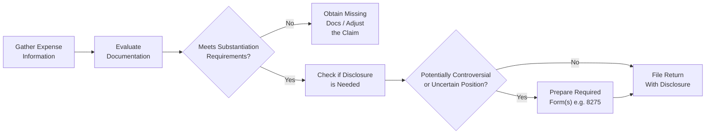

## 5.2 Substantiation and Disclosure Requirements

Proper substantiation and disclosure are pillars of accurate tax reporting and compliance. Insufficient or incorrect substantiation often leads to disallowed deductions, while inadequate disclosures may trigger penalties for negligence or underreporting. This section provides an in-depth look at the legal rules governing substantiation, typical documentation requirements, and the importance of disclosing tax positions that might otherwise draw heightened scrutiny from the Internal Revenue Service (IRS).

Maintaining effective records not only avoids negative tax and legal consequences but also fosters professional integrity and ethical conduct. This chapter will guide you through key standards, best practices, and the forms needed to avoid underreporting and negligence penalties.

---

### Introduction

Substantiation and disclosure requirements exist to ensure that taxpayers accurately reflect their income, deductions, and credits. Tax regulations set forth specific guidelines for documenting and disclosing various items on a tax return. Without these guidelines, it would be nearly impossible for the IRS to verify the legitimacy of taxpayers’ claims. 

From a professional standpoint, Certified Public Accountants (CPAs) and other tax practitioners must be vigilant about substantiation and disclosure. Whether you are advising clients or preparing your own returns, understanding these requirements reduces the likelihood of costly audits and penalties. In addition, robust substantiation practices reflect adherence to ethical standards—as outlined in Circular 230, the AICPA Statements on Standards for Tax Services (SSTS), and broader professional codes of conduct.

---

### Understanding Substantiation

Substantiation is the process of providing evidence or proof to validate tax return entries. The Internal Revenue Code (IRC) and associated Treasury Regulations set forth explicit requirements that detail the documentation necessary to back up each figure reported. 

Key aspects of substantiation include:  
• Verifiable records, such as receipts, canceled checks, bank statements, or mileage logs, that support deductions and credits.  
• Contemporaneous records—meaning documentation created at the time of the transaction—especially crucial for travel, meals, and entertainment expenses.  
• Detailed explanations for expenses, including dates, business purpose, and participants (when required).  

If the IRS audits a return, it is the taxpayer’s responsibility to produce sufficient evidence to support deductions or other tax positions. Under IRC § 6001, taxpayers must maintain records as long as they may be material to the administration of any IRS law.

---

### Key Documentation Requirements

Proper documentation is the lifeblood of substantiation. Regardless of the type of expense, always gather and store evidence that directly ties to the reported deduction or credit. Below are some common forms of documentation used for different expenses:

• Receipts or Invoices: Provide the items purchased, the amount paid, the date, and the vendor.  
• Canceled Checks: Highlight the payment made to a third party along with the date.  
• Bank and Credit Card Statements: Show amounts, dates, and recipient information.  
• Mileage Logs: Detail the starting and ending mileage, the purpose of travel, dates, and distances for vehicle-related deductions.  
• Appraisals and Valuations: Required for certain charitable contributions of property, significantly when the claimed value is high.  
• Contemporaneous Written Acknowledgment from Charitable Organizations: For donations of $250 or more, you must have a written acknowledgment stating the donation date, amount, and any goods or services received in return.

Without these required documents, you risk disallowances, even for legitimate expenses. The IRS rarely accepts “best estimates” in place of concrete records. 

---

### Common Items Requiring Substantiation

Although most deductions and credits have some form of substantiation requirement, a few categories attract particularly close IRS scrutiny:

#### Charitable Contributions  
Under IRC § 170, contributions to qualified organizations require varying degrees of documentation.  
• Cash Donations Under $250: Receipts, bank records, or credit card statements.  
• Single Contribution of $250 or More: Written acknowledgment from the organization stating the nature of the donation (cash or property), its value, and confirmation of no substantial goods or services received in exchange.  
• Non-Cash Contributions Over $5,000: Generally require a qualified appraisal, with additional disclosure through Form 8283 (Noncash Charitable Contributions).

#### Travel, Meals, and Entertainment  
IRC § 274 imposes strict documentation requirements for travel, meals, and entertainment expenses used as business deductions. In most cases, you must document:  
• The amount of the expense (e.g., hotel bills, airfare, restaurant receipts).  
• Time, date, place, and business purpose.  
• Business relationship of persons entertained (when relevant).  

#### Business Use of Vehicles  
Maintaining a contemporaneous mileage log is often the best practice. This log should include:  
• Odometer readings at the start and end of each trip.  
• The date, destination, and business purpose of the trip.  
• Evidence of total mileage for personal and business use if the vehicle is mixed-use.

#### Home Office Deduction  
If you operate a qualified home office, being able to substantiate that it is your principal place of business or used regularly and exclusively for business is essential. This often requires documentation of household expenses, square footage calculations, and proof of business activity performed in that space.

#### Depreciation and Cost Recovery  
Substantiation of the basis in depreciable or amortizable property is crucial. Keep purchase invoices, records of improvements, and details of placed-in-service dates to affirm cost recovery schedules.

---

### Disclosure Requirements

Disclosure requirements arise when taxpayers take positions on tax returns that may not be entirely straightforward or may involve potential controversies. The IRS uses these disclosures to identify returns that claim questionable or complex positions and to ensure compliance with certain regulations. 

Common disclosure forms and scenarios include:

• Form 8275 (Disclosure Statement): Used to disclose items or positions taken on a tax return that are contrary to Treasury regulations or lacking clear authority but for which there is a reasonable basis. Proper disclosure can reduce or eliminate the accuracy-related penalty under IRC § 6662 if the taxpayer has adequate support.  
• Form 8886 (Reportable Transaction Disclosure Statement): Required for taxpayers participating in listed or reportable transactions that the IRS identifies as potentially abusive.  
• Form 8082 (Notice of Inconsistent Treatment or Administrative Adjustment Request): Used when a partner, S corporation shareholder, or beneficiary of an estate or trust does not comply with the entity’s reporting.  
• Uncertain Tax Positions (Schedule UTP): Certain large corporations must disclose uncertain tax positions if they have assets above a specified threshold (generally $10 million or more).  

An important distinction: Substantiation deals with the evidence to prove an expense or transaction, whereas disclosure deals with notifying the IRS of particular tax positions. Both are critical for penalty protection, as full disclosure can mitigate potential inquiries into intent or negligence.

---

### Avoiding Penalties for Underreporting and Negligence

Underreporting penalties and negligence penalties can be substantial. IRC § 6662 imposes penalties of 20% on the underpayment of tax attributable to:  
• Negligence or disregard of rules or regulations.  
• Substantially understated income tax.  
• Substantial valuation misstatements.  

However, taxpayers can avoid these penalties by demonstrating reasonable cause, good faith, and adequate disclosure. This is where proper substantiation and appropriate disclosure forms become invaluable. If a position lacks substantial authority, disclosing it on Form 8275 might preserve penalty protection, provided the taxpayer has a reasonable basis and properly fills out the form. 

#### Accuracy-Related Penalty (Negligence)  
Negligence is a failure to make a reasonable attempt to comply with the tax code or to exercise ordinary and reasonable care in tax return preparation. Overstating deductions without documentation, for instance, can lead to negligence penalties. Maintaining excellent records is a clear defense against negligence claims.

#### Substantial Understatement of Tax  
A “substantial understatement” generally exists if the understatement exceeds the greater of 10% of the corrected tax or $5,000 for individuals ($10,000 for C corporations). Proper disclosure, combined with reasonable cause, can reduce or remove the penalty.

---

### Best Practices for Effective Substantiation and Disclosure

To mitigate risks and preserve penalty protection, consider the following best practices:

• Maintain Contemporaneous Records: Retain receipts, logs, and statements at the time of transaction—waiting until the end of the year or until an audit is pending can lead to reconstructed records, which the IRS may view unfavorably.  
• Use Accounting Software or Mobile Apps: Digital recordkeeping tools reduce errors and facilitate quick retrieval of documentation.  
• Implement Clear Policies for Employees: If you have a business, train employees on expense reimbursement policies, ensuring they submit itemized receipts and contextual documentation for business-related expenditures.  
• Regularly Review Tax Positions: Each year, examine whether certain positions need formal disclosure (e.g., using Form 8275 or Form 8886).  
• Consult Authoritative Sources: Seek guidance in Treasury Regulations, IRS Publications (such as Publications 17, 463, 526, and 334), the Internal Revenue Code, or professional standards when unsure about details.  
• If in Doubt, Disclose: When substantial authority is lacking or the treatment is unclear, sometimes the best course is to disclose. This transparency often provides a penalty shield if the IRS later disagrees with the position.

---

### Example: A Charitable Contribution Gone Wrong

Imagine a taxpayer, Rosa, who donates furniture to a local charity and estimates the value of the donation at $2,500. She claims a corresponding deduction on her Form 1040, Schedule A (Itemized Deductions). However, she fails to get a written acknowledgment from the charity and misplaces her receipt. When the IRS selects her return for examination, Rosa’s charitable deduction faces disallowance because:  
• She lacks proper evidence of the donation’s fair market value.  
• She has no contemporaneous written acknowledgment for contributions exceeding $250.  

The result? Rosa not only loses her $2,500 deduction but is also subject to additional tax and possibly accuracy-related penalties for negligence. Had she retained and provided a written acknowledgment or shown an independent appraisal (if the item’s value was controversial), the deduction would have likely held, avoiding penalties.

---

### Diagram: The Substantiation & Disclosure Workflow

Below is a Mermaid flowchart illustrating a simplified workflow for tax substantiation and disclosure decisions:

Explanation of the nodes:
• A["Gather Expense  Information"] – Start with collecting all relevant receipts, logs, or statements.  
• B["Evaluate  Documentation"] – Compare items to statutory and regulatory requirements.  
• C{"Meets Substantiation  Requirements?"} – Decision point: If no, rectify or remove the deduction. If yes, proceed.  
• E["Check if Disclosure  is Needed"] – Determine whether the position is uncertain or contrary to standard guidance.  
• F{"Potentially Controversial  or Uncertain Position?"} – If uncertain, prepare forms like Form 8275 or Form 8886.  
• G["File Return  Normally"] – Once items are properly substantiated, and no disclosure is needed, file your return.  
• H["Prepare Required  Form(s) e.g. 8275"] – For uncertain or potentially contentious positions, add the required disclosure forms.

---

### Conclusion

Substantiation and disclosure requirements are closely interwoven in the fabric of federal tax compliance. Detailed and timely recordkeeping lays the groundwork for solid substantiation, while accurate disclosure protects against underreporting and negligence penalties. Adopting best practices—like consistent documentation, prompt record retrieval, and transparent reporting of uncertain or controversial positions—benefits both you and your clients. Ultimately, fulfilling these obligations reflects professional accountability and significantly reduces exposure to adverse IRS actions.

Wherever ambiguities arise, consult authoritative IRS guidance, professional standards, or experienced tax professionals to ensure you meet the demands of this critical compliance area.

---

### Additional References

• IRS Publication 17: “Your Federal Income Tax (For Individuals)”  
• IRS Publication 463: “Travel, Gift, and Car Expenses”  
• IRS Publication 526: “Charitable Contributions”  
• IRS Publication 552: “Recordkeeping for Individuals”  
• Treasury Regulations (particularly Reg. § 1.274-5)  
• IRC §§ 6001, 6662, and 170  
• Form 8275, 8886, 8082 Instructions  

These resources provide further clarity on specific deductions, documentation rules, and disclosure guidelines. Supplementing your knowledge with these standards ensures you remain up-to-date and prepared for emerging audit challenges.

---

## Boost Your Substantiation and Disclosure Expertise: CPA Quiz



### What is the primary purpose of maintaining proper tax substantiation records?
- [x] To provide evidence that deductions or credits claimed on a return are valid  
- [ ] To allow taxpayers to claim additional deductions not authorized by law  
- [ ] To inform the IRS that the taxpayer is subject to unusual circumstances  
- [ ] To shift the burden of proof to the IRS automatically  

> **Explanation:** Proper substantiation provides necessary documentation for each deduction or credit, ensuring legitimacy and protecting taxpayers from potential disallowances or penalties.

### Which of the following is required for a charitable contribution of $250 or more?
- [ ] A personal note detailing the donor’s estimate of the fair market value  
- [x] A contemporaneous written acknowledgment from the charitable organization  
- [ ] A bank statement showing only the donation amount  
- [ ] None of the above  

> **Explanation:** IRC § 170 mandates a written acknowledgment from the charity for donations of $250 or more. This acknowledgment must state the amount, date, and whether the donor received goods or services in return.

### Form 8275 (Disclosure Statement) is primarily used for which purpose?
- [ ] Reporting foreign financial assets  
- [ ] Reporting listed or reportable transactions  
- [x] Disclosing tax positions that may be contrary to IRS regulations  
- [ ] Requesting an automatic extension of time to file  

> **Explanation:** Form 8275 is used to disclose positions that do not meet the substantial authority standard but have a reasonable basis, thereby helping avoid accuracy-related penalties.

### Which of the following is considered a contemporaneous record for vehicle mileage deductions?
- [x] A daily log noting dates, destinations, miles driven, and business purposes  
- [ ] A verbal confirmation by an employee of total mileage used  
- [ ] A single receipt showing purchase of gasoline  
- [ ] A credit card statement listing monthly gas purchases  

> **Explanation:** A daily or otherwise regularly updated log with all relevant trip details is necessary to satisfy the strict requirements for travel and vehicle expense substantiation under IRC § 274.

### Which best practice can minimize an accuracy-related penalty under IRC § 6662?
- [x] Providing sufficient disclosure of unclear positions on Form 8275  
- [ ] Waiting until an audit begins to gather receipts  
- [x] Maintaining thorough, contemporaneous documentation throughout the year  
- [ ] Guessing or estimating deductions at year-end  

> **Explanation:** Adequate disclosure along with thorough recordkeeping and accurate reporting helps avoid penalties by demonstrating reasonable cause and good faith efforts at compliance.

### What is the main consequence of using “best estimates” instead of retaining actual receipts?
- [x] The IRS may disallow the claimed deductions during an audit  
- [ ] The taxpayer automatically qualifies for the standard deduction  
- [ ] The IRS typically increases the allowable deduction  
- [ ] No consequences if the total estimate is below $5,000  

> **Explanation:** Without concrete documentation, the IRS can (and often will) deny the deductions, potentially assessing taxes and penalties.

### In the case of a substantial understatement of income tax, which statement is correct?
- [x] It arises when the understatement exceeds 10% of the correct tax or $5,000 (for individuals)  
- [ ] It rarely leads to penalties  
- [x] Effective disclosure and reasonable cause may help the taxpayer avoid penalties  
- [ ] It automatically triggers a civil fraud penalty  

> **Explanation:** A substantial understatement occurs under IRC § 6662 when the understatement is the greater of 10% of the tax required to be shown or $5,000 for individuals. With proper disclosure and authority, penalties can sometimes be avoided.

### Which of the following forms can be used to disclose a listed or reportable transaction?
- [ ] Form 8275-R  
- [ ] Form 8082  
- [ ] Schedule D  
- [x] Form 8886  

> **Explanation:** Taxpayers use Form 8886 (Reportable Transaction Disclosure Statement) to report participation in listed or reportable transactions.

### Why might a tax practitioner advise a client to disclose a particular position on Form 8275 even if they believe it is correct?
- [x] To reduce the risk of accuracy-related penalties if the IRS later disagrees  
- [ ] To avoid the statute of limitations from expiring  
- [ ] To guarantee a full refund of taxes paid  
- [ ] To temporarily lower the client’s marginal tax rate  

> **Explanation:** Disclosing a questionable or uncertain tax position can reduce or eliminate accuracy-related penalties if the IRS disagrees with the position.

### Is providing a written acknowledgment from the charitable organization always optional for a cash donation of $300?
- [x] True  
- [ ] False  

> **Explanation:** For contributions of $250 or more, a written acknowledgment is required. Substantiation rules in this area are strict, and failing to have proper documentation can lead to disallowance.



---

## For Additional Practice and Deeper Preparation

### [Taxation & Regulation (REG) CPA Mock Exams](https://www.udemy.com/course/reg-cpa-mock-exams/?referralCode=55419EBD198F61530B12)  

**Taxation & Regulation (REG) CPA Mocks:** 6 Full (1,500 Qs), Harder Than Real! In-Depth & Clear. Crush With Confidence! 

- Tackle full-length mock exams designed to mirror real REG questions.  
- Refine your exam-day strategies with detailed, step-by-step solutions for every scenario.  
- Explore in-depth rationales that reinforce higher-level concepts, giving you an edge on test day.  
- Boost confidence and minimize anxiety by mastering every corner of the REG blueprint.  
- Perfect for those seeking exceptionally hard mocks and real-world readiness.  

_Disclaimer: This course is not endorsed by or affiliated with the AICPA, NASBA, or any official CPA Examination authority. All content is for educational and preparatory purposes only._
