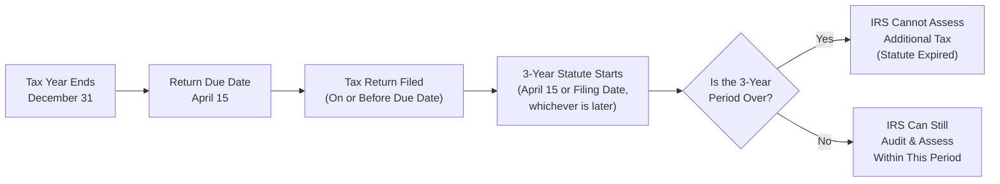

## 5.3 Statute of Limitations and Filing Deadlines

In federal tax practice, the statute of limitations and related filing deadlines are crucial for both taxpayers and practitioners to understand. These time restrictions govern when the Internal Revenue Service (IRS) can assess additional tax, how long taxpayers have to claim refunds, and highlight the consequences if a tax return is not filed or if fraud is involved. Mastery of these rules ensures proper compliance and awareness of potential risks, along with the strategies needed to mitigate them.

This section will discuss:
• Key definitions and overarching principles of statutes of limitations in tax law.  
• General three-year assessment period and extensions for underreporting.  
• Unlimited assessment periods for fraud and nonfilers.  
• Filing deadlines for individuals and entities, including extensions.  
• Practical examples, case studies, and a visual diagram to illustrate concepts.  
• Potential pitfalls, best practices, and references for further exploration.  

------------------------------------------------------------------

### Importance of Statute of Limitations

From the IRS’s perspective, the statute of limitations provides a boundary for examining and adjusting tax returns, eliminating indefinite uncertainty for taxpayers. From the taxpayer’s perspective, it limits exposure to older-year audits and offers certainty that once enough time has passed, the IRS cannot revisit those returns (barring special exceptions).

#### Key Takeaways

• The standard statute of limitations is three years, but there are significant exceptions.  
• Fraud, willful evasion, or nonfiling can open the door to unlimited examination periods.  
• Understanding filing deadlines is critical to starting the clock on the statute of limitations.  

------------------------------------------------------------------

### The General Three-Year Rule

Under Internal Revenue Code (IRC) §6501(a), the standard statute of limitations for the IRS to assess additional tax on a filed return is three years. The three-year period typically begins on the later of:  
1. The date the return was actually filed, or  
2. The original due date of the return (usually April 15 for individuals, but can vary based on weekends, holidays, automatic extensions, or fiscal year-ends).  

Once this three-year window closes, the IRS generally cannot propose additional assessments, except in limited situations discussed below. Taxpayers typically rely on this timeframe to determine record retention policies (many keep records for at least three years, though many choose to keep them longer in practice).

#### Example Illustration

1. An individual taxpayer files their Form 1040 two days before the due date, on April 13. Assuming no extensions are filed, the statute of limitations period begins on April 15, and the IRS must complete any assessments by April 15 three years later.  
2. A self-employed taxpayer files a return on January 18 (well before April 15). In this case, the statute of limitations starts running on April 15 of the filing year. If that taxpayer had filed on May 1 (late), the period would start on May 1—the actual filing date—because submission was after the due date.

------------------------------------------------------------------

### The Six-Year Extended Statute

#### Substantial Omission of Income

When a tax return omits more than 25% of the taxpayer’s gross income (IRC §6501(e)), the IRS may assess additional tax for up to six years from the date of filing (or the due date if the return was filed early). In simpler terms, if a taxpayer fails to report at least 25% of their total income on a return, the usual three-year window extends to six years.

• For example, a taxpayer reports $300,000 of gross income but actually earned $400,000. This $100,000 unreported amount constitutes 25% of total gross income, triggering the six-year rule.  
• The IRS vigorously enforces this substantial omission provision because it identifies a threshold that signals potential underreporting or negligence.

#### Specific Clarifications

• The six-year period only applies to amounts of gross income. Deductions, credits, or basis misstatements typically do not trigger the six-year rule—although basis overstatements that lead to an unreported gain can in some situations be deemed as an omission of income.  
• Certain pass-through items from partnerships or S corporations can also lead to a substantial omission if the individual taxpayer’s share goes unreported.  

------------------------------------------------------------------

### Unlimited Statute of Limitations

#### Fraudulent Returns or Tax Evasion

If the IRS finds evidence of fraudulent intent or willful tax evasion, the statute of limitations becomes indefinite (IRC §6501(c)(1)). Fraud involves intentional wrongdoing with the specific purpose of evading tax. Examples include:  

• Deliberate falsification of records or receipts.  
• Intentional double-counting of deductions or fabricating expenses.  
• Omitting entire sources of income while knowingly underreporting.  

When fraud is established, there is no time limit to the IRS’s ability to audit and assess the taxes, interest, or related penalties. If you are a tax practitioner, the presence of potential fraud imposes additional professional obligations under Circular 230 and the AICPA Statements on Standards for Tax Services (SSTS).

#### Nonfilers

If a taxpayer simply fails to file a required return, the statute of limitations does not begin to run (IRC §6501(c)(3)). In other words, for the clock to start ticking, there must be a valid return. The indefinite exposure to assessment highlights the importance of filing—even if certain or partial information is missing—because a late return is better than no return at all from a statute-of-limitations perspective.

#### Example of Unlimited Limitation

1. A taxpayer does not file a return for 2015. Many years later, the IRS obtains information about unfiled wage statements. Because no return was filed, the IRS can audit and assess tax for 2015 at any point in the future, regardless of how much time has passed.  
2. A business taxpayer commits fraud by claiming fictitious expenses. The IRS discovers this ten years after the original due date. Because it is fraud, the IRS can still assert taxes, interest, and penalties against the business.  

------------------------------------------------------------------

### Claiming Refunds and Credits

Although the focus here is on the period for IRS assessment, it is also important for taxpayers to know the timeline for claiming a refund or credit. General rules under IRC §6511 provide that individuals generally have three years from the date of filing (or two years from the time they paid the tax, if that period is later) to claim a refund. This is critical because if a taxpayer realizes they overpaid taxes four years ago, they might lose the opportunity to file an amended return and claim a credit or refund if the three-year window has expired.

------------------------------------------------------------------

### Filing Deadlines Overview

A key aspect of a return’s statute of limitations is the precise filing deadline, since that due date determines when the clock begins for the standard three-year or extended six-year period.

#### General Due Dates

• Individual Tax Returns (Form 1040): Due on April 15 following the close of the tax year (April 18 or 19 in some years if the 15th falls on a weekend or holiday).  
• Partnerships (Form 1065) and S Corporations (Form 1120S): Due on the 15th day of the third month following the close of the tax year (commonly March 15 for calendar-year filers).  
• C Corporations (Form 1120): Due on the 15th day of the fourth month following the close of the tax year (commonly April 15 for calendar-year filers).  

#### Automatic Extensions

Most filings allow for an automatic extension of time to file. Keep in mind, however, that an extension to file does not extend the deadline for paying taxes. Failing to pay the tax by the original due date results in interest and possible penalties.

• Individuals typically receive an automatic six-month extension (Form 4868) to file until October 15.  
• Partnerships and S corporations typically receive a six-month extension (Form 7004) to file until September 15 (if calendar year).  
• C Corporations, depending on their tax year, also typically receive up to a six-month extension (Form 7004).  

#### Impact on the Statute of Limitations

As noted before, the statute of limitations for assessment begins on the later of the due date (the original due date, not including extensions) or the date the taxpayer actually files the return. It is vital for taxpayers to be aware that filing before or after the original due date can shift the starting point of the statute of limitations.

------------------------------------------------------------------

### Common Pitfalls and Practitioner Tips

1. **Failing to keep consistent records:** If you have incomplete or disorganized records, you risk overlooking critical elements that can trigger the extended six-year or unlimited limitations period.  
2. **Ignoring Form 1099 or W-2 mismatches:** Unreported income due to mismatch in third-party documents can easily push you over the 25% omission threshold.  
3. **Overlooking basis calculations:** Complex basis calculations (for example, when selling real property or heavily depreciated assets) may inadvertently understate taxable gain and be interpreted as a substantial omission of income.  
4. **Miscommunication for partnerships and S corporations:** Partners or S corporation shareholders who fail to report their portion of Form K-1 items may face a longer assessment window.  
5. **Misassuming “late filing is the same as nonfiling”:** Late filing, even if the taxpayer does not pay on time, is still beneficial compared to no filing. Nonfiling carries an unlimited period for IRS assessment plus possible harsher penalties.  

#### Best Practices

• Thoroughly review all income sources before finalizing tax returns to avoid unintentional omissions.  
• File electronically and keep acknowledgment receipts. This helps establish proof of the filing date if questions arise later.  
• Organize documentation related to gross income, especially if the tax return is complex or includes pass-through entities.  
• If uncertain, consider consulting a professional or referencing the relevant sections of the IRC for specific issues.  

------------------------------------------------------------------

### Visualizing the Statute of Limitations

The following diagram illustrates, at a high level, how the statute of limitations timeline often looks under the standard three-year period for a calendar-year taxpayer. Assume no fraud and no large omissions of income:

Explanation:  
• The tax year ends on December 31 for calendar-year taxpayers.  
• The return is due April 15 (or the next business day if that date falls on a weekend or holiday).  
• If the return is filed on time, the three-year clock generally starts on April 15. If filed after April 15, that later date begins the clock.  
• The IRS must issue an assessment before the three-year period expires (absent specific exceptions).  

------------------------------------------------------------------

### Real-World Scenarios and Case Studies

1. **Scenario: Late Filing but No Fraud**  
   • Stefanie, a sole proprietor, filed her 2022 tax return on June 20, 2023—over two months late. The three-year statute begins on June 20, 2023, and ends on June 20, 2026. If Stefanie’s gross income on the 2022 return was $120,000 but she reported only $90,000 by accident, that underreporting is $30,000—25% of her total income. This triggers the six-year statute, extending the assessment period to June 20, 2029, unless it is found that she committed fraud, which would leave her exposed indefinitely.  

2. **Scenario: Fraud with Intentional Underreporting**  
   • Hari systematically omitted income from two large contracts in 2019, representing 40% of his total receipts. An IRS auditor discovered that Hari had fabricated business expenses to hide the revenue. This points toward fraud. The IRS can pursue an audit and assessment without time limitation, even if they discover the misdeed a decade later.  

3. **Scenario: Nonfiling for Multiple Years**  
   • For five consecutive years, Bella does not file returns. In the sixth year, the IRS initiates an enforcement action. There is no statute of limitations for any year Bella did not file. Bella’s best step now is typically to file all delinquent returns as soon as possible to start the limitation periods on those filed years and potentially reduce any penalty exposures.  

------------------------------------------------------------------

### Interaction with Other IRS Procedures

• **Amended Returns (Form 1040-X, 1120-X, etc.):** Filing an amended return within the original or extended assessment window can sometimes create a new “line of inquiry” for the IRS, but does not usually extend the statutory period unless it affects a substantial income omission or triggers an IRS claim of fraud.  
• **Audit Reopening:** Once the statute expires, the IRS generally cannot reopen final assessments unless there was fraud or a material misstatement.  
• **Tax Court and Judicial Proceedings:** If a Statutory Notice of Deficiency (90-day letter) is issued before the limitations period expires, the IRS must allow the taxpayer to challenge that deficiency in Tax Court. The lawsuit or court proceedings can effectively pause or “toll” the running of the statute of limitations.  

------------------------------------------------------------------

### Summary of Key Concepts

1. The standard three-year rule applies once a return is filed on or before its due date.  
2. A substantial omission of more than 25% of gross income generally leads to a six-year statute of limitations.  
3. Fraud and nonfiling result in no statute of limitations, exposing the taxpayer to indefinite audits.  
4. Accuracy in reporting is paramount in avoiding extended or indefinite assessment periods.  
5. Practical knowledge of filing deadlines is vital for identifying when the clock begins (or never begins, in the case of nonfiling).  

------------------------------------------------------------------

### References for Further Exploration

• IRC §6501 (Statute of Limitations on Assessment)  
• IRC §6511 (Limitations on Credit or Refund)  
• Circular 230 (Practice Before the IRS)  
• AICPA Statements on Standards for Tax Services (SSTS)  
• Publication 17, “Your Federal Income Tax” (IRS)  
• Publication 556, “Examination of Returns, Appeal Rights, and Claims for Refund” (IRS)  

------------------------------------------------------------------

## Quiz: Statute of Limitations and Filing Deadlines



### Which of the following best describes the general statute of limitations for the IRS to assess additional tax on a validly filed return?

- [ ] One year from filing date
- [ ] Two years from the tax year-end
- [x] Three years from the later of the filing date or due date
- [ ] Four years from the date of payment

> **Explanation:** The default statutory period under IRC §6501(a) is three years from the later of the date filed or the due date.

### When does the six-year statute of limitations generally apply to an individual tax return?

- [x] When the taxpayer omits more than 25% of gross income
- [ ] When total tax is less than $10,000
- [ ] When the taxpayer has underpaid self-employment taxes
- [ ] Automatically extended when an amended return is filed

> **Explanation:** IRC §6501(e) establishes a six-year period for a “substantial omission” of income exceeding 25% of the taxpayer’s gross income.

### If a taxpayer never files a return, how long does the IRS have to assess any taxes owed?

- [x] There is no time limit; the IRS can assess indefinitely
- [ ] Seven years from the unfiled return’s due date
- [ ] Ten years from the taxpayer’s final notice
- [ ] Three years from the date the taxpayer realized they should have filed

> **Explanation:** Under IRC §6501(c)(3), if a return is not filed, the statute of limitations does not begin, leaving no time limit for assessment.

### Which of the following is most likely to trigger an unlimited statute of limitations?

- [ ] Late payment of taxes for two consecutive years
- [ ] A math error on the tax return
- [ ] A small but unintentional omission of income
- [x] Fraudulent misrepresentation intended to evade tax

> **Explanation:** Fraud negates the usual limitation and allows the IRS an indefinite period to assess tax, interest, and penalties.

### How is the initial three-year period typically calculated for a taxpayer who files his return before the due date?

- [x] It begins on the due date, not the early filing date
- [ ] It starts on the postmark date
- [x] It depends on whether the taxpayer paid the balance due
- [ ] It never begins if no payment accompanied the return

> **Explanation:** If a return is filed early, the statute period begins on the original due date (April 15 for individuals, for instance). Whether the balance due was paid or not does not directly change this rule.

### Which of the following statements is the most accurate regarding refund claims?

- [x] Taxpayers generally must file a refund claim within three years of the date the tax return was filed
- [ ] Refund claims have the same deadline as paying estimated taxes
- [ ] Refunds can be claimed indefinitely for any year in the past
- [ ] Refund claims have a two-year limit always

> **Explanation:** Under IRC §6511, taxpayers generally have three years from the date of filing or two years from the time of paying tax (whichever is later) to claim a refund.

### A partner in an S corporation fails to report flow-through income on her personal return. Which statement best applies?

- [x] If the unreported income is more than 25% of her gross income, the statute of limitations extends to six years
- [ ] The statute of limitations is unaffected by pass-through omissions
- [x] The standard three-year statute still applies for all pass-through situations
- [ ] Fraud automatically applies to pass-through understatements

> **Explanation:** A partner or S corporation shareholder can trigger the six-year statute for substantial understatement of gross income. However, it’s not automatic fraud unless there is a proven intent to evade tax.

### Which of the following lists the correct due dates for a calendar-year taxpayer, assuming no holidays interfere?

- [x] Individuals: April 15; Partnerships/S Corporations: March 15; C Corporations: April 15
- [ ] Individuals: April 30; Partnerships: April 15; C Corporations: May 15
- [ ] Individuals: April 15; Partnerships/C Corporations: March 15
- [ ] Individuals: March 15; Partnerships: February 28; C Corporations: March 15

> **Explanation:** For most tax years, individuals and C Corporations generally file by April 15, and pass-through entities (partnerships/S corporations) generally file by March 15, unless holidays or weekend rules extend those dates.

### Filing an extension (e.g., Form 4868 for individuals) impacts the start date of which of the following?

- [ ] The standard statute of limitations automatically
- [x] The actual filing date if the return is filed after the original due date
- [ ] The length of time the IRS has to collect taxes
- [ ] The interest and penalties owed for late payment

> **Explanation:** Although an extension extends the due date to file, the statute of limitations generally starts on the later of the return filing date or original due date. If you file by the extended due date, and that date is after the original statutory due date, it can become the date the statute clock starts. Extensions do not alter interest and penalties for late payment.

### Fraud extends the statute of limitations to:

- [x] True
- [ ] False

> **Explanation:** Fraud eliminates the time limit for the IRS to assess tax, making the statute period indefinite.



------------------------------------------------------------------

## For Additional Practice and Deeper Preparation

### [Taxation & Regulation (REG) CPA Mock Exams](https://www.udemy.com/course/reg-cpa-mock-exams/?referralCode=55419EBD198F61530B12)

Taxation & Regulation (REG) CPA Mocks: 6 Full (1,500 Qs), Harder Than Real! In-Depth & Clear. Crush With Confidence!

- Tackle full-length mock exams designed to mirror real REG questions.  
- Refine your exam-day strategies with detailed, step-by-step solutions for every scenario.  
- Explore in-depth rationales that reinforce higher-level concepts, giving you an edge on test day.  
- Boost confidence and minimize anxiety by mastering every corner of the REG blueprint.  
- Perfect for those seeking exceptionally hard mocks and real-world readiness.

_Disclaimer: This course is not endorsed by or affiliated with the AICPA, NASBA, or any official CPA Examination authority. All content is for educational and preparatory purposes only._
