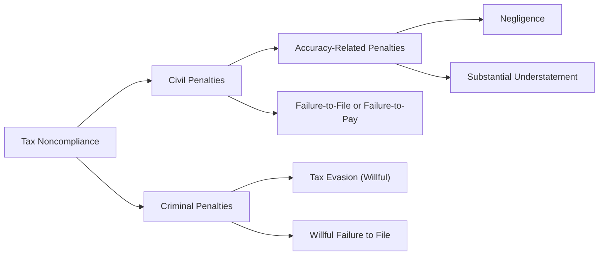
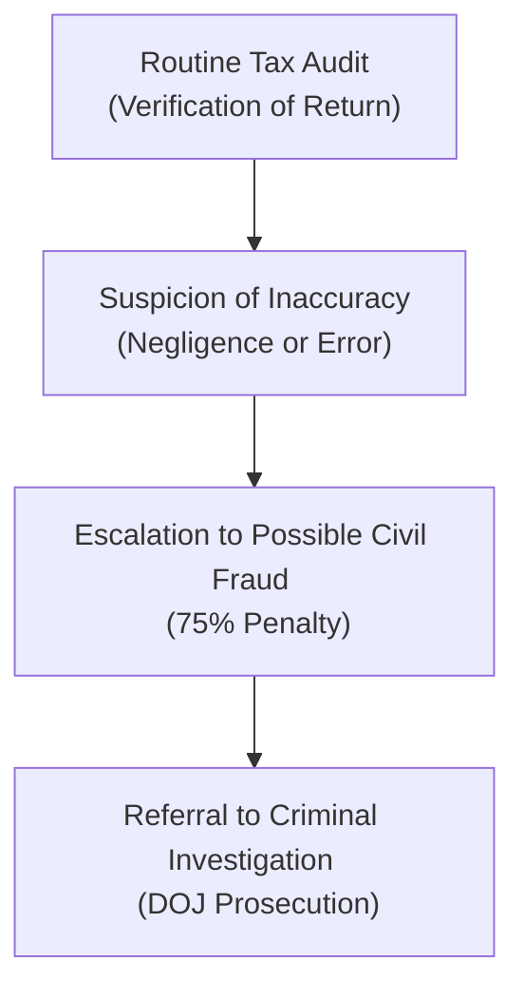

## 5.4 Civil and Criminal Penalties Imposed on Taxpayers

This section explores the broad spectrum of civil and criminal penalties that can be imposed on taxpayers. Both individuals and business entities must understand their obligations and potential liabilities under the Internal Revenue Code (IRC) and other laws enforced by the Internal Revenue Service (IRS). By being aware of possible sanctions—ranging from simple negligence penalties to severe fraud and criminal charges—taxpayers and tax professionals can take proactive steps to avoid costly mistakes and ensure compliance.

This discussion builds upon concepts introduced in earlier chapters, especially those related to ethics (Chapter 3) and IRS procedures (Chapter 5). While it is crucial for CPAs to adhere to ethical and professional guidelines, clients also bear responsibilities that can expose them to various penalties when those obligations are not met.

---

### Overview of Civil vs. Criminal Penalties

The tax law differentiates between civil and criminal penalties primarily by the degree of wrongdoing and the burden of proof required to assess them. In civil cases, the burden of proof is typically a “preponderance of the evidence.” By contrast, in criminal cases, the government must prove the taxpayer’s guilt “beyond a reasonable doubt.”

• Civil penalties: Imposed when taxpayers fail to comply with certain tax regulations, even if they did not act with willful intent. Examples include accuracy-related penalties for negligence or substantial understatements of tax.  
• Criminal penalties: Imposed when the taxpayer’s conduct rises to a level of willfulness, fraud, or deliberate evasion of tax laws. Criminal penalties can lead to fines, imprisonment, or both.

Below is a visual overview of how key categories of penalties branch off within the U.S. tax system:

As this diagram illustrates, civil and criminal penalties often arise through different tax law pathways, depending on the level of taxpayer conduct and willfulness. The next sections detail these penalties and the criteria used to determine their application.

---

### Common Civil Penalties for Taxpayers

Civil penalties are monetary in nature and do not involve incarceration. They are the most frequently encountered types of penalties because errors, oversights, or misunderstandings in tax returns are common. Civil penalties encompass negligence, substantial understatement, accuracy-related concerns, and failure to file or pay.

#### Negligence Penalty

• Definition: The IRS defines negligence as a failure to make a reasonable attempt to comply with the tax code or exercise ordinary and reasonable care in preparing a return.  
• IRC Provision: IRC §6662 imposes a 20% penalty on the portion of underpayment attributable to negligence or disregard of rules and regulations.  
• Examples of Negligence:  
  – Failing to keep adequate books and records of income and expenses.  
  – Understating income because of careless recordkeeping, not because of an intentional misstatement.  
  – Improperly claiming deductions or credits without making a reasonable effort to verify eligibility.  

#### Substantial Understatement Penalty

• Definition: A “substantial understatement” typically occurs when the amount of tax understated on the return exceeds the greater of (1) 10% of the correct tax, or (2) $5,000 for individuals. Different thresholds apply for corporations.  
• IRC Provision: This penalty also falls under IRC §6662 at a 20% rate.  
• Considerations:  
  – If the taxpayer had substantial authority for a position, or if the taxpayer adequately disclosed the position and had a reasonable basis for it, the penalty may be reduced or avoided.  
  – The penalty helps discourage taxpayers from claiming overly aggressive positions without a sound foundation.  

#### Accuracy-Related Penalties

Accuracy-related penalties encompass negligence, substantial understatement, and other types of infractions such as valuation misstatements. While the penalty rates for different categories within §6662 can vary, the standard rate is generally 20% of the underpayment.

##### Relevant Example

Suppose a self-employed individual fails to report a portion of business income because they relied on a bank deposit analysis that accidentally omitted several cash receipts. The taxpayer did not intend to defraud the government, but their omission demonstrates insufficient care. In this scenario, the IRS could impose an accuracy-related penalty for negligence, subjecting the unreported portion of the tax liability to an additional 20% penalty.

#### Failure-to-File and Failure-to-Pay Penalties

Two of the most straightforward civil penalties relate to timely filing and payment:

• Failure-to-File Penalty (IRC §6651(a)(1)): This penalty is generally 5% of the unpaid tax per month (or part of a month) the return is late, up to a maximum of 25%.  
• Failure-to-Pay Penalty (IRC §6651(a)(2)): This penalty is usually 0.5% of the unpaid tax per month (or part of a month), up to a maximum of 25%.  

When both a failure-to-file and failure-to-pay penalty apply, there are coordination rules to ensure the taxpayer is not excessively penalized. However, the combined impact can be significant, emphasizing the importance of timely filing and payment.

---

### Civil Fraud Penalty

“Fraud” in tax law implies intentional wrongdoing with the purpose of evading tax. Civil fraud is more severe than mere negligence:

• Definition: Willful intent to evade a tax or intentionally file a false return.  
• IRC Provision: IRC §6663 imposes a 75% penalty on the underpayment attributable to fraud.  
• Burden of Proof: The IRS must show clear and convincing evidence, a higher standard than negligence but lower than the criminal threshold of beyond a reasonable doubt.

If the IRS successfully establishes civil fraud, the resulting monetary penalty can be substantial. Additionally, the presence of civil fraud may increase the risk of criminal investigation.

---

### Criminal Penalties for Taxpayers

While civil penalties primarily involve monetary fines, criminal penalties address willful and fraudulent acts. Criminal convictions can result in substantial fines, imprisonment, or both. These typically involve the Department of Justice (DOJ) prosecution with the IRS providing investigative support.

#### Tax Evasion

• Statutory Basis: IRC §7201.  
• Definition: Willful attempt to evade or defeat a tax. This is often evidenced by affirmative acts of concealment or deception.  
• Possible Punishment: Up to five years in prison, fines up to $100,000 for individuals ($500,000 for corporations), and the cost of prosecution.

#### Willful Failure to File a Return

• Statutory Basis: IRC §7203.  
• Definition: Willfully failing to file a tax return on time, even if no tax is owed.  
• Possible Punishment: Up to one year of imprisonment, plus fines and the costs of prosecution.

#### Filing a False Return (Tax Perjury)

• Statutory Basis: IRC §7206(1).  
• Definition: Willfully making and subscribing to a tax return that the filer does not believe to be true and correct as to every material matter.  
• Possible Punishment: Up to three years in prison, monetary fines, or both.

Criminal tax charges typically arise when there is clear evidence of deliberate misconduct. Examples include keeping two sets of books, using secret bank accounts, or falsifying invoices to reduce the tax liability.

---

### Distinguishing Negligence from Fraud

A common question is how the IRS draws a line between civil negligence and civil fraud, and by extension, between civil fraud and criminal tax evasion. The key factor is the taxpayer’s state of mind:

• Negligence: Lack of due care, ordinary negligence, or disregard of rules. No intent to deceive or defraud.  
• Fraud: Knowing or intentional violation of legal duty. Conduct indicates an attempt to mislead, conceal, or evade tax.  

Although negligence may lead to civil penalties, it does not carry the stigma or severity of fraud. Fraud typically requires deception, such as forging financial records or consistently omitting income intentionally. Once the IRS identifies patterns suggesting deception, audits can escalate to civil fraud or even a criminal referral.

---

### Potential Penalty Mitigations and Defenses

Taxpayers can sometimes mitigate or avoid certain penalties by demonstrating:

1. Reasonable Cause: Showing that the cause for the error or late filing was due to circumstances beyond the taxpayer’s control, coupled with good faith efforts to comply (e.g., serious illness, reliance on a competent tax adviser).  
2. Substantial Authority: Being able to cite credible authority (Treasury Regulations, pertinent case law, IRS rulings) for a tax position, reducing or removing accuracy-related penalties.  
3. Reliance on Professional Advice: Establishing that the taxpayer relied in good faith on a competent tax professional’s guidance, provided all relevant information was furnished.  

Timing is critical. If the taxpayer can demonstrate they took prompt corrective actions—such as amending the return or paying the balance—before an audit or IRS notification, the IRS may show leniency.

---

### Practical Case Study

John, a small business owner, faces additional tax liability after an IRS audit reveals unreported income from John’s side activities. John had relied on a friend (with no formal accounting background) to prepare his returns. The IRS determines John’s case involves negligence because he failed to maintain adequate books and records, but no evidence suggests he intentionally hid income.

• Likely Outcome: John may be subject to a 20% negligence penalty under §6662 plus interest. If, however, the examiner found emails showing John actively coaching the friend to omit certain transactions, the penalty could escalate to a 75% civil fraud penalty. If those emails were extremely incriminating—indicating John falsified records—a criminal referral might occur, possibly leading to prosecution for tax evasion.

---

### Best Practices to Avoid Civil and Criminal Penalties

1. Maintain Adequate Records. Accurate and comprehensive documentation (invoices, receipts, financial statements) helps you withstand audits and defend your tax positions.  
2. Disclose Uncertain Positions. Use Form 8275 or 8275-R to disclose uncertain tax positions. This may avoid accuracy-related penalties if you have a reasonable basis.  
3. Seek Professional Advice. Engage reputable CPAs or attorneys for complex tax matters.  
4. File Timely and Accurately. Request automatic extensions if needed, but be aware of payment obligations that remain due by the original deadline.  
5. Proactive Corrections. If you discover an error, file an amended return promptly. This may prevent or reduce penalties.  

---

### Diagram: Civil vs. Criminal Penalty Escalation

The following diagram illustrates how a taxpayer’s case may escalate from routine civil inquiries to potential criminal investigations if certain indicators of fraud or willfulness come to light:

If the IRS initially discovers basic errors (B), they may impose standard civil penalties. But if their investigation uncovers willful deception or patterns of misconduct, the case can escalate to civil fraud (C). Ultimately, if there is sufficient evidence of criminal conduct, the IRS can refer the case to the Criminal Investigation Division (CID) for prosecution (D).

---

### Additional Resources and References

• IRC §§7201–7207 detail various criminal offenses and their punishments.  
• IRC §6662 outlines the accuracy-related penalty rules, including negligence and substantial understatement.  
• IRC §6663 provides guidance on civil fraud penalties.  
• Publication 17 (Your Federal Income Tax) provides general instructions and penalty tables.  
• The Internal Revenue Manual (IRM) contains the IRS’s internal guidelines for audits, fraud detection, and penalty imposition.  
• Chapter 5.1 (IRS Audit and Appeals Process) in this guidebook for strategies to handle an audit.  

---

Best practices, diligent recordkeeping, and ethical behavior go a long way toward avoiding penalty disputes with the IRS. While mistakes can happen, informed taxpayers and professionals who take prompt corrective measures are far less likely to face significant – or escalated – penalties. Ultimately, understanding the differences between negligence, fraud, and criminal conduct helps CPAs and their clients navigate the complexities of the tax system with greater confidence and security.

---

## Test Your Knowledge: Civil and Criminal Tax Penalties



### Which of the following statements best describes the difference between civil and criminal tax penalties?

- [x] Civil penalties often revolve around negligence or unintentional errors, while criminal penalties require willfulness or fraud.  
- [ ] Civil penalties are always more severe than criminal penalties.  
- [ ] Civil penalties can result in imprisonment, while criminal penalties only involve fines.  
- [ ] There is no real difference between civil and criminal tax penalties.

> **Explanation:** Civil penalties address noncompliance that typically lacks intent to defraud, whereas criminal penalties are reserved for willful and fraudulent acts that involve a higher level of intent.

### Which of the following penalties typically applies when a taxpayer’s return has a significant unreported tax that exceeds both 10% of the correct tax liability and $5,000 for an individual?

- [x] Substantial understatement penalty.  
- [ ] Failure-to-file penalty.  
- [ ] Negligence penalty.  
- [ ] Fraud penalty.

> **Explanation:** A substantial understatement penalty under IRC §6662 is triggered when the tax liability is understated by more than the greater of 10% of the correct tax or $5,000 for an individual.

### Negligence penalties are generally imposed at a rate of:

- [x] 20% of the underpayment.  
- [ ] 5% of the underpayment per month.  
- [ ] 75% of the underpayment.  
- [ ] 15% of the underpayment.

> **Explanation:** Negligence falls under the accuracy-related penalties in IRC §6662, which typically impose a 20% penalty on the portion of the underpayment attributable to negligence or disregard of rules.

### Which of the following accurately describes the failure-to-file penalty under IRC §6651(a)(1)?

- [x] It is generally 5% of the unpaid tax per month, not to exceed 25%.  
- [ ] It is generally 0.5% of the unpaid tax per month, not to exceed 25%.  
- [ ] It automatically abates if the taxpayer can pay the balance within six months.  
- [ ] It does not apply if the taxpayer files a return with a $0 balance.

> **Explanation:** The failure-to-file penalty runs at 5% each month for the tax due, up to a maximum of 25%. This penalty can be in addition to the failure-to-pay penalty if the taxpayer both files late and pays late.

### Which defense can mitigate an accuracy-related penalty if a taxpayer had a plausible basis for a tax position and disclosed it?

- [x] Reasonable basis and adequate disclosure.  
- [ ] Reliance on an untrained friend’s advice.  
- [x] Substantial authority with disclosure or reasonable basis with disclosure.  
- [ ] A situation in which the taxpayer paid penalties in prior years.

> **Explanation:** If the taxpayer discloses a position and has a reasonable or substantial authority for it, the IRS may waive certain accuracy-related penalties. Reliance on an untrained individual typically does not suffice.

### Which statement about civil fraud penalty is correct?

- [x] It carries a 75% penalty on the underpayment attributable to fraud.  
- [ ] It requires proof of fraud beyond a reasonable doubt.  
- [ ] It cannot be applied if the taxpayer did not keep records.  
- [ ] It is capped at 20% of the taxpayer’s underpayment.

> **Explanation:** Civil fraud carries a stiff 75% penalty. Although convictions for criminal fraud require proof beyond a reasonable doubt, civil fraud requires proof by clear and convincing evidence.

### Which provision covers criminal tax evasion?

- [x] IRC §7201.  
- [ ] IRC §6662.  
- [x] IRC §7206.  
- [ ] IRC §6663.

> **Explanation:** IRC §7201 specifically addresses tax evasion, a criminal act. IRC §7206 deals with making a false return. IRC §6662 and §6663 address civil penalties for accuracy and fraud, respectively.

### An IRS referral to the Criminal Investigation Division (CID) is most likely when:

- [x] There is strong evidence of willful or fraudulent intent.  
- [ ] A taxpayer disregards a friendly letter from the IRS.  
- [ ] The taxpayer files an extension of time to pay.  
- [ ] The taxpayer discloses a questionable position on Form 8275.

> **Explanation:** Criminal referrals typically occur when the IRS finds evidence of deliberate fraud or willful evasion. Extensions, disclosure forms, or ignoring an IRS letter do not by themselves indicate criminal intent.

### Willful failure to file a return can lead to:

- [x] Up to one year in prison and possible fines.  
- [ ] Only a 20% civil penalty.  
- [ ] Automatic penalty abatement if an extension is requested.  
- [ ] No criminal consequences, only interest and late fees.

> **Explanation:** Under IRC §7203, willfully failing to file a return is a misdemeanor punishable by fines and up to one year of imprisonment.

### If a taxpayer consistently omits income, forges financial records, and actively conceals assets, they are most likely at risk for:

- [x] Criminal tax evasion charges.  
- [ ] A simple inaccuracy penalty of 20%.  
- [ ] Only a failure-to-file penalty.  
- [ ] No penalty due to reasonable cause.

> **Explanation:** Omitting income, forging records, and concealing assets strongly indicate willful activity, which supports a case for criminal tax evasion.  



---

## For Additional Practice and Deeper Preparation

### [Taxation & Regulation (REG) CPA Mock Exams](https://www.udemy.com/course/reg-cpa-mock-exams/?referralCode=55419EBD198F61530B12)

Taxation & Regulation (REG) CPA Mocks: 6 Full (1,500 Qs), Harder Than Real! In-Depth & Clear. Crush With Confidence!

• Tackle full-length mock exams designed to mirror real REG questions.  
• Refine your exam-day strategies with detailed, step-by-step solutions for every scenario.  
• Explore in-depth rationales that reinforce higher-level concepts, giving you an edge on test day.  
• Boost confidence and minimize anxiety by mastering every corner of the REG blueprint.  
• Perfect for those seeking exceptionally hard mocks and real-world readiness.

_Disclaimer: This course is not endorsed by or affiliated with the AICPA, NASBA, or any official CPA Examination authority. All content is for educational and preparatory purposes only._
