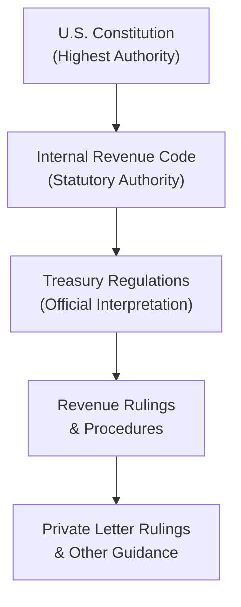

## 5.5 Authoritative Hierarchy: Code, Regulations, Rulings

This section covers the structure and ranking of authoritative tax sources that govern federal tax law. Understanding this hierarchy is critical for researching and interpreting tax legislation, regulations, and administrative guidance. Whether you are responding to an Internal Revenue Service (IRS) notice or preparing a client’s tax return, you must be aware of which sources carry the greatest weight and how to parse lower-level rulings and memoranda.

In prior chapters—particularly in Chapter 2.3 (Sources of Law in Business and Tax (Statute, Regulation, Case Law))—we introduced the concept of legal authority. Here, we delve deeper into the specific federal tax authorities: the Internal Revenue Code (IRC), Treasury Regulations, revenue rulings, revenue procedures, private letter rulings, and other IRS guidance. We also outline how to conduct research effectively using these sources. Finally, we highlight best practices and common pitfalls when applying these in professional practice or on the CPA Exam.

-------------------------------------------------------------------------------

### The Importance of the Authoritative Hierarchy

Tax law is vast, complex, and continually evolving. When you encounter a tax issue—whether for individual or entity taxation—you need to know which evidence of “tax law” truly governs the question at hand. For instance:

• If a revenue procedure conflicts with long-standing Treasury Regulations, which one should you follow?  
• If you discover a Private Letter Ruling (PLR) that seemingly addresses a client’s situation, can you rely on it?  

Answering these questions requires a solid understanding of the authoritative hierarchy. Generally, taxpayers and tax professionals should look first to the Internal Revenue Code (the statutory foundation) and then consult the Treasury Regulations (the official interpretation of the IRC by the U.S. Department of the Treasury). Only after reviewing these higher authorities should you consult rulings and other guidance, which serve to clarify or interpret narrower points.

-------------------------------------------------------------------------------

### Overview of the Hierarchy from Highest to Lowest Authority

Tax practitioners typically follow this general hierarchy for federal tax research and compliance:

1. United States Constitution (Highest Level of Law as it applies to taxation)  
2. The Internal Revenue Code (IRC or “the Code”)  
3. Treasury Regulations (Final, Temporary, Proposed; with Final Regulations carrying more weight)  
4. Revenue Rulings and Revenue Procedures (IRS administrative pronouncements)  
5. Private Letter Rulings (PLRs), Technical Advice Memoranda (TAMs), and other IRS guidance (often only binding on the requesting taxpayer)  
6. IRS Publications, Forms, Instructions, and FAQs (generally not binding but indicative of IRS position)

Note that judicial precedent from courts (e.g., Tax Court, District Courts, Circuit Courts of Appeals, Supreme Court) also plays a significant role. In practice, a Supreme Court ruling can override a portion of the Code if deemed unconstitutional (though extremely rare with respect to tax). Courts may also invalidate Treasury Regulations or interpret them in ways that effectively change the regulation’s practical application.

Below is a quick-reference Mermaid diagram illustrating the core structure of authoritative tax sources:

In the sections below, we break down each layer of authority, describing how it is enacted, interpreted, and cited during research.

-------------------------------------------------------------------------------

### The Internal Revenue Code (IRC)

The Internal Revenue Code is the statutory law enacted by Congress. It is codified as Title 26 of the United States Code. All other tax authorities ultimately derive from the Code or exist to clarify it. When determining the correct tax treatment of transactions, your starting point should always be the relevant Code sections.

1. Enactment and Format  
   • Tax laws originate as bills passed by the House of Representatives and the Senate, then signed by the President.  
   • Once signed, they become part of Title 26 of the U.S. Code, which collectively forms the IRC.

2. Citations  
   • A typical IRC citation reads: “IRC § 61(a)(1).”  
   • If you are referring to multiple subsections, you might read something like “IRC § 61(a)(1)(A).”  

3. Role in Tax Planning and Compliance  
   • The IRC is the “backbone” of all tax law.  
   • Interpretations of IRC language often arise from ambiguities that require clarifications from regulations and rulings.

-------------------------------------------------------------------------------

### Treasury Regulations

The next major layer of authority is the Treasury Regulations. Issued by the Treasury Department (often by the IRS under the Treasury’s delegation), these regulations clarify and interpret how the Internal Revenue Code is applied. While Congress passes statutes in relatively broad terms, the Regulations fill in specifics.

1. Types of Regulations  
   • Final Regulations: They have gone through the full notice-and-comment process under the Administrative Procedure Act. These carry significant legal weight.  
   • Temporary Regulations: Issued in cases where immediate guidance is necessary. They have binding effect for a limited duration (often three years).  
   • Proposed Regulations: Released for public comment. They do not carry full legal weight but provide insight into the Treasury’s intent.  

2. Legislative vs. Interpretive Regulations  
   • Legislative Regulations: Issued by the Treasury under a direct congressional mandate to create rules. These can carry the same weight as the IRC itself.  
   • Interpretive Regulations: Provide the Treasury’s interpretation of general Code provisions. They have high authority, but may be subject to judicial review under the Chevron Doctrine (courts can strike them down if deemed inconsistent with legislative intent).

3. Citations and Structure  
   • Cited as “Reg. § 1.61-2” for an interpretive regulation that discusses IRC § 61.  
   • Treasury Decision (T.D.) numbers are also used to track the chronology of when a regulation was adopted or amended.

-------------------------------------------------------------------------------

### IRS Administrative Pronouncements

When the Code or Regulations still leave room for ambiguity, the IRS often issues administrative pronouncements to explain or clarify the law’s application to specific circumstances.

#### Revenue Rulings

• A Revenue Ruling is an official interpretation by the IRS of how the tax law applies to a specific set of facts.  
• They are published in the Internal Revenue Bulletin (IRB) and carry precedential value for all taxpayers with substantially the same facts.  
• Citations typically look like: “Rev. Rul. 2023-15, 2023-28 I.R.B. 114.”  

Although Revenue Rulings do not carry the same weight as Treasury Regulations, courts generally give them deference if they are reasonable interpretations of the Code and Regulations.

#### Revenue Procedures

• These detail IRS administrative or procedural matters (e.g., how to file an application for a change in accounting method).  
• Also published in the IRB and typically cited as “Rev. Proc. 2023-10.”  
• Unlike Revenue Rulings, Revenue Procedures focus on procedural instructions rather than interpretive guidance on substantive tax law.

#### Notices and Announcements

• IRS Notices and Announcements are also published in the IRB, often used to inform taxpayers about administrative and compliance matters (e.g., granting relief in declared disaster areas).  
• They are typically short-lived or address immediate concerns.  

-------------------------------------------------------------------------------

### Private Letter Rulings, Technical Advice Memoranda, and Other Guidance

While Revenue Rulings and Procedures apply to all taxpayers in roughly similar situations, Private Letter Rulings (PLRs) and Technical Advice Memoranda (TAMs) address specific taxpayers’ circumstances.  

• Private Letter Rulings (PLRs): An IRS response to an individual taxpayer’s request for guidance on a proposed transaction. PLRs carry authority **only** for the requesting taxpayer and cannot be cited as precedent by other taxpayers, though they can be helpful as an insight into the IRS’s interpretation.  
• Technical Advice Memoranda (TAMs): Issued in response to questions that arise during an audit or on a contested issue. They resolve technical or procedural points within a narrower scope.  
• Chief Counsel Advice (CCA), Field Service Advice (FSA), and other forms of internal memoranda also exist but likewise are not binding for all taxpayers.

Although these forms of guidance do not bind the IRS for other taxpayers, practitioners often review them to gauge the IRS’s reasoning. If you find a PLR with facts very similar to your client’s situation, it can inform the best approach—though you must still be aware that the IRS or courts may not always apply it uniformly.

-------------------------------------------------------------------------------

### Judicial Authority: Tax Courts and Other Federal Courts

Court decisions interpret and apply the Code, Regulations, and administrative pronouncements. Decisional law is critical when disputes come before a court because:

• If the IRS denies or disputes a tax position, taxpayers can seek redress in the U.S. Tax Court, Federal District Court, or other courts with appropriate jurisdiction.  
• Appellate courts, including the different Circuit Courts of Appeals and ultimately the U.S. Supreme Court, may affirm, overturn, or modify a lower court’s ruling.  

In practice, a Supreme Court decision holds the highest judicial authority, followed by the Court of Appeals in each circuit. Because the IRS interprets and enforces the Code, it often modifies its positions if multiple courts interpret a rule differently—but only the Supreme Court stands as final arbiter.

-------------------------------------------------------------------------------

### Putting It All Together: Researching Authoritative Sources

When faced with a challenging tax question, how do you methodically consult these authorities? The steps below can serve as a guide:

1. **Identify the Relevant IRC Section**  
   • Start with the statutory text. If you have a question about income recognition, head to IRC § 61 and associated sections.  
   • Use cross-references within the Code (e.g., from IRC § 61 to IRC § 83 for property-based compensation issues).

2. **Examine Treasury Regulations**  
   • Review related Treasury Regulations under the same Code section.  
   • Pay attention to final vs. proposed regulations. Proposed rules can offer valuable insights but do not carry the force of law.

3. **Check for IRS Administrative Pronouncements**  
   • Consult Revenue Rulings and Revenue Procedures in the Internal Revenue Bulletin.  
   • Look for clarifications that might resolve interpretive questions.  

4. **Consider Judicial Precedent**  
   • If the question remains uncertain, search case law in your circuit.  
   • Look for controlling precedents from the Supreme Court or your applicable Court of Appeals.  

5. **Look Into Private Guidance**  
   • If you still need clarity, or if no official rulings exist, see whether a Private Letter Ruling (PLR) or Technical Advice Memorandum (TAM) addresses an analogous set of facts.  
   • Remember, PLRs apply only to the requesting taxpayer, but the reasoning might guide your approach.

6. **Document Your Research**  
   • Always note the authority you relied on and the date.  
   • If you end up in a compliance dispute, your well-documented reasoning can strengthen your defense or argument.

#### Practical Tools and Resources

• Commercial Databases: CCH IntelliConnect, Thomson Reuters Checkpoint, and Bloomberg Tax (formerly Bloomberg BNA) are widely used for tax research.  
• IRS Website: Offers free access to recent rulings, the Internal Revenue Manual, and other resources.  
• State Board of Accountancy: Some states require CPAs to demonstrate minimum competencies in legal research.  

-------------------------------------------------------------------------------

### Practical Financial Examples

Below are a few examples illustrating how a taxpayer or practitioner may navigate the authoritative hierarchy:

1. **Determining Income Under IRC § 61**  
   • Research the Code: You identify IRC § 61 as the baseline for gross income.  
   • Regulations: You review Treas. Reg. § 1.61-2, which clarifies that wages, salaries, and other forms of compensation are included in gross income.  
   • Administrative Guidance: You find a relevant Revenue Ruling (e.g., Rev. Rul. 79-24) illustrating that the value of bartered services must be included in income.  
   • Conclusion: You confirm that your client’s bartered exchange is taxable, citing both the Code and the Revenue Ruling in your workpapers.

2. **Applying a Tax Credit**  
   • Scenario: A client invests in solar panels and wants to claim an energy credit.  
   • Research the Code: Start by looking at IRC § 48, which addresses the Energy Investment Tax Credit (ITC).  
   • Regulations: Check if there are final or temporary Regulations.  
   • Administrative Pronouncements: Search for relevant Revenue Procedures or Notices, such as Notice 2018-59 addressing the “begun construction” requirement for certain energy credits.  
   • Conclusion: Combine the statutory language, final regulations, and IRS notices to ensure you apply the correct eligibility requirements, timelines, and credit amounts.

3. **Analyzing a Complex Partnership Transaction**  
   • The client has guaranteed certain partnership debt, affecting their at-risk amount.  
   • Research: IRC §§ 465 and 752 define the partnership basis and at-risk rules.  
   • Treasury Regulations: Treas. Reg. § 1.752-2 elaborates on how to allocate recourse liabilities.  
   • Additional Guidance: Suppose you find a Private Letter Ruling or Chief Counsel Advice that discusses very similar debt. You see how the IRS reasoned about whether the guarantee truly exposed the partner to economic risk.  
   • Conclusion: While the PLR is not binding on your client, it provides context. You combine the mandatory authority (IRC and Regulations) with clarifying guidance (PLR) to arrive at a defensible conclusion.

-------------------------------------------------------------------------------

### Common Pitfalls and Best Practices

• **Relying on Non-Authoritative Sources**: Some taxpayers mistakenly rely on IRS Publications (such as Publication 17) as absolute authority. Although publications can be a helpful summary, they are not binding law.  
• **Ignoring Proposed Regulations**: Proposed Regulations should not be cited as binding, but they can signal the trajectory of future law. Keep them in mind when planning for long-term strategies.  
• **Misusing Private Letter Rulings**: PLRs are specific to the taxpayer who requested them; do not assume that the reasoning automatically applies to your client.  
• **Failing to Account for Judicial Precedent**: Even if the Code seems clear, a court case in your jurisdiction might limit or expand the scope of a statutory provision.  
• **Outdated Regulations**: Some Regulations have not kept pace with frequent legislative changes. Be sure you are reviewing the most current version and cross-check if portions of older Regulations have been superseded.

-------------------------------------------------------------------------------

### Quick Reference Table: Federal Tax Authority Hierarchy

| Authority Level      | Example/Source                              | Binding?                               |
|----------------------|---------------------------------------------|----------------------------------------|
| Constitution         | U.S. Constitution                           | Supreme law                            |
| Code (Statute)       | IRC §§ 1 – 9834                             | Yes, enacted by Congress               |
| Treasury Regulations | Treas. Reg. § 1.61-2, T.D. 9508             | Yes, official interpretation           |
| Revenue Rulings      | Rev. Rul. 2022-5, 2022-10 I.R.B. 765        | Yes, precedential for substantially similar facts |
| Revenue Procedures   | Rev. Proc. 2022-2                          | Yes, procedural guidelines            |
| Private Guidance     | PLRs, TAMs, CCA                             | Binding only on requesting taxpayer    |
| Other IRS Materials  | Publications, Forms, Instructions, FAQs     | Not binding but informative            |

-------------------------------------------------------------------------------

### Diagram Explanation

The diagram presented earlier provides a visual overview of how each level connects sequentially. Start with the U.S. Constitution, which empowers Congress to levy and collect taxes. Congress enacts statutes codified in the IRC, and the Treasury Department (in collaboration with the IRS) issues Regulations interpreting the Code. Below them are official administrative pronouncements—Revenue Rulings and Procedures—that help apply these laws and regulations to specific circumstances. Finally, private guidance such as PLRs and TAMs addresses individual taxpayer inquiries but offers a glimpse into IRS thinking.

-------------------------------------------------------------------------------

### References for Further Exploration

• Internal Revenue Code (Title 26, U.S. Code): https://uscode.house.gov  
• Electronic Code of Federal Regulations (eCFR) for Treasury Regulations: https://www.ecfr.gov/current/title-26  
• IRS Internal Revenue Bulletin: https://www.irs.gov/irb  
• CCH IntelliConnect (Commercial Research Platform): https://taxna.wolterskluwer.com/professional  
• Thomson Reuters Checkpoint (Commercial Research Platform): https://tax.thomsonreuters.com/products/brands/checkpoint/  
• Bloomberg Tax: https://pro.bloombergtax.com/  

Use these resources to expand your in-depth knowledge of federal tax law, verify current updates, and check the latest interpretations by administrative and judicial bodies.

-------------------------------------------------------------------------------

## Test Your Mastery of Tax Authority Hierarchy

Below is a quiz designed to test your understanding of the federal tax authoritative hierarchy. Pay attention to how each question ties back to the concepts we explored in this section.

## Authoritative Tax Hierarchy and Research Quiz



### Which source of federal tax law holds the highest authority for statutory interpretation?

- [ ] Treasury Regulations
- [ ] Revenue Procedures
- [x] The Internal Revenue Code (IRC)
- [ ] Private Letter Rulings

> **Explanation:** The Internal Revenue Code (IRC) is the statutory foundation of tax law in the United States. Congress enacts the Code, and all subsequent regulations and rulings must be interpreted in alignment with it.

### Which of the following accurately describes the weight of a Private Letter Ruling (PLR)?

- [ ] A PLR is binding on all taxpayers who have similar facts.
- [x] A PLR is only binding on the specific taxpayer who requested it.
- [ ] A PLR is of the same authority as the Treasury Regulations.
- [ ] A PLR is more authoritative than the IRC.

> **Explanation:** PLRs cannot be cited as precedent by other taxpayers. Only the requesting taxpayer can rely on a PLR as binding, though it can offer insights into the IRS’s interpretation.

### What is the main difference between Temporary Regulations and Proposed Regulations?

- [x] Temporary Regulations are immediately effective, while Proposed Regulations are not yet final.
- [ ] Proposed Regulations carry more legal weight than Temporary Regulations.
- [ ] Temporary Regulations are only suggestions and do not have any legal standing.
- [ ] Both are equally binding from the date they are issued.

> **Explanation:** Temporary Regulations take effect upon issuance and remain authoritative until they expire or are finalized. Proposed Regulations, on the other hand, do not carry legal force until made final.

### In which publication are Revenue Rulings and Revenue Procedures first published?

- [ ] The Federal Register
- [x] The Internal Revenue Bulletin (IRB)
- [ ] U.S. Code Congressional and Administrative News
- [ ] Official Congressional Record

> **Explanation:** The Internal Revenue Bulletin is the official weekly publication where the IRS discloses Revenue Rulings, Revenue Procedures, Notices, and Announcements.

### Which of the following types of authority is considered least binding on taxpayers?

- [ ] Revenue Procedures
- [ ] Treasury Regulations
- [ ] Revenue Rulings
- [x] IRS Publications and FAQs

> **Explanation:** IRS Publications and online FAQs, while helpful for guidance, are not legally binding. They reflect the IRS’s current interpretations but do not have the force of law.

### What should be your first step when researching a complex tax issue?

- [ ] Consult the most recent Revenue Procedure.
- [x] Identify and read the relevant sections of the Internal Revenue Code.
- [ ] Look for a Private Letter Ruling on the IRS website.
- [ ] Search for online IRS FAQs.

> **Explanation:** Always begin research by identifying the statutory basis in the Internal Revenue Code. From there, move on to regulations and other guidance.

### When a court decision contradicts a Treasury Regulation, which of the following statements holds true?

- [ ] The Treasury Regulation always prevails.
- [x] The court decision may override or invalidate the regulation if it is deemed inconsistent with the Code.
- [ ] The Code section no longer applies.
- [ ] All other courts must automatically adopt the IRS’s position.

> **Explanation:** Courts can determine that Treasury Regulations are invalid if they conflict with the clear intent of the Code, thus overriding them in that court’s jurisdiction (or nationwide if decided by the Supreme Court).

### Why are Proposed Regulations still important to monitor even though they are not final?

- [x] They provide insights into how the IRS and Treasury may interpret future law.
- [ ] They are immediately binding.
- [ ] They have the same authority as the Internal Revenue Code.
- [ ] They cannot change before being finalized.

> **Explanation:** Proposed Regulations provide guidance on how the IRS plans to enforce or interpret the Code. They might be modified before finalization, but they can inform strategic planning.

### Which of the following correctly ranks authorities in descending order of weight?

- [ ] Revenue Rulings > Treasury Regulations > IRC
- [x] Internal Revenue Code > Treasury Regulations > Revenue Rulings
- [ ] Treasury Regulations > Internal Revenue Code > Private Letter Rulings
- [ ] Internal Revenue Code > Private Letter Rulings > Revenue Rulings

> **Explanation:** The Code is at the top, followed by Treasury Regulations, then administrative pronouncements such as Revenue Rulings, with private rulings applicable only to specific taxpayers.

### True or False: A Revenue Procedure generally sets forth the IRS’s stance on the substantive tax law itself rather than procedural issues.

- [x] False
- [ ] True

> **Explanation:** Revenue Procedures primarily govern procedural or administrative matters (e.g., how to file certain forms, how to request relief), while Revenue Rulings focus on the IRS’s interpretation of substantive law.



-------------------------------------------------------------------------------

## For Additional Practice and Deeper Preparation

### [Taxation & Regulation (REG) CPA Mock Exams](https://www.udemy.com/course/reg-cpa-mock-exams/?referralCode=55419EBD198F61530B12)

Taxation & Regulation (REG) CPA Mocks: 6 Full (1,500 Qs), Harder Than Real! In-Depth & Clear. Crush With Confidence! 

- Tackle full-length mock exams designed to mirror real REG questions.  
- Refine your exam-day strategies with detailed, step-by-step solutions for every scenario.  
- Explore in-depth rationales that reinforce higher-level concepts, giving you an edge on test day.  
- Boost confidence and minimize anxiety by mastering every corner of the REG blueprint.  
- Perfect for those seeking exceptionally hard mocks and real-world readiness.

_Disclaimer: This course is not endorsed by or affiliated with the AICPA, NASBA, or any official CPA Examination authority. All content is for educational and preparatory purposes only._
