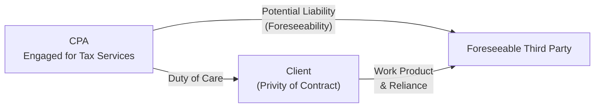

## 6.1 Common Law Duties to Clients and Third Parties

In the course of providing tax and accounting services, Certified Public Accountants (CPAs) and other tax professionals owe specific legal duties under common law. These obligations run primarily to the clients who have engaged them. However, depending on circumstances, third parties may also seek redress if they have reasonably relied on a CPA’s work product. The scope of these duties, shaped by the principles of negligence, gross negligence, foreseeability, and privity, can significantly affect a CPA’s exposure to liability.

This section provides an in-depth exploration of how common law duties arise, the difference between negligence and gross negligence, key tests for foreseeability, and the intricacies of privity in tax engagements. It also illustrates how CPAs can manage these responsibilities through best practices, client communication, and careful documentation.

---------------------------------------------------------------------

### Understanding Common Law Duties

Common law duties are obligations imposed by courts through legal precedents and judicial decisions, as opposed to statutory duties explicitly codified in legislation. For CPAs, these duties exist alongside statutory requirements (such as those found in the Internal Revenue Code or Department of Treasury regulations) and professional obligations (such as those outlined in AICPA standards and Circular 230). Failure to meet these duties can result in legal liability and sanctions, ranging from civil damages to disciplinary actions by state boards of accountancy.

While your ethical and professional responsibilities (see Chapter 3: Ethics and Responsibilities in Tax Practice) establish the baseline for proper conduct, your common law duties accentuate the potential for civil liability to both clients and, under certain circumstances, third parties who rely on your professional output or statements.

---------------------------------------------------------------------

### Negligence in Tax Engagements

Negligence in the context of CPA services refers to the failure to exercise the degree of care that a reasonably prudent practitioner would use in similar circumstances. It involves a lapse in the standard of care that professionals owe to their clients (and sometimes third parties). The essential elements that a plaintiff must typically prove to establish negligence are:

1. **Duty of Care**  
   The CPA owes a legal duty to the client (or an identifiable third party) to use the skill, prudence, and diligence that a reasonable CPA would have under similar conditions.

2. **Breach of Duty**  
   The CPA fails to perform in accordance with the applicable standard of care. This could be due to an omission (e.g., failing to verify specific documentation) or a commission (e.g., incorrectly applying tax regulations).

3. **Causation**  
   The breach of duty must be the cause of the harm suffered. This includes actual cause (“but for” the CPA’s breach, the harm would not have occurred) and proximate cause (the harm is a foreseeable result of the breach).

4. **Damages**  
   The injured party must experience actual losses, whether financial or otherwise, directly attributable to the CPA’s breach. In tax engagements, damages may include IRS penalties, interest, or other monetary losses stemming from incorrect or negligent advice.

---------------------------------------------------------------------

### Gross Negligence: A Higher Standard of Fault

Gross negligence goes beyond ordinary negligence, requiring a reckless disregard for one’s professional obligations. Whereas ordinary negligence might arise from an oversight or failure to see a potential risk, gross negligence suggests an extreme carelessness or an intentional disregard for the duty of care.

• **Example**: Suppose a CPA repeatedly ignores a client’s warnings about questionable tax transactions and signs off on a return without any substantive analysis. If the CPA’s inaction or lack of scrutiny is deemed so reckless that it constitutes an intentional indifference to the client’s welfare, this conduct may be classified as gross negligence.

Legal consequences for gross negligence can be severe. Courts frequently impose punitive damages (where allowed by state law) if a CPA’s actions are so egregious that they call for punishment beyond mere compensation. In addition, findings of gross negligence often trigger professional disciplinary proceedings, as such behavior undermines the public’s trust in the accounting profession.

---------------------------------------------------------------------

### Foreseeability of Third-Party Reliance

A foundational question in determining whether a CPA is liable to a non-client (e.g., creditors, investors, or potential business partners) is whether it was reasonably foreseeable that these third parties would rely on the CPA-prepared documents or professional conduct.

For example, when a CPA delivers a set of financial statements or a tax return that may be used in negotiations for loan approval, a prospective lender might rely on these documents in making lending decisions. If it is foreseeable that this lender would rely on the statements, and if the CPA performed negligently, the lender may have a cause of action against the CPA—even in the absence of a direct engagement contract. Courts scrutinize the totality of the circumstances to decide whether the CPA could (or should) have anticipated that specific third parties would rely on the work product.

---------------------------------------------------------------------

### Privity: Whom Does the CPA Owe a Duty?

Privity is the legal concept that generally limits a CPA’s liability to parties with whom the CPA has a direct contractual relationship. Under strict privity, third parties would be barred from bringing negligence actions against CPAs because those parties are not direct clients. However, courts have evolved various tests to determine whether third parties can overcome the privity barrier:

1. **Ultramares Doctrine (Strict Privity)**  
   Under the fundamental Ultramares rule, a CPA is liable only to those with whom the CPA is in privity of contract (i.e., the specific client who engaged the CPA). Liability to third parties for negligence is barred unless there is fraud or a finding of gross negligence.

2. **Restatement (Second) of Torts (Foreseen User)**  
   Many jurisdictions have adopted a more flexible standard. A CPA may be liable to third parties who are members of a limited group whose reliance on the CPA’s work was specifically foreseen, even if those third parties were not in direct contractual privity.

3. **Reasonably Foreseeable User Test**  
   Some courts have gone further to hold that if it is reasonably foreseeable that third parties would rely on a CPA’s work, then the CPA can be found liable for ordinary negligence. This approach often broadens the scope of potential liability because a wide range of third parties might conceivably rely on the CPA’s services.

From the CPA’s standpoint, understanding which standard applies in the relevant jurisdiction is critical. Proper disclaimers, engagement letters, and clear communication regarding the intended use of professional work products can help mitigate liability risk.

---------------------------------------------------------------------

### Practical Example: Privity and Foreseeability in Action

Imagine a CPA, Jackie, is hired to prepare corporate tax returns for her client, JKL Manufacturing. JKL’s board of directors explicitly communicates to Jackie that the returns, along with her analysis, will be used to secure an expansion loan. Jackie issues her tax analysis and document set to JKL, fully aware that its lender, First National Bank, will rely on them.

• **Strict Privity**  
  If Jackie’s jurisdiction follows the strict privity doctrine, liability to First National Bank for negligence may not attach unless the bank is considered part of the engagement contract or Jackie committed gross negligence or fraud.

• **Restatement (Second) of Torts**  
  Under this approach, Jackie may be liable if First National Bank is within a limited, specifically intended group that Jackie knew would rely on her work (which is demonstrated by explicit communication).

• **Reasonably Foreseeable User**  
  If Jackie’s jurisdiction applies this broader test, she might be liable to any lender—perhaps even a secondary market purchaser of the loan—where it would be reasonably foreseeable that any such party could rely on the tax returns to assess the creditworthiness of JKL Manufacturing.

From a risk management perspective, Jackie should exercise due professional care, specify in the engagement letter that her work product is for JKL’s sole use and identify any known third-party users (if applicable). Such steps can help clarify the scope of her duty and limit unintentional expansions of her liability.

---------------------------------------------------------------------

### Diagram: CPA’s Duty to Clients and Third Parties

Below is a simple Mermaid diagram illustrating the flow of potential liability from a CPA to a client, as well as to third parties, under the doctrines of privity and foreseeability:

• **Node A** represents the CPA who is hired for tax services.  
• **Node B** represents the CPA’s client, to whom the CPA owes a direct duty of care by virtue of the engagement contract.  
• **Node C** represents third parties who may rely on the CPA’s work product if the CPA’s liability extends under foreseeability tests.

---------------------------------------------------------------------

### Managing Common Law Liabilities

Although exposure to liability is a real concern for CPAs, there are effective strategies to mitigate risks:

• **Engagement Letters**  
  Use comprehensive engagement letters that define the scope of services, clarify the purpose of the work product, and specify the intended beneficiaries (including or excluding third parties explicitly).

• **Documentation and Workpapers**  
  Maintain thorough documentation of client communications, research performed, and procedures followed. Clear workpapers can demonstrate adherence to professional standards and reduce disputes about your diligence.

• **Professional Standards**  
  Stay current with AICPA pronouncements, IRS regulations, and state board requirements. Following standardized procedures and ethical guidelines can help establish a robust defense, showing the CPA met or exceeded the standard of care.

• **Disclaimers and Limitations**  
  Include disclaimers regarding the use of CPA-prepared materials, especially when a large group of potential third-party users may be involved. While disclaimers are not a complete shield against liability, they serve as evidence of your intent to limit reliance to clearly identified users.

• **Quality Control Systems**  
  Implement strong internal reviews, peer reviews, and continuing professional education. Regularly evaluate your internal controls related to risk assessment and professional judgment.

---------------------------------------------------------------------

### Case Study: Negligence vs. Gross Negligence

**Scenario**  
Lisa, a CPA, was preparing a high-net-worth client’s tax returns. During the engagement, the client disclosed that a portion of their income came from a recently purchased pass-through entity. Lisa assumed the schedule provided by the client was correct and did not confirm critical details. Later, the IRS found unreported income resulting in significant tax and penalties.

1. **Ordinary Negligence**  
   If Lisa’s oversight is seen as a mere failure to exercise due care—she did not purposefully ignore an obvious red flag—this might be deemed ordinary negligence. The client could sue Lisa for damages stemming from interest and penalties.

2. **Gross Negligence**  
   If evidence showed Lisa recklessly disregarded contradictory information in the client’s prior returns or failed to conduct even the most basic verification (despite knowing the schedule was incomplete), the court might conclude that Lisa exhibited gross negligence. This could expose her to enhanced liability, including possible punitive damages and disciplinary action.

---------------------------------------------------------------------

### Best Practices and Common Pitfalls

• **Best Practice**: Use a solid engagement letter every time you begin a new or modified engagement (see Chapter 6.3 Malpractice and Breach of Contract in Tax Engagements for more details on drafting effective engagement contracts).  
• **Pitfall**: Neglecting to timely update engagement terms when the scope of your work changes (e.g., from simple tax preparation to advisory services on business expansions).  
• **Best Practice**: Confirm all material facts with the client or third parties as needed, especially when new information emerges.  
• **Pitfall**: Relying solely on unverified client data for critical calculations without any due diligence.  
• **Best Practice**: Train staff on the importance of communications. A single inconsistent email could suggest you were aware of potential financial misstatements or tax inaccuracies but chose to overlook them.  
• **Pitfall**: Failing to properly document disclaimers about reliance and failing to specify usage limitations for external stakeholders.

---------------------------------------------------------------------

### References for Further Exploration

• **AICPA Professional Standards** – Explore how the AICPA’s Code of Professional Conduct coordinates with common law duties, especially on client confidentiality and due care.  
• **Restatement (Second) of Torts** – Provides insight into how courts evaluate CPA liability to foreseen third parties.  
• **Ultramares Corp. v. Touche** – Seminal case on privity, establishing boundaries for CPA liability in negligence claims.  
• **Rosenblum, Inc. v. Adler** – Broadens the concept of foreseeability, providing a contrasting approach to the strict privity doctrine.

---------------------------------------------------------------------

## Test Your Knowledge: Common Law Duties for CPAs Quiz



### Which of the following statements best describes negligence in a CPA context?
- [ ] It always involves intentional wrongdoing by the CPA.  
- [x] It is a failure to exercise the level of care that a reasonably prudent CPA would use in similar circumstances.  
- [ ] It can never lead to liability if the CPA promptly issues a corrected return.  
- [ ] It requires a contract in all cases to establish legal liability.  

> **Explanation:** Negligence arises from a CPA’s failure to meet the standard of a reasonably prudent professional, not necessarily from intentional harm.

### What key element differentiates gross negligence from ordinary negligence?
- [ ] The occurrence of actual damages.  
- [x] Reckless disregard or extreme lack of care regarding professional duties.  
- [ ] The presence of a written engagement letter.  
- [ ] Lack of specialized knowledge.  

> **Explanation:** Gross negligence involves a heightened level of disregard for the duty of care—a step beyond ordinary negligence.

### Under the Ultramares Doctrine:
- [ ] CPAs are liable to every party who relies on their work product.  
- [ ] CPAs are immune from lawsuits alleging fraud.  
- [x] Liability for ordinary negligence generally requires direct privity of contract.  
- [ ] CPAs can only be held liable if the client has a large net worth.  

> **Explanation:** Under Ultramares, CPAs are only liable to those in direct privity (or in cases of fraud/gross negligence), limiting the scope of liability to contracting parties.

### Which statement accurately reflects foreseeability in determining CPA liability to third parties?
- [ ] Foreseeability only matters if fraud is present.  
- [ ] Foreseeability applies only in states following strict privity.  
- [x] Third-party liability may arise if it was reasonably foreseeable that the third party would rely on the CPA’s work.  
- [ ] The CPA must personally know the third party for liability to be imposed.  

> **Explanation:** Foreseeability widens the liability scope; if a third party’s reliance on your work product is reasonably anticipated, you may owe them a duty of care.

### When might a CPA’s liability to a third party extend under the Restatement (Second) of Torts?
- [x] If the third party is part of a limited group the CPA specifically intended to influence or knew would rely on the CPA's work.  
- [ ] Only if the CPA and third party have a formal contract.  
- [x] If the CPA knew a specific class of users would rely on the report.  
- [ ] Only in cases involving punitive damages.  

> **Explanation:** Under the Restatement, liability extends to an intended group of users or a specific class the CPA knew would rely on the report, even without strict privity.

### Which of the following factors does NOT generally need to be proven in a negligence claim against a CPA?
- [ ] Duty of care  
- [ ] Breach of duty  
- [ ] Causation  
- [x] Proof of waivers signed by the client  
 
> **Explanation:** Waivers can be relevant, but they are not an essential element of proving negligence. The essential elements are duty, breach, causation, and damages.

### In what primary way does documenting workpapers help mitigate liability?
- [x] It demonstrates the CPA’s reasonable basis for decisions.  
- [ ] It eliminates the possibility of errors in financial statements.  
- [x] It provides evidence that proper procedures were followed.  
- [ ] It prevents any lawsuits from arising.  

> **Explanation:** Comprehensive documentation is critical in defending against negligence claims. It shows that the CPA followed professional standards and exercised due care.

### How might a CPA clarify the extent of potential reliance by third parties?
- [x] By including disclaimers in deliverables or engagement letters stating the intended use of the work.  
- [ ] By refusing to communicate with third parties under all circumstances.  
- [ ] By issuing financial statements without a footnote on reliance.  
- [ ] By only performing oral engagements.  

> **Explanation:** Clear disclaimers in written documents help define who the CPA intends to serve, limiting unintended third-party reliance.

### Which of the following is a potential outcome if a CPA is found guilty of gross negligence?
- [x] Punitive damages may be awarded.  
- [ ] The CPA cannot be held liable for damages to third parties.  
- [ ] The liability is automatically discharged in bankruptcy.  
- [ ] The CPA is only liable for minor administrative penalties.  

> **Explanation:** Gross negligence can lead to punitive damages in some jurisdictions, reflecting the extreme nature of disregard for professional duties.

### Does the presence of an engagement letter always shield the CPA from third-party liability?
- [x] True  
- [ ] False  

> **Explanation:** Although an engagement letter is very important for clarifying scope and disclaimers, it does not completely shield the CPA from all third-party liability, especially if third-party reliance was reasonably foreseeable.



---------------------------------------------------------------------

## For Additional Practice and Deeper Preparation

### [Taxation & Regulation (REG) CPA Mock Exams](https://www.udemy.com/course/reg-cpa-mock-exams/?referralCode=55419EBD198F61530B12)

**Taxation & Regulation (REG) CPA Mocks:** 6 Full (1,500 Qs), Harder Than Real! In-Depth & Clear. Crush With Confidence!

- Tackle full-length mock exams designed to mirror real REG questions.  
- Refine your exam-day strategies with detailed, step-by-step solutions for every scenario.  
- Explore in-depth rationales that reinforce higher-level concepts, giving you an edge on test day.  
- Boost confidence and minimize anxiety by mastering every corner of the REG blueprint.  
- Perfect for those seeking exceptionally hard mocks and real-world readiness.

_Disclaimer: This course is not endorsed by or affiliated with the AICPA, NASBA, or any official CPA Examination authority. All content is for educational and preparatory purposes only._
