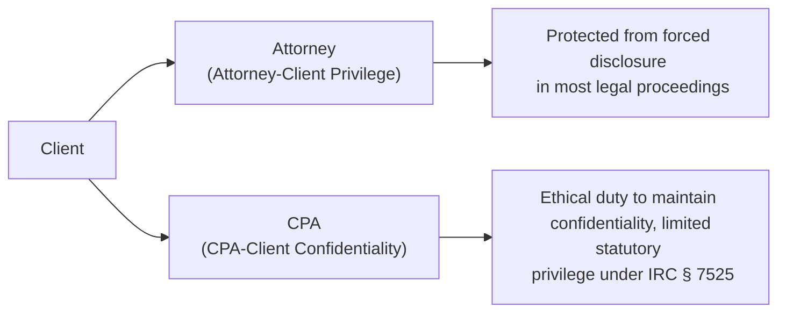

## 6.2 Privileged Communications, Confidentiality, and Privacy Acts

Professionals in tax and accounting practices must fully understand the obligations that arise when handling client information. While attorneys rely on attorney-client privilege, CPAs rely on a blend of ethical rules, state-specific accountant-client privilege (if applicable), and federal statutes such as Internal Revenue Code (IRC) Section 7525, which grants a limited privilege for tax advice in certain situations. This section explores the fundamental differences between attorney-client privilege and CPA-client confidentiality, examines how privileged communications apply within a tax practice context, and reviews the Privacy Act considerations that govern the handling of personal data. Throughout this discussion, we will also highlight best practices and potential pitfalls for ensuring data protection and respecting client confidentiality.

Use this chapter in conjunction with other chapters in Part II (Ethics, Professional Responsibilities, and Federal Tax Procedures) and cross-reference relevant discussions in Chapter 3 (Ethics and Responsibilities in Tax Practice) and Chapter 5 (Federal Tax Procedures) for expanded context.

-----

Understanding the nuances of privilege and confidentiality is critical for CPA candidates. Although the obligations can seem similar, the legal enforceability of attorney-client privilege versus the professional duty of confidentiality owed by accountants differs significantly. Failure to observe these distinctions can lead to ethical breaches, legal exposure, and potential disciplinary action by state boards of accountancy or other regulatory bodies.

## Privileged Communications in the Legal Context

Privileged communications are those that cannot generally be disclosed in a court or similar legal setting without the client’s consent. The most commonly recognized form of privilege is the attorney-client privilege, which seeks to foster candid communication between a client and an attorney so that legal advice can be rendered effectively.

• Attorney-Client Privilege: This privilege is well-established in common law and protects most confidential communications between a client and an attorney for the purpose of obtaining legal advice. Attorneys cannot disclose these communications without the client’s permission. Privilege applies to written and oral communications, legal memoranda, and other attorney work product as long as it is related to legal advice and the client intended the communication to remain confidential.

• Work Product Doctrine: A related protection to attorney-client privilege is the work product doctrine, which shields materials prepared by an attorney in anticipation of litigation from disclosure. While not identical to attorney-client privilege, the work product doctrine further emphasizes the strict legal protections that apply to attorneys’ documents and analyses.

## CPA-Client Confidentiality: Ethical vs. Statutory Obligations

Unlike attorneys, CPAs do not universally benefit from a “client privilege” recognized under federal common law. Instead, CPAs are bound by various confidentiality rules established by:

• AICPA Code of Professional Conduct: The AICPA requires members to maintain client confidentiality and to refrain from disclosing confidential client information without specific consent (with limited exceptions, such as when required by law). This ethical mandate is integral to fostering trust and maintaining professional integrity.

• State Laws: Some states have enacted accountant-client privilege statutes, but these privileges are typically narrower than attorney-client privilege and may not always protect the CPA or the client in federal proceedings. The scope and enforceability of these privileges differ significantly by jurisdiction.

• IRC § 7525 (Tax Practitioner Privilege): This provision extends, in certain circumstances, confidentiality for tax advice given by a federally authorized tax practitioner (including CPAs, enrolled agents, and attorneys). It is important to note that this “tax practitioner privilege” is narrower than attorney-client privilege and does not apply to criminal proceedings, matters before state tax courts, or disclosures relating to tax return preparation itself. Additionally, if a CPA is assisting in any form of criminal tax courtroom matter, the communications may not be fully protected by IRC § 7525.

## Key Differences: Attorney-Client Privilege vs. CPA-Client Confidentiality

To visualize these differences, see the following diagram, which compares client communications under attorney-client privilege with communications under CPA confidentiality standards:

### Legal Enforceability
• Attorney-client privilege: Legally enforceable in federal courts and most state jurisdictions. If a subpoena or court order demands disclosure, attorneys typically retain strong grounds to refuse based on privilege.  
• CPA-client confidentiality: CPA confidentiality is primarily an ethical duty, enforceable through professional standards. While certain jurisdictions provide statutory accountant-client privilege, it is not recognized in all states, nor is it guaranteed at the federal level (except in limited circumstances under IRC § 7525).

### Scope of Protection
• Attorney-client privilege: Typically covers discussions and documentation related to obtaining legal advice, litigation strategies, and other legal matters.  
• CPA-client confidentiality: Encompasses information shared for the purpose of accounting, tax preparation, or financial advice. However, the privilege is more limited and does not prevent disclosure if subpoenaed in some federal court contexts unless IRC § 7525 or state laws specifically apply.

### Exceptions
• Attorney-client privilege: May be waived if a client discloses protected information to third parties, or if the communication was intended for furthering a crime or fraud.  
• CPA-client confidentiality: Clients can waive confidentiality. CPAs must disclose information if legally compelled by a valid subpoena, if required by their professional obligations in an ethics review, or when mandated by federal or state laws.

## Statutory Extensions: IRC § 7525 and the Kovel Arrangement

### IRC § 7525
IRC § 7525 grants limited privilege to federally authorized tax practitioners (CPAs, enrolled agents, and attorneys) with respect to tax advice. Important caveats include:  
• The privilege does not apply to criminal matters.  
• The communication must be for the purpose of tax advice and not simply tax return preparation.  
• The privilege can be void if the communications are used to commit or plan a crime or fraud.

### Kovel Arrangement
A Kovel arrangement occurs when an accountant works under the direction of an attorney to assist with providing legal advice. In such arrangements, the accountant is essentially acting as a translator of complex accounting or tax issues for the attorney. Courts have recognized that, under these specific conditions, the accountant’s communications with the client may be covered by the attorney-client privilege extended through the attorney’s engagement, provided the arrangement is properly structured.

## Privacy Acts and Data Protection

In addition to ethical obligations and privilege extensions, CPAs must be aware of federal and state privacy laws that govern the handling of clients’ personal information. Two significant laws include:

### The Privacy Act of 1974
• Applies to the federal government’s collection and use of personal information, mandating agencies to maintain records accurately and securely.  
• Although not all private businesses are directly governed by the Privacy Act, CPAs who represent clients before federal agencies should be mindful of how agencies handle or request client data.  
• When dealing with records requested by federal agencies (including the IRS), accountants need to ensure that disclosures are lawful and that the Privacy Act’s restrictions are followed if applicable.

### Gramm-Leach-Bliley Act (GLBA)
• Requires financial institutions (including certain CPA firms that provide financial services) to document and disclose how they protect consumers’ confidential data.  
• CPAs may be considered “financial institutions” if they provide certain services such as wealth management, investment advice, or personal financial planning.  
• Requires safeguarding client information, implementing policies to secure data, and providing annual notices to clients regarding private information handling.

### Other Data Protection Laws
• State Data Protection Statutes: Many states have enacted data breach notification laws requiring businesses to promptly notify affected individuals if a breach occurs.  
• Foreign Laws (e.g., GDPR): While specifically European, the General Data Protection Regulation (GDPR) can affect CPAs with international clients, imposing enhanced data protection and breach reporting standards.

## Practical Examples and Case Illustrations

Consider the following scenarios to see how these legal concepts play out:

• A small business client shares sensitive financial data with both an attorney and a CPA. Under attorney-client privilege, the attorney may refuse to disclose the communications if subpoenaed in a civil matter. The CPA, however, may not be able to refuse disclosure unless the matter involves qualified tax advice protected by IRC § 7525 or by a relevant state privilege statute.

• A multinational corporation hires an accounting firm to handle complex tax planning. The firm’s staff are subject to both the AICPA Code of Professional Conduct and the Gramm-Leach-Bliley Act if they handle personally identifiable financial information. The firm also must comply with IRC § 7216 regulating the disclosure or use of tax return information. The client’s data must be safeguarded, and the firm may need to provide privacy policy disclosures. If a subpoena is issued for the corporation’s records, the CPA cannot depend on an attorney-client privilege but may have limited recourse under IRC § 7525 for specific tax advice documents.

• During a potential criminal tax investigation, an individual seeks advice from a CPA. The CPA quickly realizes that the matter exceeds the scope of routine tax compliance and requires legal representation. If the individual continues with only the CPA and expects communications to remain privileged, they risk forced disclosure. Had the CPA been hired under the direction of an attorney in a valid Kovel arrangement, some communications might be privileged through the attorney.

## Best Practices for CPAs

• Make Clients Aware of Limits: Remind clients that CPA-client confidentiality is not the same as attorney-client privilege. Clarify that certain communications may be disclosed if legally required.  
• Observe IRC § 7525 Requirements: Remain informed about the scope of tax practitioner privilege and ensure the communication is strictly within the realm of tax advice.  
• Consider a Kovel Arrangement: In high-stakes legal matters, collaborate with legal counsel to structure an engagement so that the accountant’s work falls under the protection of the attorney-client privilege, if legitimate and appropriate.  
• Implement Robust Data Security Controls: Comply with the Gramm-Leach-Bliley Act, the Privacy Act (where relevant), and state laws by encrypting emails, securing physical files, limiting employee access to sensitive data, and conducting periodic privacy trainings for staff.  
• Maintain Up-to-Date Privacy Policies: Disclose your firm’s practices for storing, processing, and protecting client data, especially if your firm falls under GLBA or other privacy regulations.  
• Know When to Disclose: Understand when a valid subpoena or court order requires compliance. Seek legal advice if uncertain about disclosing information.  
• Keep Clear Documentation: Retain a thorough record of client communications, engagement letters, and disclaimers regarding the limited nature of privilege.

## Additional Resources for Further Exploration

• AICPA Code of Professional Conduct.  
• Treasury Department Circular 230 for rules governing practice before the IRS.  
• Internal Revenue Code § 7525 for the limited “tax practitioner privilege.”  
• State statutes on accountant-client privilege.  
• The Privacy Act of 1974 and the Gramm-Leach-Bliley Act.

As a CPA, recognizing the boundaries of confidentiality and privilege is essential to preserving client trust and maintaining professional and legal integrity. CPAs should remain vigilant in keeping up-to-date with evolving legislation and ethical guidelines.

-----

## Test Your Knowledge: Privileged Communications, Confidentiality, and Privacy Acts



### How does attorney-client privilege generally compare to CPA-client confidentiality in terms of enforceability?

- [ ] CPA-client confidentiality is enforceable under all circumstances, whereas attorney-client privilege is merely ethical.  
- [x] Attorney-client privilege generally has stronger legal enforceability at both federal and state levels, while CPA-client confidentiality is mostly an ethical duty.  
- [ ] Both privileges are identical since a CPA is considered equal to an attorney for confidentiality purposes.  
- [ ] Attorney-client privilege is recognized only by state governments, not at the federal level.  

> **Explanation:** Attorney-client privilege is recognized in courts and has well-established legal protections, whereas CPA-client confidentiality is primarily an ethical standard, with limited statutory support under some state laws and IRC § 7525.

### Which of the following statements about IRC § 7525 is correct?

- [ ] It grants attorneys unlimited privilege in all criminal matters of tax fraud.  
- [ ] It applies only to state-level tax advice.  
- [x] It creates a limited privilege for federally authorized tax practitioners in connection with tax advice, not applicable to criminal proceedings.  
- [ ] It automatically covers all CPA communications, regardless of context.  

> **Explanation:** IRC § 7525 extends a limited privilege to CPAs, enrolled agents, and attorneys only for bona fide tax advice in non-criminal matters. It excludes criminal investigations and certain disclosures.

### What is one key difference between attorney-client privilege and the accountant’s duty of confidentiality?

- [x] Attorney-client privilege may prevent forced disclosure during litigation, while CPA confidentiality alone often does not.  
- [ ] CPA confidentiality is stronger and covers all client communications.  
- [ ] Attorney-client privilege and CPA confidentiality operate under the exact same rules and protections.  
- [ ] Neither privilege is recognized in federal courts.  

> **Explanation:** The critical difference is that attorney-client privilege is typically recognized in legal proceedings, where a client or attorney can refuse to disclose confidential communications. CPA confidentiality, unless strengthened by state or federal statute, is largely ethical and can be overridden by subpoena or court order.

### What does the term "Kovel arrangement" refer to?

- [x] An arrangement in which a CPA is hired by an attorney to assist in providing legal advice, thereby potentially extending attorney-client privilege to the CPA’s work.  
- [ ] A direct contract between a CPA and a client that grants absolute privilege for any financial discussion.  
- [ ] A stand-alone state statute that replaces attorney-client privilege.  
- [ ] A requirement that CPAs must follow to avoid malpractice lawsuits.  

> **Explanation:** Kovel arrangements allow CPAs to operate under the attorney’s umbrella of privilege if properly structured, functioning as a sort of translator of complex financial matters for legal counsel.

### Which federal law primarily governs the federal government’s handling of personal data?

- [ ] Gramm-Leach-Bliley Act (GLBA).  
- [ ] HIPAA.  
- [x] The Privacy Act of 1974.  
- [ ] Fair Credit Reporting Act (FCRA).  

> **Explanation:** The Privacy Act of 1974 applies to federal agencies, dictating how they collect, maintain, and use personal data. While CPAs are not always directly regulated by this act, it is relevant when dealing with federal agencies like the IRS.

### Which statement accurately describes the work product doctrine?

- [x] It protects materials created by attorneys in anticipation of litigation from disclosure.  
- [ ] It protects any written communication between a CPA and the client.  
- [ ] It applies only to final, signed legal documents.  
- [ ] It waives attorney-client privilege in non-litigation scenarios.  

> **Explanation:** The work product doctrine is distinct from attorney-client privilege and protects attorneys’ (or their representatives’) materials prepared in anticipation of litigation.

### Under the Gramm-Leach-Bliley Act (GLBA), CPAs who qualify as financial institutions must:

- [x] Provide privacy notices and implement measures to safeguard consumer data.  
- [x] Limit disclosure of private information unless required by law.  
- [ ] Divulge confidential data to any third party upon request.  
- [ ] None of the above.  

> **Explanation:** Under GLBA, CPAs offering certain financial services must institute written privacy policies, limit data sharing, and protect the confidentiality of client information.

### Which scenario best illustrates how a CPA-client communication might lose its privileged status?

- [x] A CPA inadvertently discloses client information to a third party who is not involved in the engagement.  
- [ ] A CPA uses an encrypted email to send the client’s tax return.  
- [ ] A client offers a CPA a bank statement for reference when preparing taxes.  
- [ ] A CPA redacts private information before file sharing with an attorney.  

> **Explanation:** Unintentional disclosure or sharing of private information with an unrelated third party can effectively waive any privilege or confidentiality protections.

### In a federal court tax fraud trial, what is the primary limitation of IRC § 7525 for a CPA?

- [x] The privilege does not apply to criminal tax proceedings.  
- [ ] The privilege is stronger than attorney-client privilege.  
- [ ] The privilege can shield any discussion between client and CPA.  
- [ ] There is no recognizable privilege or confidentiality for CPAs under federal law.  

> **Explanation:** IRC § 7525 specifically excludes criminal tax matters, meaning the CPA must generally comply with disclosure orders in criminal investigations.

### Are CPAs always legally prohibited from disclosing client information?

- [x] True  
- [ ] False  

> **Explanation:** Mostly true in principle but subject to exceptions. CPAs must disclose client information if there is a valid subpoena, if required by law, or if the client consents, among other limited exceptions.



-----

## For Additional Practice and Deeper Preparation

### [Taxation & Regulation (REG) CPA Mock Exams](https://www.udemy.com/course/reg-cpa-mock-exams/?referralCode=55419EBD198F61530B12)

Taxation & Regulation (REG) CPA Mocks: 6 Full (1,500 Qs), Harder Than Real! In-Depth & Clear. Crush With Confidence!

- Tackle full-length mock exams designed to mirror real REG questions.  
- Refine your exam-day strategies with detailed, step-by-step solutions for every scenario.  
- Explore in-depth rationales that reinforce higher-level concepts, giving you an edge on test day.  
- Boost confidence and minimize anxiety by mastering every corner of the REG blueprint.  
- Perfect for those seeking exceptionally hard mocks and real-world readiness.

_Disclaimer: This course is not endorsed by or affiliated with the AICPA, NASBA, or any official CPA Examination authority. All content is for educational and preparatory purposes only._
