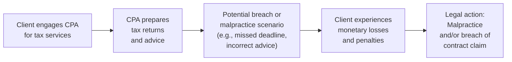

## 6.3 Malpractice and Breach of Contract in Tax Engagements

The relationships Certified Public Accountants (CPAs) build with their clients through engagement letters and trusted tax advisory services can give rise to significant liability if expectations and professional standards are not met. Malpractice claims and breach of contract disputes are two primary legal avenues through which CPAs may face potential litigation. Understanding the elements that constitute malpractice, the common contractual grounds for dispute, typical damage claims, and effective risk mitigation strategies is essential to safeguarding your professional practice.

This chapter dives into the critical legal concepts and real-world complexities behind malpractice and contract breach in tax engagements. By examining core principles, reviewing potential exposures, highlighting practical examples, and analyzing best-in-class strategies for prevention, you will be better equipped to maintain robust professional relationships, reduce your liability risk, and uphold the highest standards of care.

---
  
Malpractice in the context of tax engagements traditionally arises when a CPA fails to meet the applicable standards of professional duty, resulting in harm or damages to the client. Breach of contract claims emerge when a party does not fulfill its obligations under the engagement letter or any auxiliary agreements specifying the terms of service. Although the two concepts are distinct, they often interrelate. A contractual breach might form the foundation for a malpractice claim, and alleged malpractice can sometimes give rise to or intensify claims that there has been a breach of contract.  

Below, we examine the typical exposures CPAs face, how courts determine liability, the types of damages pursued by aggrieved clients, and the proactive measures that CPAs can implement to minimize these risks.

  
### Malpractice in Tax Engagements: An Overview

Professional malpractice in the CPA context refers to a failure to perform professional services with the skill, prudence, and diligence expected of a reasonable CPA under similar circumstances. In the realm of tax practice, allegations of malpractice often revolve around negligence in the preparation or review of tax returns, poor tax planning advice, missed deadlines, or failure to comply with ethical and legal standards mandated by the Internal Revenue Service (IRS) regulations, the AICPA Code of Professional Conduct, and Treasury Circular 230.

  
#### Elements of CPA Malpractice

To win a malpractice claim against a CPA, a plaintiff generally must prove:

• Duty of Care: The CPA owed a duty to the client to exercise the level of skill, care, and diligence that the profession ordinarily expects. This duty typically arises through the engagement letter or implied professional obligations.

• Breach of Duty: The CPA breached this duty by not acting in accordance with professional standards. This could involve errors in tax return preparation, overlooking critical law changes, or not discussing important risks and strategies with the client.

• Causation: The CPA’s breach directly caused harm to the client. In tax malpractice, harm can take the form of additional tax liability, penalties, and interest resulting from the CPA’s mistakes.

• Damages: The client experienced quantifiable losses due to the CPA’s errors or omissions. These losses must be a foreseeable result of the CPA’s negligent actions (or inactions).

  
#### Common Bases for Malpractice Claims

• Failure to Meet Tax Deadlines: Missing filing deadlines and causing the client to incur late-filing and late-payment penalties.  
• Inaccurate Return Preparation: Errors or omissions in deductions, credits, and reporting resulting in the client’s liability, penalty assessments, or reputational harm.  
• Poor Tax Research or Advice: Offering guidance based on outdated or incorrect interpretations of tax statutes, regulations, or rulings.  
• Conflict of Interest: Failing to maintain objectivity and integrity in situations where a conflict arises, such as preparing both parties’ returns in a business partnership dispute without proper disclosure.  
• Violations of Circular 230 or AICPA Standards: Not adhering to the professional and ethical standards for tax practitioners, which can strengthen a client’s malpractice assertion.

  
### Breach of Contract in Tax Engagements

A breach of contract, as applied to tax engagements, typically centers on the formal engagement letter that outlines the practitioner’s responsibilities and the client’s obligations. Breach of contract occurs when one party fails to comply with the terms specified in the contract. For example, if a CPA promises to complete a business tax return by a given date but does not do so (without a valid reason or extension mutually agreed upon), the CPA may be exposed to a breach of contract claim if the client suffers financial harm.

  
#### Importance of the Engagement Letter

The engagement letter is critical for shaping the scope of services, mutual duties, and remedies in the event of a dispute. A well-written engagement letter will:

• Clearly define the scope of work (exact tax services, tax forms to prepare, expected deadlines, etc.).  
• Outline client responsibilities (providing correct and timely information, reviewing draft returns for errors, etc.).  
• Specify fee arrangements and payment terms.  
• Include any limitations of liability or disclaimers permitted by state law and professional standards.  
• Describe conflict resolution procedures, such as mandatory arbitration or mediation clauses, if allowed in the relevant jurisdiction.  

  
### Typical Damage Claims

Both malpractice and breach of contract claims can lead to monetary demands for damages. These can include:

• Compensatory Damages: Direct financial losses sustained by the client (e.g., additional taxes, penalties, and interest not incurred had the CPA properly performed).  
• Consequential Damages: Losses that are reasonably foreseeable from the CPA’s actions or inactions, such as lost business opportunities due to adverse credit impact or increased tax rates in subsequent years.  
• Punitive Damages: Rare in professional liability cases, especially those primarily sounding in contract law, but could be considered in cases of extreme misconduct or fraud.  
• Restitution or Fee Disgorgement: Courts can mandate CPAs to return fees paid by the client if the CPA’s services are deemed completely inadequate or worthless.  

Depending on jurisdiction, statutes or precedents may limit the type and amount of recoverable damages. Engaging legal counsel with knowledge of professional liability and malpractice statutes is critical if a CPA faces a claim.

  
### Exposure of CPAs in Contract Disputes

Although malpractice claims often make headlines, breach of contract disputes are equally significant. Even a straightforward oversight—missing a deadline stipulated in the engagement letter—can bring about a contract dispute that escalates if financial harm is significant. CPAs may underestimate the seriousness of a breach of contract action assuming that malpractice claims pose the wider threat. However, well-drafted engagement letters and consistent communication can be instrumental in preventing or defending against these claims.

  

Above is a simplified illustration of how a CPA’s engagement with a client can evolve into a dispute that manifests as a malpractice claim, breach of contract claim, or both. Proactive risk management at each stage of the process may help avoid serious litigation exposure.

  
### Mitigating Risk in Malpractice and Breach of Contract Claims

Preventive strategies are more cost-effective and less stressful than dealing with a lawsuit. Crafting robust engagement letters, maintaining clear communication, staying current with professional standards, and following best practices can often avert potential claims.

  
#### 1. Clear Communication and Expectations

Well-defined expectations reduce confusion and misinterpretations that often lead to breach of contract disputes. Communicate the scope of the work, potential complexities, and timelines with clients. Obtain written confirmation that they understand these terms.

  
#### 2. Comprehensive Engagement Letters

The engagement letter remains the cornerstone of contract formation. It should be signed by both parties and updated for each new engagement or when significant changes in services occur. A thorough engagement letter will include:

• Identification of services rendered (e.g., corporate tax return preparation, personal return, consulting, etc.).  
• A detailed timeline and deadlines, including how changes in client data or tax law may affect the completion date.  
• Fees, billing schedules, and possible additional costs.  
• Limitations on services, disclaimers about responsibility for changes in tax law or late or incomplete client documentation.  
• Dispute resolution clauses, such as mandatory arbitration or mediation, if permitted in the CPA’s jurisdiction.  

  
#### 3. Diligent Quality Control and Review

Establish internal protocols to ensure work quality. This might include:

• Double-checking calculations, especially for complex deductions and credits.  
• Staying up to date on IRS pronouncements, new Tax Court rulings, and relevant legislative changes.  
• Maintaining a thorough review process for all client deliverables, particularly final tax returns.  
• Conducting regular peer reviews or enlisting third-party reviews to detect potential errors or omissions early.

  
#### 4. Ethical Compliance and Continuing Education

Following Treasury Circular 230 and AICPA’s Code of Professional Conduct not only reduces legal exposure but also upholds the public’s trust in CPAs. Continuous professional development, specifically in specialized areas of tax, will help mitigate the risk of malpractice stemming from an outdated understanding of tax regulations.

  
#### 5. Professional Liability Insurance

Professional liability insurance (also called Errors & Omissions, or E&O insurance) stands as a vital pillar of a CPA’s risk management strategy. This type of insurance covers defense costs and potential damage awards in malpractice or breach of contract disputes. Understanding the policy’s coverage limits, exclusions, deductibles, and any claims-made conditions is essential.

  
#### 6. Documentation and Record Retention

Retain detailed records of all communications, computations, research, and advisory input provided to the client. Proper documentation can significantly strengthen a CPA’s position if a client later alleges malpractice or breach of contract. Keep a record of any changes to the scope of services and get the client’s written acknowledgment of these changes.

  
#### 7. Prompt Error Identification and Resolution

Even the most diligent CPA may make mistakes. Detecting and correcting errors early, and disclosing such errors to clients promptly, can help mitigate harm—and possibly reduce the likelihood or severity of litigation. Clients tend to react more favorably if the CPA works quickly and transparently to address the issue.

  
### Practical Example

Assume a CPA firm prepared a complex corporate tax return for a client undergoing a major acquisition. The engagement letter specified that the returns would be finalized by the standard corporate deadline, contingent upon the client supplying all necessary documents by March 1. However, the client provided crucial data on March 29. The firm scrambled to file an extension but missed crucial details in the final extension calculation, incurring a late-payment penalty for which the client blamed the firm.

• Possible Breach of Contract Claim: The client could allege that the CPA firm failed to meet a filing deadline as stipulated, resulting in penalty costs. The CPA might respond that the client breached its own obligation to supply timely documents, relieving the firm of liability.  
• Potential Malpractice Claim: Further, if the client contends that the CPA did not act with reasonable care in computing the extension payment, resulting in underestimation and an IRS penalty, a negligence claim might arise.

  
### Case Study: Breach of Contract vs. Malpractice

In a well-cited scenario, a CPA prepared a real estate investor’s individual return, erroneously omitting significant rental income due to the investor’s ambiguous records. The client claimed the CPA should have identified discrepancies in the documentation. When the omission surfaced during an IRS audit, the client faced not only back taxes but also hefty penalties.  

• Breach of Contract Angle: The client asserted that the CPA failed to honor the engagement letter’s standard, which guaranteed accurate return preparation.  
• Malpractice Angle: The CPA allegedly did not meet the professional duty to exercise due diligence, resulting in foreseeable harm to the client.  

Ultimately, the court weighed evidence of how well the CPA communicated to the client that complete, accurate records were necessary. Because the CPA did not properly confirm or validate the information provided, the court determined the CPA bore partial responsibility for the erroneous filing. The result included damages to cover some of the penalties imposed on the client.

  
### Best Practices Summary

• Invest in well-drafted engagement letters.
• Maintain open lines of communication and thorough documentation.  
• Keep professional knowledge current through continuing education.  
• Follow strict internal quality control and peer review procedures.  
• Obtain adequate professional liability insurance.  
• Act quickly to correct errors and communicate to clients in a transparent manner.

By adhering to these guidelines, you not only diminish the likelihood of facing legal disputes but also reinforce your professional credibility and client trust. Proactive measures enable you to serve clients effectively while safeguarding your reputation, well-being, and practice success.

  
### Additional Resources and References

• AICPA Code of Professional Conduct: http://www.aicpa.org/Research/Standards/CodeofConduct  
• Treasury Department Circular 230 (governing practice before the IRS): https://www.irs.gov/tax-professionals/circular-230-tax-attorneys  
• AICPA Statements on Standards for Tax Services (SSTS): https://www.aicpa.org/interestareas/tax/resources/standardsethics/ssts  
• The U.S. Tax Court website: https://www.ustaxcourt.gov/  
• Various state CPA societies and bar associations offering courses on professional liability and ethics.  

---

## Mastering CPA Malpractice and Breach of Contract in Tax Engagements Quiz



### A CPA-client relationship gives rise to a “duty of care” primarily through:  
- [ ] Case law precedents in all circumstances.  
- [x] The engagement letter and professional standards.  
- [ ] Verbal agreements alone.  
- [ ] State boards of accountancy only.  

> **Explanation:** A CPA’s duty of care arises when the engagement letter or professional standards impose obligations to perform services with reasonable care. This contract-based relationship clearly defines expectations.

### Which of the following must be proven in a CPA malpractice claim?  
- [x] Duty, breach, causation, and damages.  
- [ ] Only defamation and emotional distress.  
- [ ] Liability insurance coverage is inadequate.  
- [ ] Good faith error in judgment.  

> **Explanation:** The essential elements of a CPA malpractice claim include proof of a duty owed, breach of that duty, a causal link between the breach and injury, and demonstrable damages.

### In breach of contract disputes involving tax engagements, which document is typically pivotal?  
- [x] A comprehensive engagement letter.  
- [ ] The CPA’s employment contract with a large firm.  
- [ ] A short text message from the client approving the fee.  
- [ ] The CPA exam license confirmation.  

> **Explanation:** The engagement letter specifies the terms of service and is central to assessing whether a CPA fulfilled contractual obligations.

### What type of damages are generally intended to compensate a client for reasonably foreseeable losses beyond direct costs?  
- [ ] Punitive damages.  
- [x] Consequential damages.  
- [ ] Auction damages.  
- [ ] Injunctive relief.  

> **Explanation:** Consequential damages seek to compensate for reasonably foreseeable losses or injuries resulting from the CPA’s breach or malpractice.

### Which is an effective method to mitigate the risk of malpractice claims when new tax legislation emerges?  
- [x] Proactive continuing professional education and timely client communication.  
- [ ] Avoid all complex tax returns until the legislation is fully interpreted by the courts.  
- [x] Conduct periodic peer reviews focusing on legislative changes.  
- [ ] Rely solely on prior year’s tax preparation procedures.  

> **Explanation:** Ongoing education, timely research, and peer reviews allow CPAs to remain current on legislative updates and better serve their clients, mitigating future malpractice claims.

### An engagement letter that states the CPA is not responsible for missed deadlines if the client provides late or incomplete data is:  
- [x] A form of limiting or clarifying contractual liability.  
- [ ] An automatic waiver of all malpractice liability.  
- [ ] Generally unenforceable in every jurisdiction.  
- [ ] Always considered unethical.  

> **Explanation:** While engagement letters cannot entirely eliminate malpractice liability, clarifying the scope and conditions of service can help define responsibilities and minimize misunderstandings.

### Which of the following is a key component in establishing a “breach of duty” in a professional negligence claim against a CPA?  
- [x] Failure to meet a standard of reasonable care under the circumstances.  
- [ ] Incurring an unfavorable outcome for the client.  
- [x] Misalignment with established professional guidelines.  
- [ ] Abiding by Circular 230.  

> **Explanation:** A breach of duty arises when a CPA does not meet the standard of care that a similarly trained professional would have displayed under comparable conditions, or fails to adhere to relevant guidelines.

### Why is it critical for CPAs to document all communications and decisions made with the client?  
- [x] It provides evidence of the CPA’s due care and helps defend against possible malpractice or breach of contract claims.  
- [ ] It replaces the need for an engagement letter.  
- [ ] It automatically negates any legal responsibility.  
- [ ] It is only required by large firms.  

> **Explanation:** Proper documentation allows a CPA to demonstrate adherence to professional standards and helps show the client’s involvement in the decision-making process, making it crucial evidence in disputes.

### In breach of contract cases, what is the client generally required to show to establish liability?  
- [x] The CPA did not fulfill a defined obligation stated in the contract, causing financial harm.  
- [ ] The CPA was extremely rude in communication with the client.  
- [ ] The CPA has never faced a claim before.  
- [ ] The CPA followed all standards but did not file a tax extension on time.  

> **Explanation:** The client must prove the CPA failed to perform the specified tasks as outlined in the engagement letter or contract, leading to a loss.

### Errors and Omissions (E&O) insurance for CPAs is typically designed to do which of the following?  
- [x] Cover defense costs and potential damage awards in malpractice litigation.  
- [ ] Prevent any lawsuits from being filed.  
- [ ] Restrict client’s ability to file claims.  
- [ ] Expand the CPA’s scope of services automatically.  

> **Explanation:** E&O insurance helps CPAs defend and satisfy judgments or settlements arising from professional negligence or contract issues, although it cannot eliminate the possibility of being sued.



---

## For Additional Practice and Deeper Preparation

### [Taxation & Regulation (REG) CPA Mock Exams](https://www.udemy.com/course/reg-cpa-mock-exams/?referralCode=55419EBD198F61530B12)

Taxation & Regulation (REG) CPA Mocks: 6 Full (1,500 Qs), Harder Than Real! In-Depth & Clear. Crush With Confidence!

• Tackle full-length mock exams designed to mirror real REG questions.  
• Refine your exam-day strategies with detailed, step-by-step solutions for every scenario.  
• Explore in-depth rationales that reinforce higher-level concepts, giving you an edge on test day.  
• Boost confidence and minimize anxiety by mastering every corner of the REG blueprint.  
• Perfect for those seeking exceptionally hard mocks and real-world readiness.

_Disclaimer: This course is not endorsed by or affiliated with the AICPA, NASBA, or any official CPA Examination authority. All content is for educational and preparatory purposes only._
