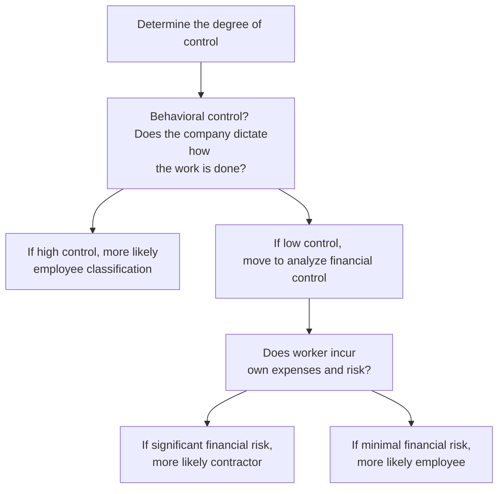

## 10.1 Employment Taxes and Worker Classification (Employee vs. Independent Contractor)

Accurate and compliant worker classification is fundamental to effective payroll tax management and legal compliance. Whether a worker is classified as an employee or an independent contractor has significant implications, both for the organization and the individual. These implications include, among others, the payment and withholding of employment taxes, compliance with labor laws, and liability for penalties in cases of misclassification.

This section provides an in-depth discussion of the criteria used to distinguish employees from independent contractors in a U.S. tax environment, as well as the overarching payroll tax obligations that flow from such classifications. We also explore real-life examples, best practices, and potential challenges that CPAs and business owners frequently encounter. Understanding these distinctions is crucial for compliance with federal and state regulations—and for success on the CPA Exam’s REG section and in professional practice.

-------------------------------------------------------------------------------
### Overview of Worker Classification

Worker classification refers to determining whether a worker is an employee or an independent contractor. This classification is not a matter of preference, but rather is governed by IRS guidelines and relevant court precedents. Different states may apply additional criteria or tests for worker classification (such as the “ABC test” in certain jurisdictions for labor law purposes), but federal tax guidelines primarily rely on common-law rules focusing on the degree of control and independence in the working relationship.

-------------------------------------------------------------------------------
### Why Classification Matters for Employment Taxes

Accurate classification is vital because employers have distinct tax and legal responsibilities for employees vs. independent contractors:

• For employees, the employer must withhold federal income tax, Social Security (FICA), and Medicare taxes, as well as pay the employer’s share of Social Security, Medicare, and Federal Unemployment (FUTA) taxes.  
• For independent contractors, the hiring business typically does not withhold or pay employment taxes on the individual’s behalf. Instead, the contractor is responsible for self-employment taxes (encompassing the worker’s Social Security and Medicare tax obligations) and estimated tax payments.

Misclassification—whether intentional or accidental—can result in the IRS seeking unpaid payroll taxes, penalties, and interest from the employer, which can be substantial.

-------------------------------------------------------------------------------
### IRS Criteria for Worker Classification

The IRS evaluates three broad categories of evidence to determine worker classification:

1. Behavioral control  
2. Financial control  
3. Type of relationship  

Each category further breaks down into specific indicators. An overall assessment is made, considering the totality of the relationship.

#### 1. Behavioral Control

Behavioral control looks at the degree of instruction, direction, and training that the employer provides:

• Instructions: When a company provides detailed instructions about when, where, and how work is done—dictating specific hours, place of work, tools used, or procedures followed—this arrangement typically indicates an employment relationship.  
• Training: Regular, ongoing training sessions provided by an employer can be a sign of an employment relationship as well.

An independent contractor typically has broader autonomy over how they perform a service, indicating no direct supervision or extensive guidance.

#### 2. Financial Control

Financial control relates to how the worker’s business and financial conduct is structured:

• Significant investment: Independent contractors often invest in their own equipment, tools, or facilities. On the other hand, employees usually rely on employer-provided tools and workspace.  
• Opportunity for profit or loss: Independent contractors can frequently realize a profit or suffer a loss based on their contract pricing and operating costs, which is generally not typical for employees.  
• Payment method: Employees often receive a consistent wage, salary, or hourly rate, usually paid on a schedule. Contractors may invoice by project or deliverable and have more variable compensation.

#### 3. Type of Relationship

The type of relationship explores contractual language and broader context:

• Written contracts: Although a written contract labeling someone as an “independent contractor” does not guarantee that the IRS will treat the person as such, contracts can still provide some evidence of the parties’ intent.  
• Benefits: Employees often receive benefits such as health insurance, paid vacations, and retirement plans. Independent contractors normally do not receive such benefits from the hiring entity.  
• Permanency: Ongoing or indefinite engagement with the same business typically suggests employment, whereas a more project-based or finite-term engagement weighs toward contractor status.

Using these factors and focusing on the substance (actual day-to-day practice) rather than form or contract label is critical for correct classification.

-------------------------------------------------------------------------------
### Employment Tax Responsibilities for Employers

Once a worker has been classified as an employee, the employer faces a set of payroll tax responsibilities:

• Withholding: The employer must withhold federal income tax based on each employee’s Form W-4 elections and the applicable tax tables.  
• FICA Taxes: Both employer and employee shares of Social Security and Medicare must be paid. The employer withholds the employee’s portion and contributes an equal amount.  
• Unemployment Taxes: Employers pay federal unemployment (FUTA) tax and, in most states, state unemployment taxes (SUTA). Rates and requirements vary by jurisdiction.  
• Forms and filings: Employers file:  
  – Form 941 (quarterly) or Form 944 (annual) for federal income tax and FICA withholding.  
  – Form 940 (annually) for FUTA.  
  – State-specific returns for unemployment insurance and sometimes for state income tax withholding.  

#### Example: Employer A’s Payroll Tax Routine

Consider an accounting firm, Employer A, that has 10 employees on staff. Each pay period, the firm calculates gross wages and withholds federal income tax, Social Security, and Medicare taxes from each employee’s paycheck. The firm then remits these withholdings, along with the employer’s matching share of Social Security and Medicare, to the IRS. Additionally, Employer A reports all these amounts every quarter via Form 941 and pays FUTA annually using Form 940. If the firm operates in a state that imposes unemployment insurance, it also files the corresponding state unemployment returns as required.

-------------------------------------------------------------------------------
### Tax Responsibilities for Independent Contractors

By contrast, service recipients (businesses hiring contractors) have limited payroll tax responsibilities:

• No withholding of federal income tax or FICA for the contractor.  
• No payment of federal unemployment tax on contractor’s behalf.  
• Must issue Form 1099-NEC (Nonemployee Compensation) if payments meet or exceed the annual threshold (currently $600).  

Independent contractors themselves handle:

• Self-Employment Taxes: The contractor is responsible for both the “employer” and “employee” portions of Social Security and Medicare taxes.  
• Estimated Tax: Contractors make quarterly estimated payments (Form 1040-ES) to account for federal income tax on their earnings.  
• Business Deductions: Contractors maintain their own records and generally file a Schedule C (Profit or Loss From Business) with their individual tax return, documenting business income and allowable expenses.

-------------------------------------------------------------------------------
### Common Law vs. Statutory Employees and Nonemployees

While the primary classification question is usually “employee vs. independent contractor,” the IRS also recognizes categories called statutory employees and statutory nonemployees.

1. **Statutory Employees**: Certain workers (e.g., full-time insurance salespeople, certain drivers) are considered employees for Social Security and Medicare tax purposes if specific conditions are met.  
2. **Statutory Nonemployees**: Certain workers (e.g., qualified real estate agents and direct sellers) are treated as self-employed for all federal tax purposes, subject to specific rules.

These distinctions can impact payroll tax withholding and reporting, so it is essential to understand the statutory definitions and to carefully review IRS guidance (Treasury Regulations and Revenue Rulings, among others) when making classification decisions.

-------------------------------------------------------------------------------
### Consequences of Misclassification

Misclassifying employees as independent contractors can draw significant penalties, interest, and back taxes for organizations:

• Unpaid Payroll Taxes: The IRS assesses the employer’s share of Social Security, Medicare, and unemployment taxes.  
• Income Tax Withholding: The organization may become liable for employees’ unwithheld federal income tax, plus associated penalties.  
• Additional State-Level Penalties: States often impose separate penalties and back tax obligations for misclassification affecting unemployment insurance and workers’ compensation.  
• Reclassification: IRS or State labor agencies may reclassify workers, thereby requiring the organization to implement compliance measures (e.g., payroll systems, benefits, unemployment insurance) retroactively and going forward.

Companies may also face reputational damage, damaging labor audits, or even class-action lawsuits if affected workers file claims. As a CPA, guiding clients through classification best practices helps avoid these costly outcomes.

-------------------------------------------------------------------------------
### Strategies for Mitigating Misclassification Risk

To minimize classification risks, businesses can adopt several best practices:

• Maintain Detailed Documentation: Keep thorough records of contracts, invoices, project deliverables, and worker communications. Such documentation is especially valuable if the employer’s classification is challenged.  
• Conduct Periodic Audits: Review worker classifications at least annually to ensure each worker’s duties, level of autonomy, and financial arrangement remain within the intended classification criteria.  
• Obtain IRS Clarification (Form SS-8): Employers or workers can request a determination from the IRS regarding classification, especially if there is uncertainty.  
• Avoid “Embedded” Contractors: If a contractor is effectively integrated into the business environment—attending staff meetings, following direct instructions, etc.—it raises the risk of classification as an employee.  
• Stay Current with Legal Changes: Keep track of new federal or state legislation or rulings that might influence classification tests, particularly in more complex gig economy or remote work scenarios.

-------------------------------------------------------------------------------
### Diagram: Decision Flow for Worker Classification

Below is a simplified flowchart that illustrates the classification process based on IRS criteria. This is not exhaustive, but it provides a snapshot of how CPAs and business owners might analyze employment relationships:

In practice, each category (behavioral vs. financial vs. relationship) has multiple sub-questions, so the entire analysis can become quite detailed. Nonetheless, this diagram underscores the underlying concepts of how heavily or lightly an organization influences a worker’s tasks—and how that affects classification.

-------------------------------------------------------------------------------
### Detailed Example: Start-Up Consulting Firm

Imagine a start-up consulting firm that hires two individuals:

1. Contractor X: Provides project-based consulting services for the firm’s clients. Contractor X:  
   • Sets hours independently and works remotely.  
   • Bills the firm a flat fee per project.  
   • Uses personal computer equipment and specialized analytics software.  
   • Takes on additional clients and bears the risk of business fluctuations.  

2. Employee Y: Fills an in-house administrative role. Employee Y:  
   • Reports weekly to the firm’s CEO for task assignments and project instructions.  
   • Works on-site using the firm’s hardware and software systems.  
   • Receives a salary plus standard benefits.  

Clearly, Contractor X meets the hallmark signs of an independent contractor: autonomy, personal equipment costs, and potential for profit or loss based on project volume. By contrast, Employee Y’s tasks, scheduling, and compensation align with an employee relationship under typical IRS criteria.

-------------------------------------------------------------------------------
### Employment Tax Compliance in Practice

The following table illustrates the differences in reporting and tax responsibilities for employees vs. independent contractors:

| Aspect                   | Employee                           | Independent Contractor                |
| ------------------------ | ---------------------------------- | ------------------------------------- |
| Tax Withholding          | Employer withholds federal income, Social Security, Medicare | No withholding; contractor handles own estimated taxes |
| Employer Payroll Taxes   | Employer pays employer’s share of Social Security, Medicare, FUTA | None; worker pays self-employment tax |
| Reporting Forms          | Form W-2 for wages                 | Form 1099-NEC for compensation ≥ $600 |
| Benefits                 | Commonly offered (health, retirement) | Rarely offered                        |
| Control                  | High level of behavioral/training control | Worker decides schedules/methods      |
| Business Tools           | Generally provided by employer      | Typically provided by the worker      |

Illustrating these differences ensures clarity for businesses, CPAs, and the workers themselves.

-------------------------------------------------------------------------------
### Special Payroll Tax Topics

1. **FICA Taxes**  
   Federal Insurance Contributions Act (FICA) taxes include both Social Security and Medicare. Employees pay half (withheld from wages), while employers pay the other half. In a contractor scenario, the full burden (12.4% for Social Security and 2.9% for Medicare, subject to thresholds) rests on the contractor as self-employment taxes.

2. **Additional Medicare Tax**  
   High earners may be subject to an additional 0.9% Medicare tax on wages or self-employment income exceeding certain thresholds ($200,000 for single filers or $250,000 for married filing jointly, under current law). For employees, the employer withholds this tax once the threshold is reached for that employee’s wages. Contractors likewise must account for it as part of their quarterly estimated tax payments.

3. **Federal Unemployment (FUTA)**  
   Employers exclusively pay FUTA tax on wages paid to employees. No FUTA tax is owed for independent contractors. Employers are also typically subject to state unemployment taxes, whereas independent contractors are generally not covered under the employer’s state unemployment system.

4. **State-Level Requirements**  
   Certain states impose additional obligations or rely on different worker classification tests (e.g., the ABC test in states like California for wage order determinations). Although the ABC test primarily affects labor law compliance, it can have indirect implications for tax obligations. In any cross-state or remote working arrangement, thorough review of both federal and state rules is essential.

-------------------------------------------------------------------------------
### Best Practices for Payroll Tax Compliance

To ensure robust compliance with IRS and state rules:

• **Maintain Written Agreements**: Include detailed service descriptions, payment terms, and clarifying language about the nature of the relationship. While not foolproof, a well-crafted contract reflects intention and reduces ambiguity.  
• **Classify Each Worker Prudently**: Always evaluate each worker’s situation individually, applying the IRS’s three areas of control. Do not assume that one classification fits all.  
• **Train Human Resources and Supervisors**: Supervisors should understand that if they treat an individual like an employee (dictating hours, tasks, etc.), that treatment can override any contract disclaimers labeling them a contractor.  
• **Monitor Ongoing Engagement**: A classification might have been correct at the outset but can change if the scope of work or relationship evolves. Reassess periodically.  
• **Implement Effective Recordkeeping**: Preserve documents related to deliverables, invoices, services performed, and relevant communications. Clear documentation is key if the IRS ever audits the company.  

-------------------------------------------------------------------------------
### Common Pitfalls and Challenges

Many businesses encounter gray areas or challenges:

• **Remote Work**: With many individuals working remotely, it may be tempting to treat them as contractors. However, if the company still exercises significant behavioral control, they may be employees for tax purposes.  
• **“Perma-Lancers”**: Long-term contractors who integrate closely with teams, use company resources daily, and attend employee events risk classification as employees.  
• **Multiple Clients**: Even if a worker has multiple clients, that alone does not guarantee contractor status if the main client exerts significant behavioral and financial control.  
• **Industry-Specific Nuances**: Certain industries (e.g., trucking, ride-share, professional services) have specialized or hybrid practices that can complicate classification.

-------------------------------------------------------------------------------
### Real-World Case Study: Misclassification Consequences

Consider a digital marketing firm that engages 50 individuals labeled as “independent contractors,” all working exclusively for the firm with consistent daily schedules and mandatory production meetings. The IRS conducts a payroll tax audit, finds that the individuals are employees in substance, and reclassifies them. The firm becomes liable for:

• The employer’s and employee’s share of unpaid Social Security and Medicare taxes for the audit period.  
• Penalties for failure to withhold income tax.  
• Unpaid FUTA and state unemployment taxes.  
• Substantial interest charges on the past-due amounts.  

In addition, the firm faces possible scrutiny under labor laws for overtime wages or benefits that might have been mandated for employees. The cost of fines and retroactive benefits can far exceed any perceived savings from misclassification.

-------------------------------------------------------------------------------
### Conclusion

Worker classification is more than an administrative formality; it shapes the tax landscape of an organization and its workforce. Ensuring a correct determination between employee and independent contractor status is integral to compliance with federal requirements for withholding, reporting, and remitting taxes. Missteps could result in significant financial and reputational harm.

As a CPA, embracing a proactive stance—educating clients, conducting periodic audits, utilizing statutory guidance, and maintaining crystal-clear documentation—helps mitigate misclassification risks. Studying these principles is likewise an essential element of preparing for the REG portion of the CPA Exam. By learning and applying these concepts, candidates and professionals alike can safeguard their organizations and clients from costly surprises.

-------------------------------------------------------------------------------
## Mastering Employment Tax and Worker Classification: A Comprehensive Quiz



### A worker exclusively uses the company's equipment, follows strict instructions, and cannot provide similar services to other companies. Which factor most strongly indicates employee status?

- [x] High degree of behavioral control
- [ ] Statutory nonemployee classification
- [ ] Self-employment tax obligations
- [ ] Minimal risk of financial loss

> **Explanation:** A high degree of behavioral control, indicated by instructions and strict supervision, is a key sign of an employer-employee relationship.

### Which of the following best describes an employer’s payroll tax obligation for an employee?

- [x] Withhold federal income tax, Social Security, and Medicare; pay matching FICA and FUTA
- [ ] Withhold only federal income tax and pay no matching tax
- [ ] Issue Form 1099-NEC for annual payments over $600
- [ ] No need to withhold federal income tax, pay FUTA, or file quarterly forms

> **Explanation:** Employers must withhold federal income tax and the employee’s share of Social Security and Medicare, match FICA, and pay federal unemployment tax (FUTA).

### What is one distinguishing factor of an independent contractor under the financial control criterion?

- [x] They can realize a profit or suffer a loss based on how they manage expenses
- [ ] They are paid a regular salary on a consistent schedule
- [ ] They receive standard benefits like health insurance
- [ ] They always work under a manager’s direct supervision

> **Explanation:** Independent contractors typically have the freedom to manage their own expenses, which can lead to profit or loss. Employees, on the other hand, typically have less financial risk and more predictable compensation.

### Which document is typically issued to an independent contractor to report nonemployee compensation?

- [x] Form 1099-NEC
- [ ] Form W-2
- [ ] Form SS-8
- [ ] Form 940

> **Explanation:** Businesses use Form 1099-NEC to report payments of $600 or more to independent contractors. Employees receive Form W-2 for wages and salaries.

### Which of the following statements correctly describes the relationship between behavioral control and worker classification?

- [x] Greater behavioral control by the hiring entity generally indicates an employee-employer relationship
- [ ] Greater behavioral control generally indicates a statutory nonemployee relationship
- [x] Contractors generally cannot set their own schedules in any sector
- [ ] Behavioral control is irrelevant if the worker signs a contract referring to themselves as an “independent contractor”

> **Explanation:** The more direction and control the company exercises over how, when, and where work is performed, the more likely the worker is an employee. Contracts alone do not override the reality of the working arrangement.

### If a worker provides services to multiple clients and is free to choose work hours and methods used, which classification is more likely?

- [x] Independent contractor
- [ ] Employee
- [ ] Statutory employee
- [ ] Guaranteed employee

> **Explanation:** Being able to choose hours independently and provide services to multiple clients typically points toward an independent contractor relationship.

### Which step can an employer take if uncertain about how to classify a worker?

- [x] File Form SS-8 with the IRS for a determination
- [ ] Simply label all workers as employees to avoid risk
- [x] Immediately treat the worker as a franchise partner
- [ ] Conclude that the worker must be an independent contractor if paid a flat fee

> **Explanation:** Form SS-8 (Determination of Worker Status) is filed with the IRS to request an official classification determination when the status is unclear.

### A business that erroneously misclassifies employees as contractors may be liable for:

- [x] Back taxes, penalties, and interest
- [ ] Only a small processing fee
- [ ] State taxes but not federal
- [ ] A replacement worker’s salary

> **Explanation:** Misclassification can result in back taxes, interest, and penalties for unpaid withholdings, FICA, and FUTA obligations—potentially quite costly for the employer.

### Which of the following is most likely to be a true statement about statutory employees?

- [x] They are treated as employees for FICA purposes if specific conditions are met
- [ ] They are always treated as independent contractors for all tax purposes
- [ ] They never receive a Form W-2
- [ ] They are exempt from withholding for Social Security and Medicare

> **Explanation:** Certain classes of workers meet statutory requirements making them employees for Social Security and Medicare, even if other factors might suggest contractor status.

### Under standard IRS guidelines, the more control an employer has over the details and day-to-day operations of the worker, the more likely that worker is classified as an employee.

- [x] True
- [ ] False

> **Explanation:** True. According to the common-law test, a high degree of behavioral control, financial control, and a traditional employer-employee relationship generally indicates employee status.



-------------------------------------------------------------------------------
## For Additional Practice and Deeper Preparation

### [Taxation & Regulation (REG) CPA Mock Exams](https://www.udemy.com/course/reg-cpa-mock-exams/?referralCode=55419EBD198F61530B12)

Taxation & Regulation (REG) CPA Mocks: 6 Full (1,500 Qs), Harder Than Real! In-Depth & Clear. Crush With Confidence!

• Tackle full-length mock exams designed to mirror real REG questions.  
• Refine your exam-day strategies with detailed, step-by-step solutions for every scenario.  
• Explore in-depth rationales that reinforce higher-level concepts, giving you an edge on test day.  
• Boost confidence and minimize anxiety by mastering every corner of the REG blueprint.  
• Perfect for those seeking exceptionally hard mocks and real-world readiness.  

_Disclaimer: This course is not endorsed by or affiliated with the AICPA, NASBA, or any official CPA Examination authority. All content is for educational and preparatory purposes only._
