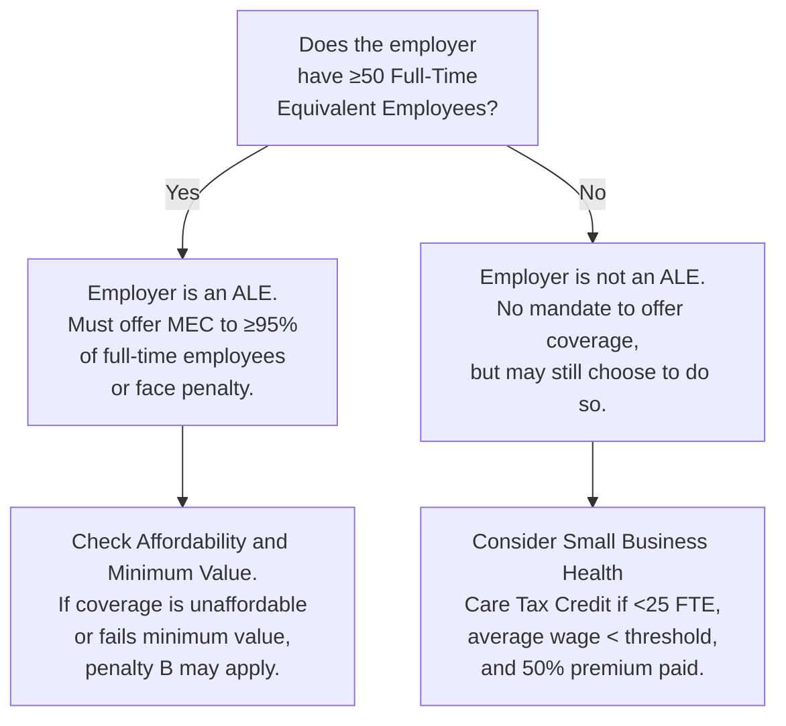
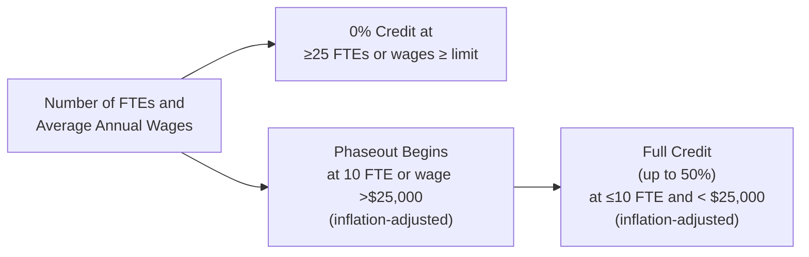

## 10.2 Qualified Health Plans, Mandates, and Credits under the Affordable Care Act

The Affordable Care Act (ACA), formally known as the Patient Protection and Affordable Care Act (PPACA), was signed into law in 2010 with the aim of improving access to quality health insurance in the United States. Since its enactment, ACA provisions have impacted employers, employees, and individuals in numerous ways—particularly in the realm of federal tax implications and employer-sponsored benefit administration. 

This section will delve into the foundational concepts of “qualified health plans” as defined by the ACA, employer mandates concerning the offering of coverage, and available tax credits (notably for smaller businesses). It is essential material for CPA candidates, tax professionals, and business owners who must navigate the evolving interface between health insurance, employment policy, and federal tax obligations.

-------------------------------------------------------------------------------
### Overview of the ACA and Its Tax Components

The ACA is, at its heart, a comprehensive health reform law that introduced broad changes to health coverage and the health insurance industry. This broad legislation includes several tax-related provisions administered primarily by the Internal Revenue Service (IRS). Among these are:

• Individual mandate (though the federal penalty was reduced to $0 after 2018, certain states maintain penalties).  
• Employer shared responsibility provisions (“employer mandates”) for large employers.  
• Employer reporting requirements (Forms 1094-C and 1095-C).  
• Premium tax credits (PTCs) for eligible individuals who purchase coverage through the Health Insurance Marketplace.  
• The Small Business Health Care Tax Credit for qualified small employers.  

These provisions—and their interplay—impact how companies structure their employee benefits, with associated tax credits and penalties driving compliance concerns and strategic decisions.

-------------------------------------------------------------------------------
### What Constitutes a Qualified Health Plan (QHP)

Under the ACA, a “qualified health plan” refers to a health insurance policy that:
1. Meets certification standards established by the Health Insurance Marketplace;  
2. Offers essential health benefits (EHBs), which include certain coverage categories such as hospitalization, prescription drugs, maternity care, and more;  
3. Limits cost-sharing (deductibles, copayments, and out-of-pocket maximums) to prescribed levels;  
4. Is offered by licensed insurers in good standing.

QHPs feature different metal tiers—Bronze, Silver, Gold, and Platinum—each designating a particular actuarial value (the percentage of total average costs of benefits that a plan will cover). Understanding QHPs is crucial for determining whether a plan meets the minimum essential coverage requirement for employers under the ACA’s shared responsibility provisions.

-------------------------------------------------------------------------------
### Employer Mandates: An Introduction

One of the ACA’s primary mechanisms for ensuring widespread coverage is its employer mandate (sometimes called the Employer Shared Responsibility Provision, ESRP). The rationale behind the employer mandate is that large employers who meet a specified size threshold should offer minimal essential coverage to their full-time employees (and their dependents) rather than leaving workers to seek public insurance or other subsidized coverage.

At a glance, the employer mandate requires:

• “Applicable Large Employers” (ALEs) with 50 or more full-time equivalent employees (FTEs) to offer affordable coverage that provides a minimum level of benefits OR potentially face an assessable payment.  
• Coverage must be offered to at least 95% of full-time employees (and their dependents) to avoid penalty exposure under certain conditions.

Although small employers (fewer than 50 FTEs) are not subject to the employer mandate, small businesses may reap specific benefits from the ACA in the form of specialized tax credits if they decide to offer coverage.

-------------------------------------------------------------------------------
### Defining Applicable Large Employers (ALEs)

#### Measuring Full-Time Equivalent Employees
An employer typically counts as an ALE if, during the preceding calendar year, it employed a monthly average of at least 50 full-time employees (or equivalent). A “full-time employee” is an individual employed an average of at least 30 hours of service per week, or 130 hours in a month. Part-time employees’ hours are summed up and converted into full-time equivalent (FTE) numbers.

For example, consider a company with 40 full-time employees working 30+ hours per week plus 20 part-time employees working on average 15 hours per week. The part-time hours total 20 × 15 = 300 hours. Dividing 300 by 120 (the monthly conversion factor of 120 hours) yields 2.5 FTE. Thus, the organization effectively has the FTE count of 42.5 employees—which is still below the 50 threshold and thus would not qualify as an ALE in that scenario.

#### Consequences of ALE Status
If an employer is determined to be an ALE for a particular calendar year, that employer must comply with the ACA’s employer shared responsibility mandates and the associated reporting requirements. The primary implications are:

• Offering coverage that meets the “minimum essential coverage (MEC)” standards.  
• Ensuring the offered plan also meets “minimum value” (covers at least 60% of the total allowed cost of benefits) and is “affordable” (based on objective determinations using the employee’s household income or other safe harbors).  
• Filing information returns with the IRS and furnishing statements to employees (Forms 1094-C and 1095-C).

Failure to fulfill these responsibilities can lead to penalty assessments, which are generally disclosed in an IRS Letter 226J.

-------------------------------------------------------------------------------
### Employer Shared Responsibility and Applicable Penalties

#### (a) Penalty A: Failure to Offer Coverage
If an ALE fails to offer minimum essential coverage to at least 95% of its full-time employees (and their dependents), and at least one full-time employee obtains a premium tax credit through the Marketplace, a penalty applies. This penalty is sometimes called the Section 4980H(a) penalty.

The penalty is assessed monthly but calculated annually based on the total number of full-time employees (minus up to 30 workers). The amount is subject to annual adjustments.

#### (b) Penalty B: Failure to Offer Affordable Coverage
Even if an ALE provides minimum essential coverage to at least 95% of full-time workers, they can still face a penalty if the coverage is unaffordable or does not provide minimum value. If at least one employee receives a premium tax credit for coverage purchased on the Marketplace, the employer is subject to the Section 4980H(b) penalty. This penalty is also assessed on a monthly basis and subject to annual adjustments.

-------------------------------------------------------------------------------
### Small Employers and the ACA

In contrast to the mandates for ALEs, small businesses that have fewer than 50 FTEs are not subject to a requirement to provide health coverage. Despite the absence of an ACA-imposed penalty for opting out, many small businesses opt to offer coverage for various reasons, including improved recruitment or employee morale. 

Recognizing that small businesses may have budgetary constraints, the ACA introduced the Small Business Health Care Tax Credit to encourage coverage. This credit lowers the effective cost burden of providing employee health insurance, especially when such coverage is purchased through the Small Business Health Options Program (SHOP) Marketplace.

-------------------------------------------------------------------------------
### Small Business Health Care Tax Credit

#### Eligibility Criteria
To be eligible for the Small Business Health Care Tax Credit, a small employer must generally:

1. Employ fewer than 25 full-time equivalent workers.  
2. Pay average annual wages of less than a statutory threshold (e.g., $50,000 per FTE, adjusted for inflation; check current IRS guidelines for the precise limit).  
3. Pay at least 50% of the total premium cost for employees’ coverage.  
4. Purchase coverage through the SHOP Marketplace or otherwise meet ACA requirements (subject to limited exceptions).

#### Size of the Credit
When originally introduced, the credit was up to 35% of the employer’s premium expenses (25% for tax-exempt employers) for tax years beginning before 2014. Starting with tax years beginning in 2014, the maximum credit increased to 50% of premium expenses (35% for eligible tax-exempt employers), although it is subject to a phaseout on a sliding scale. 

• The maximum credit applies to employers with 10 or fewer FTEs and average annual wages of $25,000 or less (as adjusted for inflation).  
• Once an employer’s FTE count approaches 25 or average annual wages approach the inflation-adjusted threshold (e.g., $50,000), the credit phases out completely.

#### Duration of Credit
Eligible employers can generally claim the credit for two consecutive taxable years. The credit is claimed on the employer’s annual income tax return (or Form 990-T for certain tax-exempt employers). Unused credits may be subject to carryback or carryforward rules.

-------------------------------------------------------------------------------
### Understanding Affordability and Minimum Value

An employer’s coverage is considered “affordable” if the employee’s required premium contribution for self-only coverage does not exceed a specified percentage (indexed annually) of household income. Because employers often do not know an employee’s exact household income, the IRS provides safe harbor methods based on the employee’s W-2 income, rate of pay, or the federal poverty line. 

“Minimum value” means the plan covers at least 60% of the total allowed cost of benefits expected under the plan. Plans can be tested for minimum value through a government-provided calculator or by meeting certain thresholds. If coverage fails either affordability or minimum value, employees may become eligible for premium tax credits for coverage they purchase on the Marketplace.

-------------------------------------------------------------------------------
### Employer Reporting Obligations

Under the ACA, record-keeping requirements are a vital aspect of compliance. ALEs must file annual forms illuminating whether they offered coverage, to whom, and the coverage’s cost:

• **Form 1094-C (Transmittal of Employer-Provided Health Insurance Offer and Coverage Information Returns):** Summarizes coverage data.  
• **Form 1095-C (Employer-Provided Health Insurance Offer and Coverage):** Provides detailed information about each full-time employee, the coverage offered, employee share of premiums, and months of coverage.

Employers with fewer than 50 FTEs do not generally have to file these forms unless they are self-insured or meet other narrow exceptions. Mistakes, tardiness, or failure to file can trigger additional IRS penalties.

-------------------------------------------------------------------------------
### Practical Examples and Scenarios

1. **Large Manufacturer with 200 Full-Time Employees**  
   - The manufacturer is an ALE. It must provide minimum essential coverage that meets minimum value and is affordable to at least 95% of these employees (and their dependents). If coverage meets these standards but one employee obtains a premium tax credit from the Marketplace, the employer might still face a (b) penalty if that coverage is deemed unaffordable or fails the “minimum value” test.

2. **Mid-Sized Retailer with 60 Full-Time Employees**  
   - The retailer is subject to 4980H “employer shared responsibility.” To avoid the A penalty, the retailer must cover at least 57 employees (95% of 60). If coverage is offered but found unaffordable, the B penalty could be triggered if any employee qualifies for a premium tax credit.

3. **Small Consulting Firm with 15 Employees**  
   - The firm is not required to offer coverage by the ACA, but it may still choose to do so. Suppose the firm pays 50% of the premiums for each eligible employee and purchases plans through the SHOP Marketplace; if the average wage is below $50,000 and the firm has fewer than 25 FTEs, it may qualify for the Small Business Health Care Tax Credit, which could offset up to 50% of its premium payments for two consecutive years.

4. **Business Below the 50 FTE Threshold**  
   - A local restaurant employs 15 full-time and 25 part-time employees, with the part-timers averaging 10 hours per week. Only 12 FTEs might result, so they are under the 50 threshold. They have no employer mandate responsibilities; however, if they offer coverage meeting certain requirements, they could still be eligible for the Small Business Health Care Tax Credit.

-------------------------------------------------------------------------------
### Diagram: Employer Mandate Decision Process

Below is a simplified flowchart illustrating how an employer might navigate the determination of whether it is an ALE and whether it must offer ACA-compliant coverage:

In this diagram:  
• The first question is whether the business has at least 50 FTEs; if yes, it is generally an ALE.  
• ALE status triggers compliance requirements and potential penalties.  
• Small employers not meeting the ALE threshold look next to see if they qualify for the small business credit.

-------------------------------------------------------------------------------
### Tax Credits for Individuals and Their Impact on Employers

While the premium tax credit (PTC) primarily applies to individuals purchasing insurance through the Health Insurance Marketplace, these credits can indirectly affect employers. If an employee is offered employer-sponsored coverage that is unaffordable or fails to meet minimum value, the employee may qualify for a PTC—and that event can trigger penalty B for the employer.

Tracking these employee-level premium credits is critical. Employers have a vested interest in carefully designing their plan’s contribution structure to avoid inadvertently providing “unaffordable” coverage that leads employees to the Marketplace for subsidized plans.

-------------------------------------------------------------------------------
### Common Pitfalls and Challenges

1. **Miscounting Full-Time Equivalents**  
   Employers who incorrectly calculate FTEs may misjudge their ALE status. Using incomplete payroll data or misunderstanding part-time hours often leads to consequences, including late realization of ESRP obligations and filing penalties.

2. **Not Considering Dependents**  
   The requirement to offer coverage extends to dependents (children under age 26). Failing to offer coverage properly to dependents can trigger an A penalty if less than 95% of full-time employees and their dependents are covered.

3. **Affordability Safe Harbors**  
   Employers unfamiliar with W-2, rate-of-pay, or federal poverty line safe harbors may inadvertently set employee contributions too high, leading to penalty B exposures.

4. **Neglecting Annual Adjustments and Inflation**  
   The ALE threshold remains at 50 employees, but wage thresholds for small business tax credit eligibility adjust periodically. Failing to keep up with these changes can mean lost tax credit opportunities or inaccurate compliance planning.

5. **Improper Form 1094-C and 1095-C Filings**  
   Missing or inaccurate data on these information returns can trigger notice letters from the IRS. This is both an administrative burden and a financial risk due to potential penalties.

-------------------------------------------------------------------------------
### Best Practices for Employers

• **Track Employee Hours Carefully:** Implement systems to monitor part-time and seasonal employee hours. This ensures an accurate measure of FTE status over time.  
• **Conduct Periodic Reviews of Workforce Composition:** Frequently revisit staffing levels to ensure you know whether you are at, below, or above the 50-FTE threshold—especially for growing or fluctuating businesses.  
• **Leverage Safe Harbors for Affordability:** Use one of the IRS-provided safe harbors to set premium contribution levels so that coverage remains “affordable” and helps avoid penalty B triggers.  
• **Use Timely Reporting and Filing:** Familiarize yourself with the formatting instructions and due dates for Forms 1094-C and 1095-C. Seek professional help with software solutions that can automate the reporting process.  
• **Optimize the Small Business Health Care Tax Credit:** If under 25 FTEs, plan your premium contributions strategically to maximize your eligibility.  
• **Stay Current on Legislative Changes:** Keep up with the most recent inflation adjustments, statutory thresholds, and potential legislative developments affecting the ACA.  
• **Engage in Year-End Tax Planning:** Projections of workforce size, wages, and coverage spending can be integrated into broader tax and financial planning to optimize outcomes.

-------------------------------------------------------------------------------
### Case Study: A Small Employer Taking Advantage of the Tax Credit

Imagine a small architectural firm with 12 employees and average annual wages of $30,000 per employee. They pay 60% of all employees’ monthly premiums, meeting and exceeding the 50%-minimum threshold. To qualify for the full credit, they purchase health coverage through the Small Business Health Options Program (SHOP). Because they are well below 25 employees and below the wage threshold, they fit the criteria to receive a substantial portion of their contribution cost offset by the credit. The purchase is beneficial not only from a tax standpoint but also for employee retention and morale.

-------------------------------------------------------------------------------
### Additional Diagram: Small Business Health Care Tax Credit Phaseout

Explanation:  
• When the employer’s FTE count is 10 or lower and average wages are below the inflation-adjusted threshold, the small business can receive the maximum credit.  
• As FTE count approaches 25 or average wages near the upper limit, the credit is proportionately phased out.  
• At or above 25 FTEs (or wages exceeding the threshold), the credit is completely phased out.

-------------------------------------------------------------------------------
### References and Resources for Further Exploration

• **IRS Publication 15 and Publication 15-B:** For employer tax responsibilities.  
• **IRS Website on the Affordable Care Act Tax Provisions:** (https://www.irs.gov/Affordable-Care-Act)  
• **Healthcare.gov:** For up-to-date information on coverage options, SHOP Marketplace details, and ACA updates.  
• **Form 1094-C and 1095-C Instructions:** (https://www.irs.gov/)  
• **Treasury Regulations, Preamble, and Notices:** For official IRS guidance on ESRP calculations.  

Staying current with official guidance is crucial, as the ACA remains subject to ongoing legislation and regulatory interpretations.

-------------------------------------------------------------------------------
### Conclusion

Navigating ACA requirements and related tax provisions demands meticulous attention to detail by both large and small employers. Large employers must focus on the intricacies of offering minimum essential coverage that is both affordable and meets minimum value to avoid penalty exposure. Small businesses have an opportunity to leverage the Small Business Health Care Tax Credit, easing the financial burden of offering coverage to employees—even though they are not mandated to do so. 

The landscape is continually evolving due to regulatory updates, inflation adjustments for wage thresholds, and periodic legislative action. CPAs, tax practitioners, and businesses alike should maintain current knowledge of employer mandates, reporting obligations, and avenues for tax savings to ensure they remain compliant and financially optimized under the ACA.

-------------------------------------------------------------------------------

## Mastering Employer Mandates and Health Coverage Tax Credits: Test Your Knowledge



### Which of the following is considered an Applicable Large Employer (ALE) under the ACA?

- [ ] An employer with 25 full-time employees and 25 part-time employees who each work 10 hours a week  
- [ ] An employer with 45 part-time employees who each work 29 hours a week  
- [x] An employer that averages at least 50 full-time equivalent employees over the course of the prior year  
- [ ] An employer with 55 employees, but only 10 of them meet the definition of full-time  

> **Explanation:** ALE status is based on having at least 50 full-time equivalent employees (including part-time hours converted to FTE) averaged over the previous calendar year.

### Which of the following best describes the Small Business Health Care Tax Credit?

- [ ] A refundable credit available to all businesses with fewer than 50 employees  
- [ ] A credit for individuals to purchase health coverage through the Marketplace  
- [ ] A penalty reduction for large employers failing to offer coverage  
- [x] A credit for small employers meeting certain size and wage criteria, generally offering coverage through the SHOP Marketplace  

> **Explanation:** The Small Business Health Care Tax Credit is designed to incentivize small employers (fewer than 25 FTEs, average wages below a threshold) that purchase coverage through the SHOP Marketplace and pay at least 50% of the premium cost.

### Which of the following triggers the Employer Shared Responsibility Penalty B under Section 4980H(b)?

- [x] Offering coverage that is not affordable or that does not provide minimum value, where at least one full-time employee obtains a premium tax credit in the Marketplace  
- [ ] Failing to file the correct paperwork by April 15  
- [ ] Terminating coverage before the end of the plan year  
- [ ] Not offering coverage to retirees  

> **Explanation:** Penalty B applies if the employer’s coverage fails affordability or minimum value tests and at least one full-time employee goes to the Marketplace and receives a premium tax credit.

### An employer must generally offer minimum essential coverage to what percentage of its full-time employees (and their dependents) to avoid Penalty A?

- [ ] 50%  
- [ ] 75%  
- [x] 95%  
- [ ] 100%  

> **Explanation:** ACA mandates that ALEs offer coverage to at least 95% of full-time employees and dependents. Falling below this threshold may trigger a 4980H(a) Penalty A if at least one employee receives a tax credit.

### Which of the following statements is TRUE regarding the Small Business Health Care Tax Credit?

- [x] It is available for a maximum of two consecutive taxable years.  
- [ ] It can only be claimed once by an employer in its entire corporate lifespan.  
- [x] It requires payment of at least 50% of employee health insurance premiums.  
- [ ] It is only available to nonprofit employers.  

> **Explanation:** The credit typically can be claimed for two consecutive years, requires employers to pay at least 50% of employee premiums, and is available to both taxable and certain tax-exempt small employers meeting eligibility criteria.

### Which of the following statements is correct about Form 1095-C?

- [ ] It is filed with the Department of Labor and not the IRS.  
- [x] It provides information regarding health coverage offered to each full-time employee.  
- [ ] It is used by individuals to claim the premium tax credit.  
- [ ] It replaces Form 1099 for reporting consultant income.  

> **Explanation:** Form 1095-C is filed with the IRS (along with the transmittal form 1094-C) and given to employees, detailing the offer of coverage, cost to the employee, and which months coverage was provided.

### Which of the following accurately describes the federal penalty for an individual failing to maintain insurance coverage after 2018?

- [x] The federal penalty has been reduced to $0, though some states have their own individual mandates.  
- [ ] It remains a percentage of income with no dollar maximum.  
- [ ] It applies only to individuals employed full-time.  
- [ ] It is enforced by withholding a portion of Social Security benefits.  

> **Explanation:** Although the ACA originally imposed an individual shared responsibility payment, effective January 1, 2019, the federal penalty was reduced to $0. Some states, however, have enacted their own mandates.

### Which method is NOT one of the IRS’s affordability safe harbors for employer-sponsored coverage?

- [ ] W-2 safe harbor  
- [x] Corporate tax liability safe harbor  
- [ ] Rate-of-pay safe harbor  
- [ ] Federal poverty line safe harbor  

> **Explanation:** The corporate tax liability safe harbor is not recognized by the IRS. The three main affordability safe harbors are the federal poverty level, the W-2 method, and the rate-of-pay method.

### What is the main reason an employee who qualifies for employer-sponsored coverage may still receive a premium tax credit through the Marketplace?

- [x] Their employer-sponsored coverage is either unaffordable or does not meet minimum value.  
- [ ] They are automatically eligible for both coverage types.  
- [ ] Their household income is extremely high.  
- [ ] They are allowed a waiver of employer coverage for any reason.  

> **Explanation:** An employee offered employer-sponsored coverage may only obtain marketplace subsidies if the employer-sponsored plan fails to meet affordability or minimum value criteria.

### The ACA’s definition of “full-time employee” is generally:

- [x] An individual working at least 30 hours per week or 130 hours per month.  
- [ ] Anyone who works more than 32 hours a week.  
- [ ] An employee with a salaried position.  
- [ ] An individual employed for at least six months out of the year.  

> **Explanation:** Under ACA guidelines, full-time employees are those who average at least 30 hours of service a week or 130 hours in a calendar month.



-------------------------------------------------------------------------------

## For Additional Practice and Deeper Preparation

### [Taxation & Regulation (REG) CPA Mock Exams](https://www.udemy.com/course/reg-cpa-mock-exams/?referralCode=55419EBD198F61530B12)

Taxation & Regulation (REG) CPA Mocks: 6 Full (1,500 Qs), Harder Than Real! In-Depth & Clear. Crush With Confidence!

- Tackle full-length mock exams designed to mirror real REG questions.  
- Refine your exam-day strategies with detailed, step-by-step solutions for every scenario.  
- Explore in-depth rationales that reinforce higher-level concepts, giving you an edge on test day.  
- Boost confidence and minimize anxiety by mastering every corner of the REG blueprint.  
- Perfect for those seeking exceptionally hard mocks and real-world readiness.  

_Disclaimer: This course is not endorsed by or affiliated with the AICPA, NASBA, or any official CPA Examination authority. All content is for educational and preparatory purposes only._
