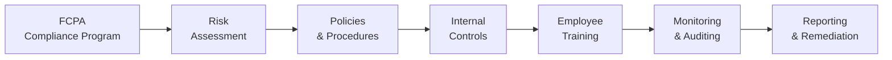

## 10.3 The Foreign Corrupt Practices Act and Anti-Bribery Regulations

The Foreign Corrupt Practices Act (FCPA) is a foundational piece of U.S. legislation that serves to combat corruption on a global scale. Enforced jointly by the U.S. Department of Justice (DOJ) and the Securities and Exchange Commission (SEC), the FCPA seeks to prevent individuals and organizations from engaging in bribery of foreign government officials for the purpose of securing or retaining business. Beyond its anti-bribery provisions, the FCPA also mandates robust recordkeeping and internal control requirements that directly impact accounting practices for businesses operating worldwide. This section explores the history, core provisions, enforcement mechanisms, and practical steps for complying with the FCPA, along with real-world examples and illustrative diagrams.

--------------------------------------------------------------------

### Historical Context and Purpose of the FCPA

The FCPA was enacted in 1977 amidst widespread revelations of unethical corporate payments to foreign officials. This law was the first of its kind to criminalize international bribery, setting a global standard for corporate transparency and ethical conduct. Over the years, the FCPA has been reinforced by amendments and has influenced other countries to develop parallel regulations, thereby contributing to a global crackdown on corruption.  

Key objectives of the FCPA include the following:
• Deterring illegal payments, gifts, or bribes to foreign officials.  
• Ensuring transparency through accurate financial records and strong internal controls.  
• Encouraging U.S. businesses to maintain ethical standards when competing internationally.  

--------------------------------------------------------------------

### Scope of the FCPA

The FCPA’s reach extends beyond U.S. borders. Specifically, the FCPA covers:

• “Issuers”: Companies (domestic or foreign) listed on U.S. stock exchanges or required to file periodic reports with the SEC.  
• “Domestic Concerns”: U.S. citizens, nationals, residents, or entities that have their principal place of business in the United States, or are organized under U.S. law.  
• “Any Person or Entity”: Engaging in prohibited conduct in U.S. territory can be subject to FCPA provisions, even if temporarily present.  

Furthermore, third parties such as agents, distributors, consultants, and joint venture partners can create potential liability for corporations if they take part in (or facilitate) bribes or improper payments made on behalf of the company.

--------------------------------------------------------------------

### Key Provisions of the FCPA

The FCPA is structured around two central sets of provisions:

1. **Anti-Bribery Provisions**  
2. **Accounting and Recordkeeping Requirements**  

These provisions operate in tandem to prohibit corrupt payments while ensuring companies maintain adequate internal controls and accurate books that reflect genuine transactions.

#### Anti-Bribery Provisions

Under the anti-bribery provisions, it is unlawful to offer or give anything of value to a foreign official with the intent of influencing that official in order to obtain or retain business, or to gain an unfair advantage. Bribes can take many forms, including cash, gifts, services, or entertainment.  

Essential elements of an FCPA anti-bribery violation typically include:  
• A “Payment, Offer, or Promise to Pay”: Can be made directly or indirectly through intermediaries.  
• “Anything of Value”: Broadly interpreted; does not have to be a monetary payment.  
• “Foreign Official”: Includes employees of foreign governments, political parties, and state-owned enterprises.  
• “Corrupt Intent”: Indicates a willful disregard for the law with an expectation of benefiting from the illicit action.  

Exceptions and Affirmative Defenses:  
• **Facilitating Payments**: Narrow exception for small, routine payments to expedite nondiscretionary governmental actions (e.g., obtaining basic permits, clearing customs). However, these may violate other local laws and are disfavored.  
• **Local Law Defense**: If the payment is permissible under the written laws of the foreign country, it may form a valid defense.  
• **Reasonable, Bona Fide Expenditures**: Demonstrably legitimate expenses for product demonstrations or contract execution are typically exempt, but must be accurately documented.  

#### Accounting and Recordkeeping Requirements

Separate from the anti-bribery provisions are specific legislative directives that require:  
• Accurate Books and Records: All transactions must be recorded accurately and fairly in reasonable detail. Any attempt to conceal payments or falsify invoices violates the law.  
• Adequate Internal Controls: Issuers must design robust internal controls to provide “reasonable assurance” that transactions are executed under management’s authorization, assets are protected, and financial statements are free from material misstatements.  

Unlike the anti-bribery provisions, these accounting and recordkeeping rules apply solely to “issuers” (companies publicly traded in the United States or required to file reports with the SEC). Violations can occur even in the absence of an actual bribe if the organization fails to maintain sufficient controls or creates misleading financial documents.

--------------------------------------------------------------------

### Enforcement and Penalties

Violations of the FCPA can lead to severe penalties, including monetary fines, criminal charges, and reputational damage for the entities and individuals involved. The DOJ and SEC pursue cases aggressively and often impose sanctions such as:

• **Criminal Fines**: Up to millions of dollars for organizations and significant fines for individuals.  
• **Civil Penalties**: Imposed by the SEC for violations of recordkeeping or accounting provisions.  
• **Imprisonment**: Individuals found guilty of willful FCPA violations, particularly under the anti-bribery provisions, can face prison sentences.  
• **Profit Disgorgement**: Companies may be forced to surrender profits gained through corrupt practices.  
• **Monitorships and Remedial Measures**: Courts can require external monitors to oversee a company’s compliance program for a set period.  

Some of the largest corporate settlements under the FCPA have involved substantial nine-digit fines and multiyear compliance obligations. The high profile of these cases underscores the seriousness with which regulators view improper payments and weak internal controls.

--------------------------------------------------------------------

### Practical Examples and Case Studies

Real-world FCPA enforcement actions highlight how violations occur and the importance of robust compliance. A well-known case involved a large multinational corporation that paid substantial fines to settle allegations of bribing officials in multiple countries through complex offshore transactions and disguised payments. The outcome included criminal fines, profit disgorgement, and a mandate to enhance the company’s internal controls significantly.

Another example involved an oil services company that utilized third-party agents to secure contracts abroad. The DOJ’s investigation exposed that the company had failed to conduct proper due diligence on the intermediary’s background, leading to repeated improper payments to government officials. The eventual settlement required the organization to overhaul its compliance framework and pay steep fines.

--------------------------------------------------------------------

### Designing an Effective FCPA Compliance Program

Compliance with the FCPA demands a multifaceted approach that integrates ethical business practices, internal controls, regular training, and continuous monitoring across the organization. Below is a simple flowchart illustrating the components of an effective compliance program:

1. **Risk Assessment**  
   Identify jurisdictions, sectors, or operations with higher corruption risk (e.g., countries with known corruption issues).

2. **Policies & Procedures**  
   Draft clear anti-bribery and accounting policies, ensuring they are well-documented, consistent with the FCPA, and communicated to all employees.

3. **Internal Controls**  
   Establish effective segregation of duties, proper approvals for transactions, and thorough oversight mechanisms. 

4. **Employee Training**  
   Conduct regular training sessions that address FCPA requirements, ethical decision-making, and channels for reporting suspicious behavior.

5. **Monitoring & Auditing**  
   Periodically review and test processes for compliance. Conduct internal audits to identify accountability gaps.

6. **Reporting & Remediation**  
   Create multiple whistleblower channels, and implement corrective actions as identified. Communicate lessons learned across the organization.

--------------------------------------------------------------------

### Maintaining Clear and Accurate Records

The FCPA’s accounting provisions impose strict requirements on “issuers.” Even private companies that do not fall under “issuer” status can adopt best practices that mirror these requirements to reduce corruption risks. The central goal is to ensure that transactions are clearly and accurately reflected in financial statements. For example:

• **Invoices and Vouchers**: When recording expenses such as travel, entertainment, or consulting fees, companies must maintain supporting documents that reflect fair market values and actual services rendered.  
• **Petty Cash Controls**: In offices abroad, petty cash can be prone to misuse. Restrict access, require receipts, and reconcile frequently to ensure no improper payments are hidden.  
• **Complex Transactions**: Engage cross-functional review for complex deals in high-risk areas, verifying that documentation is complete and legitimate.  

#### Illustrative Comparison of Anti-Bribery vs. Accounting Provisions

|                | **Anti-Bribery Provisions**                                               | **Accounting & Recordkeeping**                                                                                              |
|----------------|----------------------------------------------------------------------------|----------------------------------------------------------------------------------------------------------------------------|
| **Purpose**    | Prohibits payments or offers of anything of value to foreign officials.    | Ensures companies accurately record transactions and maintain strong internal controls.                                    |
| **Scope**      | Covers virtually all U.S. entities, citizens, and certain foreign entities | Applies to “issuers” (U.S. publicly traded) with SEC reporting obligations; does not necessarily apply to non-issuers.      |
| **Penalties**  | Criminal fines, civil penalties, possible imprisonment for individuals.     | Fines, civil penalties, mandated revisions to processes and independent compliance monitors.                                |
| **Key Focus**  | Intent or knowledge of offering an improper benefit.                       | Accuracy of records, sufficiency of oversight, and truthfulness of corporate disclosures.                                  |
| **Defense**    | Exceptions for facilitating payments or lawful reimbursements.             | Generally no exceptions; strict liability for false records or insufficient operational control processes.                 |

--------------------------------------------------------------------

### Best Practices and Common Pitfalls

**Best Practices**  
• Develop and maintain a robust compliance culture from the C-suite downward.  
• Provide ongoing, role-specific training and support for employees.  
• Perform due diligence before onboarding third-party intermediaries.  
• Implement secure whistleblower channels for early detection of issues.  
• Conduct regular compliance audits, especially in high-risk regions or divisions.

**Common Pitfalls**  
• Treating facilitating payments as an across-the-board safe harbor.  
• Failing to document and justify reimbursements or travel expenses for foreign officials.  
• Neglecting to align local subsidiaries or joint ventures with corporate FCPA policies.  
• Underfunding or understaffing compliance functions.  
• Overlooking small transactions that may still trigger liability if they are deemed corrupt.

--------------------------------------------------------------------

### Potential Challenges and Strategies

1. **Diverse Local Laws**  
   Many jurisdictions have their own anti-corruption statutes. Strategy: Develop a “universal compliance baseline” that meets or exceeds the strictest applicable requirements.

2. **Managing Third Parties**  
   Agents and distributors often operate with limited global oversight, creating heightened risk. Strategy: Conduct thorough diligence, contractual protections, and set up compliance certifications or periodic reviews.

3. **Multinational Structures**  
   Large multinational companies may have fragmented finance and control processes. Strategy: Standardize accounting systems, internal audits, and cross-border monitoring whenever possible.

4. **Rapid Growth**  
   Fast-expanding enterprises often face integration issues and overshadow compliance efforts. Strategy: Establish a scalable compliance framework that adjusts as the organization enters new markets or business lines.

--------------------------------------------------------------------

### References and Further Exploration

• **U.S. Department of Justice FCPA Resource Guide** – A comprehensive book-length guide on the statute, its enforcement, and compliance best practices.  
• **SEC Enforcement Actions Webpage** – A regularly updated list of cases and settlements involving FCPA violations, providing insights into real-world scenarios.  
• **Organization for Economic Co-operation and Development (OECD) Convention** – Additional global anti-corruption norms and guidelines.  
• **Thomson Reuters Practical Law** – Offers practice notes and checklists on FCPA and related regulations.  

Staying informed about evolving regulations, enforcement trends, and best practices safeguards entities from steep penalties and reputational damage.

--------------------------------------------------------------------

## Strengthen Your Knowledge of FCPA and Anti-Bribery Regulations



### Which of the following is an essential element of an FCPA anti-bribery violation?

- [ ] The payment must be made directly, not indirectly.
- [x] The payment or promise must involve corrupt intent.
- [ ] The recipient cannot be a foreign official.
- [ ] Payments must always be in cash to qualify as bribery.

> **Explanation:** Under the FCPA, bribes can be offered directly or indirectly. The key element is corrupt intent to improperly influence a foreign official.

### Which best describes the scope of the FCPA’s Anti-Bribery provisions?

- [x] They apply to all U.S. issuers, domestic concerns, and any person acting within the U.S.
- [ ] They only apply to U.S. corporations with more than $10 million in annual revenue.
- [ ] They apply solely to countries that do not have their own anti-corruption laws.
- [ ] They only apply to registered agents or brokers.

> **Explanation:** The FCPA’s anti-bribery provisions cover a broad range of actors, including U.S. issuers, domestic concerns, and anyone who commits an FCPA violation within U.S. borders.

### Which of the following is an example of a facilitating payment under the FCPA?

- [ ] A payment made to win a lucrative contract with a state-owned enterprise.
- [x] A small payment to expedite a routine passport or visa application.
- [ ] A disguised payment channeled through a shell company.
- [ ] A large gift of shares in the company to a foreign official’s spouse.

> **Explanation:** Facilitating payments are, in essence, minor payments that speed up nondiscretionary, routine government actions such as issuing visas or clearing goods through customs.

### Which statement is correct regarding internal controls under FCPA?

- [ ] Internal controls are optional for foreign subsidiaries.
- [ ] Only entities with more than 500 employees need internal controls.
- [x] Companies must maintain a system of internal controls to ensure transactions are properly authorized.
- [ ] Internal controls only apply to low-risk transactions.

> **Explanation:** Internal controls exist to ensure that all transactions are accurately recorded, properly authorized, and align with management directives per FCPA accounting provisions.

### What is the core purpose of the FCPA’s recordkeeping requirement?

- [x] To ensure the accuracy, fairness, and completeness of corporate records.
- [ ] To enforce import/export regulations.
- [x] To maintain sufficient internal controls over financial reporting.
- [ ] To monitor compliance with the Sarbanes-Oxley Act.

> **Explanation:** The FCPA’s accounting provisions pertain specifically to accurate recordkeeping and adequate internal controls, though these objectives also help companies comply with other legislation like Sarbanes-Oxley.

### Which of the following is a common pitfall when complying with the FCPA?

- [x] Overreliance on agents in high-risk jurisdictions without adequate due diligence.
- [ ] Maintaining a well-funded and robust compliance department.
- [ ] Providing thorough FCPA training for all employees.
- [ ] Implementing strong whistleblower policies.

> **Explanation:** Failing to perform strong due diligence on agents or intermediaries in higher-risk locales leads to corruption vulnerabilities that can result in FCPA violations.

### Which method is most effective for monitoring potential FCPA violations?

- [ ] Relying on official communication from foreign officials.
- [x] Conducting regular internal audits and compliance reviews.
- [x] Using whistleblower hotlines and anonymous reporting systems.
- [ ] Accepting all third-party assurances without documentation.

> **Explanation:** A combination of proactive internal auditing/reviews and anonymous reporting mechanisms provides a thorough oversight approach.

### Which statement is most accurate about anti-bribery and accounting provisions?

- [x] They operate in tandem to prevent unethical payments and ensure transparent financial records.
- [ ] They are rarely enforced in practice.
- [ ] Failing accounting provisions could never lead to criminal liability.
- [ ] They apply only to small family-owned businesses.

> **Explanation:** The FCPA’s anti-bribery and accounting provisions complement each other, deterring corruption while mandating transparent recordkeeping and internal controls.

### What is a key enforcer of the FCPA, alongside the SEC?

- [x] U.S. Department of Justice (DOJ).
- [ ] U.S. Department of State.
- [ ] International Monetary Fund (IMF).
- [ ] Federal Bureau of Investigation (FBI) alone, without DOJ involvement.

> **Explanation:** The DOJ and the SEC share enforcement responsibilities for the FCPA. The FBI often works with DOJ but is not the sole agency responsible.

### The FCPA prohibits offering “anything of value” to a foreign official. Is a non-cash gift of travel and entertainment considered breach if corrupt intent is established?

- [x] True
- [ ] False

> **Explanation:** Yes, “anything of value” is broadly construed and can include travel, entertainment, or other non-cash items when offered with corrupt intent.



--------------------------------------------------------------------

## For Additional Practice and Deeper Preparation

### [Taxation & Regulation (REG) CPA Mock Exams](https://www.udemy.com/course/reg-cpa-mock-exams/?referralCode=55419EBD198F61530B12)

Taxation & Regulation (REG) CPA Mocks: 6 Full (1,500 Qs), Harder Than Real! In-Depth & Clear. Crush With Confidence!

- Tackle full-length mock exams designed to mirror real REG questions.  
- Refine your exam-day strategies with detailed, step-by-step solutions for every scenario.  
- Explore in-depth rationales that reinforce higher-level concepts, giving you an edge on test day.  
- Boost confidence and minimize anxiety by mastering every corner of the REG blueprint.  
- Perfect for those seeking exceptionally hard mocks and real-world readiness.  

_Disclaimer: This course is not endorsed by or affiliated with the AICPA, NASBA, or any official CPA Examination authority. All content is for educational and preparatory purposes only._
