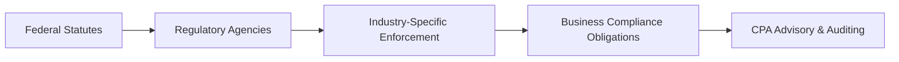

## 10.4 Other Federal Statutes and Industry-Specific Rules

Federal statutes and regulations extend far beyond general corporate governance or employment matters; many industries operate under specialized regulatory frameworks that require additional compliance considerations. This section focuses on notable legislation, industry-specific regulations, and the compliance reminders critical to various sectors of the U.S. economy. For CPA candidates, understanding these laws is essential not only for the REG Examination but also for advisory and assurance services in actual practice.

This chapter builds on insights from previous sections of “Chapter 10: Federal Laws and Regulations Affecting Business” and aims to reinforce a comprehensive view of the external legal environment. By exploring key federal statutes and specialized frameworks, you will better comprehend how businesses might face unique compliance demands based on their operating industry.  

-----------------------------------------------
### Overview of Specialized Federal Regulation

While many federal statutes, such as the Internal Revenue Code and the Fair Labor Standards Act, apply broadly to most for-profit entities, certain industries remain subject to more acute regulations. These rules typically originate from the necessity to protect public health, safety, welfare, financial stability, and to maintain fair competition. They can include:

• Acts that govern health and safety standards.  
• Environmental protection laws.  
• Banking and financial services regulations.  
• Telecommunications statutes.  
• Industry-specific anti-fraud or anti-corruption measures.  

Though the CPA Exam does not require mastery of every granular detail within each specialized statute, exam takers should be able to recognize major provisions, understand associated compliance obligations, and identify typical risks or penalties for non-compliance.

Below, we examine some prominent pieces of federal legislation and industry-specific rules commonly encountered in practice.  

-----------------------------------------------
### Banking and Financial Services Regulations

#### Gramm-Leach-Bliley Act (GLBA)
The Gramm-Leach-Bliley Act (GLBA) governs how financial institutions handle the private information of individuals. Under GLBA, financial institutions that offer loans, financial advice, or insurance must safeguard customer data and provide disclosures regarding their information-sharing practices. Key points include:

• Establishing a written information security plan to protect customer data.  
• Providing annual privacy notices to customers describing information-sharing policies.  
• Allowing consumers to opt-out of certain disclosures.  

Non-compliance with GLBA can result in heavy fines and reputational damage. CPAs in financial institutions may assist with the creation and auditing of data protection policies or ensuring that the institution’s privacy notices conform to regulatory directives.

#### Patriot Act and Anti-Money Laundering (AML)
Following the events of September 11, 2001, the USA Patriot Act strengthened Anti-Money Laundering (AML) regulations. Financial institutions must implement robust procedures to detect and prevent money laundering, terrorist financing, and other financial crimes. Essential AML components:

• Customer Identification Programs (CIP), verifying each client’s identity.  
• Suspicious Activity Reports (SARs), which must be filed when unusual or suspicious transactions are detected.  
• Ongoing employee training and internal auditing to ensure compliance.  

From a CPA’s perspective, ensuring AML compliance requires diligent recordkeeping, risk assessments, and reporting protocols. Prudent CPAs help banks and financial institutions design internal controls to reduce the risk of regulatory violations.

#### Dodd-Frank Wall Street Reform and Consumer Protection Act
The Dodd-Frank Act introduced sweeping changes to financial regulation following the 2008 financial crisis. Its key provisions include:

• Increased oversight of banks deemed “too big to fail.”  
• Creation of the Consumer Financial Protection Bureau (CFPB) to protect consumer interests.  
• Restrictions on proprietary trading under the Volcker Rule.  

For CPAs auditing or consulting for financial entities, familiarity with Dodd-Frank provisions is crucial. This includes understanding risk retention requirements, enhanced capital adequacy, executive compensation structures, and possible ramifications for bank accounting and disclosures.

-----------------------------------------------
### Healthcare Regulations

#### HIPAA (Health Insurance Portability and Accountability Act)
Healthcare providers and insurance entities fall under the strict requirements of HIPAA, which focuses largely on protecting patient health information (PHI). Key aspects include:

• Privacy Rule: Defines and governs the use and disclosure of PHI.  
• Security Rule: Requires administrative, physical, and technical safeguards to protect electronic PHI (ePHI).  
• Breach Notification Rule: Mandates notifications to affected individuals and the HHS Secretary in the event of a breach.  

CPAs working with healthcare clients should verify that internal controls and IT systems comply with HIPAA’s security standards. Auditing for HIPAA compliance often involves testing the integrity of access controls, data encryption, and backup systems.

#### Affordable Care Act (ACA) Industry-Specific Components
While the ACA broadly impacts employers, some provisions particularly affect healthcare institutions:

• Mandated coverage expansions and consumer protections.  
• Tax incentives for certain plans that meet ACA criteria.  
• Changes to Medicare reimbursement models incentivizing cost and quality improvements.  

Healthcare organizations are also subject to cost-reporting obligations and value-based incentive measurements. CPAs in healthcare must be aware of how ACA changes can impact financial projections, tax implications, and regulatory compliance.

-----------------------------------------------
### Environmental Regulations

#### Clean Air Act (CAA) and Clean Water Act (CWA)
Manufacturing, energy, and chemical industries face stringent rules to limit pollutants and protect natural resources. The EPA (Environmental Protection Agency) enforces the Clean Air Act and Clean Water Act to:

• Regulate emissions of hazardous air pollutants.  
• Set water quality standards and regulate discharges into U.S. waters.  
• Require operating permits for large emission sources.  

Compliance typically involves obtaining permits, monitoring emissions, and submitting regular reports. Environmental violations can result in expensive fines, cleanup costs, and reputational loss. CPAs can support organizations in calculating and disclosing contingent liabilities related to potential environmental penalties or remediation efforts.

#### Resource Conservation and Recovery Act (RCRA)
The RCRA governs the handling, storage, and disposal of hazardous wastes. Companies dealing with chemicals, solvents, or other hazardous byproducts must maintain significant documentation illustrating safe collection, transport, and disposal. Besides direct compliance, CPAs often assist with cost allocation for waste management activities and calculating liabilities for site cleanup or future disposal obligations.

-----------------------------------------------
### Telecommunications Regulations

#### Federal Communications Commission (FCC) Policies
Telecommunications companies, media outlets, and broadcasting entities must comply with FCC regulations governing licensing, spectrum allocation, and consumer protection:

• Licensing requirements for broadcasting and satellite operations.  
• Prohibitions on monopolistic or anti-competitive practices.  
• Consumer-protection rules governing phone, television, and internet services.  

CPAs in telecom may assist clients with meeting financial reporting rules connected to FCC license acquisition, usage fees, or universal service contributions. Non-compliance could lead to hefty fines or loss of broadcast licenses.

#### Children’s Online Privacy Protection Act (COPPA)
Organizations seeking to engage an online audience of children under 13 must adhere to COPPA. This law, enforced by the FTC, sets stringent rules around data collection, usage, and parental consent. Tech and media firms are particularly vulnerable to compliance risks if their digital platforms target minors. CPAs might not typically lead compliance efforts in this realm but should be aware of data protection liabilities that can significantly affect financial statements.

-----------------------------------------------
### Defense Industry and Government Contracting

#### Federal Acquisition Regulation (FAR)
Businesses contracting with the federal government must comply with FAR, which outlines procurement standards, cost allocation, and certification requirements for contractors. Common obligations include:

• Maintaining a standardized cost accounting system.  
• Submitting accurate and transparent bids.  
• Complying with certain labor laws (e.g., Service Contract Act).  

Given the significance of defense-related spending, specialized contractors may rely on CPAs to handle cost-accounting standards (CAS) compliance, overhead rate structures, and government audit scrutiny under the Defense Contract Audit Agency (DCAA).

#### International Traffic in Arms Regulations (ITAR) and Export Administration Regulations (EAR)
Companies dealing with defense articles or dual-use goods must ensure compliance with ITAR and EAR. These frameworks control the export and import of military and certain commercial technologies. Violations can result in severe penalties or loss of export privileges. CPAs, particularly those in international tax or supply chain finance, should remain vigilant about cost structures, transfer pricing, and inventory reporting practices that interface with restricted goods.

-----------------------------------------------
### Cross-Industry Legislation and Anti-Corruption Measures

#### Sarbanes-Oxley Act (SOX)
Although SOX primarily affects publicly traded companies by imposing strict financial reporting and internal control requirements, it also contains aspects relevant to multiple industries:

• Mandates robust internal controls over financial reporting (ICFR).  
• Requires certification of financial statements by CEOs/CFOs.  
• Prescribes criminal penalties for fraudulent activities or destruction of records.  

CPAs are frequently at the forefront of SOX compliance, ensuring that management’s assessment of internal controls accurately reflects operational realities. Companies must document all processes that could materially affect financial statement accuracy.

#### Foreign Corrupt Practices Act (FCPA)
Previously addressed in Section 10.3 (The Foreign Corrupt Practices Act and Anti-Bribery Regulations), the FCPA remains critical for U.S. companies operating globally. It criminalizes bribing foreign officials, mandating that multinational enterprises maintain accurate internal controls, books, and records.

-----------------------------------------------
### Real-World Scenarios and Practical Compliance Steps

Below is a simple diagram illustrating how specialized federal statutes and associated agencies interact with businesses:

• A -> B (Federal Statutes to Regulatory Agencies): Congress enacts laws, which agencies like the EPA, FCC, or HHS interpret and enforce.  
• B -> C (Agencies to Industry-Specific Enforcement): Each agency tailors regulations and enforcement actions to specific industry segments.  
• C -> D (Industry Enforcement to Business Compliance): Companies must build compliance programs that satisfy unique statutory provisions.  
• D -> E (Compliance to CPA Role): CPAs support business compliance through advisory, internal audits, and external assurance engagements.

-----------------------------------------------
### Compliance Best Practices

1. Develop Targeted Policies and Procedures  
   Each specialized industry demands a unique compliance approach. Written policies and procedures should be continually updated to reflect current federal mandates, with employees trained to recognize red flags or appropriate internal reporting channels.

2. Perform Internal Risk Assessments  
   Robust internal risk assessments can uncover potential vulnerabilities to regulatory violations. For instance, a financial institution subject to the Patriot Act AML obligations might identify gaps in its suspicious activity monitoring, whereas a defense contractor might discover insufficient controls over cost allocations.

3. Maintain Accurate and Transparent Records  
   Comprehensive recordkeeping is a recurring theme across healthcare, environmental, finance, and other industries. CPAs usually spearhead the documentation process by designing record retention policies and verifying that the organization’s financial statements accurately capture compliance costs and liabilities.

4. Provide Ongoing Training and Ethical Guidance  
   Ethical lapses often underlie regulatory breaches. Regular training in relevant statutes fosters a compliance culture, making employees more likely to adhere to procedures and report suspicious conduct. CPAs are well-positioned to help organizations develop training manuals or scenario-based learning modules.

5. Engage External Experts When Necessary  
   Specialized industries often require niche expertise. Environmental engineers, pharmaceutical compliance officers, or data privacy attorneys may be consulted to ensure that industry-specific nuances are adequately addressed.

-----------------------------------------------
### Common Pitfalls and Challenges

• Underestimating Regulatory Overlaps  
  Multiple statutes can apply simultaneously. For example, a healthcare entity might need to meet both HIPAA and FTC data protection standards. Failing to reconcile overlapping requirements may lead to enforcement actions.

• Attempted “One-Size-Fits-All” Compliance Programs  
  Policies effective in one industry may falter in another. For instance, the internal controls demanded by government contractors differ substantially from those needed by a small tech startup. 

• Insufficient Monitoring of Regulatory Changes  
  Statutes like Dodd-Frank undergo periodic amendments, which might expand or contract their scope. Staying informed of legislative developments ensures ongoing compliance and reduces risk.

• Limited Internal Audit Capabilities  
  Organizations overly reliant on external audits may find themselves racing to catch up on compliance issues. An internal audit function with specialized industry knowledge serves as the first line of defense.

-----------------------------------------------
### Illustrative Case Study

Consider a mid-sized medical device manufacturer, “AlphaCare, Inc.,” that expands operations internationally. AlphaCare must comply with:

• FDA and FTC regulations on device safety, marketing, and consumer protection.  
• HIPAA requirements if devices store or transmit patient medical data.  
• FCPA scrutiny for any operations in foreign markets, particularly in awarding government contracts or engaging with healthcare officials abroad.  
• Export control laws (EAR/ITAR) if devices have potential military applications.  

As AlphaCare grows, it might encounter complications reconciling these varied demands. The CFO, with the help of CPAs, must establish robust internal controls, track device usage and licensing, continuously monitor updates in FDA guidelines, and ensure that all foreign transactions follow FCPA rules. CPAs play a pivotal role—performing internal audits, verifying cost allocations, advising on permissible employee travel reimbursements, and coordinating compliance efforts across multiple jurisdictions.

-----------------------------------------------
### Industry-Specific Resources and Tools

• Agency Websites  
  Regulatory entities (e.g., EPA, FCC, HHS) publish guidance documents, FAQs, and compliance checklists online. Frequent consultation of official resources helps keep compliance measures current.

• Specialized Legal Counsel  
  In sectors like defense or pharmaceuticals, attorneys versed in niche regulations can offer essential interpretations and strategies, especially when new legislation or guidance is issued.

• Professional Associations  
  Industry groups often provide seminars, continuing education, and best practice toolkits. For instance, the American Bankers Association publishes AML compliance manuals, while the Healthcare Compliance Association offers HIPAA training courses.

• Auditing Standards and Frameworks  
  The AICPA’s auditing and attestation standards, combined with government auditing standards (the “Yellow Book”), can shape evaluations of internal control environments for specialized industries.

-----------------------------------------------
### Conclusion

Successfully navigating federal statutes and industry-specific rules requires a comprehensive understanding of overlapping government mandates and vigilant adherence to compliance protocols. For CPA candidates and practicing accountants alike, the capacity to identify relevant regulations, assess compliance costs and risks, and recommend effective internal controls stands as a competitive and professional advantage. Whether working with banks regulated by the Patriot Act, hospitals beholden to HIPAA, or manufacturers subject to environmental controls, CPAs play a critical role in maintaining ethical, transparent, and legally sound business operations.

Achieving expertise in these statutes goes beyond exam preparation; it ensures that you can offer robust advisory services in any specialized environment your clients or employers face. By integrating specific policies, enacting risk-based internal controls, championing a culture of compliance, and keeping apprised of legislative changes, organizations—and the CPAs who guide them—can confidently satisfy the demands of modern regulatory landscapes.

-----------------------------------------------

## Master Federal Statutes & Specialized Industry Compliance: Quiz



### Which federal act imposes privacy requirements on financial institutions and mandates customer notifications concerning data-sharing policies?

- [ ] The Foreign Corrupt Practices Act (FCPA)
- [x] The Gramm-Leach-Bliley Act (GLBA)
- [ ] The Defend Trade Secrets Act (DTSA)
- [ ] The Resource Conservation and Recovery Act (RCRA)

> **Explanation:** The Gramm-Leach-Bliley Act (GLBA) requires financial institutions to safeguard sensitive consumer information and provide clear notices about their data-sharing practices.

### Under the Patriot Act’s AML provisions, which of the following is NOT a typical requirement for financial institutions?

- [ ] Implementing Customer Identification Programs (CIP)
- [ ] Filing Suspicious Activity Reports (SARs)
- [x] Paying a flat annual tax on cross-border transactions
- [ ] Providing employee training on AML and terrorism financing policies

> **Explanation:** While CIP, SARs, and staff training are integral elements of AML compliance, there is no mandated “flat annual tax on cross-border transactions” under the Patriot Act.

### In the healthcare sector, which aspect of HIPAA focuses on the safeguarding of electronic protected health information?

- [ ] Breach Notification Rule
- [x] Security Rule
- [ ] Privacy Rule
- [ ] Compliance Rule

> **Explanation:** HIPAA’s Security Rule outlines administrative, physical, and technical security measures to protect electronic protected health information (ePHI) from unauthorized access or breaches.

### Which of the following laws primarily governs export and import controls related to defense articles?

- [ ] Sarbanes-Oxley Act (SOX)
- [ ] Gramm-Leach-Bliley Act (GLBA)
- [x] International Traffic in Arms Regulations (ITAR)
- [ ] Fair Labor Standards Act (FLSA)

> **Explanation:** ITAR (and, to a related extent, EAR) establishes oversight for defense articles, services, and certain dual-use items to ensure they are not unlawfully exported to restricted entities or nations.

### The Dodd-Frank Wall Street Reform and Consumer Protection Act led to the creation of which regulatory body to protect consumer interests?

- [ ] Food and Drug Administration (FDA)
- [ ] Federal Trade Commission (FTC)
- [x] Consumer Financial Protection Bureau (CFPB)
- [ ] Environmental Protection Agency (EPA)

> **Explanation:** Dodd-Frank created the CFPB to oversee consumer financial products and services, ensuring fair and transparent practices in the financial marketplace.

### Which regulation specifically addresses ensuring the safety of water quality and regulating industrial discharges into U.S. waters?

- [x] Clean Water Act (CWA)
- [ ] Clean Air Act (CAA)
- [ ] Resource Conservation and Recovery Act (RCRA)
- [ ] Patriot Act

> **Explanation:** The CWA regulates pollutant discharges into U.S. waters and establishes quality standards to safeguard water resources.

### If an organization’s digital platforms target children under 13, which law primarily governs online data collection and parental consent requirements?

- [ ] Children’s Health Insurance Program (CHIP)
- [ ] HIPAA
- [ ] ACA
- [x] Children’s Online Privacy Protection Act (COPPA)

> **Explanation:** COPPA is enforced by the FTC to protect children under 13 from unauthorized collection or misuse of their personal information online, requiring parental consent and transparency.

### Failure to comply with the Federal Acquisition Regulation (FAR) when selling goods or services to the U.S. government could result in:

- [ ] No penalty, since FAR is voluntary
- [x] Contract termination or financial penalties
- [ ] Automatic reinstatement of contracts
- [ ] A mandatory switch to the private sector

> **Explanation:** Non-compliance with FAR may lead to termination of government contracts, financial penalties, or debarment from future federal contracting opportunities.

### A manufacturing firm subject to the Clean Air Act (CAA) would primarily need to manage which of the following from factory operations?

- [x] Emissions of air pollutants
- [ ] Disclosures around corporate governance
- [ ] Customer privacy forms
- [ ] Bank Secrecy tracking

> **Explanation:** The Clean Air Act mandates monitoring and controlling emissions of specific airborne pollutants to protect environmental and public health.

### The Sarbanes-Oxley Act (SOX) requires which corporate officers to certify financial statements for public companies?

- [x] Chief Executive Officer (CEO) and Chief Financial Officer (CFO)
- [ ] Board of Directors only
- [ ] Chief Operations Officer (COO) and Audit Manager
- [ ] Controller and External Audit Partner

> **Explanation:** Under SOX, CEOs and CFOs of public companies must personally certify that the financial statements and disclosures accurately represent the company’s financial condition.



-----------------------------------------------

## For Additional Practice and Deeper Preparation

### [Taxation & Regulation (REG) CPA Mock Exams](https://www.udemy.com/course/reg-cpa-mock-exams/?referralCode=55419EBD198F61530B12)

Taxation & Regulation (REG) CPA Mocks: 6 Full (1,500 Qs), Harder Than Real! In-Depth & Clear. Crush With Confidence!

- Tackle full-length mock exams designed to mirror real REG questions.  
- Refine your exam-day strategies with detailed, step-by-step solutions for every scenario.  
- Explore in-depth rationales that reinforce higher-level concepts, giving you an edge on test day.  
- Boost confidence and minimize anxiety by mastering every corner of the REG blueprint.  
- Perfect for those seeking exceptionally hard mocks and real-world readiness.  

_Disclaimer: This course is not endorsed by or affiliated with the AICPA, NASBA, or any official CPA Examination authority. All content is for educational and preparatory purposes only._
